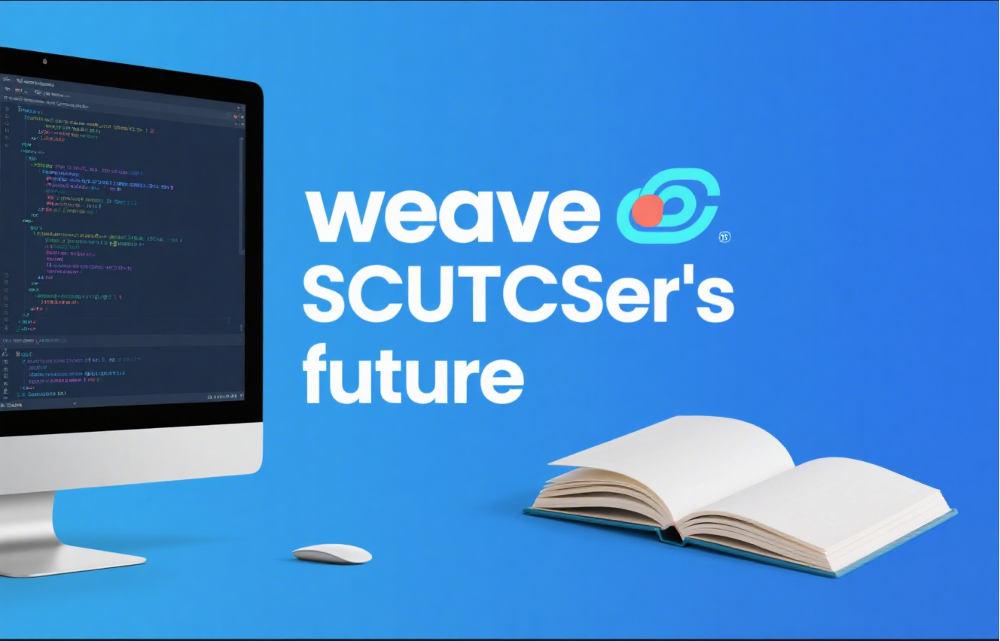

<h1 align='center'>华南理工大学计算机科学与工程学院学习资料汇总仓库说明</h1>

## 项目概览

欢迎来到华南理工大学计算机科学与工程学院学习资料汇总仓库！这里是 SCUTCSer 学习资源的宝库，旨在为同学们提供丰富、实用的学习资料 。  

## 仓库内容
### 学科学习资料  
涵盖学院各学科的核心学习资料，助力系统掌握专业知识。  

### 期末考试卷纸  
收集整理多学期期末考试卷纸，帮助同学们了解考试题型与重点，高效备考。  

## 项目贡献与招募
目前由本人 **AlexBybye** 负责上传收集到的内容，但个人力量有限。若你也想为大家贡献一份力量，欢迎加入 **SCUTCSWeaver** 组织，让我们携手 **weave SCUTCSer 的 future**！  

## 资料加密说明
为维护学习公平性，避免大量雷同作业及不劳而获现象，本项目针对以下内容加密压缩处理:
- 学科平时作业  
- 平时小组作业  
- 课程设计  
- 上机考试代码  

# 请 诚 信 学 习 ！
## 支持我们
如果觉得仓库内容有帮助，可通过 **buy us a coffee** ，请 contributors 喝杯咖啡，你的支持会让我们更有动力完善资料～  

若使用中遇问题或有建议，欢迎随时反馈，期待与你共同完善这份学习资料宝库！
