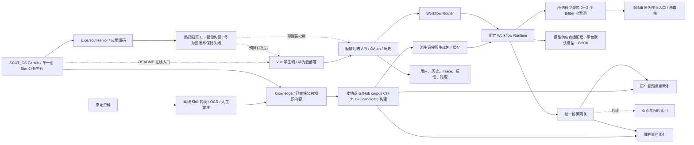

# SCUT 老学长 V3 基座 PLAN（已确认版）

版本：1.11

确认日期：2026-08-16

状态：本次产品讨论的唯一基座，后续可以继续修改

> 本文汇总本次讨论中已经确认的产品、资料、数据和开发边界，不按周次或人日排期。此前的征询稿、架构备选稿、分工草案与本文冲突时，以本文为准。
>
> 1.3 修订沉淀：强制 GitHub 登录；统一折叠输入框；跨课程受控开关；7 天登录会话、30 天历史、7 天临时材料/附件；资料稀疏时以历年题组织和题目辅导为主要价值；取消独立学术诚信拦截；临时材料可主动提交为维护者审核的 GitHub PR。1.3 对“无限额度免费模型”的旧假设已经由 1.6 的实际供应商额度决策替代。
>
> 1.4 修订沉淀：用户 BYOK 改为随当前 GitHub 登录会话加密保存，最长 7 天且不晚于该会话到期；五个 Workflow 共用知识点关键词驱动的 Bilibili 延伸学习节点（运行时输出已由 1.8 收敛为匿名搜索入口）；SCUT_CS GitHub 仓库作为公共课程知识库事实源，华为云服务器作为后端运行边界；补齐 Markdown 定位标记、chunk 元数据和引用回查链路。
>
> 1.5 修订沉淀：SCUT_CS 作为本项目唯一公开主仓，除公共课程知识内容外，也直接维护 `apps/scut-senior/` 下的前端、后端、Workflow、语料构建与部署源码，不另建主要应用代码仓；应用变更与知识内容变更使用按路径隔离的 CI/CD，华为云只接收应用镜像和知识库构建产物，不完整检出约 10GB～15GB 资料；GitHub Project 仅作为可选任务看板，不承担源码、Star 或部署职责。
>
> 1.6 修订沉淀：平台无需用户 Key 的通道改为 OpenRouter 每日免费额度通道，目录分类为 `platform_daily_free_quota`；首批固定登记 Google · Gemma 4 26B A4B、Dots Studio · Dots3 Note Preview、NVIDIA · Nemotron 3 Super 120B A12B，由用户显式选择。额度耗尽或模型不可用时明确报错，不自动切换到用户 Key、其他模型或付费端点。
>
> 1.7 修订沉淀：华为云未来首发基线下调为华南-广州优先的 1C2G、40GB、1～2Mbps，预算获批前继续保持部署关闭，不创建资源；Bilibili 不抓取具体视频，本次所选大模型聚焦少量检索词后，后端必须生成可匿名打开的 Bilibili 搜索链接。
>
> 1.8 修订沉淀：Bilibili 运行时资源进一步收敛为匿名关键词搜索入口；所选模型产出安全聚焦词后，后端只生成固定 Bilibili 搜索页 URL，不匹配、返回或展示任何具体视频直链。
>
> 1.9 修订沉淀：Bilibili 彻底采用 search-only 边界。项目不建设、审核或维护任何具体视频资产，不设置相关目录、Fixture、CI 或维护责任；该能力只保留模型输出 0～3 个聚焦词、后端在关键词非空时生成唯一匿名搜索入口。BYOK 每家只选一个主流、当前可调用且有官方示例依据的模型；这里只冻结目录，不把目录登记冒充真实用户 Key 的线上调用证据。
>
> 1.10 修订沉淀：BYOK 首批供应商立即调整为 OpenRouter、DeepSeek（深度求索）、硅基流动（SiliconFlow）和智谱（Zhipu），不保留被移除供应商的枚举或兼容项。固定目录为 OpenRouter `deepseek/deepseek-v4-flash-0731`、DeepSeek `deepseek-v4-flash`、硅基流动 `Pro/zai-org/GLM-4.7`、智谱 `glm-5.2`；后两项依据 2026-08-16 官方可调用示例冻结，只有当前登录会话已保存 Key 且该项启用时才进入可选模型列表。
>
> 1.11 修订沉淀：第一阶段学科范围收敛为 10 门；大学物理实验／大物上实验与 SRP 教程、结题和经验材料只做源资料隐私清理，不进入学科 Markdown、manifest 或检索语料。普通资料采用自动全量检查加首、中、尾及特殊块抽查，避免重复逐页验证。

## 1. 产品定位

SCUT 老学长不是通用模型的聊天壳，而是：

> 以 SCUT 课程资料和历年题为证据基础，允许用户显式补充通用模型知识，并通过固定学习 Workflow 提供知识答疑、真题关联、备考复习、题目辅导、错题复盘和临时材料精读的课程智能助手。

它相对直接询问 Gemini、豆包等通用 Chat 的价值来自：

- 预先处理并按课程组织 SCUT 仓库资料，长期能够扩展到约 10GB 全量资料；
- 以现有高 Star 的 SCUT_CS GitHub 仓库作为唯一公开主仓：既维护公共课程知识内容，也直接维护可查看、运行和贡献的 RAG/Chat 应用源码，并在仓库 README 中提供在线入口；
- 回答能够定位到具体资料、页码、幻灯片或历年题题号；
- 历年题按题目级建立索引，可以关联知识点和相似真题；
- 五种固定 Workflow 将普通问答变成可复用的学习过程；
- 课程公共分析和备考结果可以预生成并缓存，避免每位用户重复消耗模型调用资源；
- 用户可以控制回答只使用课程资料，还是允许明确标记的通用知识补充；
- 五种 Workflow 都可以让本次所选模型聚焦知识点检索词，再由后端提供 Bilibili 匿名搜索链接；
- 回答、来源、真实执行 Trace、反馈和错题可以形成可复查的个人历史。

如果最终只把用户问题转发给通用模型，这个项目就没有成立的必要。课程资料的组织、历年题题目级索引、来源标记和固定 Workflow 才是核心能力；资料覆盖不足时不伪装成完整教材。

### 1.1 资料稀疏时的真实产品价值

不假设每门课程都有完整教材、稳定课件或足够历年题。不同课程的资料覆盖可能很薄，知识答疑不能把“仓库没有资料”包装成完整课程知识库。

在资料稀疏的现实下，产品的主要差异化是：

- 把已有历年卷按题目拆分、标注和组织，支持按知识点、题型、年份检索和相似题关联；
- 把零散课程资料、历年题和用户补充材料放在同一课程上下文中使用；
- 让 `exam_review` 和 `problem_tutor` 成为优先展示的主 Workflow，围绕“做题—讲解—找相似题—错题复盘”形成闭环；
- 资料不足时平稳退化到通用模型解释，并明确哪些内容没有课程资料依据，而不是把“证据不足”当成产品终点。

历年题可以生成客观的考点出现次数、年份覆盖和题型分布统计；这些是资料统计，不是考试重点预测，也不输出命题概率或“必考”结论。

产品价值表述采用：**不是声称比通用模型知道更多，而是更方便地回答“这门课过去考过什么、这道题和哪些真题相近、资料还缺什么”。**

## 2. 当前课程范围

第一阶段按当前仓库已经确认的大一全年课程单元逐课接入：

1. 工科数学分析 I；
2. 工科数学分析 II；
3. 线性代数；
4. 概率论；
5. C++（上及下）；
6. 离散数学；
7. 英语；
8. 计算机科学概论；
9. 信息安全／信息安全导论；
10. 大学物理 III（一）／大物上。

大学物理实验（一）／大物上实验不进入学科知识库；SRP 教程、结题和经验材料同样排除。两类资料仍须执行源文件隐私清理，但不生成学科 Markdown、manifest 记录或检索语料。

此前约 202 份的格式盘点包含现已排除的大学物理实验资料，因此不再作为当前 10 门课程的有效候选数量；后续统计以实际 manifest 和重新清点结果为准。资料转换先覆盖以上 10 门，不自动扩展到仓库其他课程。

课程规则：

- C++ 上下册共用一个课程入口，不再拆出 C++（一）；
- 所有问答都必须先完成 GitHub 登录；匿名问答不进入产品范围；
- 默认仍按单课程检索，一段对话默认绑定一门课程；
- 统一输入框提供“跨课程”开关。关闭时切换课程新建对话；打开时由用户明确选择课程集合，检索和来源必须标明课程归属；
- 跨课程开关默认关闭，打开时提示可能增加检索范围、上下文和模型 Token 消耗（BYOK 可能增加供应商费用），也可能增加术语混淆；系统不得静默跨课程；
- 支持连续追问；
- 支持中文和英文提问；
- 跨课程能力先以受控开关和 feature flag 形式保留，逐课程评测稳定后再扩大开放范围。

课程资料可以逐门通过评测后开放，不要求薄弱课程阻塞已经达标的课程。

## 3. 用户、登录、模型和费用

### 3.1 默认模型与用户自带 API Key

模型调用提供两条互相独立的通道，用户可以在模型选择器中切换：

| 通道 | 用户是否需要填写 Key | 费用和额度含义 | 适用场景 |
| --- | --- | --- | --- |
| 平台每日免费额度模型 | 否 | 使用项目服务端 OpenRouter Key 和每日刷新但有限的共享免费额度；不静默切换到付费模型 | 开箱即用、额度可用时 |
| 用户自带 Key（BYOK） | 是 | 费用、免费额度、促销额度和限流均由用户所绑定的供应商账户决定 | 高频使用、切换更强模型或平台默认模型暂不可用时 |

这里的“免费”只表示用户无需为平台通道单独填写 Key 或付费，不表示调用次数无限。2026-08-15 核验的 OpenRouter 官方上限为每分钟 20 次；项目账号累计购入 credits 少于 10 美元时每天 50 次，至少 10 美元时每天 1000 次。额度由平台账号共享并每日刷新，条款、模型免费状态和上游可用性可能变化，不能把它描述为无限额度。

首批平台目录只登记以下固定 `:free` 模型，前端必须显示公司名并由用户显式选择：

- Google · Gemma 4 26B A4B（`google/gemma-4-26b-a4b-it:free`）；
- Dots Studio · Dots3 Note Preview（`dots-studio/dots-3-note-preview:free`）；
- NVIDIA · Nemotron 3 Super 120B A12B（`nvidia/nemotron-3-super-120b-a12b:free`）。

系统默认模型池的规则：

- 由后端维护受支持的供应商和模型目录，不允许前端自行拼接任意供应商地址；
- 目录至少标注 `platform_daily_free_quota`、`user_free_quota`、`promotional`、`paid` 或 `unknown`；平台通道只开放上述三项经核验的 `platform_daily_free_quota` 固定模型 ID；
- 平台目录记录 `last_checked_at`，并通过 Key 状态与公开模型目录检查模型 ID、零价格状态、结构化输出支持及目录接口可达性；条件变化时将模型明确标记为不可选。该检查不发起推理，不能证明回答链路实时可用；运行时 429／5xx 仍按本次请求单独报错；
- 平台通道不设置按 Token 计费的降级链路。若出现分钟限流、每日额度、服务可用性或反滥用限制，系统应区分并如实提示；
- 每日额度耗尽时固定提示“今日平台免费额度已用完，第二天再来重试吧！着急请使用你自己的 API Key。”；只提供用户主动切换入口，不自动使用用户 Key；
- OpenRouter 项目 Key 只保存在服务端 Secret 中，不下发浏览器，也不进入仓库、数据库、响应、历史、Trace 或日志；任何已暴露旧 Key 必须撤销并轮换；
- 默认模型调用仍经过项目后端，以便执行课程过滤、Workflow、引用校验、历史保存和 Trace；
- 请求只携带用户选中的单一固定模型 ID，不使用跨模型 fallback；模型不可用时明确失败。

BYOK 是可选能力而非唯一入口：

- 用户可以新增自己的 API Key，并选择项目明确适配的供应商和模型；
- 首批供应商白名单及每家唯一模型目录已冻结为四项：OpenRouter `deepseek/deepseek-v4-flash-0731`（2026-08-15 OpenRouter 周榜第 1）、DeepSeek（深度求索）`deepseek-v4-flash`（官方稳定别名）、硅基流动（SiliconFlow）`Pro/zai-org/GLM-4.7`（2026-08-16 官方 Chat Completions 默认示例）、智谱（Zhipu）`glm-5.2`（2026-08-16 当前可调用旗舰与 OpenAI 兼容示例）；智谱 GLM-5.3 当日仍明确标注 API 尚未上线，因此不进入目录；
- 四家均使用服务端固定 endpoint（无用户可选地区或地址）和 Bearer Key：OpenRouter `https://openrouter.ai/api/v1/chat/completions`、DeepSeek `https://api.deepseek.com/chat/completions`、硅基流动 `https://api.siliconflow.cn/v1/chat/completions`、智谱 `https://open.bigmodel.cn/api/paas/v4/chat/completions`；前端不得提交或覆盖地址；
- 2026-08-16 01:05 CST 的新增供应商冻结证据来自硅基流动官方[创建对话请求](https://docs.siliconflow.cn/cn/api-reference/chat-completions/chat-completions)与[JSON 模式](https://docs.siliconflow.cn/cn/userguide/guides/json-mode)，以及智谱官方 [GLM-5.2](https://docs.bigmodel.cn/cn/guide/models/text/glm-5.2)、[OpenAI API 兼容](https://docs.bigmodel.cn/cn/guide/develop/openai/introduction)和 [GLM-5.3 尚未开放 API](https://docs.bigmodel.cn/cn/guide/models/text/glm-5.3)说明；硅基流动没有公开调用量排名，因此只把 `Pro/zai-org/GLM-4.7` 表述为官方 Chat 默认示例，不声称已证明调用量最高；
- 上述冻结完成产品目录与受控路由决策，不表示项目方持有用户 Key，也不把注入 HTTP 替身的自动化测试冒充真实供应商实网证据；完成 GitHub 会话绑定、会话级 AEAD、受控调用与泄漏测试后，只有 `enabled=true` 且当前登录会话已保存对应 Key 的模型才进入可选列表；
- 用户承担该供应商账户实际产生的费用；是否存在免费额度以及免费/付费额度的消耗顺序由供应商账户决定，项目只展示目录中的提示；
- 不允许前端填写任意 `base_url` 或 `model_id`；首期只接入上述四组固定供应商／模型；
- 模型供应商和模型偏好可以保存；用户 API Key 只以绑定当前 GitHub 登录会话的密文保存，明文不持久化。

### 3.2 用户 API Key 随登录会话加密保存（最长 7 天）

以下规则只适用于用户自带的 API Key。系统默认模型所需的服务端凭证不下发到浏览器，保存在后端秘密配置中，并与用户凭据分开管理。

用户登录 GitHub 后，可以把自己的 API Key 通过 HTTPS 提交给后端。后端使用成熟库提供的认证加密（AEAD，例如 AES-GCM）保存，并绑定 `user_id + auth_session_id + provider_id`：

- 只在凭据专用存储中保存密文、nonce、算法/密钥版本、供应商和 `expires_at`；
- 到期时间与发起保存的 GitHub 登录会话一致，最长 7 天，不因页面刷新、开新标签页或普通模型调用自动续期；
- 登出、撤销会话、会话到期或用户主动删除时立即失效，并由清理任务删除密文；
- 新的独立登录会话默认重新输入 Key，不把凭据变成账号级永久保存；
- 加密主密钥在本地／CI 验证期只通过测试 Secret 或进程环境注入，正式部署后放入华为云运行 Secret；任何环境下都不进入 GitHub 仓库、数据库或日志；首版使用单一部署 Secret 和 `key_version` 即可，不建设复杂 HSM/KMS；
- 明文只在用户输入和实际调用供应商的进程内存中短暂存在，不进入数据库、历史、缓存、Trace、反馈、日志、异常上报或公共课程包；
- 页面只能查询“已配置／供应商／脱敏提示／到期时间”，不能取回明文或密文；服务端 Cookie 也不保存 Key 或密文；
- 加密保存只缓解数据库或备份泄露，不能防止已经被攻陷的运行中后端，产品不宣称绝对安全。

凭据持久化不等于授权后台自由调用。BYOK 只用于该用户明确发起的 Workflow；不得用于公共课程包、离线批处理、其他用户请求或无界后台任务。

### 3.3 GitHub OAuth：已确认用途与建议实现基线

GitHub OAuth 负责用户身份，以及所有问答、历史、反馈、错题和资料贡献的归属。所有问答接口都要求已登录会话：

- 使用 GitHub 不可变数字 ID 建立本地用户，不使用可能改名的 login 作为主键；
- 后端完成 OAuth 回调并校验 `state`；
- 登录状态使用服务端会话和 `HttpOnly + Secure + SameSite` Cookie；
- 用户 OAuth 不申请仓库写入、组织管理等无关权限；
- 如果后续不需要继续调用 GitHub API，身份确认后不长期保存 GitHub access token；
- 所有历史、反馈、错题和私有附件接口都必须检查当前用户归属。

登录会话有效期为 7 天，过期后重新登录；这表示会话 TTL，不表示 7 天后删除 GitHub 用户映射或立即删除内容历史。资料贡献若要自动创建 PR，使用项目维护的 GitHub App/机器人凭证（仅目标仓库的最小 Contents 与 Pull Requests 权限，禁止自动合并），不使用用户 OAuth token，也不把该服务端凭证写入数据库或日志。若暂时没有 App，则进入待处理队列，由维护者手动创建 PR。

GitHub OAuth 提供身份和 7 天会话边界；API Key 的实际加密、使用和清理由独立的会话凭据模块负责。

### 3.4 为什么仍然需要后端

正式调用链是：

```text
Vue 学生端
→ 项目后端
→ Workflow Router
→ 课程资料、历年题和课程预生成包
→ 根据模型选择使用系统默认凭证，或解密当前 GitHub 会话绑定的用户 Key 调用模型
→ 来源标记和引用校验
→ 保存回答、来源和 Trace
→ 流式返回前端
```

不能采用“前端 + Harness + API Key 直连模型”作为正式方案，因为后端仍要负责：

- 访问约 10GB 课程知识库；
- 默认单课程过滤，跨课程时只允许用户显式选择的课程集合；
- 检索课程资料和题目级历年题；
- 运行固定 Workflow；
- 使用课程预生成包和公共缓存；
- 判断资料证据是否充足；
- 执行来源标记和引用校验；
- 保存可信的历史、来源、Trace、反馈和错题；
- 隔离用户数据并避免把系统策略和大段资料发送给浏览器；
- 隐藏平台默认凭证，执行模型白名单、并发和供应商服务限流策略。

前端只在保存或替换凭据时通过 HTTPS 发送一次 Key；后续流式 Workflow 请求只携带登录 Cookie、模型选择和普通请求字段，不重复传输 Key。流式响应使用 `fetch`，便于处理登录状态、取消和结构化事件。

系统默认模型和 BYOK 都只在用户明确发起的 Workflow run 内进行短暂重试。页面断开时后端应尽力取消上游调用，不得因为已经保存密文就把用户 Key 放入离线队列继续运行。重新生成使用新的用户操作和幂等请求标识，避免重复调用或扣费。

## 4. Chat 的三组用户控制

三组控制互相独立，均为会话级设置。

### 4.1 回答方式

- 简短回答；
- 详细讲解；
- 举例说明；
- 分步骤提示。

概念对比属于支持的问题类型，不另设为第五种固定模式。

### 4.2 表达风格

- 助教式：默认；
- 复习搭子；
- 学长聊天。

回答先完成事实判断、证据判断和引用锁定，再由 `humanizer-zh` 做忠实润色。润色不得改变：

- 专业知识和结论；
- 数字、公式和术语；
- 是否存在资料依据；
- 不确定程度；
- 引用；
- 回答状态和来源标记。

如果润色前后保护内容不一致，使用未润色版本。

### 4.3 知识范围

提供两个按钮：

- `仅课程资料`；
- `资料优先，可补充通用知识`（默认）。

规则：

- 两种模式都先检索当前课程资料；
- 所有课程都允许用户主动开启通用知识补充，不再只限课程资料；
- 通用知识不能伪装成仓库资料，也不能生成仓库引用；
- `仅课程资料` 模式下资料不足时明确说明并停止猜测；
- 默认模式下资料不足时可以用通用模型补充，并用轻量“通用补充”标记说明没有课程资料依据；
- 后端仍保存 `repository`、`general` 等来源类型用于评测和排错，但学生端不强制把答案拆成两大段，保持一段连贯解释。
- 资料覆盖明显不足时可以显示“提交课程资料补充”入口，但上传和提交必须由用户主动操作。
- 默认模式可以附带 Bilibili 匿名关键词搜索入口；它是外部延伸学习资源，不是仓库证据，也不进入回答引用。

默认回答结构：

```text
连贯的回答……（必要处标记：通用补充）
```

跨课程开关与课程、Workflow、回答方式、风格和知识范围放在同一输入控制层；打开前提示可能增加检索范围、上下文和模型 Token 消耗（BYOK 可能增加供应商费用），用户确认后才运行。

### 4.4 统一折叠输入框

学生端只提供一个统一 Chat 输入框，不为五种 Workflow 建立五套页面。输入框默认收起 Workflow 切换面板；展开后显示每个 Workflow 的一行说明、适用场景、示例问题和所需输入。选中模式后，只显示该模式需要的附加字段：

- `knowledge_qa`：课程知识点问题；
- `exam_review`：大纲、考试条件或复习目标；
- `problem_tutor`：题干、用户作答和希望的提示层级；
- `mistake_review`：错题、原答案和复盘要求；
- `temporary_material_reading`：临时文本、Markdown 或后续附件。

课程选择、跨课程开关、回答方式、表达风格、知识范围和模型选择均在同一控制层完成。切换模式必须显式发送 `workflow_type`，不能静默改变任务或证据范围。首屏优先展示 `exam_review` 和 `problem_tutor`，但五种模式都保持可选。

### 4.5 Bilibili 匿名关键词搜索入口

五种 Workflow 共用一个 `bilibili_search_entry` 后处理节点，它不是第六个 Workflow。它复用本次回答模型已经理解的问题和课程上下文，要求模型只输出 0～3 个聚焦检索词；模型不能生成或猜测 URL：

```text
用户问题、课程和 Workflow 上下文
→ 所选回答模型输出 0～3 个聚焦检索词
→ 后端去重、限长和安全校验
→ 后端只在固定 Bilibili 搜索页基址上编码检索词
→ 关键词非空时只返回 1 条匿名搜索入口
```

各 Workflow 的关键词来源：

- `knowledge_qa`：用户正在询问的概念；
- `exam_review`：用户大纲、薄弱点或复习方案中的少量重点主题；
- `problem_tutor`：题目的主要知识点；
- `mistake_review`：错误根因对应的知识点；
- `temporary_material_reading`：材料标题和提取出的主要知识点，不按全文词频乱推。

首版采用“模型聚焦检索词 + 有安全关键词时唯一匿名搜索入口”：

- 检索词只能来自本次用户问题、课程和当前 Workflow 的少量结构化主题，不保存或展示模型 CoT，也不使用临时材料全文词频堆砌关键词；
- 后端不接受模型或前端提供 URL，只把校验后的检索词编码到固定的 `https://search.bilibili.com/all?keyword=...` 基址；用户打开链接时由 Bilibili 展示实时结果；
- 搜索入口统一标记为 `unreviewed_live_search`，`resource_id` 为空，并保存安全的检索词、URL 快照和生成时间；检索词顺序不代表项目质量评价；
- 项目不建设、审核或维护任何具体 Bilibili 视频资产，不保存 BVID，也不向用户返回具体视频页或其他视频直链；
- 2026-08-15 的匿名服务端验证中，Bilibili 搜索 API 会触发 412／验证码；产品不需要也不承诺服务端抓取具体视频，不依赖 WBI 私有接口或 HTML 抓取；
- 不读取字幕、不抓取视频正文、不总结视频内容、不把视频嵌入 RAG，也不使用播放量、点赞数等易变数据作为质量分数；
- 匿名搜索入口放入独立的 `external_resources[]`，不进入 `citations[]`，不能提高 `evidence_status` 或支撑回答事实；
- 学生端在答案下方折叠显示“B站延伸学习”，匿名搜索入口明确标注“搜索结果未审核”；整个节点失败不影响主回答；
- 默认“资料优先，可补充通用知识”模式开启；`仅课程资料` 模式强制关闭；
- 支持“搜索入口无法打开／关键词不相关”反馈；匿名搜索入口关联 URL 快照、课程、聚焦检索词、命中主题和生成时间，用于调整检索规则而不是自动改写知识库。

## 5. 五种已确认 Workflow

五种 Workflow 是同一 Chat 产品的五种任务模式，而不是五个独立站点。

固定枚举：

```text
knowledge_qa
exam_review
problem_tutor
mistake_review
temporary_material_reading
```

每次请求显式携带 `workflow_type`。系统可以建议切换模式，但不能静默改变任务、课程或知识范围。五种 Workflow 共同继承当前会话的 `answer_mode`、`tone`、`knowledge_scope`、课程范围、模型选择和 `include_bilibili_resources`；以下各节重点补充模式专属输入，必要时为可读性重述共同字段。各 Workflow 的输入、证据顺序和输出作为当前 V1 方案，具体字段在迭代 0 冻结。

下文所称“当前课程”在 `course_scope=single` 时是一门课程，在 `course_scope=cross` 时是用户明确选择的课程集合。

总体采用：

> 固定 Workflow 骨架 + 少量 Agent 判断节点 + 确定性工具节点。

Agent 可以理解问题、识别知识点、决定讲解组织方式；课程过滤、权限、检索、缓存、知识范围、来源标记和历史保存由确定性节点负责。系统不允许 Agent 自由循环、任意调用工具或修改知识库。

五种 Workflow 完成主要回答后都可以复用第 4.5 节的匿名搜索入口节点；关键词聚焦或入口生成失败不改变 Workflow 的回答状态。

### 5.1 知识答疑 `knowledge_qa`

用途：解释课程概念、原理、概念差异、常见误区，并支持多轮追问和换一种说法。

输入：

- 当前课程；
- 用户问题；
- 允许使用的多轮上下文；
- 回答方式、风格和知识范围；
- 是否展示相关真题。

流程：

```text
课程与问题检查
→ 识别问题类型和知识点
→ 检索当前课程资料
→ 并行检索历年题
→ 判断证据充足度
→ 资料优先生成回答；按用户开关补充通用知识或提示覆盖缺口
→ 推荐相关知识点和真题
→ 来源标记和引用校验
→ humanizer 忠实润色
→ 返回
```

输出：

- 课程资料内的直接解释；
- 资料优先的连贯解释，必要处标记通用补充；
- 相关知识点；
- 相关历年题；
- 资料覆盖不足时显示“提交课程资料补充”的可选入口；
- 折叠来源；
- 真实执行 Trace。

相关真题显示试卷、年份和题号，不把向量分数包装成“92% 相似”或答案正确概率。

### 5.2 备考复习 `exam_review`

用途：根据用户课程、大纲和复习条件，整合有证据边界的备考方案、代表题和建议。

用户可以提供：

- 课程；
- 考试大纲；
- 考试日期；
- 可投入时间；
- 目标和薄弱知识点；
- 回答方式、风格和知识范围。

有大纲时的证据优先级：

```text
用户大纲 > 课程资料 > 历年题 > 知识范围允许时明确标记的通用知识
```

无大纲时的证据优先级：

```text
历年题 > 课程资料 > 知识范围允许时明确标记的通用知识
```

无大纲结果必须说明：

> 以下内容依据仓库中的历年试卷和课程资料整理，不代表官方考试范围，也不构成考试重点预测。

输出包括：

1. 范围和证据说明；
2. 知识点分层；
3. 建议学习顺序；
4. 对应资料位置；
5. 历年题覆盖情况；
6. 客观的考点出现次数、年份覆盖和题型分布（可用表格或热力图展示）；
7. 按知识点组织的代表性题组和真题；
8. 可选的 AI 样题，必须明确标记；
9. 复习建议；
10. 未覆盖内容和证据边界。

备考复习允许生成一次性的课程复习方案，但不等于建设每日学习计划、考试重点预测或重复现有资料导航。

### 5.3 题目辅导 `problem_tutor`

用途：识别题目知识点、关联课程资料和相似真题，并按用户选择提供不同程度的帮助。

输入：

- 当前课程；
- 题干；
- 可选的用户作答；
- 需要知识点、思路、分步提示、完整讲解或答案分析；
- 可选的题目来源或年份。

流程：

```text
题目检查
→ 识别知识点
→ 检索课程资料
→ 检索相似历年题和已有题解
→ 给出用户选择层级的提示、讲解或作答分析
→ 来源标记和引用校验
```

文本题目先实现；截图、公式和图表题放在后续图片迭代。相似历年题必须来自题目级索引；AI 新生成的题必须标明“AI 生成练习题”。同一知识点的多道历年题可以组成题组，按定义、性质、计算和综合应用等题型串联。

### 5.4 错题复盘 `mistake_review`

用途：分析用户为什么错、正确推理是什么，以及如何避免再次出错。

输入：

- 原题或历史中的题目消息；
- 用户原答案；
- 可选的批注、标准答案或得分；
- 当前课程。

输出：

- 错误位置；
- 概念、条件、公式、方法、计算、审题或表达等错误类型；
- 正确推理过程；
- 下次检查动作；
- 相关课程资料和历年题；
- 可选的迁移练习。

错题必须由用户主动保存，不能因为回答失败就自动加入错题记录。错题关联用户、原题、用户答案、讲解、来源和当时语料版本，按历史内容默认保留 30 天。

### 5.5 临时材料精读 /提交课程材料`temporary_material_reading`

用途：处理老师刚发的大纲、课件、通知或用户临时提供的材料，并与仓库课程资料对照。

首个文本版本支持粘贴文本或 Markdown，后续再增加 PDF、Office 文件和图片上传。

规则：

- 临时材料与仓库资料使用不同的来源类型；
- 问“材料写了什么”时，以材料原文为第一依据；
- 问“材料说得对不对”时，以仓库资料验证其观点；
- 材料与仓库冲突时分别陈述，不隐藏冲突；
- 临时材料默认只在当前会话使用，不写入公共知识库、公共课程包或跨用户缓存；
- 用户可以主动点击“提交课程资料补充”，进入单独的贡献审核流程；未主动提交的材料绝不进入公共语料；
- 临时材料原文和图片附件默认保存 7 天，过期自动删除；提交贡献后，仓库中的审校 Markdown 按 PR/仓库审核规则管理，原始上传物仍按 7 天清理；

### 5.6 资料补充贡献（临时材料 → GitHub PR）

资料不足时，问答结果可以提示用户补充材料，但不自动把用户内容写入知识库。用户主动提交后：

```text
当前会话临时材料
→ 用户确认课程、来源和“有权公开分享/不含个人敏感信息”声明
→ 预检、转 Markdown 和人工预览
→ 维护者 GitHub App/机器人在隔离分支创建 PR
→ 维护者按资料审核标准 review
→ 合并后进入 candidate corpus
→ 重新构建并验收后进入 active index
```

规则：

- PR 不自动合并，PR 创建不等于进入知识库；
- 公开仓库中的 PR 可能永久公开，提交内容的公开范围在提交前明确提示；默认使用机器人和不透明贡献 ID，是否公开展示贡献者 login 另行取得同意；不适合公开的教材、课件、个人信息、密钥或来源不明材料不能走自动 PR 通道；
- PR 描述只包含课程、来源类型、原格式、页数、OCR 预检、贡献 ID 和审核清单，不写入 API Key、完整私密载荷或不必要的个人信息；
- 维护者可因版权、隐私、质量或来源问题关闭 PR；拒绝不会进入 candidate 或 active 索引；
- 贡献状态保持轻量：`draft`、`submitted`、`pr_open`、`merged`、`rejected`、`expired`；
- 用户只能查看自己的贡献状态和 PR 链接，不能通过贡献接口直接修改知识库；
- 临时会话原件按 7 天 TTL 清理；用户主动提交贡献后生成的待审附件和图片副本按 30 天 TTL 清理；合并后的公开 Markdown 受仓库审核和版本规则管理；
- 跨用户检索只能看到已经合并、审核通过并激活的内容，不能看到 pending、私有或被拒绝材料。

## 6. 历年题题目级索引

历年卷不能只按整份文档检索。应用代码在通过审核的 Markdown 上统一拆题并建立题目级索引，至少保留：

```text
course_id
year
paper
question_number
question_type
knowledge_points
difficulty
has_solution
source_id
source_locator
question_text
```

资料人员只需保证历年卷 Markdown 的内容、顺序和来源定位可用，不负责手工生成 chunk 或向量。

相似真题推荐综合使用当前课程、知识点、题型、关键词、语义相似度和是否存在题解。学生端显示真题标识，不把检索分数解释为真实概率。基于题目级索引可以统计知识点出现次数、覆盖年份和题型分布；统计结果必须标注样本年份和题目数量，不包装成考试预测。

## 7. 课程预生成包与缓存

为了避免每次备考请求都重新分析整门课程，由本地受控任务或 GitHub corpus CI 根据仓库中已审核的源文件和生成规则，为每门课程离线生成一个公共课程包；华为云部署恢复后只消费已经验证的产物，不要求小规格 ECS 承担全量构建：

```text
course-pack/
├── manifest.json
├── topic-tree.json
├── material-topic-map.json
├── past-paper-questions.json
├── topic-year-matrix.json
├── topic-frequency.json
├── default-review-outline.json
├── representative-questions.json
└── evidence-notes.json
```

课程包包含：

- 课程知识点树；
- 知识点与资料位置映射；
- 历年题拆题结果；
- 知识点—年份—题型关系；
- 基于现有样本的客观考点频次和题型分布；
- 默认复习框架；
- 代表性真题；
- 资料覆盖缺口和证据说明。

课程包的主轴是历年题题目索引、考点频次和题型分布；`topic-tree` 只是便于检索和复习组织的派生结构，不代表官方课程范围，也不等同于自动知识图谱。资料或历年题不足时保留“未知/未覆盖”，不由模型臆测完整范围。

运行时只根据用户大纲、剩余时间、目标和薄弱点做个性化调整。

规则：

- 缓存负责减少重复模型调用和用户 Key 的免费额度消耗，存储加密只负责保护内容，二者不能混为一谈；
- 公共课程包只使用已经人工通过的课程资料；
- 每项结论都应能回到资料或题目来源；
- 用户大纲、错题和学习状态不能并入公共课程包或共享缓存；
- 课程包至少绑定 `course_id`、`corpus_version`、`workflow_version` 和 `outline_version`；
- 资料、拆题结果或生成规则改变时，对应课程包失效并重新生成；
- 新课程包审核失败时继续使用上一份有效包；
- GitHub 保存课程包所需的已审核语料、人工配置和生成规则；生成后的课程包 JSON 是绑定版本的 candidate／部署缓存，不作为第二份知识事实源，也不要求提交回 Git；
- 公共包由维护者本地任务或受保护的 GitHub corpus CI 构建，不依赖普通用户会话级加密保存的 BYOK，也不会在后台消耗其 Key；能确定性计算的内容直接由程序生成，需要模型的内容使用本地模型、维护者自行提供的构建 Key，或单独批准的项目构建额度。默认在线模型池不用于不可控的批量生成，避免公共包偷偷消耗学生可用的交互资源。

公共课程包不因为“想省 Token”而额外建设复杂应用层加密。受限资料和用户私有数据需要隔离或加密，但节省 Token 依靠缓存和版本复用。

## 8. 真实执行 Trace 与来源

### 8.1 Trace 的含义

RAG/Workflow Trace 是系统实际执行过哪些节点、用了哪些检索结果以及是否发生降级的运行记录；学生端直接展示真实结构化 Trace，不再让模型额外生成一层“思考摘要”。前端与开发日志来自同一组真实运行事件：学生端只读取安全字段白名单，内部调试可以读取更详细字段。这里的字段过滤不是另一条模型总结链路。

生成时 Trace 默认展开；回答完成后默认折叠，并随 30 天历史保存。

### 8.2 可以展示

- 实际 Workflow、课程范围和当前选中的课程集合；
- 当前知识范围；
- Query Rewrite 的结果；
- 资料和历年题检索命中数量；
- 命中资料名称、页码、幻灯片或题号；
- 候选排序和重排顺序；
- 证据充足度判断；
- 是否使用通用知识；
- 模型供应商和模型名；
- 引用校验结果；
- 节点耗时；
- 缓存命中；
- 重试、失败和降级原因。

模型来源可以显示为“平台默认模型”或“我的 API Key”，并可附带安全的可用性/计费提示；不显示任何平台凭据或用户 Key。

若展示 BM25、Dense、RRF 或 rerank 数值，必须说明：

> 这些数值只用于候选排序，不代表答案正确率或真实相似概率。

### 8.3 不展示

- 模型内部 CoT；
- system prompt 和完整内部提示词；
- 用户 API Key、GitHub token 或其他密钥；
- 模型供应商的完整原始请求和响应；
- 其他用户、其他课程或没有权限展示的资料内容；
- 后端堆栈、数据库地址和文件系统路径；
- 为调试而保留的大段原始检索正文。

### 8.4 事件形式

每个后端节点直接产生同一份结构化事件，例如：

```json
{
  "node": "course_retrieval",
  "status": "completed",
  "duration_ms": 186,
  "result": {
    "hit_count": 5,
    "sources": [
      {
        "course_id": "linear_algebra",
        "title": "线性代数复习资料",
        "locator": "第 12 页"
      }
    ]
  }
}
```

同一事件用于流式展示、回答后的折叠 Trace、历史恢复和内部评测，不再增加一条模型摘要链路。

### 8.5 来源

答案下方继续单独折叠显示最小来源：

- 资料名称；
- 课程名称（跨课程模式必显示）；
- 页码、幻灯片、章节或题号；
- 来源类型：仓库资料、历年题或用户临时材料。

来源用于核对答案，不建设成重复 SCUT_CS 分类结构的资料导航页面。

### 8.6 外部学习资源

Bilibili 匿名搜索入口与答案来源分开折叠显示。Trace 只记录关键词聚焦节点和搜索入口生成节点是否运行、经过截断的安全检索词、生成数量、失败状态和生成时间；不记录模型 CoT，也不展示所谓视频质量或正确率分数。外部链接不能出现在 `citations[]`，也不能冒充仓库资料、历年题或用户材料。

## 9. 历史、反馈和错题持久化

本版将“账号 7 天”解释为登录会话有效期 7 天，而不是删除 GitHub 用户映射。内容与附件按以下期限处理：

| 数据 | 默认保留期限 |
| --- | ---: |
| GitHub 登录会话（`auth_session`） | 7 天，过期需重新登录 |
| 当前登录会话绑定的用户 BYOK 密文 | 不晚于对应 `auth_session` 到期，最长 7 天；登出、撤销或主动删除时立即失效 |
| 对话、消息、回答、来源、Bilibili 外部资源快照、学生可见 Trace、反馈和错题 | 30 天，过期清理 |
| 临时材料原文、OCR 中间结果、图片和其他附件对象 | 7 天，过期自动删除 |
| 用户主动提交贡献后生成的待审附件／图片副本 | 30 天 TTL；合并或拒绝后可提前清理 |
| 用户主动提交后进入公开 PR 的审校 Markdown/manifest | 按仓库 PR、审核和版本规则管理；原始上传物仍按 7 天清理 |

以下是可按期限清理的内容数据；用户身份映射是认证基础数据，不随 7 天会话 TTL 自动删除：

- 用户及 GitHub 身份映射；
- 对话和消息；
- 回答尝试及状态；
- 课程、Workflow、回答方式、风格和知识范围；
- 最终答案；
- 来源快照；
- Bilibili 外部资源链接快照；
- 真实结构化 Trace；
- 当时的语料、课程包、Workflow 和模型版本；
- 当时的模型来源模式（`platform_default` 或 `user_key`）、供应商/模型，以及安全的计费或额度状态；
- 用户反馈；
- 用户主动保存的错题。

登录会话属于带有效期、可撤销的认证状态；用户身份映射不随会话 TTL 自动删除。

明确不保存：

- API Key 明文；密文只存在于会话凭据专用存储，不进入历史、Trace、缓存、反馈、附件或日志；
- GitHub access token（没有持续调用 GitHub API 的需求时）；
- 模型 CoT；
- 完整内部提示词；
- 已过期或未得到贡献授权的临时附件原文。

历史功能至少支持：

- 跨刷新和重新登录恢复；
- 按课程和 Workflow 查看；
- 重命名对话；
- 删除对话；
- 重新生成时创建新的回答尝试，不覆盖旧回答；
- 删除 Key 后仍可阅读旧历史，但不能继续使用该 BYOK 生成；用户仍可切换平台默认模型或重新保存 Key。

生成过程中硬刷新时，已经保存的用户消息仍在；轻量版本不实现复杂的流式续传，可以把未完成回答标记为 `interrupted`，由用户重新生成。

历史过期后，已保存的回答和来源快照可以保留到 30 天，但已过期附件正文不可恢复，来源标记为 `expired`。账号注销、批量导出和用户主动提前删除在实现时补充具体接口，但不得把 7 天会话 TTL 当作账号记录删除策略。

## 10. 资料转换基座

### 10.1 目标与边界

两位资料负责人面向仓库中的全部候选学习资料工作：人工事先决定不处理的文件直接记录原因，其余文件统一尝试转换成 Markdown；转换完成后，再由人工审核决定是否进入知识库。

这里不制定“怎样才算难以辨认”等重合度高的自动定义，也不设置复杂质量等级。程序只做格式识别、转换和预检，最终由人工审核决定：

- 是否通过；
- 是否需要返工；
- 是否不进入知识库。

加密、来源不明、个人信息不明或不适合公开处理的资料不进入知识库；不破解加密、不执行宏或嵌入脚本，也不默认把资料上传到第三方云解析服务。具体裁决和原因记录在 `notes`，不再建设多套重叠状态体系。

### 10.2 两位资料负责人的分配

| 负责人 | 首批课程主责 | 首批参考数量 | 格式专项 |
|---|---|---:|---|
| 资料 A | 工数 I、概率论、离散数学、英语、信息安全、大物上、计算机科学概论 | 待按排除项重算 | PDF、扫描页 OCR、公式和表格 |
| 资料 B | 工数 II、线性代数、C++ 上及下 | 约 98 份 | DOCX、PPTX、旧 DOC、旧 PPT |

上表是 10 个首批课程单元的优先分配。当前不自动扩展到全仓其他课程；用户确认新增课程后，仍按“整门课程只有一名主负责人”的原则分给 A 或 B，不把同一课程拆给两人，必要时根据实际文件量重新平衡。

协作规则：

- 每门课程只有一名主负责人，负责清点、转换和问题修复闭环；
- 计算机科学概论归资料 A，但旧 PPT 由资料 B 提供转换方案并重点复核；
- 两人都有 AI 工具，不制定周次排期；
- AI 可以用于识别、转写和排版，不得总结、补写、解释或擅自纠正原资料；
- 修复后的高风险资料由另一人交叉复核；
- 通用模型知识补充属于应用代码，不属于资料转换任务。

### 10.3 统一流程

```text
清点文件和课程归属
→ 使用对应 Skill 转 Markdown
→ 保留 page / slide / heading 定位
→ 工具预检明显异常与 OCR 低置信内容
→ 人工对照原件审核
→ passed / needs_fix / rejected
```

未完成审核时状态为 `pending`。

格式处理：

- Markdown/TXT：整理编码和标题层级；
- 文本 PDF、DOCX、PPTX：使用 Docling 等主提取工具转 Markdown；
- 扫描 PDF、图片页和手写页：使用 PaddleOCR 等 OCR 工具，再人工校正；
- 旧 DOC：LibreOffice 转 DOCX，同时渲染固定版 PDF，再提取 Markdown；
- 旧 PPT：LibreOffice 转 PPTX，同时渲染 PDF，再提取 Markdown；
- Tika 或 Unstructured 只在明显异常文件上辅助核对文本完整性，不要求每份资料运行多个解析器；
- MinerU 或相关 Skill 只对允许外部处理的样本做效果比较，不能默认上传全仓资料。

原文件保持只读，不被中间转换文件覆盖。

### 10.4 OCR 预检

OCR 置信度保留为预检信号，默认告警阈值为 `0.85`：

- OCR 工具给出的页级或区域置信度低于 `0.85` 时标记待重点人工检查；
- 高于 `0.85` 不代表自动通过；
- 低于 `0.85` 不代表自动拒绝；
- 不同 OCR 引擎的分数不能直接横向比较；
- 最终是否进入知识库由人工对照原件决定。

后续图片问答复用这个信号：低置信时优先让用户确认识别文本、裁剪或重新上传，不根据低置信内容强行补全。

### 10.5 Markdown 内容规范

- 忠实保留原文阅读顺序和标题层级；
- 公式使用 LaTeX；
- 代码使用 fenced code block；
- 简单表格使用 Markdown，复杂表格可使用 HTML；
- 无法可靠文字化且包含知识信息的图片保存到 `assets/`，并由 Markdown 引用；
- 不得使用 AI 改写、纠错或补全原文；
- PDF 使用 page 定位；DOC/DOCX 需要稳定页码时先渲染固定版 PDF 并以其页码为准，否则退化为标题层级定位；PPT/PPTX 使用 slide 定位；Markdown/TXT 使用标题层级定位；
- 历年题在 page/slide 定位之外增加稳定的 `question` 标记并保留原始题号；工具或 AI 可以提出题目边界候选，但必须由资料人员对照原件确认后才能标为 `passed`；
- 旧 DOC 的页码指本次生成的固定 `rendered.pdf` 页码。

### 10.6 最小输出

```text
knowledge/
├── manifest.csv
└── <course_id>/
    ├── <source_id>.md
    └── assets/<source_id>/...

docs/review_artifacts/
└── <source_id>/
    ├── converted.docx 或 converted.pptx
    └── rendered.pdf
```

`manifest.csv` 只保留：

```text
source_id
course
title
original_path
format
document_role
year
output_md
locator_type
method
ocr_used
ocr_confidence
ocr_warning
status
reviewer
notes
```

其中 `document_role` 和 `year` 用于区分普通资料、历年题和题解；不确定时留空，不由资料人员臆测。

状态只使用：

- `pending`：尚未完成人工审核；
- `passed`：人工确认可以进入知识库；
- `needs_fix`：存在可修复问题；
- `rejected`：人工决定不进入知识库，原因写入 `notes`。

Markdown 顶部使用最小元数据：

```yaml
---
source_id: linear-algebra-001
course: 线性代数
title: 矩阵与线性方程组
original_file: 学科资料/线性代数/复习资料.doc
document_role: note
year:
locator_type: page
---
```

正文使用：

```markdown
<!-- page: 12 -->

## 矩阵的秩

……
```

PPT 使用 `<!-- slide: 8 -->`。

### 10.7 人工审核标准

每份资料至少对照原件检查开头、中间、结尾，并检查所有工具告警、公式、表格和代码位置。OCR、旧 DOC 和旧 PPT 均需逐文件审核；历年题还要检查题目边界、原始题号以及跨页题目的 page/question 组合是否正确。

人工主要确认：

1. Markdown 是否基本完整保留原资料内容和顺序；
2. 公式、数字、单位、代码和表格是否没有影响知识含义的明显错误；
3. 页码、幻灯片、题号或标题定位是否能够对应原件；
4. 是否没有 AI 擅自补写、概括或纠错；
5. 资产链接和课程归属是否正确。

字体、换行或少量排版差异不影响含义时，可以在 `notes` 说明后通过。

### 10.8 资料转换阶段明确不做

资料人员不维护：

- SHA-256 血缘体系；
- bbox 和复杂 Canonical Element；
- 复杂 JSON Schema；
- chunks 和向量字段；
- 多级自动质量评分；
- 每份资料的复杂 QA 产物；
- 多解析器竞赛式跑分。

Markdown 切块、稳定 chunk ID、按已审核 `question` 标记拆题、索引、版本和来源映射由应用代码统一生成。题目边界和原始题号属于转换结果；应用不得让回答模型临时猜题号。后续若增加自动拆题工具，其输出仍须以 `pending` 状态经过人工确认。

### 10.9 Markdown → chunk → 来源定位

模型不会从纯文本中自动知道原资料名称、页码、幻灯片或题号。定位能力来自转换阶段保留的标记，以及应用切块时继承的元数据。

一份 Markdown 同时保留文档级元数据和正文定位标记：

```markdown
---
source_id: linear-algebra-001
course_id: linear_algebra
title: 线性代数复习资料
original_file: 学科资料/线性代数/复习资料.pdf
locator_type: page
---

<!-- page: 12 -->

## 矩阵的秩

……

<!-- question: 2023-final-A-Q5 -->

### 第 5 题

……
```

PPT 使用 `<!-- slide: 8 -->`；历年题使用 `<!-- question: ... -->` 并同时保留所在 page；普通 Markdown/TXT 没有可靠页码时使用标题路径 `heading_path`，不伪造页码。

应用侧 chunker 按以下规则工作：

1. `page`、`slide`、`question` 是硬边界，默认不把两个定位单元混进同一个 chunk；
2. 单页、单张幻灯片或单题过长时，再按标题和文本长度拆成多个 chunk，它们共享同一定位；
3. chunker 分别维护 `current_page`／`current_slide`、`current_question_id` 和 Markdown H1-H6 标题栈；每个 chunk 同时继承适用的 page/slide、question 和 `heading_path`，不能因为遇到 question 标记就丢掉所在页码；
4. chunk ID 使用 `source_id + locator + ordinal` 等可读稳定组合，不要求 SHA-256；
5. `source_title := manifest.title`，课程和原始路径同样从已审核 manifest/frontmatter 规范化得到；标题可以参与检索，但学生端显示的资料名不让模型自行改写；
6. 需要更多上下文时可以追加相邻 chunk，但每个 chunk 继续保留自己的定位，不为方便拼接而抹掉页码或题号。

生成的检索记录类似：

```json
{
  "chunk_id": "linear-algebra-001:p12:c02",
  "text": "……",
  "course_id": "linear_algebra",
  "source_id": "linear-algebra-001",
  "source_title": "线性代数复习资料",
  "locator_type": "page",
  "locator_start": 12,
  "locator_end": 12,
  "question_id": "2023-final-A-Q5",
  "heading_path": ["矩阵的秩", "第 5 题"]
}
```

向量索引或其他检索后端同时保存 `text` 和这组 payload。candidate 构建时先做轻量引用完整性校验：`source_id` 必须在 manifest 中存在且状态为 `passed`，课程和标题必须一致，page/slide/question/heading 标记必须真实存在且顺序有效；失败的 candidate 不能替换 active index。检索只负责找出 chunk，已验证元数据随结果原样返回：

```text
问题
→ 按 course_id/course_scope 过滤并检索 chunk
→ rerank 仍保留每个 chunk 的 source payload
→ 后端给候选编号 [S1] [S2] ...
→ 模型只根据候选内容作答，并引用 [S1]
→ 后端验证 [S1] 确实属于本次候选
→ 映射为“线性代数复习资料 · 第 12 页 · 2023 期末 A 卷第 5 题”
```

模型引用不存在的编号、其他课程来源或已被过滤的 chunk 时，后端拒绝该引用或重新生成；多个 chunk 指向同一资料和定位时，前端合并为一条来源。旧 DOC 的页码继续指固定 `rendered.pdf`，旧 PPT 优先使用原幻灯片号。若转换结果没有保留 locator，系统最多只能显示资料名或标题，不能在回答阶段补造精确页码。

## 11. 可扩展系统边界（已确认方向）

架构不能收缩成只适合少量本地文件的临时脚本。逻辑上保留：



### 11.1 GitHub 事实源与华为云运行边界

- SCUT_CS GitHub 仓库是项目唯一公开主仓：公共、可跨用户检索的课程语料以它为唯一事实源。RAG/Chat 的前端、后端、Workflow、语料构建、测试和部署源码直接维护在该仓库的应用目录中，不另建主要应用代码仓；
- 仓库维护审核通过的 Markdown、manifest、历年题结构、课程包人工配置和生成规则；项目不维护任何具体 Bilibili 视频资产，运行时只根据聚焦检索词动态生成一条 Bilibili 匿名搜索入口。该入口是一次 Workflow 的未审核补充资源，不是仓库知识事实源。高 Star 仓库的 README/页面提供 Chat 入口、应用源码直达链接和本地运行说明；用户私有临时材料和明确标记的通用模型补充不因此写入公共仓库；
- 原始资料和转换结果仍通过 PR 与人工审核进入仓库；只有主分支中状态为 `passed` 的 Markdown 才能进入后端 candidate corpus；
- chunk、向量索引、课程预生成包和运行数据库是由仓库内容生成的部署产物，不由资料人员手工维护，也不要求提交回 Git；
- 预算获批并恢复部署后，华为云服务器只负责静态 Web／反向代理、OAuth 回调、会话级 BYOK 加密、Workflow、轻量检索、历史／Trace 和消费已经验证的 candidate 产物；大模型推理由 OpenRouter、DeepSeek、硅基流动或智谱 API 承担，OCR、embedding、全量 chunk／索引和课程包构建不放在首发 ECS 上；
- 仓库更新可以触发拉取和 candidate 构建，但不能跳过校验直接覆盖 active index；验证失败时继续使用上一版；
- 华为云未来首发基线已经确认：华南-广州优先，1 vCPU／2GB、40GB 系统盘、1～2Mbps；预算未获批前不创建 ECS、EIP、SWR 发布或其他云资源，`DEPLOYMENT_ENABLED` 保持未设置或 `false`；
- 首发关系存储采用经过生产加固的单机 SQLite 和持久目录，配合离机备份；PostgreSQL、Qdrant、对象存储、GPU、ModelArts、Redis、CCE、ELB 和 WAF 首期不购买，只有监控、并发、图片或多实例需求提供证据后再升级；
- 包年购买前先用按需实例验证华南-广州到 OpenRouter、DeepSeek、硅基流动和智谱固定 endpoint 的出站连通性；若外部供应商连通性或大陆域名备案条件不满足，再比较华为云香港区；
- 正式部署需要 HTTPS 域名或反向代理，供 GitHub OAuth 回调和 API Key 加密提交使用。

建议的逻辑组件：

- Vue 学生端；
- 华为云后端 API／BFF；
- SCUT_CS GitHub 公共课程知识内容事实源和仓库更新入口；
- GitHub OAuth 和服务端会话；
- Workflow Router 与固定状态机；
- 模型供应商适配层（平台默认模型与 BYOK 分路）；
- 默认模型目录、服务可用性与限流策略；
- 本地或 GitHub corpus CI 的 Markdown 语料构建和离线任务；
- 课程资料索引；
- 历年题题目级索引；
- 后续页面／图片索引；
- 首发生产 SQLite，后续按指标替换为 PostgreSQL 或同类关系型存储；
- 首发轻量本地索引，后续按评测替换为 Qdrant 或同类向量索引；
- 后续图片和附件量出现后再接入对象存储；
- 课程预生成包和公共缓存。

PostgreSQL、Qdrant、对象存储、独立离线任务系统和 GitHub App 只保留可替换接口边界，不进入首发云采购。SQLite 的生产适配器、迁移、WAL／锁等待、所有权、TTL 和在线备份仍需在正式部署前完成，不能把当前 `sqlite_mock` 直接上线。

保留这些边界不代表首期同时部署成多个微服务。首期可以是模块化单体，但接口和数据职责不能混在前端或一次性脚本中。

### 11.2 单一主仓与华为云目录隔离部署

采用“一个 GitHub 主仓、两条独立流水线、一个华为云运行边界”，而不是把应用源码拆到没有现有 Star 和学生发现入口的新仓库。建议目录基线：

```text
SCUT_CS/
├── apps/
│   └── scut-senior/
│       ├── web/              # Vue 学生端
│       ├── api/              # 后端 API、OAuth、Workflow 与模型调用
│       ├── worker/           # 语料构建、索引和离线任务入口
│       ├── packages/         # 公共契约与模型适配
│       ├── infra/            # 华为云部署配置，不含真实 Secret
│       ├── tests/
│       └── README.md         # 本地运行、架构和贡献说明
├── knowledge/                # 审核通过的 Markdown、manifest 和必要 assets
├── 学科资料/                 # 现有原始课程资料
├── tools/
│   └── corpus/               # 资料转换、校验与构建工具
└── README.md                 # 在线 Chat、源码入口和项目说明
```

`SCUT_CS` 是应用源码和公共知识内容共同使用的唯一规范仓库。Docker 镜像、华为云 SWR 中的镜像、部署包、candidate/active 索引、chunk、课程包缓存和运行数据库都是派生产物，不构成第二个源码或知识事实源。若未来为部署效率建立只读镜像仓或缓存仓，也不得要求开发者双写，不能取代当前仓库的源码与 Issue/PR 入口。

应用流水线和知识流水线严格分开。下列 SWR→ECS 步骤是预算获批后恢复的目标发布路径；当前只执行受限检出、测试和镜像构建验证，随后停止：

```text
apps/scut-senior/** 变化
→ 跳过资料 LFS，按需检出应用路径
→ 前后端测试与镜像构建
→ 当前 validation-only／fail-closed，不读取部署 Secret
→ 预算获批且单独审核后才推送华为云 SWR
→ 预算获批且单独审核后才更新华为云 ECS
→ 默认不重建课程知识库

knowledge/**、manifest 或语料规则变化
→ 读取主分支固定 commit 中的 passed 内容
→ chunk 和 candidate 索引构建
→ 引用与课程隔离评测
→ 验证通过后切换 active
→ 默认不重新部署前后端
```

若修改 `apps/scut-senior/worker/`、chunker、索引 schema、manifest/locator 契约或语料构建规则，则同时运行应用代码检查和受控的 candidate 重建；不能因为代码位于 `apps/` 下就跳过语料兼容性验证。

为避免约 10GB～15GB 资料拖累应用开发和云端构建：

- App CI 使用 path filter、partial/sparse checkout，并设置 `GIT_LFS_SKIP_SMUDGE=1`；
- Docker build context 只能是 `apps/scut-senior/` 所需范围，不能把整个资料仓发送给 Docker daemon；
- 资料 PR 不触发应用部署，应用 PR 不触发全量资料转换；同时修改两类路径时，两条检查分别运行；
- 华为云部署凭据、OAuth Secret、平台模型凭据和 BYOK 加密主密钥只放在受保护的 GitHub Environment 或华为云 Secret 中；fork PR 和普通内容校验任务不能读取部署 Secret；
- 根 README 显著提供“在线使用”“查看助手源码”“本地运行／参与贡献”入口，`apps/scut-senior/README.md` 提供只检出应用目录的轻量开发方式；
- `CODEOWNERS`、分支保护和 CI 检查区分应用代码与知识内容，但二者继续共享当前仓库的 Star、Issue、PR 和贡献者网络。

GitHub Project 不是仓库或部署载体，也不会独立获得或继承 Star。需要统一管理三人协作时，可以为当前仓库关联一个 `SCUT 老学长 V3` Project，将资料、前端、后端、Workflow、评测和部署 Issue 汇总到同一看板；不需要看板时可以不创建，它不影响代码与资料边界。

对外采用准确表述：**“在已有高 Star 的 SCUT_CS 仓库中新增并落地课程 RAG 助手”**。现有 Star 属于整个 SCUT_CS 仓库及其长期资料积累，不能表述为 RAG 子功能独立获得了相同数量的 Star。

## 12. 建议接口与状态基线（迭代 0 冻结）

### 12.1 Workflow 请求

```text
workflow_type
course_scope             # single | cross
course_id                # single 模式的课程；cross 模式可为空
allowed_course_ids[]     # cross 模式必须由用户显式选择
conversation_id
model_source             # platform_default | user_key
provider_id
model_id
user_input
answer_mode
tone
knowledge_scope
include_bilibili_resources  # 默认模式 true；仅课程资料模式强制 false
context_refs
attachments[]  # 当前文本版为空，后续图片和临时材料启用
workflow_payload  # 按 workflow_type 使用对应的结构化输入
```

`model_source` 只能取 `platform_default` 或 `user_key`。`provider_id`、`model_id` 必须由后端依据模型目录校验，不能由前端传入任意地址或未登记模型；选择 `user_key` 时后端只能查找当前 `auth_session` 与该 `provider_id` 绑定的有效密文并在调用内解密，客户端不能把密文或其他会话的凭据 ID 传入 Workflow；选择 `platform_default` 时使用后端默认凭证。模型可用性状态可以进入 Trace 和历史的安全元数据，但任何平台凭据、用户 Key 明文或密文都不能进入这些记录。

### 12.2 Workflow 结果

```text
workflow_run_id
conversation_id
message_id
answer_id
run_status
answer_status
workflow_type
course_scope
course_ids[]
repository_answer
general_supplement
answer_blocks[]  # repository | user_material | general | personalized_analysis
workflow_output  # 按 workflow_type 返回对应结构
evidence_status
citations[]              # 每条来源带 course_id/course_title
related_topics[]
related_questions[]
external_resources[]      # Bilibili 等外部延伸学习链接，不属于 citations
coverage_gaps[]
trace[]
corpus_version
course_pack_version
workflow_version
model_source              # platform_default | user_key
model                     # provider/model/计费标签等安全元数据，不含任何凭据
availability_status       # 安全的可用性/限流结果；BYOK 可附供应商额度提示，不含凭据
```

运行状态与回答状态分开：

```text
run_status:
created
running
completed
interrupted
failed

answer_status:
answered
partial
insufficient_evidence
needs_clarification
refused
error
```

不同 Workflow 不把大纲、用户作答或临时材料全部塞进 `user_input`；`workflow_payload` 按 `workflow_type` 分别承载对应字段。`answer_blocks[]` 用来源语义区分仓库回答、用户材料、通用知识和个性化分析。`course_scope=single` 时后端从当前对话校验唯一课程；`course_scope=cross` 时后端只允许检索 `allowed_course_ids[]` 中的课程，并在来源和 Trace 中保留每条结果的课程归属。前端不能静默扩大课程集合。

`external_resources[]` 至少包含可空的 `resource_id`、`course_id`、`platform`、`resource_type`、`title`、`url`、`matched_topic`、`review_status`、`query_keywords[]`、可选 `catalog_version`、可选 `generated_at` 和 `evidence_role=supplementary_only`。Bilibili 运行时只返回匿名搜索入口：使用 `resource_type=search`、空 `resource_id`、`review_status=unreviewed_live_search`，其 URL 只能由后端根据固定 Bilibili 搜索页基址生成，不能来自模型自由文本。项目不存在可进入该数组的具体视频资产。它与 `citations[]` 是两个独立字段，前端不能混合渲染。

`citations[]` 至少包含 `citation_id`、`chunk_id`、`course_id`、`source_id`、`source_title`、`locator_type`、`locator_start/end`、可选 `question_id` 和 `heading_path`；显示名称和定位由后端元数据生成，不使用模型自由文本作为来源事实。

### 12.3 最小后端接口范围

```text
GET  /api/v1/auth/github/start
GET  /api/v1/auth/github/callback
POST /api/v1/auth/logout
GET  /api/v1/me
GET  /api/v1/models       # 只返回可用模型、来源、额度/计费提示和限制，不返回凭据

PUT    /api/v1/model-credentials/{provider_id}  # 保存或替换当前会话的加密 BYOK
GET    /api/v1/model-credentials                # 只返回脱敏状态与 expires_at
DELETE /api/v1/model-credentials/{provider_id}

GET    /api/v1/courses
POST   /api/v1/conversations
GET    /api/v1/conversations
GET    /api/v1/conversations/{id}
PATCH  /api/v1/conversations/{id}
DELETE /api/v1/conversations/{id}

POST /api/v1/workflow-runs
GET  /api/v1/workflow-runs/{id}/trace
POST /api/v1/answers/{id}/feedback

GET    /api/v1/mistakes
POST   /api/v1/mistakes
DELETE /api/v1/mistakes/{id}

POST /api/v1/contributions
GET  /api/v1/contributions
GET  /api/v1/contributions/{id}
POST /api/v1/contributions/{id}/submit

POST   /api/v1/temporary-materials
DELETE /api/v1/temporary-materials/{id}
```

临时材料上传、确认提交和删除接口在迭代 7 实现，并执行对应 TTL。API Key 是敏感凭据：只提供保存/替换、删除和脱敏状态接口，不设计任何取回明文或密文的接口。

所有会触发模型调用、创建会话、上传临时材料、提交贡献、反馈、保存错题，以及保存、查询或删除模型凭据的接口都要求有效 GitHub 登录会话；未登录请求返回 `auth_required`，不能通过前端开关绕过。

## 13. 页面范围

学生端包括：

- GitHub 登录；
- 平台默认模型、用户 API Key 的保存/替换/删除、脱敏状态和到期时间，以及模型选择；
- 一个统一的可折叠 Chat 输入框；
- 输入框展开后的五个 Workflow 说明、示例和模式专属字段；
- 课程选择与默认关闭的跨课程开关，并在开启前提示可能增加 Token 消耗或 BYOK 供应商费用；
- Chat 对话；
- 三组回答控制；
- 生成中展开、完成后折叠的 Trace；
- 答案下方的折叠来源；
- 与来源分开的折叠“B站延伸学习”；
- 相关真题；
- 历史记录；
- 用户主动保存和查看的错题；
- 回答反馈。

维护者侧保持轻量：

- 资料处理状态；
- 高频失败问题；
- 反馈筛选；
- 同题重跑；
- 当前语料和课程包版本；
- 逐课程评测结果；
- 资料贡献 PR 状态、审核结果和贡献链接；
- Bilibili 聚焦检索词、搜索入口生成失败、入口无法打开和关键词不相关反馈。

不建设复杂运营 Dashboard，也不把内部数据库管理能力暴露给学生。

## 14. 反馈与纠错

支持：

- 有帮助／没帮助；
- 标记知识错误；
- 标记没有回答问题；
- 标记 Bilibili 搜索入口无法打开／关键词不相关；
- 简短纠错说明；
- 维护者查看高频失败问题；
- 修复后以同一问题创建新的回答尝试并比较。

反馈应关联用户、问题、回答、课程、Workflow、来源、该回答的学生可见 Trace 快照和当时语料版本。Bilibili 匿名搜索入口没有 `resource_id`，反馈保存 `url_snapshot + course_id + matched_topic + query_keywords + generated_at`。

用户反馈只能进入待处理流程，不能自动修改知识库、资料 Markdown、提示词或后续答案。

## 15. 题目辅导边界（轻量版）

本项目不建设独立的学术诚信分类器、考试场景识别器、历史试题元数据闸门或专门的拒答红队。它是课后学习工具，不把“作业／考试”标签当作复杂产品状态，也不因为用户没有提供题目来源证明就阻断正常讲解。

题目辅导按用户在统一输入框中选择的方式提供：

- 历史试题可以完整讲解；
- 其他题目默认提供知识点、思路、分步骤提示和用户答案分析，用户可以切换回答详细程度；
- 相关资料、版权、隐私和供应商自身安全政策仍然有效；
- 不大段复现版权状态不明的资料原文；
- 用户主动保存的题目才进入错题记录。

以上是产品交互边界，不承诺替用户判断题目是否处于考试或作业场景，也不把它做成阻塞式安全模块。若供应商模型自身拒绝某类请求，按供应商策略返回并记录普通运行状态。

## 16. 图片和多模态后续迭代

学生端图片问答不进入第一阶段文本版，但接口预留 `attachments[]`。后台资料转换使用 OCR 不受此限制，首期仍要处理扫描资料。

后续按能力递进：

1. 课件、教材和题目截图 OCR；
2. OCR 低置信文本确认、重拍和裁剪；
3. 公式识别与 LaTeX；
4. 表格、图表、流程图和结构图解释；
5. 题目知识点识别和分级提示；
6. 用户作答后的图片讲评；
7. 图片与仓库页面相似检索。

图片与页面相似检索只有在固定测试中明显优于纯 OCR 文本检索时才进入学生端。

上传材料需限制格式、大小、像素和频率。来源元数据必须区分：

- 用户上传内容；
- 仓库资料；
- 通用知识补充。

低置信 OCR 不静默猜测。临时图片默认不进入公共知识库；普通会话的原始图片、OCR 中间结果和附件对象保留 7 天，过期自动删除。30 天历史中可以保留回答文本、来源元数据和“附件已过期”标记，但不保证恢复原图；主动提交贡献后，只有经用户确认可公开的 Markdown/manifest 进入 PR，必要的待审附件/图片副本最多保留 30 天。

## 17. 按能力依赖的代码迭代

不制定日历排期，每一期通过验收后再进入下一期。

### 迭代 0：契约和工程基座

- 审计当前仓库、分支、Git LFS、忽略规则和可复用代码；
- 建立课程注册表；
- 冻结五个 Workflow、知识范围、回答方式、风格、回答状态、来源和 Trace 契约；
- 冻结 Bilibili 聚焦检索词、唯一匿名搜索入口和 `external_resources[]` 契约，使用可注入的 search-only 测试替身验证固定 URL 规则而不访问真实站点；
- 建立最小 Markdown/manifest Fixture 和校验器；
- 在当前 SCUT_CS 仓库的 `apps/scut-senior/` 中初始化 Vue、后端、Worker、数据库迁移和测试，不另建主要应用代码仓；
- 建立按路径隔离的 App CI 与 corpus CI，App CI 跳过资料 LFS，并把 Docker build context 限定在应用目录；
- 建立默认 validation-only／fail-closed 的 SWR→ECS 目标部署骨架，预算获批前不登录 SWR、不推送镜像、不更新 ECS，真实 Secret 只进入未来受保护环境；
- 在根 README 增加开发中的助手源码入口；正式在线 Chat 地址在迭代 4 部署验收后开放；
- 使用少量 Fixture 先打通垂直链路，不等待全量资料完成。

### 迭代 1：身份、平台默认模型、BYOK 和历史

- 继续保持华为云发布关闭；先在本地／测试环境完成可注入的 HTTPS、GitHub OAuth 回调和 Secret 边界，不把购买云资源作为本期退出条件；
- GitHub OAuth；
- 所有问答与会话创建的登录校验；登录会话 7 天 TTL；
- 服务端 Cookie 会话和资源归属；
- 默认模型目录、平台默认模型路由、可用性/限流提示和降级边界；
- 用户 Key 的会话级认证加密保存、替换、删除、随当前登录会话到期清理（最长 7 天）和请求内解密；
- BYOK 目录固定为 OpenRouter `deepseek/deepseek-v4-flash-0731`、DeepSeek（深度求索）`deepseek-v4-flash`、硅基流动 `Pro/zai-org/GLM-4.7` 和智谱 `glm-5.2`；完成会话级 AEAD、四家受控 endpoint、调用与泄漏测试后，只有当前会话已保存 Key 的启用项可选，不开放任意 `model_id` 或 `base_url`；
- 平台默认凭证与用户 BYOK 的隔离，以及 `model_source` 的审计元数据；
- 用户、对话、消息、回答尝试、来源和 Trace 的持久化；
- 历史查看、重命名和删除；
- Key 和日志泄漏检查。

### 迭代 2：Markdown 入库、检索和课程包

- 由同仓 corpus builder 读取 SCUT_CS 主分支固定 commit 中审核通过的知识库内容，云端按需检出 `knowledge/` 等必要路径而不完整拉取全部资料；
- 只导入 `passed` Markdown；
- 应用侧统一切块；
- page/slide/question 硬边界、chunk payload 和 `[S1]` 来源编号回查；
- 默认单课程强过滤，以及受控 `course_scope=cross` 和课程集合校验；
- 来源定位；
- 历年题拆题和题目级索引；
- 课程预生成包；
- 候选语料验证、激活和上一版本回退；
- 仓库更新只触发 candidate 构建，验证通过后再激活；
- 课程级开放开关。

### 迭代 3：Workflow Runtime 和真实 Trace

- 固定状态机和有限 Agent 判断节点；
- 统一运行记录；
- 流式回答和结构化 Trace 事件；
- 证据状态、通用补充标记、引用和 humanizer 校验；
- 中断、重试和降级状态；
- Trace 的安全字段过滤和历史恢复；
- 五个 Workflow 共用的模型关键词聚焦和 Bilibili 匿名搜索入口节点；模型只输出 0～3 个关键词，关键词非空时后端只生成一条固定域名搜索链接；

### 迭代 4：知识答疑

- 单课程文本多轮；
- 中英文问题；
- 三组回答控制；
- 概念、原理、对比和误区；
- 相关知识点和题目级历年题；
- 资料覆盖提示、仅课程资料模式的停止猜测和通用补充标记；
- 折叠来源和 Trace；
- 折叠显示“B站延伸学习”：关键词非空时只显示一条匿名搜索入口，并复用到后续四个 Workflow；
- 在 SCUT_CS 根 README/站点提供在线 Chat、`apps/scut-senior/` 源码和本地运行入口，仓库继续作为学生发现、使用和参与开发的统一入口；

### 迭代 5：备考复习

- 用户大纲和无大纲两条证据路径；
- 课程预生成包；
- 历年题覆盖矩阵；
- 客观考点频次、年份覆盖和题型分布；
- 按知识点组织题组；
- 代表题、样题和复习建议；
- 公共缓存和用户私有输入隔离。

### 迭代 6：文本题目辅导和错题复盘

- 文本题目知识点识别；
- 相似真题；
- 分级提示和历史题完整讲解；
- 用户答案分析；
- 用户主动保存错题；
- 错误类型和迁移练习。

### 迭代 7：临时材料精读

- 粘贴文本或 Markdown；
- 会话内临时切分和联合检索；
- 仓库来源与用户材料来源分离；
- 默认不进入公共知识库和公共缓存；
- 临时材料、OCR 中间结果和附件按 7 天 TTL 清理；
- 用户主动提交贡献后生成的待审附件/图片副本按 30 天 TTL 清理；
- 用户主动提交补充后生成隔离分支 PR，维护者审核合并后再进入 candidate/active 语料；
- 贡献状态、PR 链接和公开授权声明；
- 按同一套资料转换和人工审核流程处理贡献内容。

### 迭代 8：图片 OCR 与复杂图片理解

- 图片上传和临时存储；
- OCR 及低置信交互；
- 公式、表格、图表和结构图；
- 图片题目辅导和用户答案讲评。

### 迭代 9：视觉检索与全仓扩展

- 页面和幻灯片视觉索引；
- 图片与仓库页面相似检索评测；
- 全仓约 10GB 资料的增量构建；
- 缓存、性能和逐课质量收敛；
- 跨课程能力由 feature flag 控制，默认关闭；通过单课程评测、成本提示和来源隔离验收后再扩大开放。

## 18. 验收基线

### 18.1 资料转换

- 每份候选资料都有四种状态之一；
- 只有 `passed` 资料进入知识库；
- 人工抽查没有影响知识含义的大段遗漏、重复或错序；
- 数字、公式、单位、代码和表格没有明显语义错误；
- 抽查的页码或幻灯片能回到原件；
- 应用生成的每个 chunk 都携带 `source_id`、`source_title`、课程和可用的 page/slide/question/heading 定位；`source_title` 与 manifest 一致，page/slide/question/heading 能在已审核 Markdown 中回查；没有定位标记时不伪造页码；
- candidate 引用完整性校验失败时不能替换 active index；
- AI 没有擅自补写或改写原资料；
- OCR `< 0.85` 的内容全部进入重点人工复核，但最终由人工裁决。

### 18.2 在线能力

- 单课程模式下不存在跨课程来源；跨课程开关打开时每条来源都标明课程归属；
- 每条引用都来自本次允许使用的课程资料、历年题或用户临时材料；
- 模型只引用本次候选的来源编号；不存在、跨课程或已过滤的来源编号不会进入最终答案；
- 仅资料模式不会静默调用通用知识；
- 资料优先模式的通用补充有明确轻量标记且不伪造仓库来源；后端仍保存来源类型；
- `仅课程资料` 模式不返回 Bilibili 外链；默认模式在关键词非空时必须且只返回一条由后端固定生成、明确标为未审核的 Bilibili 匿名搜索入口；
- Bilibili 匿名搜索入口只进入 `external_resources[]`，不进入 `citations[]`、不改变证据状态；项目不建设或维护具体视频资产；没有安全关键词或节点失败不阻塞主回答；
- 模型不能生成 URL，后端不依赖匿名 API、WBI 私有接口或 HTML 抓取来宣称已经筛选具体视频；搜索 URL 的 host、path、数量、编码和关键词长度均由确定性规则校验；
- 仅课程资料模式证据不足时明确说明并停止猜测；默认模式可补充通用知识，但不伪造课程依据；
- 五个 Workflow 不会静默互相切换；
- 已登录用户的历史、来源、Trace、反馈和错题能够在硬刷新及重新登录后恢复；
- 用户 Key 在同一有效 GitHub 登录会话内可以跨硬刷新和新标签页使用；服务端只持久化会话级密文，数据库、备份、响应、历史、Trace 和日志中不存在明文；
- 未配置用户 Key 时，仍可调用模型目录中可用的系统默认模型；
- 平台模型目录只允许三项已确认且当前仍满足条件的 `platform_daily_free_quota` 固定模型；界面明确说明额度每日刷新但有限；
- 系统默认模型不可用或受到供应商服务限流时会明确提示，不静默切换到用户 Key、付费模型或其他未告知的计费路径；
- BYOK 只接受 OpenRouter `deepseek/deepseek-v4-flash-0731`、DeepSeek（深度求索）`deepseek-v4-flash`、硅基流动 `Pro/zai-org/GLM-4.7` 和智谱 `glm-5.2` 四组固定目录项，并且只调用用户明确选择、当前会话已保存 Key 的对应模型；历史和 Trace 只保存 `model_source`、供应商、模型和安全的可用性/计费提示，不保存凭据明文或密文；
- Trace 来自真实执行事件，不由模型事后编造；
- Trace 不泄露 CoT、提示词、Key、token、受限内容或后端堆栈；
- humanizer 不改变事实、公式、引用、证据边界和拒答状态；
- 题目辅导按用户选择的提示/讲解方式正常运行，并遵守版权、隐私和供应商政策；不建设单独的学术诚信拦截测试；
- 每门课程单独评测，不能用总体平均掩盖薄弱课程。
- 建立 SCUT 专属评测集，至少覆盖课程知识、题目级真题、资料稀疏时的通用补充、证据不足、多轮追问、跨课程开关和来源标记。

### 18.3 反馈闭环

- 反馈能够关联原问题、回答、来源、Trace 和语料版本；
- 修复后重新运行会创建新回答尝试，保留旧结果；
- 反馈不会自动修改知识库或后续回答；
- 未达标课程可以单独关闭。

### 18.4 登录、期限、跨课程和资料贡献

- 未登录用户不能创建会话、运行任何 Workflow、上传临时材料、提交反馈或保存错题；接口统一返回 `auth_required`；
- 登录会话 7 天后失效并要求重新登录；用户身份映射不因会话过期自动删除；
- 会话级 BYOK 密文不晚于登录会话到期；登出、撤销、到期或主动删除后不能继续调用并完成清理；页面和接口永远不能取回明文或密文；
- 对话、回答、来源、学生可见 Trace、反馈和错题默认保存 30 天；普通临时材料原文、OCR 中间结果、图片和附件保存 7 天；主动提交贡献后的待审附件/图片副本最多保存 30 天；
- 跨课程开关默认关闭；打开前明确展示课程集合和可能增加 Token 消耗或 BYOK 供应商费用的提示，运行时每条来源带课程归属；
- 统一输入框展开后能看到五个 Workflow 的说明、示例和模式专属字段，切换会显式发送 `workflow_type`；
- 未主动提交的临时材料不进入 candidate 或 active corpus；主动提交必须有公开分享/来源声明；PR 在隔离分支创建且不自动合并；
- 只有维护者人工合并、资料审核和语料构建验收通过后，贡献内容才进入 active index；pending、私有、被拒绝或过期材料不会被其他用户检索；
- 过期附件确实删除，贡献状态不包含 API Key、GitHub token 或敏感原始载荷。

### 18.5 单一主仓与部署隔离

- 前端、后端、Workflow、Worker、测试和部署源码都以当前 SCUT_CS 仓库的 `apps/scut-senior/` 为唯一规范版本，不存在需要人工同步的第二个主要应用源码仓；
- 根 README 可以直接到达在线 Chat、助手源码、本地运行说明和资料贡献入口；
- 普通 App CI 和 Docker 构建不会下载、复制或发送全部原始课程资料及无关 LFS 对象；
- 纯资料 PR 不部署 Web/API，只构建并验证 candidate；普通 UI/API 变更不重建全量语料；
- chunker、索引 schema、manifest/locator 契约或语料构建器变化会显式运行兼容性检查和受控 candidate 重建；
- 每个 active corpus 都能回查当前主仓的固定 commit、manifest/契约版本和构建版本；
- fork PR 无法读取华为云、GitHub OAuth、平台模型或 BYOK 加密主密钥等 Secret；
- GitHub Project 即使未创建，也不影响源码、部署和资料贡献闭环；创建后只汇总当前仓库的 Issue/PR，不形成第二事实源。

## 19. 当前明确不做

受控的平台每日免费额度模型通道属于已确认能力；本节不做的是把平台凭证或不受控额度暴露给用户，以及其他与本基座冲突的扩张。

- 未经评测和 feature flag 控制，不默认开启或静默放开跨课程问答；
- 重复 SCUT_CS 的资料导航页面；
- 独立的自动复习路线产品；
- 每日学习计划；
- 课程推荐；
- 把历年题统计包装成考试重点预测；
- 自动课程知识图谱或 3D 知识图谱；
- 可由用户转用或暴露给前端的共享 Key；平台通道只使用服务端项目 Key，并只开放三项经核验的每日免费额度模型；
- 默认模型池以外的任意模型代付，以及使用普通用户 BYOK 生成公共课程包；
- 前端直接调用模型作为正式主链路；
- 多 Agent 自主执行平台；
- 用户反馈自动修改知识库；
- 自动发布未经人工审核的知识库；
- 另建与 SCUT_CS 并列、需要双写或承接主要开发入口的应用源码仓库；
- 用 GitHub Project 代替 Repository 保存代码、继承 Star 或承担部署；
- 让每次 App CI 或 Docker 构建完整拉取全部原始资料和无关 LFS 对象；
- 首期学生端图片问答；
- 暴露模型 CoT、完整提示词或敏感原始载荷；
- 资料转换阶段的 SHA-256 血缘、bbox、复杂 Canonical Element 和多解析器跑分体系。

备考 Workflow 中的证据化复习方案、学习顺序和代表题属于已确认能力，不属于上述“独立自动复习路线产品”或“考试重点预测”。

## 20. 尚待后续确认

平台通道的 OpenRouter 供应商、每日免费额度分类和首批三模型，BYOK 的首批四家供应商、每家唯一模型与固定 endpoint，以及华为云首发规格和延期状态都已经确认，不再属于待选项。以下内容尚未最终决定，不应在实现时擅自假定：

1. Trace 中各类排序分数默认展开到什么程度；
2. 华为云部署恢复时间、具体 CI 身份认证、灰度和回滚方式，以及监控证明需要扩容后才评估的 PostgreSQL、Qdrant、对象存储、独立离线任务系统和 GitHub App；
3. 账号注销、历史提前删除和数据导出规则；
4. 跨课程 feature flag 的正式开放门槛、可同时选择的课程数量和提示文案。

## 21. 下一次代码对话的起点

迭代 0 已完成；迭代 1 的本地／测试代码切片已经闭合并记录在 `apps/scut-senior/ITERATION_1_STATUS.md`。真实供应商实网、真实 GitHub 凭据回调和生产部署仍是明确的外部验证项，不把 HTTP 替身或本地页面冒充上线证据。下一次代码对话先执行以下分流：

1. 记录当前分支、未提交差异和默认 Mock／fail-closed 运行配置；
2. 保持 `DEPLOYMENT_ENABLED=false`，不创建或修改华为云资源；
3. 先确认聊天中公开过的 OpenRouter Key 已在供应商控制台撤销／轮换，任何新 Key 只通过服务端 Secret 或前端密码框提交；
4. 用户选择实网联调时，在真实 HTTPS／GitHub OAuth 测试环境中由用户通过四张卡片保存自己的 Key，再逐家记录余额、权限、模型可用性和真实响应；项目方不需要代购供应商账号；
5. 暂无真实凭据时保留 `partial_fail_closed` 和未验证说明，不重复实现 BYOK，也不重新加入已移除供应商；
6. 进入迭代 2 前确认至少一小批人工 `passed` Markdown、固定主仓 commit 和 locator 契约可用，再开始 candidate／active 与检索闭环；
7. Bilibili 继续只保留已冻结的结构化关键词和唯一匿名搜索入口，真实流式 Workflow Runtime 仍在迭代 3 接入；
8. 保存实网验证结果或缺失原因、测试结果、未完成项和下一切片进入条件。

GitHub OAuth、平台默认模型池和 BYOK 的本地／测试实现已经在迭代 1 接入；真实凭据、供应商实网和生产 HTTPS 仍按证据单独标注。真实 Workflow Runtime 在迭代 3 完成闭环；只有对应阶段验收后，才进入依赖它们的功能实现。
