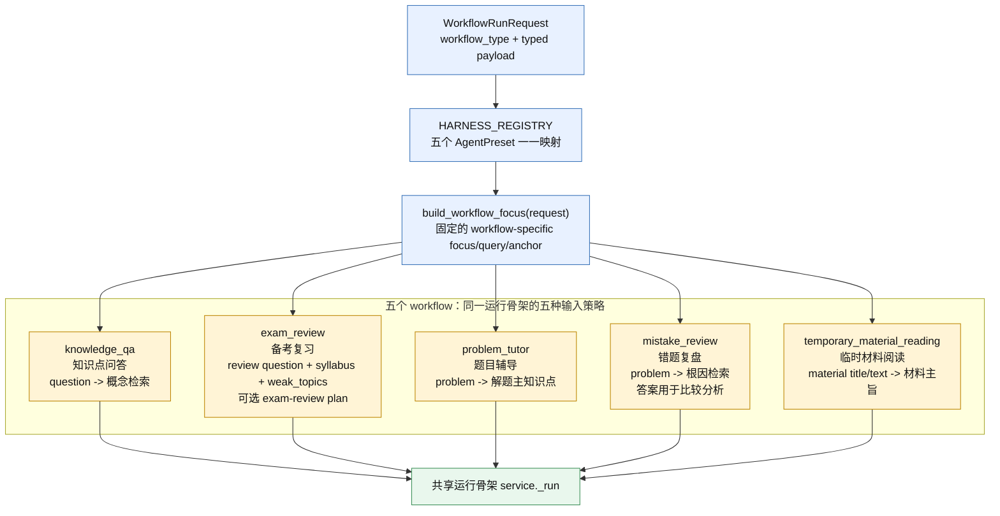
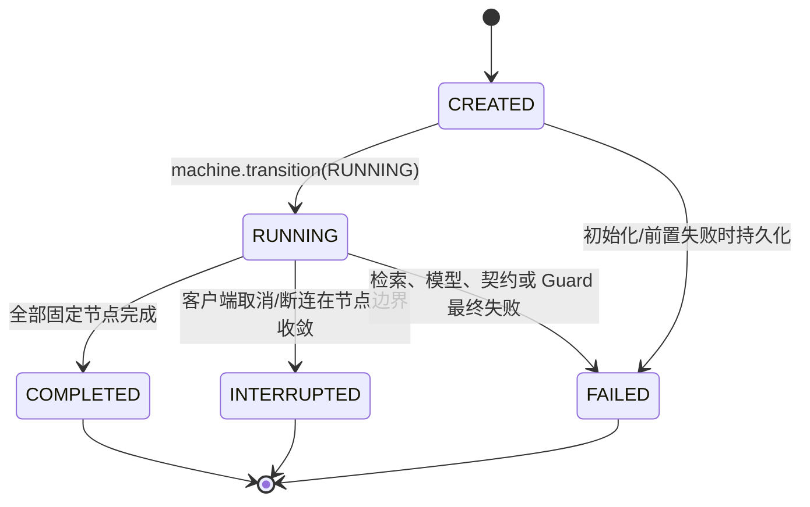

# 五个 Workflow、Agent Preset 与运行状态图

> 本图基于当前仓库的静态源码/配置证据；它证明的是代码中的装配、分支和状态转移，不证明线上部署、实际模型质量或真实安全效果。

## 1. 五个 Workflow 的真实关系



证据：`apps/scut-senior/api/src/scut_senior_api/contracts.py#WorkflowType`、`WorkflowRunRequest.enforce_v1_invariants`；`apps/scut-senior/api/src/scut_senior_api/harness_registry.py#AGENT_PRESETS`；`apps/scut-senior/api/src/scut_senior_api/workflow_focus.py#build_workflow_focus`。

### 五个 Preset 的能力边界

| Workflow | FocusStrategy | 主要输入聚焦 | 允许工具的真实含义 |
|---|---|---|---|
| `knowledge_qa` | `QUESTION_CONCEPT` | `knowledge_qa.question` | 课程检索、证据定位、Bilibili 匿名搜索 |
| `exam_review` | `SYLLABUS_WEAK_TOPICS` | 外层复习问题 + `syllabus` + `weak_topics` | 同上；可额外进入确定性的 exam-review plan |
| `problem_tutor` | `PROBLEM_MAIN_TOPIC` | `problem_tutor.problem` | 课程检索、证据定位、Bilibili 匿名搜索 |
| `mistake_review` | `MISTAKE_ROOT_CAUSE` | `problem` 用于检索；答案字段用于根因比较 | 课程检索、证据定位、Bilibili 匿名搜索 |
| `temporary_material_reading` | `MATERIAL_TITLE_MAIN_TOPICS` | 材料标题/Markdown 标题 + `material_text` | 上述工具 + 临时材料读取 |

这里的 `allowed_tools` 是能力/权限元数据，不是给模型的 function-calling 工具列表。四个受控工具的 `model_callable` 都是 `False`，服务端自行编排。

证据：`apps/scut-senior/api/src/scut_senior_api/harness_registry.py#ControlledToolMetadata`、`HARNESS_REGISTRY#CONTROLLED_TOOL_CATALOG`、`HARNESS_REGISTRY#AGENT_PRESETS`。

## 2. 一次运行的节点与状态图

```mermaid
flowchart TD
    START([请求进入]) --> V[request_validation\n解析 WorkflowType / payload / course scope]
    V --> I[identity\n鉴权模式]
    I --> PRESET[resolve_preset\n按 workflow_type 取唯一 preset]
    PRESET --> MODELCHK[模型目录/BYOK 解析\n模态兼容性检查]
    MODELCHK --> COURSE[课程与会话绑定\n检索可用性检查]
    COURSE --> CREATED[(内存初始态 CREATED)]
    CREATED --> RUNNING([RunStatus.RUNNING])
    RUNNING --> STORE[(首次持久化运行记录：RUNNING)]
    STORE --> FOCUS[build_workflow_focus]
    FOCUS --> EXAM{workflow == exam_review\n且 feature/provider 可用?}
    EXAM -->|是| PLAN[deterministic exam-review plan]
    EXAM -->|否| QUERY[authoritative_query]
    PLAN --> QUERY[plan.retrieval_query]

    QUERY --> RETRYCTX{local corpus + 空结果\n且有历史 + 非 exam plan?}
    RETRYCTX -->|是| CTX[context-carry query\n最多补检索一次]
    RETRYCTX -->|否| RET[local_corpus_retrieval\n或 fixture_retrieval]
    CTX --> RET
    RET --> AUTH[source_authorization_guard\n仅接受当前课程候选]
    AUTH --> CACHE[cache_policy\n当前固定 skipped]
    CACHE --> CALL[模型调用\nBYOK / OpenRouter / 智谱 / Mock]

    CALL --> OUT{模型输出可解析且\nGuard 接受?}
    OUT -->|可重试错误且 retry_count < 1| RETRY[model_output_retry\nretry_count += 1]
    RETRY --> CALL
    OUT -->|候选为空| INSUFF[insufficient_evidence\n不再生成修复性重试]
    OUT -->|通过| CITE[citation_guard\nS# 必须命中本次候选]
    INSUFF --> NORMALIZE[knowledge_point_normalization]
    CITE --> NORMALIZE

    NORMALIZE --> STYLE{humanizer 是否配置?}
    STYLE -->|否| SINGLE[response_style_control\nsingle_pass_model_prompt]
    STYLE -->|是| HUMAN[humanizer + protected output guard\n失败则回退原回答]
    SINGLE --> APPEND{exam plan 是否存在?}
    HUMAN --> APPEND
    APPEND -->|是| EXAMAPPEND[追加系统生成复习附录]
    APPEND -->|否| BILI{Bilibili 资源开启\n且范围允许且有关键词?}
    EXAMAPPEND --> BILI
    BILI -->|是| BL[生成唯一匿名搜索链接\n失败仅记录并降级]
    BILI -->|否| SKIPB[跳过 Bilibili]
    BL --> PERSIST[持久化回答/引用/trace]
    SKIPB --> PERSIST
    PERSIST --> COMPLETE([RunStatus.COMPLETED])

    RET --> FAIL[检索异常/契约异常]
    CALL --> FAIL[模型异常或 Guard 第二次拒绝]
    FAIL --> FAILED([RunStatus.FAILED])
    RUNNING -.取消/断连\n在节点边界观察.-> INTERRUPTED([RunStatus.INTERRUPTED])
    CALL -.上游同步调用期间\n不能立即改变状态，下一节点边界收敛.-> INTERRUPTED

    classDef node fill:#e8f1ff,stroke:#3973b8,color:#111;
    classDef decision fill:#fff4d6,stroke:#bd8500,color:#111;
    classDef terminal fill:#e9f7ed,stroke:#3b8f57,color:#111;
    classDef error fill:#ffe7e7,stroke:#b54a4a,color:#111;
    class V,I,PRESET,MODELCHK,COURSE,FOCUS,PLAN,QUERY,CTX,RET,AUTH,CACHE,CALL,RETRY,INSUFF,CITE,NORMALIZE,SINGLE,HUMAN,EXAMAPPEND,BL,SKIPB,PERSIST node;
    class EXAM,RETRYCTX,OUT,STYLE,APPEND,BILI decision;
    class START,RUNNING,COMPLETE,INTERRUPTED terminal;
    class FAIL,FAILED error;
```



证据：`apps/scut-senior/api/src/scut_senior_api/service.py#WorkflowService._run`；`apps/scut-senior/api/src/scut_senior_api/state_machine.py#_ALLOWED_TRANSITIONS`；`apps/scut-senior/api/src/scut_senior_api/contracts.py#RunStatus`。

## 3. 状态机不是 Agent 的“思考状态机”



`RunStateMachine` 只允许上述转移；`COMPLETED`、`INTERRUPTED`、`FAILED` 都是终态，不会从终态回到运行中。`regenerate` 是新的一次 attempt，不是当前状态机自循环。

## 4. 下一步到底由谁决定？

### 已经由开发者写死的部分

- 五种 `WorkflowType`、每种 payload 类型和 preset 是枚举/注册表固定的。
- `service._run` 的主顺序固定：校验 → 聚焦 → 检索 → 来源授权 → 模型 → 引用 Guard → 规范化 → 风格处理 → 可选外链 → 持久化。
- 模型不可直接调用工具；工具的调用者是服务端代码。
- 重试上限是 1 次；失败节点和错误状态有固定映射。
- 状态转移由 `RunStateMachine` 的固定表约束。

### 运行时根据状态/结果作出的有限决定

这些是**代码条件分支**，不是大模型自主规划：

1. `course_scope == CROSS` 直接按能力门拒绝；当前没有跨课程运行时。
2. 只有 `exam_review` 且开关/事实提供器可用时才进入 exam-review plan。
3. 本地检索空结果且有对话历史时，才尝试一次 context-carry query。
4. 模型输出可重试错误或引用 Guard 拒绝时，最多再调用一次模型。
5. 候选为空时，Guard 拒绝会降级为 `insufficient_evidence`，而非继续循环。
6. `humanizer`、Bilibili 外链按配置、知识范围和关键词决定是否执行。
7. 客户端取消/断连在下一个可观察的节点边界收敛为 `INTERRUPTED`。

模型输出会影响回答正文、引用 ID、相关知识点和是否触发 Guard/重试，但没有证据表明它能选择任意下一个节点、生成新计划或自主调用工具。

## 5. 对项目定位的结论

### 一句话

这个项目目前更准确的名称是：**受控的插件/harness 元数据 + 五类固定 Workflow 编排 + 词法检索增强生成（RAG）+ 服务端安全 Guard + 可选模型 API 适配器**；不是典型的自主 Agent。

### 对用户提出的四个标签逐项判断

| 标签 | 判断 | 准确说法 |
|---|---|---|
| 插件化 harness | **部分成立** | 有 `HARNESS_REGISTRY`、五个 preset、课程 plugin state 和受控工具目录；但它主要是冻结注册表/能力门，不是可热插拔的动态插件执行框架。 |
| RAG agent | **“RAG”成立，“agent”偏名义化** | 有 ingestion、课程语料、检索、候选注入 prompt、引用映射；但没有向量 embedding、reranker、工具调用循环或自主规划循环。 |
| 类似 Cordis 安全决策门 | **作为架构类比成立，不能称为已实现 Cordis** | 有请求契约、课程/来源授权、模型兼容性、配额、引用、URL/输出 Guard、fail-closed 能力门；源码没有证明它实现了 Cordis 本身。 |
| API 调用大模型 | **成立，但可选且有 Mock 回退/显式配置** | OpenRouter、智谱、BYOK 适配器共享 `ModelGateway`；模型通道由配置和凭据决定，未配置真实平台模型时可使用显式 deterministic fixture mock。 |

### 最终分类

```text
自主 Agent：        否（缺少 LLM-driven planner / tool loop / dynamic next-action policy）
固定 Workflow：      是（主路径和五类分支由代码预先定义）
RAG pipeline：       是（当前为确定性词法检索，不是向量 RAG）
受控 harness：       是，但偏注册表与能力治理，不是完整插件运行时
安全决策层：         是，表现为多处服务端 Guard / capability gate / fail-closed
LLM provider layer： 是，可选 OpenRouter / 智谱 / BYOK / Mock
```

## 6. 静态分析边界

当前结论来自仓库代码和配置。无法仅凭静态源码证明：线上是否真的调用过供应商、模型回答质量、检索召回质量、真实攻击下的安全性、生产部署状态以及成本/延迟。