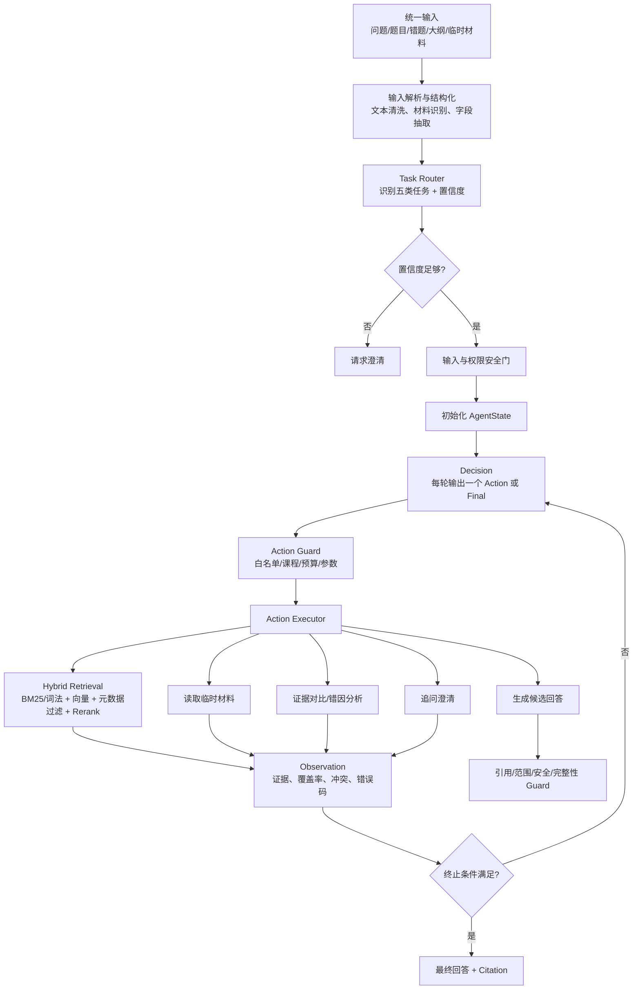
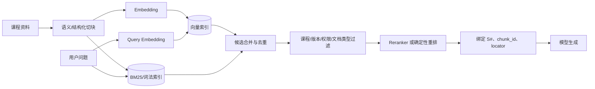
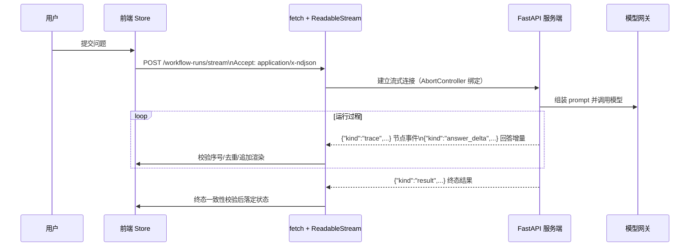

# SCUT 老学长：项目演进方案与面试 QA

> **面试口径**：以下内容是基于当前项目基底设计的演进方案。回答时明确区分“当前基线”和“我准备如何演进”，不要把规划内容说成已经上线。

## 一、项目演进后的定位

目标不是把项目改成完全自由的 Autonomous Agent，而是演进成：

> **面向课程学习场景的 EventStream-driven Agent Runtime**：由事件流驱动、以受限单步决策为核心，配合混合 RAG 与服务端安全 Guard。

核心组成：

```text
统一输入
  → 自动任务路由
  → EventStream Agent Loop
  → 受限单步决策（Action 或 Final）
  → 服务端工具执行
  → Observation/证据回流
  → 引用与安全 Guard
  → 可终止的最终回答
```

项目特色仍然保留：

- 五类学习任务：知识点问答、备考复习、题目辅导、错题复盘、临时材料阅读。
- 课程级知识边界：一次运行绑定课程，不能跨课程越权引用。
- 词法检索与向量检索并存，而不是只做向量检索。
- `chunk_id`、课程 ID、定位器、`corpus_version` 等证据链字段继续贯穿检索到回答。
- Bilibili 只作为独立的匿名搜索资源，不把外部搜索结果混入课程证据。
- 工具由服务端执行，模型只产生结构化动作，不直接访问数据库、文件系统或任意网络。
- 保留 `RunStateMachine`、Trace、引用 Guard、能力门和 fail-closed 策略。

## 二、总体演进架构



## 三、为什么选择 EventStream + 受限单步决策

### 1. 为什么不继续让用户手动选择 Workflow

当前五个 Workflow 的输入框会把用户暴露给内部实现：用户必须先判断自己是在“题目辅导”还是“错题复盘”，还要填写不同字段。

演进后改为统一输入：

```text
用户输入自然语言、题目、错题、复习大纲或材料
  → Router 判断任务类型
  → 提取对应结构化 payload
  → 复用五类能力模块
```

Router 只负责选择能力入口，不负责自由规划。真正的动态性来自后续 EventStream Agent Loop：每次 Observation 更新状态，并影响下一次受限动作决策。

### 2. 为什么不直接做完全自主 Agent

课程学习场景对边界和可解释性要求高：

- 不能跨课程引用。
- 不能把用户材料误当成系统指令。
- 不能把模型生成的内容伪装成历年真题。
- 不能让模型任意访问文件、数据库或外部网络。
- 不能因为检索失败无限循环。

因此采用 EventStream 驱动的受限单步决策：模型每次只能提出一个结构化 Action 或 Final，动作集合、参数、权限、预算和终止条件均由服务端约束。

### 3. 为什么不同时叠加 ReAct、Plan-and-Execute 和 EventStream

它们不是三套都要运行的组件：

```text
EventStream + Reducer
  = 运行时承载方式：事件、持久化、重放、前端推送

受限单步决策
  = Agent 行为方式：根据 Observation 选择一个 Action 或结束

exam_review 确定性计划
  = 一个特定 Workflow 的业务规则，不是通用 LLM Planner
```

最终只保留一套主运行机制：

```text
事件流进入
  → 模型输出一个 Action 或 Final
  → Action Guard
  → 服务端执行
  → Observation 事件
  → reducer 更新状态
  → 继续决策或终止
```

“ReAct”可以用来解释这种 Observe → Decide → Act → Observe 的行为模式，但不再作为额外框架或额外调用层写入主架构名称。对于 `exam_review`，计划由代码根据大纲、薄弱点和历年题事实确定性生成，最多影响检索顺序，不额外调用 LLM Planner，也不做通用 Replan。


## 四、五类 Workflow 如何演进为 Agent Skill

五类 Workflow 不删除，而是从“用户必须手选的入口”变成“Router 和 Agent 可调用的受控 Skill”。

| Skill | 触发场景 | 典型动作链 | 项目特色 |
|---|---|---|---|
| `knowledge_qa` | 用户询问课程概念 | `retrieve → judge_evidence → answer` | 课程内引用、概念与章节定位 |
| `exam_review` | 用户给出大纲、考试目标或薄弱点 | `build_plan → retrieve_topics → retrieve_past_exams → fill_gaps → answer` | 大纲优先、历年题统计、禁止伪造必考结论 |
| `problem_tutor` | 用户提交题目并要求讲解 | `retrieve_problem_topic → analyze_solution_path → answer` | 先识别主知识点，不把题面噪声直接当检索词 |
| `mistake_review` | 用户给出题目和原答案 | `retrieve → compare_answer → identify_root_cause → answer` | 区分概念错误、步骤错误和计算错误 |
| `temporary_material_reading` | 用户粘贴讲义或临时材料 | `read_material → retrieve_for_verification → compare → answer` | “材料写了什么”与“材料是否正确”分开处理 |

每个 Skill 只描述：

- 任务目标和输入字段；
- 允许的动作；
- 证据要求；
- 输出格式；
- 禁止事项。

Skill 不直接执行数据库查询或 HTTP 请求。执行由统一 `ActionExecutor` 完成。

## 五、混合检索方案

### 5.1 检索链路



### 5.2 为什么不能只保留向量检索

**第一，课程资料有大量精确符号。**

例如：

- `TCP 三次握手`
- `Dijkstra`
- `zplane(b,a)`
- `O(n log n)`
- “第 3 题”
- 章节号、函数名、公式变量

这类内容的关键不是语义相似，而是 token、符号、题号和局部字符串精确命中。向量模型可能把“后序遍历”和“中序遍历”判断得过于相近，却无法保证题号、函数名或公式的精确约束。

**第二，中文课程问题短而密。**

用户常输入“快排最好复杂度”“第三题怎么做”这种短查询，语义向量信息不足；词法索引可以利用课程术语、章节标题、题号和短语命中。

**第三，词法检索更容易解释和复现。**

当前项目强调引用和课程边界。词法分数、命中的标题、题号和 locator 可以直接写入 Trace，便于回答“为什么召回这段资料”。

**第四，冷启动、成本和故障降级更好。**

向量模型不可用或索引未更新时，词法检索仍可作为低成本 fallback；对于课程资料这种相对稳定的知识库，不能因为 embedding 服务故障就完全不可回答。

**第五，安全过滤不能交给向量相似度。**

课程 ID、corpus version、审核状态和文档角色必须做确定性过滤，不能仅凭“语义相似”决定是否允许引用。

所以选择：

```text
混合召回 = 词法精确召回 + 向量语义召回
         → 元数据过滤
         → 合并去重
         → 重排序
```

### 5.3 召回与排序策略

推荐先各取一批候选，再合并：

```text
lexical_candidates = BM25(query, course_id, top_k=20)
vector_candidates  = dense_search(embedding(query), course_id, top_k=20)
merged             = deduplicate(lexical_candidates + vector_candidates)
filtered           = metadata_filter(merged)
ranked             = rerank(query, filtered, top_k=5~8)
```

最终每个候选必须携带：

```text
chunk_id
course_id
source_id
source_title
locator_type / locator_start / locator_end
corpus_version
course_pack_version
retrieval_channels
lexical_score / vector_score / rerank_score
```

不建议一开始就把所有排序交给黑盒 reranker。第一版可以使用可解释的加权融合：

```text
hybrid_score = α * normalized_bm25
             + β * normalized_vector_score
             + γ * title/question/locator bonus
```

再根据评测集决定是否引入 reranker。

### 5.4 为什么保留当前的 chunk 和版本绑定

向量库只是检索实现，不应该改变证据身份。继续沿用：

```text
chunk_id = source_id + locator + chunk_no
corpus_version = 构建提交版本 + builder 参数
```

这样可以做到：

- 回答引用仍可定位到原文；
- 向量索引和词法索引绑定同一个语料版本；
- 语料更新后可以重建并切换 active index；
- 出现错误时可以按版本回滚；
- 评测结果可以复现。

## 六、Agent Runtime 设计（EventStream + 受限单步决策）

### 6.1 Action 白名单

第一版不允许模型任意调用 API，只允许：

```text
classify_task
retrieve
retrieve_with_query_rewrite
read_user_material
analyze_evidence
build_exam_plan
ask_clarification
generate_answer
finish
```

动作示例：

```json
{
  "action": "retrieve_with_query_rewrite",
  "arguments": {
    "query": "后序遍历 时间复杂度 递归栈",
    "reason_code": "coverage_gap"
  },
  "stop": false
}
```

模型输出必须通过结构化 Schema 校验，不能输出任意 Python、SQL、文件路径或 URL。

### 6.2 AgentState

```json
{
  "run_id": "...",
  "workflow_type": "mistake_review",
  "course_id": "data_structure",
  "user_goal": "分析错题根因",
  "observations": [],
  "evidence_ids": [],
  "coverage": {
    "required_topics": [],
    "covered_topics": [],
    "missing_topics": []
  },
  "step_count": 0,
  "retrieval_count": 0,
  "model_call_count": 0,
  "status": "deciding"
}
```

### 6.3 Observation

Observation 不保存完整思维链，而保存可审计的结果：

```json
{
  "action": "retrieve",
  "success": true,
  "candidate_count": 5,
  "evidence_ids": ["S1", "S2"],
  "coverage": "partial",
  "missing_topics": ["递归栈空间复杂度"],
  "corpus_version": "corpus-...",
  "error_code": null
}
```

保留动作、参数摘要、证据 ID、错误码和覆盖率；不展示或持久化模型完整 Chain-of-Thought。

### 6.4 EventStream Agent Loop

EventStream 是运行时承载方式，不是额外的模型调用层。服务端与前端消费同一套事件：

```text
事件进入
  → reducer 更新 AgentState
  → 若未终止，模型输出一个 Action 或 Final
  → Action Guard
  → 服务端执行
  → observation_recorded
  → 回到 reducer
```

统一事件词表在现有 NDJSON 四类事件之上扩充：

```text
decision_produced       模型给出的 Action 或 Final
action_rejected         Guard 拒绝 + reason_code
observation_recorded    工具执行结果、证据、覆盖率
budget_crossed          步数/Token/时间预算触线
clarification_requested 向用户澄清
run_finished            终态收敛
```

```python
# 伪代码：只有一个受控决策循环，不叠加独立 Planner 或 ReAct 框架
while True:
    event = next_event()
    state = reduce_agent_event(state, event)
    persist_append_only(event)
    emit_to_client(event)

    if termination_policy.reached(state):
        break
    if event.kind == "observation_recorded":
        decision = decision_model.decide(state)  # 一个 Action 或 Final
        append(DecisionProduced(decision))
```

`exam_review` 的计划是确定性的业务规则：由大纲、薄弱点和历年题事实生成检索顺序，不额外调用 LLM Planner，也不与 Agent Loop 叠加。ReAct 只作为“根据 Observation 决定下一步”的行为解释，不是单独部署的框架。

设计收益：决策、拒绝和观察都是可持久化事实；状态可通过事件重放恢复；取消可作为事件在节点边界收敛；同一事件流还能直接驱动前端 Trace 和回答增量。

协议必须版本化：前端严格拒绝未知字段/事件，新增事件 kind 需协商或特性开关。事件只在单个 run 生命周期内作为真相源，对外查询仍读取终态快照，避免所有读路径全量重放。

### 6.5 预算与终止：防死循环是本职，管输入输出不是

预算只做一件事：防止循环失控。自然输入输出由既有机制管辖——请求合同（question ≤2 万字符、problem ≤4 万字符、材料 ≤10 万字符）管输入，供应商调用参数（max_tokens）管输出。Agent 层不重复设输入输出限额。

**死循环防线**（所有模型一致，Agent Runtime 职责）：

```text
max_steps                = 4      # 每次模型交互都算一步，含 Final 与 Guard 重试
max_retrieval_rounds     = 2
max_query_rewrite        = 1
max_same_action_retries  = 1
max_guard_retries        = 1      # 引用 Guard 拒绝后的修复尝试，计入步数
max_runtime_seconds      = 120    # 进程级防悬挂兜底，不是成本控制
```

单一计数器原则：决策、Final、Guard 重试共享同一个步数预算，结构上保证总模型调用 ≤ max_steps，因此不需要独立的 model_calls 上限——限制要少，但每个都有明确的失控场景对应。

**平台免费档配额防线**（仅 platform_daily_free_quota 三个模型，在 ModelGateway 配额层执行，不属于 Agent 预算）：

```text
每用户每日请求数 / Token 数   # 对齐 OpenRouter 免费额度口径
单次输出                      # 由该通道生成参数设定，偏紧
每用户并发                    = 1
额度耗尽                      = 明确报错，不自动切换（PLAN-1 §1.6 冻结）
```

**BYOK / 其他模型**：只有死循环防线。用户为自己的 Key 和费用负责，系统负责不失控；输入输出大小不由 Agent 预算管。

终止条件：

- 证据覆盖达到任务要求；
- 已生成通过 Guard 的最终回答；
- 模型输出 `Final`；
- 达到步数或运行时限；
- 同一动作重复失败；
- 引用 Guard 重试达上限；
- 用户取消；
- 检测到越权或非法动作。

预算到达后不能继续循环，应返回有边界的降级结果，例如“当前课程资料不足以支持完整回答”。

## 七、Tool Calling 与 MCP 的取舍

### 第一阶段选择内部 Tool Calling / Action Executor

当前工具都属于同一后端，课程检索、材料读取、引用映射和安全策略高度耦合。直接用内部执行器更合适：

```text
LLM 输出 Action
  → Action Guard
  → LocalActionExecutor
  → 现有 retrieval/service/runtime_guard
```

优点：

- 课程权限和引用边界集中管理；
- 不增加 MCP Server、进程和网络跳转；
- 更容易实现事务、取消、配额和 Trace；
- 方便复用当前 `LocalCorpusRetrievalGateway` 和 Guard。

### 什么时候引入 MCP

当工具需要独立部署或被多个 Agent/客户端复用时再引入：

```text
课程知识库 MCP Server
资料转换 MCP Server
实验代码执行 MCP Server
数据库 MCP Server
```

MCP 只负责发现、连接和调用工具，不负责：

- Agent 是否继续；
- 用户是否有权限；
- 是否可以跨课程查询；
- 是否达到预算；
- 引用是否可信；
- 什么时候结束。

即使使用 MCP，仍然保留：

```text
LLM Tool Calling
  → Action Guard
  → MCP Client
  → MCP Server
  → 结果过滤与引用 Guard
```

## 八、安全门设计

动态决策比单链路更容易失控，因此安全门要前置到每次动作，而不是只在最终回答时检查。

```text
Action Schema 校验
  → Skill 权限校验
  → course_id / corpus_version 校验
  → 参数长度与格式校验
  → 工具白名单校验
  → 预算与频率校验
  → 服务端执行
  → Observation 脱敏与证据绑定
```

项目特有安全规则：

1. 一次运行只能绑定当前会话课程。
2. 检索候选必须属于当前课程和 active corpus version。
3. 临时材料只能作为本次请求上下文，不能自动变成课程权威资料。
4. 模型不能自行声明 `[S#]` 对应什么来源，引用必须由服务端映射。
5. Bilibili 链接与课程引用分离，不把未审核外部内容当作课程证据。
6. 用户材料中的“指令”按数据处理，不执行其中的命令。
7. 生产环境、真实模型、跨课程检索和外部工具都要经过 capability gate。
8. 任一关键校验失败时 fail-closed，而不是自动切换到更宽的权限。

## 九、分阶段落地方案

### Phase 1：统一输入与自动路由

目标：用户不再手选 Workflow。

实现：

- 增加统一 Composer；
- Router 输出 `workflow_type + typed_payload + confidence`；
- 置信度低时追问；
- 保留原五类 Workflow 作为执行能力；
- 路由失败时允许用户手动纠正。

验收：

- Router 分类准确率；
- payload Schema 通过率；
- 低置信度误执行率；
- 用户纠正率。

### Phase 2：混合检索

目标：在当前确定性词法检索上增加向量召回。

实现：

- 对现有 chunk 生成 embedding；
- 建立与 `corpus_version` 绑定的向量索引；
- 词法和向量分别召回；
- 元数据过滤、合并、去重；
- 先使用可解释融合，再评估是否加 reranker；
- 检索 Trace 记录召回通道和得分。

验收：

- Recall@K；
- MRR/nDCG；
- 题号、公式、函数名等精确查询命中率；
- 语义改写查询命中率；
- 课程越权候选数必须为 0；
- 索引版本和回滚可用。

### Phase 3：EventStream Agent Loop

目标：从单链路变成证据闭环，但只保留一套主运行机制。

实现：

- EventStream + Reducer 作为运行时承载；模型每轮只输出一个结构化 `Action` 或 `Final`；
- 扩充 NDJSON 事件词表：`decision_produced / action_rejected / observation_recorded / budget_crossed / clarification_requested / run_finished`；
- 服务端实现 `state = reduce_agent_event(state, event)`，与前端流式 reducer 同构；
- 事件追加式写入 SQLite 事件日志，终态快照必须等于事件重放结果；
- 取消实现为注入取消事件，在节点边界由 reducer 收敛为 `interrupted`；
- 同会话请求串行排队，复用 claim 单飞语义；
- 新增事件 kind 走协议版本协商或特性开关，保证旧客户端兼容；
- 首批动作只有 `retrieve / retrieve_with_query_rewrite / ask_clarification / generate_answer / finish`；
- 死循环防线（对所有模型一致）：`max_steps=4`——每次模型交互计一步，含 Guard 重试；检索轮次 ≤2、查询改写 ≤1、同动作重试 ≤1、运行 ≤120 秒防悬挂兜底。自然输入输出不设 Agent 限额：输入由请求合同管，输出由生成参数管；平台免费档三模型另在配额层单独限流（见 6.5）；
- Context compaction 先用确定性策略：证据按 `chunk_id` 去重，未引用候选降级为标题+locator，Observation 只保留结构化字段，旧对话滚入数百字封顶的结构化摘要。

验收：

- 证据不足时能补一次检索，证据充分时不会空转；
- 非法工具、跨课程参数、越界 URL 被拒绝并留下 `action_rejected`；
- 取消、超时、预算耗尽都能进入终态且事件日志完整；
- 终态快照与事件重放一致；
- 旧客户端在新事件流下不崩溃；
- Citation Guard 对每一步证据保持可追溯；
- 普通问题模型调用通常为 1～2 次，最坏不超过 3 次。

### Phase 4：exam_review 确定性计划确认

目标：只为备考复习提供业务层的确定性计划，不引入第二套通用 LLM Planner、ReAct 框架或 Replan 循环。

实现：

- `exam_review` 根据大纲、薄弱点和历年题事实由代码生成短计划，不增加 LLM Planner 调用；
- 计划先展示给用户确认，再进入同一个 EventStream Agent Loop；
- 计划只影响检索顺序和覆盖目标，不新增工具，不改变 Agent Runtime；
- Observation 只更新覆盖率与缺失主题，后续动作仍受 Phase 3 的单步决策和硬预算限制；
- `observation_recorded` 后自动更新覆盖率，`action_rejected` 自动埋 rejection 指标。

验收：

- 计划生成零额外模型调用；
- 用户确认、修改或拒绝路径均可审计；
- 计划中的主题有对应课程证据或明确标记为未覆盖；
- 预算、权限和 Citation Guard 规则与普通任务一致。

### Phase 5：工具服务化与 MCP

只有当课程检索、资料转换、代码实验等能力需要跨系统复用时再做。

实现：

- 先稳定内部 Action Port；
- 为特定工具实现 MCP Adapter；
- MCP 前后仍保留 Action Guard 和权限策略；
- 对远程调用增加超时、重试、幂等键和审计日志。

### 借鉴方案：Harness 七件套与 RAG 三层的场景化取舍

> 判断标准是"最适配"，不是"最优"。coding agent 的 harness 为长时程、宽动作、本地文件环境设计；本项目是短会话、窄动作、受控知识域，多数重型机制在这里是负资产。每条借鉴都必须指认到它替换或补强的现有机制，说不出来就不引入。

#### Harness 七件套逐项

| 概念 | 项目现状 | 借什么 | 明确不借 |
|---|---|---|---|
| Session | conversation / run / `attempt_group_id` 三层已有；`regenerate` 即 fork 的领域版 | run 升格为一等 Session 对象，事件日志挂载其下（Phase 3 已含） | 进程级可恢复运行时容器 |
| Subagent | 无 | 无；多主题并行取证用 asyncio 进程内并发 | 多 Agent 协作、子代理派生 |
| Memory | 知识侧 = 版本化语料库；对话侧 = 六轮截断 | 结构化滚动摘要外部化状态（auto-compact / 结构化 todo 思想），数百字封顶 | 向量库存对话、跨会话用户画像 |
| Permissions | fail-closed 能力门全套 | 动作级白名单与预算（Phase 3） | —— |
| Approval | manifest `passed` 人工审核、贡献六态流转 = 离线审批 | exam_review 计划确认交互（plan mode 思想，进 Phase 4） | 运行时逐动作弹窗 |
| Hooks | Guard 节点即确定性反射（前置锚点清洗 / 后置 citation Guard） | 延伸到动作环：observation 后更新覆盖率、rejection 自动埋指标 | 用户可配置钩子 |
| Agent Loop | 见 6.4 EventStream Agent Loop | Observe/Decide/Act ↔ observation_recorded / decision_produced / 受控执行 | —— |
| Context Compaction | 字段级长度上限已有 | 证据账本去重；未引用候选降级为"标题+locator"一行（长输出 spill 思想）；Observation 只存结构化字段；老轮次滚入摘要 | 语义压缩模型 |

#### RAG 三层取舍

- **数据索引**：解析清洗不动（material_converter 确定性抽取 + GLM-4V 三道闸 + 人工 passed 是差异化资产）；分块保持结构优先，locator 完整性 > 语义平滑；元数据补知识点标签（heading_path 规则推导）；嵌入选型走 eval 金标集，embedding 模型身份编入索引版本号——换模型即新版本、可回滚。
- **查询检索**：已有权威查询 / exam plan 合成 / 上下文补锚；新增每课程确定性同义词缩写展开表（不用 LLM 改写：省一趟调用、可审计、不碰"检索词不改课程范围语义"红线）；两路召回融合第一版用 RRF(k=60) 替代加权线性（无参、对分数分布差异鲁棒）；当前数据规模 sqlite-vec 即可，ANN 参数调优是伪需求；reranker 待评测决定。
- **生成增强**：提示词体系保持现状；temperature 局部放宽仅限"AI 生成样题"子任务；不做自动模型路由——目录透明、配额可见本身是诚实性卖点。

#### 借鉴优先级总览

```text
P0（并入 Phase 2/3）：RRF 融合；embedding 身份入索引版本；证据账本去重+候选降级摘要；结构化滚动摘要
P1（并入 Phase 3/4）：exam_review 计划确认；同义词展开表；Hook 延伸埋 rejection 指标
明确不借：Subagent、运行时审批弹窗、MCP（现阶段）、向量库存对话、语义压缩模型、自动模型路由
```

来源标注：DSH（goal/budget 边界、spill 文件、结构化 todo）、Claude Code（auto-compact、plan mode）、Codex（AGENTS.md 约定、沙箱 fail-closed）均取公开资料口径的机制思想，不冒称了解各家内部实现细节。

## 十、面试详细拷打 QA

### Q1：你为什么要把项目从 Workflow 改成 Agent？

**答：** 当前五类 Workflow 能覆盖固定任务，但用户需要先判断任务类型并填写不同输入框，而且每次基本是一次检索后直接生成。真实学习问题经常需要根据证据缺口继续检索、请求澄清或比较材料。因此我会保留五类 Workflow 作为受控 Skill，再增加自动路由和 EventStream Agent Loop——模型每轮基于 Observation 输出一个 Action 或最终回答，而不是把所有流程改成完全自由的 Agent。

### Q2：自动分类后直接调用 Workflow，不就够了吗？

**答：** 自动分类只解决入口问题，属于 Router-driven Workflow。它仍然是“分类一次，固定执行一次”。要体现 Agent，需要让 Observation 改变下一步动作，例如检索只找到定义但没有复杂度证据时，系统可以自动补查复杂度，或者发现用户没有提供原答案时请求澄清。

### Q3：你说 Agent 的核心是循环，固定重试算不算？

**答：** 不算。固定重试是开发者写死的条件分支。关键在于 Observation 更新状态，并影响下一步动作。例如根据已命中的章节、证据覆盖率和缺失主题选择新的查询，而不是无论结果如何都重复同一个查询。

### Q4：为什么用受限单步决策，而不是全局 Plan-and-Execute？

**答：** 知识问答和错题分析的下一步取决于上一步检索到了什么，适合每轮只做一个受限决策；备考复习虽然有计划结构，但它的计划由代码根据大纲和历年题事实确定性生成，属于业务规则，不需要 LLM Planner。所以我只用一套 EventStream 驱动的单步决策循环：简单问题一轮出答案，证据不足最多补一次检索，硬预算封顶，不叠加第二套范式。

### Q5：为什么不让大模型直接调用所有 API？

**答：** 课程系统存在课程边界、引用绑定、临时材料隔离和预算限制。模型直接调用 API 会把权限和安全责任分散给模型。我的方案是模型只输出结构化 Action，Action Guard 做 Schema、权限、课程、预算校验，真正执行由服务端 Executor 完成，这样更容易审计和 fail-closed。

### Q6：Tool Calling 和 MCP 在你的方案中分别做什么？

**答：** Tool Calling 是模型输出结构化工具动作；MCP 是工具服务的发现、连接和调用协议。第一阶段工具都在同一个后端，直接用内部 ActionExecutor 更简单，能集中处理课程权限、引用和 Trace。只有当知识库、资料转换、代码实验等能力需要独立部署和跨客户端复用时，我才用 MCP 作为接入层；MCP 本身不提供 Agent 决策或安全策略。

### Q7：为什么要做混合检索？

**答：** 课程资料既有语义问题，也有大量精确符号。向量检索擅长同义表达和语义相似，但对题号、公式、函数名、章节号、英文缩写和短查询未必稳定；词法/BM25 对这些精确匹配更可靠，也更容易解释和复现。因此使用词法召回加向量召回，再做元数据过滤和重排序。

### Q8：既然有向量检索，为什么不完全替换词法检索？

**答：** 因为“第 3 题”“Dijkstra”“O(n log n)”“zplane(b,a)”这类查询需要精确 token 和符号命中。向量模型可能把相邻概念召回，却不能保证精确题号或公式。另一个原因是词法检索是低成本、可解释的故障降级路径，embedding 服务不可用时仍能提供受限回答。课程边界和审核状态也必须通过确定性元数据过滤，不能交给向量相似度。

### Q9：混合检索怎么融合？

**答：** 词法和向量分别召回，例如各取 Top 20，按 `chunk_id` 去重，再按 `course_id`、审核状态、`corpus_version` 做过滤。第一版用归一化 BM25 分数、向量分数、标题/题号/章节奖励做加权融合；如果离线评测证明需要，再增加 reranker。每个候选保留各通道分数和来源，方便诊断。

### Q10：为什么要保留 `chunk_id` 和 `corpus_version`？

**答：** 因为向量检索只改变召回方式，不应该改变证据身份。`chunk_id` 保证引用能回到源文档和 locator，`corpus_version` 保证回答使用的索引和语料版本可复现。语料更新时可以生成新索引并原子切换，出现问题可以回滚，评测也能固定版本。

### Q11：如何判断证据足够？

**答：** 不只看命中数量，而看任务所需证据覆盖。比如题目辅导需要覆盖题目对应知识点和解法依据，错题复盘还需要覆盖原答案与参考依据，备考复习需要覆盖大纲主题和历年题事实。Observation 中记录命中来源、覆盖主题、未覆盖主题、来源冲突和证据等级，由终止策略判断继续检索、追问还是生成。

### Q12：模型会不会一直检索，形成死循环？

**答：** 会有明确预算：最大步数、检索次数、查询改写次数、模型调用次数、Token 和时间上限；同一动作重复失败也会触发终止。达到预算后返回有边界的 `insufficient_evidence` 或请求澄清，而不是无限重试。所有动作都有 Trace，便于定位循环原因。

### Q13：如何防止模型越权检索其他课程？

**答：** `course_id` 不是完全信任模型的参数。Action Guard 会把它与会话绑定课程、用户权限和当前 active corpus 对照；检索结果还要做来源授权校验，候选课程不一致就拒绝。模型不能通过改写 query、伪造 citation 或调用外部工具绕过课程边界。

### Q14：如何防止用户材料中的 Prompt Injection？

**答：** 输入解析阶段把材料标记为数据，Prompt 中明确区分“内容”和“指令”；材料只能作为本次上下文，不能改变系统工具权限、课程范围或终止策略。模型输出的 Action 仍然必须经过 Schema 和 Guard，所以即使材料要求读取文件或访问网络，也不会获得执行权限。

### Q15：如何处理检索结果互相矛盾？

**答：** 不直接让模型自行选择一个结论。Observation 标记冲突来源，系统可以按文档版本、审核状态、章节定位和任务相关性重新排序；如果冲突仍未解决，就让模型分别陈述各来源观点并给出引用，或者向用户澄清上下文。不能把未经判断的单一答案包装成确定事实。

### Q16：临时材料和课程资料冲突时怎么办？

**答：** 两者承担不同职责：回答“材料写了什么”以用户材料原文为准；回答“材料是否正确”才用课程资料进行核验。输出中分别标记材料观点和课程证据，不能把课程资料改写成材料原意，也不能给用户材料补造课程页码。

### Q17：为什么 Bilibili 资源不直接参与 RAG？

**答：** Bilibili 是外部、未审核、内容变化快的资源。项目可以根据模型提取的知识点生成一个匿名搜索链接，但不抓取和解析视频结果，也不把它当作课程权威证据。这样课程回答的 Citation 仍然只来自可审计语料，外部资源作为独立补充。

### Q18：如何评估演进是否有效？

**答：** 分三层评估。检索层看 Recall@K、MRR/nDCG、题号和公式精确命中率、语义改写命中率；Agent 层看任务路由准确率、有效动作率、平均步数、无效循环率、预算超限率、澄清成功率；回答层看 Citation precision、证据覆盖率、拒答准确率、越权引用数和人工评分。不能只看最终回答是否流畅。

### Q19：如何控制成本和延迟？

**答：** 先走确定性轻量路径：路由、元数据过滤和词法召回成本低；向量召回和 rerank 可以并行；简单问题命中高置信证据后直接生成，证据不足时才多一轮检索决策。每一步设置 Token、时间和调用预算，模型不可无限调用。对高频课程查询可以缓存版本化检索结果，但回答仍需重新做权限和引用校验。

### Q20：如果向量服务挂了怎么办？

**答：** 降级到词法检索，并在 Trace 中记录 `vector_retrieval_unavailable`。如果词法结果达到最低证据阈值，继续生成；否则返回证据不足，不伪装成完整回答。这样向量检索是增强能力，不是整个系统的单点故障。

### Q21：为什么不直接用一个大 Prompt 让模型自己完成所有事情？

**答：** 大 Prompt 无法提供可靠的权限边界、版本绑定、工具参数校验和可复现 Trace。课程系统还需要精确引用和安全降级。把决策、执行、证据和 Guard 分层，才能测试每一层，也能在模型更换时保持系统契约稳定。

### Q22：你如何证明这不是把固定 Workflow 换个名字？

**答：** 我会看下一步是否由 Observation 驱动。若所有节点、顺序和重试次数都由代码固定，只是加了 Agent 名字，仍然是 Workflow。真正的演进要求 Agent 输出受约束 Action，Action 执行后产生 Observation，Observation 更新状态并影响下一步动作，同时有明确终止和预算策略。自动路由本身不构成 Agent。

### Q23：为什么不一开始就引入 MCP？

**答：** MCP 解决工具接入和复用，不解决 Agent 决策。当前课程检索、引用 Guard、课程边界和运行 Trace 强耦合，先用内部 Action Port 可以减少网络跳转和权限分散。等工具需要独立部署、被多个 Agent 复用时，再把稳定的 Action Port 适配成 MCP，避免为了使用协议而增加系统复杂度。

### Q24：你认为这个系统最终最准确的架构名称是什么？

**答：** 演进前是“受控 Workflow + 确定性词法 RAG + 服务端 Guard + 可选 LLM Gateway”；演进后是“由 EventStream 驱动、以受限单步决策为核心的课程学习 Agent Runtime”。其中 Agent 的自由度被动作白名单、课程权限、引用校验、预算和终止策略限制，重点不是追求完全自主，而是让证据驱动下一步并且可审计。

### 前端与工程化深挖 QA（Q25–Q35）

#### Q25：你说流式输出，具体是什么协议？为什么不用 SSE？

**答：** 我用的是 fetch POST + NDJSON：响应头 `application/x-ndjson`，每行一个 JSON 事件，前端用 ReadableStream reader 逐行解码解析。不用 EventSource 有三个原因：一是需要 POST 大 payload（题目、临时材料最长十万字符），SSE 只支持 GET；二是 EventSource 会自动重连，而我们的 run 是有状态的一次性执行，隐式重连会带来重复触发副作用；三是我需要对事件帧做强 schema 校验和 run 绑定校验，自定义协议更干净。两者都是 HTTP 服务器推流，迁移成本主要在服务端 media type 和重连缓冲策略。

#### Q26：流式过程中怎么保证不错序、不丢帧？

**答：** 三层防护：事件 sequence 必须严格递增，乱序直接协议错误；Trace 事件额外有 event_id 去重；最关键的是终态 result 到达时，前端把已累积的回答块和 trace 与终态做全量比对，不一致就拒绝落定。这样即使中间丢了 delta，也不会把残缺回答当成完整结果展示，而是显式失败。

#### Q27：用户中途关掉页面或断网，运行怎么办？

**答：** 分两种情况。显式取消走 AbortController 加服务端 cancel 端点，服务端在下一个节点边界收敛成 interrupted 状态并留 trace；注意模型同步调用期间无法立即打断，只能在下一节点生效，这一点我会如实说明。网络断开则前端不取消运行，因为服务端会把终态持久化，用户回来点"重新读取"即可取回结果——把"连接生命周期"和"运行生命周期"分开设计。

#### Q28：长回答流式渲染会不会卡？

**答：** 目前有三道缓解：KaTeX 整个渲染管线路由级懒加载，不占首屏；渲染函数是纯函数便于后续移入 Web Worker；终态前增量文本先按块累积。进一步优化方向是把渲染移入 Worker 并按 rAF 合并 delta 再渲染，配合虚拟滚动只渲染可视块。我不会说已经做了这些，而是讲清楚触发条件（渲染超 50ms 才值得上 Worker）和迁移路径。

#### Q29：数学公式渲染有什么坑？

**答：** 三个坑：一是 `$` 符号会被 markdown 引擎当普通文本破坏公式，所以先用占位符把公式摘出来，markdown 解析后再还原交给 KaTeX；二是矩阵这类环境有特殊分隔符语法需要预修复；三是 KaTeX 输出的 SVG/MathML 标签会被 DOMPurify 默认策略杀掉，需要定制消毒白名单，既放行公式又挡住其他注入。

#### Q30：XSS 怎么防？

**答：** 纵深防御。第一层在后端：引用 Guard 禁止模型输出 URL 形态文本，回答块类型白名单控制内容归属；第二层在前端：模型输出一律视为不可信源，marked 解析后必须过 DOMPurify 消毒才允许 innerHTML；第三层是测试：有专门的测试断言恶意 markdown 被消毒而 KaTeX 公式保留。

#### Q31：为什么不用 Web Worker？

**答：** 如实说：当前没用。因为首屏瓶颈已经靠异步组件拆包解决，而常规问答的渲染量不足以卡顿主线程。我预留了迁移路径：渲染已经是纯函数，长材料场景出现可感知卡顿时，把它移入 Worker 并对 delta 做 rAF 节流即可。我认为正确的工程顺序是先测量再引入复杂度，而不是为了简历关键词预先堆技术。

#### Q32：BYOK 模型选择前端怎么处理安全性？

**答：** 前端目录带版本号做 fail-closed：服务端目录版本与本地冻结目录不匹配时，凭据保存和模型请求直接禁用，防止新旧目录字段不一致导致静默错误。API Key 不经过前端存储明文回显，凭据状态只返回 configured 与否；Mock 身份看不到可用 BYOK 入口。思路是前端同样执行能力协商，而不是无条件信任服务端目录。

#### Q33：流式协议怎么测试？

**答：** 测试里用 ReadableStream 手工构造分块的 NDJSON 流，覆盖正常序列、跨 chunk 撕裂的 JSON 行、乱序 sequence、重复 event_id、未知字段、answer_delta 块索引跳跃、终态与增量不一致、终态后再来事件等用例，每种都断言抛出对应的协议错误。协议层测试不依赖真实网络，fetch 可注入。

#### Q34：你这套流程后续也是自研，为什么不用 LangChain/LangGraph 这类框架？

**答：** 先纠正前提：我不是不用框架，FastAPI、Vue、Pydantic 都在用；我自研的只是 LLM 编排层。原因有三点。第一，这个场景的核心需求是可审计的确定性合同——课程级安全边界、引用 Guard、corpus_version 版本绑定、终态一致性校验，这些都要求控制流完全透明；通用框架把逻辑藏进链式抽象里，我要实现"空证据降级而非失败""候选越课即拒绝"反而要和框架对抗。第二，当前编排复杂度不高：固定节点序加有限分支，第一版 Agent Loop 也只是一个小状态机，为它引入重型依赖是用框架的复杂度买用不到的能力。第三，评测复现：我的 eval 是契约评测，框架组件自带 prompt 和记忆管理，版本升级会让评测基线漂移。同时我也承认边界：向量库、embedding 客户端这类基础设施我会直接用成熟方案，自研只限编排层；等出现真正的动态图、断点恢复、多人协作需求时，我会重新评估 LangGraph 这类编排框架。原则是编排自研、基础设施用库、框架按需后置。

#### Q35：如果面试官追问"自研是不是重复造轮子"，你怎么回应？

**答：** 造轮子的判断标准是"是否存在成熟且可控的替代品，以及自研部分是否是我的系统差异点"。数据库、Web 框架、向量索引这些有成熟方案，我全部直接用；而课程边界 Guard、引用合同、NDJSON 流协议、确定性考试计划这些是这个产品的差异化约束，没有现成框架能开箱提供，它们恰恰是我要控制和测试的部分。所以轮子分两类：通用件绝不重造，差异件必须握在自己手里。

### Harness 与 RAG 借鉴深挖 QA（Q36–Q41）

#### Q36：Session、Subagent、Memory 这些 Harness 概念在你的系统里怎么对应？

**答：** 三层同构物已经有了：conversation 是跨请求会话容器，run 是一次执行实例，`attempt_group_id` 加 `regenerated_from_run_id` 实现了 fork 式分支——regenerate 就是从旧 attempt 派生新 run。Subagent 我明确不做，单次 run 只有几步，派生子进程的开销超过收益。Memory 拆两层：知识记忆是带 corpus_version 的版本化语料库；对话记忆保持六轮窗口，另补一个几百字封顶的结构化滚动摘要。Harness 概念对我的价值是对照出真实缺口，不是逐个堆上。

#### Q37：为什么不用 Subagent 或多 Agent 协作？

**答：** Subagent 解决的是主上下文被子任务中间过程污染的问题，前提是任务长时程、动作空间宽。我的场景是短会话、窄动作：一次 run 几步以内，唯一值得并行的是备考复习的多主题取证，asyncio 进程内并发两路检索就够，不需要进程级隔离。判断标准是任务形状，不是概念先进性。

#### Q38：Memory 和 Context Compaction 具体怎么做？为什么不用向量库存对话？

**答：** Compaction 用确定性手段优先：证据账本按 chunk_id 去重；未被引用的候选在后续轮次降级为标题加 locator 一行——长输出落盘留摘要的思想；Observation 只存结构化字段不存思维链；老对话轮次超限后滚入摘要，摘要内容限定为已确认的课程范围和已澄清的约束。不用向量库存对话有两个原因：一是强调引用可追溯的系统里，不可审计的记忆来源会污染证据链；二是我的会话短，摘要加截断的成本收益远好于一套检索式记忆。

#### Q39：Permissions 和 Approval 怎么处理？运行时为什么不做人工审批弹窗？

**答：** 权限已经是 fail-closed 全套：课程边界、能力门、BYOK 凭据边界，加上 Phase 3 的动作白名单和预算。审批时机是刻意设计的：答题中途弹窗问"允许检索吗"是灾难体验，而且我的高风险动作不在运行时而在内容侧——manifest 的 passed 人工审核和维护者六态流转就是离线审批。真正借了 plan mode 思想的位置是 exam_review：计划生成后先给用户确认再执行深度检索，人工介入放在天然决策点而不是每个动作上。

#### Q40：RAG 三层优化的取舍具体讲讲？融合为什么选 RRF 而不是加权分数？

**答：** 索引层解析清洗不动，material_converter 的确定性抽取加人工审核是差异化资产；分块保持结构优先，因为 locator 完整性比语义平滑重要；嵌入选型走 eval 金标集，并把 embedding 模型身份编进索引版本号，换模型等于新版本可回滚。查询层新增每课程确定性同义词表而不用 LLM 改写——省一趟调用、可审计、不碰"检索词不改课程范围语义"的红线。融合第一版用 RRF(k=60)：无参数、对词法和向量两路分数分布差异鲁棒，加权线性要先归一化还要调权。当前数据规模 sqlite-vec 就够，ANN 调参在这个量级是伪需求；reranker 等评测结果说话。

#### Q41：这些借鉴你怎么划边界，避免变成概念堆砌？

**答：** 规则是一条：每个 borrowed 概念必须指认到它替换或补强的现有机制，说不出来就不引入。Session 对照的是 conversation 加 attempt_group，Hooks 对照的是既有 Guard 节点，Compaction 对照的是六轮截断的真实缺口；而 Subagent、运行时审批、向量库存对话这三个，我指认不出它们要解决问题的现状，所以明确不借。落地纪律是 P0 四项全部挂 Phase 2/3、P1 三项挂 Phase 3/4，其余写在"明确不借"里防自己跟风。

### 运行机制、预算与性能深挖 QA（Q42–Q46）

#### Q42：你的方案为什么不是 ReAct + Plan-and-Execute + EventStream 三者叠加？

**答：** 它们本来就不在同一层，我的运行时里也只有一套机制。EventStream + Reducer 是承载方式——事件、持久化、重放、前端推送，本身不产生模型调用；受限单步决策是行为方式——每轮根据 Observation 输出一个 Action 或 Final。"ReAct"只是对这种 Observe → Decide → Act 行为的解释词，不作为独立框架部署。exam_review 的计划由代码按大纲和历年题事实确定性生成，属于业务规则，不是通用 LLM Planner，也不做 Replan 循环。所以主链路上只有一个决策循环，不存在三套范式串联。

#### Q43：这个 Loop 的推理成本和运行时间大概多少？

**答：** 用调用次数估算，不给无依据的毫秒承诺。简单问题命中高置信证据直接回答：模型调用 1 次，检索 1 轮。先检索再回答：2 次。补一次检索的上限路径：3 次，步数预算 4 封顶——每次模型交互都算一步，Guard 重试也计入。EventStream 本身只有本地事件序列化加 SQLite 追加写的开销，量级远小于一次远程模型请求。混合检索两路并行，T_retrieval ≈ max(词法, 向量) + RRF 合并，不是两腿相加。延迟主要取决于所选模型的单次响应时间：平台免费档单次 10～20 秒很常见，所以运行时限设 120 秒作为防悬挂兜底而不是成本手段；BYOK 用户选更快模型自然更快。Token 成本可观测但不设闸门——供应商 usage 回填 Trace 做审计。

#### Q44：平台免费模型和 BYOK 为什么是两套限额？

**答：** 因为它们保护的东西不同。平台三个免费模型走 OpenRouter 每日额度，是共享稀缺资源，限额本质是配额治理：每用户每日请求数和 Token 数在 ModelGateway 配额层前置检查，额度耗尽明确报错、不自动切换到 BYOK 或其他模型——这是 PLAN-1 冻结的诚实性决策。BYOK 是用户自己的 Key 自己付费，系统只需要保证不失控，所以只保留死循环防线：步数、检索轮次、改写次数、同动作重试，加一个进程级运行时限。自然的输入输出大小不该由 Agent 预算管：输入有请求合同上限，输出有生成参数，重复设限只会造出两套互相打架的数字。

#### Q45：临时材料精读上限 10 万字符，怎么处理？

**答：** 上限是产品合同；工程上"能处理"的定义不是把 10 万字塞进 prompt，而是确定性预处理做注意力管理。管线全部零模型调用：第一步解析 markdown 标题树并按节切块，复用语料构建器的标题栈思路；第二步生成材料地图——标题树加各节字数和首句，约几百 token，让模型知道材料有什么；第三步按本次任务焦点对段落做词法打分选段，"材料写了什么"按结构顺序取节，"材料是否正确"则拿知识点去课程语料对照核验；第四步注入地图加带 locator 的选段，材料来源标记 user_material，与课程证据分离。只有用户显式要求通读全文才启用分批 map-reduce 精读——批间传结构化摘要，并消耗扩展预算档。这样引用能回到材料具体位置，成本可控，预处理管线也能独立测试。

#### Q46：有没有一次真实的性能优化可以讲？

**答：** 语料网关的全量校验缓存（commit accc54d，204 秒 → 0.30 秒）。症状是课程列表接口要几分钟：每次可用性检查都调 `load_active_course`，而它每次对整个 candidate 做完整 `validate_candidate` 校验，单课程秒级，全量扫描累计约 204 秒，还把 FastAPI 线程池饿死了。关键洞察来自激活合同本身：candidate 目录不可变——激活和回滚永远写入新目录加新指针，所以校验结果是当前指针值的纯函数。于是把校验按 active 指针解析内容的 SHA-256 摘要做记忆化，线程锁保护（可用性检查在线程池并发执行）；同时保留每次调用都新鲜的尾部——元数据绑定检查和课程索引读取，指针与元数据不一致仍然当场 fail-closed。两层教训：不可变性是缓存的许可证；缓存键必须绑定会使缓存失效的原因（指针变化），而安全检查的失败路径绝不能被缓存掉。

## 十一、前端 AI 应用亮点：流式协议、渲染与模型选择

> **事实口径**：当前实现的流式方案是 `fetch POST + NDJSON`（`application/x-ndjson`），不是标准 SSE 的 `text/event-stream`，也没有使用 Web Worker。面试时要主动说清这个选型理由，这比含糊地说"用了 SSE"更能体现深度。

### 11.1 流式链路：NDJSON over fetch



协议设计的关键约束：

1. 四类事件白名单：`trace / answer_delta / result / error`，每类只允许一个 payload 字段。
2. 字段白名单：未知字段直接抛协议错误，防止服务端悄悄加字段导致前端静默错乱。
3. `sequence` 必须严格连续（+1），Trace 事件另有独立序号和 `event_id` 去重。
4. 所有事件绑定同一个 `workflow_run_id`，跨 run 事件直接拒绝。
5. `answer_delta` 按 `block_index` 追加，块类型不可中途改变。
6. **终态一致性校验**：`result` 到达时，把已累积的 answer blocks 和 trace 与终态做全量比对，不一致即协议错误——保证"用户看到的流式内容 == 最终持久化内容"，不会出现丢帧后展示残缺回答。
7. 终态之后再来任何事件都拒绝（幂等保护）。

### 11.2 为什么用 NDJSON 而不是标准 SSE

这是必被追问的选型题：

| 维度 | NDJSON over fetch（当前） | EventSource/SSE |
|---|---|---|
| 请求方法 | POST，可携带大 payload（题目/材料最长 10 万字符） | 只能 GET |
| 自定义 Header/Cookie | 完全可控 | 受限 |
| 自动重连 | 无隐式重连 | 浏览器自动重连，会重复触发副作用 |
| 断点续传 | 需自行实现（当前：显式"重新读取"） | Last-Event-ID 内建但需服务端配合缓冲 |
| 数据结构 | 每行一个 JSON 对象，结构化强校验 | data: 文本帧，需自行拼 JSON |
| 代理/缓冲控制 | `X-Accel-Buffering: no` 同样适用 | 相同 |

核心理由是：**一次 workflow run 是有状态的一次性执行，EventSource 的自动重连语义反而是负担**——重连可能重复发起 run 或重复消费事件。当前方案的恢复策略是显式的：网络错误时前端不取消服务端运行，提示"本次运行仍会在服务端继续，稍后可点击重新读取"；只有用户主动取消才走 AbortController + 服务端 cancel 端点，在下一个节点边界收敛为 `interrupted`。

如果面试官坚持问 SSE：回答"NDJSON streaming 与 SSE 同属 HTTP 服务器推流，区别在帧格式与重连语义；若迁移到 SSE，需要给 run 增加幂等键和事件缓冲才能安全利用自动重连，成本高于收益"。

### 11.3 渲染管线：不可信输出的安全渲染

模型输出按不可信 HTML 源处理：

```text
原始 markdown
  → 数学公式预处理（$...$/$$...$$ 摘出为占位符，
    避免被 marked 当作普通文本破坏）
  → marked（GFM + breaks）
  → KaTeX renderToString（矩阵等环境先做行修复）
  → DOMPurify 白名单消毒
      （保留 KaTeX SVG path / MathML 所需的标签与属性）
  → 注入 DOM
```

亮点在于三层防御的组合：

1. 后端 Guard 已禁止模型输出 URL 形态文本；
2. 前端 DOMPurify 再做 XSS 兜底，且为 KaTeX 定制了消毒白名单而不是粗暴禁掉全部 SVG；
3. 双写一致性校验保证渲染内容和数据库里的回答完全一致。

### 11.4 加载性能：KaTeX 路由级懒加载

- KaTeX JS + CSS 不进首屏入口包：`WorkflowResult` 是唯一消费渲染管线的视图，通过 `defineAsyncComponent` 动态引入，KaTeX 随该异步 chunk 按需加载；
- CSS 与其唯一 JS 消费方放在同一 chunk，避免样式闪断；
- 更有说服力的是：有一个**读取真实源码的回归测试**（不做模块 mock），断言入口图不存在任何 katex 引入（静态 import / 动态 import / require 都算违规）、CSS 与消费者同块——把性能优化固化成 CI 里可执行的约束，而不是靠口头约定。

### 11.5 Web Worker 的定位（诚实口径 + 演进方案）

现状没有使用 Web Worker，渲染在主线程完成，首屏压力靠异步组件拆包化解。

什么时候值得引入 Worker：

- 用户粘贴长材料（临时材料阅读场景，单次输入可达 10 万字符），markdown + KaTeX + DOMPurify 同步渲染超过 50ms 就会造成输入卡顿；
- 流式期间每个 delta 触发重渲染，长回答会持续占用主线程。

演进方案：

```text
markdown.ts 已是纯函数（字符串 → HTML 字符串）
  → 把执行位置移到 Worker：主线程 postMessage({markdown})
  → Worker 内跑 渲染管线 → 返回 {html}（Structured Clone）
  → 主线程只做 innerHTML 挂载
```

配套优化：

- 流式期间按 rAF / 空闲节流合并 delta，再交给 Worker 渲染，而不是每个 token 渲染一次；
- 长文档配合虚拟滚动 / IntersectionObserver，只渲染可视块；
- 取舍要点：Worker 无 DOM，DOMPurify 需要 DOM 环境（可用同构方案或预编译消毒规则）；KaTeX 是纯字符串转换，Worker 内无障碍；调试与测试复杂度上升。因为渲染已是纯函数，迁移只是换执行位置，随时可做——这也是"先把逻辑做成纯函数"架构决策的红利。

### 11.6 取消、断线与恢复语义

三条路径语义不同，这是容易被追问的细节：

1. **显式取消**：`AbortController.abort()` 断开 fetch + `POST /{run_id}/cancel` 通知服务端；服务端在下一个节点边界收敛为 `interrupted` 并持久化 trace，供应商同步调用期间不能立即打断，只能尽力中止上游等待。
2. **网络断开**：前端**不取消运行**，UI 明确提示"服务端仍在继续，可稍后重新读取"；run 的终态已落库，刷新或重进即可取回。
3. **离开页面**：卸载时 `abortActiveWorkflow`，与显式取消同路径。

### 11.7 模型选择与 BYOK 的前端能力协商

- 平台目录（免费模型列表）与 BYOK 目录分离；BYOK 目录带版本号，**版本不匹配时前端 fail-closed：凭据保存直接禁用**，并给出明确文案，而不是拿旧目录猜接口；
- Mock 身份只能看到 BYOK 入口展示，真实 GitHub 登录才能管理凭据；
- 模型选项由"目录 × 凭据状态 × 运行时可用性"三者计算派生，未加载目录时所有模型请求关闭——前端也遵守和服务端一致的能力门思想。

> 前端与工程化相关深挖 QA（Q25–Q35）已归并至第十章问答区。

## 十二、最后的面试总结

可以用下面这段作为项目总结：

> 我这个项目不是简单地把资料丢给大模型，而是围绕课程学习场景设计了一套受控的 RAG Agent 演进路线。基线阶段用五类 Workflow 处理知识问答、备考、题目辅导、错题复盘和临时材料阅读，并通过课程边界、版本绑定和引用 Guard 保证证据可追溯。前端方面，我实现了带协议校验的 NDJSON 流式链路：事件序号连续性检查、终态与增量全量比对、断线不取消运行、显式取消在节点边界收敛，配合 KaTeX 懒加载和 DOMPurify 安全渲染保证体验与安全。后续我会把五类 Workflow 保留为 Skill，增加统一输入和自动路由；检索层采用词法加向量的混合召回，因为课程里有大量题号、公式、函数名和章节标识，纯向量检索容易丢失精确匹配；执行层用 EventStream 驱动的受限单步决策：模型每轮只输出一个 Action 或最终回答，全部经过服务端权限、课程范围和预算校验；备考复习的计划由代码确定性生成并经用户确认，不额外引入 Planner。这样既获得 Agent 的证据闭环，又保留了课程场景所需的可解释性、安全性和可复现性。
