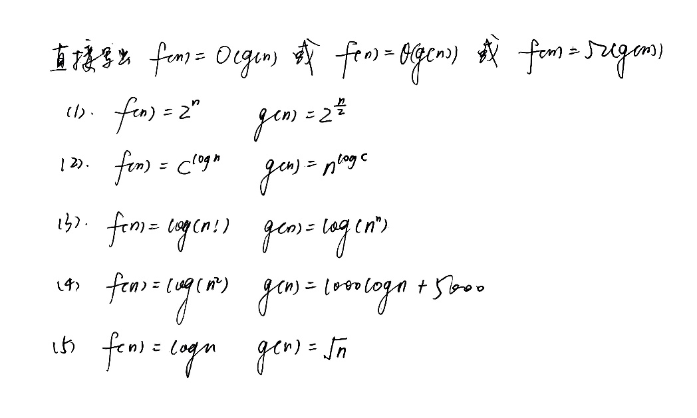
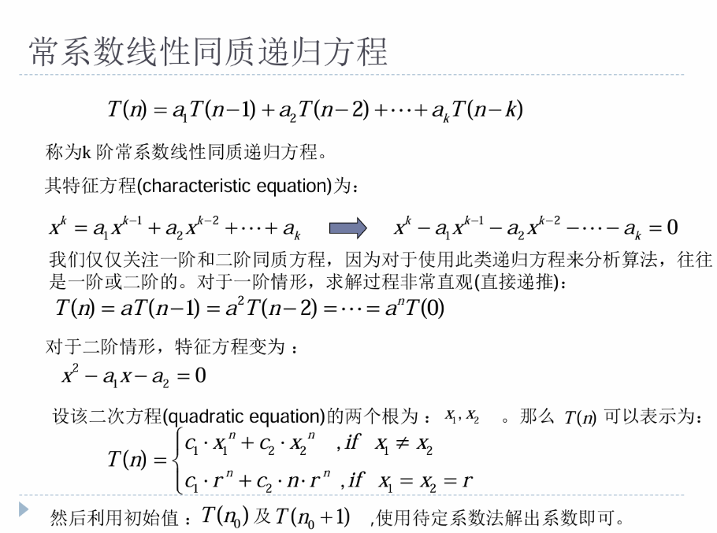

# 23-24（2）算法设计与分析

23-24 第二学期 算法设计与分析

七道大题：
- 复杂度分析，五小问  15’
- 归并排序算法（1）描述（2）伪代码（3）时间复杂度分析  15’
- 最长公共子序列（1）递推式（2）过程（3）最优解 15‘
- Kruscal算法求解最小生成树 15’
- 最小生成树和单源最短路径求解 10‘
- 求解递推式 10‘
- 矩阵连乘dp算法（1）文字描述或伪代码（2）过程及结果 20‘
