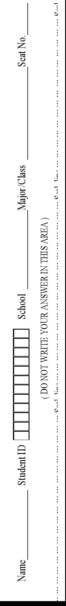
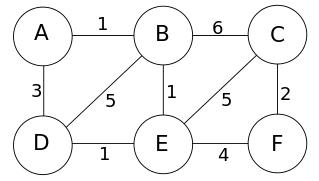
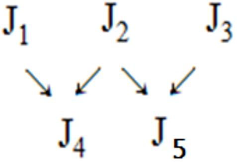
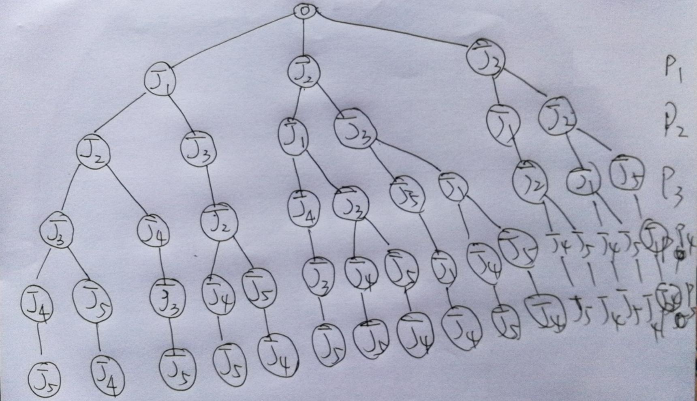
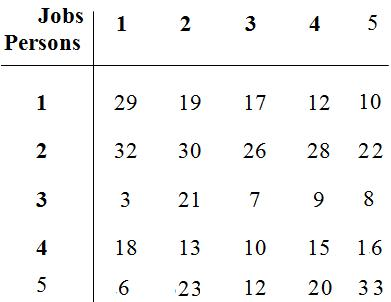
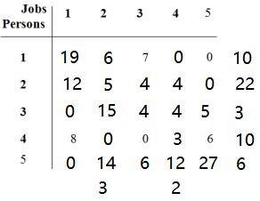
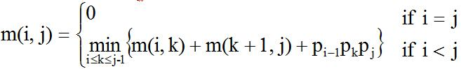
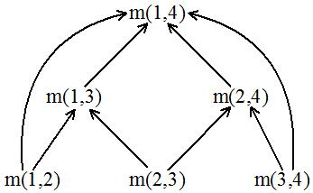
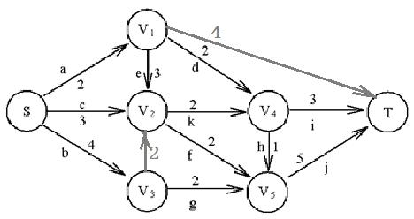
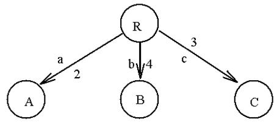

# DAL-2020-Exam Paper A

<!-- page: 1 -->

WARNING: MISBEHAVIOR AT EXAM TIME WILL LEAD TO SERIOUS
CONSEQUENCE.

SCUT Final Exam

《The design and Analysis of Computer Algorithms》

Exam Paper A

Notice:
1. Make sure that you have filled the form on the left side of seal line.
2. Write your answers on the exam paper NOT the draft paper.
3. This is a close-book exam.
4. The exam with full score of 100 points lasts 120 minutes.

Question No.
I
II
III
IV
V
VI
VII
Sum
Score

1 Please introduce what are the Depth-first search (DFS)strategy

and Best-first search (BFS) strategy used in the tree search

algorithm?
(10 marks)

Score：
Answer：

1. We always select the deepest node for expansion for

(5points)

the Depth-first search (DFS)strategy.

2. To
combine
the
depth-first
search
and
the

breadth-first search strategy and Select the node with

the
best
estimated
cost
among
all
nodes
for
the

(5points)

Best-first search (BFS) strategy.

The design and Analysis of Computer Algorithms Final Exam

Page 1 of 18

<!-- page: 2 -->

2. Please introduce the Divide-and-Conquer algorithm and write

out its general steps used to solve problem? (10 marks)

Score：
Answer：

1. The
divide-and-conquer
strategy
is
a
powerful

paradigm for designing efficient algorithms. This

approach first divides a problem into two smaller

sub-problems and each sub-problem is identical to its

original problem, Both of them are then solved and the

sub-solutions
are
finally
merged
into
the
final

(5points)

solution.

2. The general steps of divide-and-conquer strategy

(5points)

used to solve problem are:

Step 1: If the problem size is small, solve this problem

directly; otherwise, split the original problem into

2 sub-problems with equal sizes.

Step 2: Recursively solve these 2 sub-problems by

applying this algorithm.

Step 3: Merge the solutions of the 2 sub- problems into

a solution of the original problem.

The design and Analysis of Computer Algorithms Final Exam

Page 2 of 18

<!-- page: 3 -->

3. Given an un-directed graph like

below, please find out its minimum

spanning
trees
(MST)
using

Kruskal's
and
Prim's
algorithm

respectively. (15 marks)

Score：

Answer：

(5points)

1. To use Kruskal algorithm solving it as below:

Step 1 To sort all of edges by increasing order like below,

AB(1), BE(1), DE(1), CF(2), AD(3), EF(4), BD(5), CE(5),

BC(6)

Step 2 To make the minimum spanning trees (MST) with

selecting the edges one by one from the up sorted queue

(1) AB(1)

(2) BE(1)

(3) DE(1)

(4) CF(2)

The MST

(5) AD(3) Rejected with cycle

(6) EF(4)

Step 3 the minimum cost for this MST is: 1+1+1+2+4 =9

(10points)

2. To use Prim algorithm solving it as below:

Step 1 To sort all of edges by increasing order like below,

The design and Analysis of Computer Algorithms Final Exam

Page 3 of 18

<!-- page: 4 -->

AB(1), BE(1), DE(1), CF(2), AD(3), EF(4), BD(5), CE(5),

BC(6), and then select the first edge AB into MST and the A and

B set change like below:

A
B =V-A

Step 2 There are the edges could

A, B
A, B, E
A, B, E,D
A, B, E,D,F
A, B, E,D,F,C

Step 1
Step 2
Step 3
Step 4
Step 5

C, D, E, F
C, D, F
C, F
C
Φ

be slected at this step and sort them

BE(1), AD(3), BD(5), BC(6), and

then the edge BE(1) will be selected at this step, and the sets A

and B will be changing like above.

Step 3 there are these edges will be selected and sorting them

before like this: ED(1), AD(3), EF(4), BD(5), CE(5), BC(6), and

the edge ED(1) will be selected at this step, and the sets A and B

will be changed like above.

Step 4 there are these edges will be selected and sorting them

before like this: EF(4), CE(5), BC(6), and the edge EF will be

selected at this step and the sets A and B will be changing like

above.

Step 5 there are these edges will be selected and sorting them

before like this: CF(2), CE(5), BC(6), and the edge CF will be

selected into MST at this step and the sets A and B will changing

like above.

The result likes the result of Kruskal's algorithm .

The design and Analysis of Computer Algorithms Final Exam

Page 4 of 18

<!-- page: 5 -->

4. There are five jobs needed to be assigned to five persons.

Given us the following job assignment condition and the cost

matrix, please write out the solution tree and get all possible

solutions, in the meantime to calculate the reduced cost matrix，

according to which you get the lower bound and the optimal

solution using tree searching algorithm. (20 marks)

Score：

Answer：

1. the solution tree likes the graph

below.

(3points)

And all possible
solutions are: J1J2J3J4J5, J1J2J4J3J5,

J1J3J2J4J5, J1J3J2J5J4, J2J1J4J3J5, J2J1J3J4J5, J2J1J3J5J4,

The design and Analysis of Computer Algorithms Final Exam

Page 5 of 18

<!-- page: 6 -->

J2J3J5J1J4, J2J3J1J4J5, J2J3J1J5J4, J3J1J2J4J5, J3J1J2J5J4,

(2points)

J3J2J5J1J4 with total 16 possible
solutions.

2. the reduced cost matrix is:

With the lower bound:

10+22+3+10+6+2+3 = 56

3. The optimal solution using

tree searching algorithm like:

(5points)

1) Root -> J1 with cost (19 +

56)=75, Root -> J2 with cost (6 + 56)=62, and Root -> J3 with

cost (7 + 56)=63;

(8points) searching process

2) Then expand Root -> J2: Root -> J2->J1 with cost
(6 + 56)

+ 12 =74, and Root -> J2-> J3 with cost (6 + 56) + 4 =66;

3) and Then expand Root -> J3 with cost 63: Root -> J3 -> J1

with cost 63+12 =75, and Root -> J3 -> J2 with cost 63+5=68;

4) Then expand Root -> J2-> J3 with cost 66: Root -> J2->

J3->J1 with cost 66 +0 =66, and Root -> J2-> J3->J5 with cost

66 +5 =71;

5) Then expand Root -> J2-> J3 ->J1 with cost 66: Root -> J2->

J3 ->J1->J4 with cost 66 +3 =69, and Root -> J2-> J3 ->J1->J5

with cost 66 +6 =72;

6) Then expand Root -> J3 -> J2 with 68: Root -> J3 -> J2->J1

The design and Analysis of Computer Algorithms Final Exam

Page 6 of 18

<!-- page: 7 -->

with 68+0=68, and Root -> J3 -> J2->J5 with 68+5=73;

7) Then expand Root -> J3 -> J2->J1 with 68: Root -> J3 ->

J2->J1->J4 with 68+3 =71, and Root -> J3 -> J2->J1->J5 with

68+6 =74;

8) Then expand Root -> J2-> J3 ->J1->J4 with cost 69: Root ->

J2-> J3 ->J1->J4->J5 with cost 69+27=96; (leaf)

9) Then expand Root -> J3 -> J2->J1->J4 with 71: Root -> J3

-> J2->J1->J4-J5 with cost 71+27=98; (leaf)

10) Then expand Root -> J2-> J3 ->J1->J5 with 72: Root ->

J2-> J3 ->J1->J5->J4 with cost 72+12 =84; (leaf)

11) Then expand Root -> J3 -> J2->J5 with 73: Root -> J3 ->

J2->J5->J1 with cost 73+8=81;

12) Then expand Root -> J3 -> J2->J1->J5 with 74: Root -> J3

-> J2->J1->J5->J4 with cost: 74++12 =86; (leaf)

13) Then expand Root -> J3 -> J1 with cost 75: Root -> J3 ->

J1->J2 with cost: 75+15 =90;

14) Then expand Root -> J1 with cost 75: Root -> J1->J2 with

cost 75+5=80, and Root -> J1->J3 with cost 75+4=79;

15) Then expand Root -> J1->J3 with cost 79: Root ->

J1->J3->J2 with cost 79+15=94;

16) Then expand Root -> J1->J2 with cost 80: Root ->

The design and Analysis of Computer Algorithms Final Exam

Page 7 of 18

<!-- page: 8 -->

J1->J2->J3 with cost 80+4=84, and Root -> J1->J2->J4 with

cost 80+4=84;

17) Then expand Root -> J3 -> J2->J5->J1 with cost 81: Root

-> J3 -> J2->J5->J1-J4 with cost: 81+12=93; (leaf)

18) the optimal solution is Root -> J2-> J3 ->J1->J5->J4 with

cost 72+12 =84; (leaf); Or J2 -P1, J3-P2, J1-P3, J5-P4 and J4-P5

with minimum cost 84.
(2points) result

The design and Analysis of Computer Algorithms Final Exam

Page 8 of 18

<!-- page: 9 -->

5. Given you five matrices: M1(10×20), M2（20×30）, M3（30

×20）, M4（20×10），M5（10×20）,please calculate the

minimum cost of their product using dynamic programming

algorithm for matrices multiplication and write out the optimal

multiplication sequence with minimum cost. (20 marks)

Score：
Answer：

1. Let m(i, j) denote the minimum cost for computing Ai

Ai+1
…
Aj

Computation sequence

(3points)

2. For M1(10×20), M2（20×30）, M3（30×20）, M4（20

×10），M5（10×20）, we calculate them in the following half

table.

1) The members in the first row calculated: M12 = 10*20*30

The design and Analysis of Computer Algorithms Final Exam

Page 9 of 18

<!-- page: 10 -->

=6000 with new matrix size: 10×30;

M11=0
M22=0
M33=0
M44=0
M55=0

M12=6000
M23=12000
M34=6000
M45=4000

(3points)

M13=12000
M24=12000
M35=12000

M14=14000 M25=16000

M15=16000

M23 = 20*30*20 =12000 with new matrix size: 20×20;

M34 = 30*20*10 =6000 with new matrix size: 30×10;

M45 = 20*10*20 =4000 with new matrix size: 20×20;

(3points)

2) The members in the second row calculated:

(1) M13 = (M12×M3) or (M1×M23)

For (M12×M3), it is: 6000 + 10*30*20 =12000 with new

size: 10×20;

For (M1×M23), it is: 12000 + 10*20*20 = 16000 with

new size: 10×20;

(3points)

The minimum value is : 12000.

(2) M24 = (M23×M4) or (M2×M34)

For (M23 × M4), it is: 12000 + 20*20*10 =16000 with

new size: 20×10;

For (M2×M34), it is: 6000 + 20*30*10 =12000 with new

size: 20×10;

The design and Analysis of Computer Algorithms Final Exam

Page 10 of 18

<!-- page: 11 -->

The minimum value is : 12000;

(3) M35 = (M34×M5) or (M3×M45)

For (M34×M5), it is: 6000 + 30*10*20 =12000 with new

size: 30×20;

For (M3×M45), it is: 4000 + 30*20*20 =16000 with new

size: 30×20;

The minimum value is : 12000;

(3points)

3) The members in the third row calculated:

(1) M14 = (M13×M4) or (M12×M34) or (M1×M24)

For (M13 × M4), it is: 12000 + 10*20*10 =14000 with

new size: 10×10;

For (M12×M34), it is: 6000 +6000+ 10*30*10 =15000

with new size: 10×10;

For (M1 × M24), it is: 12000+ 10*20*10 =14000 with

new size: 10×10;

The minimum value is : 14000;

(2) M25 = (M24×M5) or (M23×M45) or (M2×M35)

For (M24 × M5), it is: 12000 + 20*10*20 =16000 with

new size: 20×20;

For (M23×M45), it is: 12000 +4000 + 20*20*20 =24000

with new size: 20×20;

The design and Analysis of Computer Algorithms Final Exam

Page 11 of 18

<!-- page: 12 -->

For (M2 × M35), it is: 12000 + 20*30*20 =24000 with

new size: 20×20;

The minimum value is : 16000;

(3points)

4) The members in the last row calculated:

M15 = (M1 ×M25) or (M12 ×M35) or (M13 ×M45)or

(M14×M5)

For (M1 × M25), it is: 16000 + 10*20*20 =20000 with

new size: 10×20;

For (M12×M35), it is: 6000+12000 + 10*30*20 =24000

with new size: 10×20;

For (M13×M45), it is: 12000+4000 + 10*20*20 =20000

with new size: 10×20;

For (M14 × M5), it is: 14000+ 10*10*20 =16000 with

new size: 10×20;

The minimum value for M15 is : 16000, this is the

minimum cost of their product, and the optimal multiplication

sequence is:

(2points)

(M1 × (M2 × (M3 ×M4))) × M5

or

(((M1 × M2) × M3 )×M4) × M5

The design and Analysis of Computer Algorithms Final Exam

Page 12 of 18

<!-- page: 13 -->

6. Given us four objects which

would be put into a knapsack with

capacity of 16, and their weights

and
profits
are
shown
at
the

following table, please calculate its optimal solution for

knapsack problem using greedy algorithm and for 0/1 knapsack

problem using dynamic programming algorithm independently.

Score：

(15 marks)

Answer：

The capacity of this knapsack could be 16 or 20 with no

problem. We solve it by the capacity 20 like below:

1. For knapsack problem using greedy algorithm, to calculate

the profit per weight like: (5 points)

1) P1/W1 = 40/10 =4, P2/W2 = 25/5=5, P3/W3 = 35/6=5.833,

P4/W4 = 45/8=5.625

2) To sort them by decrease order:

P3/W3 > P4/W4 > P2/W2 > P1/W1

3) To select the item one by one using the greedy algorithm:

Step
1
(W3,
P3)
=(6,
35)
to
be
selected,
then

M’=(M-W3)=20-6=14;

Step
2
(W4,
P4)
=(8,
45)
to
be
selected,
then

The design and Analysis of Computer Algorithms Final Exam

Page 13 of 18

<!-- page: 14 -->

M’’=(M’-W4)=14-8=6;

Step
3,
(W2,
P2)
=(5,
25)
to
be
selected,
then

M’’’=(M’’-W2)=6-5=1;

Step 4, one of (W1, P1) =(1, 4) to be selected, then

M’’’’=(M’’’-W1/10)=1-10/10=0;

Then the optimal solution for knapsack problem using

greedy algorithm is: (W3, P3) =(6, 35), (W4, P4) =(8, 45), (W2,

P2) =(5, 25) and one of (W1, P1) =(1, 4) are selected into this

knapsack with maximum profits 109 and weight of 20.

If the capacity is 16,
it is could solved like this:

4) P1/W1 = 40/10 =4, P2/W2 = 25/5=5, P3/W3 = 35/6=5.833,

P4/W4 = 45/8=5.625

5) To sort them by decrease order:

P3/W3 > P4/W4 > P2/W2 > P1/W1

6) To select the item one by one using the greedy algorithm:

Step
1
(W3,
P3)
=(6,
35)
to
be
selected,
then

M’=(M-W3)=16-6=10;

Step
2
(W4,
P4)
=(8,
45)
to
be
selected,
then

M’’=(M’-W4)=10-8=2;

Step 3, two of (W2, P2) =2*(1, 5) to be selected, then

M’’’=(M’’-W2)=2-2=0;

The design and Analysis of Computer Algorithms Final Exam

Page 14 of 18

<!-- page: 15 -->

Then the optimal solution for knapsack problem using

greedy algorithm is: (W3, P3) =(6, 35), (W4, P4) =(8, 45), two

of
(W2, P2) =(2, 10) are selected into this knapsack with

maximum profits 90 and weight of 16.

2. For 0/1
knapsack problem using dynamic programming

algorithm. (10 points)

1) Let fi(Q) be the value of an optimal solution to objects

1,2,3, … ,i with capacity Q. then fi(Q) = max{ fi-1(Q),

fi-1(Q-Wi)+Pi }, the optimal solution of this problem is f4(20)

or f4(16). (1 points)

2) To Calculate f4(20) like below:

(1) f4(20)=Max{f3(20),f3(20-8)+45}=Max{f3(20),

f3(12)+45}(1 points)

(2) F3(20)=Max{f2(20),f2(20-6)+35}=Max{f2(20),

f2(14)+35}

f3(12)=Max{f2(12),f2(12-6)+35}=Max{f2(12), f2(6)+35}

(1 points)

(3) f2(20) = Max{f1(20), f1(20-5)+25} = Max{f1(20),

f1(15)+25}

f2(14)
=
Max{f1(14),
f1(14-5)+25}=
Max{f1(14),

The design and Analysis of Computer Algorithms Final Exam

Page 15 of 18

<!-- page: 16 -->

f1(9)+25}

f2(12) = Max{f1(12), f1(12-5)+25} = Max{f1(12),

f1(7)+25}

f2(6) = Max{f1(6), f1(6-5)+25} = Max{f1(6), f1(1)+25}

(2 points)

f1(20) = 40 (20 >10), f1(15)= 40 (20 >10), f1(14)= 40

(20 >10), f1(9)= 0 (9 <10), f1(12)= 40 (20 >10), f1(7)= 0 (7

<10),f1(6)= 0 (6 <10), f1(1)= 0 (1 <10);

(2 points)

(4) Replace them into the above (3)\(2) and (1), to get:

f2(6) = 25,

f2(12) = 25,

f2(14) = max{40, 25}=40,

f2(20)=Max{f1(20), f1(15)+25} =max{40, 40+25}=65;

Then

F3(20)=Max{f2(20), f2(14)+35} =max{65, 40+35}=75

F3(12)=Max{f2(12), f2(6)+35}=max{25,25+35}=60

(2 points)

In the end, we can get:

(5)
f4(20)=Max{f3(20), f3(12)+45}=max{75, 60+45}=105

The items ((W4, P4) =(8, 45), (W3, P3) =(6, 35), (W2,

The design and Analysis of Computer Algorithms Final Exam

Page 16 of 18

<!-- page: 17 -->

P2) =(5, 25)) are selected into this knapsack with sum of weight

8+6+5=19 <20 and sum of profit 105 = 45+35+25. (1 points)

3) To Calculate f4(16) almost like calculating f4(20).

7.
Given
us
the

following directed graph

please find the shortest

path from Node S to T

using the A* algorithm.

(10 marks)

Score：

Answer：

1) To define the cost function of node n : f(n)

f(n) = g(n) + h(n)

g(n): cost from root to node n.

h(n): estimated cost from node n to a goal node. (2 points)

2) To find the shortest path from Node S to T using the A*

algorithm like below:

Step 1: f(A) = g(A) + h(A)=2

+min(2,3,4) = 2+2 =4

f(B) = g(B) + h(B)=4 +min(2,2) =

4+2 =6

The design and Analysis of Computer Algorithms Final Exam

Page 17 of 18

<!-- page: 18 -->

f(C) = g(C) + h(C)=3 +min(2,2) = 3+2 =5
(2 points)

Step 2: Expand A node, then we can

get:

F(D)
=g(D)
+

h(D)=f(A)+2+min(1,3)=4+2+1=7

f(F) =g(F) + h(F)= f(A)+4+0=2+4=6(Destination)

f(C) =g(C) + h(C)=4+3+min(2,2) = 9, and compare with step

1,F(C) =5;
(2 points)

Step 3: Expand C node, then we can get:

f(D) = g(D) + h(D)=f(C)+2 +min(3) = 5+2+3

=10,compare with step 2, f(D) =7;

f(E) = g(E) + h(E)=f(C)+2 +min(5) = 5+2+5 =12

(2 points)

Step 4: Expand D node, we get:

f(F)=g(F) + h(F)=f(D)+3 =7+3=10 compare it with step 2, then

f(F) =6(Destination) (1 points)

In the en ,we find the shortest path from Node S to T using the

A* algorithm like: S -A(V1)-T with path 6. (1 points)

The design and Analysis of Computer Algorithms Final Exam

Page 18 of 18
