# 13_supplimental

<!-- page: 1 -->

Design and Analysis of Algorithms

Supplemental

Si  Wu

School of CSE, SCUT

cswusi@scut.edu.cn

TA: 1684350406@qq.com

1

<!-- page: 2 -->

Outline

• Longest Common Substring
• Chain Matrix Multiplication

<!-- page: 3 -->

Longest Common Substring

A slightly different problem (longest common
subsequence) with a similar solution

Given two strings X = x1x2...xm and Y = y1y2...yn, find their longest
common substring Z , i.e., a largest k for which there are indices i
and j with xixi +1...xi+k−1 = yjyj+1...yj+k−1.

For example:
X : DEADBEEF
Y : EATBEEF
Z : BEEF //pick the longest contiguous substring

Show how to do this by dynamic programming.

3

<!-- page: 4 -->

LCS Solution

Step 1: Space of Subproblems

For 1 ≤i ≤m, and 1 ≤j ≤n,

• Define 𝑑𝑖,𝑗to be the length of the longest common
substring ending at 𝑥𝑖and 𝑦𝑗. (Does this work?)
• Let D be the m × n matrix [𝑑𝑖,𝑗].
• How does D provide answer?

4

<!-- page: 5 -->

LCS Solution

Step 2: Recursive Formulation

Case 1: If 𝑥𝑖= 𝑦𝑗, then 𝑧𝑘= 𝑥𝑖= 𝑦𝑗and

𝑧𝑘−1 is a LCS of X and Y ending at 𝑥𝑖−1 and 𝑦𝑗−1
Case 2: If 𝑥𝑖≠𝑦𝑗, then there cannot be a common
substring ending at 𝑥𝑖and 𝑦𝑗!

𝑑𝑖,𝑗= ൝𝑑𝑖−1,𝑗−1 + 1
𝑖𝑓𝑥𝑖= 𝑦𝑗
0
𝑖𝑓𝑥𝑖≠𝑦𝑗
Finally, we can find length of longest common substring by
finding maximum 𝑑𝑖,𝑗among all possible ending position 𝑖
and 𝑗.

𝐿𝐶𝑆𝑆𝑢𝑏𝑆𝑡𝑟𝑖𝑛𝑔𝑋, 𝑌= max{𝑑𝑖,𝑗}

5

<!-- page: 6 -->

LCS Solution

Step 3: Bottom-up Computation
Similar to Longest Common Subsequence we set the first
row and column of the matrix 𝑑[0, 𝑗] and 𝑑[𝑖, 0] to be 0.

Calculate 𝑑1, 𝑗for 𝑗= 1, 2, … , n
Then, the 𝑑2, 𝑗for 𝑗= 1, 2, … , n
Then, the 𝑑3, 𝑗for 𝑗= 1, 2, … , n

etc., filling the matrix row by row and left to right.

For this problem we do not need to create another 𝑚×
𝑛matrix for storing arrows. Instead, we use 𝑙𝑚𝑎𝑥and 𝑝𝑚𝑎𝑥to
store the largest length of common substring and its 𝑖position
respectively. This suffices to reconstruct the solution.

6

<!-- page: 7 -->

LCS Solution

LONGEST-COMMON-SUBSTRING(X,Y)

𝑚←𝑙𝑒𝑛𝑔𝑡ℎ(𝑋);  𝑛←𝑙𝑒𝑛𝑔𝑡ℎ(𝑌);
𝑙𝑚𝑎𝑥←0;  𝑝𝑚𝑎𝑥←0;
𝒇𝒐𝒓i ←0 𝒕𝒐𝑚// initialization

𝑑𝑖, 0 ←0;
𝒇𝒐𝒓𝑗←0 𝒕𝒐𝑛

𝑑0, 𝑗←0;
𝒇𝒐𝒓i ←1 𝒕𝒐𝑚// dynamic programming

𝒇𝒐𝒓𝑗←1 𝒕𝒐𝑛

𝒊𝒇(𝑥𝑖≠𝑦𝑗)

𝑑[𝑖, 𝑗] ←0;
else

𝑑𝑖, 𝑗←𝑑𝑖−1, 𝑗−1 + 1 ;
𝒊𝒇(𝑑𝑖, 𝑗> 𝑙𝑚𝑎𝑥)

𝑙𝑚𝑎𝑥←𝑑𝑖, 𝑗; 𝑝𝑚𝑎𝑥←𝑖;
……
𝒓𝒆𝒕𝒖𝒓𝒏𝑙𝑚𝑎𝑥, 𝑝𝑚𝑎𝑥;
7

<!-- page: 8 -->

LCS Example

• Take the two strings: X = “EL GATO” and Y =“GATER”.
• We’ll fill in the following table D:

𝑑𝑖,𝑗= ൝𝑑𝑖−1,𝑗−1 + 1
𝑖𝑓𝑥𝑖= 𝑦𝑗
0
𝑖𝑓𝑥𝑖≠𝑦𝑗

<!-- page: 9 -->

LCS Example

• Take the two strings: X = “EL GATO” and Y =“GATER”.
• We’ll fill in the following table D:

𝑑𝑖,𝑗= ൝𝑑𝑖−1,𝑗−1 + 1
𝑖𝑓𝑥𝑖= 𝑦𝑗
0
𝑖𝑓𝑥𝑖≠𝑦𝑗

When filling D, we only look if the two letters in the strings are
equal and if they are we add one to the element to the left and
up.

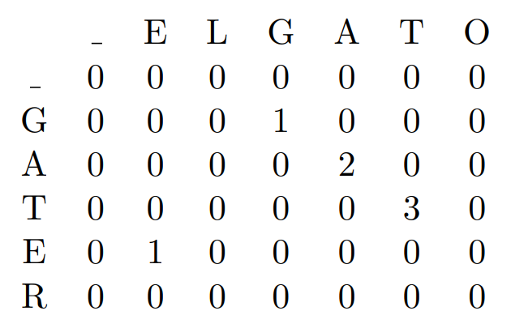

<!-- page: 10 -->

Review of Matrix Multiplication

• Matrix: An n × m matrix 𝐴= [𝑎𝑖, 𝑗] is a two-
dimensional array.

which has n rows and m columns.

10

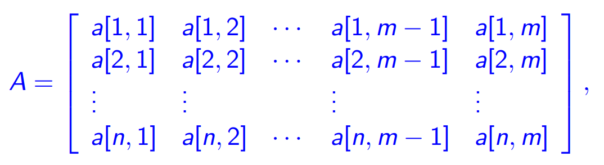

<!-- page: 11 -->

Review of Matrix Multiplication

• The product C = AB of a p × q matrix A and a q × r
matrix B is a p × r matrix C given by.

• Complexity of Matrix multiplication: Note that C has pr
entries and each entry takes Θ(q) time to compute so
the total procedure takes Θ(pqr) time.

11

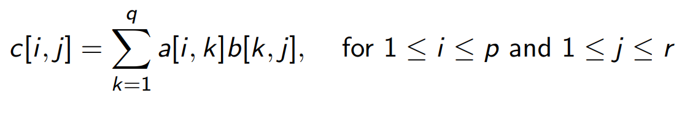

<!-- page: 12 -->

Remarks on Matrix Multiplication

• Matrix multiplication is associative, e.g.,

𝐴1𝐴2𝐴3 = 𝐴1𝐴2 𝐴3 = 𝐴1 𝐴2𝐴3 ,

so parenthesization does not change result.

• Matrix multiplication is NOT commutative, e.g.,

𝐴1𝐴2 ≠𝐴2𝐴1

12

<!-- page: 13 -->

Matrix Multiplication of ABC

• Given p × q matrix A, q × r matrix B and r × s matrix C,
ABC can be computed in two ways: (AB)C and A(BC).
• The number of multiplications needed are:
mult[(AB)C]   =   pqr + prs,
mult[A(BC)]   =   qrs + pqs.

Implication: Multiplication “sequence” (parenthesization)
is important!!

13

<!-- page: 14 -->

The Chain Matrix Multiplication Problem

• Definition (Chain matrix multiplication problem) :
Given dimensions 𝑝0,𝑝1, . . . ,𝑝𝑛, corresponding to
matrix sequence  𝐴1𝐴2 … 𝐴𝑛in which 𝐴𝑖has
dimension 𝑝𝑖−1 × 𝑝𝑖, determine the “multiplication
sequence” that minimizes the number of scalar
multiplications in computing 𝐴1𝐴2 … 𝐴𝑛.
• Question: Is there a better approach?

14

<!-- page: 15 -->

Developing a Dynamic Programming Algorithm

Step 1: Define Space of Subproblems

• Original Problem:
Determine minimal cost multiplication sequence for 𝐴1..𝑛.
• Subproblems: For every pair 1 ≤ i ≤ j ≤ n:

Determine minimal cost multiplication sequence for 𝐴𝑖..𝑗=
𝐴𝑖𝐴𝑖+1 … 𝐴𝑗.

Note that 𝐴𝑖..𝑗is a 𝑝𝑖−1 × 𝑝𝑗matrix.

• How can we solve larger problems using subproblem solutions?

15

<!-- page: 16 -->

Relationships among Subproblems
• At the last step of any optimal multiplication sequence (for a
subproblem), there is some k such that the two matrices
𝐴𝑖..𝑘and 𝐴𝑘+1..𝑗are multiplied together. That is,

𝐴𝑖..𝑗= (𝐴𝑖⋯𝐴𝑘)(𝐴𝑘+1 ⋯𝐴𝑗) = 𝐴𝑖..𝑘𝐴𝑘+1..𝑗
• Question. How do we decide where to split the chain (what
is k)?

ANS: Can be any k. Need to check all possible values.
• Question. How do we parenthesize the two subchains 𝐴𝑖..𝑘
and 𝐴𝑘+1..𝑗?

ANS: 𝐴𝑖..𝑘and 𝐴𝑘+1..𝑗must be computed optimally, so we
can apply the same procedure recursively.

16

<!-- page: 17 -->

Relationships among Subproblems

Step 2: Constructing optimal solutions from optimal
subproblem solution
• For 1 ≤ i ≤ j ≤ n, let 𝑚[𝑖, 𝑗] denote the minimum
number of multiplications needed to compute 𝐴𝑖..𝑗.
This optimum cost must  satisfy  the following
recursive definition.

𝑚𝑖, 𝑗= ቊ
0,
𝑖= 𝑗,
𝑚𝑖𝑛𝑖≤𝑘<𝑗(𝑚𝑖, 𝑘+ 𝑚𝑘+ 1, 𝑗+ 𝑝𝑖−1𝑝𝑘𝑝𝑗) 𝑖< 𝑗

𝐴𝑖..𝑗= 𝐴𝑖..𝑘𝐴𝑘+1..𝑗

17

<!-- page: 18 -->

Developing a Dynamic Programming Algorithm

Step 3: Bottom-up computation of 𝑚[𝑖, 𝑗]
• Recurrence:

Fill in the 𝑚[𝑖, 𝑗] table in an order, such that when it is time to
calculate 𝑚[𝑖, 𝑗], the values of 𝑚[𝑖, 𝑘] and 𝑚[𝑘+ 1, 𝑗] for all k
are already available.
An easy way to ensure this is to compute them in increasing
order of the size (𝑗−𝑖) of the matrix-chain 𝐴𝑖..𝑗:
𝑚[1, 2], 𝑚[2, 3], 𝑚[3, 4], . . . , 𝑚[𝑛−3, 𝑛−2], 𝑚[𝑛−2, 𝑛
−1], 𝑚[𝑛−1, 𝑛]
𝑚[1, 3], 𝑚[2, 4], 𝑚[3, 5], . . . , 𝑚[𝑛−3, 𝑛−1], 𝑚[𝑛−2, 𝑛]
𝑚1, 4 , 𝑚2, 5 , 𝑚3, 6 , . . . , 𝑚𝑛−3, 𝑛
. . .
𝑚[1, 𝑛−1], 𝑚[2, 𝑛]
𝑚[1, 𝑛]

18

<!-- page: 19 -->

Example for the Bottom-Up Computation

• Example.
A chain of four matrices 𝐴1, 𝐴2, 𝐴3 and 𝐴4, with 𝑝0 =
5, 𝑝1 = 4, 𝑝2 = 6, 𝑝3 = 2 and 𝑝4 = 7. Find 𝑚[1, 4].
S0: Initialization

19

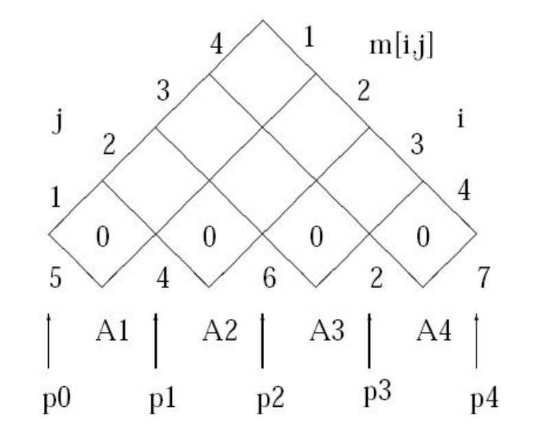

<!-- page: 20 -->

Example – Continued

• Step 1: Computing 𝑚[1, 2]
By definition

𝑚[1,2]
=
min
1≤𝑘<2(𝑚[1, 𝑘] + 𝑚[𝑘+ 1,2] + 𝑝0𝑝𝑘𝑝2
=
𝑚[1,1] + 𝑚[2,2] + 𝑝0𝑝1𝑝2 = 120

20

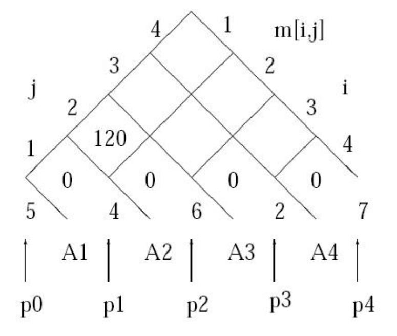

<!-- page: 21 -->

Example – Continued

• Step 2: Computing 𝑚[2, 3]
By definition

𝑚[2,3]
=
min
2≤𝑘<3(𝑚[2, 𝑘] + 𝑚[𝑘+ 1,3] + 𝑝1𝑝𝑘𝑝3
=
𝑚[2,2] + 𝑚[3,3] + 𝑝1𝑝2𝑝3 = 48

21

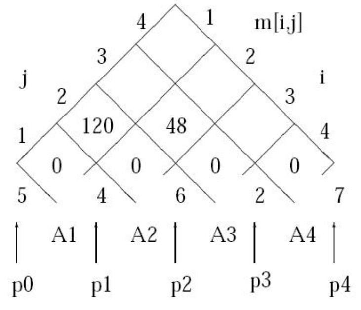

<!-- page: 22 -->

Example – Continued

• Step 3: Computing 𝑚[3, 4]
By definition

𝑚[3,4]
=
min
3≤𝑘<4(𝑚[3, 𝑘] + 𝑚[𝑘+ 1,4] + 𝑝2𝑝𝑘𝑝4
=
𝑚[3,3] + 𝑚[4,4] + 𝑝2𝑝3𝑝4 = 84

22

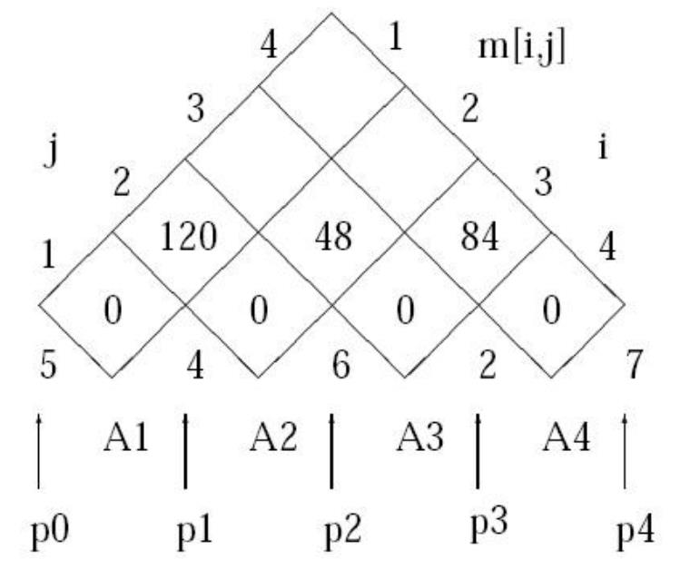

<!-- page: 23 -->

Example – Continued

• Step 4: Computing 𝑚[1, 3]
By definition

𝑚[1,3]
=
min
1≤𝑘<3(𝑚[1, 𝑘] + 𝑚[𝑘+ 1,3] + 𝑝0𝑝𝑘𝑝3

=
min 𝑚[1,1] + 𝑚[2,3] + 𝑝0𝑝1𝑝3

𝑚[1,2] + 𝑚[3,3] + 𝑝0𝑝2𝑝3
=
88

23

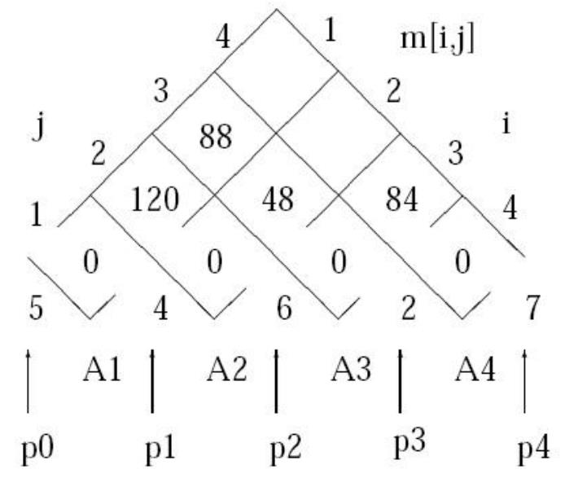

<!-- page: 24 -->

Example – Continued

• Step 5: Computing 𝑚[2, 4]
By definition
𝑚[2,4]
=
min
2≤𝑘<4(𝑚[2, 𝑘] + 𝑚[𝑘+ 1,4] + 𝑝1𝑝𝑘𝑝4

=
min 𝑚[2,2] + 𝑚[3,4] + 𝑝1𝑝2𝑝4

𝑚[2,3] + 𝑚[4,4] + 𝑝1𝑝3𝑝4
=
104

24

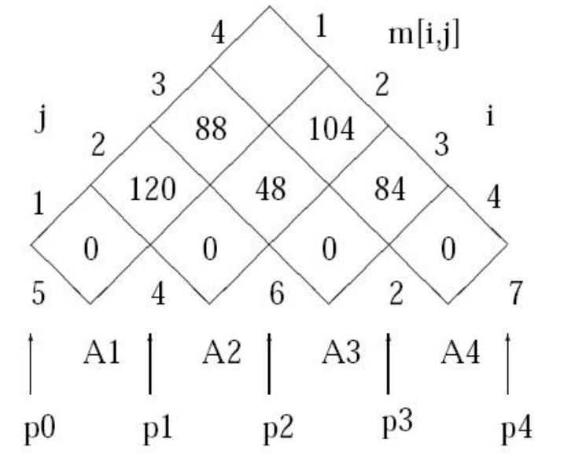

<!-- page: 25 -->

Example – Continued

• Step 6: Computing 𝑚[1, 4]
By definition

𝑚[1,4]
=
min
1≤𝑘<4(𝑚[1, 𝑘] + 𝑚[𝑘+ 1,4] + 𝑝0𝑝𝑘𝑝4

𝑚[1,1] + 𝑚[2,4] + 𝑝0𝑝1𝑝4
𝑚[1,2] + 𝑚[3,4] + 𝑝0𝑝2𝑝4
𝑚[1,3] + 𝑚[4,4] + 𝑝0𝑝3𝑝4
=
158

=
min

25

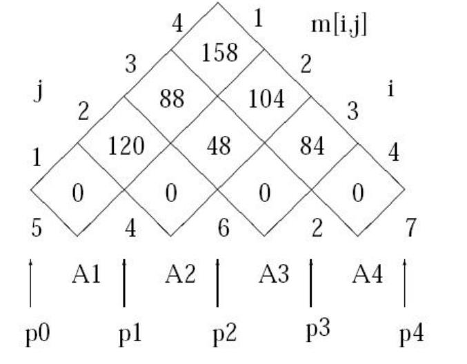

<!-- page: 26 -->

The Dynamic Programming Algorithm

Matrix-Chain(p, n): // l is length of sub-chain

26

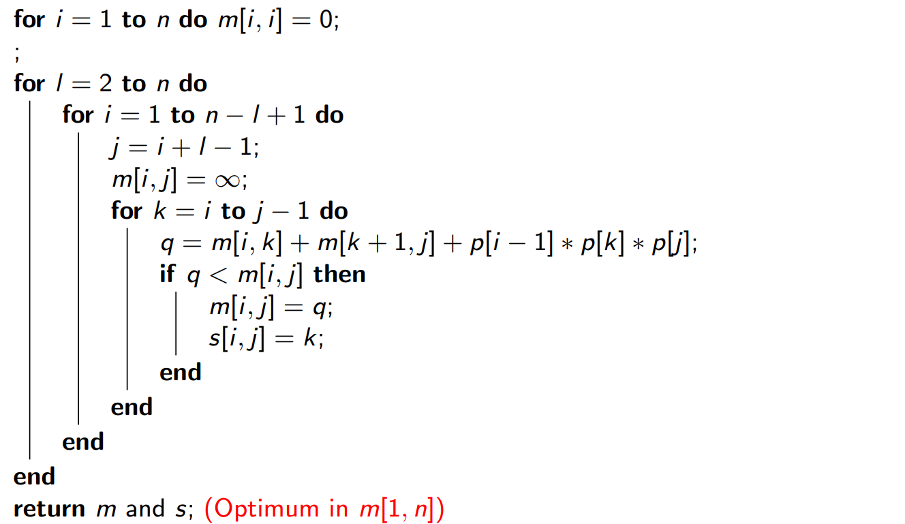
