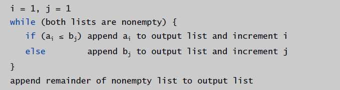
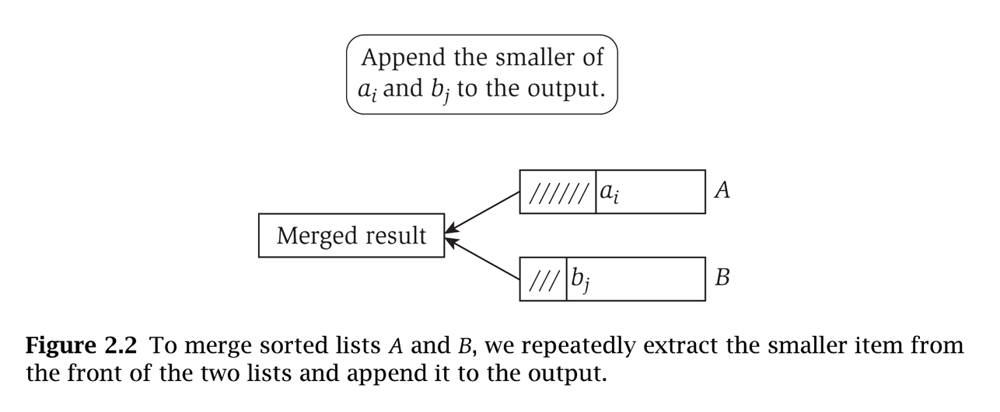
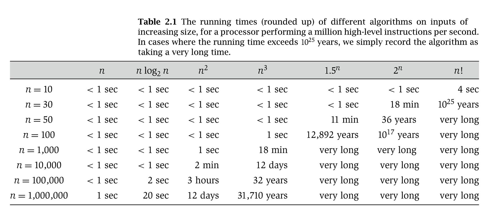
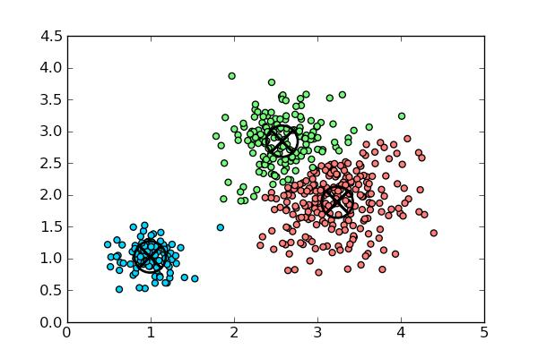
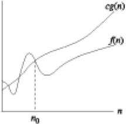
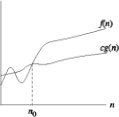
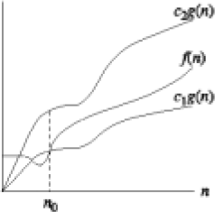

# 2-analysis

<!-- page: 1 -->

Design and Analysis of Algorithms

Algorithm Analysis

Si  Wu

School of CSE, SCUT

cswusi@scut.edu.cn

TA: 1684350406@qq.com

1

<!-- page: 2 -->

Topics

• Polynomial Running time
• Asymptotic Growth
• O-notation
• Ω-notation
• Θ-notation

2

<!-- page: 3 -->

Brute Force

Brute force. For many nontrivial problems, there
is a natural brute-force search algorithm that
checks every possible solution.
• Typically takes 𝟐𝒏time or worse for inputs of
size n.
• Unacceptable in practice.

3

<!-- page: 4 -->

Polynomial Running time

Desirable Scaling Property. When the input size doubles,
the algorithm should slow down by at most some constant
factor 𝑪.

An algorithm is poly-time if the above scaling property
holds.

There exist constants 𝒄> 𝟎and 𝒅> 𝟎such that, for every
input of size n, the running time of the algorithm is bounded
above by 𝒄𝒏𝒅primitive computational steps.

4

<!-- page: 5 -->

Polynomial Running time

We say that an algorithm is efficient if it has a polynomial
running time.

It really works in practice
• In practice, the poly-time algorithms that people develop
have low constants and low exponents.
• Breaking through the exponential barrier of brute force
typically exposes some crucial structure of the problem.

Exceptions. Some poly-time algorithms do have high
constants and/or exponents are useless in practice.

Which would you prefer 𝟐𝟎𝒏𝟏𝟐𝟎vs. 𝒏𝟏+𝟎.𝟎𝟐𝒍𝒈𝒏?

5

<!-- page: 6 -->

Linear Running Time

Merge. Combine two sorted lists A and B into sorted whole.

Merging two lists, each of length n, takes 𝑶(𝒏) time.
After each compare, the length of output list increases by 1.

6

<!-- page: 7 -->

Why It Matters

7

<!-- page: 8 -->

Types of Analyses

• Worst case. Running time guarantee for any input of
size n.

• Probabilistic. Expected running time of a
randomized algorithm.

• Average-case. Expected running time for a random
input of size n.

8

<!-- page: 9 -->

Worst-Case Analysis

Worst case. Running time guarantee for any input of size n.
• Generally captures efficiency in practice.
• But hard to find effective alternative.

Exceptions. Some exponential-time algorithms are used
widely in practice because the worst-case instances seem to
be rare.

K-means clustering algorithm
9

<!-- page: 10 -->

Asymptotic Growth

In the insertion-sort example, we discussed that
when  analyzing algorithms we are
• interested in worst-case running time as
function of input size n.
• not interested in exact constants in bound.
• not interested in lower order terms.

10

<!-- page: 11 -->

Asymptotic Growth

We want to express rate of growth of standard functions:

-the leading term with respect to n.
-ignoring constants in front of it

Ex.  k1n + k2 ~ n

k2nlogn ~ nlogn
k1n2 + k2n + k3 ~ n2

We also want to formalize e.g. that a nlogn algorithm is
better than a n2 algorithm.

11

<!-- page: 12 -->

O-notation

O(g(n)) = {f(n): There exist positive constants c and n0 such
that 0≤f(n) ≤cg(n) for all n≥n0}

--O(.) is used to asymptotically upper bound a function.
--O(.) is used to bound worst-case running time.

Ex. 𝒇𝒏= 𝟑𝟐𝒏𝟐+ 𝟏𝟕𝒏+ 𝟏
• 𝒇𝒏is 𝑶(𝒏𝟐)
• 𝒇𝒏is also 𝑶(𝒏𝟑)
• 𝒇𝒏is neither 𝑶(𝒏) nor 𝑶(𝒏𝒍𝒈𝒏)

Typical usage. Insertion-Sort makes 𝑶(𝒏𝟐)
compares to sort n elements.

12

<!-- page: 13 -->

O-notation

Notational abuses

𝑶(𝒈(𝒏)) is a set of functions, but computer scientists often
write 𝒇𝒏= 𝑶(𝒈𝒏) instead of 𝒇𝒏∈𝑶(𝒈𝒏)

Ex. Consider 𝒇𝒏= 𝟓𝒏𝟑and 𝒈𝒏= 𝟑𝒏𝟐

• We have 𝒇𝒏= 𝑶𝒏𝟑= 𝒈𝒏.
• Thus, 𝒇𝒏= 𝒈𝒏.

X

Non-negative functions. When using big O notation, we
assume that the functions involved are non-negative.

13

<!-- page: 14 -->

O-notation

Ex.

• 1/3n2 – 3n ∈O(n2)
Because 1/3n2 – 3n ≤cn2 if c ≥1/3-3/n which holds for c =
1/3 and n >1.

• k1n2+k2n+k3∈O(n2)
Because k1n2 + k2n+ k3 ≤(k1+|k2|+|k3|)n2and for c > k1 + |k2|
+ |k3| and n≥ 1, k1n2  + k2n + k3  ≤cn2 .

• k1n2+k2n+k3∈O(n3)
As k1n2  + k2n+ k3 ≤(k1+|k2|+|k3|)n3(upper bound).

14

<!-- page: 15 -->

O-notation

Note:

When we say “the running time is O(n2)” we mean that the
worst-case running time is O(n2) – the best case might be
better.

Use of O-notation often makes it much easier to analyze
algorithms; we can easily prove the insertion-sort time
bound O(n2) .

15

<!-- page: 16 -->

Ω-notation

Ω(g(n)) = {f(n): There exist positive constants c and
n0 such  that 0 ≤ cg(n) ≤f(n) for all n≥n0}
•
We use Ω-notation to give a lower bound on a
function.

Ex. 𝒇𝒏= 𝟑𝟐𝒏𝟐+ 𝟏𝟕𝒏+ 𝟏
• 𝒇𝒏is both 𝜴(𝒏𝟐) and 𝜴(𝒏)
• 𝒇𝒏is neither 𝜴(𝒏𝟑) nor 𝜴(𝒏𝟑𝒍𝒈𝒏)

Typical usage. Any compare-based
sorting algorithm requires 𝜴𝒏𝒍𝒈𝒏
compares in the worst case.

16

<!-- page: 17 -->

Ω-notation

Ex.

•
1/3n2 – 3n ∈Ω(n2)
Because 1/3n2 – 3n ≥cn2 if c≤1/3-3/n which
holds for c = 1/6 and n >18.

•
k1n2+k2n+k3∈Ω(n2)

•
k1n2+k2n+k3∈Ω(n)

17

<!-- page: 18 -->

Ω-notation

Note:

When we say “the running time is Ω(n2)” we mean that the
best-case running time is Ω(n2) – the worst case might be
worse.

Insertion-Sort:
• Best case: Ω(n) – when the input array is already sorted.
• Worst case: O(n2)– when the input array is reverse sorted.

18

<!-- page: 19 -->

Θ-notation

Θ(g(n)) = {f(n): There exist positive constants c1, c2 and n0 such
that 0 ≤ c1g(n) ≤f(n) ≤c2g(n) for all n≥n0}
• We use Θ-notation to give a tight bound on a function.
• f(n) = Θ(g(n)) if and only if f(n) = O(g(n)) and f(n) = Ω(g(n))

Ex. 𝒇𝒏= 𝟑𝟐𝒏𝟐+ 𝟏𝟕𝒏+ 𝟏
• 𝒇𝒏is 𝜣(𝒏𝟐)
• 𝒇𝒏is neither 𝜣(𝒏) nor 𝜣(𝒏𝟑)

Typical usage. Merge-Sort makes
𝜣𝒏𝒍𝒈𝒏compares to sort n elements.

19

<!-- page: 20 -->

Θ-notation

Ex.

• k1n2+k2n+k3∈Θ(n2)

• 6nlogn +
𝒏log2n = Θ(nlogn)
We need to find c1, c2, n0 > 0 such that c1nlogn ≤ 6nlogn
+ 𝒏log2n ≤ c2nlogn for n≥n0.
c1nlogn ≤ 6nlogn + 𝒏log2n c1 ≤ 6 + logn/ 𝒏 , which

is true  if we choose c1 = 6 and n0 = 1.
6nlogn + 𝒏log2n ≤ c2nlogn 6 +  logn/ 𝒏≤c2, which

is true if we choose c2 = 7 and n0 = 2. This  is because
logn ≤𝒏if n ≥2. So c1 = 6, c2 = 7 and n0 = 2 works.

20

<!-- page: 21 -->

Useful Facts

𝒇(𝒏)
𝒈(𝒏) = 𝒄> 𝟎, then 𝒇(𝒏) is 𝚯(𝒈𝒏).

• If lim
𝒏→∞

By definition of the limit, there exists 𝒏𝟎such that for all
𝒏≥𝒏𝟎

𝟏
𝟐𝒄≤𝒇(𝒏)

𝒈(𝒏) ≤𝟐𝒄

Thus, 𝒇(𝒏) ≤𝟐𝒄𝒈(𝒏) for all 𝒏≥𝒏𝟎, which implies 𝒇(𝒏)
is 𝑶(𝒈𝒏).
Similarly, 𝒇(𝒏) ≥

𝟏
𝟐𝒄𝒈(𝒏) for all 𝒏≥𝒏𝟎, which implies
𝒇(𝒏) is 𝛀(𝒈𝒏).

𝒇(𝒏)
𝒈(𝒏) = 𝟎, then 𝒇(𝒏) is 𝑶(𝒈𝒏) but not 𝚯(𝒈𝒏) .

• If lim
𝒏→∞

21
