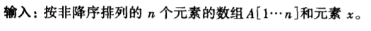
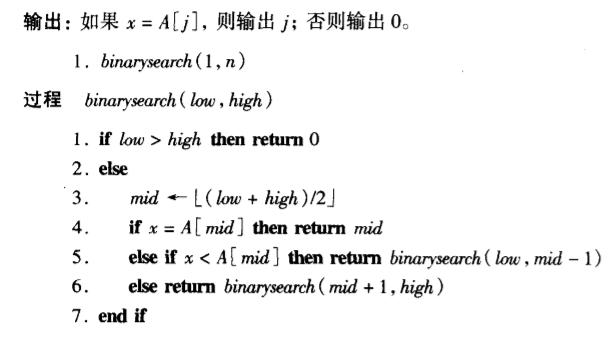
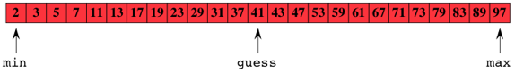
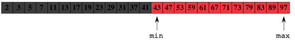
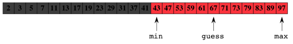
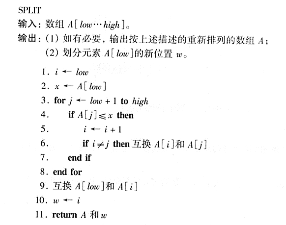
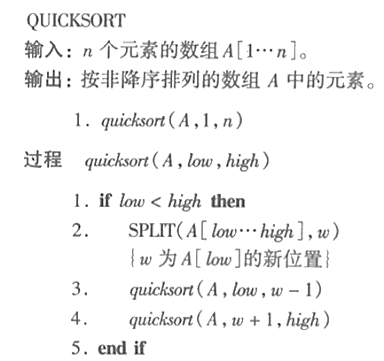

# 4-tutorial

<!-- page: 1 -->

1. 数组A=[2,3,5,7,11,13,17,19,23,29,31,37,41,43,47,
53,59,61,67,71,73,79,83,89,97], 一共有25个素数,按
照二分搜索算法寻找元素67，并分析算法复杂度。

<!-- page: 2 -->

1. 数组A=[2,3,5,7,11,13,17,19,23,29,31,37,41,43,47,
53,59,61,67,71,73,79,83,89,97], 一共有25个素数,按
照二分搜索算法寻找元素67，并分析算法复杂度。

1   2    3    4    5    6    7   8   9   10  11  12  13  14  15 16  17  18  19 20  21  22  23 24 25

1   2    3    4    5    6    7   8   9   10  11  12  13  14  15 16  17  18  19 20  21  22  23  24 25

1   2    3    4    5    6    7   8   9   10  11  12  13  14  15 16  17  18  19 20  21  22  23  24 25

因此元素67所在的数组位置是19, 一共执行3次比较。

<!-- page: 3 -->

1. 数组A=[2,3,5,7,11,13,17,19,23,29,31,37,41,43,47,
53,59,61,67,71,73,79,83,89,97], 一共有25个素数,按
照二分搜索算法寻找元素67，并分析算法时间复杂性。

当𝑛=0时，即数组为空时，不执行任何比较；

当𝑛=1时，需要执行一次比较；

当𝑛>1时，𝐶𝑛表示二分搜索算法在最坏情况下执行的比较次
数，则𝐶𝑛的递推式为：

1,
𝑖𝑓𝑛= 1

1 + 𝐶
𝑛
2
, 𝑖𝑓𝑛≥2

𝐶𝑛≤ቐ

对于整数𝑘，满足2𝑘−1 ≤𝑛≤2𝑘, 展开上述递推式，

𝐶𝑛≤1 + 𝐶
n/2

≤2 + 𝐶
n/4

= 𝑘= 𝑙𝑜𝑔𝑛+ 1

因此，二分搜索算法的时间复杂性是𝑂(𝑙𝑜𝑔𝑛).

<!-- page: 4 -->

2. 设有数组A=[44,75,23,43,55,12]，按照划分算法确定
划分元素A[low]的新位置。

<!-- page: 5 -->

2. 设有数组A=[44,75,23,43,55,12]，按照划分算法确定
划分元素A[low]的新位置。

1        2        3        4      5        6

44
23
43
75
55
12
1        2        3        4      5        6

44
75
23
43
55
12

i
j

i
j

44
23
43
12
55
75
1        2        3        4      5        6

44
75
23
43
55
12
1        2        3        4      5        6

i
j

i
j

12
23
43
44
55
75
1        2        3        4      5        6

44
23
75
43
55
12
1        2        3        4      5        6

i
j

i
j

44
23
75
43
55
12
1        2        3        4      5        6

i
j

44
23
43
75
55
12
1        2        3        4      5        6

i
j

<!-- page: 6 -->

3. 给定数组A=[44,75,23,43,55,12,64,77,33]，按照快
速排序算法进行排序，并分析最坏情况下的时间复杂度。

<!-- page: 7 -->

3. 给定数组A=[44,75,23,43,55,12,64,77,33]，按照快
速排序算法进行排序，并分析最坏情况下的时间复杂度。

44
75
23
43
55
12
64
77
33

33
23
43
12
44
75
64
77
55

55
64
75
77

12
23
33
43

55
64

12
23

<!-- page: 8 -->

3. 给定数组A=[44,75,23,43,55,12,64,77,33]，按照快
速排序算法进行排序，并分析最坏情况下的时间复杂度。

假设数组A[1…n]是升序排列:

①在quicksort(A,1,n)中，A[1]最小，调用quicksort(A,2,n）

②在quicksort(A,2,n)中，A[2]最小，调用quicksort(A,3,n)

③下面过程调用quicksort(A,4,n), …, quicksort(A,n,n)

④quicksort(A,1,n)中，spilt算法的比较次数是n-1;

quicksort(A,2,n)中，spilt算法的比较次数是n-2;

…

quicksort(A,n,n)中，spilt算法的比较次数是0;

因此这种情况下，快速排序算法的复杂度是：

𝑛(𝑛−1)

2
= Θ(𝑛2).

n −1 + n −2 + ⋯+ 1 =
