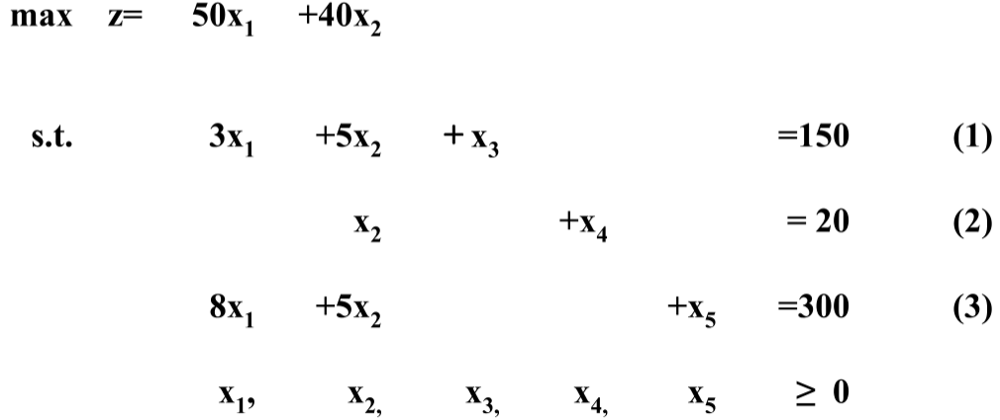
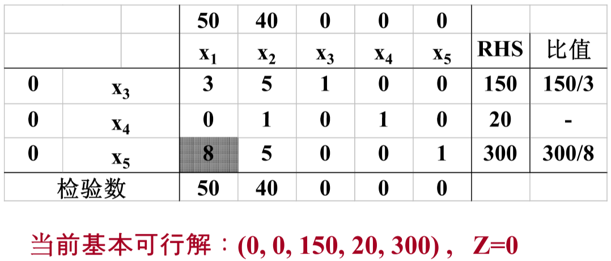
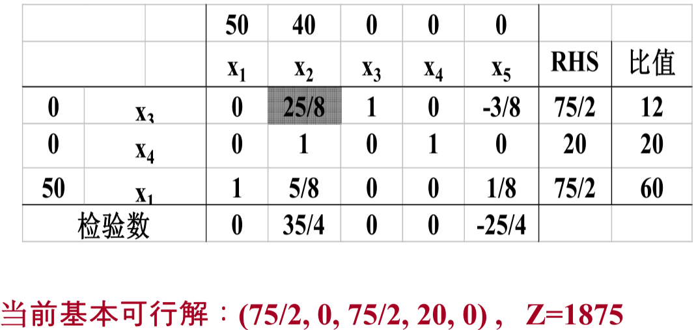
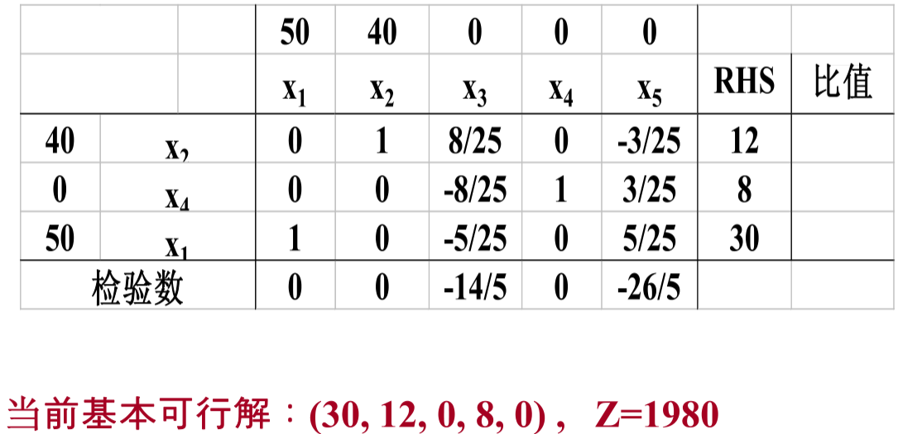

# 6-tutorial

<!-- page: 1 -->

1. 采用图解法求解以下线性规划问题

max 𝑧= 𝑥+ 1.2𝑦
𝑠. 𝑡. 2𝑥+ 𝑦≤180

𝑥+ 3𝑦≤300
𝑥, 𝑦≥0

<!-- page: 2 -->

1. 采用图解法求解以下线性规划问题

max 𝑧= 𝑥+ 1.2𝑦
𝑠. 𝑡. 2𝑥+ 𝑦≤180

𝑥+ 3𝑦≤300
𝑥, 𝑦≥0

y

200

100

S
3
300
x
y
+
=

100
200
300
x

2
180
x
y
+
=

<!-- page: 3 -->

1. 采用图解法求解以下线性规划问题

max 𝑧= 𝑥+ 1.2𝑦
𝑠. 𝑡. 2𝑥+ 𝑦≤180

顶点 A(0,0), B(90,0),
C(48,84), D(0,100)

𝑥+ 3𝑦≤300
𝑥, 𝑦≥0

y

200

D(0, 100)

100

C(48, 84)

3
300
x
y
+
=

S

B(90, 0)
A(0, 0)

100
200
300
x

2
180
x
y
+
=

<!-- page: 4 -->

1.
采用图解法求解以下线性规划问题

顶点
x + 1.2 y

max 𝑧= 𝑥+ 1.2𝑦
𝑠. 𝑡. 2𝑥+ 𝑦≤180

A(0, 0)
0

B(90, 0)
90

𝑥+ 3𝑦≤300

C(48, 84)
148.8

𝑥, 𝑦≥0

D(0, 100)
120

y

200

D(0, 100)

100

C(48, 84)

3
300
x
y
+
=

S

B(90, 0)
A(0, 0)

100
200
300
x

2
180
x
y
+
=

<!-- page: 5 -->

2. 将以下线性规划问题转化为标准型

min 𝑧= −2𝑥1 −3𝑥2
𝑠. 𝑡. 2𝑥1 + 5𝑥2 ≥1

𝑥1≤1
8𝑥1 + 5𝑥2 ≤40
𝑥1≥0

<!-- page: 6 -->

2. 将以下线性规划问题转化为标准型

min 𝑧= −2𝑥1 −3𝑥2
𝑠. 𝑡. 2𝑥1 + 5𝑥2 ≥1

𝑥1≤1
8𝑥1 + 5𝑥2 ≤40
𝑥1≥0

标准型：

max c = 2𝑥1 + 3𝑠1 −3𝑠2
𝑠. 𝑡. −2𝑥1 −5𝑠1 + 5𝑠2 + 𝑆3 = −1

𝑥1 + 𝑠4 = 1
8𝑥1 + 5𝑠1 −5𝑠2 + 𝑠5 = 40
𝑥1, 𝑠1, 𝑠2, 𝑠3, 𝑠4, 𝑠5 ≥0

<!-- page: 7 -->

3. 采用单纯形法求解以下线性规划问题

max 𝑧= 50𝑥1 + 40𝑥2
𝑠. 𝑡. 3𝑥1 + 5𝑥2 ≤150

𝑥2 ≤20
8𝑥1 + 5𝑥2 ≤300
𝑥1, 𝑥2 ≥0

<!-- page: 8 -->

3. 采用单纯形法求解以下线性规划问题

<!-- page: 9 -->

3. 采用单纯形法求解以下线性规划问题

<!-- page: 10 -->

3. 采用单纯形法求解以下线性规划问题

<!-- page: 11 -->

3. 采用单纯形法求解以下线性规划问题

