# 7-dynamic

<!-- page: 1 -->

Design and Analysis of Algorithms

Dynamic Programming

Si  Wu

School of CSE, SCUT

cswusi@scut.edu.cn

TA: 1684350406@qq.com

1

<!-- page: 2 -->

Topics

• Weighted Interval Scheduling
• Segmented Least Squares (Regression)
• Knapsack Problem

2

<!-- page: 3 -->

Algorithmic Paradigms

Greedy. Build up a solution incrementally, myopically optimizing
some local criterion.

Divide-and-conquer. Break up a problem into independent sub-
problems, solve each sub-problem, and combine solutions to
sub-problems to form solution to the original problem.

Dynamic programming. Break up a problem into a series of
overlapping sub-problems, and build up solutions to larger and
larger sub-problems (store intermedia results in a table for later
reuse).

3

<!-- page: 4 -->

Dynamic Programming History

Bellman. Pioneered the systematic study of dynamic
programming in 1950s.

Etymology.
• Dynamic programming = planning over time.
• Secretary of Defense was hostile to mathematical research.
• Bellman sought an impressive name to avoid confrontation.

4

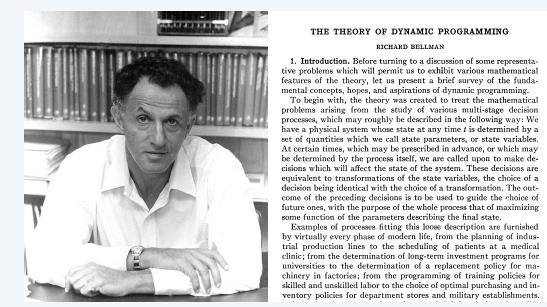

<!-- page: 5 -->

Dynamic Programming Applications

Areas.
• Bioinformatics.
• Control theory.
• Information theory.
• Operations research.
• Computer science: theory, graphics, AI, compilers, systems,…
• …

Some famous dynamic programming algorithms.
• Unix diff for comparing two files.
• Viterbi for hidden Markov models.
• De Boor for evaluating spline curves.
• Smith-Waterman for generic sequence alignment.
• Bellman-Ford for shortest path routing in networks.
• …
5

<!-- page: 6 -->

Weighted Interval Scheduling

Weighted interval scheduling problem.
• Job 𝑗starts at 𝑠𝑗, finishes at 𝑓𝑗, and has weight or value 𝑣𝑗.
• Two jobs compatible if they don’t overlap.
• Goal: find maximum-weight subset of mutually compatible
jobs.

6

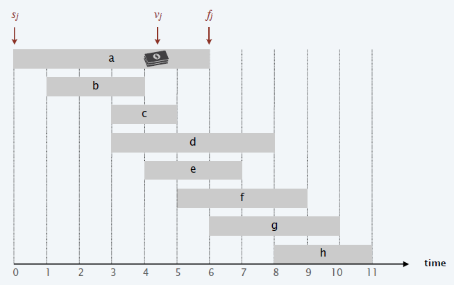

<!-- page: 7 -->

Earliest-Finish-Time First Algorithm

Earliest finish-time first.
•
Consider jobs in ascending order of finish time.
•
Add job to subset if it is compatible with previously chosen jobs.

Recall. Greedy algorithm is correct if all weights are 1.

Observation. Greedy algorithm fails spectacularly for weighted version.

7

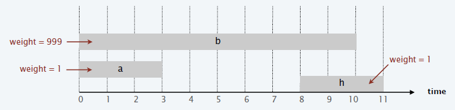

<!-- page: 8 -->

Weighted Interval Scheduling

Notation. Label jobs by finishing time: 𝑓1 ≤𝑓2 ≤⋯≤𝑓𝑛.

Def. 𝑝𝑗= largest index 𝑖< 𝑗 such that job 𝑖 is compatible
with job 𝑗.
Ex. 𝑝1 , 𝑝2 , 𝑝3 , 𝑝4 , 𝑝5 , 𝑝6 , 𝑝7 , 𝑝8 .

8

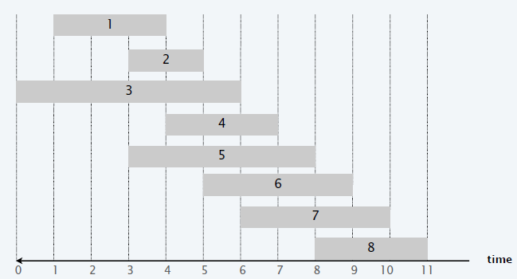

<!-- page: 9 -->

Weighted Interval Scheduling

Notation. Label jobs by finishing time: 𝑓1 ≤𝑓2 ≤⋯≤𝑓𝑛.

Def. 𝑝𝑗= largest index 𝑖< 𝑗 such that job 𝑖 is compatible
with job 𝑗.
Ex.
𝑝1 = 0,
𝑝2 = 0,
𝑝3 = 0,
𝑝4 = 1,
𝑝5 = 0,
𝑝6 = 2,
𝑝7 = 3,
𝑝8 = 5.

9

<!-- page: 10 -->

Dynamic Programming: Binary Choice

Notation. 𝑂𝑃𝑇𝑗= value of optimal solution to the problem
consisting of job requests 1, 2, …, 𝑗.

Goal. 𝑂𝑃𝑇𝑛= value of optimal solution to the original
problem.

Case 1. 𝑂𝑃𝑇𝑗 selects job 𝑗.
• Collect profit 𝑣𝑗.
• Can’t use incompatible jobs {𝑝𝑗+ 1, 𝑝𝑗+ 2, … , 𝑗−1}.
• Must include optimal solution to the problem consisting of
remaining compatible jobs 1, 2, …, 𝑝𝑗.

10

<!-- page: 11 -->

Dynamic Programming: Binary Choice

Notation. 𝑂𝑃𝑇𝑗= value of optimal solution to the problem
consisting of job requests 1, 2, …, 𝑗.

Goal. 𝑂𝑃𝑇𝑛= value of optimal solution to the original problem.

Case 1. 𝑂𝑃𝑇𝑗 selects job 𝑗.
•
Collect profit 𝑣𝑗.
•
Can’t use incompatible jobs {𝑝𝑗+ 1, 𝑝𝑗+ 2, … , 𝑗−1}.
•
Must include optimal solution to the problem consisting of
remaining compatible jobs 1, 2, …, 𝑝𝑗.

Case 2. 𝑂𝑃𝑇𝑗 does not selects job 𝑗.
•
Must include optimal solution to the problem consisting of
remaining jobs 1, 2, …, 𝑗−1.

𝑂𝑃𝑇𝑗=?

11

<!-- page: 12 -->

Dynamic Programming: Binary Choice

Notation. 𝑂𝑃𝑇𝑗= value of optimal solution to the problem
consisting of job requests 1, 2, …, 𝑗.

Goal. 𝑂𝑃𝑇𝑛= value of optimal solution to the original
problem.

Case 2. 𝑂𝑃𝑇𝑗 does not selects job 𝑗.
• Must include optimal solution to the problem consisting of
remaining jobs 1, 2, …, 𝑗−1.

0
𝑖𝑓𝑗= 0
max 𝑣𝑗+ 𝑂𝑃𝑇𝑝𝑗
, 𝑂𝑃𝑇𝑗−1
𝑜𝑡ℎ𝑒𝑟𝑤𝑖𝑠𝑒

𝑂𝑃𝑇𝑗= ൝

12

<!-- page: 13 -->

Weighted Interval Scheduling:
Brute Force

Brute-Force (𝑛, 𝑠1, 𝑠2, … , 𝑠𝑛, 𝑓1, 𝑓2, … , 𝑓𝑛, 𝑣1, 𝑣2, … , 𝑣𝑛)
----------------------------------------------------------------------------
Sort jobs by finish time so that 𝑓1 ≤𝑓2 ≤⋯≤𝑓𝑛
Compute 𝑝1 , 𝑝2 , … , 𝑝[𝑛].
Return Compute-Opt(n).

Compute-Opt(𝑗)
----------------------------------------------------------------------------
If 𝑗= 0

Return 0.
Else

Return max{ 𝑣𝑗+ Compute-Opt(𝑝𝑗), Compute-Opt(𝑗−1)}.

13

<!-- page: 14 -->

Weighted Interval Scheduling:
Brute Force

Observation. Recursive algorithm is spectacularly slow because of
overlapping sub-problems  ->  exponential-time algorithm.

Ex. Number of recursive calls for family of “layered” instances
grows like Fibonacci sequence.

14

<!-- page: 15 -->

Weighted Interval Scheduling:
Memorization

Top-down dynamic programming (memorization). Cache result of
each sub-problem; lookup as needed.

Top-Down (𝑛, 𝑠1, 𝑠2, … , 𝑠𝑛, 𝑓1, 𝑓2, … , 𝑓𝑛, 𝑣1, 𝑣2, … , 𝑣𝑛)
----------------------------------------------------------------------------
Sort jobs by finish time so that 𝑓1 ≤𝑓2 ≤⋯≤𝑓𝑛
Compute 𝑝1 , 𝑝2 , … , 𝑝[𝑛].
𝑀0 ←0.
Return M-Compute-Opt(n).

M-Compute-Opt(𝑗)
----------------------------------------------------------------------------
If 𝑀[𝑗] = 𝑢𝑛𝑖𝑛𝑖𝑡𝑖𝑎𝑙𝑖𝑧𝑒𝑑

𝑀[𝑗] ←max{ 𝑣𝑗+ M-Compute-Opt(𝑝𝑗), M-Compute-Opt(𝑗−1)}.
Return 𝑀[𝑗]

15

<!-- page: 16 -->

Weighted Interval Scheduling:
Finding A Solution

Q. DP algorithm computes optimal value. How to find solution
itself?
A. Make a second pass by calling Find-Solution(𝑛).

Find-Solution (𝑗)
----------------------------------------------------------------------------
If 𝑗= 0

Return ∅
Else If 𝑣𝑗+ 𝑀𝑝𝑗
> 𝑀[𝑗−1]
Return 𝑗∪ Find-Solution (𝑝𝑗).
Else

Return Find-Solution (𝑗−1)

16

<!-- page: 17 -->

Weighted Interval Scheduling:
Bottom-Up Dynamic Programming

Bottom-up dynamic programming.

Bottom-Up (𝑛, 𝑠1, 𝑠2, … , 𝑠𝑛, 𝑓1, 𝑓2, … , 𝑓𝑛, 𝑣1, 𝑣2, … , 𝑣𝑛)
----------------------------------------------------------------------------
Sort jobs by finish time so that 𝑓1 ≤𝑓2 ≤⋯≤𝑓𝑛
Compute 𝑝1 , 𝑝2 , … , 𝑝[𝑛].
𝑀0 ←0.
For 𝑗= 1 To 𝑛

𝑀𝑗←max{ 𝑣𝑗+ 𝑀𝑝𝑗, 𝑀[𝑗−1]}.

17

<!-- page: 18 -->

Weighted Interval Scheduling: Demo

Bottom-Up (𝑛, 𝑠1, 𝑠2, … , 𝑠𝑛, 𝑓1, 𝑓2, … , 𝑓𝑛, 𝑣1, 𝑣2, … , 𝑣𝑛)
----------------------------------------------------------------------------
Sort jobs by finish time so that 𝑓1 ≤𝑓2 ≤⋯≤𝑓𝑛
Compute 𝑝1 , 𝑝2 , … , 𝑝[𝑛].
𝑀0 ←0.
For 𝑗= 1 To 𝑛

𝑀𝑗←max{ 𝑣𝑗+ 𝑀𝑝𝑗, 𝑀[𝑗−1]}.

18

<!-- page: 19 -->

Weighted Interval Scheduling: Demo

19

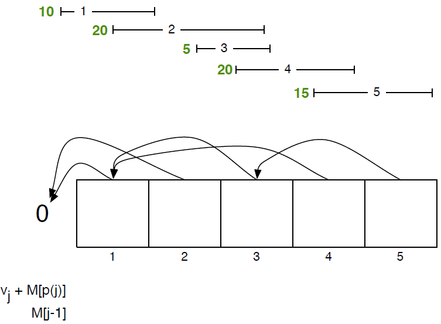

<!-- page: 20 -->

Weighted Interval Scheduling: Demo

20

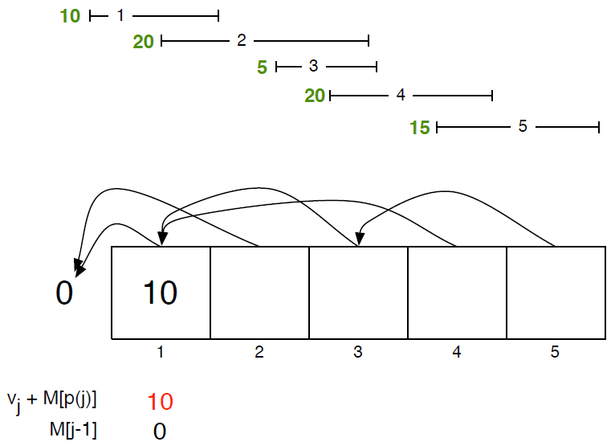

<!-- page: 21 -->

Weighted Interval Scheduling: Demo

21

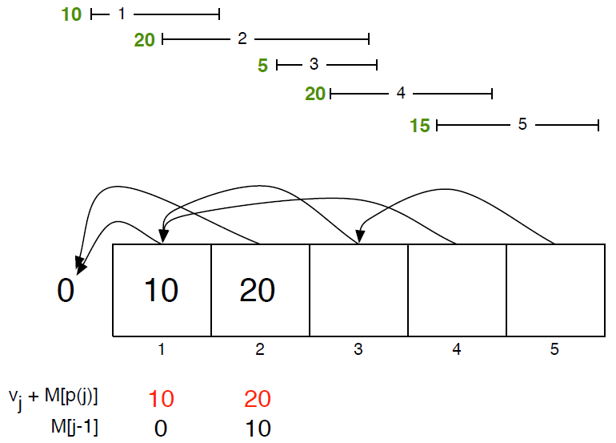

<!-- page: 22 -->

Weighted Interval Scheduling: Demo

22

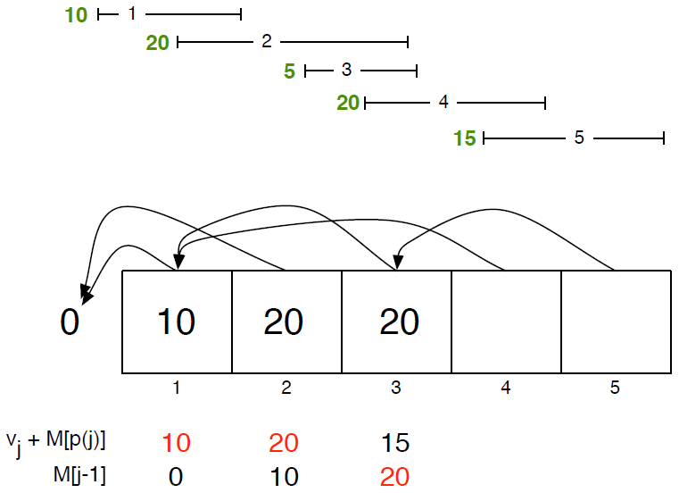

<!-- page: 23 -->

Weighted Interval Scheduling: Demo

23

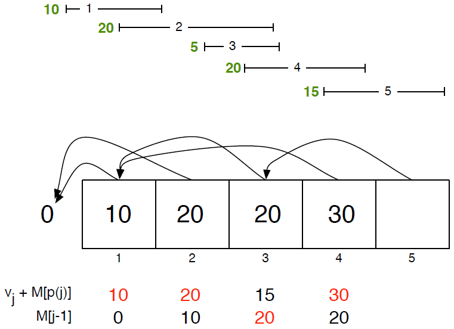

<!-- page: 24 -->

Weighted Interval Scheduling: Demo

24

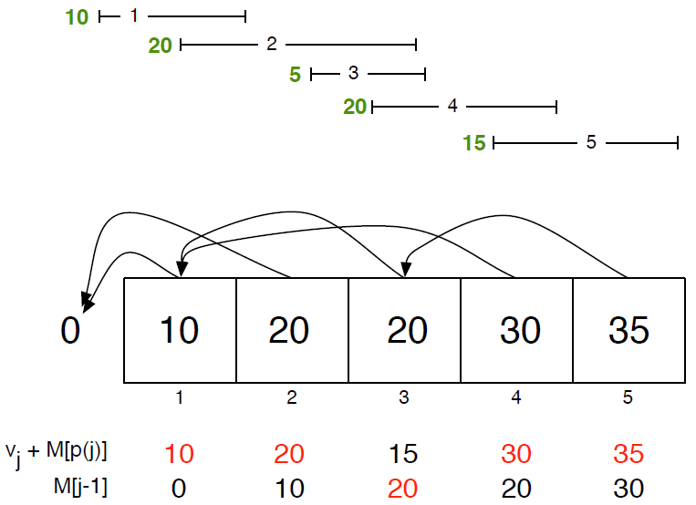

<!-- page: 25 -->

Weighted Interval Scheduling: Demo

25

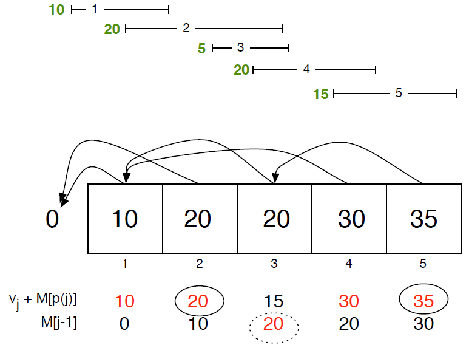

<!-- page: 26 -->

Least Squares

Least squares. Foundational problem in statistics.
• Given 𝑛points in the plane: 𝑥1, 𝑦1 , 𝑥2, 𝑦2 , … , (𝑥𝑛, 𝑦𝑛).
• Find a line 𝑦= 𝑎𝑥+ 𝑏that minimizes the sum of the squared
error:
𝑆𝑆𝐸= σ𝑖=1

𝑛(𝑦𝑖−𝑎𝑥𝑖−𝑏)2

Solution.

26

<!-- page: 27 -->

Least Squares

Least squares. Foundational problem in statistics.
• Given 𝑛points in the plane: 𝑥1, 𝑦1 , 𝑥2, 𝑦2 , … , (𝑥𝑛, 𝑦𝑛).
• Find a line 𝑦= 𝑎𝑥+ 𝑏that minimizes the sum of the squared
error:
𝑆𝑆𝐸= σ𝑖=1

𝑛(𝑦𝑖−𝑎𝑥𝑖−𝑏)2

Solution. Calculus -> min error is achieved when

𝑛σ𝑖𝑥𝑖𝑦𝑖−(σ𝑖𝑥𝑖)(σ𝑖𝑦𝑖)

σ𝑖𝑦𝑖−𝑎σ𝑖𝑥𝑖

𝑎=

2−(σ𝑖𝑥𝑖)2
, 𝑏=

𝑛σ𝑖𝑥𝑖

𝑛

27

<!-- page: 28 -->

Segmented Least Squares

Segmented least squares.
• Points lie roughly on a sequence of several line segments.
• Given 𝑛points in the plane: 𝑥1, 𝑦1 , 𝑥2, 𝑦2 , … , (𝑥𝑛, 𝑦𝑛) with
𝑥1 ≤𝑥2 ≤⋯≤𝑥𝑛, find a sequence of lines that minimizes
𝑓(𝑥).

Q. What is a reasonable choice for 𝑓(𝑥) to balance accuracy and
parsimony?

28

<!-- page: 29 -->

Segmented Least Squares

Given 𝑛points in the plane: 𝑥1, 𝑦1 , 𝑥2, 𝑦2 , … , (𝑥𝑛, 𝑦𝑛) with
𝑥1 ≤𝑥2 ≤⋯≤𝑥𝑛, and a constant 𝑐> 0, find a sequence of
lines that minimizes 𝑓𝑥= ?

29

<!-- page: 30 -->

Segmented Least Squares

Given 𝑛points in the plane: 𝑥1, 𝑦1 , 𝑥2, 𝑦2 , … , (𝑥𝑛, 𝑦𝑛) with
𝑥1 ≤𝑥2 ≤⋯≤𝑥𝑛, and a constant 𝑐> 0, find a sequence of
lines that minimizes 𝑓𝑥= 𝐸+ 𝑐𝐿:
• 𝐸= the sum of the sums of the squared errors in each
segment.
• 𝐿= the number of lines.

30

<!-- page: 31 -->

Dynamic Programming: Multiway Choice

Notation.
• 𝑂𝑃𝑇𝑗= minimum cost for points 𝑝1, 𝑝2, … , 𝑝𝑗.
• 𝑒𝑖, 𝑗= minimum sum of error squares for points
𝑝𝑖, 𝑝𝑖+1, … , 𝑝𝑗.

To compute 𝑂𝑃𝑇(𝑗).
• Last segment uses points 𝑝𝑖, 𝑝𝑖+1, … , 𝑝𝑗for some 𝑖.
• Cost = 𝑒𝑖, 𝑗+ 𝑐+ 𝑂𝑃𝑇𝑖−1 .

𝑂𝑃𝑇𝑗= ?

31

<!-- page: 32 -->

Dynamic Programming: Multiway Choice

Notation.
• 𝑂𝑃𝑇𝑗= minimum cost for points 𝑝1, 𝑝2, … , 𝑝𝑗.
• 𝑒𝑖, 𝑗= minimum sum of error squares for points
𝑝𝑖, 𝑝𝑖+1, … , 𝑝𝑗.

To compute 𝑂𝑃𝑇(𝑗).
• Last segment uses points 𝑝𝑖, 𝑝𝑖+1, … , 𝑝𝑗for some 𝑖.
• Cost = 𝑒𝑖, 𝑗+ 𝑐+ 𝑂𝑃𝑇𝑖−1 .

0
𝑖𝑓𝑗= 0
min
1≤𝑖≤𝑗{𝑒𝑖, 𝑗+ 𝑐+ 𝑂𝑃𝑇𝑖−1 }
𝑜𝑡ℎ𝑒𝑟𝑤𝑖𝑠𝑒

𝑂𝑃𝑇𝑗= ൝

32

<!-- page: 33 -->

Segmented Least Squares Algorithm

Segmented-Least-Squares (𝑛, 𝑝1, 𝑝2, … , 𝑝𝑛, 𝑐)
----------------------------------------------------------------------------
For 𝑗= 1 To 𝑛

For 𝑖= 1 To 𝑗

Compute the least squares 𝑒𝑖, 𝑗for the segment

𝑝𝑖, 𝑝𝑖+1, … , 𝑝𝑗.

𝑀0 ←0.
For 𝑗= 1 To 𝑛

𝑀𝑗←min

1≤𝑖≤𝑗{𝑒𝑖, 𝑗+ 𝑐+ 𝑂𝑃𝑇𝑖−1 }.

Return 𝑀𝑛.

33

<!-- page: 34 -->

Knapsack Problem

• Given 𝑛items and a “Knapsack”.
• Item 𝑖weights 𝑤𝑖> 0 and has value 𝑣𝑖> 0.
• Knapsack has weight capacity of 𝑊.
• Goal: pack knapsack so as to maximize total value.

Ex. {1,2,5} has value 35 and weight 10.
Ex. {3,4} has value 40 and weight 11.
Ex. {3,5} has value 46 but exceeds weight limit.

Greedy by value. Repeatedly add item with maximum 𝑣𝑖.
Greedy by weight. Repeatedly add item with minimum 𝑤𝑖.
Greedy by ratio. Repeatedly add item with maximum ratio 𝑣𝑖/𝑤𝑖.

Observation. None of greedy algorithms is optimal.
34

<!-- page: 35 -->

Dynamic Programming: False Start

Def. 𝑂𝑃𝑇𝑖= max-profit subset of items 1,2, … 𝑖.
Goal. 𝑂𝑃𝑇𝑛.

Case 1. 𝑂𝑃𝑇𝑖does not select item 𝑖.
• 𝑂𝑃𝑇selects best of {1, 2, …, 𝑖−1}.

Case 2. 𝑂𝑃𝑇𝑖selects item 𝑖.
• Selecting item 𝑖does not immediately imply that we will have
to reject other items.
• Without knowing what other items were selected before 𝑖, we
don’t even know if we have enough room for 𝑖.

Conclusion. Need more sub-problems.

35

<!-- page: 36 -->

Dynamic Programming: Adding a New
Variable

Def. 𝑂𝑃𝑇𝑖, 𝑤= max-profit subset of items 1,2, … 𝑖with weight
limit 𝑤.
Goal. 𝑂𝑃𝑇𝑛, 𝑊.

Case 1. 𝑂𝑃𝑇𝑖, 𝑤does not select item 𝑖.
• 𝑂𝑃𝑇𝑖, 𝑤selects best of {1, 2, …, 𝑖−1} using weight limit 𝑤.

Case 2. 𝑂𝑃𝑇𝑖, 𝑤selects item 𝑖.
• Collect value 𝑣𝑖.
• New weight limit = 𝑤−𝑤𝑖.
• 𝑂𝑃𝑇𝑖, 𝑤selects best of {1, 2, …, 𝑖−1} using this new weight
limit.

𝑂𝑃𝑇𝑖, 𝑤= ?

36

<!-- page: 37 -->

Dynamic Programming: Adding a New
Variable

Def. 𝑂𝑃𝑇𝑖, 𝑤= max-profit subset of items 1,2, … 𝑖with weight
limit 𝑤.
Goal. 𝑂𝑃𝑇𝑛, 𝑊.

Case 1. 𝑂𝑃𝑇𝑖, 𝑤does not select item 𝑖.
• 𝑂𝑃𝑇𝑖, 𝑤selects best of {1, 2, …, 𝑖−1} using weight limit 𝑤.

Case 2. 𝑂𝑃𝑇𝑖, 𝑤selects item 𝑖.
• Collect value 𝑣𝑖.
• New weight limit = 𝑤−𝑤𝑖.
• 𝑂𝑃𝑇𝑖, 𝑤selects best of {1, 2, …, 𝑖−1} using this new weight
limit.

0
𝑖𝑓𝑖= 0
𝑂𝑃𝑇𝑖−1, 𝑤
𝑖𝑓𝑤𝑖> 𝑤
max 𝑂𝑃𝑇𝑖−1, 𝑤, 𝑣𝑖+ 𝑂𝑃𝑇𝑖−1, 𝑤−𝑤𝑖
𝑜𝑡ℎ𝑒𝑟𝑤𝑖𝑠𝑒37

𝑂𝑃𝑇𝑖, 𝑤= ൞

<!-- page: 38 -->

Knapsack Problem: Bottom-Up Dynamic
Programming

Knapsack (𝑛, 𝑊, 𝑤1, 𝑤2, … , 𝑤𝑛, 𝑣1, 𝑣2, … , 𝑣𝑛)
----------------------------------------------------------------------------
For 𝑤= 0 To 𝑊

𝑀[0, 𝑤] ←0.

For 𝑖= 1 To 𝑛

For 𝑤= 0 To 𝑊

If 𝑤𝑖> 𝑤

𝑀𝑖, 𝑤←𝑀𝑖−1, 𝑤.
Else

𝑀[𝑖, 𝑤] ←max{𝑀𝑖−1, 𝑤, 𝑣𝑖+ 𝑀[𝑖−1, 𝑤−𝑤𝑖]}.

Return 𝑀[𝑛, 𝑊].

38

<!-- page: 39 -->

Knapsack Problem: Bottom-Up Dynamic
Programming Demo

0
𝑖𝑓𝑖= 0
𝑂𝑃𝑇𝑖−1, 𝑤
𝑖𝑓𝑤𝑖> 𝑤
max 𝑂𝑃𝑇𝑖−1, 𝑤, 𝑣𝑖+ 𝑂𝑃𝑇𝑖−1, 𝑤−𝑤𝑖
𝑜𝑡ℎ𝑒𝑟𝑤𝑖𝑠𝑒

𝑂𝑃𝑇𝑖, 𝑤= ൞

39

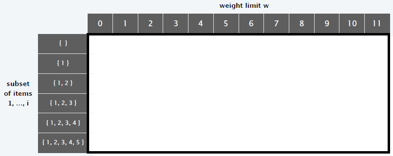

<!-- page: 40 -->

Knapsack Problem: Bottom-Up Dynamic
Programming Demo

0
𝑖𝑓𝑖= 0
𝑂𝑃𝑇𝑖−1, 𝑤
𝑖𝑓𝑤𝑖> 𝑤
max 𝑂𝑃𝑇𝑖−1, 𝑤, 𝑣𝑖+ 𝑂𝑃𝑇𝑖−1, 𝑤−𝑤𝑖
𝑜𝑡ℎ𝑒𝑟𝑤𝑖𝑠𝑒

𝑂𝑃𝑇𝑖, 𝑤= ൞

40

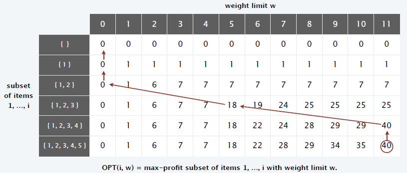
