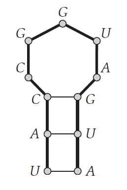

# 7-tutorial

<!-- page: 1 -->

1. 采用动态规划技术求解RNA序列：AUGAUGGCCAU
的最大碱基对数目。

A  U  G  A  U  G  G  C  C  A   U
1   2  3   4  5   6  7   8  9 10 11
5

4

RNA-Secondary-Structure (𝑛, 𝑏1, 𝑏2, … , 𝑏𝑛)
--------------------------------------------------------
For 𝑘= 5 To 𝑛−1
    For 𝑖= 1 To 𝑛−𝑘
         𝑗←𝑖+ 𝑘.
        For each 𝑏𝑡 (𝑖≤𝑡< 𝑗−4) paired with 𝑏𝑗
            𝑇= 1 + 𝑀𝑖, 𝑡−1 + 𝑀𝑡+ 1, 𝑗−1 .
            𝑀[𝑖, 𝑗] ←max{𝑀𝑖, 𝑗−1 , 𝑇}.
Return 𝑀[1, 𝑛].

3

2

1

6
7
8
9
10
11

<!-- page: 2 -->

RNA-Secondary-Structure (𝑛, 𝑏1, 𝑏2, … , 𝑏𝑛)
--------------------------------------------------------
For 𝑘= 5 To 𝑛−1
    For 𝑖= 1 To 𝑛−𝑘
         𝑗←𝑖+ 𝑘.
        For each 𝑏𝑡 (𝑖≤𝑡< 𝑗−4) paired with 𝑏𝑗
            𝑇= 1 + 𝑀𝑖, 𝑡−1 + 𝑀𝑡+ 1, 𝑗−1 .
            𝑀[𝑖, 𝑗] ←max{𝑀𝑖, 𝑗−1 , 𝑇}.
Return 𝑀[1, 𝑛].

A  U  G  A  U  G  G  C  C  A   U
1   2  3   4  5   6  7   8  9 10 11

𝑖≤𝑡< 𝑗−4

5
0
0
0
0
1

5
0
0
0
0

4
0
0
0
0

4
0
0
0

3
0
0
1

3
0
0

2
0
0

2
0

1
0

1

6
7
8
9
10
11

6
7
8
9
10
11

<!-- page: 3 -->

RNA-Secondary-Structure (𝑛, 𝑏1, 𝑏2, … , 𝑏𝑛)
--------------------------------------------------------
For 𝑘= 5 To 𝑛−1
    For 𝑖= 1 To 𝑛−𝑘
         𝑗←𝑖+ 𝑘.
        For each 𝑏𝑡 (𝑖≤𝑡< 𝑗−4) paired with 𝑏𝑗
            𝑇= 1 + 𝑀𝑖, 𝑡−1 + 𝑀𝑡+ 1, 𝑗−1 .
            𝑀[𝑖, 𝑗] ←max{𝑀𝑖, 𝑗−1 , 𝑇}.
Return 𝑀[1, 𝑛].

A  U  G  A  U  G  G  C  C  A   U
1   2  3   4  5   6  7   8  9 10 11

𝑖≤𝑡< 𝑗−4

5
0
0
0
0
1
1

5
0
0
0
0
1
1

4
0
0
0
0
1
2

4
0
0
0
0
1

3
0
0
1
1
1

3
0
0
1
1

2
0
0
1
1

2
0
0
1

1
0
0
1

1
0
0

6
7
8
9
10
11

6
7
8
9
10
11

<!-- page: 4 -->

RNA-Secondary-Structure (𝑛, 𝑏1, 𝑏2, … , 𝑏𝑛)
--------------------------------------------------------
For 𝑘= 5 To 𝑛−1
    For 𝑖= 1 To 𝑛−𝑘
         𝑗←𝑖+ 𝑘.
        For each 𝑏𝑡 (𝑖≤𝑡< 𝑗−4) paired with 𝑏𝑗
            𝑇= 1 + 𝑀𝑖, 𝑡−1 + 𝑀𝑡+ 1, 𝑗−1 .
            𝑀[𝑖, 𝑗] ←max{𝑀𝑖, 𝑗−1 , 𝑇}.
Return 𝑀[1, 𝑛].

A  U  G  A  U  G  G  C  C  A   U
1   2  3   4  5   6  7   8  9 10 11

𝑖≤𝑡< 𝑗−4

5
0
0
0
0
1
1

5
0
0
0
0
1
1

4
0
0
0
0
1
2

4
0
0
0
0
1
2

3
0
0
1
1
1
2

3
0
0
1
1
1
2

2
0
0
1
1
2
2

2
0
0
1
1
2

1
0
0
1
1
2

1
0
0
1
1

6
7
8
9
10
11

6
7
8
9
10
11

<!-- page: 5 -->

RNA-Secondary-Structure (𝑛, 𝑏1, 𝑏2, … , 𝑏𝑛)
--------------------------------------------------------
For 𝑘= 5 To 𝑛−1
    For 𝑖= 1 To 𝑛−𝑘
         𝑗←𝑖+ 𝑘.
        For each 𝑏𝑡 (𝑖≤𝑡< 𝑗−4) paired with 𝑏𝑗
            𝑇= 1 + 𝑀𝑖, 𝑡−1 + 𝑀𝑡+ 1, 𝑗−1 .
            𝑀[𝑖, 𝑗] ←max{𝑀𝑖, 𝑗−1 , 𝑇}.
Return 𝑀[1, 𝑛].

A  U  G  A  U  G  G  C  C  A   U
1   2  3   4  5   6  7   8  9 10 11

𝑖≤𝑡< 𝑗−4

5
0
0
0
0
1
1

4
0
0
0
0
1
2

3
0
0
1
1
1
2

2
0
0
1
1
2
2

1
0
0
1
1
2
3

6
7
8
9
10
11

