# AI-第1章 绪论

<!-- slide: 1 -->

- 韦佳
- 华南理工大学 计算机科学与工程学院 B3-301
- Email：csjwei@scut.edu.cn
- Webpage: http://www.scholat.com/weijia
- 人工智能导论
- A Guide to Artificial Intelligence
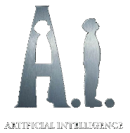
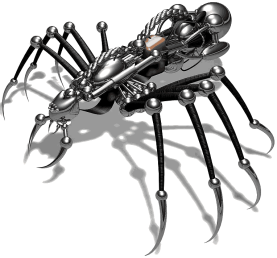
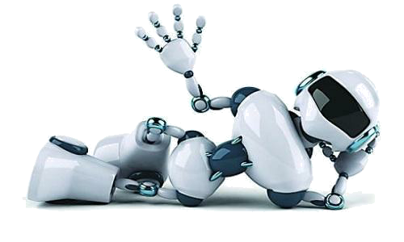
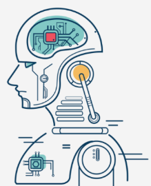

<!-- slide: 2 -->

- 作者：鲍军鹏，张选平
- 书名：人工智能导论（第2版）
- 出版社：机械工业出版社
- 出版年：2020
- 书号：ISBN978-7-111-66052-1
- 教材
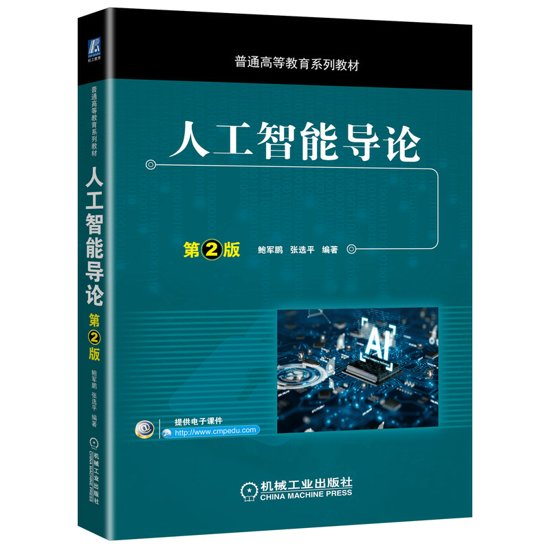

<!-- slide: 3 -->

- 参考书
- 马少平，人工智能，清华大学出版社，2004
- 周志华，机器学习，清华大学出版社，2016
- 邱锡鹏，神经网络与深度学习，机械工业出版社，2020
- Hung-yi Lee, Machine Learning, National Taiwan University
- Fei-Fei Li, CS231n: Convolutional Neural Networks for Visual Recognition, Stanford University

<!-- slide: 4 -->

## 成绩组成

- 课程作业（30%）
  - 搜索算法：A*算法实践
  - 机器学习：决策树算法实践
  - 深度学习：深度神经网络实践（百度飞桨创新实践基地）（最后一次课安排小组展示）
- 期末考试（70%）
  - 闭卷

<!-- slide: 5 -->

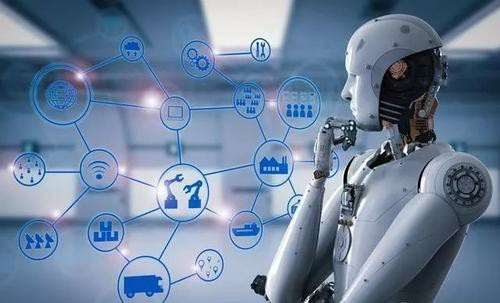
- 1.1 什么是人工智能
- 1.2 人工智能发展简史
- 1.3 人工智能研究方法
- 1.4 人工智能研究及应用领域
- 第一章 绪论
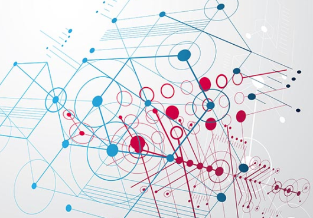
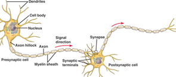
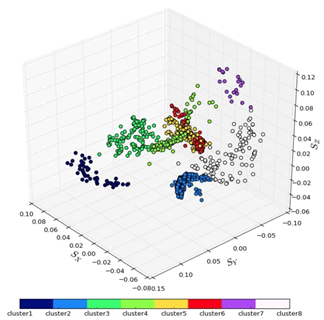
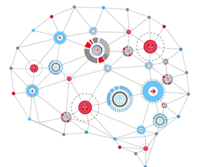

<!-- slide: 6 -->

- 什么是智能？
  - 现代汉语词典：
    - 智慧和才能；
    - 经高科技处理，具有人的某些智慧和能力。
  - 牛津高阶英语词典（OXFORD ADVANCED LEARNER‘S DICTIONARY）：
    - 以逻辑的方式学习、理解、思考事物的能力
    - The ability to learn understand and think in a logical way about things.
- 1.1.1 关于智能
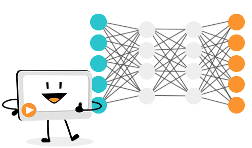

<!-- slide: 7 -->

- 知识理论
- 强调知识对于智能的重要意义和作用，认为智能行为取决于知识的数量及其一般化的程度。
- 智能就是在巨大搜索空间中迅速找到一个满意解的能力。
- 例如下棋。在人工智能的发展史中有重要影响。发展出了知识工程、专家系统等等。
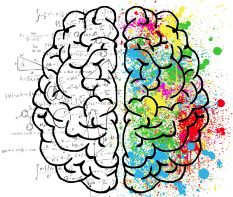
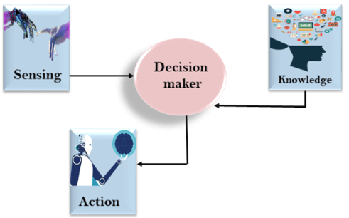

<!-- slide: 8 -->

- 思维理论
- 来自认知科学（Cognitive Science）。
- 认为智能的核心是思维。
- 人的一切智慧或者智能都来自于大脑的思维活动，人类的一切知识都是人们思维的产物。因而通过对思维规律与方法的研究有望揭示智能的本质。
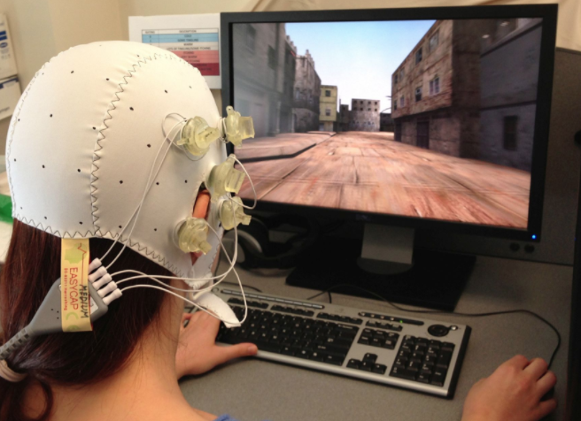
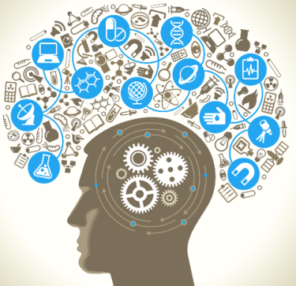
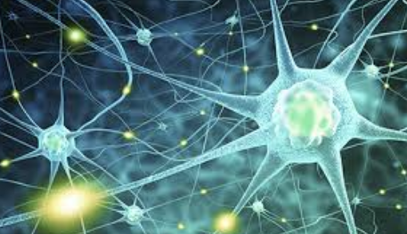

<!-- slide: 9 -->

- 进化理论
- MIT的Brooks教授提出。
- 人的本质能力是在动态环境中的行走能力，对外界事务的感知能力，维持生命和繁衍生息的能力。因此智能是某种复杂系统所浮现的性质。
- 该理论的核心是用控制取代表示，从而取消概念、模型及显式表示的知识。否定抽象对于智能及智能模拟的必要性，强调分层结构对于智能进化的可能性与必要性。
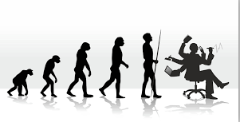
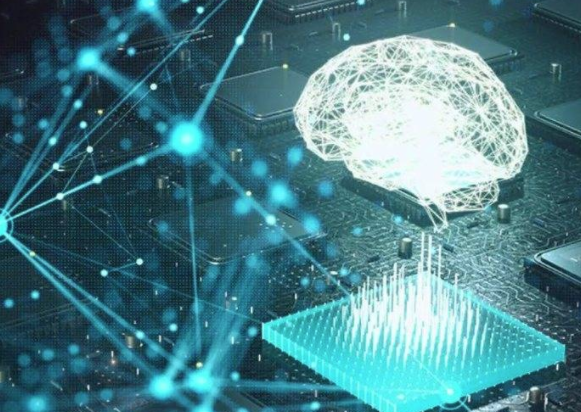

<!-- slide: 10 -->

- 对人工智能的定义
- 麦卡锡（John McCarthy）：
  - 人工智能就是要让机器的行为看起来像是人所表现出的智能行为一样。
- 尼尔逊（Nilsson）：
  - 人工智能是关于人造物的智能行为，包括知觉、推理、学习、交流和在复杂环境中的行为。
- 巴尔（Barr）和费根鲍姆（Feigenbaum）：
  - 人工智能属于计算机科学的一个分支，旨在设计智能的计算机系统，也就是说，对照人类在自然语言理解、学习、推理问题求解等方面的智能行为，设计的系统应呈现出与之类似的特征。

<!-- slide: 11 -->

- 本书认为
- 人工智能就是研究如何使一个计算机系统具有像人一样的智能特征，使其能模拟、延伸、扩展人类智能。
- 通俗地讲，人工智能就是研究如何使得计算机会听、说、读、写、学习、推理，能够适应环境变化，能够模拟出人脑思维活动。
- 人工智能就是要使计算机能够像人一样去思考和行动，完成人类能够完成的工作，甚至在某些方面比人更强。

<!-- slide: 12 -->

- 最终目标
  - 造出一个像人一样具有智能，会思维和行动的计算机系统。
- 强人工智能
  - 机器可以有知觉，有自我意识。
- 弱人工智能
  - 机器只不过看起来像是智能的，不会有自主意识。
- 1.1.2 人工智能的研究目标
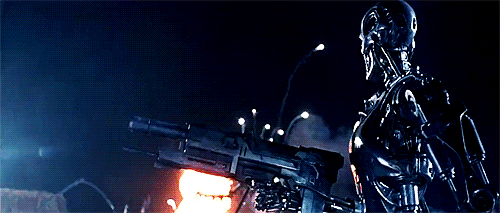
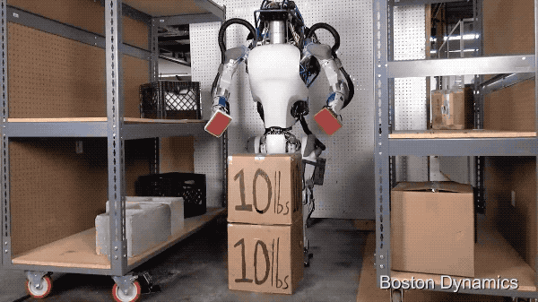

<!-- slide: 13 -->

- 图灵测试（1）
- 英国数学家Alan M.Turing在1950年发表的“计算机与智能(Computing Machinery and Intelligence)”论文中提出了“图灵测试”。
- 他被誉为“人工智能之父”。
- Turing测试第一次给出了检验计算机是否具有智能的哲学说法。

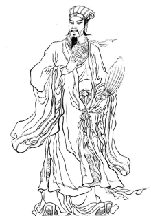
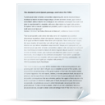

- 哪一个是人，哪一个是机器？

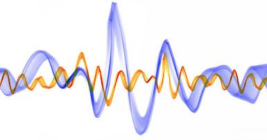
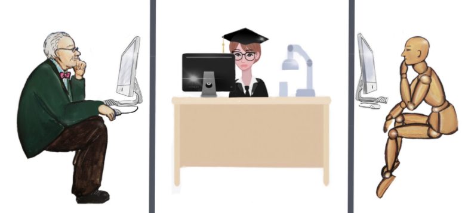
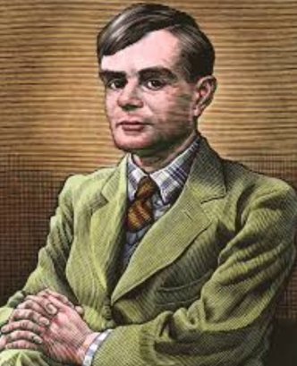

<!-- slide: 14 -->

- 图灵测试（2）
- Q:你的14行诗的首行为“你如同夏日”，你不觉得“春日”更好吗?
- A:它不合韵。
- Q: “冬日”如何？它可是完全合韵的。
- A:它确是合韵，但没有人愿被比为“冬日”。
- Q:你不是说过匹克威克先生让你能想起圣诞节吗？
- A:是的。
- Q:圣诞节是冬天的一个日子，我想匹克威克先生对这个比喻不会介意吧。
- A:我认为你不够严谨，“冬日”指的是一般的冬天的日子，而不是某个特别的日子，如圣诞节。

<!-- slide: 15 -->

- 对图灵测试的质疑
- ——JOHN R. SEARLE
- Mills Prof. Of the Philosophy of Mind and Language at University of California，Berkeley
- 一个不懂汉语的人A，一个充分详细的汉语问答手册。
- 不计查手册的时间代价。
- 给A一个使用汉语提出的问题，A通过汉语符号的比对使用手册，给出回答。
- Searle问，如果A通过查手册做出的回答与懂汉语的人一样，A懂汉语吗？

<!-- slide: 16 -->

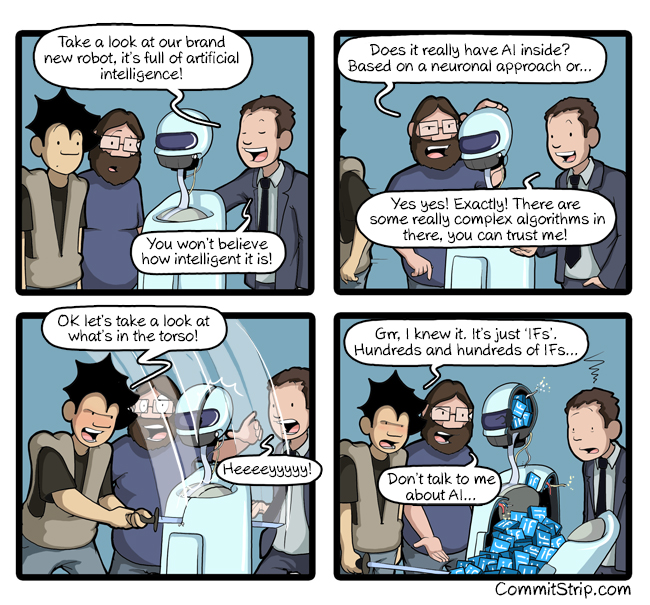

<!-- slide: 17 -->

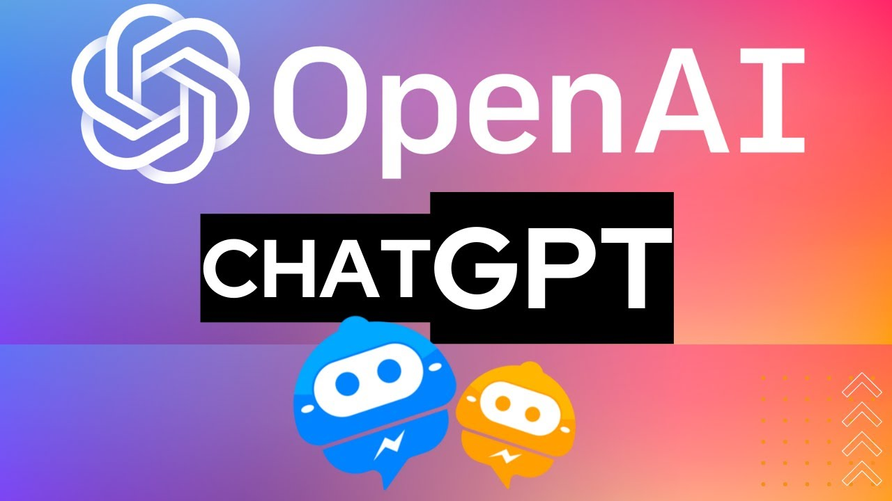

<!-- slide: 18 -->

- 深蓝(Deep Blue)——IBM公司的RS/6000SP
- 北京时间1997年5月12日凌晨4点50分，美国纽约公平大厦，当IBM公司的“深蓝”超级电脑将棋盘上的一个兵走到C4的位置上时，国际象棋世界冠军卡斯帕罗夫(Kasparov)对“深蓝”的人机大战落下帷幕，“深蓝”以3.5：2.5的总比分战胜卡斯帕罗夫。
- 96年2月第一次比赛结果：
- “深蓝”：胜、负、平、平、负、负
- 2：4（负）
- 97年5月第二次比赛结果：
- “深蓝”：负、胜、平、平、平、胜
- 3.5:2.5（胜）
- “深蓝”的技术指标：
  - 32个CPU
  - 每个CPU有16个协处理器
  - 每个CPU有256M内存
  - 每个CPU的处理速度为200万步/秒

<!-- slide: 19 -->

- DeepMind（谷歌）公司的AlphaGo
- 2016年3月人工智能系统AlphaGo以4比1的总比分战胜人类围棋世界冠军李世石九段。
- 2017年5月在中国乌镇围棋峰会上， AlphaGo以3比0的总比分战胜世界排名第一围棋世界冠军柯洁九段。
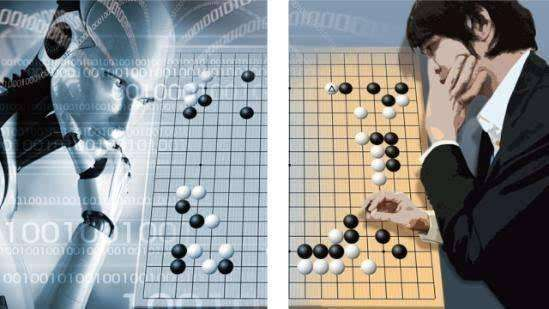
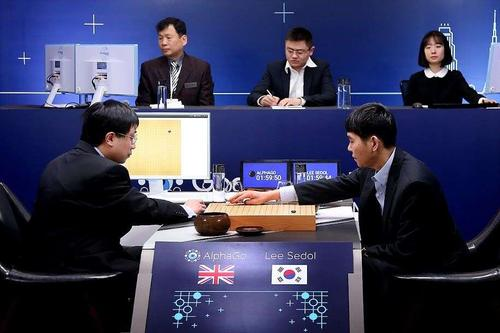

<!-- slide: 20 -->

- “深蓝”和“AlphaGo”有智能吗？
- 媒体与大众
  - “可以有”
- 科学家
  - “部分具有”
  - 与人的全面智能相比还有较大差距
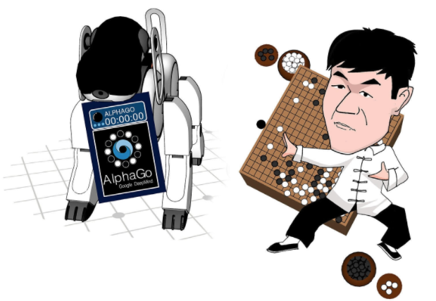
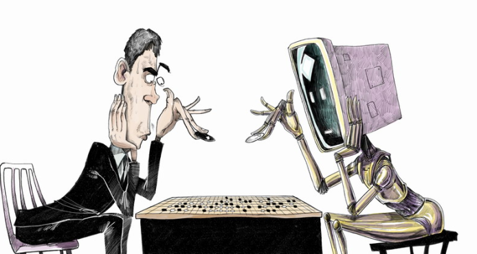
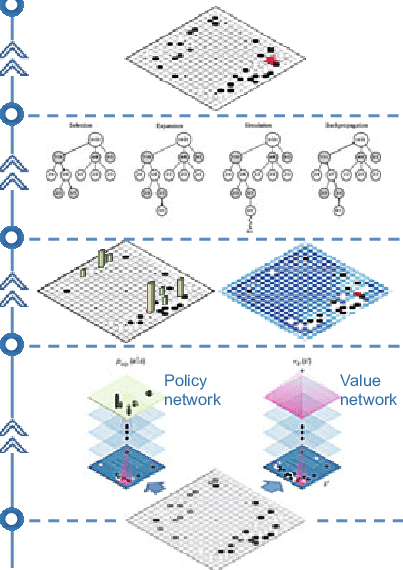

<!-- slide: 21 -->

- 人工智能的近期目标
- 使现有的计算机系统更聪明、更有用，使它不仅能做一般的数值计算及非数值信息处理，而且能运用知识处理问题，能模拟人类的部分智能行为，成为人类的智能化辅助工具。
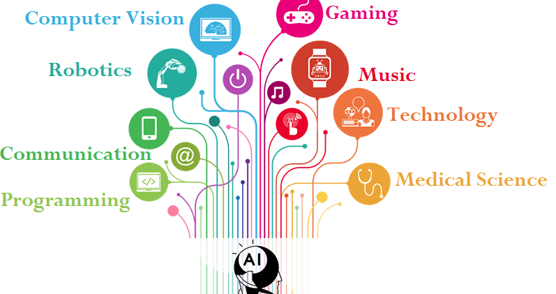

<!-- slide: 22 -->

- 人工智能的发展到目前为止经历的四个阶段
- 第一阶段：孕育（1956年之前）
- 第二阶段：形成（1956～1969）
- 第三阶段：发展（1970～2005）
- 第四阶段：深化（2006年至今）
- 1.2 人工智能发展简史
- 公元前384—322
- 1956
- 1561—1626
- Aristotle，
- 三段论
- F. Bacon，
- 归纳法
- 1950
- A. Turing ，
- 图灵测试
- Dartmouth大学 ，
- AI学科成立
- 1969
- Minsky，
- Perceptron
- 1977
- Feigenbaum，
- 知识工程
- 1986
- Rumelhart，
- BP算法
- 2006
- G. E. Hinton，
- 深度学习
- 1995
- Vapnik，
- SVM
- 2016
- DeepMind，
- AlphaGo
- IBM，
- 深蓝
- 1997
- 2012
- Alex Krizhevsky，AlexNet

<!-- slide: 23 -->

- 孕育（1956年之前）
- Aristotle (公元前384—322) 在《工具论》中提出形式逻辑。
- Bacon (1561—1626)在《新工具》中提出归纳法。
- 1642：法国数学家帕斯卡发明了第一台机械计算器—帕斯卡加法器，开创了计算机械的时代。
- Leibnitz (1646—1716) 研制了四则计算器，提出了“通用符号”和“推理计算”的概念，使形式逻辑符号化，可以说是“机器思维”研究的萌芽。
- Boole (1815—1864)创立了布尔代数，他在《思维法则》一书中，首次用符号语言描述了思维活动的基本推理法则。

<!-- slide: 24 -->

- 孕育（1956年之前）
- 1936: 图灵提出了“图灵机”概念——一种理想计算机的数学模型。
- 1943：美国神经生理学家W.McCulloch and W.Pitts提出了M-P模型，奠定了人工神经网络发展的基础。
- 1946: ENIAC （Electronic Numerical Integrator and Calculator）
- 1950: Alan Turing的文章“Computing Machinery and Intelligence”提出图灵测试。
- 19世纪以来，数理逻辑、自动机理论、控制论、信息论、仿生学、计算机、心理学等科学技术的进展，为人工智能的诞生，准备了思想、理论和物质基础。

<!-- slide: 25 -->

- 孕育（1956年之前）
- 在50年代，计算局限在数值处理，例如，计算弹道等。
- 1950年，Shannon完成了第一个下棋程序，开创了非数值计算的先河。
- Newell, Simon, MaCarthy and Minsky等均提出以符号为基础的计算。
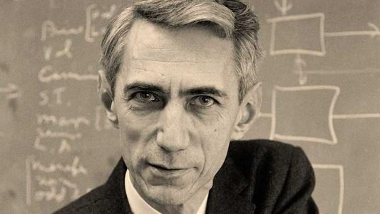
- Shannon

<!-- slide: 26 -->

- 形成（1956—1969）
- 1956夏: 麦卡锡(McCarthy)等10人正式提出了“人工智能” 这一术语。
- 1956：赛缪尔(Samuel)研制出了具有自学习能力的跳棋程序。1959年，Samuel的跳棋程序打败他本人。1962年，打败Connecticut洲的跳棋冠军。
- 1958：美籍华人王浩在IBM－740机器上用3～5分钟证明了《数学原理》中有关命题演算的全部定理(220条)。1965年，鲁宾逊(Robinson)提出了归结原理，为定理的机器证明作出了突破性贡献。
- 1960: Newell, Shaw和Simon研制出了通用问题求解器GPS。
- 1960: McCarthy在MIT研制出了人工智能语言 LISP。
- 1965：Stanford的费根鲍姆开展了专家系统DENDRAL的研究，并于1968年投入使用。这是一个分析化合物分子结构的专家系统。

<!-- slide: 27 -->

- 形成（1956—1969）——盲目乐观
- 1958: Newell和Simon的四个预测
  - 十年内，计算机将成为世界象棋冠军
  - 1997年“深蓝”才第一次击败国际象棋世界冠军
  - 十年内，计算机将发现或证明有意义的数学定理
  - 1976年美国数学家Kenneth Appel等人在三台大型机上完成了四色定理证明。1977年我国数学家吴文俊提出了一种几何定理机械化证明方法
  - 十年内，计算机将能谱写优美的乐曲
  - 十年内，计算机将能实现大多数的心理学理论

<!-- slide: 28 -->

- 发展（1970—2005）——打击
- 一个笑话（英俄翻译）：
- The spirit is willing but the flesh is week.
- （心有余而力不足）
- The vodka is strong but meat is rotten.
- （伏特加酒虽然很浓，但肉是腐烂的）
- 出现错误的原因：
- Spirit：
  - 1）精神
  - 2）烈性酒、酒精
- 结论：
- 必须理解才能翻译，而理解需要知识
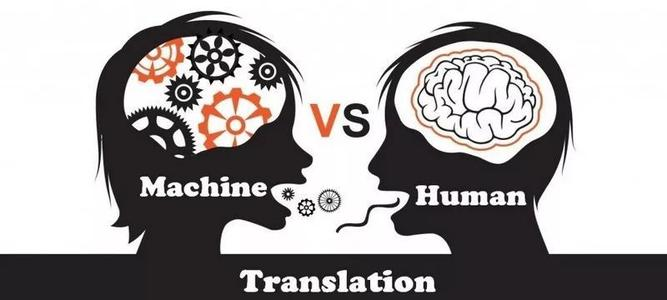

<!-- slide: 29 -->

- 发展（1970—2005）——打击
- 1966: ALPAC的负面报告造成美国政府取消对机器翻译的资助。
- 1969: Minsky 和 Papert的感知机报告造成美国政府取消对神经网络研究的资助。
- 1973: James Lighthill爵士的负面报告使得英国政府取消对AI研究的资助。
  - “人工智能研究是不成功的，不值得政府资助。”

<!-- slide: 30 -->

- Minsky的批评
- 1969年，Minsky出版Perceptron一书。
- 一方面，他批评感知机无法解决非线性问题，例如， XOR问题。而复杂性信息处理应该以解决非线性问题为主。
- 另一方面，几何方法应该代替分析方法作为主要数学手段。
- 在以后的二十年，感知机的研究方向被忽视。
- 基于符号的知识表示成为主流。
- 基于逻辑的推理成为主要研究方向。
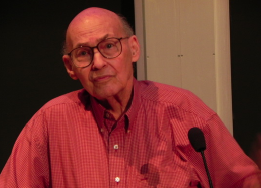
- Minsky

<!-- slide: 31 -->

- 发展（1970—2005）——锲而不舍
- 1977: SRI启动 PROSPECTOR 工程
  - 帮助地质专家探测和解释矿物
  - 1978年发现钼矿脉(molybdenum vein)
- 1977: Edward Feigenbaum正式提出知识工程作为一门学科
  - 在1977年IJCAI会议上
- 1980: John McDermott的XCON专家系统
  - 用于配置 VAX 机器系统
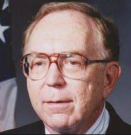
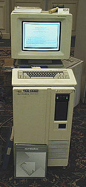

<!-- slide: 32 -->

- 发展（1970—2005）——重大突破
  - 1982年，J．Hopfield提出了可用作联想存储器的互连网络，这个网络称为Hopfield网络模型。Hopfield网络比较成功地求解了货郎担问题。
  - 1986年，Rumelhart发现了BP算法，导致感知机之类的研究重新兴起。 BP算法解决了多层前馈网络的学习问题。
  - 存在问题：
    - 理论依据
    - 解决大规模问题的能力
  - 1995: Vapnik提出SVM
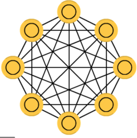
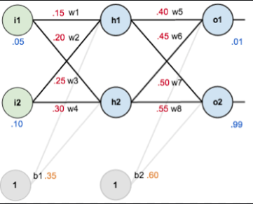
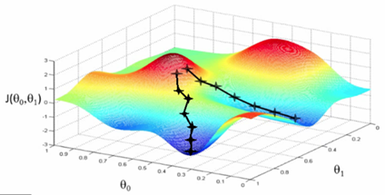
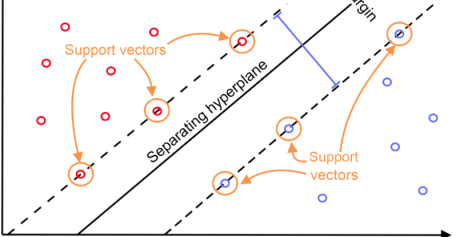

<!-- slide: 33 -->

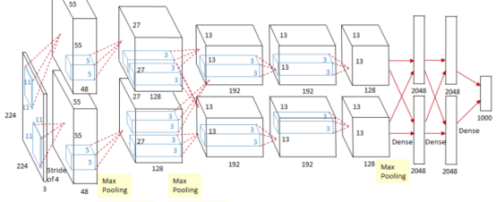
- 深化（2006年至今）——广泛深入
- 2006:辛顿（Geoffrey E. Hinton）提出了深度学习（Deep Learning）概念，突破了人工神经网络解决模式识别问题的瓶颈。
- 2012:Alex Krizhevsky提出AlexNet网络。
- 2016:AlphaGo战胜人类围棋世界冠军李世石九段。
- 2022：ChatGPT
- 。。。

<!-- slide: 34 -->

- 人工智能的未来
  - 网络技术的发展给AI带来无限机会
    - 5G，物联网，云计算，边缘计算，元宇宙
  - 大数据中的数据挖掘与知识发现
    - 大模型，多模态，联邦学习
  - AI的可解释性与实用化
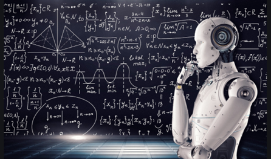
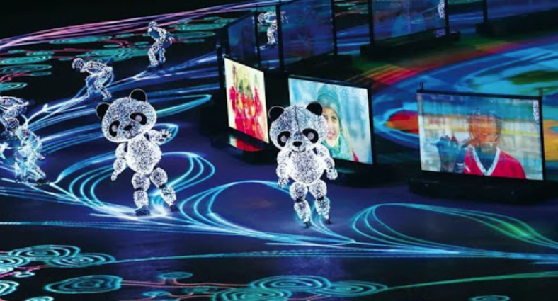
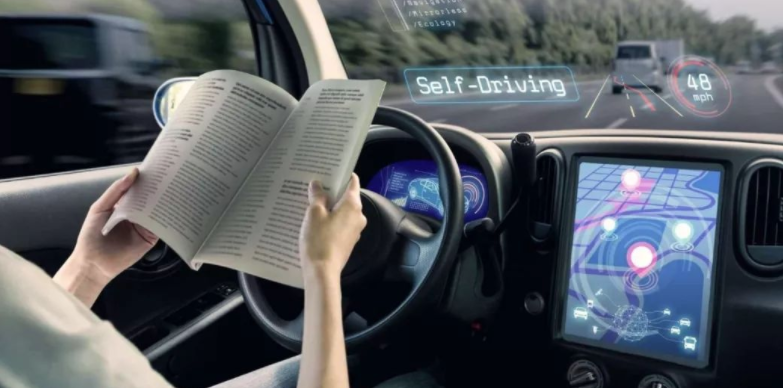

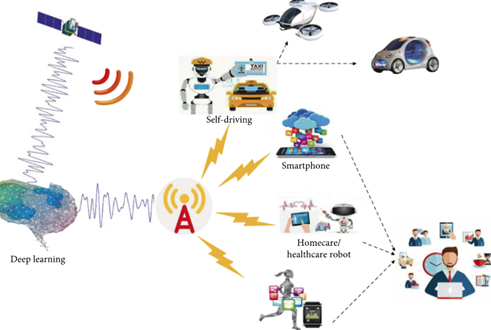

<!-- slide: 35 -->

- 1.3.1 人工智能研究的特点
- 交叉学科
  - 综合性、理论性、实践性、应用性都很强
- 与传统的计算机软件系统相比
  - 以知识为主要研究对象；
  - 大多采用启发式（Heuristics）方法而不用穷举的方法来解决问题；
  - 一般都允许出现不正确结果。
- 1.3 人工智能研究方法

<!-- slide: 36 -->

- 符号主义（Symbolicism）
  - 基于物理符号系统假设和有限合理性原理的人工智能学派。
- 联结主义（Connectionism）
  - 基于神经元及神经元之间的网络联结机制来模拟和实现人工智能。
- 行为主义（Actionism）
  - 基于控制论和“感知——动作”型控制系统的人工智能学派。
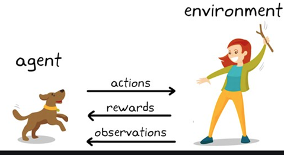
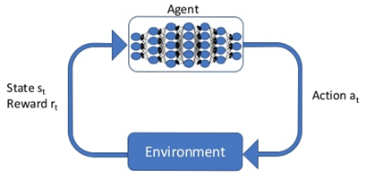
- 1.3.2 人工智能的研究途径

<!-- slide: 37 -->

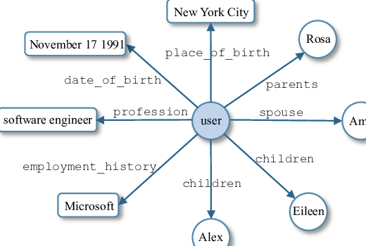

- 物理符号系统假设（ Newell和Simon，1976）
  - 物理符号系统具有必要且足够的方法来实现普通的智能行为。
  - 把智能问题都归结为符号系统的计算问题，把一切精神活动都归结为计算。
  - 所以人类的认识过程就是一种符号处理过程，思维就是符号的计算。
- 有限合理性原理（Simon）
  - 人类之所以能在大量不确定、不完全信息的复杂环境下解决那些难题，其原因在于人类采用了启发式搜索的试探性方法来求得问题的有限合理解。
- 1. 符号主义

<!-- slide: 38 -->

- 一个物理符号系统的符号操作功能主要有：
  - 输入、输出、储存、复制符号；建立符号结构，即确定符号间的关系，在符号系统中形成符号结构；条件性迁移，依赖已经掌握的符号继续完成行为。
  - 任何一个系统，如果能够表现出智能的话，一定能执行上述六种功能；反过来，如果任何系统具有以上六种功能，它就能表现出智能。
- 符号主义观点认为：
  - 知识是信息的一种形式，是构成智能的基础。人工智能的核心问题是知识表示、知识推理和知识运用。
- 从功能上对人脑进行模拟
  - 在自动推理、定理证明、机器博弈、自然语言处理、知识工程、专家系统等方面取得了显著成果。
  - 但是“常识”问题，不确定事物的表示和处理问题是需要解决的难题。
- “传统的人工智能”或者“经典的人工智能”

<!-- slide: 39 -->

- 2. 联结主义
- 人类智能的物质基础是神经系统，其基本单元是神经元
  - 搞清楚人脑的结构及其信息处理机理和过程，就有望揭示人类智能的奥秘。从而真正实现人类智能在机器上的模拟。
- 神经网络具有独特优势
  - 以分布式的方式存储信息，以并行方式处理信息，具有很强的鲁棒性和容错性，可具有实现自组织、自学习能力。
- 从结构上对人脑进行模拟
  - 适合于模拟人脑形象思维，能够快速得到近似解，便于实现人脑的低级感知功能。
  - 在图像处理、模式识别、机器学习等方面具有相当优势。
  - 不适合于模拟人类的逻辑思维过程，其基础理论研究也有很多难点。
- 目前最主流的途径，即深度学习

<!-- slide: 40 -->

- 3. 行为主义
- 1991年MIT的Brooks提出了无需知识表示的智能和无需推理的智能
  - 智能只是在与环境交互作用中才表现出来，不应采用集中式的模式，而是需要具有不同的行为模式与环境交互，以此来产生复杂行为。
  - 智能取决于感知和行为，取决于对外界复杂环境的适应，而不是表示和推理。
- 基本观点：
  - 知识的形式化表达和模型化方法是人工智能的重要障碍之一；
  - 智能取决于感知和行动，应直接利用机器对环境作用后，以环境对作用的响应为原型；
  - 智能行为只能体现在世界中，通过周围环境交互表现出来；
  - 人工智能可以象人类智能一样逐步进化，分阶段发展和增强。
- 从行为上模拟和体现智能
  - 模拟人在控制过程中的智能活动和行为特性，如自寻优、自适应、自学习、自组织等，来研究和实现人工智能。
  - 在智能控制、机器人领域获得了很多成就。
- 行为主义学派的兴起表明控制论、系统工程的思想将进一步影响人工智能的发展

<!-- slide: 41 -->

- 1．部分著名期刊
- Artificial Intelligence
- Artificial Intelligence Review
- Journal of AI Research
- Machine Learning
- Journal of Machine Learning Research
- IEEE Trans on Pattern Analysis and Machine Intelligence
- International Journal of Computer Vision
- AI Magazine
- Applied Artificial Intelligence
- Computational Intelligence
- IEEE Trans on Neural Networks
- IEEE Trans on Systems，Man & Cybernetics， Part A & B
- Neural Networks
- Pattern Recognition
- Robotica
- 1.3.3 人工智能研究资源

<!-- slide: 42 -->

- 2．部分著名会议
- IJCAI： International Joint Conference on AI (since 1969)
- AAAI： American Association for AI National Conference (since 1980)
- ICML： International Conference on Machine Learning (since 1984)
- NIPS： Neural Information Processing Systems (since 1987)
- ACL： Annual Meeting of the Association for Computational Linguistics (since 1963)
- CVPR： IEEE Conference on Computer Vision and Pattern Recognition (since 1988)
- ICCV： International Conference on Computer Vision (since 1987)
- ICLR： International Conference on Learning Representations (since 2013)
- SIGIR： ACM SIGIR Conference on Information Retrieval (since 1971)
- KDD： ACM SIGKDD Conference on Knowledge Discovery and Data Mining (since 1995)
- SIGMOD： ACM SIGMOD International Conference on Management of Data (since 1975)
- ICDM： IEEE International Conference on Data Mining (since 2001)
- ECAI： European Conference on AI (since 1974)
- ECML： European Conference on Machine Learning (since 1986)
- IAAI： Innovative Applications of AI (since 1989)
- ICTAI： IEEE Conference on Tools with AI (since 1989)
- ICNN/IJCNN： International (Joint) Conference on Neural Networks (since 1989)
- UAI： Conference on Uncertainty in AI (since 1985)
- ICPR： International Conference on Pattern Recognition (since 1989)
- AGENTS： International Conference on Autonomous Agents (since 1997)

<!-- slide: 43 -->

- 模式识别（Pattern Recognition）
  - 人工智能最早研究的领域之一。
  - “模式”是指在一类事物中可被区分的、具有典型性的代表事物。
  - 对给定事物进行鉴别和分类，将其归入与之相同或相似的模式中。
- 自然语言处理（Natural Language Processing）
  - 研究如何使计算机能够理解、生成、检索自然语言（包括语音和文本），从而实现人与计算机之间用自然语言进行有效交流。
- 1.4 人工智能研究及应用领域

<!-- slide: 44 -->

- 机器学习（Machine Learning）与数据挖掘
  - 研究如何使计算机能够模拟或实现人类的学习功能，从大量的数据中发现规律，提取知识，并在实践中不断地完善、增强自我。
- 人工神经网络（Artificial Neural Network）与深度学习（Deep Learning）
  - 以联结主义研究人工智能的方法，以对人脑和自然神经网络的生理研究成果为基础，抽象和模拟人脑的某些机理、机制，实现某方面的功能。
- 1.4 人工智能研究及应用领域

<!-- slide: 45 -->

- 问题求解（Problem Solving）与博弈（Game Playing）
  - 人工智能最早的实践应用之一：下棋程序。
  - 通过搜索的方法寻找目标解的一个合适操作序列，并满足问题的各种约束。
- 多智能体（Multi Agent）
  - 源于分布式人工智能研究。
  - 研究在逻辑或物理上分散的智能系统之间如何相互协调各自的智能行为，实现问题的并行求解。
- 1.4 人工智能研究及应用领域

<!-- slide: 46 -->

- 专家系统（Expert System）
  - 对人类专家求解问题的过程进行建模，对知识进行合理表示，然后运用推理技术来模拟通常由人类专家才能解决的问题，达到具有与专家同等解决能力的水平。
- 计算机视觉（Computer Vision）
  - 研究如何用计算机实现或模拟人类视觉功能。
- 1.4 人工智能研究及应用领域

<!-- slide: 47 -->

- 自动定理证明（Automatic Theorem Proving）
  - 研究如何把人类证明定理的过程变成能在计算机上自动实现符号演算的过程，就是让计算机模拟人类证明定理的方法，自动实现像人类证明定理那样的非数值符号演算过程。
- 智能控制（Intelligent Control）
  - 人工智能和自动控制相结合的产物，是自动控制的最新发展阶段，主要研究适用于复杂系统的控制理论和技术。
- 1.4 人工智能研究及应用领域

<!-- slide: 48 -->

- 机器人学（Robotics）
  - 在电子学、人工智能、控制论、系统工程、精密机械、信息传感、仿生学以及心理学等多种学科和技术的基础上形成的一种综合性技术学科。
- 人工生命（Artificial Life）
  - 用计算机等人造系统演示、模拟、仿真具有自然生命系统特征的行为。
- 1.4 人工智能研究及应用领域

<!-- slide: 49 -->

- 01
- 02
- 03
- 机器学习（Machine Learning）
- 人工智能中最火热的研究领域之一
- 深度学习（Deep Learning）
- 最火热的机器学习方法之一
- 人工智能（Artificial Intelligence）
- 融汇工学、数学、医学、认知学等很多学科的一个交叉学科
- 当前几个火热的术语
- 人工智能

- 机器学习

- 深度学习

<!-- slide: 50 -->

- 本章完
