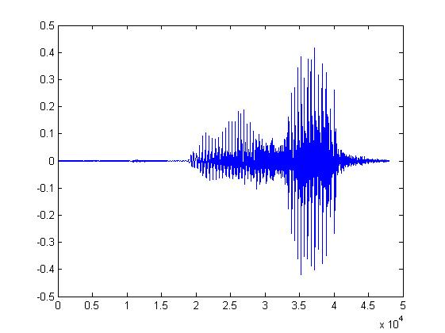
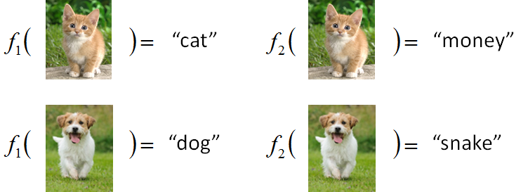
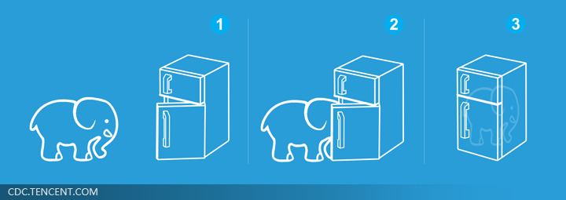

# 第6章 机器学习（0）-框架

<!-- slide: 1 -->

## 机器学习框架

<!-- slide: 2 -->

## Machine Learning ≈ Looking for a Function

- Speech Recognition
- Image Recognition
- Playing Go
- Dialogue System
- “Cat”
- “How are you”
- “5-5”
- “Hello”

- “Hi”

- (what the user said)
- (system response)

- (next move)

<!-- slide: 3 -->

## Framework

- A set of function

- “cat”
- “dog”

- “monkey”
- “snake”

- Model
- “cat”

- Image Recognition:

> 备注：Repeat again

<!-- slide: 4 -->

## Framework

- A set of function
- “cat”

- Image Recognition:
- Model
- Training
- Data
- Goodness of function f
- Better!
- “monkey”

- “cat”
- “dog”

- function input:
- function output:
- Supervised Learning

> 备注：Repeat again

<!-- slide: 5 -->

## Framework

- A set of function
- “cat”

- Image Recognition:
- Model
- Training
- Data
- Goodness of function f
- “monkey”

- “cat”
- “dog”

- Pick the “Best” Function
- Using

- “cat”
- Training
- Testing
- Step 1
- Step 2
- Step 3

> 备注：Repeat again

<!-- slide: 6 -->

## Machine Learning is so simple ……

- 就好像把大象放進冰箱 ……
