# 第7章 深度学习（6）-卷积神经网络

<!-- page: 1 -->

Lecture 7:
Convolutional Networks

Justin Johnson
September 24, 2019

Lecture 7 - 1

<!-- page: 2 -->

Reminder: A2

Due Monday, September 30, 11:59pm (Even if you enrolled late!)

Your submission must pass the validation script

Justin Johnson
September 24, 2019

Lecture 7 - 2

<!-- page: 3 -->

Slight schedule change

Content originally planned for today got split into two lectures

Pushes the schedule back a bit:

A4 Due Date: Friday 11/1 -> Friday 11/8
A5 Due Date: Friday 11/15 -> Friday 11/22
A6 Due Date: Still Friday 12/6

Justin Johnson
September 24, 2019

Lecture 7 - 3

<!-- page: 4 -->

Last Time: Backpropagation

During the backward pass, each node in
the graph receives upstream gradients
and multiplies them by local gradients to
compute downstream gradients

Represent complex expressions
as computational graphs

x

+
L
s (scores)
*

hinge

loss

W

R

f
Local
gradients

Downstream

gradients

Forward pass computes outputs

Upstream

gradient

Backward pass computes gradients

Justin Johnson
September 24, 2019

Lecture 7 - 4

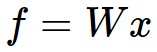

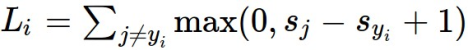

<!-- page: 5 -->

Stretch pixels into column

f(x,W) = Wx

56

Problem: So far our
classifiers don’t
respect the spatial
structure of images!

56
231

231

24
2

24

Input image

2

(2, 2)

(4,)
x
h
W1
s
W2
Input:

3072

Output: 10

Hidden layer:

100

Justin Johnson
September 24, 2019
Lecture 7 - 5

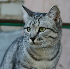

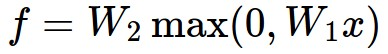

<!-- page: 6 -->

Stretch pixels into column

f(x,W) = Wx

56

Problem: So far our
classifiers don’t
respect the spatial
structure of images!

56
231

231

24
2

24

Input image

2

(2, 2)

Solution: Define new
computational nodes
that operate on images!

(4,)
x
h
W1
s
W2
Input:

3072

Output: 10

Hidden layer:

100

Justin Johnson
September 24, 2019
Lecture 7 - 6

<!-- page: 7 -->

Components of a Full-Connected Network

Fully-Connected Layers
Activation Function

x
h
s

Justin Johnson
September 24, 2019

Lecture 7 - 7

<!-- page: 8 -->

Components of a Convolutional Network

Fully-Connected Layers
Activation Function

x
h
s

Convolution Layers
Pooling Layers

Normalization

Justin Johnson
September 24, 2019

Lecture 7 - 8

<!-- page: 9 -->

Components of a Convolutional Network

Fully-Connected Layers
Activation Function

x
h
s

Convolution Layers
Pooling Layers

Normalization

Justin Johnson
September 24, 2019

Lecture 7 - 9

<!-- page: 10 -->

Fully-Connected Layer

32x32x3 image -> stretch to 3072 x 1

Output
Input

3072
1

1
10

10 x 3072
weights

Justin Johnson
September 24, 2019

Lecture 7 - 10

<!-- page: 11 -->

Fully-Connected Layer

32x32x3 image -> stretch to 3072 x 1

Output
Input

3072
1

1
10

10 x 3072
weights

1 number:
the result of taking a dot
product between a row of W
and the input (a 3072-
dimensional dot product)

Justin Johnson
September 24, 2019

Lecture 7 - 11

<!-- page: 12 -->

Convolution Layer

3x32x32 image: preserve spatial structure

height
32

width

32

depth /
channels

3

Justin Johnson
September 24, 2019

Lecture 7 - 12

<!-- page: 13 -->

Convolution Layer

3x32x32 image

3x5x5 filter

Convolve the filter with the image
i.e. “slide over the image spatially,
computing dot products”
height
32

width

32

depth /
channels

3

Justin Johnson
September 24, 2019

Lecture 7 - 13

<!-- page: 14 -->

Convolution Layer

Filters always extend the full
depth of the input volume

3x32x32 image

3x5x5 filter

Convolve the filter with the image
i.e. “slide over the image spatially,
computing dot products”
32

height

width

32

depth /
channels

3

Justin Johnson
September 24, 2019

Lecture 7 - 14

<!-- page: 15 -->

Convolution Layer

3x32x32 image

3x5x5 filter

32
1 number:
the result of taking a dot product between the filter
and a small 3x5x5 chunk of the image
(i.e. 3*5*5 = 75-dimensional dot product + bias)

32

3

Justin Johnson
September 24, 2019

Lecture 7 - 15

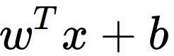

<!-- page: 16 -->

Convolution Layer

1x28x28
activation map

3x32x32 image

3x5x5 filter

28

32
convolve (slide) over
all spatial locations

28

32

1

3

Justin Johnson
September 24, 2019

Lecture 7 - 16

<!-- page: 17 -->

Convolution Layer

two 1x28x28
activation map

Consider repeating with
a second (green) filter:

3x32x32 image

3x5x5 filter

28

28

32
convolve (slide) over
all spatial locations

28

32

1

1

3

Justin Johnson
September 24, 2019

Lecture 7 - 17

<!-- page: 18 -->

Convolution Layer

6 activation maps,
each 1x28x28
Consider 6 filters,
each 3x5x5

3x32x32 image

Convolution

Layer

32

6x3x5x5
filters
Stack activations to get a

32

3

6x28x28 output image!

Justin Johnson
September 24, 2019

Lecture 7 - 18

<!-- page: 19 -->

Convolution Layer

6 activation maps,
each 1x28x28
Also 6-dim bias vector:

3x32x32 image

Convolution

Layer

32

6x3x5x5
filters
Stack activations to get a

32

3

6x28x28 output image!

Justin Johnson
September 24, 2019

Lecture 7 - 19

<!-- page: 20 -->

28x28 grid, at each
point a 6-dim vector
Also 6-dim bias vector:

Convolution Layer

3x32x32 image

Convolution

Layer

32

6x3x5x5
filters
Stack activations to get a

32

3

6x28x28 output image!

Justin Johnson
September 24, 2019

Lecture 7 - 20

<!-- page: 21 -->

Convolution Layer

2x6x28x28
Batch of outputs
Also 6-dim bias vector:

2x3x32x32
Batch of images

Convolution

Layer

32

6x3x5x5
filters

32

3

Justin Johnson
September 24, 2019

Lecture 7 - 21

<!-- page: 22 -->

Convolution Layer

N x Cout x H’ x W’

Batch of outputs
Also Cout-dim bias vector:

N x Cin x H x W
Batch of images

Convolution

Layer

H

W

Cout x Cinx Kw x Kh

filters
Cout

Cin

Justin Johnson
September 24, 2019

Lecture 7 - 22

<!-- page: 23 -->

Stacking Convolutions

32

28

26

….

Conv
Conv
Conv

W1: 6x3x5x5
b1: 5
28

W2: 10x6x3x3
b2: 10

W3: 12x10x3x3
b3: 12

32

26

3

6
10

Input:
N x 3 x 32 x 32

First hidden layer:

Second hidden layer:

N x 6 x 28 x 28

N x 10 x 26 x 26

Justin Johnson
September 24, 2019
Lecture 7 - 23

<!-- page: 24 -->

Q: What happens if we stack
two convolution layers?

Stacking Convolutions

32

28

26

….

Conv
Conv
Conv

W1: 6x3x5x5
b1: 5
28

W2: 10x6x3x3
b2: 10

W3: 12x10x3x3
b3: 12

32

26

3

6
10

Input:
N x 3 x 32 x 32

First hidden layer:

Second hidden layer:

N x 6 x 28 x 28

N x 10 x 26 x 26

Justin Johnson
September 24, 2019
Lecture 7 - 24

<!-- page: 25 -->

(Recall y=W2W1x is
a linear classifier)

Q: What happens if we stack
two convolution layers?
A: We get another convolution!

Stacking Convolutions

32

28

26

….

Conv

ReLU
Conv
ReLU
Conv
ReLU

W1: 6x3x5x5
b1: 6
28

W2: 10x6x3x3
b2: 10

W3: 12x10x3x3
b3: 12

32

26

3

6
10

Input:
N x 3 x 32 x 32

First hidden layer:

Second hidden layer:

N x 6 x 28 x 28

N x 10 x 26 x 26

Justin Johnson
September 24, 2019
Lecture 7 - 25

<!-- page: 26 -->

What do convolutional filters learn?

32

28

26

….

Conv

ReLU
Conv
ReLU
Conv
ReLU

W1: 6x3x5x5
b1: 6
28

W2: 10x6x3x3
b2: 10

W3: 12x10x3x3
b3: 12

32

26

3

6
10

Input:
N x 3 x 32 x 32

First hidden layer:

Second hidden layer:

N x 6 x 28 x 28

N x 10 x 26 x 26

Justin Johnson
September 24, 2019
Lecture 7 - 26

<!-- page: 27 -->

What do convolutional filters learn?

32

28

Linear classifier: One template per class

Conv
ReLU

W1: 6x3x5x5
b1: 6
28

32

3

6

Input:
N x 3 x 32 x 32

First hidden layer:

N x 6 x 28 x 28

Justin Johnson
September 24, 2019
Lecture 7 - 27

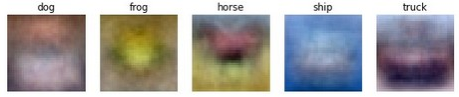

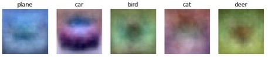

<!-- page: 28 -->

What do convolutional filters learn?

MLP: Bank of whole-image templates

32

28

Conv
ReLU

W1: 6x3x5x5
b1: 6
28

32

3

6

Input:
N x 3 x 32 x 32

First hidden layer:

N x 6 x 28 x 28

Justin Johnson
September 24, 2019
Lecture 7 - 28

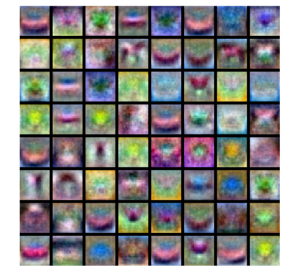

<!-- page: 29 -->

What do convolutional filters learn?

First-layer conv filters: local image templates
(Often learns oriented edges, opposing colors)

32

28

Conv
ReLU

W1: 6x3x5x5
b1: 6
28

32

3

6

Input:
N x 3 x 32 x 32

First hidden layer:

AlexNet: 64 filters, each 3x11x11

N x 6 x 28 x 28

Justin Johnson
September 24, 2019
Lecture 7 - 29

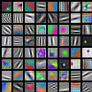

<!-- page: 30 -->

A closer look at spatial dimensions

32

28

Conv
ReLU

W1: 6x3x5x5
b1: 6
28

32

3

6

Input:
N x 3 x 32 x 32

First hidden layer:

N x 6 x 28 x 28

Justin Johnson
September 24, 2019
Lecture 7 - 30

<!-- page: 31 -->

A closer look at spatial dimensions

Input: 7x7
Filter: 3x3

7

7

Justin Johnson
September 24, 2019
Lecture 7 - 31

<!-- page: 32 -->

A closer look at spatial dimensions

Input: 7x7
Filter: 3x3

7

7

Justin Johnson
September 24, 2019
Lecture 7 - 32

<!-- page: 33 -->

A closer look at spatial dimensions

Input: 7x7
Filter: 3x3

7

7

Justin Johnson
September 24, 2019
Lecture 7 - 33

<!-- page: 34 -->

A closer look at spatial dimensions

Input: 7x7
Filter: 3x3

7

7

Justin Johnson
September 24, 2019
Lecture 7 - 34

<!-- page: 35 -->

A closer look at spatial dimensions

Input: 7x7
Filter: 3x3
Output: 5x5

7

7

Justin Johnson
September 24, 2019
Lecture 7 - 35

<!-- page: 36 -->

A closer look at spatial dimensions

Input: 7x7
Filter: 3x3
Output: 5x5

In general:
Input: W
Filter: K
Output: W – K + 1

Problem: Feature
maps “shrink”
with each layer!

7

7

Justin Johnson
September 24, 2019
Lecture 7 - 36

<!-- page: 37 -->

A closer look at spatial dimensions

0
0
0
0
0
0
0
0
0

Input: 7x7
Filter: 3x3
Output: 5x5

0
0

0
0

0
0

In general:
Input: W
Filter: K
Output: W – K + 1

Problem: Feature
maps “shrink”
with each layer!

0
0

0
0

0
0

0
0

Solution: padding
Add zeros around the input

0
0
0
0
0
0
0
0
0

Justin Johnson
September 24, 2019

Lecture 7 - 37

<!-- page: 38 -->

A closer look at spatial dimensions

0
0
0
0
0
0
0
0
0

Input: 7x7
Filter: 3x3
Output: 5x5

0
0

0
0

0
0

In general:
Input: W
Filter: K
Padding: P
Output: W – K + 1 + 2P

Very common:
Set P = (K – 1) / 2 to
make output have
same size as input!

0
0

0
0

0
0

0
0

0
0
0
0
0
0
0
0
0

Justin Johnson
September 24, 2019

Lecture 7 - 38

<!-- page: 39 -->

Receptive Fields

For convolution with kernel size K, each element in the
output depends on a K x K receptive field in the input

Input
Output

Justin Johnson
September 24, 2019
Lecture 7 - 39

<!-- page: 40 -->

Receptive Fields

Each successive convolution adds K – 1 to the receptive field size
With L layers the receptive field size is 1 + L * (K – 1)

Input
Output

Be careful – ”receptive field in the input” vs “receptive field in the previous layer”

Hopefully clear from context!

Justin Johnson
September 24, 2019
Lecture 7 - 40

<!-- page: 41 -->

Receptive Fields

Each successive convolution adds K – 1 to the receptive field size
With L layers the receptive field size is 1 + L * (K – 1)

Input
Output

Problem: For large images we need many layers
for each output to “see” the whole image image

Justin Johnson
September 24, 2019
Lecture 7 - 41

<!-- page: 42 -->

Receptive Fields

Each successive convolution adds K – 1 to the receptive field size
With L layers the receptive field size is 1 + L * (K – 1)

Input
Output

Problem: For large images we need many layers
for each output to “see” the whole image image

Solution: Downsample inside the network

Justin Johnson
September 24, 2019
Lecture 7 - 42

<!-- page: 43 -->

Strided Convolution

Input: 7x7
Filter: 3x3
Stride: 2

Justin Johnson
September 24, 2019
Lecture 7 - 43

<!-- page: 44 -->

Strided Convolution

Input: 7x7
Filter: 3x3
Stride: 2

Justin Johnson
September 24, 2019
Lecture 7 - 44

<!-- page: 45 -->

Strided Convolution

Input: 7x7
Filter: 3x3
Stride: 2

Output: 3x3

Justin Johnson
September 24, 2019
Lecture 7 - 45

<!-- page: 46 -->

Strided Convolution

Input: 7x7
Filter: 3x3
Stride: 2

Output: 3x3

In general:
Input: W
Filter: K
Padding: P
Stride: S
Output: (W – K + 2P) / S + 1

Justin Johnson
September 24, 2019
Lecture 7 - 46

<!-- page: 47 -->

Convolution Example

Input volume: 3 x 32 x 32
10 5x5 filters with stride 1, pad 2

Output volume size: ?

Justin Johnson
September 24, 2019

Lecture 7 - 47

<!-- page: 48 -->

Convolution Example

Input volume: 3 x 32 x 32
10 5x5 filters with stride 1, pad 2

Output volume size:
(32+2*2-5)/1+1 = 32 spatially, so
10 x 32 x 32

Justin Johnson
September 24, 2019

Lecture 7 - 48

<!-- page: 49 -->

Convolution Example

Input volume: 3 x 32 x 32
10 5x5 filters with stride 1, pad 2

Output volume size: 10 x 32 x 32
Number of learnable parameters: ?

Justin Johnson
September 24, 2019

Lecture 7 - 49

<!-- page: 50 -->

Convolution Example

Input volume: 3 x 32 x 32
10 5x5 filters with stride 1, pad 2

Output volume size: 10 x 32 x 32
Number of learnable parameters: 760
Parameters per filter: 3*5*5 + 1 (for bias) = 76
10 filters, so total is 10 * 76 = 760

Justin Johnson
September 24, 2019

Lecture 7 - 50

<!-- page: 51 -->

Convolution Example

Input volume: 3 x 32 x 32
10 5x5 filters with stride 1, pad 2

Output volume size: 10 x 32 x 32
Number of learnable parameters: 760
Number of multiply-add operations: ?

Justin Johnson
September 24, 2019

Lecture 7 - 51

<!-- page: 52 -->

Convolution Example

Input volume: 3 x 32 x 32
10 5x5 filters with stride 1, pad 2

Output volume size: 10 x 32 x 32
Number of learnable parameters: 760
Number of multiply-add operations: 768,000
10*32*32 = 10,240 outputs; each output is the inner product
of two 3x5x5 tensors (75 elems); total = 75*10240 = 768K

Justin Johnson
September 24, 2019

Lecture 7 - 52

<!-- page: 53 -->

Example: 1x1 Convolution

56
1x1 CONV
with 32 filters

56

(each filter has size 1x1x64,
and performs a 64-
dimensional dot product)

56

32
56

64

Justin Johnson
September 24, 2019

Lecture 7 - 53

<!-- page: 54 -->

Example: 1x1 Convolution

56
1x1 CONV
with 32 filters

56

(each filter has size 1x1x64,
and performs a 64-
dimensional dot product)

56

32
56

Stacking 1x1 conv layers
gives MLP operating on
each input position

64

Lin et al, “Network in Network”, ICLR 2014

Justin Johnson
September 24, 2019

Lecture 7 - 54

<!-- page: 55 -->

Convolution Summary

Input: Cin x H x W
Hyperparameters:
-
Kernel size: KH x KW
-
Number filters: Cout
-
Padding: P
-
Stride: S
Weight matrix: Cout x Cin x KH x KW
giving Cout filters of size Cin x KH x KW
Bias vector: Cout
Output size: Cout x H’ x W’ where:
-
H’ = (H – K + 2P) / S + 1
-
W’ = (W – K + 2P) / S + 1

Justin Johnson
September 24, 2019

Lecture 7 - 55

<!-- page: 56 -->

Convolution Summary

Input: Cin x H x W
Hyperparameters:
-
Kernel size: KH x KW
-
Number filters: Cout
-
Padding: P
-
Stride: S
Weight matrix: Cout x Cin x KH x KW
giving Cout filters of size Cin x KH x KW
Bias vector: Cout
Output size: Cout x H’ x W’ where:
-
H’ = (H – K + 2P) / S + 1
-
W’ = (W – K + 2P) / S + 1

Common settings:
KH = KW (Small square filters)
P = (K – 1) / 2  (”Same” padding)
Cin, Cout = 32, 64, 128, 256 (powers of 2)
K = 3, P = 1, S = 1 (3x3 conv)
K = 5, P = 2, S = 1 (5x5 conv)
K = 1, P = 0, S = 1 (1x1 conv)
K = 3, P = 1, S = 2 (Downsample by 2)

Justin Johnson
September 24, 2019

Lecture 7 - 56

<!-- page: 57 -->

Other types of convolution

So far: 2D Convolution

Input: Cin x H x W
Weights: Cout x Cin x K x K

H

W

Cin

Justin Johnson
September 24, 2019

Lecture 7 - 57

<!-- page: 58 -->

Other types of convolution

So far: 2D Convolution
1D Convolution

Input: Cin x H x W
Weights: Cout x Cin x K x K

Input: Cin x W
Weights: Cout x Cin x K

H

Cin

W

W

Cin

Justin Johnson
September 24, 2019

Lecture 7 - 58

<!-- page: 59 -->

Other types of convolution

So far: 2D Convolution
3D Convolution

Input: Cin x H x W
Weights: Cout x Cin x K x K

Input: Cin x H x W x D
Weights: Cout x Cin x K x K x K

H

Cin-dim vector
at each point
in the volume

H

D

W

Cin

W

Justin Johnson
September 24, 2019

Lecture 7 - 59

<!-- page: 60 -->

PyTorch Convolution Layer

Justin Johnson
September 24, 2019
Lecture 7 - 60

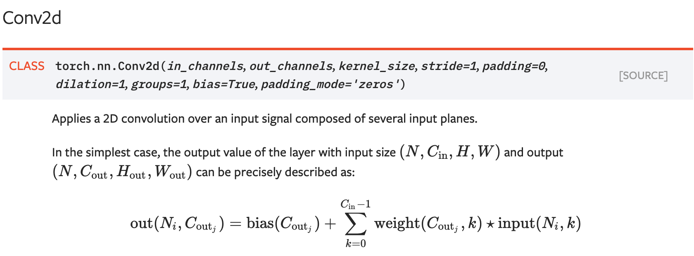

<!-- page: 61 -->

PyTorch Convolution Layers

Justin Johnson
September 24, 2019
Lecture 7 - 61

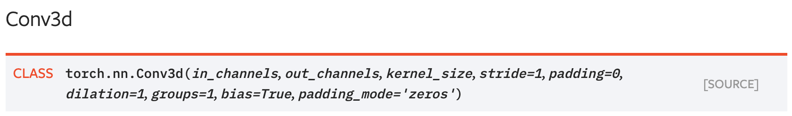

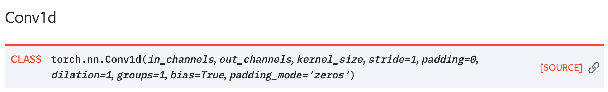

<!-- page: 62 -->

Components of a Convolutional Network

Fully-Connected Layers
Activation Function

x
h
s

Convolution Layers
Pooling Layers

Normalization

Justin Johnson
September 24, 2019

Lecture 7 - 62

<!-- page: 63 -->

Pooling Layers: Another way to downsample

Hyperparameters:
Kernel Size
Stride
Pooling function

Justin Johnson
September 24, 2019

Lecture 7 - 63

<!-- page: 64 -->

Max Pooling

Single depth slice

1
1
2
4

x

Max pooling with 2x2
kernel size and stride 2
6
8

5
6
7
8

3
4

3
2
1
0

1
2
3
4

Introduces invariance to
small spatial shifts
No learnable parameters!

y

Justin Johnson
September 24, 2019

Lecture 7 - 64

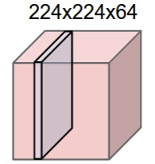

<!-- page: 65 -->

Pooling Summary

Input: C x H x W
Hyperparameters:
-
Kernel size: K
-
Stride: S
-
Pooling function (max, avg)
Output: C x H’ x W’ where
-
H’ = (H – K) / S + 1
-
W’ = (W – K) / S + 1
Learnable parameters: None!

Common settings:
max, K = 2, S = 2
max, K = 3, S = 2 (AlexNet)

Justin Johnson
September 24, 2019

Lecture 7 - 65

<!-- page: 66 -->

Components of a Convolutional Network

Fully-Connected Layers
Activation Function

x
h
s

Convolution Layers
Pooling Layers

Normalization

Justin Johnson
September 24, 2019

Lecture 7 - 66

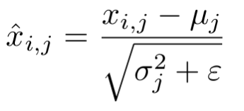

<!-- page: 67 -->

Convolutional Networks

Classic architecture: [Conv, ReLU, Pool] x N, flatten, [FC, ReLU] x N, FC

Example: LeNet-5

Lecun et al, “Gradient-based learning applied to document recognition”, 1998

Justin Johnson
September 24, 2019

Lecture 7 - 67

<!-- page: 68 -->

Example: LeNet-5

Layer
Output Size
Weight Size

Input
1 x 28 x 28

Conv (Cout=20, K=5, P=2, S=1)
20 x 28 x 28
20 x 1 x 5 x 5

ReLU
20 x 28 x 28

MaxPool(K=2, S=2)
20 x 14 x 14

Conv (Cout=50, K=5, P=2, S=1)
50 x 14 x 14
50 x 20 x 5 x 5

ReLU
50 x 14 x 14

MaxPool(K=2, S=2)
50 x 7 x 7

Flatten
2450

Linear (2450 -> 500)
500
2450 x 500

ReLU
500

Linear (500 -> 10)
10
500 x 10

Lecun et al, “Gradient-based learning applied to document recognition”, 1998

Justin Johnson
September 24, 2019

Lecture 7 - 68

<!-- page: 69 -->

Example: LeNet-5

Layer
Output Size
Weight Size

Input
1 x 28 x 28

Conv (Cout=20, K=5, P=2, S=1)
20 x 28 x 28
20 x 1 x 5 x 5

ReLU
20 x 28 x 28

MaxPool(K=2, S=2)
20 x 14 x 14

Conv (Cout=50, K=5, P=2, S=1)
50 x 14 x 14
50 x 20 x 5 x 5

ReLU
50 x 14 x 14

MaxPool(K=2, S=2)
50 x 7 x 7

Flatten
2450

Linear (2450 -> 500)
500
2450 x 500

ReLU
500

Linear (500 -> 10)
10
500 x 10

Lecun et al, “Gradient-based learning applied to document recognition”, 1998

Justin Johnson
September 24, 2019

Lecture 7 - 69

<!-- page: 70 -->

Example: LeNet-5

Layer
Output Size
Weight Size

Input
1 x 28 x 28

Conv (Cout=20, K=5, P=2, S=1)
20 x 28 x 28
20 x 1 x 5 x 5

ReLU
20 x 28 x 28

MaxPool(K=2, S=2)
20 x 14 x 14

Conv (Cout=50, K=5, P=2, S=1)
50 x 14 x 14
50 x 20 x 5 x 5

ReLU
50 x 14 x 14

MaxPool(K=2, S=2)
50 x 7 x 7

Flatten
2450

Linear (2450 -> 500)
500
2450 x 500

ReLU
500

Linear (500 -> 10)
10
500 x 10

Lecun et al, “Gradient-based learning applied to document recognition”, 1998

Justin Johnson
September 24, 2019

Lecture 7 - 70

<!-- page: 71 -->

Example: LeNet-5

Layer
Output Size
Weight Size

Input
1 x 28 x 28

Conv (Cout=20, K=5, P=2, S=1)
20 x 28 x 28
20 x 1 x 5 x 5

ReLU
20 x 28 x 28

MaxPool(K=2, S=2)
20 x 14 x 14

Conv (Cout=50, K=5, P=2, S=1)
50 x 14 x 14
50 x 20 x 5 x 5

ReLU
50 x 14 x 14

MaxPool(K=2, S=2)
50 x 7 x 7

Flatten
2450

Linear (2450 -> 500)
500
2450 x 500

ReLU
500

Linear (500 -> 10)
10
500 x 10

Lecun et al, “Gradient-based learning applied to document recognition”, 1998

Justin Johnson
September 24, 2019

Lecture 7 - 71

<!-- page: 72 -->

Example: LeNet-5

Layer
Output Size
Weight Size

Input
1 x 28 x 28

Conv (Cout=20, K=5, P=2, S=1)
20 x 28 x 28
20 x 1 x 5 x 5

ReLU
20 x 28 x 28

MaxPool(K=2, S=2)
20 x 14 x 14

Conv (Cout=50, K=5, P=2, S=1)
50 x 14 x 14
50 x 20 x 5 x 5

ReLU
50 x 14 x 14

MaxPool(K=2, S=2)
50 x 7 x 7

Flatten
2450

Linear (2450 -> 500)
500
2450 x 500

ReLU
500

Linear (500 -> 10)
10
500 x 10

Lecun et al, “Gradient-based learning applied to document recognition”, 1998

Justin Johnson
September 24, 2019

Lecture 7 - 72

<!-- page: 73 -->

Example: LeNet-5

Layer
Output Size
Weight Size

Input
1 x 28 x 28

Conv (Cout=20, K=5, P=2, S=1)
20 x 28 x 28
20 x 1 x 5 x 5

ReLU
20 x 28 x 28

MaxPool(K=2, S=2)
20 x 14 x 14

Conv (Cout=50, K=5, P=2, S=1)
50 x 14 x 14
50 x 20 x 5 x 5

ReLU
50 x 14 x 14

MaxPool(K=2, S=2)
50 x 7 x 7

Flatten
2450

Linear (2450 -> 500)
500
2450 x 500

ReLU
500

Linear (500 -> 10)
10
500 x 10

Lecun et al, “Gradient-based learning applied to document recognition”, 1998

Justin Johnson
September 24, 2019

Lecture 7 - 73

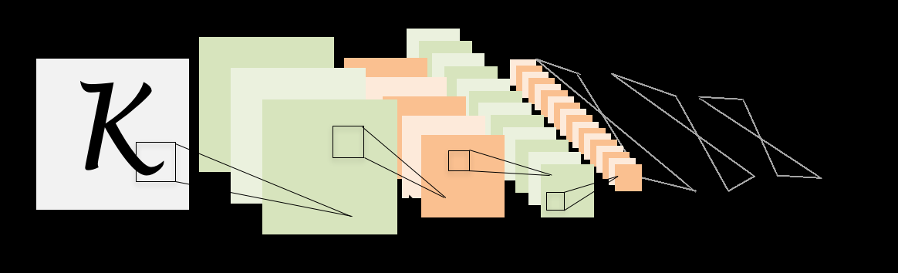

<!-- page: 74 -->

Example: LeNet-5

Layer
Output Size
Weight Size

Input
1 x 28 x 28

Conv (Cout=20, K=5, P=2, S=1)
20 x 28 x 28
20 x 1 x 5 x 5

ReLU
20 x 28 x 28

MaxPool(K=2, S=2)
20 x 14 x 14

Conv (Cout=50, K=5, P=2, S=1)
50 x 14 x 14
50 x 20 x 5 x 5

ReLU
50 x 14 x 14

MaxPool(K=2, S=2)
50 x 7 x 7

Flatten
2450

Linear (2450 -> 500)
500
2450 x 500

ReLU
500

Linear (500 -> 10)
10
500 x 10

Lecun et al, “Gradient-based learning applied to document recognition”, 1998

Justin Johnson
September 24, 2019

Lecture 7 - 74

<!-- page: 75 -->

Example: LeNet-5

Layer
Output Size
Weight Size

Input
1 x 28 x 28

Conv (Cout=20, K=5, P=2, S=1)
20 x 28 x 28
20 x 1 x 5 x 5

ReLU
20 x 28 x 28

MaxPool(K=2, S=2)
20 x 14 x 14

Conv (Cout=50, K=5, P=2, S=1)
50 x 14 x 14
50 x 20 x 5 x 5

ReLU
50 x 14 x 14

MaxPool(K=2, S=2)
50 x 7 x 7

Flatten
2450

Linear (2450 -> 500)
500
2450 x 500

ReLU
500

Linear (500 -> 10)
10
500 x 10

Lecun et al, “Gradient-based learning applied to document recognition”, 1998

Justin Johnson
September 24, 2019

Lecture 7 - 75

<!-- page: 76 -->

Example: LeNet-5

Layer
Output Size
Weight Size

Input
1 x 28 x 28

Conv (Cout=20, K=5, P=2, S=1)
20 x 28 x 28
20 x 1 x 5 x 5

ReLU
20 x 28 x 28

As we go through the network:

MaxPool(K=2, S=2)
20 x 14 x 14

Conv (Cout=50, K=5, P=2, S=1)
50 x 14 x 14
50 x 20 x 5 x 5

Spatial size decreases
(using pooling or strided conv)

ReLU
50 x 14 x 14

MaxPool(K=2, S=2)
50 x 7 x 7

Flatten
2450

Number of channels increases
(total “volume” is preserved!)

Linear (2450 -> 500)
500
2450 x 500

ReLU
500

Linear (500 -> 10)
10
500 x 10

Lecun et al, “Gradient-based learning applied to document recognition”, 1998

Justin Johnson
September 24, 2019

Lecture 7 - 76

<!-- page: 77 -->

Problem: Deep Networks very hard to train!

Justin Johnson
September 24, 2019

Lecture 7 - 77

<!-- page: 78 -->

Components of a Convolutional Network

Fully-Connected Layers
Activation Function

x
h
s

Convolution Layers
Pooling Layers

Normalization

Justin Johnson
September 24, 2019

Lecture 7 - 78

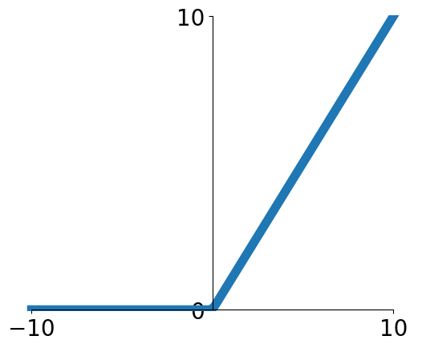

<!-- page: 79 -->

Batch Normalization

Idea: “Normalize” the outputs of a layer so they have zero mean
and unit variance

Why? Helps reduce “internal covariate shift”, improves optimization

We can normalize a batch of activations like this:

This is a differentiable function, so
we can use it as an operator in our
networks and backprop through it!

Ioffe and Szegedy, “Batch normalization: Accelerating deep network training by reducing internal covariate shift”, ICML 2015

Justin Johnson
September 24, 2019

Lecture 7 - 79

<!-- page: 80 -->

Batch Normalization

Input:
Per-channel
mean, shape is D

Per-channel
std, shape is D

X
N

Normalized x,
Shape is N x D

D

Ioffe and Szegedy, “Batch normalization: Accelerating deep network training by reducing internal covariate shift”, ICML 2015

Justin Johnson
September 24, 2019

Lecture 7 - 80

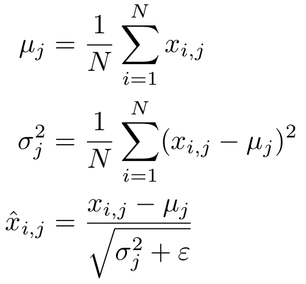

<!-- page: 81 -->

Batch Normalization

Input:
Per-channel
mean, shape is D

Per-channel
std, shape is D

X
N

Normalized x,
Shape is N x D

D
Problem: What if zero-mean, unit
variance is too hard of a constraint?

Ioffe and Szegedy, “Batch normalization: Accelerating deep network training by reducing internal covariate shift”, ICML 2015

Justin Johnson
September 24, 2019

Lecture 7 - 81

<!-- page: 82 -->

Batch Normalization

Input:
Per-channel
mean, shape is D

Learnable scale and
shift parameters:

Per-channel
std, shape is D

Normalized x,
Shape is N x D

Learning     =    ,

=      will recover the
identity function!

Output,
Shape is N x D

Justin Johnson
September 24, 2019

Lecture 7 - 82

<!-- page: 83 -->

Problem: Estimates depend on
minibatch; can’t do this at test-time!

Batch Normalization: Test-Time

Input:
Per-channel
mean, shape is D

Learnable scale and
shift parameters:

Per-channel
std, shape is D

Normalized x,
Shape is N x D

Learning     =    ,

=      will recover the
identity function!

Output,
Shape is N x D

Justin Johnson
September 24, 2019

Lecture 7 - 83

<!-- page: 84 -->

Batch Normalization: Test-Time

(Running) average of
values seen during
training

Input:
Per-channel
mean, shape is D

Learnable scale and
shift parameters:

(Running) average of
values seen during
training

Per-channel
std, shape is D

Normalized x,
Shape is N x D

Learning     =    ,

=      will recover the
identity function!

Output,
Shape is N x D

Justin Johnson
September 24, 2019

Lecture 7 - 84

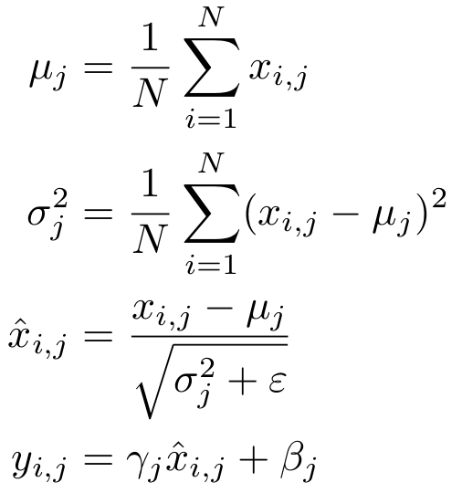

<!-- page: 85 -->

Batch Normalization: Test-Time

(Running) average of
values seen during
training

Input:
Per-channel
mean, shape is D

Learnable scale and
shift parameters:

(Running) average of
values seen during
training

Per-channel
std, shape is D

Normalized x,
Shape is N x D

During testing batchnorm
becomes a linear operator!
Can be fused with the previous
fully-connected or conv layer

Output,
Shape is N x D

Justin Johnson
September 24, 2019

Lecture 7 - 85

<!-- page: 86 -->

Batch Normalization for ConvNets

Batch Normalization for
convolutional networks
(Spatial Batchnorm, BatchNorm2D)

Batch Normalization for
fully-connected networks

x: N × D

x: N×C×H×W

Normalize
Normalize

𝞵,𝝈: 1 × D
ɣ,β: 1 × D
y = ɣ(x-𝞵)/𝝈+β

𝞵,𝝈: 1×C×1×1
ɣ,β: 1×C×1×1
y = ɣ(x-𝞵)/𝝈+β

Justin Johnson
September 24, 2019

Lecture 7 - 86

<!-- page: 87 -->

Batch Normalization

Usually inserted after Fully Connected
or Convolutional layers, and before
nonlinearity.

FC

BN

tanh

FC

BN

tanh

Ioffe and Szegedy, “Batch normalization: Accelerating deep
network training by reducing internal covariate shift”, ICML 2015

Justin Johnson
September 24, 2019

Lecture 7 - 87

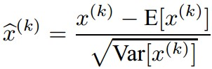

<!-- page: 88 -->

Batch Normalization

-
Makes deep networks much easier to train!
-
Allows higher learning rates, faster convergence
-
Networks become more robust to initialization
-
Acts as regularization during training
-
Zero overhead at test-time: can be fused with conv!

FC

BN

tanh

FC

BN

ImageNet
accuracy

tanh

Training iterations

Ioffe and Szegedy, “Batch normalization: Accelerating deep
network training by reducing internal covariate shift”, ICML 2015

Justin Johnson
September 24, 2019

Lecture 7 - 88

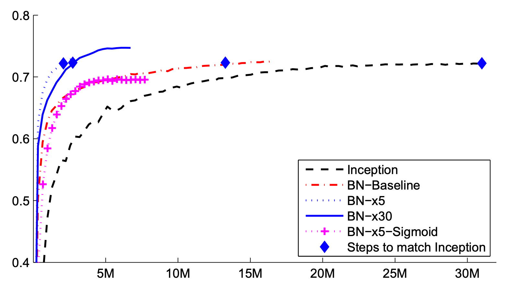

<!-- page: 89 -->

Batch Normalization

-
Makes deep networks much easier to train!
-
Allows higher learning rates, faster convergence
-
Networks become more robust to initialization
-
Acts as regularization during training
-
Zero overhead at test-time: can be fused with conv!
-
Not well-understood theoretically (yet)
-
Behaves differently during training and testing: this
is a very common source of bugs!

FC

BN

tanh

FC

BN

tanh

Ioffe and Szegedy, “Batch normalization: Accelerating deep
network training by reducing internal covariate shift”, ICML 2015

Justin Johnson
September 24, 2019

Lecture 7 - 89

<!-- page: 90 -->

Layer Normalization

Layer Normalization for fully-
connected networks
Same behavior at train and test!
Used in RNNs, Transformers
Batch Normalization for
fully-connected networks

x: N × D

x: N × D

Normalize
Normalize

𝞵,𝝈: 1 × D
ɣ,β: 1 × D
y = ɣ(x-𝞵)/𝝈+β

𝞵,𝝈: N × 1
ɣ,β: 1 × D
y = ɣ(x-𝞵)/𝝈+β

Ba, Kiros, and Hinton, “Layer Normalization”, arXiv 2016

Justin Johnson
September 24, 2019

Lecture 7 - 90

<!-- page: 91 -->

Instance Normalization

Instance Normalization for
convolutional networks
Same behavior at train / test!
Batch Normalization for
convolutional networks

x: N×C×H×W

x: N×C×H×W

Normalize
Normalize

𝞵,𝝈: 1×C×1×1
ɣ,β: 1×C×1×1
y = ɣ(x-𝞵)/𝝈+β

𝞵,𝝈: N×C×1×1
ɣ,β: 1×C×1×1
y = ɣ(x-𝞵)/𝝈+β

Ulyanov et al, Improved Texture Networks: Maximizing Quality and Diversity in Feed-forward Stylization and Texture Synthesis, CVPR 2017

Justin Johnson
September 24, 2019

Lecture 7 - 91

<!-- page: 92 -->

Comparison of Normalization Layers

Wu and He, “Group Normalization”, ECCV 2018

Justin Johnson
September 24, 2019

Lecture 7 - 92

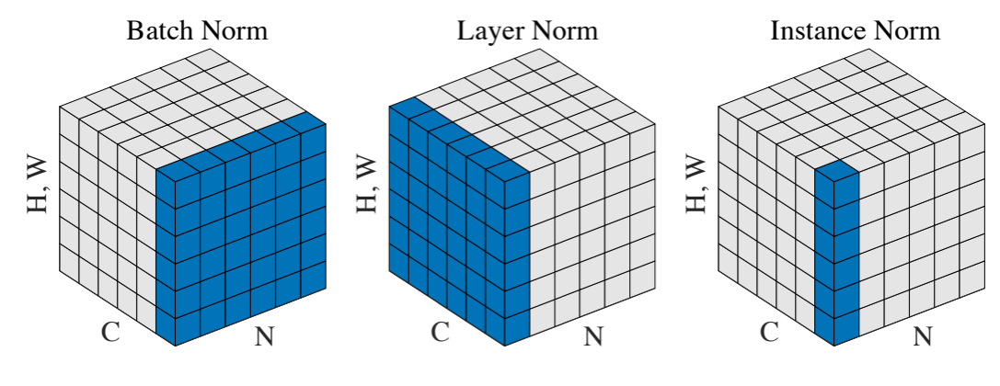

<!-- page: 93 -->

Group Normalization

Wu and He, “Group Normalization”, ECCV 2018

Justin Johnson
September 24, 2019

Lecture 7 - 93

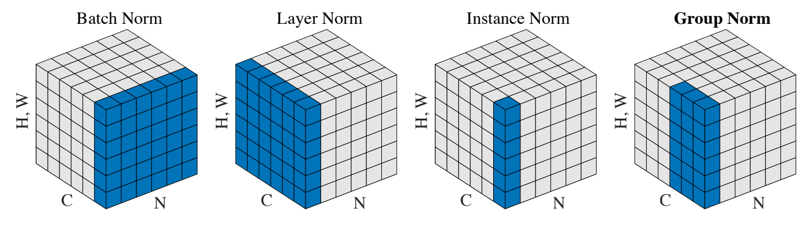

<!-- page: 94 -->

Components of a Convolutional Network

Convolution Layers
Pooling Layers

Fully-Connected Layers

x
h
s

Activation Function
Normalization

Justin Johnson
September 24, 2019

Lecture 7 - 94

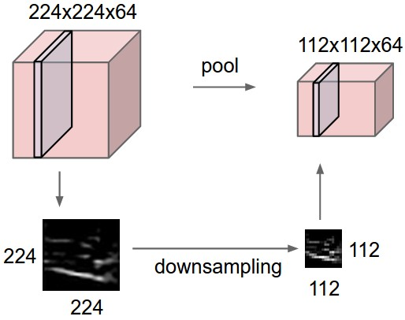

<!-- page: 95 -->

Components of a Convolutional Network

Convolution Layers
Pooling Layers

Fully-Connected Layers

x
h
s

Most
computationally

expensive!

Activation Function
Normalization

Justin Johnson
September 24, 2019

Lecture 7 - 95

<!-- page: 96 -->

Summary: Components of a Convolutional Network

Convolution Layers
Pooling Layers

Fully-Connected Layers

x
h
s

Activation Function
Normalization

Justin Johnson
September 24, 2019
Lecture 7 - 96

<!-- page: 97 -->

Summary: Components of a Convolutional Network

Problem: What is the right way to combine all these components?

Justin Johnson
September 24, 2019
Lecture 7 - 97

<!-- page: 98 -->

Next time:
CNN Architectures

Justin Johnson
September 24, 2019

Lecture 7 - 98
