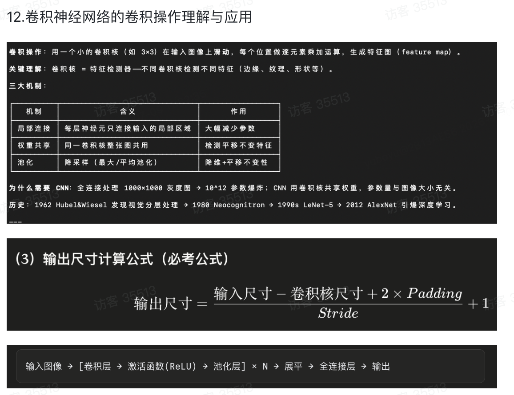

# DHH题目

## 图1 · 知识点:信息增益与决策树分裂属性选择

**题目**

已有 14 条打球数据,按"天气(Outlook)"属性分组统计如下(正例=打球 Yes,反例=不打球 No):

|天气取值|样本数|Yes|No|
|---|---|---|---|
|晴 Sunny|5|2|3|
|阴 Overcast|4|4|0|
|雨 Rain|5|3|2|

整个数据集共 14 条,其中 Yes=9,No=5。

求:整体熵 H(S)、天气属性分裂后的加权平均熵,以及天气的信息增益 Gain(天气)。(log 以 2 为底)

**解答(按标准步骤)**

第1步 整体熵 H(S)

```
H(S) = -(9/14)·log2(9/14) - (5/14)·log2(5/14)
     = -0.643×(-0.637) - 0.357×(-1.485)
     = 0.410 + 0.530
     = 0.940
```

第2步 各组熵

```
晴 (2Yes,3No):H = -(2/5)·log2(2/5) - (3/5)·log2(3/5) = 0.971
阴 (4Yes,0No):纯节点,H = 0
雨 (3Yes,2No):同晴,H = 0.971
```

第3步 加权平均熵

```
H(S|天气) = (5/14)×0.971 + (4/14)×0 + (5/14)×0.971
          = 0.347 + 0 + 0.347
          = 0.694
```

第4步 信息增益

```
Gain(天气) = H(S) - H(S|天气) = 0.940 - 0.694 = 0.246
```

第5步(结论) 若其它属性增益均小于 0.246,则选"天气"作为分裂属性。阴分支已纯(H=0)可直接定为叶节点 Yes;晴、雨分支不纯,需递归继续分裂。

---

## 图2 · 知识点:前馈神经网络 BP 算法(前向传播 + 梯度下降更新)

**题目**

一个单隐层网络:输入 x=1,隐层 1 个神经元,输出层 1 个神经元,均用 Sigmoid 激活 σ(z)=1/(1+e^(-z))。

参数:w1=0.5, b1=0, w2=0.5, b2=0,学习率 η=0.5,真实值 y=1,损失 L=(1/2)(ŷ-y)²。

做一次前向传播算出预测值和损失,并用 BP 更新 w2。

**解答**

第1步 前向传播

```
隐层:z1 = w1·x + b1 = 0.5
     a1 = σ(0.5) = 0.6225

输出层:z2 = w2·a1 + b2 = 0.5×0.6225 = 0.3112
       ŷ = σ(0.3112) = 0.5772
```

第2步 计算损失

```
L = (1/2)(0.5772 - 1)² = (1/2)(0.1788) = 0.0894
```

第3步 反向传播(链式法则求 ∂L/∂w2)

```
∂L/∂w2 = (ŷ - y) · ŷ(1-ŷ) · a1

其中:
  (ŷ - y)     = -0.4228
  ŷ(1-ŷ)      = 0.5772×0.4228 = 0.2440
  a1          = 0.6225

∂L/∂w2 = -0.4228 × 0.2440 × 0.6225 = -0.0642
```

第4步 梯度下降更新

```
w2 ← w2 - η·(∂L/∂w2)
   = 0.5 - 0.5×(-0.0642)
   = 0.5321
```

说明 w2 变大,使下一次 ŷ 更接近目标 1、损失下降。同理可继续更新 b2、w1、b1——BP 的本质就是用链式法则把误差从输出层逐层传回,算出每个 W、b 的梯度后统一更新。

image.png1156×890

这个也出一道

## 图 · 知识点:卷积神经网络输出尺寸计算(必考公式)

**公式回顾**

```
输出尺寸 = (输入尺寸 - 卷积核尺寸 + 2×Padding) / Stride + 1
```

**题目**

一张输入图像尺寸为 32×32×3(RGB 三通道)。依次经过以下网络:

1. 卷积层 Conv1:卷积核 5×5,数量 6 个,Padding=0,Stride=1
2. 最大池化层 Pool1:池化窗口 2×2,Stride=2,Padding=0
3. 卷积层 Conv2:卷积核 3×3,数量 16 个,Padding=1,Stride=1

求每一层输出的特征图尺寸(高×宽×通道数)。

**解答**

第1步 Conv1 输出

```
输出边长 = (32 - 5 + 2×0) / 1 + 1 = 27/1 + 1 = 28
通道数卷积核数量 = 6
→ Conv1 输出:28×28×6
```

第2步 Pool1 输出(池化只改变高宽,不改变通道数)

```
输出边长 = (28 - 2 + 2×0) / 2 + 1 = 26/2 + 1 = 13 + 1 = 14
通道数 = 6(池化不变)
→ Pool1 输出:14×14×6
```

第3步 Conv2 输出

```
输出边长 = (14 - 3 + 2×1) / 1 + 1 = 13/1 + 1 = 14
通道数 = 卷积核数量 = 16
→ Conv2 输出:14×16
```

**答案汇总**

|层|输出尺寸|
|---|---|
|输入|32×32×3|
|Conv1 (5×5,6核,P=0,S=1)|28×28×6|
|Pool1 (2×2,S=2)|14×14×6|
|Conv2 (3×3,16核,P=1,S=1)|14×14×16|

**两个易错点提醒**

- 输出通道数 = 该卷积层的**卷积核个数**,与输入通道数无关(每个核会跨所有输入通道做运算)。
- Conv2 用了 Padding=1,恰好抵消 3×3 核带来的边长缩减,输出高宽保持不变(14→14)。这类"same padding"设置很常见:核 3×3、P=1、S=1 时尺寸不变。
