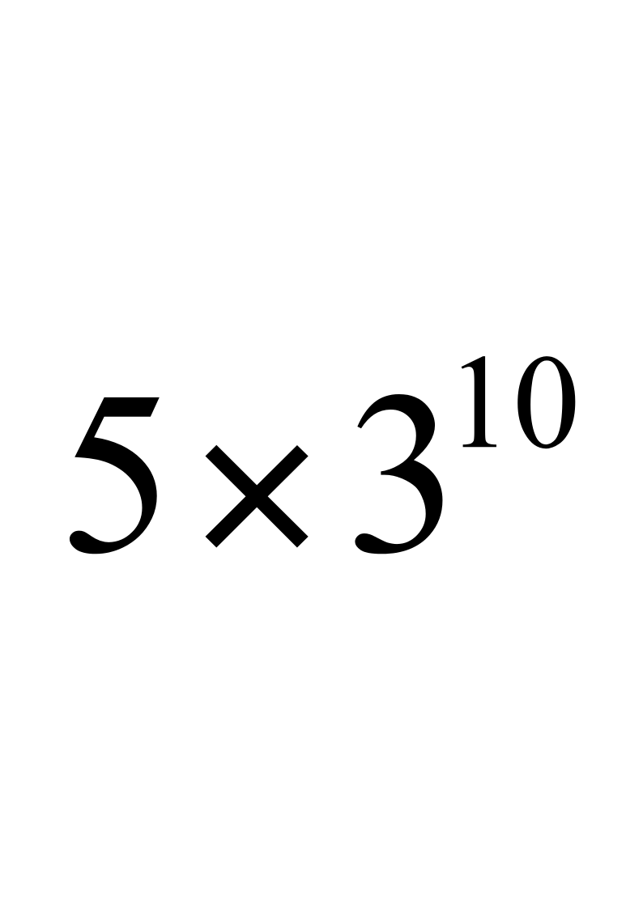

# S人工智能－6机器学习(2)-Bayes

<!-- slide: 1 -->

## 人工智能Artificial Intelligence

- 课件采用鲍军鹏 博士的课件版本：2.0
- 2010年1月

- 主讲：文贵华
- crghwen@scut.edu.cn

<!-- slide: 2 -->

## 6.3 贝叶斯学习

- 6.3.1 贝叶斯法则
- 6.3.2 朴素贝叶斯方法
- 6.3.3 贝叶斯网络
- 6.3.4 EM算法
- 6.3.5 用贝叶斯方法过滤垃圾邮件

<!-- slide: 3 -->

## 6.3.1贝叶斯法则

- 贝叶斯学习
  - 就是基于贝叶斯理论（Bayesian Theory）的机器学习方法。
- 贝叶斯法则
  - 也称为贝叶斯理论（Bayesian Theorem，或Bayesian Rule，或Bayesian Law），其核心就是贝叶斯公式。

<!-- slide: 4 -->

## 贝叶斯公式

- 后验概率
- 先验概率

<!-- slide: 5 -->

## 先验概率

- 先验概率（Prior Probability）
  - 先验概率就是还没有训练数据之前，某个假设h（h∈H）的初始概率，记为P(h)。
  - 先验概率反映了一个背景知识，表示h是一个正确假设的可能性有多少。
  - 如果没有这一先验知识，那么可以简单地将每一候选假设赋予相同的先验概率。

<!-- slide: 6 -->

## 似然度

  - P(d)表示训练数据d的先验概率，也就是在任何假设都未知或不确定时d的概率。
  - P(d|h)表示已知假设h成立时d的概率，称之为类条件概率，或者给定假设h时数据d的似然度（Likelihood）。

<!-- slide: 7 -->

## 后验概率

- 后验概率（Posterior Probability）
  - 后验概率就是在数据d上经过学习之后，获得的假设h成立的概率，记为P(h|d)。
  - P(h|d)表示给定数据d时假设h成立的概率，称为h的后验概率。

<!-- slide: 8 -->

  - 后验概率是学习的结果，反映了在看到训练数据d之后，假设h成立的置信度。
  - 后验概率用作解决问题时的依据。
  - 对于给定数据根据该概率做出相应决策，例如判断数据的类别，或得出某种结论，或执行某种行动等等。

<!-- slide: 9 -->

  - P(h|d)随着P(h)和P(d|h)的增长而增长，随着P(d)的增长而减少。
  - 即如果d独立于h时被观察到的可能性越大，那么d对h的支持度越小。
  - 后验概率是对先验概率的修正。

<!-- slide: 10 -->

- 后验概率P(h|d)是在数据d上得到的学习结果，反映了数据d的影响。这个学习结果是与训练数据相关的。
- 与此相反，先验概率是与训练数据d无关的，是独立于d的。
- 注意!

<!-- slide: 11 -->

- 贝叶斯法则解决的机器学习任务一般是：
  - 在给定训练数据D时，确定假设空间H中的最优假设。这是典型的分类问题。
- 贝叶斯法则基于假设的先验概率、给定假设下观察到不同数据的概率以及观察到的数据本身，提供了一种计算假设概率的方法。

<!-- slide: 12 -->

## 贝叶斯最优假设

- 分类问题的最优假设（即最优结果），可以有不同定义。
  - 例如，与期望误差最小的假设；或者能取得最小熵（Entropy）的假设等等。
- 贝叶斯分类器是指为在给定数据d、假设空间H中不同假设的先验概率以及有关知识下的最可能假设。
  - 这个最可能假设可有不同选择。

<!-- slide: 13 -->

## 极大后验假设

- （1）极大后验假设
- （Maximum A Posteriori，简称MAP假设）
- 极大后验假设    （    ∈H）就是在候选假设集合H中寻找对于给定数据d使后验概率P(h|d)最大的那个假设。

<!-- slide: 14 -->

## 极大后验假设

- 不依赖于h的常量

<!-- slide: 15 -->

## 极大似然假设

- （2）极大似然假设
- （Maximum Likelihood，简称ML假设）
- 极大似然假设就是在候选假设集合H中选择使给定数据d似然度（即类条件概率）P(d|h)最大的假设，即ML假设  （   ∈H）是满足下式的假设。

<!-- slide: 16 -->

  - 极大似然假设和极大后验假设有很强的关联性。
  - 由于数据似然度是先验知识，不需要训练就能知道。所以在机器学习实践中经常应用极大似然假设来指导学习。

<!-- slide: 17 -->

## 贝叶斯最优分类器

- （3）贝叶斯最优分类器
- （Bayes Optimal Classifier）
  - 贝叶斯最优分类器是对最大后验假设的发展。它并不是简单地直接选取后验概率最大的假设（模型）作为分类依据。
  - 而是对所有假设（模型）的后验概率做线性组合（加权求和），然后再选择加权和最大结果作为最优分类结果。

<!-- slide: 18 -->

## 贝叶斯最优分类器

  - 设V表示类别集合，对于V中的任意一个类别vj，概率P(vj|d)表示把数据d归为类别vj的概率。
  - 贝叶斯最优分类就是使P(vj|d)最大的那个类别。贝叶斯最优分类器就是满足下式的分类系统。

<!-- slide: 19 -->

- 在相同的假设空间和相同的先验概率条件下，其它方法的平均性能不会比贝叶斯最优分类器更好。
- 虽然贝叶斯最优分类器能从给定训练数据中获得最好性能，但是其算法开销比较大。
- 注意!

<!-- slide: 20 -->

## 贝叶斯分类器示例

- 例. 设对于数据d有假设h1，h2，h3。它们的先验概率分别是
- P(h1)=0.3，P(h2)=0.3，P(h3)=0.4。
- 并且已知
- P(d|h1)=0.5，P(d|h2)=0.3，P(d|h3)=0.2。
- 又已知在分类集合V={＋，－}上数据d被h1分类为正，被h2和h3分类为负。请分别依据MAP假设和贝叶斯最优分类器对数据d进行分类。

<!-- slide: 21 -->

## 贝叶斯分类器示例

- 解：先分别计算出假设h1，h2，h3的后验概率如下。
- 那么依据MAP假设，h1是最优假设，所以数据d应分类为正。
- 最优假设

<!-- slide: 22 -->

## 贝叶斯分类器示例

- 对于贝叶斯最优分类器，再计算分类概率如下。
- 那么依据贝叶斯最优分类器，数据d应该分类为负。
- 0.53 > 0.47

<!-- slide: 23 -->

## 贝叶斯分类器

- MAP假设
- 贝叶斯最优分类器
- 数
- 据
- 数据为正
- 数据为负
- 不同的方法结果不同!

<!-- slide: 24 -->

## 贝叶斯学习的特点

- 贝叶斯学习为衡量多个假设的置信度提供了定量的方法，可以计算每个假设的显式概率，提供了一个客观的选择标准。
- 特性
  - 观察到的每个训练样例可以增量地降低或升高某假设的估计概率。
  - 先验知识可以与观察数据一起决定假设的最终概率。
  - 允许假设做出不确定性的预测。例如前方目标是骆驼的可能性是90%，是马的可能性是5%。
  - 新的实例分类可由多个假设一起做出预测，用它们的概率来加权。
  - 即使在贝叶斯方法计算复杂度较高时，它仍可作为一个最优决策标准去衡量其它方法。

<!-- slide: 25 -->

## 6.3.2 朴素贝叶斯方法

- 在机器学习中一个实例x往往有很多属性
- <a1,a2,…,an>
  - 其中每一维代表一个属性，该分量的数值就是所对应属性的值。

<!-- slide: 26 -->

- 此时依据MAP假设的贝叶斯学习就是对一个数据<a1,a2,…,an>，求使其满足下式的目标值。其中H是目标值集合。

<!-- slide: 27 -->

- 估计每个P(hi)很容易，只要计算每个目标值hi出现在训练数据中的频率就可以。
- 如果要如此估计所有的P(a1,a2,…,an|hi)项，则必须计算a1,a2,…,an的所有可能取值组合，再乘以可能的目标值数量。

<!-- slide: 28 -->

- 假设一个实例有10个属性，每个属性有3个可能取值，而目标集合中有5个候选目标。那么P(a1,a2,…,an|hi)项就有     个。

- 不适合于高维数据！

<!-- slide: 29 -->

- 对于贝叶斯学习有两种思路可以解决高维数据问题。一种是朴素贝叶斯（Naïve Bayes）方法，也称为简单贝叶斯（Simple Bayes）方法。

<!-- slide: 30 -->

## 朴素贝叶斯方法

- 朴素贝叶斯分类器采用最简单的假设：
  - 对于目标值，数据各属性之间相互条件独立。
  - 即，a1,a2,…,an的联合概率等于每个单独属性的概率乘积：

<!-- slide: 31 -->

## 朴素贝叶斯方法

- 将上页的式子带入上面求    的公式中，就得到朴素贝叶斯分类器所用的方法：
- 其中  表示朴素贝叶斯分类器输出的目标值。

<!-- slide: 32 -->

- 仍假设一个实例有10个属性，每个属性有3个可能取值，而目标集合中有5个候选目标。朴素贝叶斯分类器中需要从训练数据中估计的P(aj|hi)项的数量是        。
- 5×3×10 <<     ！

- 5×3×10

<!-- slide: 33 -->

- 朴素贝叶斯学习的主要过程在于计算训练样例中不同数据组合的出现频率，统计出P(hi)和P(aj|hi)。
- 算法比较简单，是一种很有效的机器学习方法。

<!-- slide: 34 -->

- 当各属性条件独立性满足时，朴素贝叶斯分类结果等于MAP分类。
- 这一假定一定程度上限制了朴素贝叶斯方法的适用范围。
- 但是在实际应用中，许多领域在违背这种假定的条件下，朴素贝叶斯学习也表现出相当的健壮性和高效性。

<!-- slide: 35 -->

## 6.3 贝叶斯学习

- 6.3.1 贝叶斯法则
- 6.3.2 朴素贝叶斯方法
- 6.3.3 贝叶斯网络
- 6.3.4 EM算法
- 6.3.5 用贝叶斯方法过滤垃圾邮件

<!-- slide: 36 -->

## 6.3.5 用贝叶斯方法过滤垃圾邮件

- 朴素贝叶斯方法的学习过程
  - 收集大量垃圾邮件和非垃圾邮件，建立垃圾邮件集和非垃圾邮件集。
  - 提取邮件主题和邮件内容中的有效字词wi，例如“内幕”、“真相”等等。然后统计其出现次数，即在该训练集上的词频TF(wi)。
  - 对垃圾邮件集和非垃圾邮件集中所有邮件执行第二步。
  - 对垃圾邮件集和非垃圾邮件集分别建立哈希表Wspam和Wvalid，存储从有效字词到其词频的映射关系。
  - 计算每个有效字词在垃圾邮件集（Wspam）上出现的概率P(wi|C=spam)和在非垃圾邮件集（Wvalid）上出现的概率P(wi|C=valid)
  - 在垃圾邮件集和非垃圾邮件集上的学习过程结束，获得在垃圾邮件集和非垃圾邮件集上每个有效字词的出现概率。

<!-- slide: 37 -->

- 用朴素贝叶斯方法判定一封邮件的过程
  - 对于一封邮件提取其所有有效字词t1,t2,…,tn。
  - 从哈希表Wspam和Wvalid中分别提取不同类别中上述有效字词的概率P(ti|C=spam) 和P(ti|C=valid)。
  - 依据朴素贝叶斯方法计算该邮件为垃圾邮件的概率P(C=spam|t1,t2,…,tn)和为非垃圾邮件的概率P(C=valid|t1,t2,…,tn)
  - 如果P(C=spam|t1,t2,…,tn) > P(C=valid|t1,t2,…,tn)则该邮件为垃圾邮件，否则该邮件不是垃圾邮件。判定过程结束。

<!-- slide: 38 -->

## m-估计方法

- 问题
  - 某个词频为0的时候，实际概率不应该为0
- 思想：
  - 把原先n个实际观察扩大，加上m个按照p分布的虚拟样本。
  - 其中p是先验估计概率。
  - m是一个表示等效样本大小的常量。
- 估计p最常用的方法就是假定均匀分布的先验概率。
  - 若属性（即训练样例）有k个可能取值，那么p=1/k。
- m最常见的取值就是所有不同有效字词的个数，即词汇表的大小。
- 此时若采用均匀分布的先验概率，则mp=1。所以上式变为：

<!-- slide: 39 -->

- 本章待续……
