# S人工智能－7神经网络

<!-- slide: 1 -->

## 人工智能Artificial Intelligence

- 课件采用鲍军鹏 博士的课件版本：2.0
- 2010年1月

- 主讲：文贵华
- crghwen@scut.edu.cn

<!-- slide: 2 -->

## 第七章	人工神经网络

- 7.1 概述
- 7.2 感知器
- 7.3 前馈神经网络
- 7.4 反馈神经网络
- 7.5 随机神经网络
- 7.6 自组织神经网络

<!-- slide: 3 -->

## 7.1 概述

- 在广义上，神经网络可以泛指生物神经网络也可以指人工神经网络。
- 所谓人工神经网络（Artificial Neural Network）是指模拟人脑神经系统的结构和功能，运用大量的处理部件，由人工方式建立起来的网络系统。
- 人脑是ANN的原型，ANN是对人脑神经系统的模拟。在人工智能领域中，在不引起混淆的情况下，神经网络一般都指的是ANN。

<!-- slide: 4 -->

## 7.1.1 人脑神经系统

- 1875年意大利解剖学家C. Golgi用银渗透法最先识别出单个神经细胞。
- 1889年Cajal创立神经元学说，认为整个神经系统都是由结构上相对独立的神经细胞构成。
  - 神经细胞即神经元是神经系统中独立的营养和功能单元。生物神经系统，包括中枢神经系统和大脑，均是由各类神经元组成。其独立性是指每一个神经元均有自己的核和自己的分界线或原生质膜。
- 生物神经系统是一个有高度组织和相互作用的数量巨大的细胞组织群体。
  - 据估计，人脑神经系统的神经细胞约为1011－1013个。它们按不同的结合方式构成了复杂的神经网络。通过神经元及其联接的可塑性，使得大脑具有学习、记忆和认知等各种智能。

<!-- slide: 5 -->

## 生物神经元

- 神经细胞是构成神经系统的基本单元，称之为生物神经元，或者简称为神经元。神经元主要由三个部分组成：细胞体、轴突、树突。
- 神经元解剖结构
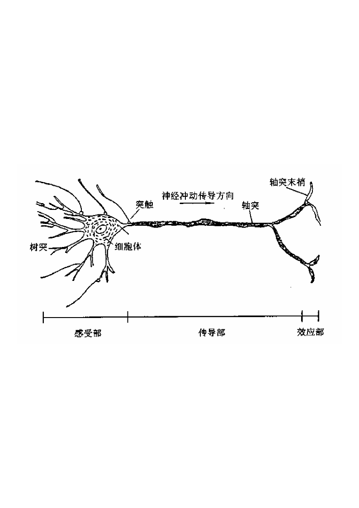

<!-- slide: 6 -->

## 生物神经元

- 细胞体(Cell Body或者Soma)：由细胞核、细胞质、细胞膜等组成。
  - 细胞膜内外有电位差，称为膜电位，大小约为几十微伏。
  - 膜电压接受其它神经元的输入后，电位上升或者下降。
  - 若输入冲动的时空整合结果使膜电位上升，并超过动作电位阈值时，神经元进入兴奋状态，产生神经冲动，由轴突输出。
  - 若整合结果使膜电位下降并低于动作电压阈值时，神经元进入抑制状态，无神经冲动输出。
- 轴突(Axon)：细胞体向外伸出的最长的一条分枝，即神经纤维，相当于神经元的输出端。
  - 一般一个神经元只有一个轴突，有个别神经元没有。
- 树突(Dendrite)：细胞体向外伸出的触轴突之外其它分枝。一般较短，但分枝很多，相当于神经元的输入端。

<!-- slide: 7 -->

## 生物神经元兴奋脉冲

- 神经元的兴奋过程电位变化
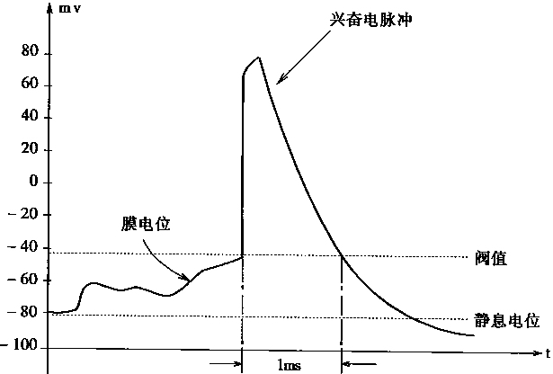

<!-- slide: 8 -->

## 生物神经元突触结构

- 突触结构
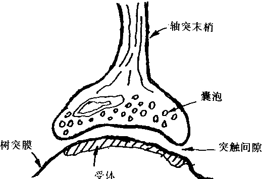

<!-- slide: 9 -->

## 突触传递过程

<!-- slide: 10 -->

## 生物神经元

- 生理学的研究表明，突触可以有以下几个方面的变化：
  - (1)突触传递效率的变化。首先是突触的膨胀以及由此产生的突触后膜表面积扩大，从而突触所释放出的传递物质增多，使得突触的传递效率提高。其次是突触传递物质质量的变化，包括比例成分的变化所引起传递效率的变化。
  - (2)突触接触间隙的变化。在突触表面有许多形状各异的小凸芽，调节其形状变化可以改变接触间隙，并影响传递效率。
  - (3)突触的发芽。当某些神经纤维被破坏后，可能又会长出新芽，并重新产生附着于神经元上的突触．形成新的回路。由于新的回路的形成，使得结合模式发生变化，也会引起传递效率的变化。
  - (4)突触数目的增减。由于种种复杂环境条件的刺激等原因，或者由于动物本身的生长或衰老，神经系统的突触数目会发生变化，并影响神经元之间的传递效率。

<!-- slide: 11 -->

## 神经元的整合功能

- 神经元对信息的接受和传递都是通过突触来进行的。
  - 单个神经元可以从别的细胞接受多个输入。由于输入分布于不同的部位，对神经元影响的比例(权重)是不相同的。另外，各突触输入抵达神经元的先后时间也不一祥。因此，一个神经元接受的信息，在时间和空间上常呈现出一种复杂多变的形式，需要神经元对它们进行积累和整合加工，从而决定其输出的时机和强度。正是神经元这种整合作用，才使得亿万个神经元在神经系统中有条不紊、夜以继日地处理各种复杂的信息，执行着生物中枢神经系统的各种信息处理功能。
- 多个神经元以突触联接形成了一个神经网络。
  - 研究表明，生物神经网络的功能决不是单个神经元生理和信息处理功能的简单叠加，而是一个有层次的、多单元的动态信息处理系统。它们有其独特的运行方式和控制机制，以接受生物内外环境的输入信息，加以综合分折处理，然后调节控制机体对环境作出适当的反应。

<!-- slide: 12 -->

## 人脑神经系统的特征（1）

- 从信息系统研究的观点出发，对于人脑这个智能信息处理系统，有如下一些固有特征：
- (1)并行分布处理的工作模式。
  - 实际上大脑中单个神经元的信息处理速度是很慢的，每次约1毫秒(ms) 。
  - 但是人脑对某一复杂过程的处理和反应却很快，一般只需几百毫秒。可见，大脑信息处理的并行速度已达到了极高的程度。
- (2)神经系统的可塑性和自组织性。
  - 神经系统的可塑性和自组织性与人脑的生长发育过程有关。这种可塑性反映出大脑功能既有先天的制约因素，也有可能通过后天的训练和学习而得到加强。神经网络的学习机制就是基于这种可塑性现象，并通过修正突触的结合强度来实现的。
- (3)信息处理与信息存贮合二为一。
  - 大脑中的信息处理与信息存贮是有机结合在一起的，而不像现行计算机那样．存贮地址和存贮内容是彼此分开的。由于大脑神经元兼有信息处理和存贮功能，所以在进行回亿时，不但不存在先找存贮地址而后再调出所存内容的问题，而且还可以由一部分内容恢复全部内容。

<!-- slide: 13 -->

## 人脑神经系统的特征（2）

- (4)信息处理的系统性
  - 大脑是一个复杂的大规模信息处理系统，单个的元件“神经元”不能体现全体宏观系统的功能。实际上，可以将大脑的各个部位看成是一个大系统中的许多子系统。各个子系统之间具有很强的相互联系，一些子系统可以调节另一些子系统的行为。例如，视觉系统和运动系统就存在很强的系统联系，可以相互协调各种信息处理功能。
- (5)能接受和处理模糊的、模拟的、随机的信息。
- (6)求满意解而不是精确解。
  - 人类处理日常行为时，往往都不是一定要按最优或最精确的方式去求解，而是以能解决问题为原则，即求得满意解就行了。
- (7)系统的恰当退化和冗余备份(鲁棒性和容错性)。

<!-- slide: 14 -->

## 7.1.2 人工神经网络研究内容与特点

- 人工神经网络的研究方兴末艾，很难准确地预测其发展方向。但就目前来看，人工神经网络的研究首先须解决全局稳定性、结构稳定性、可编程性等问题。

<!-- slide: 15 -->

## 基本研究内容（1）

- (1)人工神经网络模型的研究。
  - 神经网络原型研究，即大脑神经网络的生理结构、思维机制；
  - 神经元的生物特性如时空特性、不应期、电化学性质等的人工模拟；
  - 易于实现的神经网络计算模型；
  - 利用物理学的方法进行单元间相互作用理论的研究，如：联想记忆模型；
  - 神经网络的学习算法与学习系统。
- (2)神经网络基本理论研究。
  - 神经网络的非线性特性，包括自组织、自适应等作用；
  - 神经网络的基本性能，包括稳定性、收敛性、容错性、鲁棒性、动力学复杂性；
  - 神经网络的计算能力与信息存贮容量；
  - 结合认知科学的研究，探索包括感知、思考、记忆和语言等的脑信息处理模型。

<!-- slide: 16 -->

## 基本研究内容（2）

- (3)神经网络的软件模拟和硬件实现。
  - 在通用计算机、专用计算机或者并行计算机上进行软件模拟，或由专用数字信号处理芯片构成神经网络仿真器。
  - 由模拟集成电路、数字集成电路或者光器件在硬件上实现神经芯片。软件模拟的优点是网络的规模可以较大，适合于用来验证新的模型和复杂的网络特性。硬件实现的优点是处理速度快，但由于受器件物理因素的限制，根据目前的工艺条件，网络规模不可能做得太大。仅几千个神经元。但代表了未来的发展方向，因此特别受到人们的重视。
- (4)神经网络计算机的实现。
  - 计算机仿真系统；
  - 专用神经网络并行计算机系统，例如数字、模拟、数—模混合、光电互连等。
  - 光学实现；
  - 生物实现；

<!-- slide: 17 -->

## 重要应用

- 神经网络智能信息处理系统的一些重要应用：
- 认知与人工智能：
  - 包括模式识别、计算机视觉与听觉、特征提取、语音识别语言翻译、联想记忆、逻辑推理、知识工程、专家系统、故障诊断、智能机器人等。
- 优化与控制：
  - 包括优化求解、决策与管理、系统辨识、鲁棒性控制、自适应控制、并行控制、分布控制、智能控制等。
- 信号处理：
  - 自适应信号处理(自适应滤波、时间序列预测、谱估计、消噪、检测、阵列处理)和非线性信号处理(非线性滤波、非线性预测、非线性谱估计、非线性编码、中值处理)。
- 传感器信息处理：
  - 模式预处理变换、信息集成、多传感器数据融合。
- ANN擅长于两个方面：
  - –对大量的数据进行分类，并且只有较少的几种情况；
  - –必须学习一个复杂的非线性映射。

<!-- slide: 18 -->

## 人工神经网络的特点

- 具有大规模并行协同处理能力。
  - 每一个神经元的功能和结构都很简单，但是由大量神经元构成的整体却具有很强的处理能力。
- 具有较强的容错能力和联想能力。
  - 单个神经元或者连接对网络整体功能的影响都比较微小。
  - 在神经网络中，信息的存储与处理是合二为一的。信息的分布存提供容错功能–由于信息被分布存放在几乎整个网络中。所以当其中的某一个点或者某几个点被破坏时信息仍然可以被存取。系统在受到局部损伤时还可以正常工作。并不是说可以任意地对完成学习的网络进行修改。也正是由于信息的分布存放，对一类网来说，当它完成学习后，如果再让它学习新的东西，这时就会破坏原来已学会的东西。
- 具有较强的学习能力。
  - 神经网络的学习可分为有教师学习与无教师学习两类。
  - 由于其运算的不精确性，表现成“去噪音、容残缺”的能力，利用这种不精确性，比较自然地实现模式的自动分类。具有很强的普化（Generalization）能力与抽象能力。
- 是大规模自组织、自适应的非线性动力系统。
  - 具有一般非线性动力系统的共性，即不可预测性、耗散性、高维性、不可逆性、广泛连接性和自适应性等等。

<!-- slide: 19 -->

## 物理符号系统和人工神经网络系统的差别

| 项目 | 物理符号系统 | 人工神经网络 |
|---|---|---|
| 处理方式 | 逻辑运算 | 模拟运算 |
| 执行方式 | 串行 | 并行 |
| 存储方式 | 局部集中 | 全局分布 |
| 处理数据 | 离散为主 | 连续为主 |
| 基本开发方法 | 设计规则、框架、程序，用样本数据进行调试 | 定义结构原型，通过样本完成学习 |
| 自适应性 | 由人根据已知环境构造模型，依赖于人为适应环境 | 自动从样本中抽取内涵，自动适应应用环境 |
| 适应领域 | 精确计算：符号处理、数值计算 | 非精确计算：模拟处理、感觉、大规模数据并行处理 |
| 模拟对象 | 左脑（逻辑思维） | 右脑（形象思维） |

<!-- slide: 20 -->

## 7.1.3 人工神经网络基本形态

- MP模型
  - MP模型是由美国McCulloch和Pitts提出的最早神经元模型之一。MP模型是大多数神经网络模型的基础。它属于一种非线性阈值元件模型。

<!-- slide: 21 -->

## MP模型

- wij ——代表神经元i与神经元j之间的连接强度(模拟生物神经元之间突触连接强度)，称之为连接权；
- ui——代表神经元i的活跃值，即神经元状态；
- yj——代表神经元j的输出。对于多层网络而言，也是另外一个神经元的一个输入；
- θi——代表神经元i的阈值。
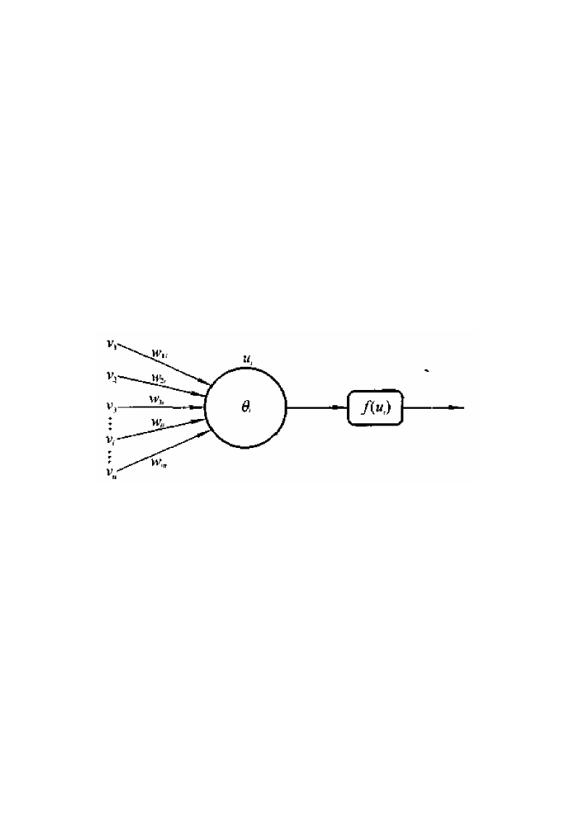

<!-- slide: 22 -->

## MP模型

- 函数f表达了神经元的输入输出特性。在MP模型中，f定义为阶跃函数：
- 如果把阈值θi看作为一个特殊的权值，则可改写为:
- 其中，w0i＝-θi，v0＝1

<!-- slide: 23 -->

## MP模型

- 为用连续型的函数表达神经元的非线性变换能力，常采用s型函数:
- MP模型在发表时并没有给出一个学习算法来调整神经元之间的连接权。但是，我们可以根据需要，采用一些常见的算法来调整神经元连接权，以达到学习目的。
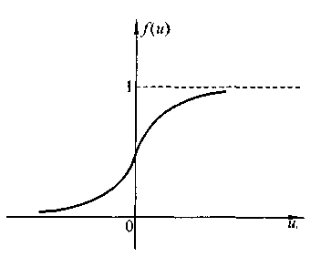

<!-- slide: 24 -->

## PDP模型

- Rumellhart，McClelland，Hinton提出的并行分布处理(Parallel Distributed Processing)模型是一个通用的神经网络模型。
  - 1）一组处理单元；
  - 2）处理单元的激活状态（ai）；
  - 3）每个处理单元的输出函数（fi）；
  - 4）处理单元之间的联接模式；
  - 5）传递规则（∑wijoi）；
  - 6）把处理单元的输入及当前状态结合起来产生激活值的激活规则（Fi）；
  - 7）通过经验修改联接强度的学习规则；
  - 8）系统运行的环境（样本集合）。

<!-- slide: 25 -->

## 人工神经网络拓扑

- 前向网络
- 神经元分层排列，分别组成输入层、中间层（隐层）和输出层。每一层神经元只接收来自前一层神经元的输出。
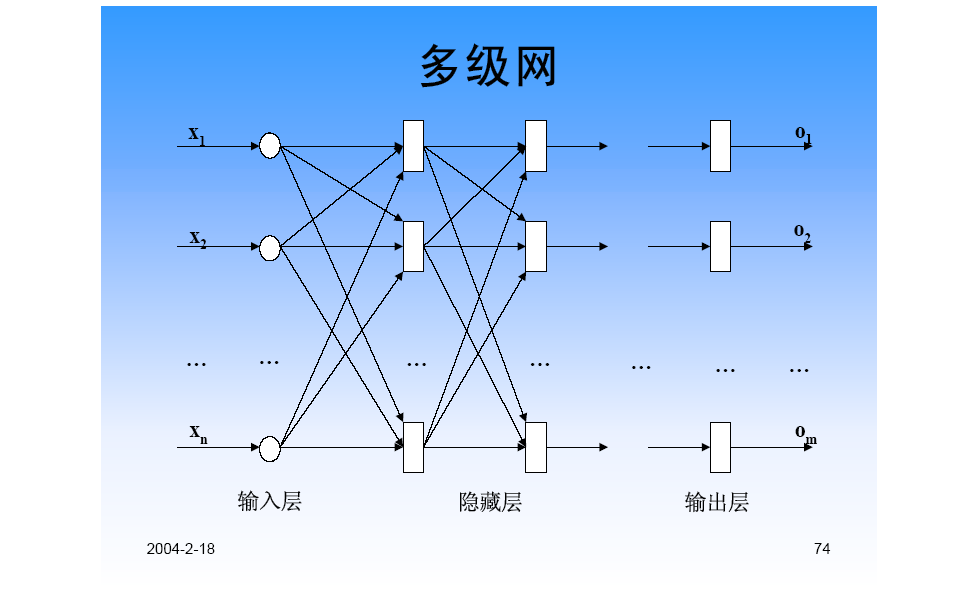

<!-- slide: 26 -->

## 从输出层到输入层有反馈的网络

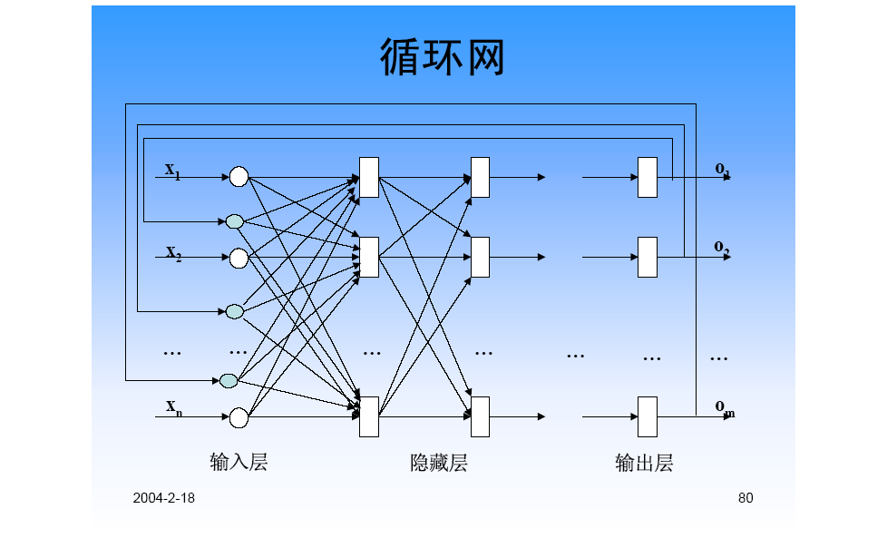

<!-- slide: 27 -->

## 层内有互连的网络

- 同层神经元之间有横向联系。所以同层神经元之间有相互作用，可以形成竞争。

<!-- slide: 28 -->

## 全互连网络

- 任意两个神经元之间都有可能相互连接。这种拓扑的人工神经网络很少见。因为这种系统太复杂了，是一个极度非线性的动力学系统。现有理论还缺乏对其稳定性的认识

<!-- slide: 29 -->

## 人工神经网络中的学习规则

- 学习是神经网络最重要的特征之一。
  - 神经网络能够通过训练（学习），改变其内部表示，使输入、输出变换向好的方向发展，这个过程称之为学习过程。
  - 神经网络按照一定的规则（学习/训练规则）自动调节神经元之间的连接权值或者拓扑结构，一直到网络实际输出满足期望的要求，或者趋于稳定为止。

<!-- slide: 30 -->

## 学习技术的分类

- 按照神经网络结构的变化来分，学习技术分为三种：权值修正、拓扑变化、权值与拓扑修正。其中应用权值修正学习技术的神经网络比较多,即。
- wij(t+1) = wij(t)+Δwij
- 按照确定性，学习可分为：确定性学习和随机性学习。
  - 例如梯度最快下降法是一种确定性权值修正方法。波尔兹曼机所用的模拟退火算法是一种随机性权值修正方法。
- 典型的权值修正方法有两类：相关学习和误差修正学习。
- 相关学习方法中常用的方法为Hebb学习规则。
  - 其思想最早在1949年由心理学家Hebb作为假设提出，并已经得到神经细胞学说的证实，所以人们称之为Hebb学习规则。
- 误差修正学习方法是另一类很重要的学习方法。
  - 最基本的误差修正学习方法被称为δ学习规则。

<!-- slide: 31 -->

## Hebb规则

- Hebb学习规则调整神经元间连接权值(wij)的原则为：
  - 若第i和第j个神经元同时处于兴奋状态，则它们之间的连接应当加强。
- 即：
- Δwij＝ηui(t)uj(t)
- 这一规则与“条件反射”学说一致，并已得到神经细胞学说的证实。 η是一个正常量，表示学习速率的比例常数,又称为学习因子。

<!-- slide: 32 -->

## δ规则

- δ学习规则调整神经元间连接权值(wij)的原则为：
  - 若某神经元的输出值与期望值不符，则根据期望值与实际值之间的差值来调整该神经元的权重。
  - 即：
- Δwij＝η[dj-yj(t)]xij(t)
- 这是一种梯度下降学习方法。

<!-- slide: 33 -->

## Widrow-Hoff规则

- 这是δ学习规则的一个特例，也称为最小均方误差(Least Mean Square)学习规则。
  - 其原则是使神经元的输出与期望输出之间的均方误差最小。即，
- Δwij＝[η/(| xij(t)|2)]εi(t)xij(t)
- εi(t)=dj-yj(t)

<!-- slide: 34 -->

## 竞争学习规则

- 这种学习规则的原则就是“胜者全盈”。
  - 如果在一层神经元中有一个对输入产生的相应最大，则该神经元即为胜者。然后只对连接到胜者的权值进行调整，使其更接近于对输入样本模式的估值。
  - 即，
- Δwij＝η[g(xj)-wij(t)]

<!-- slide: 35 -->

## 7.2 感知器

- 感知器是一种早期的神经网络模型，由美国学者F.Rosenblatt于1957年提出。感知器中第一次引入了学习的概念，使人脑所具备的学习功能在基于符号处理的数学到了一定程度的模拟，所以引起了广泛的关注。

<!-- slide: 36 -->

## 7.2.1 简单感知器

- 简单感知器模型实际上仍然是MP模型的结构，但是它通过采用监督学习来逐步增强模式划分的能力，达到所谓学习的目的。
- 其结构如下图所示
  - 感知器处理单元对n个输入进行加权和操作y即：
  - 其中，wi为第i个输入到处理单元的连接权值,θ为阈值, f取阶跃函数
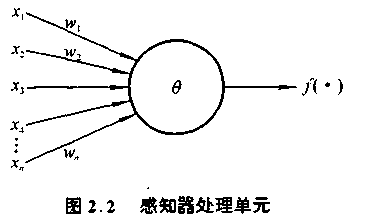

<!-- slide: 37 -->

## 感知器的运算能力

- 感知器在形式上与MP模型差不多，它们之间的区别在于神经元间连接权的变化。感知器的连接权定义为可变的，这样感知器就被赋予了学习的特性。利用简单感知器可以实现逻辑代数中的一些运算。
- Y=f(w1x1+w2x2-θ)
- (1)“与”运算
- 当取w1＝w2＝1，θ＝1.5时，上式完成逻辑“与”的运算。
- (2)“或”运算，
- 当取wl＝w2＝1， θ ＝0.5时，上式完成逻辑“或”的运算。
- (3)“非”运算，
- 当取wl=-1，w2＝0， θ ＝-1时,完成逻辑“非”的运算。
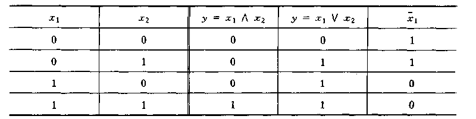

<!-- slide: 38 -->

## 感知器的几何意义

- 与许多代数方程一样，上式中不等式(阶跃函数)具有一定的几何意义。
  - 对于一个两输入的简单感知器，每个输入取值为0和1，如上面结出的逻辑运算，所有输入样本有四个，记为(x1，x2)：(0，0)，(0，1)，(1，0)，(1，1)，构成了样本输入空间。
  - 例如，在二维平面上，对于“或”运算，各个样本的分布如下图所示。
  - 直线 1*x1+1*x2-0.5＝0 将二维平面分为两部分，上部为激发区(y=1，用★表示)，下部为抑制区(y＝0，用☆表示)。
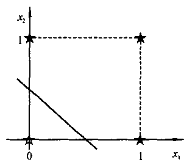

<!-- slide: 39 -->

## 感知器的学习

- 简单感知器中的学习算法是δ学习规则。其具体过程如下：
  - (1)选择一组初始权值wi(0)。
  - (2)计算某一输入模式对应的实际输出与期望输出的误差δ
  - (3)如果δ小于给定值，结束，否则继续。
  - (4)更新权值(阈值可视为输入恒为1的一个权值)：
  - Δwi(t+1)＝ wi(t+1)- wi(t)=η[d-y(t)]xi(t)
  - 式中η为在区间(0，1)上的一个常数，称为学习步长，它的取值与训练速度和w收敛的稳定性有关；d、y为神经元的期望输出和实际输出；xi为神经元的第i个输入。
- (5)返回(2)，重复，直到对所有训练样本模式，网络输出均能满足要求。

<!-- slide: 40 -->

## 感知器的学习过程

<!-- slide: 41 -->

## 简单感知器的致命缺陷

- 不能解决线性不可分问题。
- 线性不可分问题就是无法用一个平面（直线）把超空间（二维平面）中的点正确划分为两部分的问题。
- 感知器对线性不可分问题的局限性决定了它只有较差的归纳性，而且通常需要较长的离线学习才能达到收效。

<!-- slide: 42 -->

## 7.2.2 多层感知器

- 线性不可分问题的克服
  - 用多个单级网组合在一起，并用其中的一个去综合其它单级网的结果，我们就可以构成一个两级网络，该网络可以被用来在平面上划分出一个封闭或者开放的凸域来。
  - 一个非凸域可以拆分成多个凸域。按照这一思路，三级网将会更一般一些，我们可以用它去识别出一些非凸域来

<!-- slide: 43 -->

## 多层感知器

- 在输入和输出层间加上一层或多层的神经元(隐层神经元)，就可构成多层前向网络，这里称为多层感知器。
  - 这里需指出的是：多层感知器只允许调节一层的连接权。这是因为按感知器的概念，无法给出一个有效的多层感知器学习算法。
- 上述三层感知器中，有两层连接权，输入层与隐层单元间的权值是随机设置的固定值，不被调节；输出层与隐层间的连接权是可调节的。

<!-- slide: 44 -->

## 用多层感知器解决异或问题

- 对于上面述及的异或问题，用一个简单的二层感知器就可得到解决
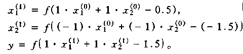

<!-- slide: 45 -->

## 多层感知器的能力

- 可以证明，只要隐层和隐层单元数足够多，多层感知器网络可实现任何模式分类。
  - 1962年，Rosenblatt宣布：人工神经网络可以学会它能表示的任何东西
- 感知器收敛定理
  - 对于一个N个输入的感知器，如果样本输入函数是线性可分的，那么对任意给定的一个输入样本x，要么属于某一区域F+，要么不属于这一区域，记为F-。F+，F-两类样本构成了整个线性可分样本空间。
- [定理]
  - 如果样本输入函数是线性可分的，那么感知器学习算法经过有限次迭代后，可收敛到正确的权值或权向量。
- [定理]
  - 假定隐含层单元可以根据需要自由设置，那么用双隐层的感知器可以实现任意的二值逻辑函数。

<!-- slide: 46 -->

## 感知器结构与决策区域类型

- 可在数据空间中划分出任意形状（复杂度由隐层单元数目决定）
- 可在数据空间中划分出开凸区域或者闭凸域区
- 有一个超平面把数据空间划分成两部分
- 区域形状
- 决策区域类型
- 网络结构

<!-- slide: 47 -->

## 多层感知器的问题

- 多层网络的权值如何确定，即网络如何进行学习，在感知器上没有得到解决。
  - 当年Minsky等人就是因为对于非线性空间的多层感知器学习算法未能得到解决，使其对神经网络的研究作出悲观的结论。

<!-- slide: 48 -->

## 7.3 前馈神经网络

- 7.3.1 反向传播算法
- BP算法的提出：
  - UCSD PDP小组的Rumelhart、Hinton和Williams1986年独立地给出了BP算法清楚而简单的描述
  - 1982年，Paker就完成了相似的工作1974年，
  - Werbos已提出了该方法
- 优点：广泛的适应性和有效性。
- 弱点：训练速度非常慢、局部极小点的逃离问题、算法不一定收敛到全局最小点。

<!-- slide: 49 -->

## 基本BP算法

  - 网络拓扑与多层感知器一样。一般为3层。
  - 神经元的网络输入：
  - netj=x1jw1j+x2jw2j+…+xnjwnj
  - 神经元的输出：
  - o=f(net)=1/(1+exp(-net))
  - f`(net)= exp(-net)/(1+exp(-net))2
  - =o-o2=o(1-o)

<!-- slide: 50 -->

## BP算法中的激活函数

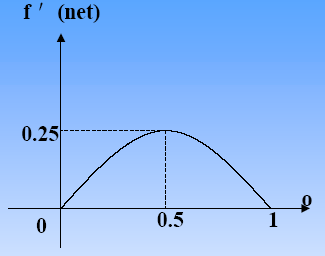
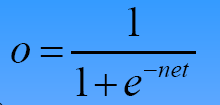
- 可以用其它的函数作为激活函数，只要该函数是处处可导的。

<!-- slide: 51 -->

## BP算法基本思想

- 样本集：S={(X1,Y1),(X2,Y2),…,(Xs,Ys)}
- 逐一地根据样本集中的样本(Xk,Yk)计算出实际输出Ok及其误差E1，然后对各层神经元的权值W(1)，W(2)，…，W(L)各做一次调整，重复这个循环，直到∑Ep<ε（所有样本的误差之和）。
- 用输出层的误差调整输出层权矩阵，并用此误差估计输出层的直接前导层的误差，再用输出层前导层误差估计更前一层的误差。如此获得所有其它各层的误差估计，并用这些估计实现对权矩阵的修改。形成将输出端表现出的误差沿着与输入信号相反的方向逐级向输入端传递的过程。

<!-- slide: 52 -->

## BP算法基本过程

- 样本：(输入向量，理想输出向量)
- 1、权初始化：“小随机数”与饱和状态；“不同”的权值保证网络可以学。
- 2、向前传播阶段：
- （1）从样本集中取一个样本(Xp，Yp)，将Xp输入网络；
- （2）计算相应的实际输出Op：Op=FL(…(F2(F1(XpW(1))W(2))…)W(L))
- 3、向后传播阶段——误差传播阶段：
- （1）计算实际输出Op与相应的理想输出Yp的差。
- （2）按极小化误差的方式调整权矩阵。
- （3）累计网络关于整个样本集的误差。
- 4、如果网络误差足够小，则停止训练。否则重复第2、3步。
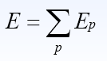

<!-- slide: 53 -->

## 基本BP算法的伪码

- 1 for k=1 to L do
- 1.1 初始化W(k)；
- 2 初始化精度控制参数ε；
- 3 E=ε+1;
- 4 while E>εdo
- 4.1 E=0;
- 4.2 对S中的每一个样本（Xp,Yp）：
- 4.2.1 计算出Xp对应的实际输出Op；
- 4.2.2 计算出Ep；
- 4.2.3 E=E+Ep；
- 4.2.4 根据相应式子调整W(L)；
- 4.2.5 k=L-1；
- 4.2.6 while k≠0 do
- 4.2.6.1 根据相应式子调整W(k)；
- 4.2.6.2 k=k-1
- 4.3 E=E/2.0

<!-- slide: 54 -->

## 输出层权值的调整

- BP算法应用的不是基本的δ学习，而是一种扩展的δ学习规则。但是对于所有的δ学习规则而言，某神经元的权值修正量都正比于该神经元的输出误差和输入。
- BP算法输出层对误差调整为f’(net)(y-o)。

<!-- slide: 55 -->

## 隐藏层权的调整

- δpk-1的值和δ1k，δ2k，…，δmk有关。
- 不妨认为第k-1层产生的误差通过连接权传递到了第k层神经元上 。
- 即，认为δpk-1
- 通过权wp1对δ1k做出贡献，
- 通过权wp2对δ2k做出贡献，
- ……
- 通过权wpm对δmk做出贡献。

<!-- slide: 56 -->

## BP算法的理论解释

- 该算法中δ学习规则的实质是利用梯度最速下降法，使权值沿误差函数的负梯度方向改变。
- 误差测度方法：
  - 用理想输出与实际输出的方差作为相应的误差测度：
  - E=∑Ep

<!-- slide: 57 -->

## 最速下降法

- 最速下降法，要求E的极小点
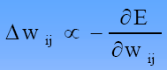
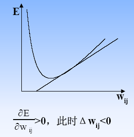
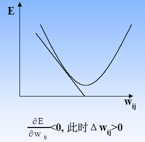

<!-- slide: 58 -->

<!-- slide: 59 -->

## 输出层权值调整量

<!-- slide: 60 -->

## 隐层（第K-1层）权值调整量

<!-- slide: 61 -->

## 隐层（第K-1层）权值调整量

<!-- slide: 62 -->

## 7.3.2 BP算法中的问题

- 收敛速度问题
  - 收敛速度很慢，其训练需要很多步迭代。
  - 一种改进思路是加入惯性项
- 局部极小点问题
  - 逃离/避开局部极小点：修改W、V的初值——并不是总有效。
  - 逃离——统计方法；[Wasserman，1986]将Cauchy训练与BP算法结合起来，可以在保证训练速度不被降低的情况下，找到全局极小点。
- 学习步长问题
  - 自适应步长
