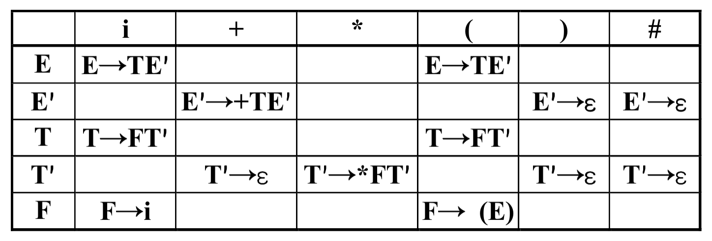
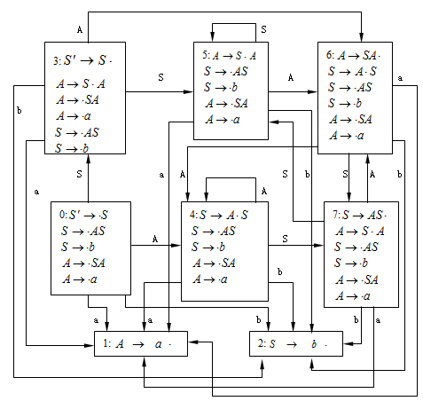
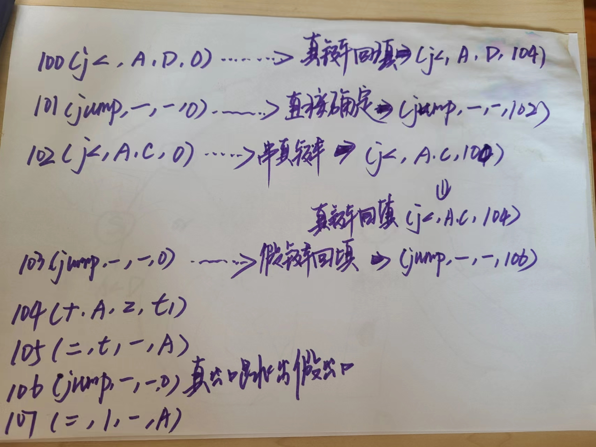
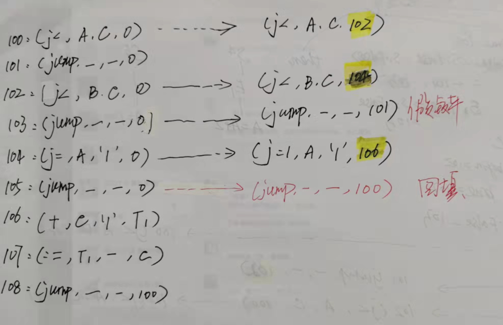

# 复习课 2025

<!-- slide: 1 -->

## 编译原理

- *
- 2025.06

> 备注：第38讲  习题课(1)

<!-- slide: 2 -->

## 第一章 编译程序概论小结

- 内容：
  - 什么是编译程序
  - 编译的各个阶段
  - 为什么要学习编译程序
- 重点是对编译程序的功能和结构有总体认识，理解编译程序各个阶段的逻辑关系以及他们怎样作为一个整体完成编译任务

<!-- slide: 3 -->

## 第三章  文法和语言

- 学习目标:
- 掌握：自上而下与自下而上的分析方法, 构建语法树，规范推导，规范规约
- 理解：文法的形式定义，推导，归约，句型，句子，语言，上下文无关文法，规范句型，语法树，短语，直接短语，句柄
- 了解：文法的类型，文法实用中的限制，文法的二义性

<!-- slide: 4 -->

- *
- 程序语言的定义
- 高级语言的一般特性
- 程序语言的语法描述

<!-- slide: 5 -->

## 上下文无关文法

- *
- 一个上下文无关文法G是一个四元式
- G=(VT，VN，S，P)，其中
  - VT：终结符集合(非空)
  - VN：非终结符集合(非空)，且VT  VN=
  - S：文法的开始符号，SVN
  - P：产生式集合(有限)，每个产生式形式为
    - P， PVN，   (VT  VN)*
  - 开始符S至少必须在某个产生式的左部出现一次

<!-- slide: 6 -->

## 上下文无关文法

- *
- 定义：称A直接推出，即
  - A
  - 仅当A  是一个产生式，
  - 且，  (VT  VN)* 。
- 如果1  2   n，则我们称这个序列是从1到n的一个推导。若存在一个从1到n的推导，则称1可以推导出n

> 备注：一个上下文无关文法如何确定一个语言?
中心思想:从文法的开始符号出发,反复连续使用产生式,对非终结符施行替换和展开.(把产生式的左部符号替换为右部符号串)

从一个句型到另一个句型的推导往往不唯一.

<!-- slide: 7 -->

## 上下文无关文法

- *
- 定义：假定G是一个文法，S 是它的开始符号。如果            ，则称是一个句型。
- 仅含终结符号的句型是一个句子。
- 文法G所产生的句子的全体是一个语言，将它记为 L(G)。

<!-- slide: 8 -->

## 如何写出产生特定语言的文法

- *
- 分析语言的特点
- 分解成层次结构
- 根据结构写出文法

<!-- slide: 9 -->

## 写一个文法，使其语言是奇数集，且每个奇数不以0开头。

- *
- G(S):
  - S  O | A O
  - O  1 | 3 | 5 | 7 | 9　奇数
  - N  O | 2 | 4 | 6 | 8　非零数
  - D  0 | N　可包含零
  - A  A D | N　不以零开头的数
- 非0开头数字串
- 奇数数字

<!-- slide: 10 -->

## 给出下面语言的相应文法

- *
- L1={anbn ci | n1，i0}
- 解答：G(S):
  - S → A C
  - A → a A b | ab
  - C → c C | 
- L4={1n 0m 1m 0n | n，m0}
- 解答：G(S):
  - S → 1 S 0 | B | 
  - B → 0 B 1 | 

<!-- slide: 11 -->

## 第四章  词法分析

- 学习目标:
- 掌握：词法分析程序的构造，正规式和正规文法到有穷自动机的转换，NFA到DFA的转换、DFA的化简
- 理解：正规文法、正规式、DFA的概念、NFA的概念
- 了解：词法分析程序的自动构造工具

<!-- slide: 12 -->

- *
- 对于词法分析器的要求
- 词法分析器的设计
- 正规表达式与有限自动机
- 词法分析器的自动产生--LEX

<!-- slide: 13 -->

## 关系图

- *
- FA
- 正规集
- 正规式
- DFA
- NFA
- curState = 初态
- GetChar();
- while( stateTrans[curState][ch]有定义){
- //存在后继状态，读入、拼接
- Concat();
- //转换入下一状态，读入下一字符   curState= stateTrans[curState][ch];
- if cur_state是终态 then 返回strToken中的单词
- GetChar( );
- }
- DIM,IF, DO,STOP,END
- number, name, age
- 125, 2169
- …
- DIM
- IF
- DO
- STOP
- END
- letter(letter|digit)*
- digit(digit)*
- 易于人工设计
- DFA
- 正规文法

> 备注：这些概念都是抽象思维的工具，可根据问题进行选择

<!-- slide: 14 -->

## 要点

- *
- 几个转换算法
  - 正规式 ⇔ NFA
  - NFA  DFA
  - DFA化简算法

<!-- slide: 15 -->

## 构造下列正规式相应的DFA		1(0 | 1)*101

- *
- 思路：正规式NFA DFA
- X
- Y
- 1 ( 0 | 1)* 1 0 1
- X
- 1
- 2
- 3
- 4
- Y
- 5
- 1
- 
- 
- 1
- 0
- 1
- 1
- 0

<!-- slide: 16 -->

## 确定化的过程

- *
- 不失一般性，设字母表只包含两个 a 和b，我们构造一张表:
- {...}
- {...}
- {...}
- {...}
- {...}
- {...}
- {...}
- {...}
- e-Closure({X})
- Ia
- Ib
- I
- 首先，置第1行第1列为-closure({X})求出这一列的Ia，Ib；
- 然后，检查这两个Ia，Ib，看它们是否已在表中的第一列中出现，把未曾出现的填入后面的空行的第1列上，求出每行第2，3列上的集合...
- 重复上述过程，直到所有第2，3列子集全部出现在第一列为止

<!-- slide: 17 -->

## 确定化

- *

|  | 0 | 1 |
|---|---|---|
| {X} |  | {1,2,3} |
|  |  |  |
| {1,2,3} | {2,3} | {2,3,4} |
| {2,3} | {2,3} | {2,3,4} |
| {2,3,4} | {2,3,5} | {2,3,4} |
| {2,3,5} | {2,3} | {2,3,4,Y} |
| {2,3,4,Y} | {2,3,5} | {2,3,4,} |

- X
- 1
- 2
- 3
- 4
- Y
- 5
- 1
- 
- 
- 1
- 0
- 1
- 1
- 0

<!-- slide: 18 -->

## 确定化

- *

|  | 0 | 1 |
|---|---|---|
| {X} |  | {1,2,3} |
|  |  |  |
| {1,2,3} | {2,3} | {2,3,4} |
| {2,3} | {2,3} | {2,3,4} |
| {2,3,4} | {2,3,5} | {2,3,4} |
| {2,3,5} | {2,3} | {2,3,4,Y} |
| {2,3,4,Y} | {2,3,5} | {2,3,4,} |

- 6
- 0
- 1
- 2
- 3
- 5
- 4
- 1
- 0
- 0
- 0
- 0
- 0
- 0
- 1
- 1
- 1
- 1
- 1
- 0
- 1

<!-- slide: 19 -->

## 最小化：对状态集进行划分

- *
- 首先，把S划分为终态和非终态两个子集，形成基本划分。
- 假定到某个时候，已含m个子集，记为={I(1)，I(2)，，I(m)}，检查中的每个子集看是否能进一步划分：
  - 对某个I(i)，令I(i)={s1,s2, ,sk}，若存在一个输入字符a使得Ia(i) 不会包含在现行的某个子集I(j)中，则至少应把I(i)分为两个部分。

> 备注：序号   大写   小写    英文注音   中文读音
1         Α         α         alpha         阿尔法
2         Β         β         beta         贝塔
3         Γ         γ         gamma         伽马
4         Δ         δ         delta         德尔塔
5         Ε         ε         epsilon         伊普西龙
6         Ζ         ζ         zeta         截塔
7         Η         η         eta         艾塔
8         Θ         θ         theta        西塔
9         Ι         ι         iota        约塔
10         Κ         κ         kappa         卡帕
11         Λ         λ         lambda         兰布达
12         Μ         μ         mu         缪
13         Ν         ν         nu         纽
14         Ξ         ξ         xi         克西
15         Ο         ο         omicron         奥密克戎
16         Π         π         pi         派
17         Ρ         ρ         rho         肉
18         Σ         σ         sigma         西格马
19         Τ         τ         tau         套
20         Υ         υ         upsilon         宇普西龙
21         Φ         φ         phi         佛爱
22         Χ         χ         chi         西
23         Ψ         ψ         psi         普西
24         Ω         ω         omega         欧米伽

<!-- slide: 20 -->

## 最小化

- *
- 6
- 0
- 1
- 3
- 5
- 4
- 1
- 0
- 0
- 0
- 0
- 0
- 1
- 1
- 1
- 1
- 0
- 1
- 6
- 0
- 1
- 2
- 3
- 5
- 4
- 1
- 0
- 0
- 0
- 0
- 0
- 0
- 1
- 1
- 1
- 1
- 1
- 0
- 1

<!-- slide: 21 -->

## 构造一个DFA，它接受＝{0,1}上所有满足如下条件的字符串：每个1都有0直接跟在右边。

- *
- 思路
  - 分析语言特点
    - 01000101000010
  - 写出正规式
    - ( 0 | 10)*
  - 正规式  NFA  DFA
- ( 0 | 10)*
- Y
- X
- 1
- 0
- 1
- 1
- 2
- 0
- 0
- 0
- 1

<!-- slide: 22 -->

## 小结

- *
- 文法与语言
- 正规式 vs. NFA vs. DFA

<!-- slide: 23 -->

## 第四章  语法分析—自上而下分析

- *
- 自上而下分析面临的问题
  - 文法的左递归性
  - 回溯
- 构造不带回溯的自上而下分析算法
  - 消除文法的左递归的方法
  - 提取左公共因子，克服回溯
- LL(1)文法的条件
  - FIRST、FOLLOW、SELECT集合
- LL(1)分析法
  - 递归下降分析程序
  - 预测分析程序

<!-- slide: 24 -->

- *
- 语法分析器的功能
- 自上而下分析面临的问题
- LL(1)分析法
- 递归下降分析程序构造
- 预测分析程序

<!-- slide: 25 -->

## 语法分析的方法

- *
- 自上而下分析法(Top-down)
  - 基本思想
    - 它从文法的开始符号出发，反复使用各种产生式，寻找"匹配"的推导
  - 递归下降分析法
    - 对每一语法变量(非终结符)构造一个相应的子程序，每个子程序识别一定的语法单位
    - 通过子程序间的相互调用实现对输入串的识别
  - 预测分析程序
    - 非递归实现
    - 直观、简单

<!-- slide: 26 -->

## 考虑下面文法G1(S)：		S → a |  | (T)		T → T, S | S(1) 消去G1的左递归。然后，对每个非终结符，写出不带回溯的递归子程序。(2) 经改写后的文法是否是LL（1）的？给出它的预测分析表。

- *
- 思路
  - 消除左递归
  - 提取左公共因子
  - 计算非终结符的FIRST集合和FOLLOW集合
  - 检查LL(1)条件
  - 构造预测分析表或递归子程序

<!-- slide: 27 -->

## G1(S)： S → a |  | (T)T → T, S | S

- *
- 消除左递归：按照T,S的顺序消除左递归
- G’1(S)：
  - S → a |  | (T)
  - T → S T’
  - T’ → , S T’ | 
- 无左公共因子

<!-- slide: 28 -->

## LL(1)文法的判别

- 要判别一个上下文无关文法是否是LL(1)文法
- 分为五步：
- 1.  求能推出ε的非终结符集
- 2.  计算每个产生式右部α的FIRST(α)集
- 3.  计算每个非终结符A的FOLLOW(A)集
- 4.  计算每个产生式A→α的SELECT(A→α)集
- 5.  按LL(1)文法的定义判别

<!-- slide: 29 -->

## G’1(S)：S → a |  | (T)T → S T’T’ → , S T’ | 

- *
- 1. 求能推出ε的非终结符集
- {T’ } 收敛
- 第一次
- 初值
- 非终结符集S
- {T’ }

<!-- slide: 30 -->

## 2.  计算每个产生式右部α的FIRST(α)集

- 对每一文法符号X (X VT VN)，求FIRST(X)。
- 利用求出每个文法符号的FIRST集求符号串α的FIRST集。

<!-- slide: 31 -->

## G’1(S)：S → a |  | (T)T → S T’T’ → , S T’ | 

- *

|  | First集(0)  | First集(1)  | First集(2) | First集(3)  |
|---|---|---|---|---|
| S |  | a   ( | a   (  | a   ( |
| T |  |  | a   ( | a   ( |
| T‘ |  | , | , | , |

<!-- slide: 32 -->

## G’1(S)：S → a |  | (T)T → S T’T’ → , S T’ | 

- *
- 非终结符的FIRST集合
  - FIRST(S)={a, ^, (}
  - FIRST(T)={a, ^, (}
  - FIRST(T’)={ , ,  }
- 产生式右部符号串的开始符集合为:
- S → a                      FIRST(a)={a}
- S →                       FIRST()={}S → (T)                    FIRST((T))={(}T → S T’                   FIRST(ST’) = FIRST(S)={a, ^, (}T’ → , S T’                FIRST(, S T’)={,}
- T’ →                        FIRST() = {}

<!-- slide: 33 -->

## G’1(S)：S → a |  | (T)T → S T’T’ → , S T’ | 

- *
- 非终结符的FIRST集合
  - FIRST(S)={a, ^, (}
  - FIRST(T)={a, ^, (}
  - FIRST(T’)={ , ,  }
- 3. 计算每个非终结符的FOLLOW集合

|  | Follow集(0)  | Follow集(1)  | Follow集(2) | Follow集(3)  |
|---|---|---|---|---|
| S | # | # | # ， ）  | #，） |
| T |  | ） | ） | ） |
| T‘ |  |  | ） | ） |

<!-- slide: 34 -->

## 4．计算每个产生式A→α的SELECT(A→α)集

- 按定义计算SELECT(A→α)：
- 若α≠>*ε，则
- SELECT(A→α)=FIRST(α)
- 若α=>*ε，则
- SELECT(A→α)=
- (FIRST(α)-{ε})∪FOLLOW(A)

<!-- slide: 35 -->

## G’1(S)：S → a |  | (T)T → S T’T’ → , S T’ | 

- *
- 产生式的Select集合为:
- Select（S → a）= FIRST(a)={a}
- Select（ S →  ）= FIRST()={}Select（ S → (T)）= FIRST((T))={(}Select（ T → S T’）= FIRST(ST’) {a, ^, (}Select（ T’ → , S T’ ）=FIRST(, S T’)={,}
- Select（T’ →  ) = Follow{T’ }={)}

<!-- slide: 36 -->

- *
- 构造预测分析表

|  | a |  | （ | ） | ， | # |
|---|---|---|---|---|---|---|
| S | S → a | S →  | S → (T) |  |  |  |
| T | T → S T’ | T → S T’ | T → S T’ |  |  |  |
| T’ |  |  |  | T’ →  | T’ → , S T’ |  |

- 产生式的Select集合为:
- Select（S → a）= FIRST(a)={a}
- Select（ S →  ）= FIRST()={}Select（ S → (T)）= FIRST((T))={(}Select（ T → S T’）= FIRST(ST’) {a, ^, (}Select（ T’ → , S T’ ）=FIRST(, S T’)={,}
- Select（T’ →  ) = Follow{T’ }={)}

<!-- slide: 37 -->

- *
- 对于文法G(E)
  - E→TE
  - E→+TE | 
  - T→FT
  - T→*FT | 
  - F→(E) | i
- 输入串为i1*i2+i3，利用分析表进行预测分析

<!-- slide: 38 -->

- *
- 步骤		符号栈	输入串	所用产生式
- 0			#E		i1*i2+i3#
- 1			#ET		i1*i2+i3#   E→TE
- 2			#ETF	i1*i2+i3#   T→FT
- 3			#ETi	i1*i2+i3# 	 F→i

<!-- slide: 39 -->

- *
- 步骤		符号栈	输入串	所用产生式
- 3			#ETi	i1*i2+i3# 	   F→i
- 4			#ET	*i2+i3#　　匹配i1
- 5			#ETF*	*i2+i3#	   T→*FT
- 6			#ETF       i2+i3#　　匹配*
- 7			#ETi	i2+i3#         F→i

<!-- slide: 40 -->

- *
- 步骤		符号栈	输入串	所用产生
- 7			#ETi	i2+i3#         F→i
- 8			#ET	+i3#　　　匹配i2
- 9			#E		+i3#		   T→
- 10			#ET+	+i3#		   E→+TE
- 11			#ET		i3#.            匹配+

<!-- slide: 41 -->

- *
- 步骤		符号栈	输入串	所用产生
- 11			#ET		i3#
- 12			#ETF    	i3#          T→FT
- 13			#ETi	i3#          F→i
- 14			#ET	#.             匹配i3
- 15			#E		#          	 T→
- 16			#		#          	 E→

<!-- slide: 42 -->

## 第五章 语法分析——自下而上分析

- 学习目标：
- 掌握：LR（0）分析，SLR（1）分析
- 理解：活前缀，可归前缀
- 了解：LR(1)、LALR(1)分析思想

<!-- slide: 43 -->

- *
- 自下而上分析的基本问题
- 算符优先分析算法
- LR分析法

<!-- slide: 44 -->

## 语法分析的方法

- *
- 自下而上分析法(Bottom-up)
  - 基本思想
    - 从输入串开始，逐步进行归约，直到文法的开始符号
    - 归约：根据文法的产生式规则，把产生式的右部替换成左部符号
    - 从树末端开始，构造语法树
  - 算符优先分析法
    - 按照算符的优先关系和结合性质进行语法分析
    - 适合分析表达式
  - LR分析法
    - 规范归约

<!-- slide: 45 -->

## 短语、直接短语和句柄

- *
- 在一个句型对应的语法树中
  - 以某非终结符为根的两代以上的子树的所有末端结点从左到右排列就是相对于该非终结符的一个短语
  - 如果子树只有两代，则该短语就是直接短语
- E
- F
- F
- T
- T
- T
- i1
- +
- *
- E
- F
- i3
- i2

<!-- slide: 46 -->

## 令文法G1为：             E→E+T | T             T→T*F | F             F→(E) | i证明E+T*F是它的一个句型，指出这个句型的所有短语，直接短语和句柄。

- *
- 短语:  E+T*F, T*F
- 直接短语: T*F
- 句柄: T*F
- E
- F
- T
- T
- +
- *
- E

<!-- slide: 47 -->

## 考虑文法			S→AS | b			A→SA | a(1) 列出这个文法的所有LR(0)项目。(2) 构造这个文法的LR(0)项目集规范族及识别活前缀的DFA。(3) 这个文法是SLR的吗？若是，构造出它的SLR分析表。

- *

<!-- slide: 48 -->

## 考虑文法			S→AS | b			A→SA | a(1) 列出这个文法的所有LR（0）项目。

- *
- 对文法进行拓广: S’→ S
- LR（0）项目:
- 0.  S’→ .S         1.  S’→ S.           2.  S → .AS
- 3.  S → A.S         4.  S → AS.           5.  S → .b
- 6.  S → b.            7.  A→ .SA            8.  A → S.A
- 9.  A→ SA.          10.  A → .a            11.  A→ a.

<!-- slide: 49 -->

## 考虑文法			S→AS | b			A→SA | a(1) 列出这个文法的所有LR（0）项目。(2) 构造这个文法的LR（0）项目集规范族及识别活前缀的DFA。

- *

<!-- slide: 50 -->

## 识别活前缀的DFA

- *
- S                             A
- e
- S
- e
- e
- e
- e
- a
- e
- e
- e
- A                         S
- e
- e
- b
- 0
- 10
- 5
- 7
- 6
- 1
- 11
- 2
- 3
- 4
- 8
- 9
- 构造LR(0)项目规范族：
  - 利用有限自动机来构造

<!-- slide: 51 -->

## 确定化

- *

<!-- slide: 52 -->

## 利用函数CLOSURE和GO来构造项目集规范族

- *
- I0   = {  S’→ .S ,  S → .AS ,  S → .b ,  A→ .SA ,  A→. a  }
- GO(I0  , a)= {  A→ a.  }= I1
- GO(I0  , b)= {  S → b. }= I2
- GO(I0  , S)= {  S’→ S. ,  A → S.A ,  A→ .SA ,  A→. a ,  S → .AS ,
- S → .b  }= I3
- GO(I0  , A)={  S → A.S ,  S → .AS , S → .b ,  A → .AS ,  A→ .a  }= I4
- GO(I3 , a)= {  A→ a.  }= I1
- GO(I3  , b)= {  A→ b.  }= I2
- GO(I3 , S)= {  A → S.A , A→ .SA ,  A→ .a  ， S → .AS ,  S → .b }= I5
- GO(I3  , A)={  A→ SA. , A→S .A ，A → S.A ,  S → .AS ,  S → .b ,,
- A→ .a  }= I6

<!-- slide: 53 -->

- *
- GO(I4  , a)= {  A→ a.  }= I1
- GO(I4  , b)= {  S → b. }= I2
- GO(I4  , S)= {  S → AS. ,  A → S.A ,  S→ .AS ,  S→. b ,  A → .AS , A → . a  }= I7
- GO(I4  , A)={  S → A.S ,  S → .AS ,  S → .b ,  A → .AS ,  A→ .a  }= I4
- GO(I5 ,  a)= {  A→ a.  }= I1
- GO(I5  , b)= {  A→ b.  }= I2
- GO(I5 ,  S)= {  A → S.A ,  S → .AS ,  S → . b ,  A→ .SA ,  A→ . a  }= I5
- GO(I5  , A)={  A→ SA. , A → S.A ,  S → .AS ,  S → .b ,  A→ .SA ,  A→ .a  }= I6

<!-- slide: 54 -->

- *
- GO(I7 ,  a)= {  A→ a.  }= I1
- GO(I7  , b)= {  A→ b.  }= I2
- GO(I7 , S)= {  A → S.A ,  S → .AS ,  S → . b ,  A→ .SA ,  A→ . a  }= I5
- GO(I7  , A)={  A→ SA. , A → S.A ,  S → .AS ,  S → .b ,  A→ .SA ,  A→ .a  }= I6
- 项目集规范族为C={I0 , I1  , I2  ,  I3  ,  I4  ,  I5  ,  I6  ,  I7  }
- GO(I6  , a)= {  A→ a.  }= I1
- GO(I6  , b)= {  S → b. }= I2
- GO(I6  , S)= {  S → AS. ,  A → S.A ,  S→ .AS ,  S→. b ,  A → .AS ,  A → . a  }= I7
- GO(I6  , A)={  S → A.S ,  S → .AS ,  S → .b ,  A → .AS ,  A→ .a  }= I4

<!-- slide: 55 -->

## 考虑文法			S→AS | b			A→SA | a(1) 列出这个文法的所有LR（0）项目。(2) 构造这个文法的LR（0）项目集规范族及识别活前缀的DFA。(3) 这个文法是SLR的吗？若是，构造出它的SLR分析表。

- *

<!-- slide: 56 -->

## SLR文法判断

- *
- 状态3，6，7有移进归约冲突
- I3  = { S’→ S. , A → S.A , A→ .SA , A→ .a ,  S → .AS,  S → .b}
  - FOLLOW(S’)={#}不包含a,b ；冲突可以消解
- I6 = { A→ SA . , A → S.A , S → .AS , S → .b , A→ .SA , A→ .a}
  - FOLLOW(A)∩{a,b}={a,b} ≠Φ,  冲突无法消解
- I7  = { S → AS., A → S.A,  S→ .AS ,  S → .b , A → .AS, A→ .a}
  - FOLLOW(S)={#,a,b}, 冲突无法消解
- 所以不是SLR文法。

> 备注：(4) 构造例如LR(1)项目集规范族
见下图：
对于状态5，因为包含项目[]，所以遇到搜索符号a或b时，应该用归约。又因为状态5包含项目[]，所以遇到搜索符号a时，应该移进。因此存在“移进-归约”矛盾，所以这个文法不是LR(1)文法。

<!-- slide: 57 -->

## LR分析：

- 文法G(E)：
- (1) E→E＋T
  - (2) E→T
  - (3) T→T*F
  - (4) T→F
  - (5) F→(E)
  - (6) F→I
  - 输入串为i*i+i， 给出LR分析器的工作过:

<!-- slide: 58 -->

- 其LR分析表为:

<!-- slide: 59 -->

  - 步骤	状态		符号		输入串
  - (1)	0		#		i*i+i#
  - (2)	05		#i		*i+i#　　F->i
  - (3)	03		#F		*i+i#　　F->T
  - (4)	02		#T		*i+i#
  - (5)	027		#T*		i+i#
- T
- i
- F
- *

<!-- slide: 60 -->

  - 步骤	状态		符号		输入串
  - (5)	027		#T*		i+i#
  - (6)	0275		#T*i		+i#　　F->i
  - (7)	02710	#T*F		+i#　　T->T*F
  - (8)	02		#T		+i#　　E->T
  - (9)	01		#E		+i#
  - (10)	016		#E+		i#
- +
- i
- T
- F
- *
- T
- F
- i
- E

<!-- slide: 61 -->

  - 步骤	状态		符号		输入串
  - (10)	016		#E+		i#
  - (11)	0165		#E+i		#　　F->i
  - (12)	0163		#E+F		#　   Ｔ->F
  - (13)	0169		#E+T		#.    E->E+T
  - (14)	01		#E		#.       ACC
  - (15)     接受
- +
- i
- T
- F
- *
- T
- F
- i
- E
- i
- T
- F
- E

<!-- slide: 62 -->

## 小结

- *
- 自上而下分析
  - LL(1)分析条件
  - 递归下降分析程序
  - 预测分析程序
- 自下而上分析
  - 可归约串：句柄
  - LR分析

<!-- slide: 63 -->

## 第八章 语义分析和中间代码产生

- 本章小结
- 属性文法和语法制导翻译：
- 简单赋值语句的翻译
- 布尔表达式的翻译
- 控制结构的翻译
- 简单说明语句的翻译

<!-- slide: 64 -->

## 把下面的语句按照直接翻译翻译成四元式序列：	 not（a>b and c>d）or b<c

- *

<!-- slide: 65 -->

## not（a>b and c>d）or b<c

<!-- slide: 66 -->

## 把下面的语句翻译成四元式序列：	if A<D or A>C then A:=A+1                                else  A :=1;

- *

<!-- slide: 67 -->

## if A<D or A>C then A:=A+1                                else  A :=1;

<!-- slide: 68 -->

## 把下面的语句翻译成四元式序列：	if A<D or A>C then A:=A+1                                else  A :=1;

- *
- 100. (j<, A, D, 104)101. (j, -, -, 102)102. (j<, A, C, 104)103. (j, -, -, 106)104. (j=, A, ‘1’, T1)105. (j=, T1, -, A)106. (=, A, ‘1’, A)

<!-- slide: 69 -->

## 把下面的语句翻译成四元式序列：	while A < C and B < D do		if A=1 then C:=C+1

- *

<!-- slide: 70 -->

- 直接确定
- 直接确定
- 直接确定

<!-- slide: 71 -->

## 把下面的语句翻译成四元式序列：	while A < C and B < D do		if A=1 then C:=C+1

- *
- 100. (j<, A, C, 102)
- 101. (j, -, -, 0)
- 102. (j<, B, D, 104)
- 103. (j, -, -, 101)
- 104. (j=, A, ‘1’, 106)
- 105. (j, -, -, 100)
- 106. (+, C, ‘1’, T1)
- 107. (:=, T1, -, C)
- 108. (j, -, -, 100)

<!-- slide: 72 -->

## 第九章  运行时存储空间组织

- *
- 目标程序运行时的活动
- 运行时存储器的划分
- 静态存储管理
- 一个简单栈式存储分配
- 嵌套过程语言的栈式实现

<!-- slide: 73 -->

- 学习目标：
- 掌握：	参数传递的几种方式
- 理解：	静态存储分配、栈式动态存储分配、		          堆式动态存储分配的基本思想

<!-- slide: 74 -->

## 对于下面的程序：		procedure P(X,Y,Z);		begin			Y:=Y+1;			Z:=Z+X;		end P;		begin			A:=2;			B:=3;			P(A+B,A,A);			print A		end若参数传递的办法分别为（1）传名，（2）传地址，以及（4）传值，试问，程序执行时所输出的A分别是什么？

- *
- （1）传名	A = 9
- （2）传地址	A = 8
- （4）传值	A = 2

<!-- slide: 75 -->

## 第十章  优化

- *
- 学习目标：
- 掌握：基本块的划分、基本块的DAG优化
- 理解：什么是局部优化、循环优化、全局优化, 有哪些优化技术。
- 了解：循环优化技术

<!-- slide: 76 -->

## 试把以下程序划分为基本块并作出其程序流图。	read C	A: =0	B:=1L1:	A:=A+B	if BC goto L2	B:=B+1	goto L1L2:	write A	halt

- *

<!-- slide: 77 -->

- *
- read C	A: =0	B:=1L1:	A:=A+B	if BC goto L2	B:=B+1	goto L1L2:	write A	halt

<!-- slide: 78 -->

- *
- read C	A: =0	B:=1L1:	A:=A+B	if BC goto L2	B:=B+1	goto L1L2:	write A	halt
- 1.求出四元式程序中各个基本块的入口语句:
  - 1) 程序第一个语句，或
  - 2) 能由条件转移语句或无条件转移语句转移到的语句，或
  - 3) 紧跟在条件转移语句后面的语句

<!-- slide: 79 -->

- *
- read C	A: =0	B:=1L1:	A:=A+B	if BC goto L2	B:=B+1	goto L1L2:	write A	halt
- 1.求出四元式程序中各个基本块的入口语句:
  - 1) 程序第一个语句，或
  - 2) 能由条件转移语句或无条件转移语句转移到的语句，或
  - 3) 紧跟在条件转移语句后面的语句

<!-- slide: 80 -->

- *
- read C	A: =0	B:=1L1:	A:=A+B	if BC goto L2	B:=B+1	goto L1L2:	write A	halt
- 1.求出四元式程序中各个基本块的入口语句:
  - 1) 程序第一个语句，或
  - 2) 能由条件转移语句或无条件转移语句转移到的语句，或
  - 3) 紧跟在条件转移语句后面的语句

<!-- slide: 81 -->

- *
- read C	A: =0	B:=1L1:	A:=A+B	if BC goto L2	B:=B+1	goto L1L2:	write A	halt
- 1.求出四元式程序中各个基本块的入口语句:
  - 1) 程序第一个语句，或
  - 2) 能由条件转移语句或无条件转移语句转移到的语句，或
  - 3) 紧跟在条件转移语句后面的语句

<!-- slide: 82 -->

- *
- read C	A: =0	B:=1L1:	A:=A+B	if BC goto L2	B:=B+1	goto L1L2:	write A	halt
- B1
- B2
- B3
- B4
- 2. 对以上求出的每个入口语句，确定其所属的基本块。它是由该入口语句到下一入口语句(不包括该入口语句)、或到一转移语句(包括该转移语句)、或一停语句(包括该停语句)之间的语句序列组成的。
- B1
- B2
- B3
- B4

<!-- slide: 83 -->

## 试对以下基本块B1和B2：B1:	A:=B*C			B2:	B:=3	D:=B/C				D:=A+C	E:=A+D				E:=A*C	F:=2*E				G:=B*F	G:=B*C				H:=A+C	H:=G*G				I:=A*C	F:=H*G				J:=H+I	L:=F					K:=B*5	M:=L					L:=K+J						M:=L分别应用DAG对它们进行优化，并就以下两种情况分别写出优化后的四元式序列：（1）假设只有G、L、M在基本块后面还要被引用；（2）假设只有L在基本块后面还要被引用。

- *

<!-- slide: 84 -->

- *
- B1:	A:=B*C	D:=B/C	E:=A+D	F:=2*E	G:=B*C	H:=G*G	F:=H*G	L:=F
- M:=L
- n1
- n2
- n3
- n4
- n5
- n6
- n7
- n8
- n9
- 2
- B
- C
- *
- /
- A,G
- D
- +
- E
- *
- *
- H
- *
- F,L,M
- F
- 只有L在基本块后面还要被引用：
- G:=B*C
- H:= G*G
- L:=H*G
- 只有G,L,M在基本块后面还要被引用：
- G:=B*C
- H:=G*G
- L:=H*G
- M:=L

<!-- slide: 85 -->

- *
- B2:	B:=3
- D:=A+C
- E:=A*C
- G:=B*F
- H:=A+C
- I:=A*C
- J:=H+I
- K:=B*5
- L:=K+J
- M:=L
- n1
- 3
- B
- n2
- A
- n3
- C
- n4
- +
- D,H
- n5
- *
- E,I
- n6
- F
- n7
- *
- G
- n8
- +
- J
- n9
- 15
- n10
- +
- L, M
- 只有L在基本块后面还要被引用：
- D:=A+C
- E:=A*C
- J:=D+E
- L:=15+J
- 只有G,L,M在基本块后面还要被引用：
- G:=3*F
- D:=A+C
- E:=A*C
- J:=D+E
- L:=15+J
- M:=L

<!-- slide: 86 -->

## 对以下四元式程序，对其中循环进行循环优化。	I: =1	read J, KL:	A:=K*I	B:=J*I	C:=A*B	write  C	I:=I+1	if   I<100  goto   L	halt

- *
- I:=1
- read J,K
- L:  A:=K*I
- B:=J*I
- C:=A*B
- write C
- I:=I+1
- if I<100 goto L
- halt
- B1
- B2
- B3

<!-- slide: 87 -->

- *
- I:=1
- read J,K
- L:  A:=K*I
- B:=J*I
- C:=A*B
- write C
- I:=I+1
- if I<100 goto L
- halt
- B1
- B2
- B3
- A:=K*I
- B:=J*I
- L:  C:=A*B
- write C
- I:=I+1
- A:=A+K
- B:=B+J
- if I<100 goto L
- halt
- B2’
- B2
- B3
- I:=1
- read J,K
- B1

<!-- slide: 88 -->

- *
- A:=K*I
- B:=J*I
- L:  C:=A*B
- write C
- I:=I+1
- A:=A+K
- B:=B+J
- if I<100 goto L
- halt
- B2’
- B2
- B3
- I:=1
- read J,K
- B1
- A:=K*I
- B:=J*I
- T:=K*100
- L:  C:=A*B
- write C
- A:=A+K
- B:=B+J
- if A<T goto L
- halt
- B2’
- B2
- B3
- I:=1
- read J,K
- B1

<!-- slide: 89 -->

- *
- A:=K*I
- B:=J*I
- T:=K*100
- L:  C:=A*B
- write C
- A:=A+K
- B:=B+J
- if A<T goto L
- halt
- B2’
- B2
- B3
- I:=1
- read J,K
- B1
- I:=1
- read J,K
- L:  A:=K*I
- B:=J*I
- C:=A*B
- write C
- I:=I+1
- if I<100 goto L
- halt
- B1
- B2
- B3

<!-- slide: 90 -->

## 第十一章  代码生成

- *
- 基本问题
- 目标机器模型
- 一个简单代码生成器
- 掌握：基本块代码生成算法，寄存器分配算法
- 理解：待用信息，活跃信息

<!-- slide: 91 -->

## 求待用信息的实例

- 有如下基本块
- (1) T:=A-B
- (2) U:=A-C
- (3) V:=T+U
- (4) D:=V+U
- A, B, C, D是用户变量（在基本块出口活跃）
- T, U, V是临时变量（在基本块出口不活跃）
- 用“F”表示“非待用” “非活跃”，“L”表示“活跃”
- 则该基本块的待用信息及活跃信息的计算结果如下：

<!-- slide: 92 -->

- (F,F)
- (F,F)
- (F,L)
- D:=V+U
- 4
- (4,L)
- (F,F)
- (4,L)
- V:=T+U
- 3
- (F,L)
- (F,L)
- (3,L)
- U:=A-C
- 2
- (F,L)
- (2,L)
- (3,L)
- T:=A-B
- 1
- 右操作数
- 左操作数
- 结 果
- 四元式
- 序号
- 附加在四元式上的待用及活跃信息
- 符号表中的待用及活跃信息
- (F,F)
- (1,L)
- (1,L)
- (1)
- (F,F)
- (4,L)
- V
- (F,F)
- (3,L)
- (4,L)
- U
- (3,L)
- T
- (F,F)
- D
- (2,L)
- C
- B
- (2,L)
- (F,F)
- (F,F)
- (F,F)
- (F,L)
- (F,L)
- (F,L)
- (F,L)
- A
- (2)
- (3)
- (4)
- 初值
- 变量名

<!-- slide: 93 -->

## 对以下中间代码序列G：			T1:=B-C			T2:=A*T1			T3:=D+1			T4:=E-F			T5:=T3*T4			W:=T2/T5假设可用寄存器为R0和R1，W是基本块出口的活跃变量，用简单代码生成算法生成其目标代码，同时列出代码生成过程中的寄存器描述和地址描述。

- *

<!-- slide: 94 -->

## 假设只有R0和R1是可用寄存器，生成的目标代码和相应的RVALUE和AVALUE:

- *
- 中间代码	 目标代码	        RVALUE     AVALUE
- T1:=B－C
- T2:=A*T1
- T3:=D＋1
- T4:=E-F
- LD  R0，B
- SUB  R0，C
- R0含有T1
- T1在R0中
- LD  R1，A
- MUL  R1，R0
- R0含有T1
- R1含有T2
- T1在R0中
- T2在R1中
- LD  R0，D
- ADD  R0，1
- R0含有T3
- R1含有T2
- T3在R0中
- T2在R1中
- ST  R1，T2
- LD  R1，E
- SUB  R1，F
- R0含有T3
- R1含有T4
- T2在T2中
- T3在R0中
- T4在R1中

<!-- slide: 95 -->

- *
- 中间代码	 目标代码	        RVALUE     AVALUE
- T5:=T3*T4
- W:=T2/T5
- MUL  R0， R1
- R0含有T5
- R1含有T4
- T2在T2中
- T5在R0中
- T4在R1中
- LD  R1，T2
- DIV  R1，R0
- R0含有T5
- R1含有W
- T2在T2中
- T5在R0中
- W在R1中
- ST  R1，W
- 假设只有R0和R1是可用寄存器，生成的目标代码和相应的RVALUE和AVALUE:
