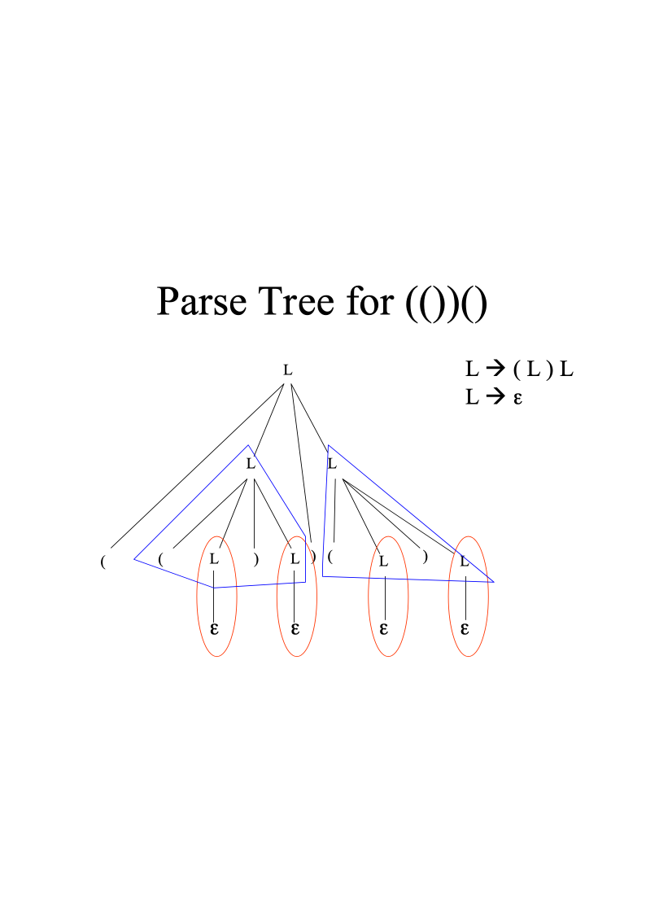

# 编译复习提纲

《编译原理》复习提纲

本门课程的重点是语法分析。它包含的内容广，基本概念和基本方法多。为了便于大家复习，现把内容归纳如下：
- 文法
  - 文法定义        G=(VN, VT, P, S)

VN：一组非终结符号

VT：一组终结符号

P： 一组产生式

S： 一个开始符号
  - 文法分类    按对产生式施加不同的限制把文法分成四种类型：

0型：短语文法

1型：上下文有关文法

2型：上下文无关文法

3型：正规文法（正则文法、线性文法）
  - 涉及的上下文无关文法：LL（1）文法、LR文法
  - 文法的二义性
  - 文法的实用限制
- 分析方法
  - 自顶向下分析

**递归下降法**：分析LL（1）文法产生的句子；由一组递归过程组成。

**LL（1）分析法（预则分析法）**：分析LL（1）文法产生的句子；由一个总控程序和一个LL（1）分析表组成。
  - 自底向上分析

**LR分析法**：规范归约，用“句柄”定义“可归约串”；分析LR文法产生的句子；由一个总控程序和一个LR分析表组成。

LR(0)分析，SLR(1)分析
- 基本概念（按概念的关联性分组记忆）
  - 直接推出、推导、句型、句子、语言、最左推导、最右推导（规范推导）、规范句型
  - 直接归约、归约、句柄、规范归约（最左归约）
  - 可归前缀、LR（0）项目集规范族

- 基本方法（要求熟练做题）
  - 写递归下降子程序
  - 构造LL（1）分析表（涉及FIRST、FOLLOW），利用分析表进行LL(1)分析
  - 构造LR分析表，判断是哪种LR文法，利用分析表进行LR分析

其它章节的内容比较单一，在复习的基础上重点思考下列问题：

1. **翻译程序**：能将一种计算机语言翻译成另一种计算机语言的程序。它就像是不同语言之间的 “翻译官”，把一种语言写的程序转换成计算机能理解或者另一种语言表示的程序。

* **汇编程序**  ：是把汇编语言书写的程序翻译成机器语言程序的翻译程序。汇编语言是一种低级语言，和机器语言紧密相关，汇编程序就像是专门把汇编语言这种比较贴近机器的 “半成品” 语言转换成机器能直接执行的 “成品” 机器语言的工具。例如，对于指令 “MOV AX,BX”，汇编程序会根据计算机的指令系统把它翻译成对应的二进制机器指令，如 “1000100110110000”。

* **编译程序**  ：是把高级语言书写的程序翻译成低级语言程序（通常是机器语言或汇编语言）的翻译程序。高级语言更接近人类自然语言，比如  C、Java  等语言编写的程序，编译程序会把这个程序进行一系列复杂的处理，最终生成计算机可以直接运行的机器语言程序或者汇编语言程序。比如，把一个  C  语言编写的 “Hello,World!”  程序编译成机器语言程序，使其能够在计算机上运行。

2. **编译过程的主要阶段**：

* **词法分析阶段**  ：主要任务是从源程序中逐个字符地读入，识别出单词符号，也就是把源程序的字符流转换成单词符号的序列。例如，把 “int a = 1;”  分析出 “int”（关键字）、“a”（标识符）、“=”（运算符）、“1”（数字）等单词符号。

* **语法分析阶段**  ：主要任务是在词法分析的基础上，根据语言的语法规则，分析单词符号构成的语法单位是否符合语法规则，构造出抽象语法树。例如，对于一个表达式 “a + b * c”，语法分析要判断这个表达式是否符合语言定义的运算符优先级和结合律等语法规则，构造出对应的语法树结构。

* **语义分析阶段**  ：主要任务是进行类型检查等语义检查，并收集类型信息。例如，检查赋值语句两边的数据类型是否匹配，对于 “int a = 'b';”  这样的语句，语义分析会发现左边是整型变量，右边是字符型数据，存在类型不匹配的问题。

* **中间代码生成阶段**  ：主要任务是根据语义分析的结果，生成中间代码。中间代码是一种介于高级语言和机器语言之间的表示形式，它不依赖于具体的计算机机器。例如，把表达式 “a = b + c * d”  生成三地址码形式的中间代码，如 “t1 = c * d; a = b + t1;”。

* **优化阶段**  ：主要任务是对中间代码进行优化，提高目标代码的执行效率。包括局部优化（如一个基本块内的代码优化）、全局优化（如跨基本块的代码优化）等。例如，删除无用的赋值语句、合并常量等操作。

* **目标代码生成阶段**  ：主要任务是把优化后的中间代码转换成目标机器语言代码。要考虑到目标机器的指令系统、寻址方式等因素。例如，根据目标机器的寄存器数量和指令格式，把中间代码合理地映射到机器指令上。

3. **单词符号的分类及例子**：

* **关键字**  ：是程序设计语言中预先定义的、具有特殊意义的单词。例如，在  C  语言中，“if”“for”“while”  等就是关键字，它们用于表示程序的控制结构，像 “if”  用于条件判断，“for”  和 “while”  用于循环结构。

* **标识符**  ：是程序员自定义的用于命名程序中的变量、函数、类等的名字。例如，“studentName”（变量名）、“calculateArea”（函数名）等。

* **常量**  ：是程序中固定不变的值。例如，数字常量 “123”“3.14”，字符常量 “'A'”，字符串常量 “"Hello"”  等。

* **运算符**  ：用于表示程序中的各种运算。例如，“+”（加法运算符）、“-”（减法运算符）、“*”（乘法运算符）、“/”（除法运算符）、“==”（等于比较运算符）等。

4. **正则表达式到  DFA  的转换（子集法和分割法）**：

* **子集法**  ：

*  首先，根据正则表达式构造出非确定有限自动机（NFA）。正则表达式中的每个元素（如字符、运算符等）对应  NFA  的状态和转换关系。

*  然后，使用子集构造法将  NFA  转换为  DFA。为每个  NFA  的状态子集创建一个  DFA  的状态。例如，对于  NFA  的一个状态集合  {q0,q1}，将其作为一个新的  DFA  状态  q01。

*  对于每个  DFA  状态（即  NFA  状态子集），确定在输入各个字符时的转移状态。这是通过计算  NFA  状态子集中各个状态在该字符下的转移状态的闭包（包括通过  ε -  移动可达的状态）来完成的。例如，DFA  状态  q01  在输入字符  a  时，根据  NFA  的状态转移规则，计算出  q0  和  q1  在输入  a  和  ε -  移动后可达的所有状态组成的集合作为新的  DFA  状态。

* **分割法**  ：

*  同样先构造  NFA。

*  然后对  NFA  的状态进行分割，使得每个分割后的状态集合中的状态在输入相同字符时有相同的转移行为，并且可以根据一定的规则将这些分割后的状态组合成  DFA  的状态。例如，将  NFA  中所有接受相同类型符号的状态分割为一组，然后按照输入符号的转移情况进一步分割或组合这些状态集合，从而构造出  DFA。

5. **静态存储分配**  ：是在编译时就为程序中的变量分配存储空间，并且在程序运行过程中这些存储空间的地址不会改变。例如，在编译时为全局变量分配固定的内存位置，不管程序运行到哪个部分，这些全局变量在内存中的位置都是预先确定好的，不会因为函数的调用等操作而改变它们的存储位置。

6. **通常参数传递的主要方式及实现**：

* **值传递（传值）**  ：把实际参数的值传递给形式参数。在函数调用时，为形式参数分配新的存储空间，把实际参数的值复制到形式参数的存储空间中。例如，在  C  语言中，函数调用 “void func(int a){...}”  和 “func(5);”，这里  5  的值被复制到函数  func  内部的变量  a  所在的存储空间，函数内部对  a  的操作不会影响到原来的  5  这个值在主调函数中的情况。

* **地址传递（传址）**  ：把实际参数的地址传递给形式参数。通常通过指针来实现，在形式参数中通过指针访问和修改实际参数的值。例如，在  C  语言中，“void func(int *a){...}”  和 “int num = 10;func(&num);”，此时函数内部可以通过指针  a  来改变  num  的值，因为  a  保存的是  num  的内存地址，对  a  指向的内容进行操作就是对  num  的操作。

7. **中间代码的类型及特点**：

* **三地址码**  ：

*  特点：每个操作最多涉及三个地址（操作数和结果），指令格式简单。例如，“t = a + b”  表示将  a  和  b  相加的结果存入临时变量  t。它便于进行代码优化，容易生成，也方便转换为目标代码。

* **四元式**  ：

*  特点：将操作符和三个操作数（两个操作数和一个结果）分开表示，每个四元式有四个部分。例如，四元式（op, A, B, R）表示操作  op  对操作数  A  和  B  进行操作，结果存入  R。它清晰地表示了操作的各个部分，在语义分析和优化过程中比较容易处理。

* **逆波兰式**  ：

*  特点：是一种没有括号和运算符优先级问题的后缀表示形式，按照操作符出现的顺序进行计算。例如，“a b + c d - *”  表示先计算  a + b，再计算  c - d，最后将前两个结果相乘。它在解释执行时比较方便，可以利用栈结构来计算表达式的值。

8. **语法制导翻译法**：是在语法分析的过程中，利用语法规则附带的语义动作来完成翻译任务的方法。例如，在构造语法分析树的过程中，当识别到某个语法单位（如一个表达式）时，就执行相应的语义动作来生成中间代码或者进行类型检查等操作。比如对于语法规则 “Expr → Expr + Term”，在分析到这个规则时，就执行将两个子表达式相加的语义动作，生成对应的中间代码表示相加操作。

9. **赋值语句、布尔表达式、IF  语句、WHILE  语句、REPEAT  语句的相关内容**：

* **赋值语句**  ：

*  文法：一般形式为变量  =  表达式。例如，在  BNF  表示法中可以表示为  <  赋值语句  > → <  变量  > = <  表达式  >。

*  语义：将右边表达式的值计算出来并赋给左边的变量。例如，“x = a + b”  的语义是计算  a  加上  b  的值，然后把这个值存入变量  x  中。

*  翻译目标：生成能够实现赋值操作的中间代码或者目标代码。例如，对于三地址码中间代码，翻译成 “t1 = a + b;x = t1”  这样的形式。

* **布尔表达式**  ：

*  文法：可以由比较运算符、逻辑运算符（如与、或、非）等组成。例如，<  布尔表达式  > → <  布尔项  > ((OR | AND) <  布尔项  >)*。

*  语义：计算表达式的真假值。例如，“a > b AND c == d”  表示先判断  a  是否大于  b，同时判断  c  是否等于  d，然后通过逻辑与运算得到最终的布尔值。

*  翻译目标：生成能够正确计算布尔值的中间代码，可能会涉及到跳转指令来处理逻辑控制流程。例如，对于表达式 “a > b”，翻译成三地址码时可以是 “IF a > b GOTO L1”，其中  L1  是一个标号，用于后续的流程控制。

* **IF  语句**  ：

*  文法：一般形式为  IF（条件）THEN  语句  [ELSE  语句]。例如，在  BNF  表示法中可以表示为  <IF  语句  > → IF <  布尔表达式  > THEN <  语句  > [ELSE <  语句  >]。

*  语义：如果条件为真，执行  THEN  后的语句；否则，如果存在  ELSE  分支，执行  ELSE  后的语句。例如，“IF x > 0 THEN y = 1 ELSE y = -1”  的语义是判断  x  是否大于  0，若是则  y  赋值为  1，否则  y  赋值为  - 1。

*  翻译目标：生成能够实现条件判断和分支跳转的中间代码或者目标代码。例如，对于上面的例子，可以翻译成三地址码：“IF x > 0 GOTO L1;y = -1;GOTO L2;L1:y = 1;L2:...”，其中  L1  和  L2  是标号，用于控制程序的流程。

* **WHILE  语句**  ：

*  文法：一般形式为  WHILE（条件）DO  语句。例如，在  BNF  表示法中可以表示为  <WHILE  语句  > → WHILE <  布尔表达式  > DO <  语句  >。

*  语义：当条件为真时，反复执行  DO  后的语句。例如，“WHILE x < 10 DO x = x +1”的语义是只要  x  小于  10，就一直执行  x  自增  1  的操作。

*  翻译目标：生成循环结构的中间代码或者目标代码，通常涉及到循环条件的判断和循环体的跳转。例如，翻译成三地址码时可以是：“L1:IF x >=10 GOTO L2;x = x +1;GOTO L1;L2:...”，其中  L1  是循环入口标号，L2  是循环出口标号。

* **REPEAT  语句**  ：

*  文法：一般形式为  REPEAT  语句  UNTIL  条件。例如，在  BNF  表示法中可以表示为  <REPEAT  语句  > → REPEAT <  语句  > UNTIL <  布尔表达式  >。

*  语义：先执行语句，然后再判断条件是否为真，若为假则继续重复执行语句。例如，“REPEAT x = x +1;UNTIL x >=10”的语义是先执行  x  自增  1  的操作，然后判断  x  是否大于等于  10，若不是则继续循环。

*  翻译目标：生成先执行后判断的循环中间代码或者目标代码。例如，翻译成三地址码可以是：“L1:x = x +1;IF x <10 GOTO L1”，其中  L1  是循环体标号，用于控制循环的执行。

*  文法改造及改造理由：

*  文法改造是为了使语法分析更加方便或者提高语义分析和翻译的效率。例如，对于某些具有二义性的文法，如表达式的优先级和结合律问题，通过改造文法（如引入不同的非终结符来表示不同优先级的表达式部分），可以消除二义性，使得语法分析器能够正确地分析表达式的结构，从而更准确地进行翻译。

10. **中间代码优化的分类及主要优化技术**：

* **局部优化**  ：

*  主要优化技术包括：

*  删除局部冗余代码：例如，在一个基本块内，删除重复的表达式计算。如 “t1 = a + b;t2 = a + b;”  可以优化为 “t1 = a + b;t2 = t1;”。

*  优化循环控制变量：在循环中，如果循环控制变量的计算可以提到循环外面，就进行这样的优化。比如 “for (i =0; i <10; i++) {t = i +1;...}”  可以尝试把  t  的计算在循环外进行预处理或者调整循环结构。

* **全局优化**  ：

*  主要优化技术包括：

*  删除全局冗余计算：分析整个程序，找出可以删除的重复计算。例如，一个表达式在程序的多个地方计算，如果能够确定这些计算是等价的，并且后面的计算可以使用前面计算的结果，就可以删除后面的重复计算。

*  代码外提：将循环中不变的表达式移到循环外面。比如 “while (x <10) {y = a + b;x =x +1;}”，如果  a  和  b  在循环中没有改变，就可以把 “y = a + b”  提到循环外面。

* **循环优化**  ：

*  主要优化技术包括：

*  循环展开：通过增加循环体中的迭代次数来减少循环控制的开销。例如，将循环 “for (i =0; i <10; i++) {...}”  展开为 “for (i =0; i <10; i +=2) {...;...}”，这样可以减少循环判断和增量操作的次数。

*  循环合并：如果两个循环可以合并成一个循环来执行，就可以进行循环合并，减少循环的开销。比如两个循环对同一数组的不同元素进行操作，且它们的操作之间没有依赖关系，就可以尝试合并。

11. **基本块及划分**：

* **基本块**  ：是程序中顺序执行的一段指令序列，该序列只有一个入口点和一个出口点。也就是说，在执行过程中，要么整个基本块都被执行，要么都不执行，并且执行顺序是从头到尾依次执行。例如，一段连续的赋值语句和一个简单的算术运算语句可以组成一个基本块。

* **划分方法**  ：可以通过以下步骤划分基本块：

*  首先确定程序中的入口点，通常程序的开始是一个基本块的入口。

*  然后，从入口点开始，依次扫描指令序列，只要遇到转移指令（如条件跳转、无条件跳转等）、遇到程序中的标号（标号通常表示一个入口点）或者遇到中断指令等情况，就认为当前基本块结束，后面的内容属于另一个基本块。例如，在指令序列中，“L1:...;IF... GOTO L2;...;L2:...”，这里  L1  是一个基本块的入口，从  L1  开始到  IF  语句之前是一个基本块，IF  语句后面的指令到  L2  标号之前可能是一个基本块（取决于具体情况），L2  标号后面的指令又是一个新的基本块。

12. **基本块优化的算法**：

* **常量合并**  ：在基本块内，将相同或等价的常量合并。例如，如果有多个赋值语句 “x =5;...;y =5;”，可以合并为一个常量赋值，然后让其他使用该常量的变量引用这个合并后的值。

* **无用赋值删除**  ：删除基本块内的无用赋值。比如，在基本块中，如果有一个赋值语句 “x = y”，而后面没有使用  x  的值，并且  x  的值在后续的程序中会被重新赋值，那么这个赋值语句就是无用的，可以删除。

13. **目标代码生成中的寄存器分配算法**：

* **局部寄存器分配算法**  ：主要考虑在一个基本块内如何分配寄存器。例如，可以使用贪心算法，根据变量的使用频率等因素，优先将频繁访问的变量分配到寄存器中。比如，对于一个基本块内经常被访问的循环变量，优先分配寄存器，以减少内存访问的开销。

* **全局寄存器分配算法**  ：考虑整个程序的寄存器分配。例如，基于着色的寄存器分配算法，它将变量之间的干扰关系表示为图，然后尝试对图进行着色，每个颜色代表一个寄存器。如果两个变量在程序中同时活跃（即它们的使用区间有重叠），则它们不能分配到同一个寄存器，这在图中就表现为这两个变量对应的节点之间有一条边，着色时相邻节点不能使用相同的颜色。
