# 1-Computer Graphics and Applications

<!-- page: 1 -->

计算机图形学与虚拟现实

冼楚华
Email: chhxian@scut.edu.cn
华南理工大学计算机科学与工程学院

<!-- page: 2 -->

课程信息

• 授课老师姓名：冼楚华
• Email: chhxian@scut.edu.cn
• 个人主页：https://chuhuaxian.github.io/
• QQ：89071086 （比较少用，非急事请不要私聊）
• 办公室：B3-202-2
• 课程QQ群（见二维码）

<!-- page: 3 -->

内容

计算机图形学的源起

计算机图形学的应用

3

<!-- page: 4 -->

1 计算机图形学的起源

软硬件技术发展+ 应用需求

4

<!-- page: 5 -->

从人的视觉说起…

<!-- page: 6 -->

生物智能体

人的感官系统

寒武纪大爆发

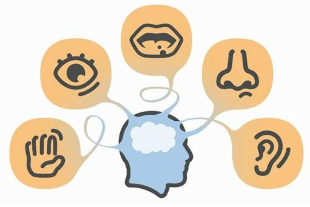

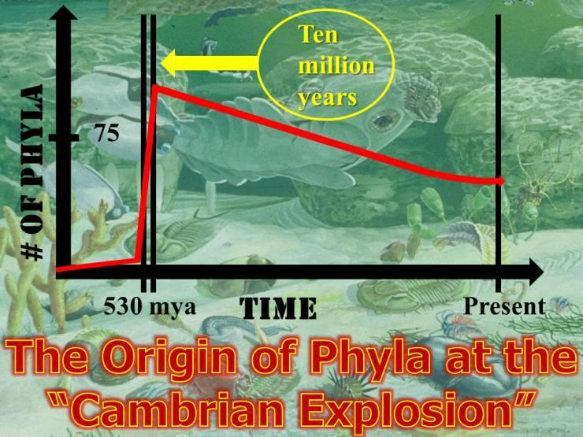

<!-- page: 7 -->

图像：眼睛/相机成像--搜集场景
的光

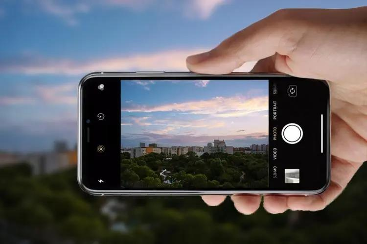

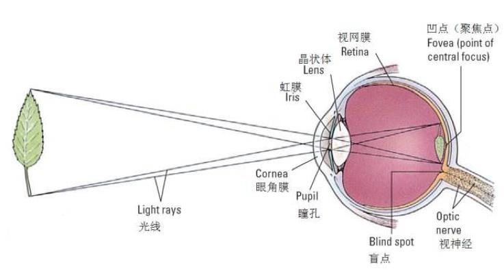

<!-- page: 8 -->

人眼看到什么？

3D 世界
2D 图像

Point of observation

<!-- page: 9 -->

人眼看到什么？

3D 世界
2D 图像

绘制背景

<!-- page: 10 -->

数字图像的表达与存储

计算机中存

人眼看到

储的

的

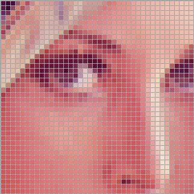

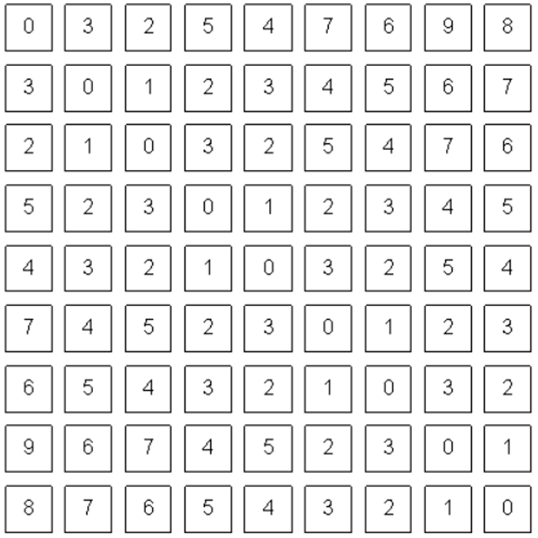

<!-- page: 11 -->

我们看到的像素颜色是否可计算？

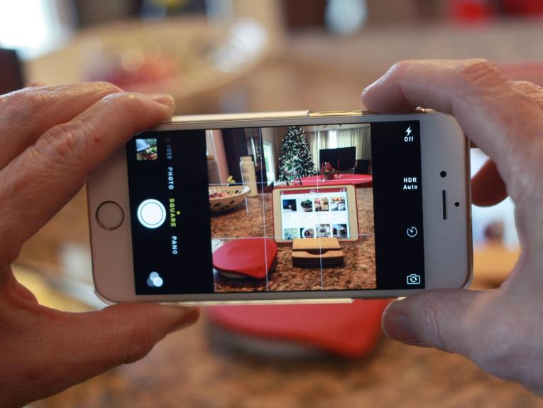

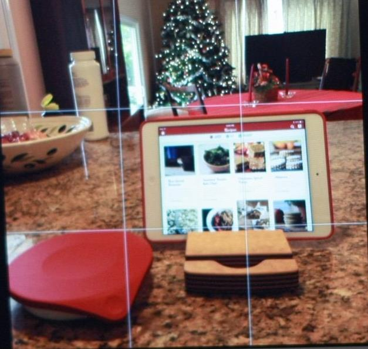

<!-- page: 12 -->

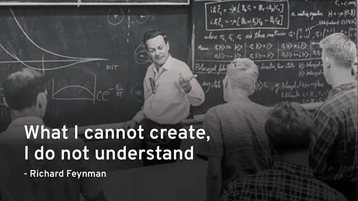

<!-- page: 13 -->

1988年图灵奖Ivan Sutherland
Computer Graphics(计算机图形学)
Virtual Reality(虚拟现实技术)

2003年图灵奖Alan Kay
面向对象编程：SmallTalk
人机交互:GUI

Renderman: CG Imagery
Jurassic Park, The Lord of the
Rings trilogy, the Star Wars,…

GPU: GLSL, Brook/CUDA

Pat Hanrahan & Ed Catmull

从2019年度图灵奖说起:
13

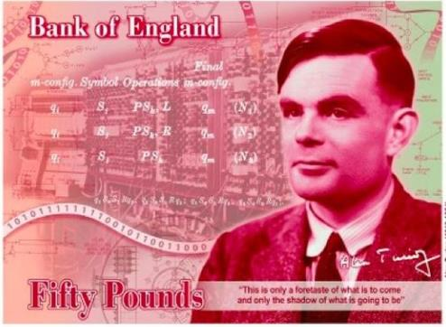

<!-- page: 14 -->

第一幅在显示器上生成的图像

Ben Laposky

◦人工智能艺术家
◦用示波器(oscilloscope)
控制出现在小显示屏
上的电子波；波浪会
在显示屏上不断地移
动和起伏。

14

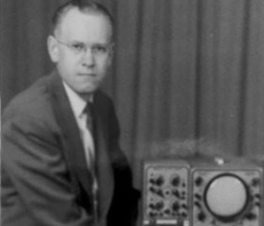

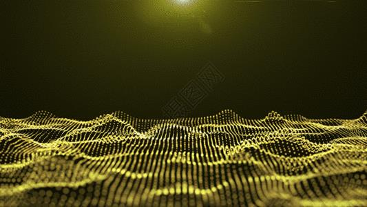

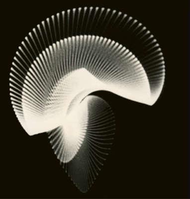

<!-- page: 15 -->

SAGE (SemiAutomatic Ground Equipment)

Bert Sutherland

◦在SAGE系统上首次用光
笔(light pen)在屏幕
上定位目标
◦SAGE采用向量图形显示

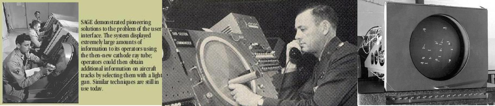

<!-- page: 16 -->

“Computer Graphics”名字的由来

William A. Fetter

◦1928~2002, a graphic artist
◦1950s~1960s: Boeing，研究飞机驾驶舱仿真
◦首次设计人体模型
◦1960 首次使用“Computer Graphics”

16

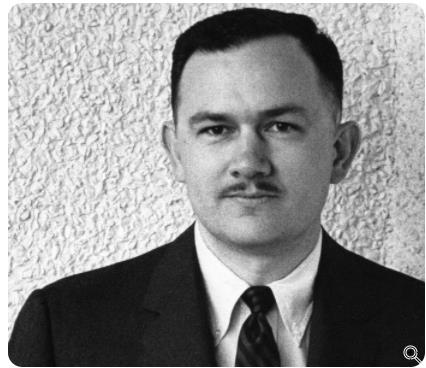

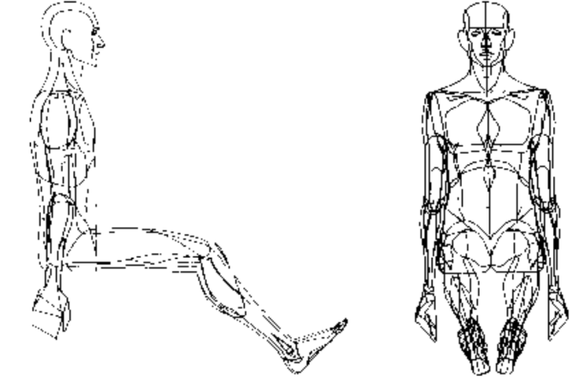

<!-- page: 17 -->

Sketchpad—人机交互的图形系统

I. Sutherland

◦CMU BS, Caltech MS, MIT Ph.D
◦博士论文Sketchpad: A Man-machine
Graphical Communications System

计算机图形学的奠基之作
1963, Supervised by Claude Shannon
◦1968，在哈佛大学与Bob Sproull一起
发明头盔

A visual thinker (“If I can picture possible solutions, I have
a much better chance of finding the right one”)

17

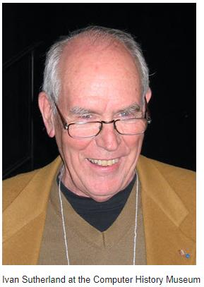

<!-- page: 18 -->

18

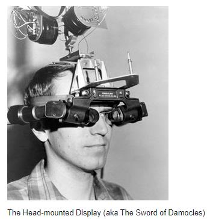

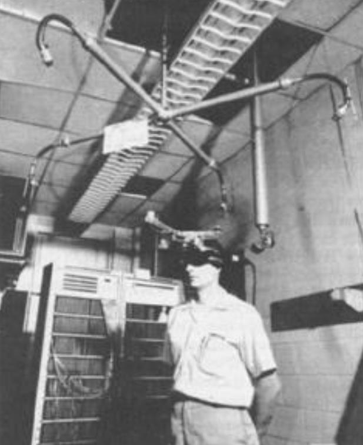

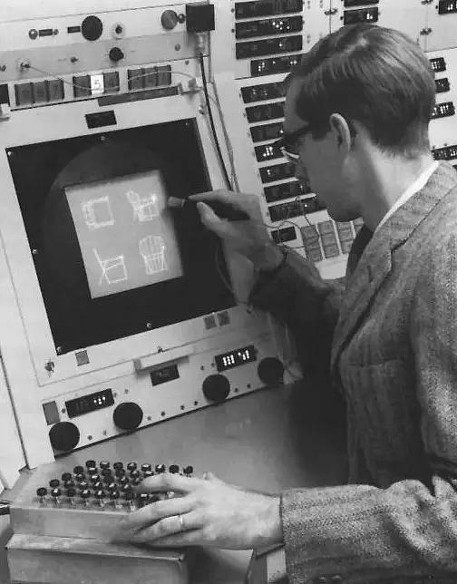

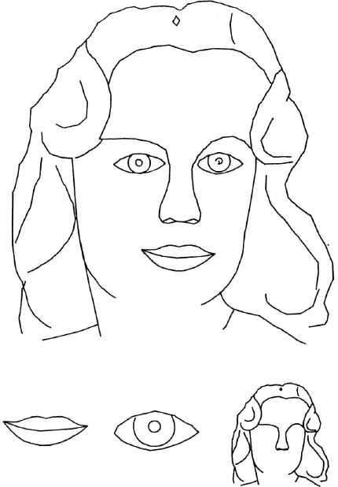

<!-- page: 19 -->

计算机图形学发展中的标志性事件

具体可参看

◦https://blog.csdn.net/oTianLe1234/article/details/115581463
◦https://zhuanlan.zhihu.com/p/107420103

19

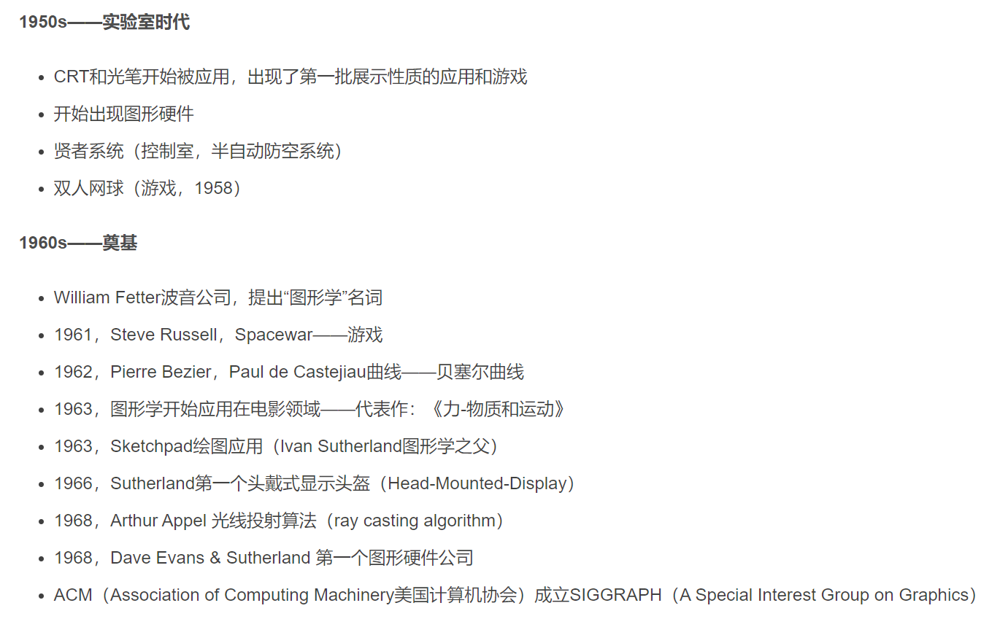

<!-- page: 20 -->

线框显示(1960s)

光栅化

填充算法

裁剪算法

N
E

QE
P=(xp, yp)

20

<!-- page: 21 -->

线框显示(1960s)

21

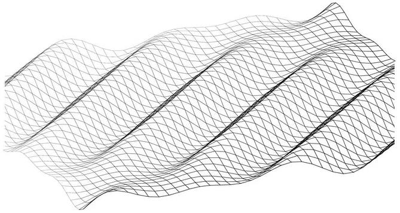

<!-- page: 22 -->

真实感绘制(1970s-1980s)

22

<!-- page: 23 -->

局部光照模型, 1973: Phong lighting model

23

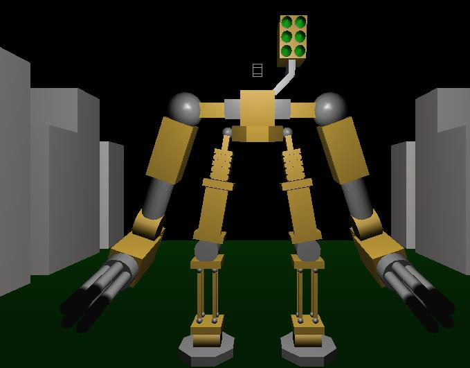

<!-- page: 24 -->

Ray Tracing (1980)

24

<!-- page: 25 -->

Radiosity 1984, BRDF

25

<!-- page: 26 -->

Reyes

Render Everything You Ever Saw (RenderMan)

A road to Point Reyes

26

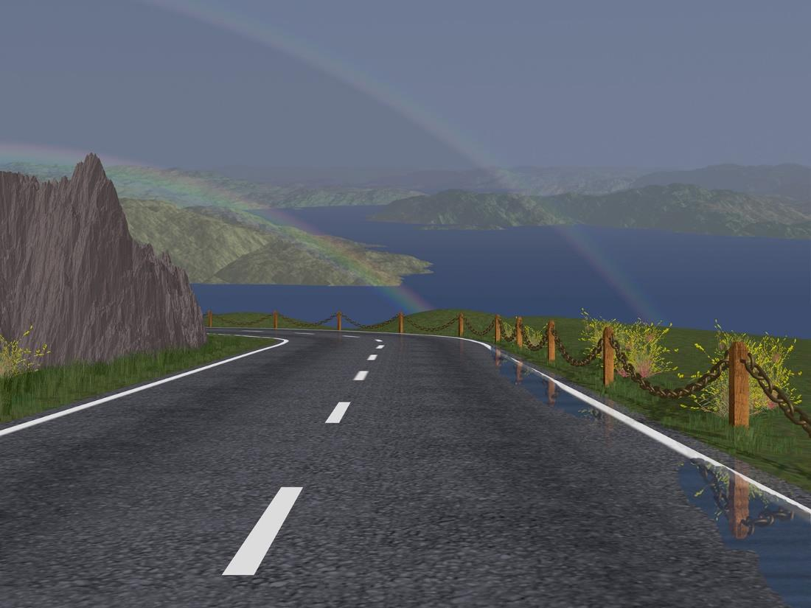

<!-- page: 27 -->

附：S.乔布斯给Pixar的500万美金支票

张心欣:《科学、艺术、天才，一篇计算科学的

史诗，一场兑现的资本盛宴》
https://zhuanlan.zhihu.com/p/121868664

27

<!-- page: 28 -->

1990s

新的曲线曲面表示

◦网格曲面(meshes),
◦细分曲面
◦隐式曲面

绘制

◦体绘制, 基于图象的绘制,
点绘制

可视化(Scientific

visualization)

图形硬件—图形工作站

28

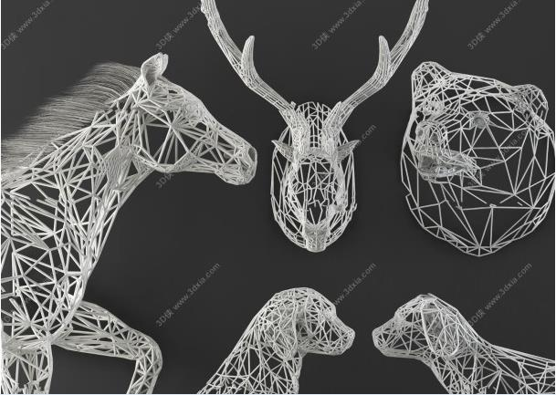

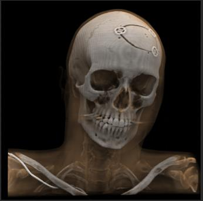

<!-- page: 29 -->

2000s

数字几何处理

材质(BRDF)编辑

图像与视频编辑

NVIDIA

◦可编程GPU

29

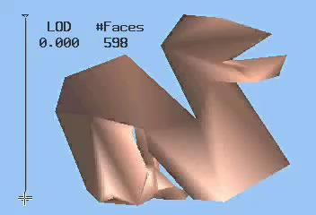

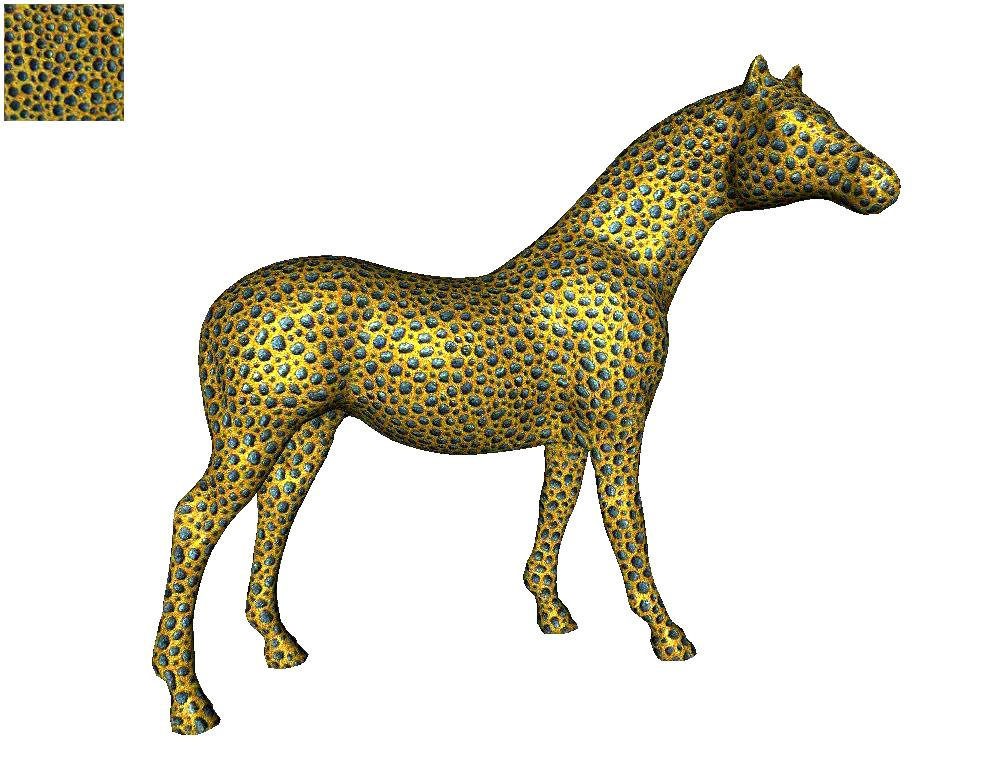

<!-- page: 30 -->

2010s

大数据+可视计算与分析
(Visual computing and analysis)

30

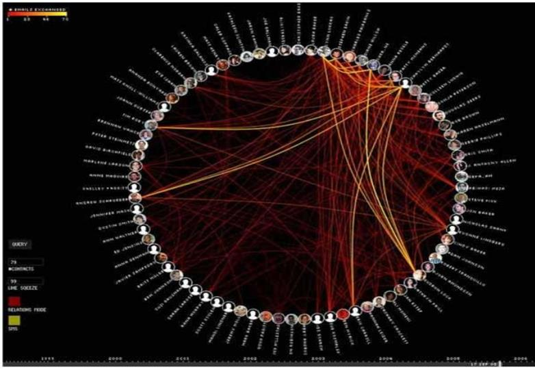

<!-- page: 31 -->

动态几何处理

31

<!-- page: 32 -->

2020s--人工智能驱动的图形学

Radek Grzeszczuk，Demetri Terzopoulos，
Geoffrey Hinton
NeuroAnimator: Fast Neural Network Emulation and
Control of Physics-Based Models.
SIGGRAPH 1998

Ben Mildenhall, Pratul P. Srinivasan, Matthew Tancik,
Jonathan T. Barron, Ravi Ramamoorthi, Ren Ng.
NeRF: Representing Scenes as Neural Radiance Fields
for View Synthesis
ECCV 2020

32

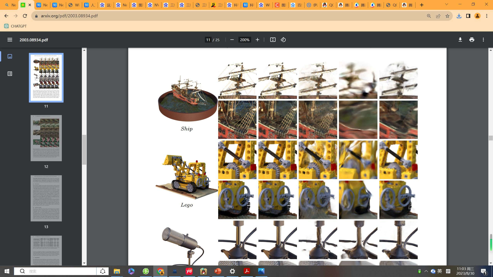

<!-- page: 33 -->

让我们从头开始…….

计算机图形学-像素背后的数学

Computer Graphics (CG)

<!-- page: 34 -->

计算机图形学：从第一性原理生
成画面像素

颜色计算的两大问题

f

场景表征：数据
渲染计算：颜色

<!-- page: 35 -->

表达方式1：面表达及面渲染

场景物体是实体的表面（二维流形曲面）

面表达：二维流形曲面
面渲染：光线反弹路径上的积分

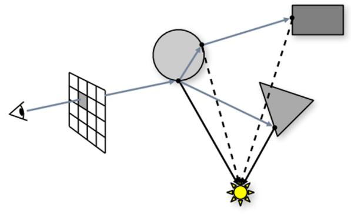

<!-- page: 36 -->

场景表达：面表达

场景物体是实体的表面（二维流形曲面）

参数函数曲面
点云
（曲面的离散采

分片线性曲
面（网格曲

隐式函数曲面

面）

样）

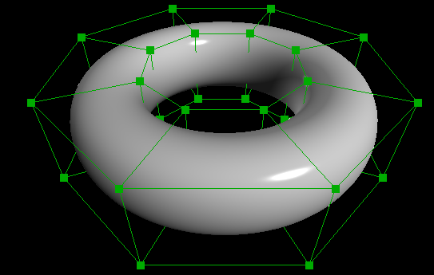

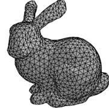

<!-- page: 37 -->

面表达的颜色计算：材质

光在表面上会反射、折射

◦材质：光的反射能量计算

渲染计算：某点从四面八方汇聚的光辐射量反射的总和(radiance)

◦渲染方程

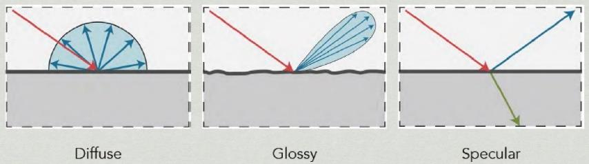

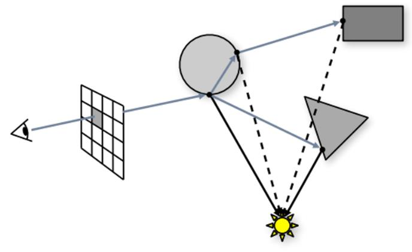

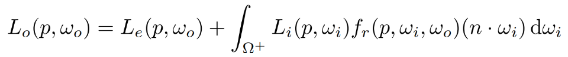

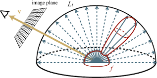

<!-- page: 38 -->

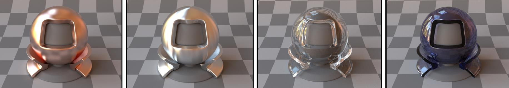

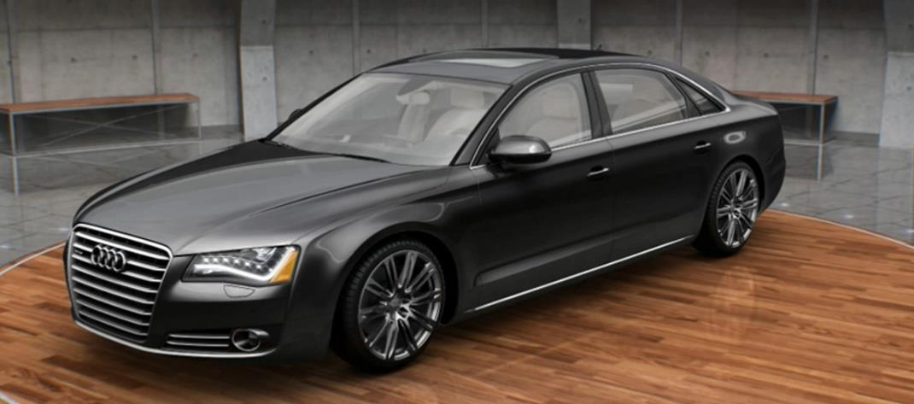

<!-- page: 39 -->

主流：3D模型数据资产的构建流程

制作3D数据复杂的流程：

◦几何数据
◦UV展开
◦贴图（纹理）
◦材质
◦灯光
◦动画
◦…

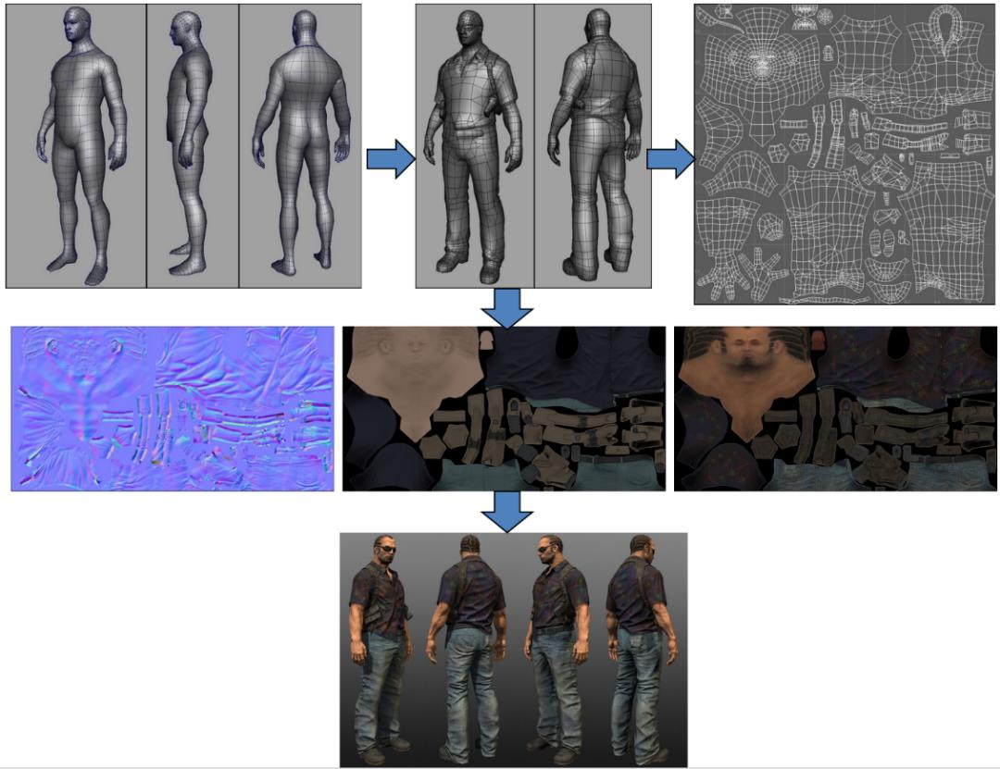

<!-- page: 40 -->

计算机图形学：像素背后世界的仿真计算

建模计算：仿几何之真，再造世界之“形”-- 求精

渲染计算：仿色彩之真，再造世界之“彩”-- 求美

动画计算：仿运动之真，再造世界之“动”-- 求真

建模（设计）

渲染（绘制）

动画（模拟）

Modeling

Rendering

Animation

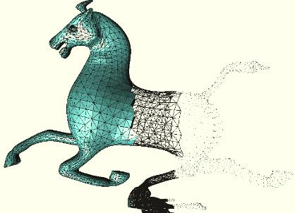

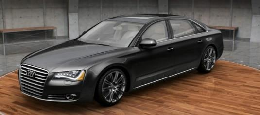

<!-- page: 41 -->

仿几何之真，求精

1. 建模计算：再造世界之“形”

<!-- page: 42 -->

丰富几何细节的3D模型

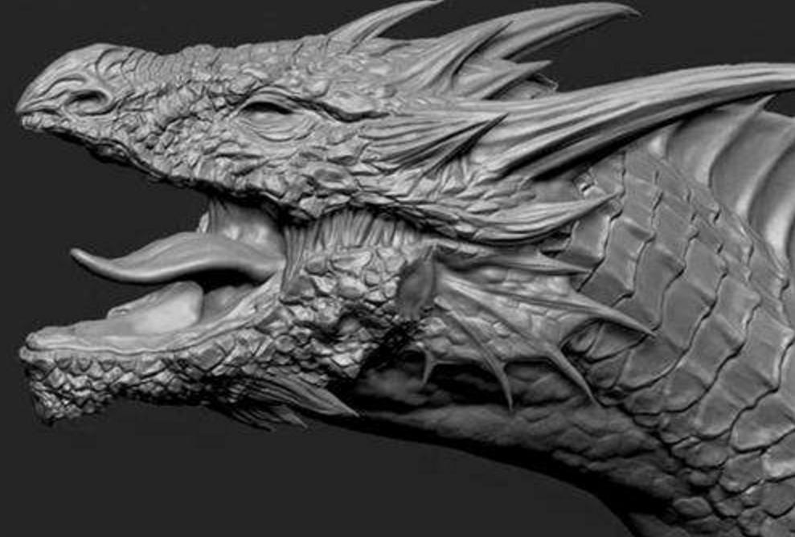

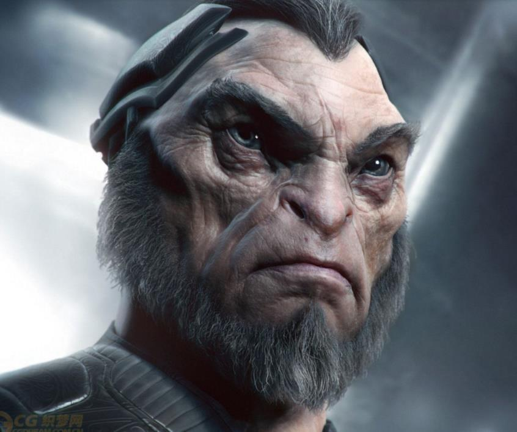

<!-- page: 43 -->

仿色彩之真，求美

2. 渲染计算：再造世界之“彩”

<!-- page: 44 -->

渲染= 虚拟拍照

<!-- page: 45 -->

仿运动之真，求真

3. 动画计算：再造世界之“动”

<!-- page: 46 -->

能否计算得到“运动真实”的物体？

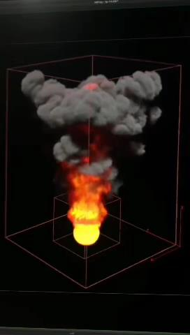

<!-- page: 47 -->

统治世界的方程/微分方程

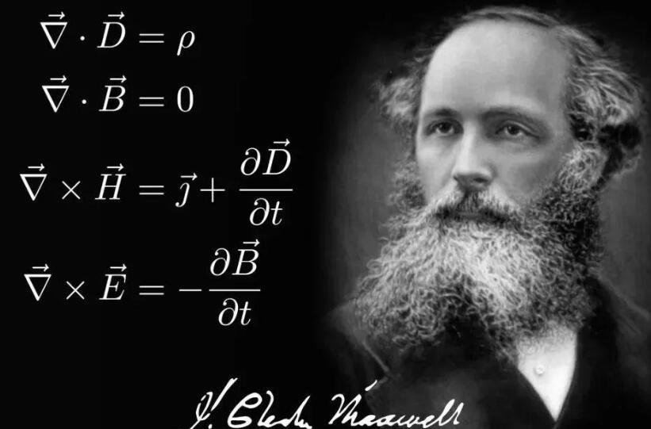

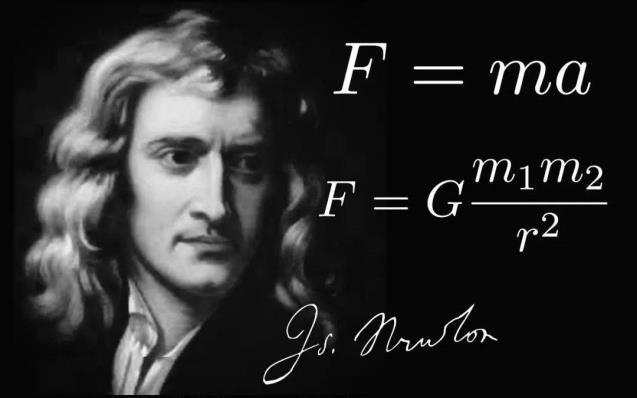

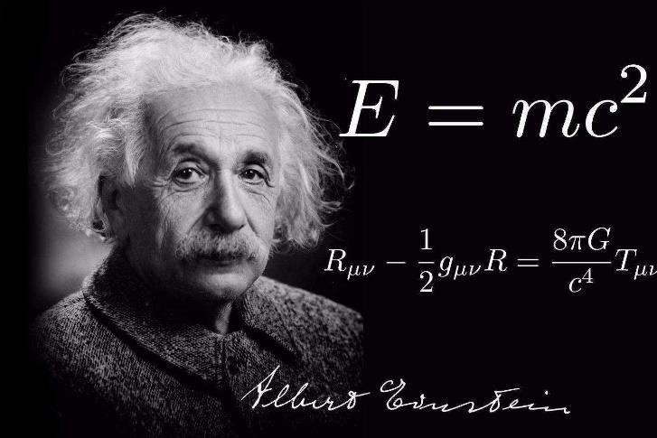

<!-- page: 48 -->

模拟计算：运动的计算科学

求解微分方程：

刚体：动力学方程

拉格朗日视角
（粒子采样）

欧拉视角
（网格格点采样）

柔体：本构方程

流体：Navier-Stokes
方程

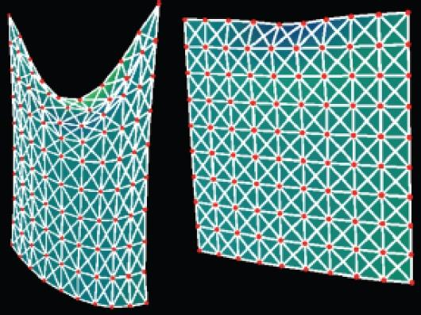


<!-- page: 49 -->

（例）布料模拟


<!-- page: 50 -->

（例）流体模拟：求解N-S (Navier-Stokes)方程

偏微分方程数值解：准（精度）、快（效率

）、大（规模）


<!-- page: 51 -->

真实感模拟：物理级的运动计算

《冰雪奇缘》
《海洋奇缘》


<!-- page: 52 -->

图形学、视觉、图像处理

人工智能(AI)

图像处理

(IP)

计算机视觉(CV)

计算机图形学(CG)

52

<!-- page: 53 -->

2 计算机图形学的应用

软硬件技术发展+ 应用需求

<!-- page: 54 -->

2.1 图形工业

计算机图形学提供直观的信息交流工具，被

广泛地用于各个不同的领域。

◦制造工业(CAD)
◦娱乐业(影视、游戏)
◦数据工业（各种可视化）
◦科学研究（物理仿真、三维重建等）
◦教育、医学、艺术、军事
◦……

应用需求反过来推动图形学的发展，计算机

图形处理已经形成一个巨大的产业。

<!-- page: 55 -->

2.1 CAD/CAM

建筑设计

电路设计

汽车外形设计

飞机外形设计

船舶设计

家用电器等设计

55


<!-- page: 56 -->

2.1.1 三维打印(3D printing)

是一种数字化制造技术

◦输入把数字设计三维模型，输出物理实体

增材制造(additive manufacturing）

◦

56
减材(subtractive)
增材(additive)


<!-- page: 57 -->

57

<!-- page: 58 -->

打印流程

58


<!-- page: 59 -->

医疗

59


<!-- page: 60 -->

汽车

60


<!-- page: 61 -->

建筑

2007.10.11
浙江大学CAD&CG国家重点实验室
61


<!-- page: 62 -->

个性化制造…

62


<!-- page: 63 -->

2.2 影视特技、动画、游戏

影视业

◦高质量画面、高艺术水准、大胆的想象
◦大投资、紧迫的拍摄进度


<!-- page: 64 -->

《奇异森林》

影片描述狼孩毛克利的冒险故事……

片中男孩唯一真人表演


<!-- page: 65 -->

2.3 计算机游戏

娱乐新形式:‘可怕’地改变了人们的生活？

虚拟空间：玩家深度参与其中

最重要特征：实时交互

是计算机图形

学、特别是图

形硬件发展的

另一个重要推

动力。


<!-- page: 66 -->

2.4 可视化与可视分析

帮助直观形象地理解大规模数据所蕴涵的科

学现象和规律

◦数值仿真
◦气象卫星
◦石油勘探
◦遥感卫星
◦医学影像

很难从海量数据中发现其内在规律和变化趋势。


<!-- page: 67 -->

2.5 辅助医疗

蛋白质结构的显示
可视人

67


<!-- page: 68 -->

虚拟内窥镜
https://v.youku.com/v_show/id_XMTYxMTExMTcwOA==.html?spm=a2h0c.8166622.PhoneSokuUgc_1.dscreensh
ot

68


<!-- page: 69 -->

2.6 图形用户界面GUI
(Graphics User Interface)

用户与应用软件

进行交互的界面

特点

◦直观(窗口与图标)
◦高效

<!-- page: 70 -->

2.7  计算机艺术

世界上第一幅AI (具

体是生成对抗网络
GAN)画作

出自法国一个叫

Obvious的团队

Belamy: 法文Bel

Ami,好朋友

向GAN第一作者Ian

J. Goodfellow致敬

埃德蒙·德·贝拉米肖像-Edmon de Belamy, 2018,10.25


<!-- page: 71 -->

AIGC:  DALL. E

AIGCOpenAI的DALL. E 2的人物画(2022)

戴珍珠耳环的少女

荷兰画家约翰内斯·维米尔于1665

71


<!-- page: 72 -->

AIGC：SORA

一位时尚的女士走在东京的街道上，街道上充满了温暖的霓虹

灯和生动的城市标志。她穿着黑色皮夹克、红色长裙和黑
色靴子，手里拿着一个黑色钱

72
https://oss.chiefaso.com/h5/sora2/i.html?self_os=1&platform_id=34&app_id=1121&agency_
id=206&channel_id=13729&msclkid=ec5587bc40a31cb46d01e162a558f4ac

<!-- page: 73 -->

2.8 虚拟现实(Virtual reality, VR)

多感知性

◦视觉、听觉、触觉、味觉、嗅觉等感知

沉浸感

◦用户感到作为主角存在于模拟环境中
◦理想的模拟环境应达到用户难辨真假的程度。

交互性

◦用户可操作虚拟环境内物体，并获得反馈

自主性

◦指虚拟环境中物体依据物理
定律进行动作的程度

73

https://www.bilibili.com/video/BV19b411H7ym?from=search&seid=5092164734619743450


<!-- page: 74 -->

增强现实(Augmented reality, AR)

真实世界和虚拟世界场景的无缝融合

在三维现实空间中增添虚拟物体

74

<!-- page: 75 -->

第一人称无人机实战……

https://www.zhihu.com/zvideo/180996034

6825392128

75

<!-- page: 76 -->

元宇宙(Metaverse)

尼尔·斯蒂芬森:《雪崩》

◦描绘了一个超现实主义的数字空间元宇宙，被地理
空间阻隔的人们可通过各自“化身”(Avatar) 相互
交往，度过闲暇时光，随意支配自己的收入

扎克伯格：Meta

◦2021年10月，Facebook官宣更名Meta，扎克伯格阐
释自己关于Metaverse（元宇宙）的畅想和愿景

76

<!-- page: 77 -->

虚拟现实

VR/AR
机器人

影视、游戏

自动驾驶

元宇宙
三维视觉

机器人

广泛的交叉应用

计算机图形学

<!-- page: 78 -->

Acknowledgment

张心欣《科学，艺术，天才，一篇计算科学的史诗，

一场兑现的资本盛宴》
(https://zhuanlan.zhihu.com/p/121868664)

Philipp Slusallek. History of Computer Graphics

(https://graphics.cg.uni-saarland.de/courses/cg1-

2018/slides/CG01b-History_Applications.pdf)

所有资料来自WWW或各种资料数据库, ppt中没有一

一标明出处, 在此一并致谢.

78

<!-- page: 79 -->

本课件部分内容来自于李桂清老师和中

科大刘利刚老师的ppt，在此一并感谢
！

2007.10.11
浙江大学CAD&CG国家重点实验室
79

