# 10 illumination model （chap 2.5）0-color space

<!-- page: 1 -->

计算机图形学与虚拟现实

冼楚华
Email: chhxian@scut.edu.cn
华南理工大学计算机科学与工程学院

<!-- page: 2 -->

课程信息

• 授课老师姓名：冼楚华
• Email: chhxian@scut.edu.cn
• 个人主页：https://chuhuaxian.github.io/
• QQ：89071086 （比较少用，非急事请不要私聊）
• 办公室：B3-202-2
• 课程QQ群（见二维码）

<!-- page: 3 -->

内容

颜色空间(Section 2.5)

局部光照模型(Section 6.1)

三种着色模式

全局光照模型(Section 4.5, 4.7)

光线跟踪算法

纹理映射

3

<!-- page: 4 -->

内容

颜色空间(Section 2.5)

局部光照模型(Section 6.1)

全局光照模型(Section 4.5, 4.7)

纹理映射

4

<!-- page: 5 -->

物体颜色的影响因素

•
物体本身的几何形状(与光学性质)
•
光源
+  周围环境
•
观察者的视觉系统

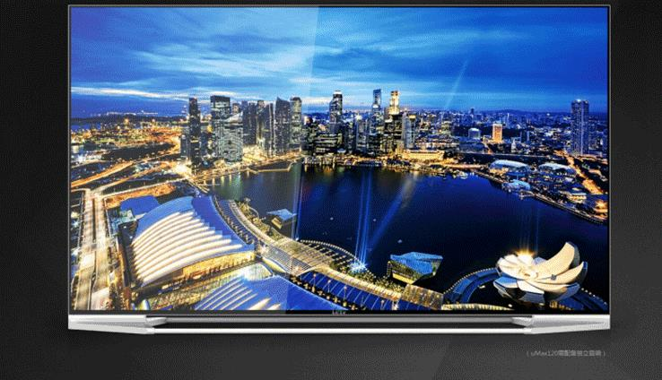

<!-- page: 6 -->

1 什么是颜色？

光射入眼睛刺激视觉器官所产生的

主观感觉

The property possessed by an object of producing

different sensations on the eye as a result of the

way the object reflects or emits light.

<!-- page: 7 -->

光的物理性质

电磁辐射(Electromagnetic radiation)

电力、无线电波、微波、太赫兹辐射、红外辐射、

可见光、紫外线、X射线、伽马射线

光是一种电磁辐射

颜色--不同波长电磁波刺激视神经产生不同颜色

𝐹𝑟𝑒𝑞𝑢𝑒𝑛𝑐𝑦=
2𝜋
𝑊𝑎𝑣𝑒𝑙𝑒𝑛𝑔𝑡ℎ

亮度(lightness)

----振幅(Amplitude)

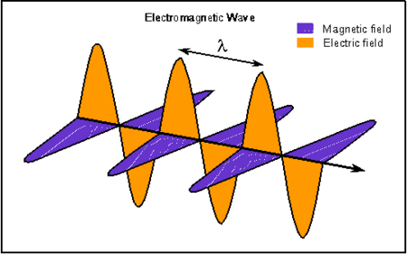

<!-- page: 8 -->

可见光波段(Visible Light)

可见光

波长(nm, 纳米)

𝟏𝟎𝟏𝟓
𝟏𝟎𝟏𝟑
𝟏𝟎𝟏𝟏
𝟏𝟎𝟗
𝟏𝟎𝟕
𝟏𝟎𝟓
𝟏𝟎𝟑
𝟏𝟎𝟏
𝟏𝟎−𝟏
𝟏𝟎−𝟑

Ultraviolet

Microwave

AM Radio

Gamma ray

infrared

FM Radio，TV

X-Ray

AM Radio: 调幅; FM Radio: 调频; Microwave:微波; infrared:红外; Untraviolet:紫外

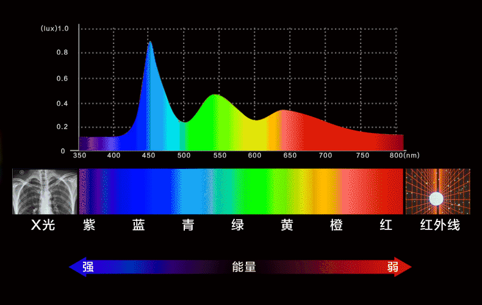

<!-- page: 9 -->

颜色与波长(Color and Wavelength)

绝大部分光都是多种波长的混合

白光可以分离出各种可见光

光线中的波长分布情况被称为光谱

Amplitude E(𝝀)

Wavelength(𝝀)

400nm
700nm

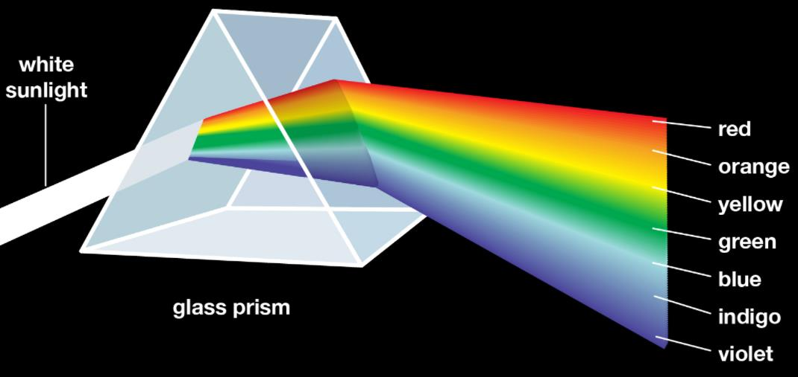

<!-- page: 10 -->

2 人眼成像示意图(Eye)

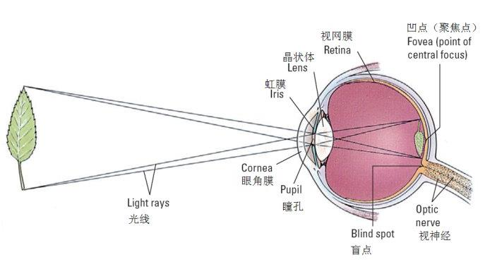

<!-- page: 11 -->

颜色是人类的主观感受

两类光感受器

位于视网膜(retina)上

约1.3亿杆状接收器(Rod

receptors)

感受光强

约7百万锥状接受器(cone

receptors)

3种cone receptors,每种对

不同波长(颜色)敏感

图:两类感受器的分布情况

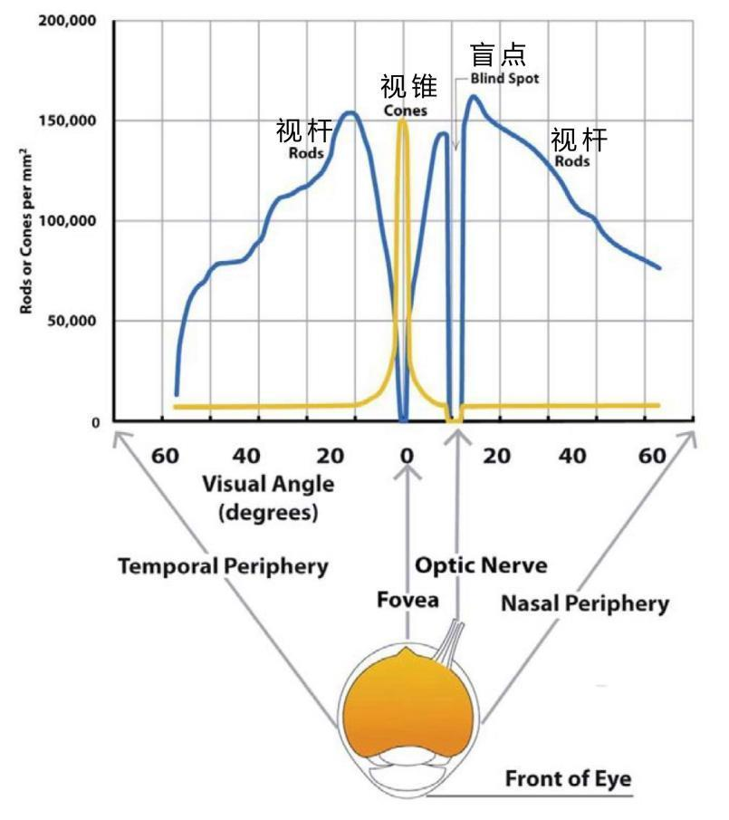

<!-- page: 12 -->

三种锥状感受器Cone Receptors

S(short), M(middle), L(long)三种感受器:敏感波长峰

值分别为430nm, 560nm, 610nm, 分别对应蓝, 绿, 红

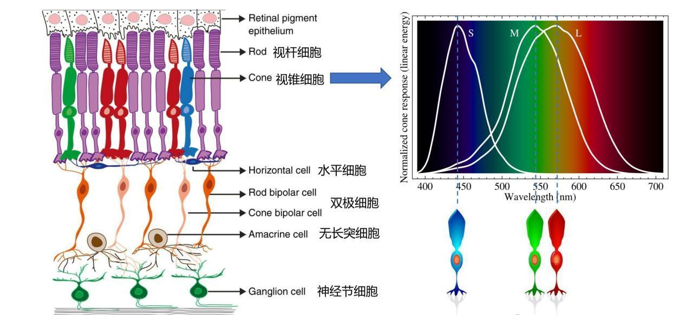

<!-- page: 13 -->

人类颜色感知---个体差异

每个人的敏感波长并不一致

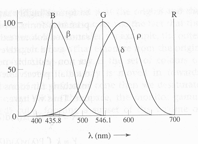

<!-- page: 14 -->

3 颜色空间(Color spaces)/量化描述

颜色空间/彩色模型/

彩色空间/彩色系统

颜色坐标系

量化描述颜色属性

HSL和HSV空间(颜色

包括三要素)

色彩(hue)

饱和度(saturation)

亮度(lightness)

色度学(colorimetry)

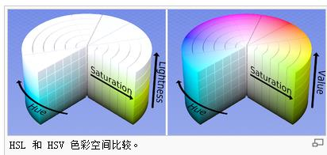

<!-- page: 15 -->

三分量颜色(3-Component Color)

加色系统(additive color, RGB)

主动发光，如RGB

减色系统(subtractive color)：

被动发光,光源来自环境

如CMY(Cyan青–Magenta洋红–

Yellow黄)系统

Cyan油墨(本身不发光):吸收红光；

Y：吸收蓝光；M：吸收绿光

CMYK(K-black)：印刷系统

CMY不能混合出真正的黑色,所以加上K

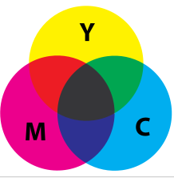

<!-- page: 16 -->

RGB空间(255X255X255单位立方体)

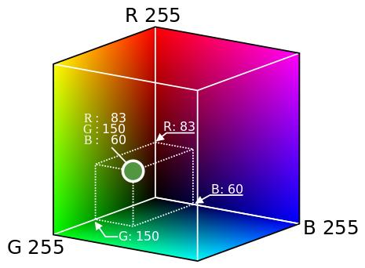

<!-- page: 17 -->

为什么选择RGB进行调色

人眼感光特性

90

分别有RGB峰值

光谱特性

光叠加会变亮

91

54

所选三原色应

均匀分布在可见光谱中

亮度相对较暗,便于混

合出其它更亮的颜色

红绿蓝满足此要求

39

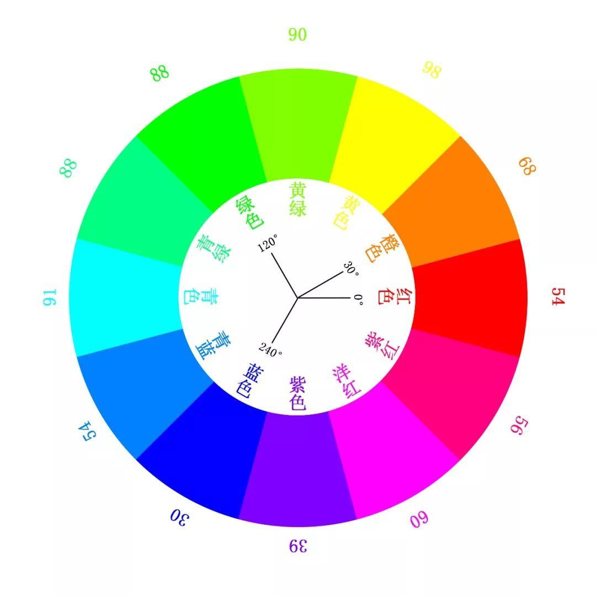

<!-- page: 18 -->

颜色的叠加

黄=红+绿
红

品红=蓝+红

绿

蓝

青=蓝+绿

<!-- page: 19 -->

4 什么是标准颜色(the standard color?)

无精确定义

人类颜色匹配实验(Color matching experiments)

光与物的相互作用(Light object interaction)

Stanford color matching applet:
http://graphics.stanford.edu/courses/cs178/applets/colormatching.html
光的冷知识:
https://haokan.baidu.com/v?vid=15231858186734133520&pd=bjh&fr=bjhauthor
&type=video

<!-- page: 20 -->

附：动物的辨色能力

哺乳动物: 大多数是色盲。牛、羊、马、狗、猫等，几乎不会分辨

颜色，反映到它们眼睛里的色彩，只有黑、白、灰3种颜色。

人类的“近亲”猿: 过着平淡无奇的灰色生活。田鼠、家鼠、黄鼠

、花鼠、松鼠、草原犬等也不能分辨颜色。长颈鹿能分辨黄色、绿
色和橘黄色。鹿对灰色的识别力最强。

鸟类: 除了某些过惯了夜生活的鸟类，如猫头鹰等，因为视网膜中

没有锥状细胞，无法辨认色彩以外，许多飞禽都有色彩的感觉。

水生动物:多数都具有辨色能力。鲈鱼能感知颜色，生物学家用染

成红色的幼虫喂它们，待其习惯后，改用红色羊毛喂它们，鲈鱼竟
然照吃不误。

昆虫: 属于低等动物，但它们的辨色能力比哺乳动物高明。蜻蜓对

色的视觉最佳，其次是蝴蝶和飞蛾。

20
