# 11 illumination models (chap 6)

<!-- page: 1 -->

计算机图形学与虚拟现实

冼楚华
Email: chhxian@scut.edu.cn
华南理工大学计算机科学与工程学院

<!-- page: 2 -->

课程信息

• 授课老师姓名：冼楚华
• Email: chhxian@scut.edu.cn
• 个人主页：https://chuhuaxian.github.io/
• QQ：89071086 （比较少用，非急事请不要私聊）
• 办公室：B3-202-2
• 课程QQ群（见二维码）

<!-- page: 3 -->

真实感图形生成

计算机图形学的目标

生成照片般真实的图

像(Photorealistic)

颜色计算相关内容

材质建模

光照建模

光照计算：根据光照

模型计算像素颜色

3

<!-- page: 4 -->

主要内容

光照明模型(Chap 6)

局部光照模型

全局光照模型

多边形物体的明暗处理

光线跟踪算法

纹理映射

4

<!-- page: 5 -->

渲染

?

世界坐标场景
屏幕空间图像

5

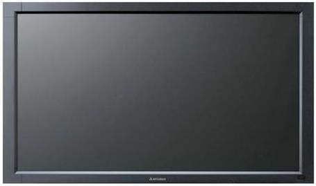

<!-- page: 6 -->

图形管线(graphics pipeline)

输入

逐顶点处理

坐标变换、光照、纹理坐标

将顶点组装成点、线、三角形等图元(primitives)

图元组装

3D裁剪/
观察变换/

裁剪与视口变换(viewport)、隐藏面消除测试

隐藏测试

从图元生成片元(Fragment)

光栅化

片元处理

纹理映射(texture map.)、颜色插值(color interp.)

逐片元操作

深度测试、模板测试、alpha混合

输出帧缓存

6

<!-- page: 7 -->

主要内容

光照明模型(Chap 6)

局部光照模型

全局光照模型

多边形物体的明暗处理

光线跟踪算法

纹理映射

7

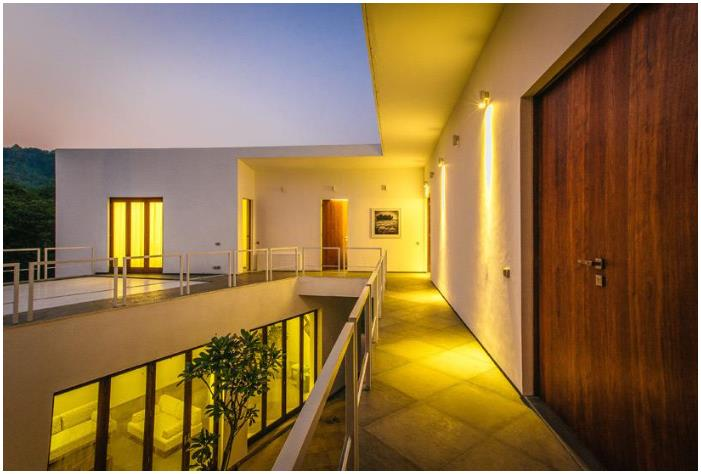

<!-- page: 8 -->

光照模型(illumination models)

影响物体表面光照效果的因素

光源(light source)

观察点位置(view position)

物体表面局部几何形状

(geometry, normal)

表面位置与朝向(orientation)

材质(material optical

properties)

漫反射、高光、透射

计算物体表面上微面元颜色

光源或周围环境光线照射而产生

8

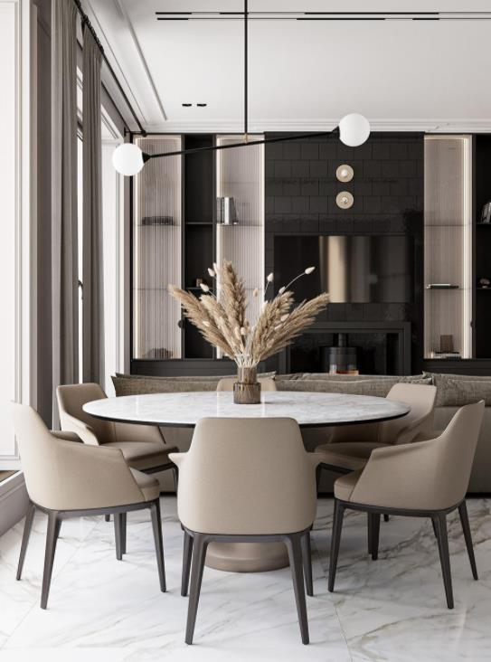

<!-- page: 9 -->

光照模型--光源表示

光源在世界坐标中的位置𝑝∈ℝ3

光源的光强𝐼(Intensity)


𝑅, 𝐺, 𝐵∈[0,1]3(或者每个分量的取值为0,1,…,255)

每个分量独立进行颜色计算,光照模型中统一用𝑰表示

9

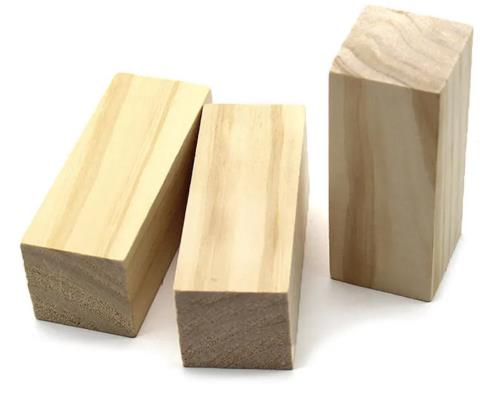

<!-- page: 10 -->

光照模型---局部和全局光照计算

局部光照

泛光模型(ambient light)

Lambert 漫反射模型

(Diffusion reflection)

Phong 镜面反射模型

(Specular reflection)模型

全局光照

Whitted 整体光照明模型

10

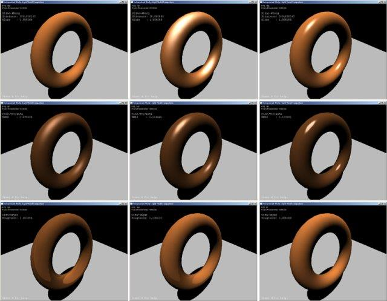

<!-- page: 11 -->

1 泛光(ambient light)

也叫环境光

最简单光照模型

刻画环境反射光对物

体表面照明的贡献

场景所有区域

光强值相同

11

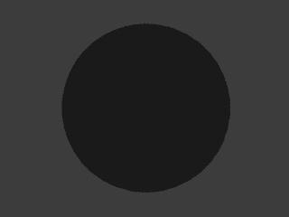

<!-- page: 12 -->

泛光计算

光强与入射方向和出射方向均无关

𝐾𝑎𝑅R𝑎

𝑅
𝐺
𝐵

𝐾𝑎𝐺G𝑎
𝐾𝑎𝐵B𝑎
𝐼𝑒𝑛𝑣= 𝑅/𝐺/𝐵：物体表面对泛光的反射光亮度

𝐼𝑒𝑛𝑣= 𝐾𝑎𝐼𝑎

=

𝐼𝑎= 𝑅𝑎/𝐺𝑎/𝐵𝑎：泛光的入射光亮度
K𝑎= K𝑎𝑅/K𝑎G /K𝑎𝐵：

物体表面对泛光的反射率

12

<!-- page: 13 -->

例子

泛光模型的光照明效果（Utah Teapot）：模型上所有像
素光强值完全一样

13

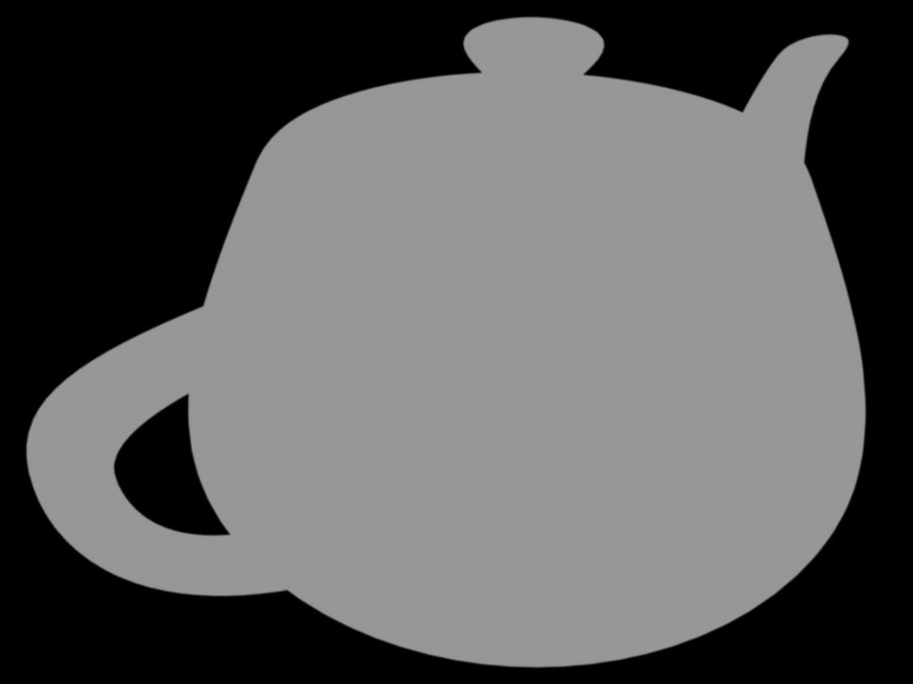

<!-- page: 14 -->

2 Lambert漫反射模型(diffusion model)

光源对物体表面的照射及物体反射都有方向性

不同入射方向的光，其出射强度不同

不同方向的出射光，强度不同

局部光照将物体表面反射分为

漫反射

镜面反射

纯漫射表面只产生

漫反射, 无镜面高光

地面、树木等

14

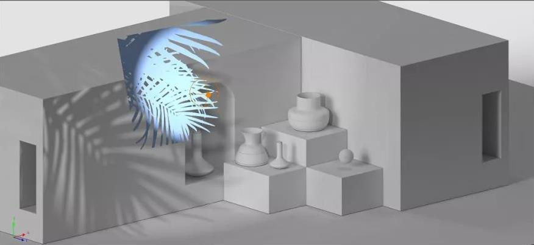

<!-- page: 15 -->

Lambert漫反射项---建模

物体表面相对粗糙

入射光线朝各个方向均匀反射

强度

与入射光的光亮度和入射方向有关

与漫反射光的反射方向无关

表面相对粗糙

N

L

均匀反射的光线

15

<!-- page: 16 -->

Lambert漫反射项---经验公式

漫反射光亮度和光源入射角的余弦成正比

𝐾𝑑𝑅R𝑒𝑐𝑜𝑠𝛼

𝑅
𝐺
𝐵

𝐼𝑑= 𝐾𝑑𝐼𝑒𝑐𝑜𝑠𝛼或

𝐾𝑑𝐺G𝑒𝑐𝑜𝑠𝛼
𝐾𝑑𝐵B𝑒𝑐𝑜𝑠𝛼

=

N

𝐼𝑑: 表面反射光强；
K𝑑：物体表面漫反射率；
𝐼e: 来自光源的入射光的光强；
𝛼: 光源入射角.

V
L

𝜶

A

入射角：入射光线𝐿和表面法向𝑁夹角

16

<!-- page: 17 -->

Lambert漫反射项—余弦计算

cos𝛼的快速计算

cos𝛼= N ⋅L

N |L| =
N ⋅L

N ⋅N |L ⋅L|

N

N：物体表面法向
L: 光线入射方向
𝜶

V
L

A

17

<!-- page: 18 -->

Lambert光照模型

由环境光和漫反射光构成

I = 𝐼𝑒𝑛𝑣+ 𝐼𝑑= 𝐾𝑎𝐼𝑎+ 𝐾𝑑𝐼𝑒𝑐𝑜𝑠𝛼

I:  景物表面的反射光亮度;

Lambert模型的光照
明效果(Utah Teapot)

𝐼𝑒:光源入射光强;

Ia: 环境泛光入射光亮度，

N

一般取值范围为0.02Ie～0.2Ie.

V
L

𝜶

A

18

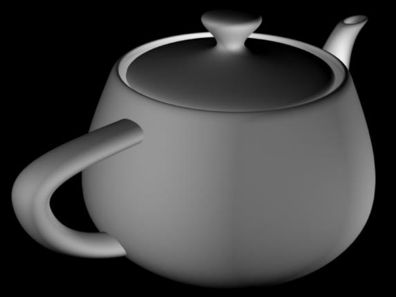

<!-- page: 19 -->

Utah teapot:
http://www.sjbaker.org/wiki/index.php?title=The_History_of_The_Teapot

The teapot was made by Melitta in 1974 and

originally belonged to Martin Newell and

his wife, Sandra
who purchased
it from ZCMI(a
department store
in Salt Lake City).

19

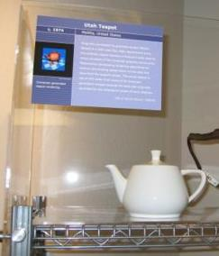

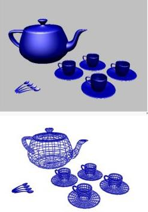

<!-- page: 20 -->

John Warnock

Ph. D Utah University of

Utah , 1969

Warnock’s hidden surface

remvomal algorithm

Adobe Co-founder

Post Script (.ps)

Portable Document Format

(.PDF)

20

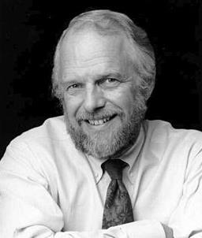

<!-- page: 21 -->

3 Phong光照模型

由Lambert光照模型和高光反射项构成

环境光，漫反射光，镜面反射光

镜面高光示例

21

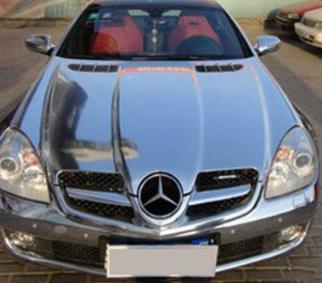

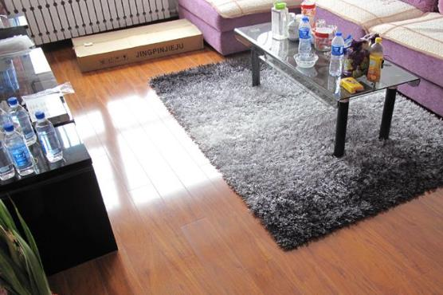

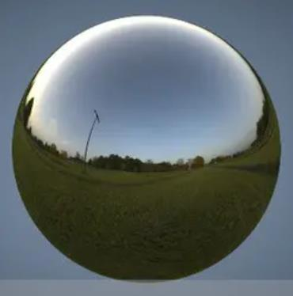

<!-- page: 22 -->

Phong模型—高光

镜面反射光(specular reflection light)

遵从光的反射定律, 某方向的入射光

反射方向上的出射光最强

随偏离反射方向程度变大，反射光强迅速减弱

N

R

𝛼
V
L

𝜃
𝛼

A

22

<!-- page: 23 -->

Phong模型—高光经验公式

Phong采用余弦函数的幂次来模拟镜面反射光

𝐼𝑠= 𝐾𝑠𝐼𝑒𝑐𝑜𝑠𝑛𝜃
n
R

L
𝜃

23

<!-- page: 24 -->

Phong模型—高光反射方向的计算

镜面反射方向的计算𝐼𝑠= 𝐾𝑠𝐼𝑒𝑐𝑜𝑠𝑛𝜃

𝐋∙𝐍

𝐒=

|𝐍| 𝐍

𝐑= 𝟐𝐒−𝐋

注:L、N、R一定共面；L、N、V一般不共面

24

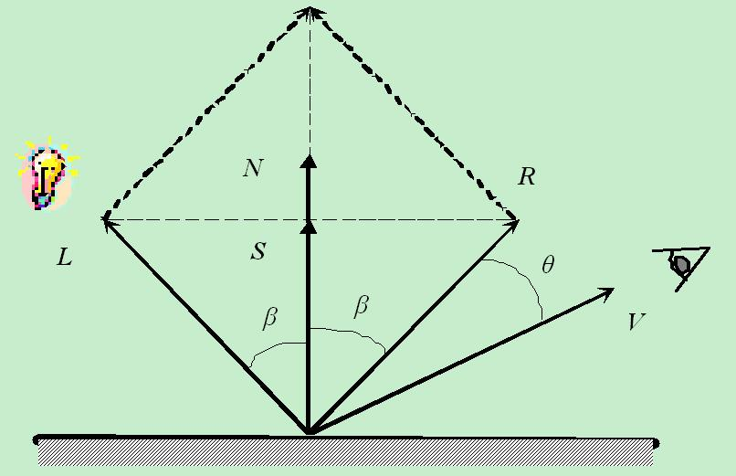

<!-- page: 25 -->

Blinn-Phong模型—高光反射的近似

虚拟镜面法向H

视线方向与光线的平分线

用H与N的夹角代替V与R的夹角

H

N

R

I𝑠= 𝐾𝑠𝐼𝑒𝑐𝑜𝑠𝑛𝜃

γ

L

θ
β
β

V

I𝑠= 𝐾𝑠𝐼𝑒𝑐𝑜𝑠𝑛𝛾

虚拟镜面

2 ：L、V必须是已经单位化的。
注:L、N、R一定共面；

L+V

H =

L、N、H一般不共面

25

<!-- page: 26 -->

Blinn-Phong与Phong的效果比较

Phong
Blinn-Phong

26

<!-- page: 27 -->

Phong模型& Blinn-Phong模型

综合漫反射、镜面反射及泛光反射

Phong:
I = 𝐾𝑎𝐼𝑎+ 𝐾𝑑𝐼𝑒𝑐𝑜𝑠𝛼+ 𝐾𝑠𝐼𝑒𝑐𝑜𝑠𝑛𝜃

Blinn-Phong: I = 𝐾𝑎𝐼𝑎+ 𝐾𝑑𝐼𝑒𝑐𝑜𝑠𝛼+ 𝐾𝑠𝐼𝑒𝑐𝑜𝑠𝑛𝛾

=

=

27

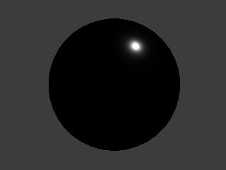

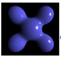

<!-- page: 28 -->

Phong, Blinn-Phong更多图例

Phong模型效果

http://www.labri.fr/perso/kno
edel/cmsimple/images/
daimler/phong_1.jpg

28

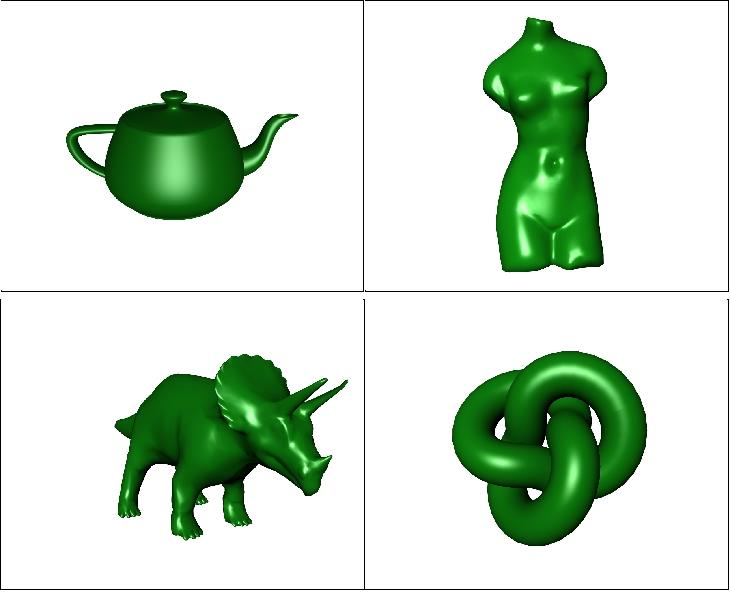

<!-- page: 29 -->

光照明模型的进一步完善：图例

Blinn-Phong

模型效果

http://www.labri.fr/perso/

knoedel/cmsimple/images/

daimler/BlinnPhong_1.jpg

29

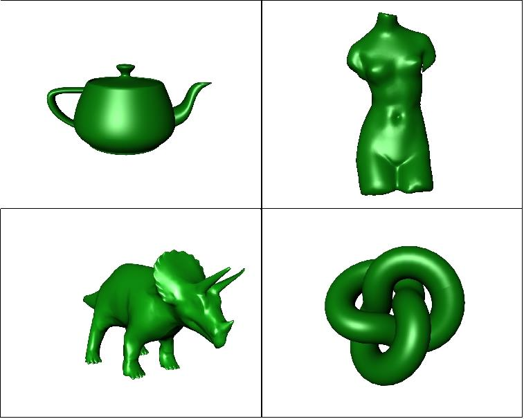

<!-- page: 30 -->

4 多光源Blinn-Phong模型

余弦形式

𝑚

𝐼𝑖[𝐾𝑑𝑐𝑜𝑠𝛼𝑖+ 𝐾𝑠𝑐𝑜𝑠𝑛𝛾𝑖]

I = 𝐾𝑎𝐼𝑎+ ෍

𝑖=1

矢量积形式

𝑚

𝐼𝑖[𝐾𝑑N ∙L𝑖+ 𝐾𝑠(N ∙H𝑖)𝑛]

I = 𝐾𝑎𝐼𝑎+ ෍

𝑖=1

阴影计算(光源𝑖可照到𝑀𝑖=1;否则𝑀𝑖= 0)

N
L1
L2

𝑚

𝛼1𝛼2

𝑀𝑖𝐼𝑖[𝐾𝑑𝑐𝑜𝑠𝛼𝑖+ 𝐾𝑠𝑐𝑜𝑠𝑛𝛾𝑖]

I = 𝐾𝑎𝐼𝑎+ ෍

V

𝑖=1

30

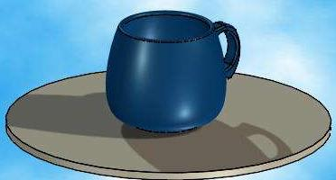

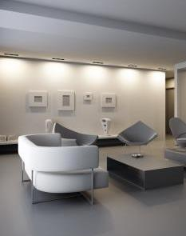

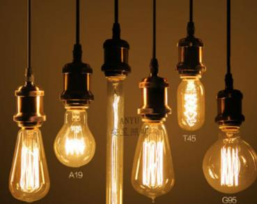

<!-- page: 31 -->

例:Phong模型的光照计算

问题

图中𝐍= (0,1,0),𝐋= (1,2, −1),𝐕= (1,1.5,0.5);

I𝑎= 0.1, Ie = 1; 𝐾𝑠= 0.8，𝐾d = 𝐾𝑎= 0.15; 𝑛= 4(衰减指数)

求Phong光照模型下𝑄的光强值

解：

𝑁∙𝐿
|𝑁||𝐿| =

2
6

L
Q 𝜶𝜶
𝜽

cos𝛼=

N

L∙N

N
|N| −L

𝑅= 2

|N|

= 0,4,0 −−1,2,1 = 1,2, −1

V
R

𝑅∙𝑉
|𝑅||V| =

3.5
6 3.5 =
0.583

cos𝜃=

I = 𝐾𝑎𝐼𝑎+ 𝐾𝑑𝐼𝑒𝑐𝑜𝑠𝛼+ 𝐾𝑠𝐼𝑒𝑐𝑜𝑠𝑛𝜃

2
6 + 0.8 × 10 × 0.5832 = 4.094

= 0.15 × 1 + 0.15 × 10 ×

31

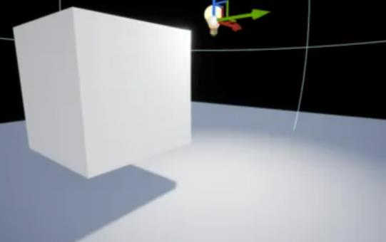

<!-- page: 32 -->

Phong模型效果图

Phong模型的光照明效果（Utah Teapot）

32

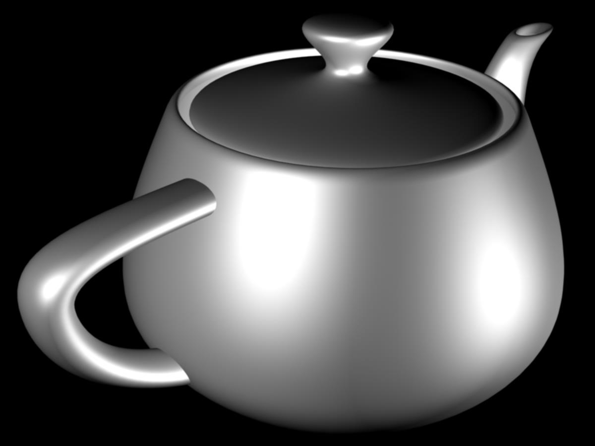

<!-- page: 33 -->

5 OpenGL函数--设置材质

void glMaterialfv( GLenum
face, GLenum
pname,
const GLfloat * params);

(1) face: GL_FRONT （正面）,

GL_BACK （背面）,
GL_FRONT_AND_BACK（正面+背面）

(2) pname: 材质参数类型

GL_AMBIENT(环境光),
GL_DIFFUSE (漫反射),
GL_SPECULAR(镜面反射),
GL_EMISSION(物体自身发光),
GL_SHININESS(镜面反射指数),
GL_AMBIENT_AND_DIFFUSE, or
GL_COLOR_INDEXES.

(3) params: parameter values (参数值)

33

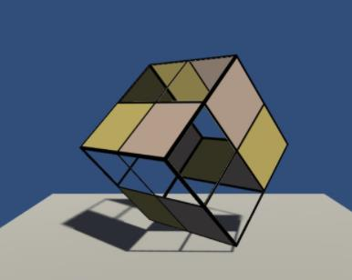

<!-- page: 34 -->

OpenGL函数—设置光源

void glLightfv(GLenum light, GLenum pname, GLfloat *params);

light: 光源编号

pname:

GL_AMBIENT,    GL_DIFFUSE,  GL_SPECULAR,

GL_POSITION (光源位置)

有向点光源方向: GL_SPOT_DIRECTION

点光源分布指数: GL_SPOT_EXPONENT

点光源范围:GL_SPOT_CUTOFF

衰减: GL_CONSTANT_ATTENUATION, GL_LINEAR_ATTENUATION

GL_QUADRATIC_ATTENUATION

params：相应参数

例: k={0.3,0.5,0.01};glLightfv(light0, GL_DIFFUSE, k);

34

<!-- page: 35 -->

OpenGL函数---法向设置

void glNormalfv(normal[]);

之后定义的顶点用此法向：glVertex3f(x,y,z)
例：

float n[3] = {0.866,0.500,0};
glNormalfv(n);
glBegin(GL_TRIANGLES)

glNormalfv(n);
glVertex3f(1,1,0);
glVertex3f(0,1,1);
glVertex3f(1,0,1);
glEnd()

35

<!-- page: 36 -->

光照明模型的进一步完善：图例

Cook-Torrence

模型效果

http://http://www.labri.fr/perso/knoedel/cmsimple/images/daimler/CookTorrance.jpg

36

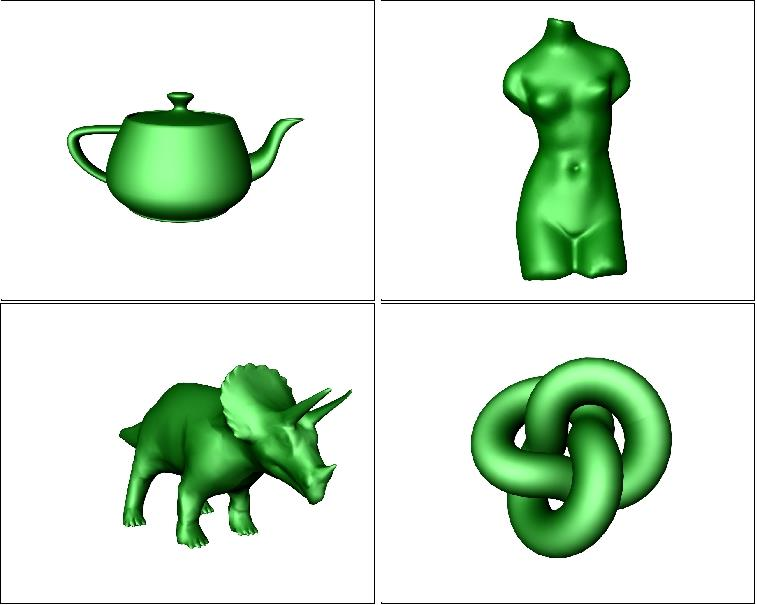

<!-- page: 37 -->

光照明模型的进一步完善：图例

采用BRDF模型绘制的茶壶

37

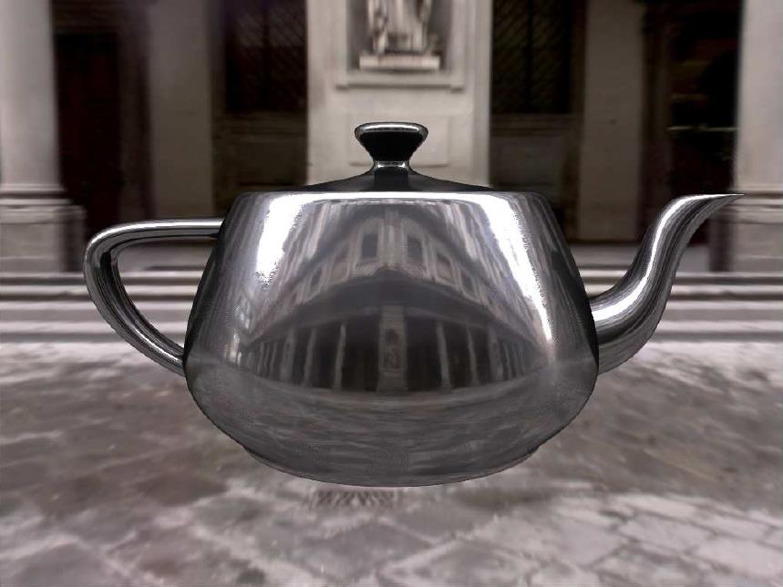

<!-- page: 38 -->

主要内容

引言

光照明模型

多边形物体的明暗处理(shading)

光线跟踪算法

纹理映射

38

<!-- page: 39 -->

6 多边形物体的明暗处理(着色/Shading)

明暗处理目的

简化局部光照的计算

效率与准确度的平衡

场景表示

多边形网格

三类明暗处理(Shading, 着色)方式

Flat Shading：计算多边形面的颜色

Gouraud Shading：计算多边形顶点颜色

Phong Shading：计算多边形中所有像素

颜色

39

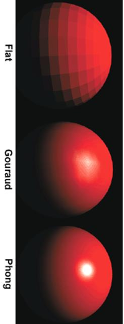

<!-- page: 40 -->

6.1 Flat Shading(平面着色)

方法

局部光照+多边形法向及其上一点颜色值C

该多边形在屏幕上的投影覆盖

的全部像素颜色均为C

优缺点

处理简单，计算量小

相邻多边间颜色差异大时，

存在马赫带效应

40

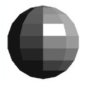

<!-- page: 41 -->

Flat Shading：平面着色示例

41

<!-- page: 42 -->

6.2 Gouraud Shading(着色)

思想：计算顶点颜色，内部点颜色通过插值得到

步骤

顶点法向计算；顶点颜色计算(如图IA, IB, I𝐶, I𝐷, I𝐸)

颜色插值：用多边形顶点光强

(颜色)作双线性插值得到多边形

内部各点的光强(颜色)

(𝑥𝑎, 𝑦𝑎)
(𝑥𝑑, 𝑦𝑑)

𝑦−𝑦𝑏
𝑦𝑎−𝑦𝑏𝐼𝐴+

𝑦𝑎−𝑦
𝑦𝑎−𝑦𝑏𝐼𝐵

边点颜色I1 =

(𝑥, 𝑦)
(𝑥2, 𝑦)
(𝑥1, 𝑦)

𝑦−𝑦c
𝑦𝑑−𝑦𝑐𝐼𝐷+

𝑦𝑑−𝑦
𝑦𝑑−𝑦𝑐𝐼𝐶

I2 =

𝑥2−𝑥
𝑥2−𝑥1 𝐼1 +

𝑥−𝑥1
𝑥2−𝑥1 𝐼𝐶

内部点颜色I =

(𝑥𝑐, 𝑦𝑐)
(𝑥𝑏, 𝑦𝑏)

42

<!-- page: 43 -->

Gouraud 着色示例

43

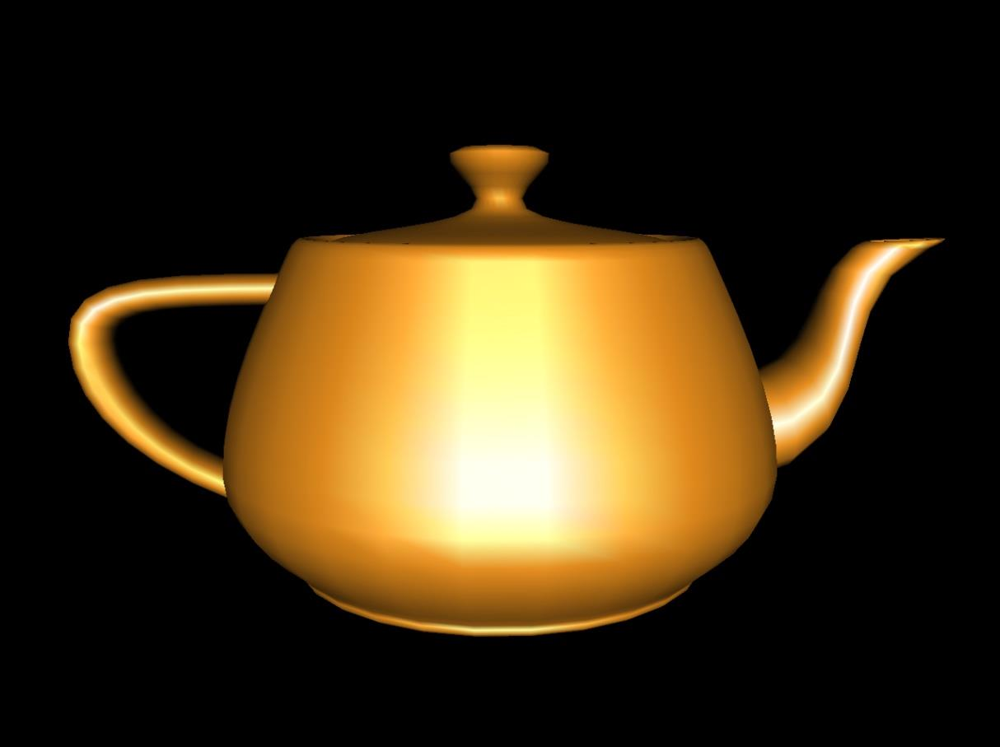

<!-- page: 44 -->

Gouraud 着色优缺点

优点

简单快速，所生成的图形在真实感上比Flat

Shading有了较大提高

缺点

仍然存在马赫带效应

不能正确模拟高光
(对粗网格模型尤其明显)

图中的多边形边是另外绘制的

44

<!-- page: 45 -->

附: Henry Gouraud

Henri Gouraud (born 1944) is a
French computer scientist. He is
the inventor of Gouraud shading
used in computer graphics.

During 1964–1967, he studied at École Centrale Paris.
He received his Ph.D. from the University of Utah College
of Engineering in 1971, working with Dave Evans and Ivan
Sutherland.

H. Gouraud, "Continuous shading of curved surfaces,"
IEEE Transactions on Computers, C-20(6):623–629, 1971.

45

<!-- page: 46 -->

OpenGL明暗设置函数

void glShadeModel ( GLenum mode)
mode:

GL_FLAT；
GL_SMOOTH

(默认值);

46

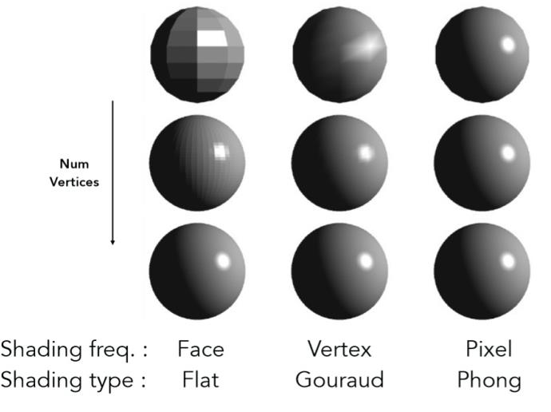

<!-- page: 47 -->

6.3 Phong着色(Shading)

思路：计算所有点的法向，计算所有点的光照

也叫法向插值着色

步骤

计算顶点法向

边上点的法向由顶点法向插值计算

内部点法向由边上点

法向插值计算

插值方法同颜色插值

P1
P2
P3
PA
PB

计算Phong model颜色

47

<!-- page: 48 -->

Phong Shading的优缺点

优点

更好地模拟高光(Able to

simulate specular light)

光强变化更自然(Light

intensity changes more
naturally)

缺点

计算代价高(Computational

cost is higher than that
of Gouraud Shading)

48

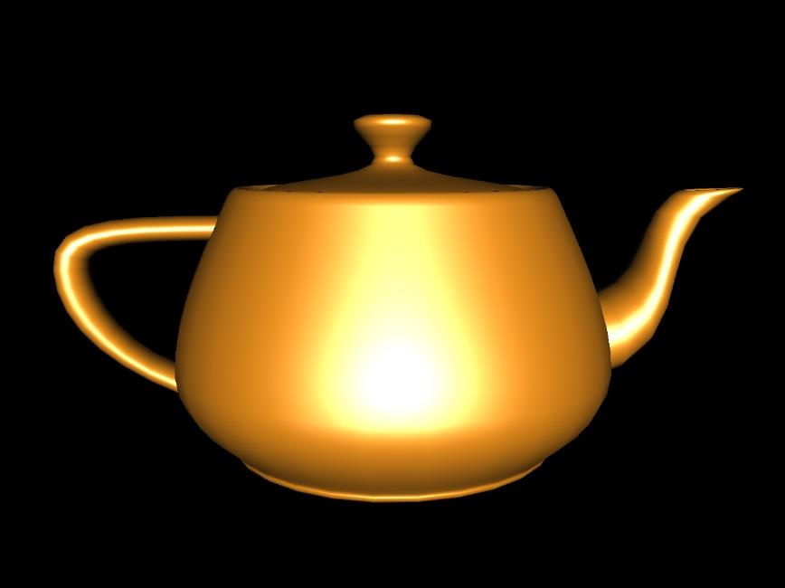

<!-- page: 49 -->

附：Bui Tuong Phong

Vietnamese: Bùi Tường Phong, December 14, 1942–

1975) was a Vietnamese-born computer graphics
researcher and pioneer

Ph.D. from the University of Utah in 1973.[1]

Phong knew that he was terminally ill with leukemia(白

血病) while he was a student. In 1975, after his tenure
at the University of Utah, Phong joined Stanford as a
professor. He died not long after finishing his
dissertation.

Bui Tuong Phong, "Illumination for Computer

Generated Pictures," Comm. ACM, Vol 18(6):311-317,
June 1975.

49
