# 12 illumination models (chap 12)

<!-- page: 1 -->

计算机图形学与虚拟现实

冼楚华
Email: chhxian@scut.edu.cn
华南理工大学计算机科学与工程学院

<!-- page: 2 -->

课程信息

• 授课老师姓名：冼楚华
• Email: chhxian@scut.edu.cn
• 个人主页：https://chuhuaxian.github.io/
• QQ：89071086 （比较少用，非急事请不要私聊）
• 办公室：B3-202-2
• 课程QQ群（见二维码）

<!-- page: 3 -->

主要内容

Introduction

光照模型(illumination models)

明暗处理(Polygon shading)

光线跟踪(Raytracing algorithm, Section 12.3)

纹理映射

3

<!-- page: 4 -->

https://haokan.baidu.com/v?vid=13080958122

684049492&pd=bjh&fr=bjhauthor&type=video

https://www.bilibili.com/video/BV1FJ41117wK/

https://www.bilibili.com/video/BV1fh411r7c7/

2007.10.11
浙江大学CAD&CG国家重点实验室
4

<!-- page: 5 -->

1 Whitted模型(global illumination model)

局部光照明模型的局限

只考虑从光源直接发出的光线对表面光亮度的贡献

不考虑光线在物体之间的相互反射和透射

Whitted模型：全局

光照明模型

某个点的光强与整个

场景相关

表面之间的镜面反射

透明物体的透射

5

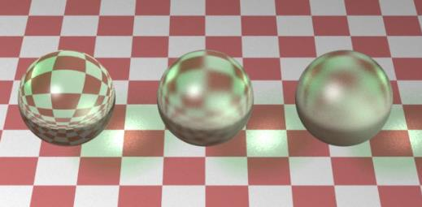

<!-- page: 6 -->

Whitted模型光照构成

物体表面点P的光亮度

来自三个方面

由光源直接照射引起的漫

反射和镜面反射光亮度
(local illumination)

场景间接引起的镜面反射

光(specular light)

透射光(transmission light)

6

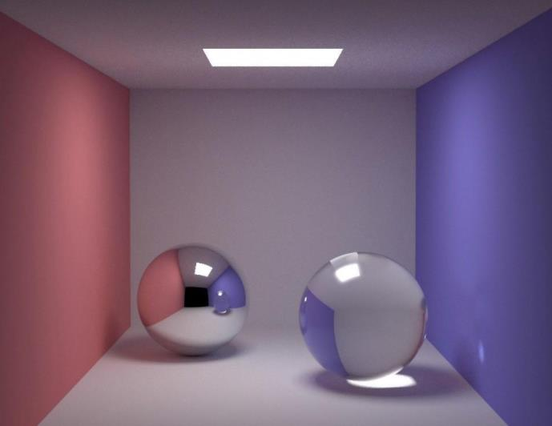

<!-- page: 7 -->

Whitted全局光照(illumination model)

I = I𝑐+ 𝐾𝑠I𝑟+ 𝐾tI𝑡

It
V

I𝑐：局部光照模型计算的光强
I𝑟：环境的镜面反射光
It：环境的规则透射光
𝑘𝑠：表面的镜面反射率
𝑘𝑡：表面的透射率

Is

7

Whitted T. An improved illumination model for shaded display[C]//Proceedings of the 6th
annual conference on Computer graphics and interactive techniques. 1979: 14.

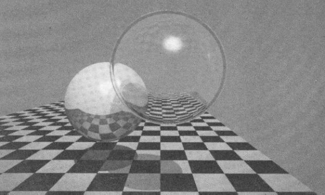

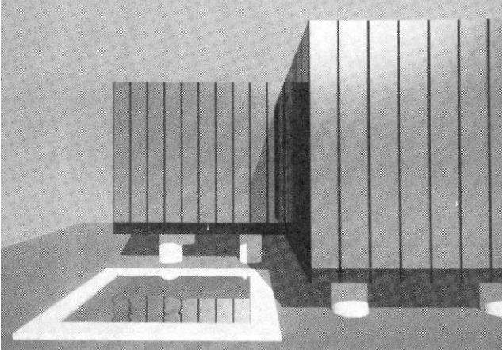

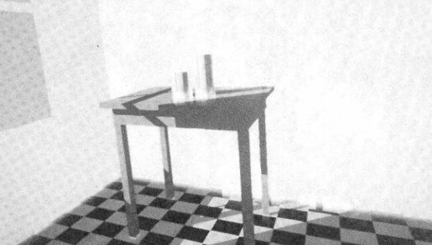

<!-- page: 8 -->

Whitted模型—-求解算法

光线跟踪

Whitted T,  An improved

illumination model for

shaded display,
Communications of the

ACM, 1980, 23(6):343-

349.

8

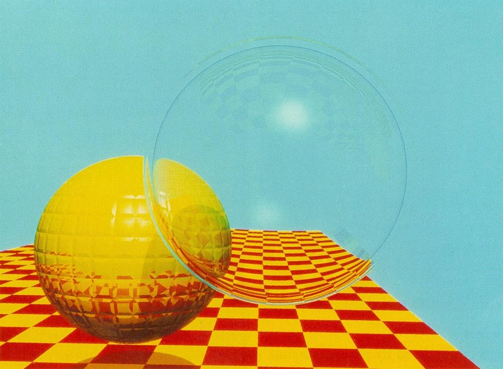

<!-- page: 9 -->

6 光照明模型的进一步完善

物体表面反射光线亮度可由一个各向异性函数描

述(如BRDF, Bidirectional reflectance
distribution function)

相关参数

入射光线方向

物体表面法向

观察方向

入射位置

出射位置…

9

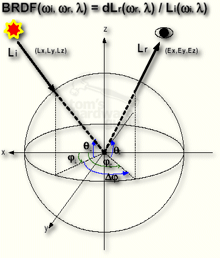

<!-- page: 10 -->

10

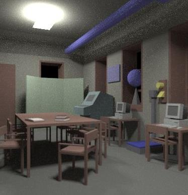

<!-- page: 11 -->

光照明模型的进一步完善

光照明模型分类

基于经验的简单光照明模型

Phong模型

Blinn-Phong模型(简化Phong)

基于物理的光照明模型

Cook-Torrence模型

辐射度光照模型

渲染方程Rendering equation

11

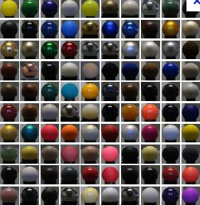

<!-- page: 12 -->

1 光线投射(Ray casting algorithm, RC)

一种光线/视线(Ray)与曲面相交测试方法

光线投射算法流程

对屏幕中的每个像素：

Step1：视点与象素连线与所有物

体求交

Step2：取离视点最近的交点

Step3：交点与所有光源连线作遮

挡测试𝑚𝑖= 1不遮挡，0遮挡

Step4：局部光照模型计算交点处

颜色

Roth, Scott D. (February 1982), "Ray Casting for Modeling Solids",
Computer Graphics and Image Processing 18: 109–14

12

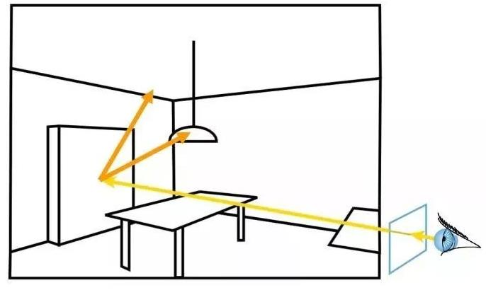

<!-- page: 13 -->

光线投射—步骤

Step1: 求视线与场景的所有交点(Find intersections)

交点

视点

光线

视线

像素

13

<!-- page: 14 -->

光线投射--步骤

Step2: 找到最近交点(消隐)

Step3: 与光源连线，遮挡测试

此交点为所需

视点

视线

光线

像素

14

<!-- page: 15 -->

光线投射--步骤(4)

Step 4:  计算局部光照

𝑚𝐼𝑖(𝐾𝑑𝑐𝑜𝑠𝛼𝑖+ 𝐾𝑠𝑐𝑜𝑠𝑛𝛾𝑖)

I = 𝐾𝑎𝐼𝑎+ σ𝑖=1

15

<!-- page: 16 -->

问题

光线投射是图像空间还是对象空间方法?

场景中有参数曲面时，是否必须三角剖分？

光线投射如何消隐？

光线投射如何产生阴影？

16

<!-- page: 17 -->

2 光线跟踪(Ray Tracing)

17

<!-- page: 18 -->

光线跟踪算法(Ray tracing algorithm)

一个重要的全局光照算法(An important

photorealistic algorithm)

受光线投射算法启发(ray casting algorithm)

特点

思想简单(Simple)

计算全局光照, 更强的真实感效果(More realistic)

适合镜面反射、折射场景

计算代价高(High cost)

18

<!-- page: 19 -->

光照模型: 全局光照

𝐼= 𝐼𝑐+ 𝐾𝑠𝐼𝑟+ 𝐾𝑡𝐼𝑡

逐像素计算

通过追踪光线收集进入视点的光强值

𝐼𝑐：局部光照模型计算的光强
𝐼𝑟：环境的镜面反射光
𝐼𝑡：环境的规则透射光
𝑘𝑠：表面的镜面反射率
𝑘𝑡：表面的透射率

It

Is

V

19

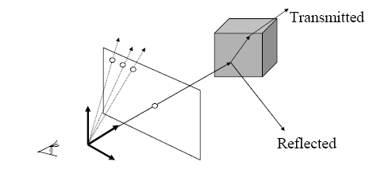

<!-- page: 20 -->

光线跟踪(Ray Tracing)---逆向思想

逆向追踪

追踪视线方向来的光线，而非光源发出的每条光线

三种光线

来自光源；

反射方向(Reflection)；

折射(Refraction)

20

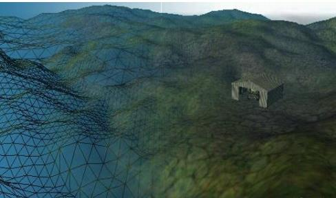

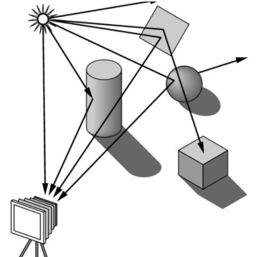

<!-- page: 21 -->

3 光线跟踪算法流程

对指定分辨率图像的每个像素{

Step 1 引过视点的射线R
Step 2 计算R跟所有物体的交点
Step 3 选取离视点最近交点P
Step 4 计算P点局部光照𝐼𝑐
Step 5 从P点发出反射线𝑅𝑟
Step 6 从P点发出折射线𝑅𝑡(透明)
Step 7 递归地计算𝐼𝑟和𝐼𝑡
Step 8 求和𝐼𝑝= 𝐼𝑐+ 𝑘𝑠𝐼𝑟+ 𝑘𝑡𝐼𝑡
}

21

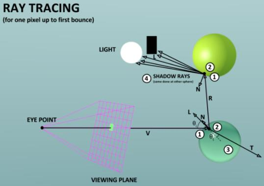

<!-- page: 22 -->

光线树(Ray tree of a ray)

光线跟踪得到

ray

t4

一棵二叉树

t32

r5

r1
t1

O2

交点为节点

r4

光线为边

r2
t2

r32

t2

Q

O1

r31
t31

r32
t32

t1

t5

r2

r31

…
…

r4
t4

P

ray

t31

r1

r5
t5

屏幕
像素

…
…
…
…

视点

22

<!-- page: 23 -->

光线跟踪递归终止条件

满足如下三个条件之一，不再发射光线

射线不与任何物体或只

与漫反射面相交

射线的贡献太小

射线达到最大递归深度

23

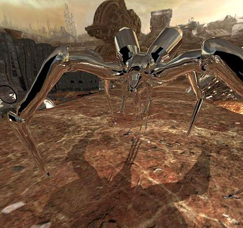

<!-- page: 24 -->

4 伪代码(1)----遍历所有像素

Whitted_Illumination_Model( ) {

for(each pixel) {

create ray R from viewpoint V to the pixel;
depth = 0;   //递归深度
ratio = 1.0;  //当前光线的衰减系数，1.0表示无衰减
RayTracer(R, ratio, depth, color);
//color是光线跟踪返回的颜色值
pixel  color;
}
}

24

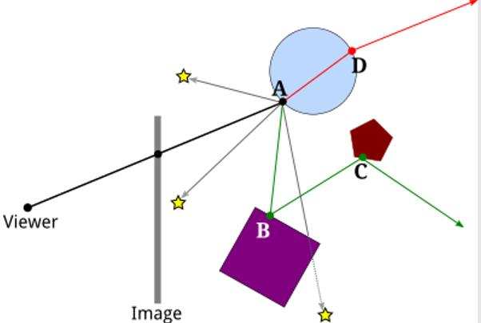

<!-- page: 25 -->

伪代码(2)----光线跟踪器

RayTracer(R, ratio, depth, color) //说明：光线跟踪子函数
{     // color用于传回结果

if(ratio < THRESHOLD) {
//终止条件2:衰减小于阈值

color 0;  return;
}
if(depth > MAXDEPTH) {

//终止条件3:递归到最大次数

color 0;  return;
}
//continued

25

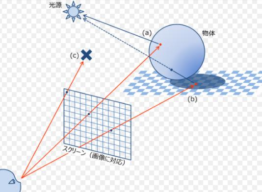

<!-- page: 26 -->

伪代码(3)----计算交点和局部光照

P FindNearestIntersection(R) ；//计算R的可见点P
if(P==NULL) {  // 终止条件1

color0 ;    //置为黑色
return;
}
local_colorPhongModel(P)；

// Ray casting(从P发射射线
// 到每个点光源测试是否遮挡

26

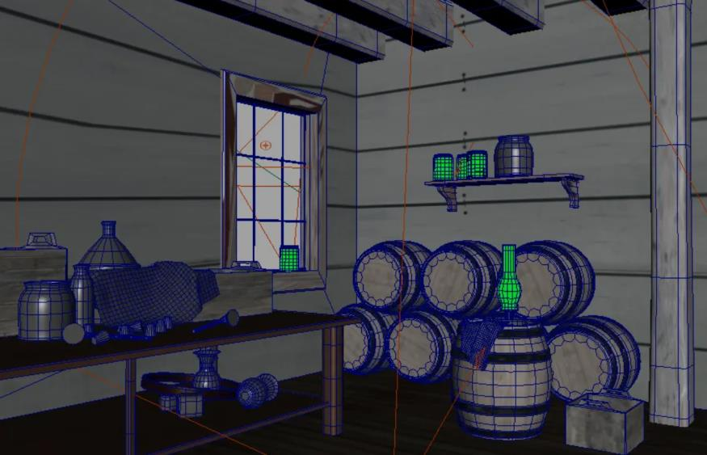

<!-- page: 27 -->

伪代码(4)----计算反射和透射光线

if(交点P所在的表面为光滑镜面) {

计算反射光线𝑅𝑟;
//递归调用！
RayTracer(𝑅𝑟, 𝑘𝑠*ratio,

depth+1, reflected_color);
}
if(交点P所在的表面为透明表面) {

计算透射光线𝑅𝑡;
//递归调用！

RayTracer(𝑅𝑡, 𝑘𝑡*ratio,

depth+1, transmitted_color);
}
// continued

27

<!-- page: 28 -->

伪代码(5)----计算全局光照

//Whitted光照模型

color = local_color +𝑘𝑠*reflected_color + 𝑘𝑡*transmitted_color;
} //Raytracer结束

在OPENGL环境下如何实现？请参考: Ray Tracing in One Weekend by Peter Shirley

28

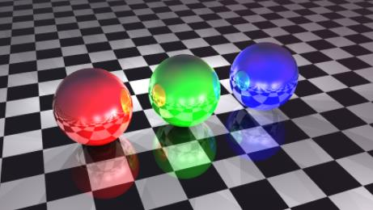

<!-- page: 29 -->

光线跟踪细节详释

如何表示射线

射线与几何体的求交

反射方向估计

折射方向估计

阴影生成

29

<!-- page: 30 -->

细节1：射线表示(Ray)

射线的参数表示(Parametric representation)

𝐑𝑡
= 𝑃+ 𝑡𝐃

即：
𝑥𝑡= 𝑥𝑃+ 𝑡𝑥𝐷,
𝑦𝑡= 𝑦𝑃+ 𝑡𝑦𝐷,
𝑧𝑡
= 𝑧𝑃+ 𝑡𝑧𝐷.

𝐑𝑡

𝑃(𝑥𝑃, 𝑦𝑃, 𝑧𝑃)

𝑃= 𝑥𝑃, 𝑦𝑃, 𝑧𝑃: 起点

𝐃= 𝑥𝐷, 𝑦𝐷, 𝑧𝐷: 射线方向(单位矢量)

> 0
点在光线的正方向
= 0
起点P
< 0
光线负方向，交点无效

𝑡ቐ

30

<!-- page: 31 -->

细节2：线面求交的一般形式

光线方程：𝑹(𝑡) = 𝑃+ 𝑡𝑫

物体表面的表示

𝑃(𝑥𝑃, 𝑦𝑃, 𝑧𝑃)

隐式方程𝑓𝑥, 𝑦, 𝑧= 0;

参数方程𝑥, 𝑦, 𝑧= 𝐠(𝑢, 𝑣);

线面求交

隐式表示需解单未知量方程

𝑓𝑃+ 𝑡𝑫= 0

参数表示需解三元方程

𝑹(𝑡) = 𝐠(𝑢, 𝑣)

弊端：复杂度高、误差累积、不收敛

31

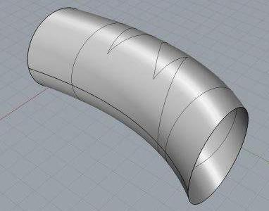

<!-- page: 32 -->

细节2.1：光线与球面求交(Ray and sphere)

球面隐式方程

(𝑥−𝑐𝑥)2+(𝑥−𝑐𝑦)2+(𝑥−𝑐𝑧)2−𝑟2 = 0

射线方程𝑥𝑡= 𝑥𝑃+ 𝑡𝑥𝐷, 𝑦𝑡= 𝑦𝑃+ 𝑡𝑦𝐷,𝑧𝑡= 𝑧𝑃+ 𝑡𝑧𝐷.

代入球面方程得到𝑡的二次方程

A𝑡2 + 𝐵𝑡+ 𝐶= 0
其中𝐴= 𝑥𝐷2 + 𝑦𝐷2 + 𝑧𝐷2 = 1 (假设光线方向为单位向量）

解一元二次方程，得到交点参数值

z
𝑃(𝑥𝑃, 𝑦𝑃, 𝑧𝑃)

1
2 −𝐵+
𝐵2 −4𝐶;

𝑡1 =

1
2 (−𝐵−
𝐵2 −4𝐶).

𝑡2 =

y

三种情况:
𝑡2 < 𝑡1 < 0;  𝑡2 < 0 ≤𝑡1; 0 ≤𝑡2 < 𝑡1. x

32

<!-- page: 33 -->

细节2.2：光线与三角形求交(Ray and triangle)

问题描述：求三角形与射线的交点

三角形：v𝑖= 𝑥𝑖, 𝑦𝑖, 𝑧𝑖, 𝑖= 1,2,3.

射线：𝑃= 𝑥𝑝, 𝑦𝑝, 𝑧𝑝, D = 𝑥𝑟, 𝑦𝑟, 𝑧𝑟

射线

基本方法

求射线与三角形所在平面的交点

判断交点是否位于三角形内部

平面方程求解

𝑃

(v2−v1)×(v3−v1)
|(v2−v1)×(v3−v1)|
方程[ 𝑥, 𝑦, 𝑧−v1] ∙n = 0

法向n =

三角形

33

<!-- page: 34 -->

细节2.2.1 光线与三角形所在平面求交

一般地，平面方程可写为

𝑎𝑥+ 𝑏𝑦+ 𝑐𝑧+ 𝑑= 0, 𝐧= (𝑎, 𝑏, 𝑐)

光线方程𝐑(𝑡) = 𝑃+ 𝑡𝐃代入平面方程得

𝑃+ 𝑡𝐃· 𝐧+ d = 0
𝑡∗= −(𝑃· 𝐧+ 𝑑)/(𝐃· 𝐧)

D · 𝐧= 0:光线与平面平行,无交点

𝑡∗< 0: 交点位于射线之外,无效，舍弃

代入光线方程得到光线与平面的交点I = 𝐑(𝑡)

𝒗𝟑

𝐃

z

𝒗𝟏

y

x

P

𝒗𝟐

34

<!-- page: 35 -->

细节2.2.2 判断交点是否位于三角形内

将3D三角形内的点判别转化到二维平面

y

二维示例

理想的投影平面：o𝑥𝑦, 𝑜𝑦𝑧, 𝑜𝑧𝑥.

投影方法

设平面方程为𝐴𝑥+ 𝐵𝑦+ 𝐶𝑧+ 𝐷= 0，依据

o

|𝐴|, |𝐵|, |𝐶|大小决定投影平面

x

z

若|𝐴| = max(|𝐴|, |𝐵|, |𝐶|)，取yoz

若|𝐵| = max(|𝐴|, |𝐵|, |𝐶|)，取zox

若|𝐶| = max(|𝐴|, |𝐵|, |𝐶|)，取xoy

y

x

35

<!-- page: 36 -->

例:光线与三角形相交判断

三角形3,1,3 , 10,1,3 , (3,8,3)

平面方程为

𝑧= 3，即(𝑎, 𝑏, 𝑐, 𝑑) = (0,0,1, −3)
此时|𝑐|最大，取oxy为投影平面, 利用𝑥, 𝑦坐标进行计算

2D平面上如何判定点在三角形内?

y

y

直线方程

重心坐标

射线求交

x
o

x
o

…

z

36

<!-- page: 37 -->

细节3：反射方向计算

设L为射线方向,N为射线与物体交点P处的法向

Rr = L −2(L · N )N

P：入射光线L和物体的交点；
N: 点P处表面法向；
Rr : 镜面反射方向;
𝜃𝑖(= 𝜃𝑟): -L与N的夹角；
𝜃𝑟(= 𝜃𝑖): Rr与N的夹角；

N
R𝒓

L
Rr

θi
θr

P

(注：L，N均为单位矢量)

37

<!-- page: 38 -->

细节4：折射方向计算

𝑃: 入射光线𝐿和物体的交点；𝑁: 𝑃处的物体表面法向

R𝑡为透射光线的方向

N

Snell定律
(1)介质1: 折射率𝜂1;   介质2:折射率𝜂2
(2)𝐿与表面法向𝑁的夹角为θ1
(3)R𝑡与𝑁的夹角为θ2，则有

L

θ1

η1

P

η2
𝑀

𝜂1𝑠𝑖𝑛θ1 = 𝜂2𝑠𝑖𝑛θ2

𝜂1𝑠𝑖𝑛θ1

𝑠𝑖𝑛θ2 =

𝜂2
, cosθ2

θ2

R𝒕= −𝑁cosθ2 + 𝑀𝑠𝑖𝑛θ2

-N

Rt

38

<!-- page: 39 -->

细节5：局部光照𝐼c的阴影计算(shadow)

从P向光源L发射一条阴影测试光线R

若R与途中的物体不相交，则点P受光源L直接照射

否则，点P位于光源阴影之中

光源

阴影测试
光线与物
体的交点

阴影
测试
光线

注：面光源可以用离
散的点光源近似。

P
P’

39

<!-- page: 40 -->

细节6：阴影计算

包含阴影计算的Phong模型

𝑚

{𝑓𝑖(𝑃) 𝐼𝑖𝐾𝑑𝑁∙𝐿𝑖+ 𝐾𝑠(𝑁∙𝐻𝑖)𝑛}

I 𝑃= 𝐾𝑎𝐼𝑎+ ෍

𝑖=1

𝑓𝑖𝑃= ቊ1
点P受光源𝑖直接照射
0
点P未受光源𝑖直接照射

40

<!-- page: 41 -->

光线跟踪阴影效果

41

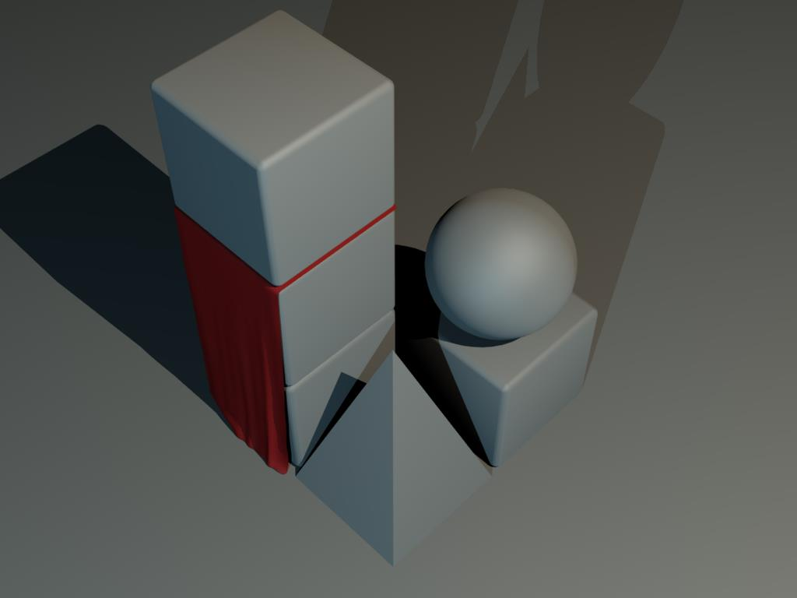

<!-- page: 42 -->

小结：光线跟踪中的四类光线

视线Eye ray

从视点发出

光源线Shadow ray

从物体表面上的点向

光源发出

反射线Reflected ray

从物体表面上的点沿

镜面反射方向发出

折射线Refracted ray

从物体表面上的点沿透射方向发出

42

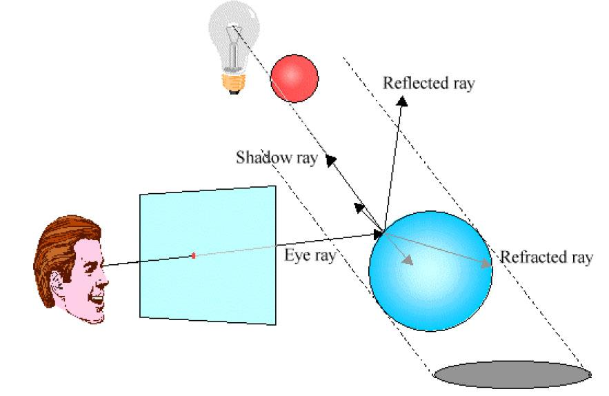

<!-- page: 43 -->

走样(Antialias)

引起走样的原因

光线跟踪算法本质上是对画面的点采样

示例

43

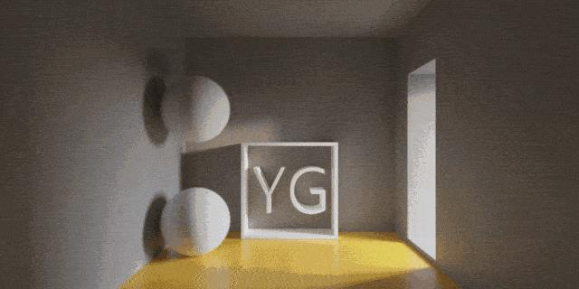

<!-- page: 44 -->

反走样(Antialias)处理方法

超采样：一个像素发出多条射线(rays)

自适应超采样: 几何细节丰富的地方多发射线

44

<!-- page: 45 -->

反走样效果示例

45

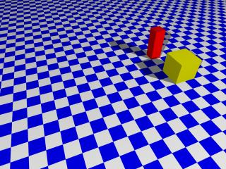

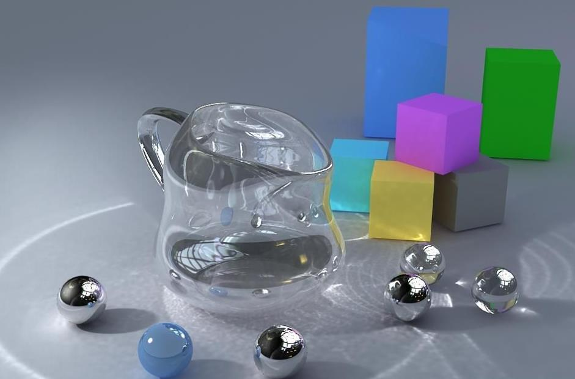

<!-- page: 46 -->

加速(Acceleration)

为什么要进行加速？

常用加速技术

包围盒技术

层次包围盒(Bounding Volume Hierarchies BVH)

空间分割技术

46

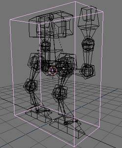

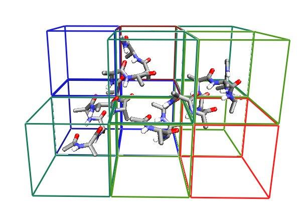

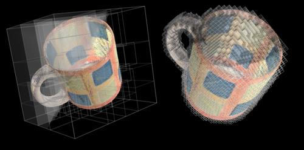

<!-- page: 47 -->

包围盒(Bounding box)

将场景按空间位置关系分层次组织成树状结构

根结点：整个场景

中间结点：空间位置较为接近的一组表面

叶结点：单个景物表面

树结点中的面片集都用简单包围盒包裹

光线与包围盒有交时，才进行光线与其中所含

的景物面片求交运算

光线与包围盒不相交，必定不与其中所含的景物面

片相交

47

<!-- page: 48 -->

层次包围盒(Hierarchical bounding box)

层次包围盒示例

48

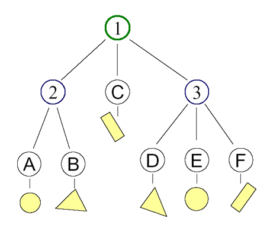

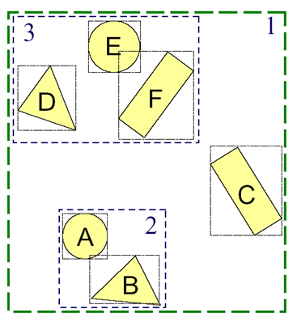

<!-- page: 49 -->

其他包围盒

常用包围盒

长方形包围盒

包围球

包围圆柱

平行2n面体

(a)                                          (b)                                       (c)                                           (d)

49

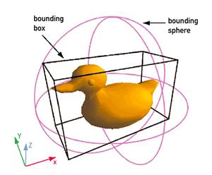

<!-- page: 50 -->

空间分割技术

原理

将景物空间分割成一个个小的空间单元

被跟踪的光线仅与它所穿过空间单元中所含物体表

面进行求交测试

利用相邻空间单元的空间连贯性，使光线快速跨越

空单元，迅速到达非空单元，求得光线与景物的第
一个交点

50

<!-- page: 51 -->

空间分割技术

典型方法

均匀网格:四叉树（二维）/八叉树（三维）

Kd树

BSP树

51

<!-- page: 52 -->

一个光线跟踪器：POV-Ray

开源光线跟踪软件POV－Ray简介

http://www.povray.org

52

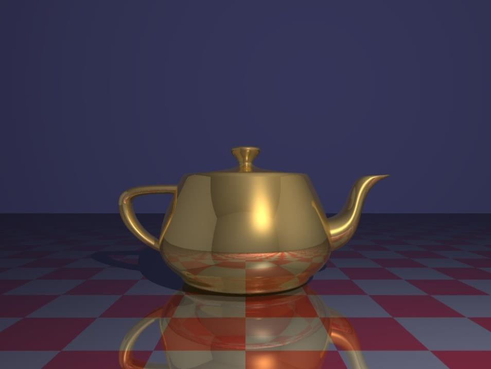

<!-- page: 53 -->

一个光线跟踪器：POV-Ray

Berger-Perrin T. The sphere flake, in 100 lines

of c code.

http://ompf.org/ray/

sphereflake/

53

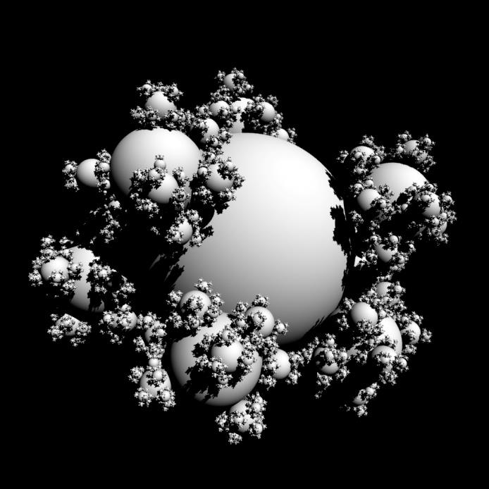

<!-- page: 54 -->

J. Turner Whitted (Ph.D in 1978, NCSU)

Companies

Microsoft Corporation, Numerical Design Limited, Bell Labs

Microsoft Corporation

Senior Researcher, Hardware Devices and Graphics

Movies and computer games
In the lineage of Woody, Buzz, Shrek and  the
Matrix's Neo, …, a lot of characters and effects.

A private pilot and an avid sailor.

The CG Achievement Award

1986. ACM Fellow; National Academy of
Engineering.

54

