# 4- Line Segment and Polygon Scan Conversion

<!-- page: 1 -->

计算机图形学与虚拟现实

冼楚华
Email: chhxian@scut.edu.cn
华南理工大学计算机科学与工程学院

<!-- page: 2 -->

课程信息

• 授课老师姓名：冼楚华
• Email: chhxian@scut.edu.cn
• 个人主页：https://chuhuaxian.github.io/
• QQ：89071086 （比较少用，非急事请不要私聊）
• 办公室：B3-202-2
• 课程QQ群（见二维码）

<!-- page: 3 -->

内容

线段扫描转换
(Scan conversion of line segments)

DDA算法(DDA algorithm)

Bresenham 算法(Version 7-Sect. 8.9)

多边形扫描转换
(Scan conversion of polygon)

区域填充

多边形扫描转换
(Version 7: Sections 8.10)

3

<!-- page: 4 -->

内容

线段扫描转换

DDA algorithm

Bresenham algorithm (Section 8.9)

多边形扫描转换

Fill-area algorithms

Scan-line polygon-fill algorithm
(Version 7 Section 8.10)

4

<!-- page: 5 -->

扫描转换(Scan conversion)?

几何图元的扫描转换

(线段,圆,多边形,椭圆等)

图形学所处理的图形都是用数学

工具来表示，在点阵设备上显示

在点阵中找到基于数学表示

的几何图元的最优近似点集

本质上是一个采样问题

(Scan conversion A. K. A. Rasterization)

5

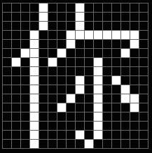

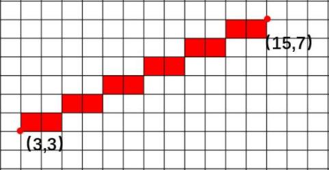

<!-- page: 6 -->

例: 线段(0,0)—(5,3)

最优点集

点到直线上距离最小

某一行(列)上的点中

到直线距离最小的点

<!-- page: 7 -->

直线方程

--𝑦= 𝑚𝑥+ 𝐵, 𝑥𝑠≤𝑥≤𝑥𝑒, |𝑚| ≤1

--𝑥𝑠= 𝑎, 𝑥𝑒= 𝑎+ 𝑛均为整数,

𝑚是直线的斜率

𝑦= 𝑚𝑥+ 𝐵

𝑥𝑠
𝑥𝑒

<!-- page: 8 -->

特殊情形:水平,竖直,45度

𝑦= 2, 1 ≤𝑥≤5

y = 2

𝑥= 3, 2 ≤𝑦≤6

𝑦= 𝑥, 1 ≤𝑥≤4

x = 3
y = x

8

<!-- page: 9 -->

1 一个平凡的光栅化方法

𝑥依次取如下的像素坐标𝑥𝑖

𝑎, 𝑎+ 1, 𝑎+ 2, ⋯, 𝑎+ 𝑛

用直线方程计算相应的𝑦𝑖

𝑥𝑠= 𝒂
𝑥𝑒= 𝒂+ 𝒏

𝑥𝑖= 𝑎+ 𝑖→𝑦𝑖= 𝑚𝑥𝑖+ 𝐵.

用像素点(𝑥𝑖, 𝑟𝑜𝑢𝑛𝑑(𝑦𝑖)) 逼近上述直线段

上的点(𝑥𝑖, 𝑦𝑖)

where 𝑟𝑜𝑢𝑛𝑑(𝑦𝑖) is the integer nearest to 𝑦𝑖

<!-- page: 10 -->

(𝑥𝑖,Floor(𝑦𝑖+ 0.5))

(𝑥𝑖, 𝑦𝑖)

可以用取整数函数来计算最近的整数

值Floor(𝑦𝑖+ 0.5)

<!-- page: 11 -->

例子：平凡算法画线段1,1 −(6,4)

线段方程

y = 0.6𝑥+ 0.4, 𝑥= 1,2,3,4,5,6
𝑥1 = 1, 𝑦1 = 0.6 × 1 + 0.4 = 1,  draw (1,1)
𝑥2 = 2, 𝑦2 = 0.6 × 2 + 0.4 = 1.6, draw (2,2)
𝑥3 = 3, 𝑦3 = 0.6 × 3 + 0.4 = 2.2, draw (3,2)
𝑥4 = 4, 𝑦4 = 0.6 × 4 + 0.4 = 2.8, draw (4,3)
𝑥5 = 5, 𝑦5 = 0.6 × 5 + 0.4 = 3.4, draw (5,3)
𝑥6 = 6, 𝑦6 = 0.6 × 6 + 0.4 = 4,    draw (6,4)

11

<!-- page: 12 -->

2 DDA算法(Digital differential analyzer)

平凡算法的缺点

多次乘法运算, 取整运算

注意到𝑥𝑖每次增加1

𝑥𝑠= 𝒂
𝑥𝑒= 𝒂+ 𝒏

𝑥𝑖+1 = 𝑥𝑖+ 1.
𝑦𝑖+1可以简化为：

𝑦𝑖+1 = 𝑚𝑥𝑖+1 + 𝐵

(𝑥𝑖+ 1, 𝑦𝑖+ 𝑚+ 0.5 )

= 𝑚(𝑥𝑖+ 1) + 𝐵
= 𝑚+ (𝑚𝑥𝑖+ 𝐵)
= 𝑦𝑖+ 𝑚.

(𝑥𝑖, 𝑦𝑖)

(𝑥𝑖+ 1, 𝑦𝑖+ 𝑚)

<!-- page: 13 -->

DDA画线算法伪代码

void lineDDA(int x0, int x1, int y0, int y1){  //可处理任意斜率

int dx = x1-x0, dy = y1-y0, step, k;

float x_inc, y_inc, x = x0, y= y0;

if (|dx| > |dy|)   //斜率绝对值小于1

step = dx;

else                 //斜率绝对值大于1

step = dy;

x_inc = (float)dx/step;  y_inc = (float)dy/step;

glPointSize(3); glColor3f(1.0, 0.0, 0.0);

glBegin(GL_POINTS);

for(k = 0; k <=step; k++){

glVertex2i(int(x+0.5), int(y+0.5)); //画像素

x += x_inc; y += y_inc;

}

glEnd();

}

<!-- page: 14 -->

例：DDA算法画线段1,1 −(6,4)

线段方程

y = 0.6𝑥+ 0.4, 𝑥= 1,2,3,4,5,6

初始化：𝑑𝑥= 5, 𝑑𝑦= 3, 𝑠𝑡𝑒𝑝= 5, 𝑥𝑖𝑛𝑐= 1, 𝑦𝑖𝑛𝑐= 0.6

𝑥1 = 1, 𝑦1 = 1,    draw (1,1)
𝑥2 = 2, 𝑦2 = 𝑦1 + 0.6 = 1.6, draw (2,2)
𝑥3 = 3, 𝑦3 = 𝑦2 + 0.6 = 2.2, draw (3,2)
𝑥4 = 4, 𝑦4 = 𝑦3 + 0.6 = 2.8, draw (4,3)
𝑥5 = 5, 𝑦5 = 𝑦4 + 0.6 = 3.4, draw (5,3)
𝑥6 = 6, 𝑦6 = 𝑦5 + 0.6 = 4,    draw (6,4)

14

<!-- page: 15 -->

一般情形处理

伪代码中考虑了任意情斜率线段的光栅化

(|m| ≤ 1, and |m| >1)

斜率绝对值大于1时, 每次y坐标增加1

<!-- page: 16 -->

3 Bresenham算法

DDA 利用了𝑦𝑖的结果来计算𝑦𝑖+1, 减少1次乘积;

仍然需要取整

Bresenham算法: 下一次可选点的约束

当前像素一旦确定, 下一个点是有限制的，只能从2

个中点选一个

算法只涉及

(𝑥𝑖+ 1, 𝑦𝑖+ 𝑚+ 0.5 )

+，-，移位

用于绘图仪、

(𝑥𝑖, 𝑦𝑖)

(𝑥𝑖+ 1, 𝑦𝑖+ 𝑚)

显卡等硬件实现

(𝑥𝑖, 𝑦𝑖+ 0.5 )

<!-- page: 17 -->

记号

线段的两个端点: 从𝑥0, 𝑦0 到𝑥1, 𝑦1

不妨设∆𝑥= 𝑥1 −𝑥0 > 0, ∆𝑦= 𝑦1 −𝑦0 >0,

记斜率𝑚=∆𝑦

∆𝑥，且约定𝑚< 1

线段上点𝑥𝑖, 𝑦𝑖对应的像素点为
ҧ𝑥𝑖, ത𝑦𝑖

(𝑥1, 𝑦1)

(𝑥0, 𝑦0)

<!-- page: 18 -->

Bresenham的观察:缩小可选点范围

Bresenham 算法

也是从𝑥= 𝑥0出发, 每次增加1

记选中的第𝑖个像素点为( ҧ𝑥𝑖,ത𝑦𝑖)

第𝑖+ 1个像素点只能从下面2个点中的一个

(ഥ𝒙𝒊+1,ഥ𝒚𝒊), (ഥ𝒙𝒊+1,ഥ𝒚𝒊+ 1)

( lj𝑥𝑖+ 1, lj𝑦𝑖+ 1)

怎么选？

( lj𝑥𝑖, lj𝑦𝑖)

( lj𝑥𝑖+ 1, lj𝑦𝑖)

( lj𝑥𝑖+ 1, lj𝑦𝑖)

<!-- page: 19 -->

选点判定准则(Criteria)

选择离直线较近的那个像素点, 也是离

(𝑥𝑖+1, 𝑦𝑖+1) 较近的点

𝑥𝑖+1 = 𝑥𝑖+ 1
𝑦𝑖+1 = 𝑚𝑥𝑖+1 + 𝐵

( lj𝑥𝑖+ 1, lj𝑦𝑖+ 1)

(𝑥𝑖+1, 𝑦𝑖+1)

( lj𝑥𝑖, lj𝑦𝑖)

= 𝑚𝑥𝑖+ 𝑚+ 𝐵

( lj𝑥𝑖+ 1, lj𝑦𝑖)

<!-- page: 20 -->

判别准则计算

两个像素到(𝑥𝑖+1, 𝑦𝑖+1)

( lj𝑥𝑖+ 1, lj𝑦𝑖+ 1)

d𝑢𝑝𝑝𝑒𝑟

的距离分别为：

(𝑥𝑖+1, 𝑦𝑖)

𝑑𝑙𝑜𝑤𝑒𝑟
𝑑𝑢𝑝𝑝𝑒𝑟= lj𝑦𝑖+ 1 −𝑦𝑖+1

= lj𝑦𝑖+ 1 −𝑚𝑥𝑖+1 −𝐵

( lj𝑥𝑖, lj𝑦𝑖) ( lj𝑥𝑖+ 1, lj𝑦𝑖)

𝑑𝑙𝑜𝑤𝑒𝑟= 𝑦𝑖+1 −lj𝑦𝑖

= 𝑚𝑥𝑖+1 + 𝐵−lj𝑦𝑖

判定：1）𝑑𝑙𝑜𝑤𝑒𝑟−𝑑𝑢𝑝𝑝𝑒𝑟> 0 取右上方点；

2）𝑑𝑙𝑜𝑤𝑒𝑟−𝑑𝑢𝑝𝑝𝑒𝑟< 0 取右边点；

3）𝑑𝑙𝑜𝑤𝑒𝑟−𝑑𝑢𝑝𝑝𝑒𝑟= 0 可任取，如取右边点。

<!-- page: 21 -->

判别标准化简

𝑑𝑙𝑜𝑤𝑒𝑟−𝑑𝑢𝑝𝑝𝑒𝑟= 𝑚(𝑥𝑖+ 1) + 𝐵−lj𝑦𝑖

−( lj𝑦𝑖+ 1 −𝑚(𝑥𝑖+ 1) −𝐵)
= 2𝑚(𝑥𝑖+ 1) −2 lj𝑦𝑖+ 2𝐵−1

上式与下式符号相同

lj𝑦𝑖+1

重要
d𝑢𝑝𝑝𝑒𝑟

𝑝𝑖= Δ𝑥• 𝑑𝑙𝑜𝑤𝑒𝑟−𝑑𝑢𝑝𝑝𝑒𝑟

𝑑𝑙𝑜𝑤𝑒𝑟

= 2Δy • (𝑥𝑖+ 1) −2Δ𝑥• lj𝑦𝑖+ (2𝐵−1)Δ𝑥

= 2Δ𝑦• 𝑥𝑖−2Δ𝑥• lj𝑦𝑖+ (2𝐵−1)Δ𝑥+ 2Δ𝑦
= 2Δ𝑦• 𝑥𝑖−2Δ𝑥• lj𝑦𝑖+ 𝑐

lj𝑦𝑖
lj𝑦𝑖

注：

Δ𝑥= 𝑥1 −𝑥0, Δ𝑦= y1 −𝑦0, 𝑚= Δ𝑦/Δ𝑥
c = (2𝐵−1)Δ𝑥+ 2Δ𝑦

<!-- page: 22 -->

𝑝𝑖的迭代公式

If    𝑝𝑖> 0
then (𝑥𝑖+1,ത𝑦𝑖+ 1) is selected

if
𝑝𝑖< 0
then (𝑥𝑖+1,ത𝑦𝑖) is selected

If   𝑝𝑖= 0
one of the above two

虽然𝑝𝑖都是整数运
算，但仍然需要2
次乘积，2次加减

d𝑢𝑝𝑝𝑒𝑟

𝑑𝑙𝑜𝑤𝑒𝑟

<!-- page: 23 -->

判别式初始化：𝑝0的计算

已知(𝑥0, 𝑦0)计算𝑝0，用于判断𝑝1的取值：

Δ𝑥lj𝑦0 = Δy𝑥0 + 𝐵Δ𝑥

𝑝0 = 2Δy𝑥0 −2Δ𝑥lj𝑦0 + (2𝐵−1)Δ𝑥+ 2Δ𝑦

= 2Δy𝑥0 −2(Δy𝑥0 + 𝐵Δ𝑥) + (2𝐵−1)Δ𝑥+ 2Δ𝑦
= 2Δy −Δ𝑥

lj𝑦𝑖+1

∴𝑝0 = 2Δy −Δ𝑥

d𝑢𝑝𝑝𝑒𝑟

𝑑𝑙𝑜𝑤𝑒𝑟

𝑝𝑖= 2Δ𝑦𝑥𝑖−2Δ𝑥lj𝑦𝑖+ +(2𝐵−1)Δ𝑥+ 2Δ𝑦

lj𝑦𝑖
lj𝑦𝑖

Δy
Δ𝑥𝑥0 + 𝐵

(𝑥0, lj𝑦0)：lj𝑦0 =

<!-- page: 24 -->

𝑝𝑖的迭代计算(𝑝𝑖用以判断lj𝑦𝑖+1的取值)

由𝑝𝑖计算𝑝𝑖+1

𝑝𝑖+1 −𝑝𝑖= (2Δ𝑦• 𝑥𝑖+1 −2Δ𝑥• lj𝑦𝑖+1 + 𝑐

−(2Δ𝑦• 𝑥𝑖−2Δ𝑥• lj𝑦𝑖+ 𝑐)
= 2Δ𝑦−2Δ𝑥( lj𝑦𝑖+1 −lj𝑦𝑖)

lj𝑦𝑖+1

如果𝑝𝑖≤0那么ത𝑦𝑖+1 = ത𝑦𝑖

d𝑢𝑝𝑝𝑒𝑟

∴𝑝𝑖+1 = 𝑝𝑖+ 2Δ𝑦

𝑑𝑙𝑜𝑤𝑒𝑟

If 𝑝𝑖> 0 then ത𝑦𝑖+1 = ത𝑦𝑖+ 1

∴𝑝𝑖+1 = 𝑝𝑖+ 2Δ𝑦−2𝛥𝑥

lj𝑦𝑖
lj𝑦𝑖

𝑝𝑖= 2Δ𝑦𝑥𝑖−2Δ𝑥lj𝑦𝑖+ +(2𝐵−1)Δ𝑥+ 2Δ𝑦

<!-- page: 25 -->

Bresenham算法框架

1) 画
(𝑥0, 𝑦0)

计算∆𝑥, ∆𝑦, 𝑎= 2∆𝑦, 𝑏= 2∆𝑦−2∆𝑥,

𝑝0 = 2∆𝑦−∆𝑥

2)如果𝑝𝑖≤0 画(𝑥𝑖+ 1, ത𝑦𝑖)
计算𝑝𝑖+1 = 𝑝𝑖+ 𝑎

否则，如果𝑝𝑖> 0 画(𝑥𝑖+ 1, ത𝑦𝑖+ 1)

计算𝑝𝑖+1 = 𝑝𝑖+ 𝑏

3)重复2)直到𝑥𝑖等于右端点x坐标

<!-- page: 26 -->

例: 用Bresenham算法画线段(3,4)-(8,7)

8

7

6

5

4

3

2

2     3     4     5     6     7     8

<!-- page: 27 -->

(Continued)

8

𝑘
𝑝𝑘
( ҧ𝑥𝑘+1, ത𝑦𝑘+1)

7

0
1
(4,5)

6

1
-3
(5,5)

5

2
3
(6,6)

4

(𝑥0, 𝑦0) = (3,4)

3
-1
(7,6)

3

2

4
5
(8,7)

2     3     4     5     6     7     8

p0 = 2Δy −Δ𝑥
pi+1 = pi + 2Δ𝑦
pi+1 = pi + 2Δ𝑦−2Δ𝑥
注：

<!-- page: 28 -->

Bresenham算法伪代码

/* Bresenham algorithm for drawing line segments.

Suppose the slope holds  (0 ≤𝑚≤1)
*/
void lineBresenham(int x0,int y0,int x1,int y1)
{

int temp;
if (x1 < x0){

// Swap the endpoints

temp = x0;  x0 = x1; x1 = temp;
temp = y0;  y0 = y1; y1 = temp;
}

<!-- page: 29 -->

int k, dx = x1-x0 , dy = y1-y0;

int  Twody = 2*dy, Twody_Twodx = 2*dy-2*dx, p= Twody-dx;
glPointSize(5); glColor3f(1,0,0);
glBegin(GL_POINTS);
for (k = 0; k <= dx; k++){

glVertex2i(x+k, y);
if(p <= 0)

p += Twody;
else {

// Draw the right pixel

y++;
p += Twody_Twodx;
}
}
glEnd()
}

// Draw the upper right pixel

<!-- page: 30 -->

一般情形讨论

Bresenham算法只涉及整数加、减和移位计算，

易于硬件实现

伪代码只处理了斜率在[0,1]间情形

(𝑥0, 𝑦0)
(𝑥1, 𝑦1)

(𝑥0, 𝑦0)
(𝑥1, 𝑦1)

剩下斜率小于0和大于1的情况

(𝑥1, 𝑦1)

(𝑥0, 𝑦0)

(𝑥0, 𝑦0)
(𝑥1, 𝑦1)

(𝑥1, 𝑦1)

(𝑥0, 𝑦0)

<!-- page: 31 -->

没有讨论斜率绝对值大于1: ( 𝑚> 1)

(𝑥1, 𝑦1)
(𝑥0, 𝑦0)

(𝑥0, 𝑦0)

(𝑥1, 𝑦1)

(𝑥1, 𝑦1)

(𝑥0, 𝑦0)

(𝑥1, 𝑦1)
(𝑥0, 𝑦0)

<!-- page: 32 -->

Other problems

The coordinates of endpoints are not an integer

Polyline

Other primitives: circles, ellipsoids

Line pattern and thickness?

<!-- page: 33 -->

Antialiasing(走样与反走样)

对于光栅系统，只能用栅格上的像素近似

描绘平滑的直线、多边形、圆、椭圆等。

会产生锯齿状与阶梯状的问题，在图形学

中称为“走样(alias混淆、锯齿)”。

用于减少或消除这种现象的技术称为“反

走样”。

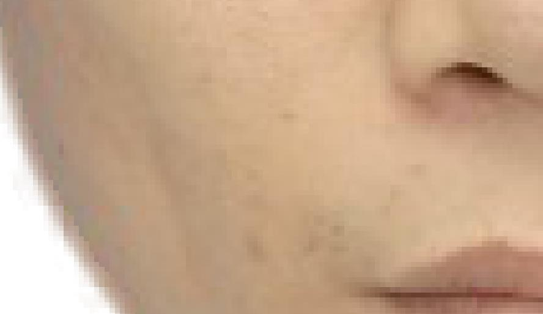

<!-- page: 34 -->

Dr. Jack Elton Bresenham

1937，出生

1962，在IBM任职时提

出Bresenham算法，
1965年发表

1964，获得Stanford

大学博士学位

34

<!-- page: 35 -->

Agenda

Scan conversion of line segments

DDA algorithm

Bresenham algorithm

多边形扫描转换

(Scan conversion of polygon)

区域填充(Fill-area algorithms)

多边形扫描线填充算法(Scan-line polygon-

fill algorithm)

(Chap 4, sections 4-10, 4-13)

35

<!-- page: 36 -->

光栅图形

光栅图形的本质

点阵表示

线框图

线框平面多边形

先扫描转换

真实感图形

面着色

画面明暗自然、色彩丰富;

比线框图更生动、直观、真实

着色的平面多边形

36

<!-- page: 37 -->

光栅图形

填充多边形物体:

线框多边形物体:

要扫描转换多边形

只需扫描转换线段

37

<!-- page: 38 -->

真实感渲染实例

38

<!-- page: 39 -->

光栅图形的基本概念

简单多边形(Simple Polygons)

无自相交

图形学中多边形的两种表示方式

顶点表示：多边形的有序顶点序列

点阵表示：多边形内部的像素集合

39

<!-- page: 40 -->

顶点表示(对象表示)

优点

直观,有几何意义

便于几何变换

存贮量小

形着色
?

不足

不能直接用于多边

多边形的顶点表示

40

<!-- page: 41 -->

点阵表示(图象表示)

优点

可用帧缓冲器(frame

buffer)表示图形

支持面着色(rendering)

缺点

无几何信息

存储量大
多边形的点阵表示

41

<!-- page: 42 -->

多边形扫描转换

多边形的扫描转换：顶点表示点阵表示

从多边形的给定边界出发，求出其内部的各个像素

并给帧缓冲器中各个对应元素设置相应灰度或颜色

多边形的顶点表示
多边形的点阵表示

42

<!-- page: 43 -->

主要内容

基本概念

区域填充(8.10.4,flood filling)

四连通区域和八连通区域

连通区域的种子填充算法

多边形的扫描转换

多边形的扫描转换与区域填充的比较

43

<!-- page: 44 -->

Agenda

Scan conversion of line segments

DDA algorithm

Bresenham algorithm

Scan conversion of polygon

Fill-area algorithms(区域填充)

Scan-line polygon-fill algorithm
(Chap 4, sections 4-10)

44

<!-- page: 45 -->

多边形区域的点阵表示

边界表示
内部表示

45

<!-- page: 46 -->

邻接关系

四连通邻域
八连通邻域

一个象素有四个相邻象素一个象素有八个相邻象素

46

<!-- page: 47 -->

区域的连通类型-定义

四连通区域

区域内任两个像素，从一个出发，可以在区

域内部通过上、下、左、右四个方向移动，
到达另一个

八连通区域

区域内任两个像素，从一个出发，可以在区

域内部通过水平、垂直、正对角线、反
对角线八个方向移动到达另一个

47

<!-- page: 48 -->

区域的连通类型----演示

四连通区域
八连通区域

48

<!-- page: 49 -->

区域的连通类型—例子

四连通区域实例
八连通区域实例

49

<!-- page: 50 -->

区域的类型

四连通和八连通区域的关系

四连通区域八连通区域(反之不成立)

四连通区域的边界是八连通区域

八连通区域的边界是四连通区域

50

<!-- page: 51 -->

内部表示区域种子填充

内部表示区域(记为G)，

像素原来颜色为G0

需填充的颜色为G1

任给G内部的一个种子点(𝑥, 𝑦)。

Paint brush: Fill with color

51

<!-- page: 52 -->

内部表示区域种子填充算法(四连通区域)

Flood_Fill_4(x, y, G0, G1)
{

if(GetPixel(x,y) ==G0 ){ // GetPixel(x,y)返回(x,y)的颜色

SetPixel(x, y, G1);  //将(x,y)的添上颜色G1
Flood_Fill_4(x-1, y, G0, G1);
Flood_Fill_4(x, y+1, G0, G1);
Flood_Fill_4(x+1, y, G0, G1);
Flood_Fill_4(x, y-1, G0, G1);
}
}

void glReadPixels（GLint x, GLint y,
GLsizei width, GLsizei height, GLenum
format, GLenum type, GLvoid * data）;

52

<!-- page: 53 -->

边界表示区域种子填充

问题: 边界表示区域为G，

边界像素颜色为G0

任给G内部的一个种子点(𝑥, 𝑦)

需填充的区域内部颜色为G1

Paint brush: Fill with color

53

<!-- page: 54 -->

边界表示区域种子填充算法

Fill_Boundary_4_Connnected(x, y, G0, G1){

// (x,y) 种子像素的坐标；

// G0 边界像素颜色；G1 需要填充的内部像素颜色

if(GetPixel(x,y) != G0 && GetPixel(x,y)!= G1){

// GetPixel(x,y): 返回像素(x,y)

SetPixel(x, y, G1); // 将像素(x, y)置成填充颜色
Fill_Boundary_4Connnected(x, y+1, G0, G1)；

Fill_Boundary_4Connnected(x, y-1, G0, G1)；

Fill_Boundary_4Connnected(x-1, y, G0, G1)；

Fill_Boundary_4Connnected(x+1, y, G0, G1)；
}

}

54

<!-- page: 55 -->

Agenda

Scan conversion of line segments

DDA algorithm

Bresenham algorithm

Scan conversion of polygon

Fill-area algorithms(区域填充)

Scan-line polygon-fill algorithm (多边形的扫

描转换; Chap 8, section 8.11.3)

55

<!-- page: 56 -->

内容

基本概念

区域填充

多边形的扫描转换(Polygon rasterization/scan

conversion)

逐点判断算法(蛮力,brute force)

扫描线算法

连贯性概念：区域、扫描线、边

奇异点的处理

算法的数据结构与实现

三角形扫描转换

多边形的扫描转换与区域填充的比较

56

<!-- page: 57 -->

应用背景

57

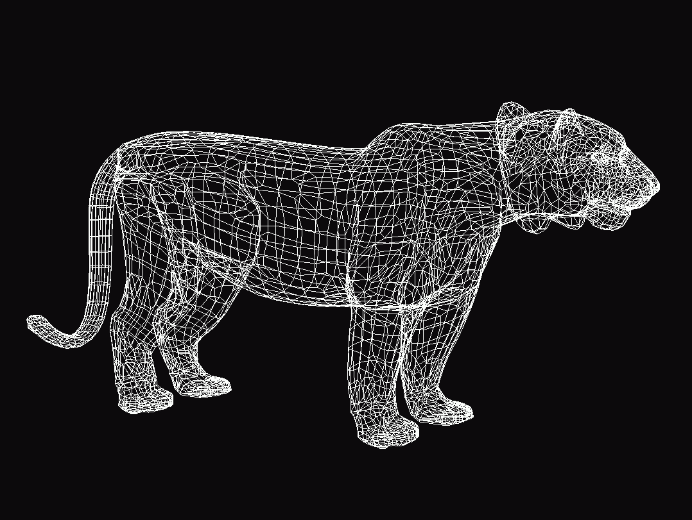

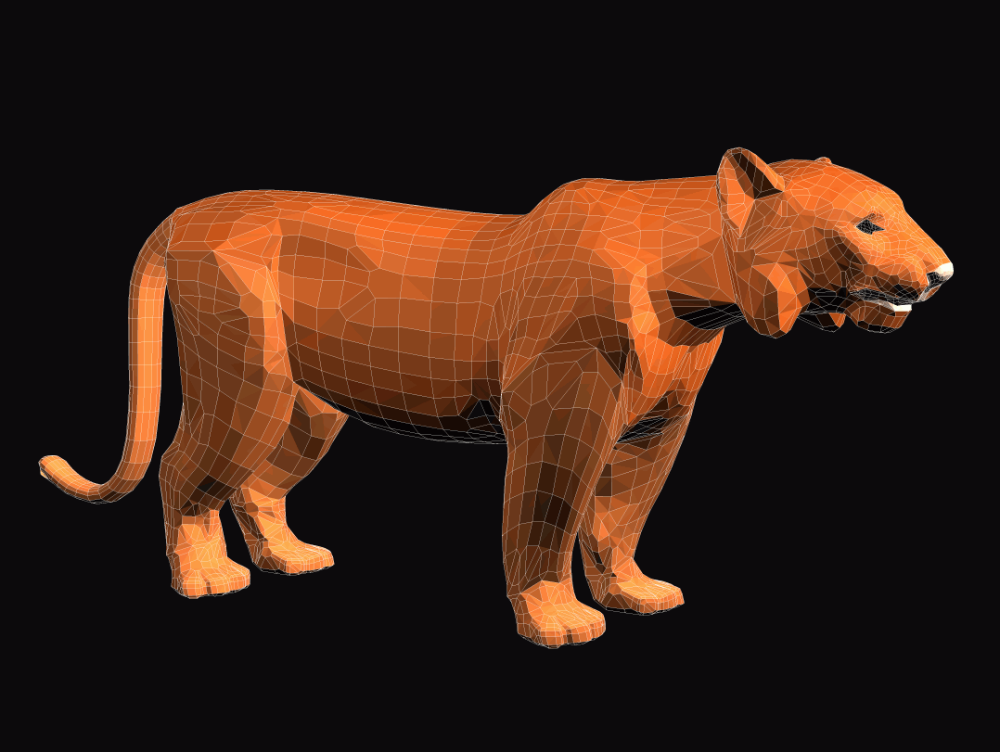

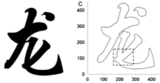

<!-- page: 58 -->

逐点判断算法(蛮力方法)

逐点判断

逐个像素判别其是否位于多边形内部

判断一个点是否位于多边形内部：射线法

从当前像素发射一条射线，计算射线与多边

形的交点个数

内部：奇数个交点

外部：偶数个交点

58

<!-- page: 59 -->

逐点判断算法

判断一点是否位于多边形内部？

59

<!-- page: 60 -->

逐点判断-区域填充蛮力算法

for(y=0; y<=y_resolution; y++)

for(x=0; x<=x_resolution; x++)
{

if(inside(polygon, x+0.5, y+0.5))

setpixel(framebuffer, x, y, polygon_color)
else

setpixel(framebuffer, x, y, background_color)
}

60

<!-- page: 61 -->

逐点判断算法中的奇异情况

1个或2个交点？

2个或3个交点？

61

<!-- page: 62 -->

逐点判断算法的不足

速度慢

几十万上百万像素多边

P4

P0

P2

形内外判断，需大量求
交、乘除运算

P3

P1

没有利用像素间的联系

P6
P7

相邻像素有共同属性

P5

结论：逐点判断算法不

可取！

62

<!-- page: 63 -->

多边形扫描转换算法

𝑦

P4

P0

P2

P3

P1

P6
P7

P5

𝑥

扫描转换示意图

63

<!-- page: 64 -->

Brute-force scan-line算法

求多边形的最小矩形包围盒

逐行处理矩形中的像素(扫描线)

求扫描线与多边形边的交点;

对交点从左到右排序

逐对交点配对并绘制交点间的象素

连贯性(Coherence)？

上述算法用到了扫描线连贯性

优化Brute-force scan-line算法

活化(性)边表扫描线算法

64

<!-- page: 65 -->

连贯性(coherence)

相邻的几何元素往往有共同的性质

避免对像素的逐点判断和求交运算，提高算法效率

𝑦

3个连贯性

P4

P0

P2

区域连贯性

P3

P1

扫描线连贯性

边的连贯性

P7

P6

P5

𝑥

65

<!-- page: 66 -->

区域连贯性

梯形分为两类

多边形内部

多边形外部

两类梯形相间排列

相邻梯形必有一内、一外

连贯性运用

按顺序逐条处理扫描线

区域的连贯性

66

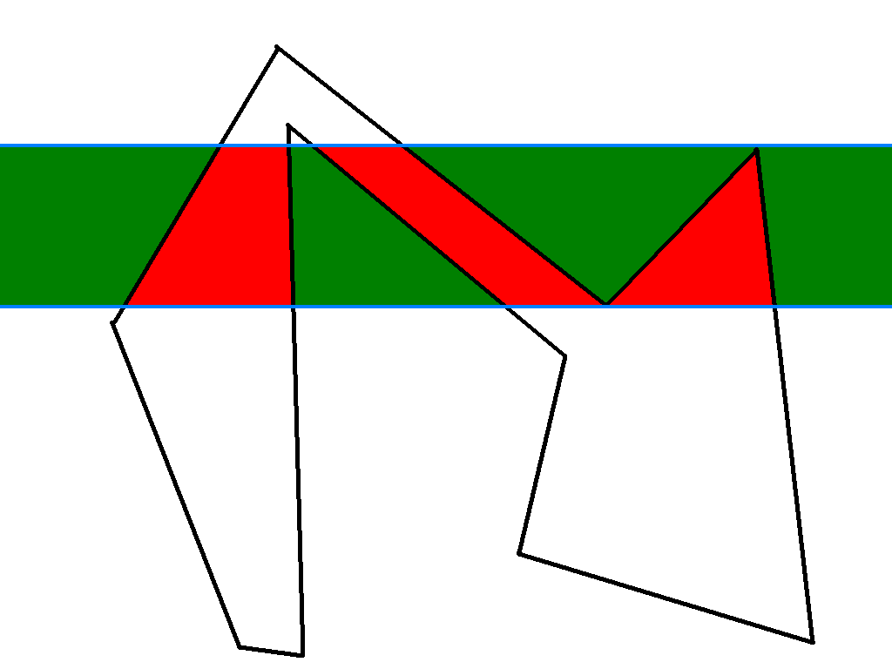

<!-- page: 67 -->

扫描线连贯性

区域连贯性在一条扫描线上的反映

扫描线的连贯性

67

<!-- page: 68 -->

扫描线连贯性

交点序列

扫描线与多边形的交点

个数为偶数
(1,2,3,4,5,6)

内外部区间

红色区间(1,2)、(3,4)、

(5,6)位于多边形内部

绿色区间位于多边形外

两类区间相间排列
扫描线的连贯性

68

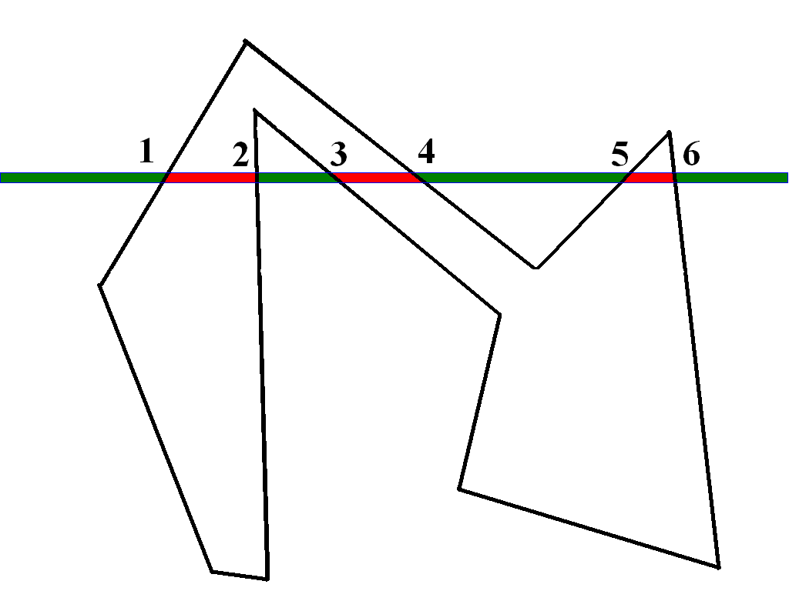

<!-- page: 69 -->

扫描线连贯性

推论

如果上述交点区间属于多边形内(外)，那么

该区间内所有点均属于多边形内(外)。

效率提高的根源

逐点判断区间判断

69

<!-- page: 70 -->

多边形边的连贯性

边连贯性

直线线性性质在光栅上的表现

用于提高多边形与扫描线求交

设扫描线𝑦= y11与两条边的
交点：11 (x11,y11)；

扫描线𝑦= 𝑦1 = 𝑦11 + 1与同
一条边的交点：1 (x1,y1)；

边的连贯性

70

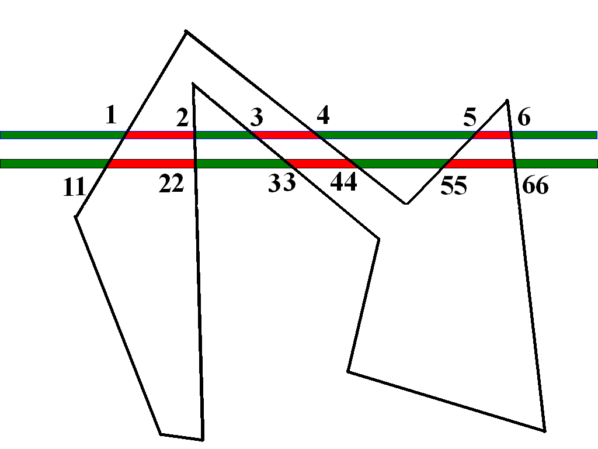

<!-- page: 71 -->

边的连贯性

相邻扫描线(𝑦= 𝑦1; 𝑦1 =

𝑦11 + 1)与同一条边的交
点存在如下关系：

𝑦1 −𝑦11
𝑥1 −𝑥11

= 𝑘

𝑥1 = 𝑥11 + 1

𝑘

从当前扫描线交点求下一

条扫描线交点(增量算法)

边的连贯性

71

<!-- page: 72 -->

边的连贯性

推论

边的连贯性是连接区

域连贯性和扫描线连
贯性的纽带。

区域连贯性

扫描线连贯性“＋”

边连贯性

72

<!-- page: 73 -->

多边形顶点分类—极值点

顶点(𝑥𝑖, 𝑦𝑖)称为极值点

(𝑥5, 𝑦5)

(𝑥3, 𝑦3)

与两个邻点的𝒚坐标满足

𝒚𝒊−𝟏−𝒚𝒊
𝒚𝒊+𝟏−𝒚𝒊> 𝟎

即位于扫描线同侧

顶点(𝑥𝑖, 𝑦𝑖)称为非极值点

相邻三顶点𝒚坐标满足：

𝑦= 𝑦4

(𝑥4, 𝑦4)

𝒚𝒊−1 −𝒚𝒊
𝒚𝒊+𝟏−𝒚𝒊< 𝟎

𝑦= 𝑦2

(𝑥2, 𝑦2)

即位于扫描线的异侧

(x1, y1)

73

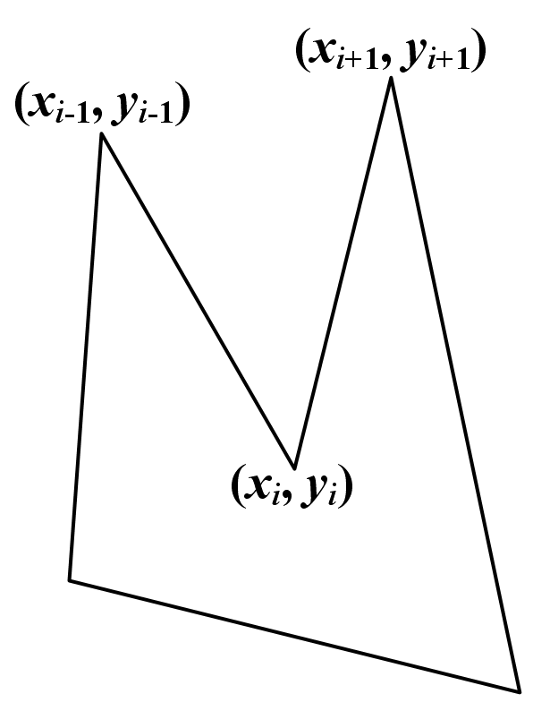

<!-- page: 74 -->

奇异点的处理—交点计数规则

奇异点处的交

(𝑥5, 𝑦5)

(𝑥3, 𝑦3)

点计数

在极值点处，

按2个交点计

在非极值点

处，按1个交
点计
𝑦= 𝑦4

(𝑥4, 𝑦4)

𝑦= 𝑦2

(x1, y1)

74

<!-- page: 75 -->

奇异点的处理—(非极值点)预处理

将扫描线上方的多边形边在𝑦轴方向截断一个单

位，使其与当前扫描线无交点

75

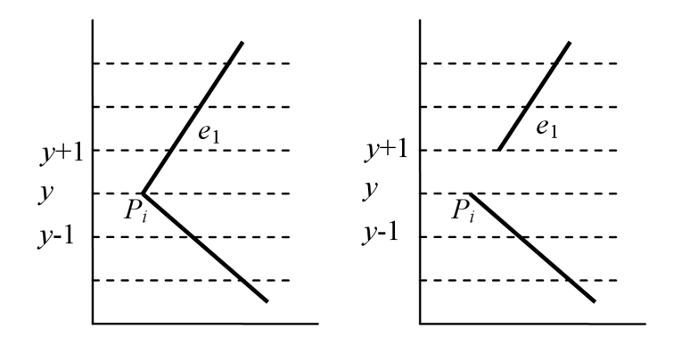

<!-- page: 76 -->

多边形扫描转换算法—基本步骤

计算扫描线𝑦= 𝑦𝑚𝑖𝑛与

多边形的交点

根据边的连贯性，按顺序

求得各扫描线的交点序列

根据区域和扫描线连贯性

判断位于多边形内部区段

𝑦= 𝑦𝑚𝑖𝑛

对位于多边形内的直线段

进行着色

76

<!-- page: 77 -->

多边形扫描转换算法—数据结构

两个表

有序边表ET (Sorted Edge Table)：记录多边形边的信息，

便于判断是否与扫描线相交, 静态

活化边表AEL (Active Edge List) ：记录当前扫描线信息，

便于与边求交，动态

共同基础：边的结构

struct EdgeS{

float ymax;   //边的上端点的𝑦坐标
float x;        //边的下端点𝑥坐标
float dx;
//边的斜率的倒数
EdgeS *next; //指向下一条边
}

77

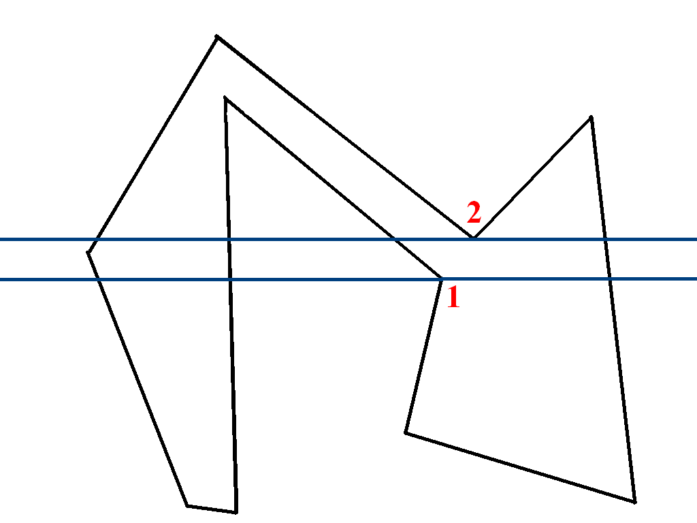

<!-- page: 78 -->

边的分类(ET)

按下端点𝑦坐标分类

该𝑦坐标等于𝑖的边，归入

第𝑖类

每类构成一个线性链表，

用边表指针数组保存

水平边不做任何处理

同一类边的线性表

按𝑥值(𝑥值相等时按𝑑𝑥值)

递增排序

78

<!-- page: 79 -->

分类的边表实例

79

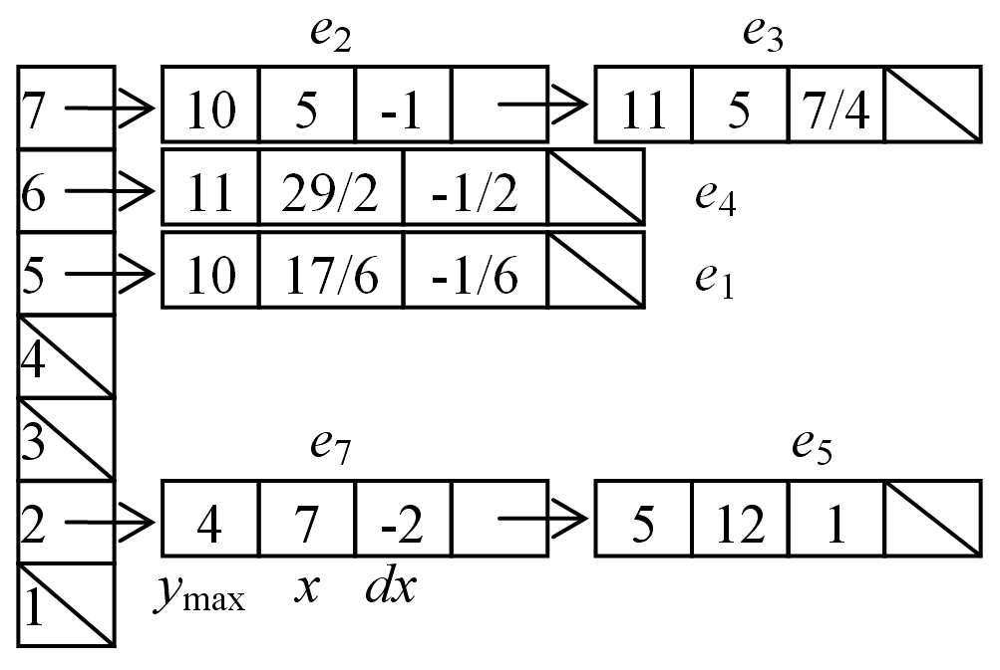

<!-- page: 80 -->

活化边链表(AEL)

活化链表由与当前扫描线相交的边组成

记录了多边形的边沿扫描线的交点序列

根据边的连贯性不断刷新交点序列

基本单元是(与扫描线相交的)边

与分类边表不同

分类边表记录初始状态

活化边表随扫描线移动而动态更新

80

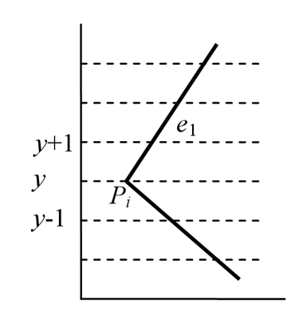

<!-- page: 81 -->

活化边链表实例

ymax xcur dx

与分类边
表的区别

81

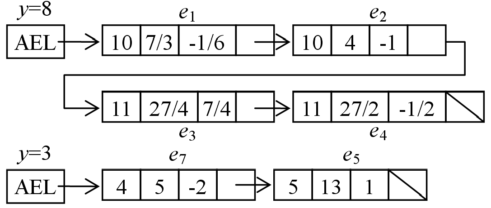

<!-- page: 82 -->

多边形扫描转换算法—细化

建立边表(EL);

初始化扫描线;

初始化活性表(AEL);

逐条处理扫描线

取边表到活化表

插入、排序

逐段画内部像素

更新AEL

82

<!-- page: 83 -->

多边形扫描转换算法

1.
(𝑦初始化) 取扫描线纵坐标𝑦的初始值为ET中
非空元素的最小序号(本例𝑦= 2)

83

<!-- page: 84 -->

多边形扫描转换算法

2.
(AEL初始化) 活化链表AEL置为空

3.
从下到上遍历纵坐标值为𝑦的扫描线(当前扫描线)执
行如下步骤，直到ET和AEL为空

3.1 将边表ET中的第𝑦类元素取出并插入到活化链表AEL中；
(按𝑥值(𝑥值相等时，按𝑑𝑥值)递增方向排序)

84

<!-- page: 85 -->

多边形扫描转换算法

3.2 将AEL中的边交点两两依次配对,对每对交点间
的像素按多边形属性着色；
3.3 更新活化链表AEL
3.3.1 删除满足𝑦𝑚𝑎𝑥= 𝑦的边；
3.3.2 剩下节点的𝑥累加𝑑𝑥，即𝑥= 𝑥+ 𝑑𝑥;
3.4 将当前扫描线的纵坐标值y累加，即𝑦= 𝑦+ 1。

85

<!-- page: 86 -->

Pseudo code

PolygonScanLineFill(polygon, color)

1.
求最低和最高扫描线号𝑦𝑚𝑖𝑛和𝑦𝑚𝑎𝑥

2.
对边按扫描线值作桶分类，建立边表数组𝐸𝑇[𝑦𝑚𝑖𝑛. . 𝑦𝑚𝑎𝑥]；

3.
初始化𝐴𝐸𝑇为空；

4.
for  𝑦= 𝑦𝑚𝑖𝑛to 𝑦𝑚𝑎𝑥

5.
修改AET各结点的𝑥坐标值;

6.
把𝐸𝑇[𝑦]加入AET;

7.
对AET按𝑥坐标值排序, 𝑥坐标相同则按dx排序;

8.
根据AET逐对填充区间段；

9.
endfor

86

<!-- page: 87 -->

多边形扫描转换实例

87

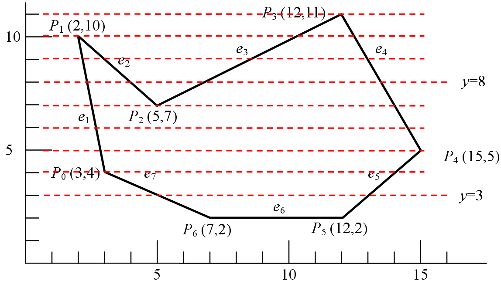

<!-- page: 88 -->

边表

88

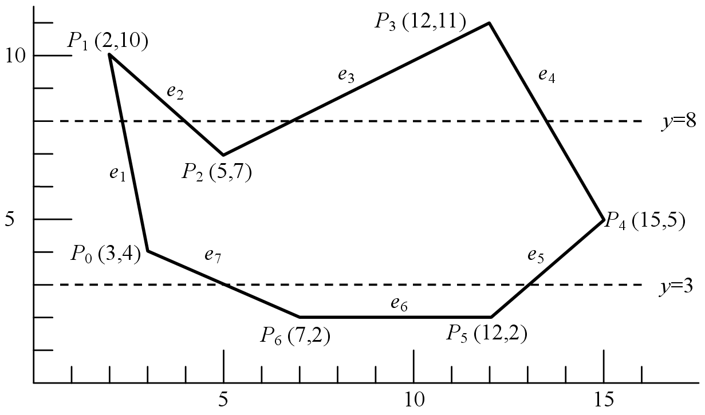

<!-- page: 89 -->

第一条扫描线的活性表

89

<!-- page: 90 -->

第二条扫描线的活性表

90

<!-- page: 91 -->

第三条扫描线的活性表

91

<!-- page: 92 -->

第四条扫描线的活性表

92

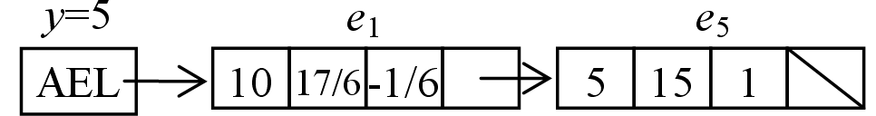

<!-- page: 93 -->

第五条扫描线的活性表

93

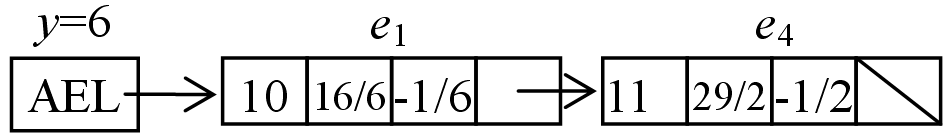

<!-- page: 94 -->

第六条扫描线的活性表

94

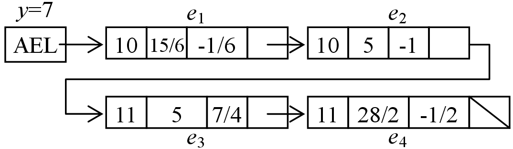

<!-- page: 95 -->

第七条扫描线的活性表

95

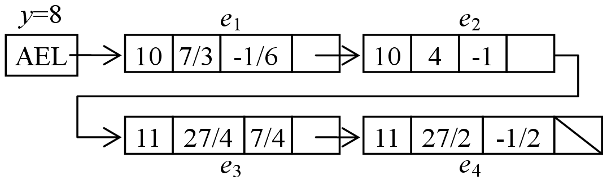

<!-- page: 96 -->

第八条扫描线的活性表

96

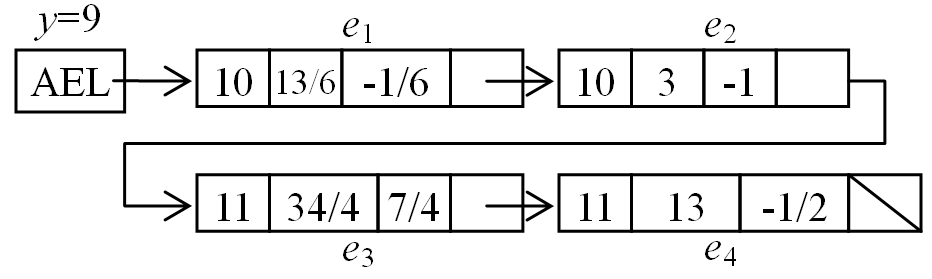

<!-- page: 97 -->

第九条扫描线的活性表

97

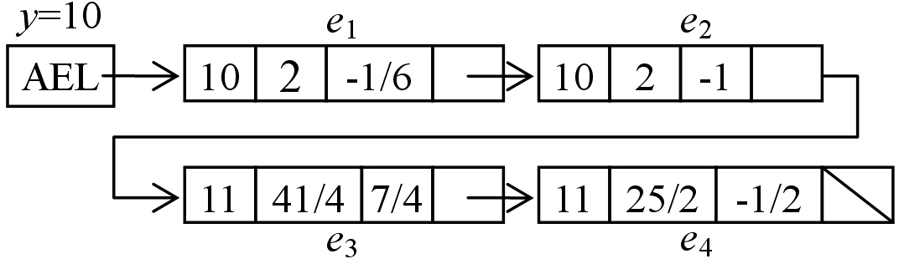

<!-- page: 98 -->

第十条扫描线的活性表

98

<!-- page: 99 -->

多边形扫描转换的优缺点

优点

充分利用多边形的区域、扫描线和边的连贯

性，避免了反复求交的大量运算

不足

算法的数据结构和程序结构复杂

对各种表的维持和排序开销太大，适合软件

实现而不适合硬件实现

99

<!-- page: 100 -->

特殊情形：三角形扫描转换算法

三角形网格模型最常用

(1)

频繁涉及三角形扫描转换

扫描算法

直接用多边形扫描转换算法

内部点判断算法

特殊扫描转化算法(scan

(2)

conversion)

便于硬件实现

100

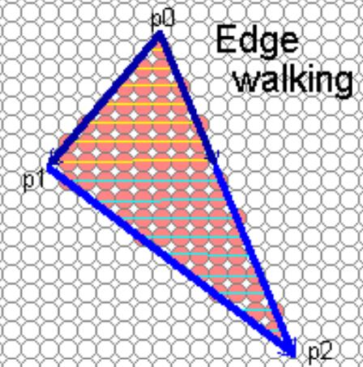

<!-- page: 101 -->

内容

基本概念

区域填充

多边形的扫描转换

多边形扫描转换与区域填充的比较

101

<!-- page: 102 -->

多边形扫描转换与区域填充比较

基本思想不同

多边形扫描转换将多边形顶点表示转换为点阵

表示，扫描过程利用了多边形的各种连贯性

区域填充只改变区域的颜色，不改变区域的表

示方法。填充过程利用了区域的连贯性

102

<!-- page: 103 -->

多边形扫描转换与区域填充比较

对边界的要求不同

多边形扫描转换只要求每一条扫描线与多边

形有偶数个交点

区域填充中

四连通区域必须是封闭的八连通边界

八连通区域必须是封闭的四连通边界

103

<!-- page: 104 -->

多边形扫描转换与区域填充比较

多边形扫描转换允许边界
区域填充允许边界

104

<!-- page: 105 -->

多边形扫描转换与区域填充比较

出发点不同

区域填充：需要区域内一个种子点(复杂计算)

多边形扫描转换：没有要求

105

<!-- page: 106 -->

总结

基本概念

多边形的扫描转换

区域填充

逐点判断算法

扫描线算法

四连通区域和八连

通区域

区域、扫描线、边的

连贯性

连通区域的种子填

奇异点的处理

充算法

数据结构与算法实现

多边形的扫描转换与

区域填充的比较

106

