# 5- Line & Polygon Clipping

<!-- page: 1 -->

计算机图形学与虚拟现实

冼楚华
Email: chhxian@scut.edu.cn
华南理工大学计算机科学与工程学院

<!-- page: 2 -->

课程信息

• 授课老师姓名：冼楚华
• Email: chhxian@scut.edu.cn
• 个人主页：https://chuhuaxian.github.io/
• QQ：89071086 （比较少用，非急事请不要私聊）
• 办公室：B3-202-2
• 课程QQ群（见二维码）

<!-- page: 3 -->

内容

二维线段裁剪(Line Clipping)

二维多边形裁剪(Polygon Clipping)

三维裁剪(3D Polygon Clipping)

3

<!-- page: 4 -->

为什么需要裁剪---剔除不可见部分

透视投影中视域四棱锥是指位于“前面”和

“后面”之间的四棱台

平行投影的视域形状一般

为长方体

投影时，要剔出位于视域

体外部的物体部分。

V

U

N

4

<!-- page: 5 -->

为什么需要裁剪---实体造型

实体造型

多面体裁剪：实体造型布尔运算
图形反走样、消隐

5

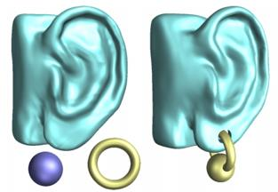

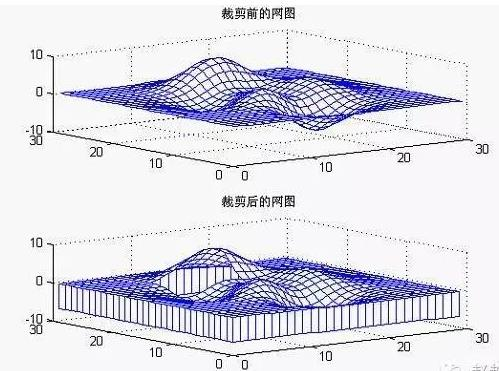

<!-- page: 6 -->

内容(Section 2.5)

二维变换

三维变换

裁剪

二维线段裁剪

二维多边形裁剪

三维裁剪

关于三维变换与裁剪

6

<!-- page: 7 -->

三维变换流程图

局部坐标系
世界坐标系

造型变换

视点坐标系

取景变换
投影变换

图像坐标系
规格化设备

设备变换

坐标系

三维裁剪？

屏幕坐标系

视窗变换

二维裁剪？

7

<!-- page: 8 -->

裁剪

裁剪算法分类：

裁剪窗口维数：二维、三维

裁剪窗口类型：规则(矩形、六面体)和不规

则的(任意多边形和多面体)

裁剪对象类型：点、线、多边形、多面体

实现方式：软件和硬件实现

8

<!-- page: 9 -->

1 二维线裁剪

图形裁剪

确定画面中哪些点、线段或部分线段在裁剪窗口内。

显示位于窗口内的，

丢弃其它的。

裁剪效率

需要对大量的点、线段进行裁剪，因此裁剪算法的效

率十分重要

尽可能快速拒绝和接受，尽量少求交点

9

<!-- page: 10 -->

二维线裁剪示意

10

<!-- page: 11 -->

一个简单的方法

11

<!-- page: 12 -->

12

<!-- page: 13 -->

二维线裁剪主要方法

Sutherland-Cohen 裁剪：编码

中点分割裁剪：除以2，移位运算

参数化裁剪与梁友栋-Barsky 裁剪：高效

率的裁剪

Nicholl-Lee-Nicholl裁剪：更为精细的判

断

……

13

<!-- page: 14 -->

I. E. Sutherland

Ivan Edward Sutherland (born 1938 in

Hastings, Nebraska)

Carnegie-Mellon Univ, Caltech, MIT

MIT: Sketchpad, 1963, MIT

1964: 入伍，国防部

Asso. Prof., 1966, Harvard

Prof., 1968, Utah

Dean, 1976, Caltech

Turing Award, 1988

14

<!-- page: 15 -->

In Utah

图灵奖得主Alan Kay，(oriented object programming,

graphical user interface)

z缓冲等技术的发明者Edwin Catmull

提出了反走样技术的Frank Crow

开发了Warnock算法的John Warnock，

发明Gouraud着色技术的Henri Gouraud

几何流水线之父Jimes H. Clark等。

Phong光照，B.T. Phong

15

<!-- page: 16 -->

Companies

犹他大学期间创办：Evans & Sutherland, 现在

仍在提供数字影院

发明虚拟现实头盔

Caltech：1980

Sutherland, Sproull and Associates 咨询公司

被SUN收购

VLSI

16

<!-- page: 17 -->

Cohen-Sutherland线段裁剪(2.5)

裁剪窗口为长方形, 裁剪对象为线段

裁剪平面被裁剪窗口分成9个区域

x𝑚𝑎𝑥
x𝑚𝑖𝑛

每个区域编码

8
9
10

如图所示.

𝑦𝑚𝑎𝑥

(outcode)

0
1
2

How to encode?

𝑦𝑚𝑎𝑥

5

4
6

17

<!-- page: 18 -->

Outcodes计算

已知窗口四条边的方程分别为

y = 𝑌𝑚𝑎𝑥; x= 𝑋𝑚𝑖𝑛; y= 𝑌𝑚𝑖𝑛; x = 𝑋𝑚𝑎𝑥;
int ComputeOutode(float x, float y){

int code = 0;

if y > 𝑌𝑚𝑎𝑥then code = 8；

0001

else if y < 𝑌𝑚𝑖𝑛;  code = 4；

if x > 𝑋𝑚𝑎𝑥code = code + 2;

else if x < 𝑋𝑚𝑖𝑛= code + 1;

return code;

0110

}

18

<!-- page: 19 -->

裁剪算法(Clipping algorithm)

1. code1=ComputeOutCode(p1), code2=ComputeOutCode(p2);
2.  if code1 & code2 ≠ 0 则位于窗口外
3.  else if code1 = 0 && code2 = 0 则位于窗口内
4.  else {
找到两端点中位于窗口外的一个端点p(设为p1);
依次判断p1位于下面哪条直线外侧

code1









code2

y = 𝑌𝑚𝑎𝑥, x= 𝑋𝑚𝑖𝑛, y = 𝑌𝑚𝑖𝑛, x = 𝑋𝑚𝑎𝑥,
有一个成立则做{

与外侧直线求交点c, 并把cp段丢掉, p1=c;
计算交点p1的outcode;
}
}
5.  对c到另一端点间的线段重复上述过程直到接受或拒绝;
19

<!-- page: 20 -->

例

1001

𝑥= 𝑋𝑚𝑎𝑥



0000

𝑦= 𝑌𝑚𝑎𝑥





𝑦= 𝑌𝑚𝑖𝑛



0110

0110

𝑥= 𝑋𝑚𝑖𝑛

0000

0000

0000

0110

20

<!-- page: 21 -->

例









21

<!-- page: 22 -->

Cohen-Sutherland的改进与扩展

C-S算法依固定次序对裁剪窗口的边进行

相交测试, 有可能会求得窗口外的交点.
Nicholl等提出了改进:

Nicholl et al. An efficient new algorithm for 2-D line

clipping: its development and analysis.
Siggraph 1987, 253-262.

易于推广到三维裁剪

22

<!-- page: 23 -->

梁-Barsky线段裁剪算法

ACM Transactions on Graphics,1984 (国内第

一篇TOG论文)

列入计算机图形学教科书唯一一个中国人提出

的算法

p1

直线段的参数化表示

𝑥= 𝑥0 + 𝑡∆𝑥

𝑦= 𝑦0 + 𝑡∆𝑦

p2

点位于矩形内:

ቊ𝑥𝑚𝑖𝑛≤𝑥0 + 𝑡∆𝑥<𝑥𝑚𝑎𝑥

𝑦𝑚𝑖𝑛≤𝑦0 + 𝑡∆y<𝑦𝑚𝑎𝑥

23

<!-- page: 24 -->

ቊ𝑥𝑚𝑖𝑛≤𝑥0 + 𝑡∆𝑥<𝑥𝑚𝑎𝑥

𝑦𝑚𝑖𝑛≤𝑦0 + 𝑡∆y<𝑦𝑚𝑎𝑥

于是有

上述条件用参数表示为

𝑡𝑝𝑘≤𝑞𝑘(𝑘= 1,2,3,4)
其中：

𝑝1 = −∆𝑥; 𝑞1= 𝑥1 −𝑥𝑚𝑖𝑛
𝑝2 = ∆𝑥;
𝑞1= 𝑥𝑚𝑎𝑥−𝑥1
𝑝3 = −∆y; 𝑞1= 𝑦1 −𝑦𝑚𝑖𝑛
𝑝4 = ∆𝑥;
𝑞4= 𝑦𝑚𝑎𝑥−𝑦1

24

<!-- page: 25 -->

25

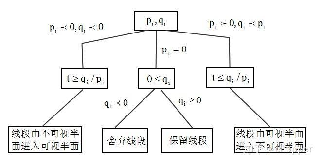

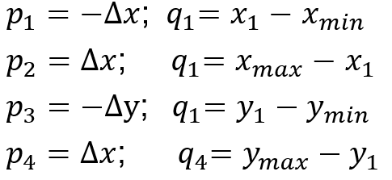

<!-- page: 26 -->

P1

P0

26

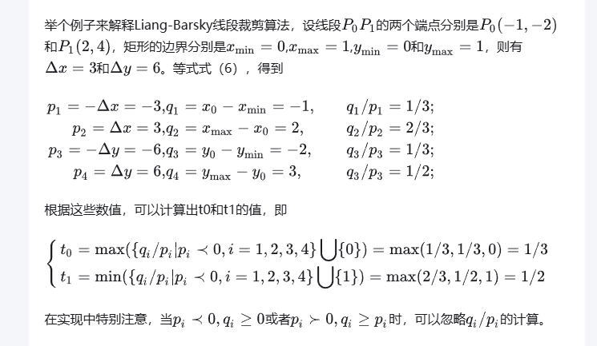

<!-- page: 27 -->

2 二维多边形裁剪

裁剪窗口和被裁剪对象：多边形

对每条边作线裁剪：线裁剪

适合线框图,不适用于多边形着色

正确的多边形裁剪：区域裁剪

结果仍为封闭多边形

可能会并入一部分窗口作为多边形边界

可能是多个不相连的多边形

27

<!-- page: 28 -->

二维多边形裁剪问题描述

输入

裁剪窗口顶点坐标序列

{ 𝑢1, 𝑣1 , … , 𝑢𝑛, 𝑣𝑛}

被裁多边形顶点坐标序

列{ 𝑥1, 𝑦1 , … , 𝑥𝑚, 𝑦𝑚}

输出

按顺序输出裁剪结果

的顶点序列

保证多边形区域的封

闭性

28

<!-- page: 29 -->

Sutherland-Hodgman多边形裁剪(Section 8.5)

裁剪多边形(裁剪窗口): 凸多边形

被裁剪多边形: 任意简单多边形

(I. Sutherland and G. Hodgman. Reentrant polygon clipping.
Communication of ACM, 1974, 17(1):32-42.)

29

<!-- page: 30 -->

Sutherland-Hodgman多边形裁剪

结果多边形边分类

结果多边形顶点分类

被裁剪多边形的边(部分)

被裁剪多边形的顶点★

裁剪窗口的边(部分)

裁剪窗口的顶点■

两多边形的交点◎

◎

★

■

30

<!-- page: 31 -->

Sutherland-Hodgment算法

逐条取裁剪窗口的边对待裁多边形进行裁剪

31

<!-- page: 32 -->

每条边情况

输入: 上一条边得到的新的被裁剪多边形

输出: 新的多边形

方法: 按顺序取出被裁剪多边形的边进行裁剪

。共4种可能情况，产生0, 1或2个新顶点.

0个
1个
1个
2个

32

<!-- page: 33 -->

缺点与改进

可能包含非多边形内部的窗口边界:需后处理

artifact

33

<!-- page: 34 -->

Example: http://public.rz.fh-wolfenbuettel.de/~ludwiga/cg/polygonclipping_example.pdf

34

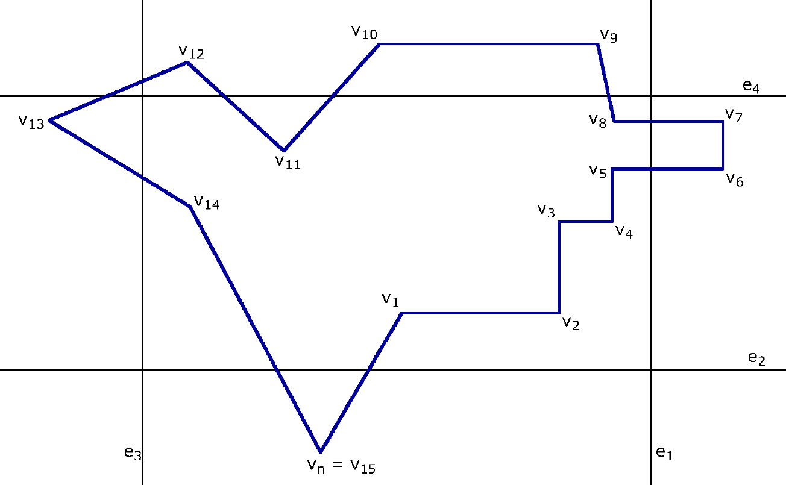

<!-- page: 35 -->

35

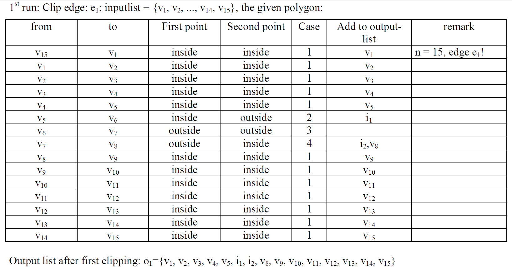

<!-- page: 36 -->

36

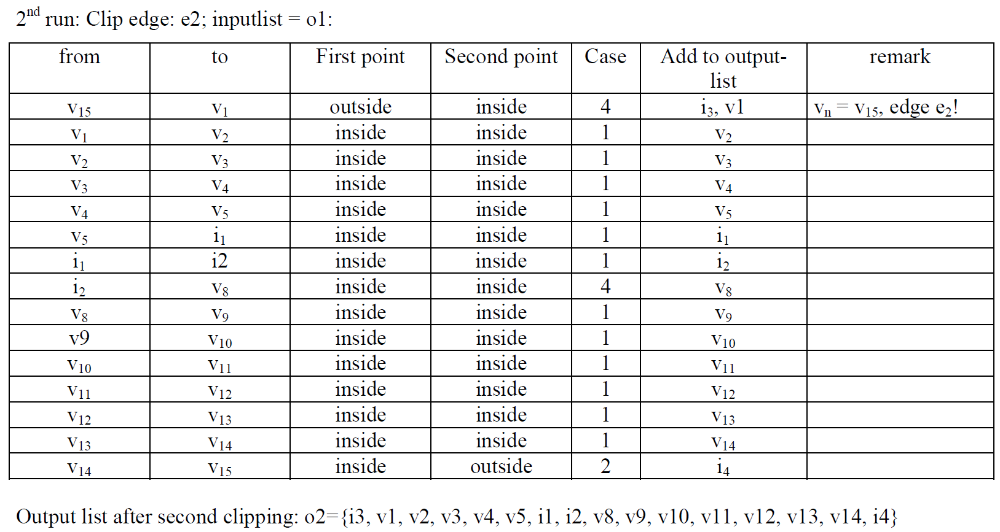

<!-- page: 37 -->

37

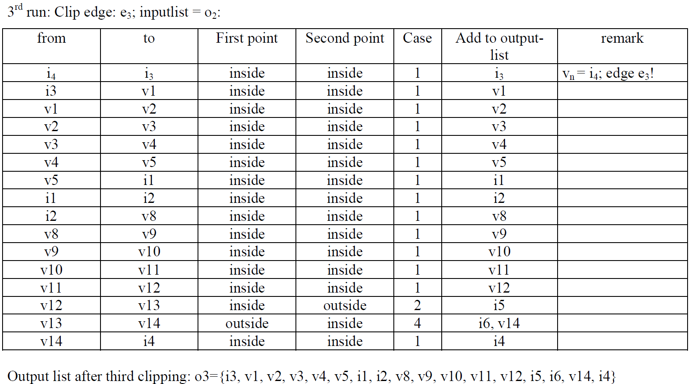

<!-- page: 38 -->

38

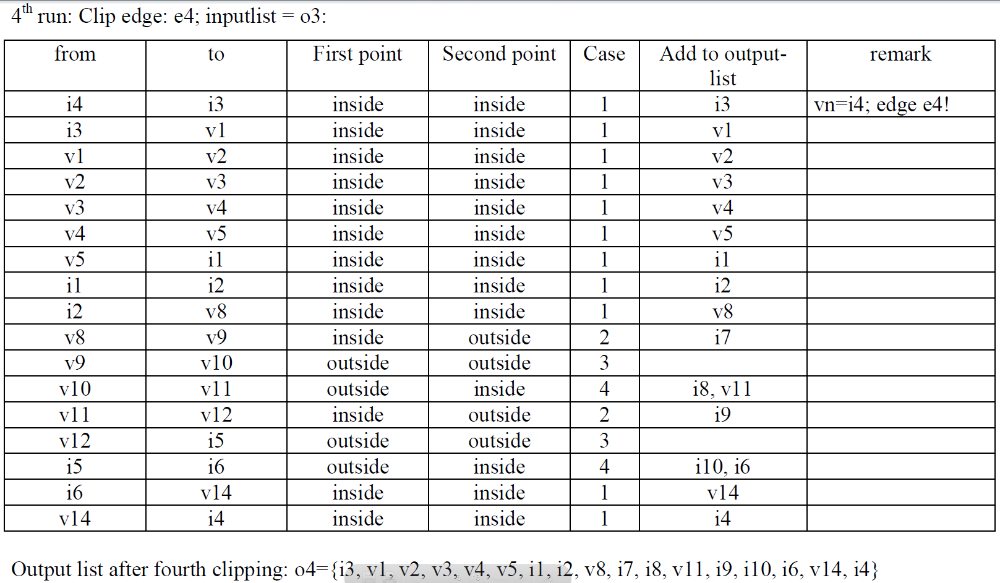

<!-- page: 39 -->

39

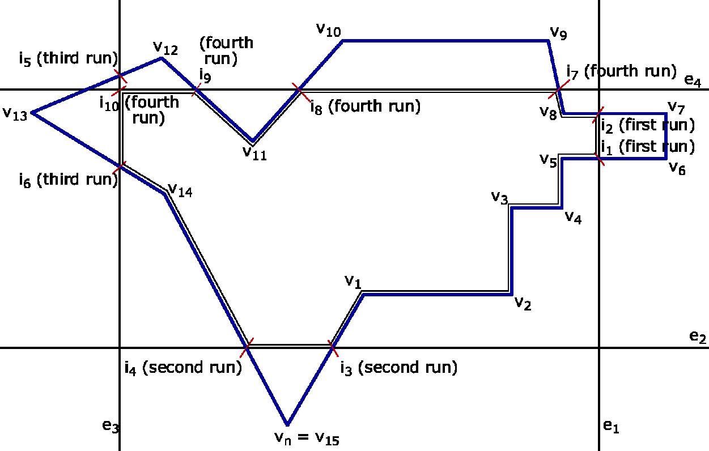

<!-- page: 40 -->

一般多边形裁剪

裁剪多边形为凹多边形

被裁剪多边形为任意多边形

Weiler-Artherton算法

[1] K. Weiler and P. Artherton.

Hidden surface removal using
polygon area sorting. Siggraph
1997, 214-222.
[2] K. Weiler. Polygon comparison

using a graph representation.
Siggraph 1980, 10-18.

40

<!-- page: 41 -->

文本裁剪(Text clipping)

矢量文本裁剪：采用多边

完全位于裁剪窗口内才显示裁剪ABC

形裁剪算法实现文本的裁剪

点阵文本裁剪：

如果点阵是由软件生成的，点阵式文本的裁剪可以

归结为点的裁剪问题；

如果点阵式文本由硬件生成，可作简单处理：字符

41

<!-- page: 42 -->

文本裁剪

文本裁剪

42

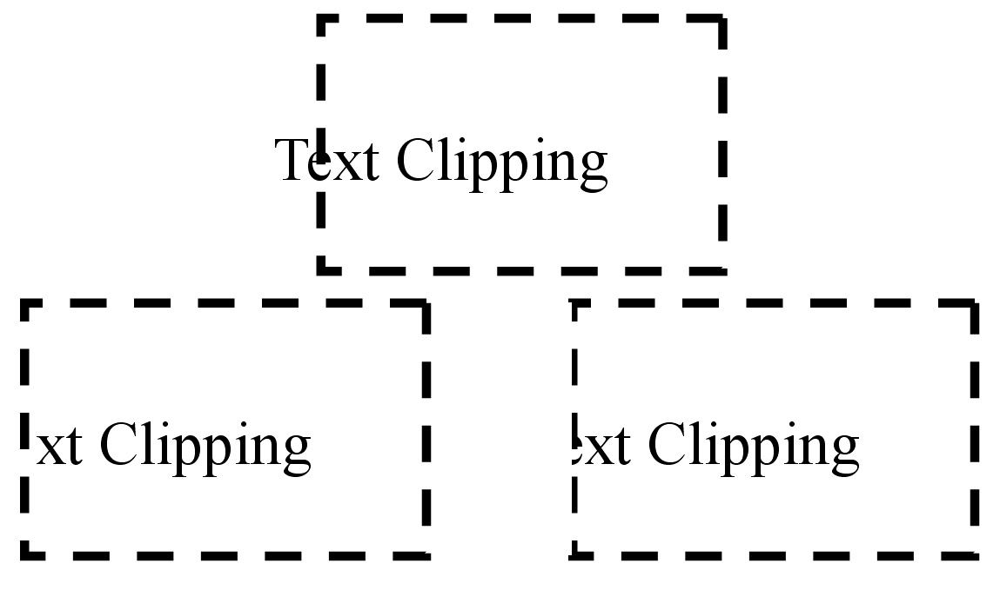

<!-- page: 43 -->

3 三维裁剪

用途

实体造型中的布尔运算

图形流水线中的视见体裁剪

裁剪对象：线裁剪、面裁剪

裁剪窗口：规范的立方体、视域四棱锥

裁剪算法

Sutherland-Cohen、梁-Basky裁剪的推广

多边形Sutherland-Hodgman最初即针对三维裁剪

(I. Sutherland and G. Hodgman. Reentrant polygon clipping.
Communication of ACM, 1974, 17(1):32-42.)

43

<!-- page: 44 -->

关于三维变换与裁剪

何时裁剪?

投影前裁剪—三维裁剪

优点：只对可见的物体进

行投影，提高消隐效率

缺点：裁剪实现复杂

投影后裁剪—二维裁剪

优点：裁剪实现容易

缺点：需要对所有的物体

进行投影变换

44

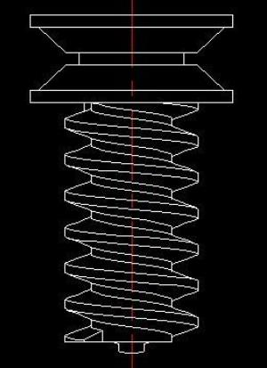

<!-- page: 45 -->

三维裁剪实例

45

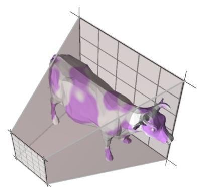

<!-- page: 46 -->

三维裁剪窗口的规范化

什么是规范化

梯形正方形(中心在原点、边长为2)

视域体立方体(中心在原点心、边

长为2)

为什么引入规范视域体

简化投影：将透视投影转为正交投影

简化裁剪：棱台裁剪转为长方体裁剪

规范化变换

实现规范化的变换

46

<!-- page: 47 -->

三维裁剪窗口的规范化

规范化窗口再裁剪

平行投影：[0,1][0,1][−1,0] or [−1,1][−1,1][−1,1]

透视投影：[−1,1][−1,1][−1,1]

y

y

y

-z

-z

-z

x

x

x

透视投影

平行投影

规范化的视域体

47

<!-- page: 48 -->

二维情形的规范化

梯形矩形方法

y

(𝑦2, −𝑓)

梯形腰上的点矩形边上点

(𝑦1, −𝑛)

(𝑦, 𝑧)
s

𝑧+𝑓
𝑓−𝑛𝑦1 +

−𝑛+𝑧

-z

𝑓−𝑛𝑦2𝑦2

𝑠=

(−𝑦1, −𝑛)

(𝑛:near, 𝑓: far)

(−𝑦2, −𝑓)

梯形内部点矩形边内部点

𝑦2

y

𝑠𝑦;
𝑧’ = 𝑧

𝑦’ =

(𝑦2, 𝑛)
(𝑦2, 𝑓)

-z
(𝑦’,𝑧’)

(−𝑦2, 𝑛)
(−𝑦2, 𝑓)

48

<!-- page: 49 -->

三维规范化(Section 5.7.1)

y

一般情形

-z

棱台正方体(右图)
𝑧= −𝑓𝑧′ = 1;𝑧= −𝑛𝑧′ = −1

𝑧= −𝑓

张角为45°时

𝑧= −𝑛

𝑥′ 𝑦′ 𝑧′ 1 𝑇= N 𝑥𝑦𝑧1 𝑇，

x

透视投影

y

1
0
0
0
0
1
0
0
0
0
0
0
𝛼
−1

(1,1, −1)

(−1,1, −1)

N =

𝛽

(−1,1,1)

(1,1,1)

0

x
z

(1, −1, −1)

𝑛+𝑓
𝑛−𝑓, 𝛽= −

2𝑛𝑓
𝑛−𝑓

𝛼= −

(−1, −1,1)

(1, −1,1)

49

<!-- page: 50 -->

总结

裁剪

二维线裁剪

二维多边形裁剪

文本裁剪

三维裁剪

关于三维变换与裁剪

50
