# 6- Hidden Surface Removal (chap 8)

<!-- page: 1 -->

计算机图形学与虚拟现实

冼楚华
Email: chhxian@scut.edu.cn
华南理工大学计算机科学与工程学院

<!-- page: 2 -->

课程信息

• 授课老师姓名：冼楚华
• Email: chhxian@scut.edu.cn
• 个人主页：https://chuhuaxian.github.io/
• QQ：89071086 （比较少用，非急事请不要私聊）
• 办公室：B3-202-2
• 课程QQ群（见二维码）

<!-- page: 3 -->

Agenda

消隐(Hidden surface removal，HSR)

基本概念(Terminologies)

图像空间算法(Image space)

z缓冲算法(Z-buffer algorithm)

对象空间算法(Object space)

后向面剔除(back surface culling)

表优先级算法(list priority methods)

深度排序算法/画家算法/

二叉划分树算法

3

<!-- page: 4 -->

Agenda

消隐(Hidden surface removal，HSR)

基本概念(Terminologies)

图像空间算法(Image space)

z缓冲算法(Z-buffer algorithm)

对象空间算法(Object space)

后向面剔除(back surface culling)

表优先级算法(list priority methods)

深度排序算法/画家算法/

二叉划分树算法

4

<!-- page: 5 -->

1 什么是消隐？

消隐--消除隐藏面(Hidden

Surface Removal):

从几何场景中删除不在视域

体内的几何图元(裁剪)

删除视域中点不可见或被其

他几何体遮挡的物体(消隐)

具体实现：处理多边形面

5

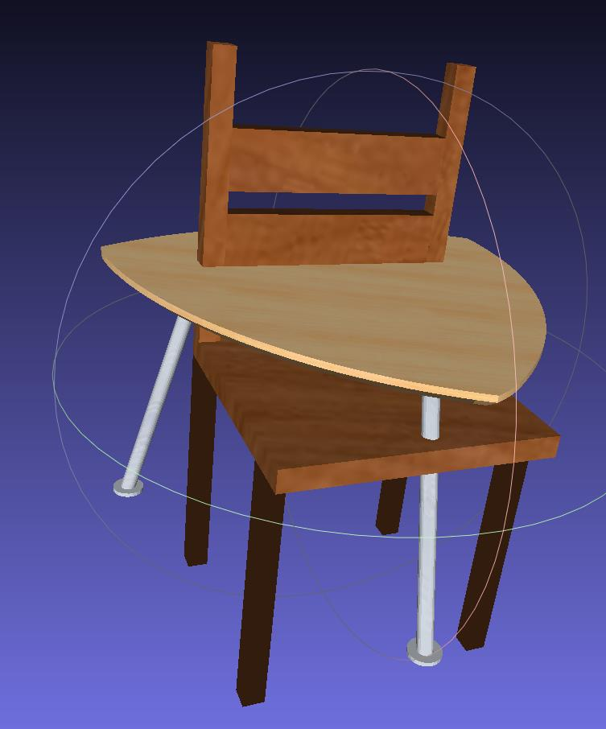

<!-- page: 6 -->

为什么要消隐？

图形真实感方法(Enhance photorealistic)

透视投影(Projection：3D space2D space)

按深度排序增加3D线索

真实感光照(Photorealistic illumination)

6

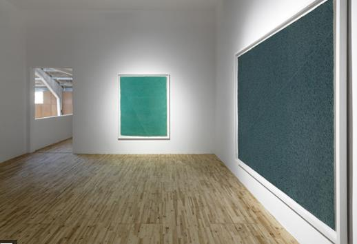

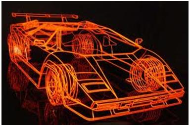

<!-- page: 7 -->

消隐可减少二义性(reduce ambiguity)

B

B

C

C

(a)  Cube wireframe；(b) B is the nearest；(c) C is the nearest

7

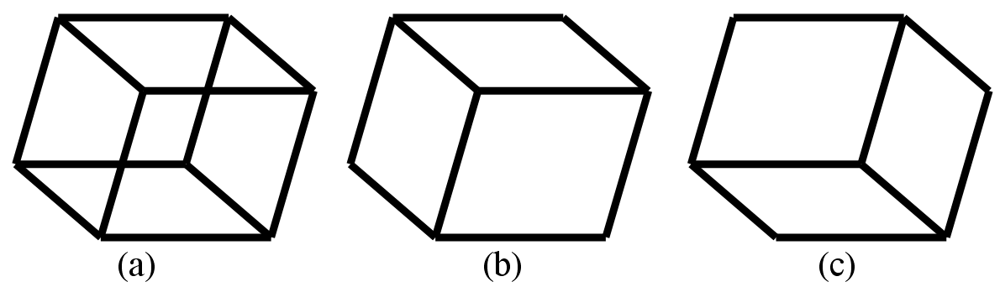

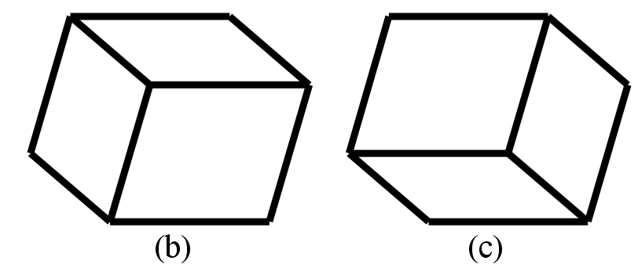

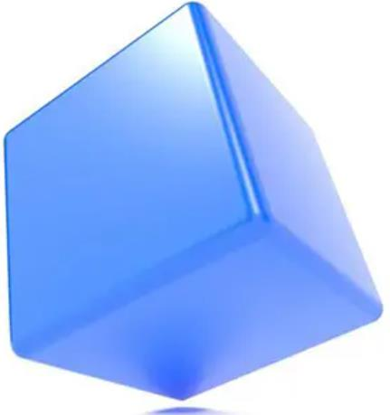

<!-- page: 8 -->

消隐可提高绘制效率

消隐可提高绘制效率

实时仿真(realtime simulation)：效率优先

真实感绘制(photorealistic rendering):质量优先

8

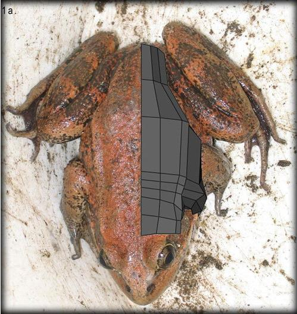

<!-- page: 9 -->

什么时候进行消隐?图形管线(graphics pipeline)

输入

坐标变换、光照、纹理坐标

逐顶点处理

将顶点组装成点、线、三角形等图元(primitives)

图元组装

3D裁剪
视见变换隐

裁剪与视口变换(viewport)、隐藏面消除测试

藏测试

从图元生成片元(Fragment)

光栅化

纹理映射(texture map.)、颜色插值(color interp.)

片元处理

逐片元操作

深度测试、模板测试、alpha混合

输出帧缓存

9

<!-- page: 10 -->

图形处理流程中的坐标变换

造型变换
World trans.

局部坐标系
世界坐标系

投影变换
Projection tran.

取景变换
View trans.

视点坐标系

图像坐标系
规格化设备

设备变换
Device trans.

坐标系

视窗变换
Viewport trans.

屏幕坐标系

10

<!-- page: 11 -->

排序与连惯性(HSR:sorting & coherence)

排序(Object sorting)

对场景中物体按其到

视点的远近排序.

连贯性(Coherence)

同一区域像素往往有

相似性质(可见或遮挡)

两者决定了消隐效率

11

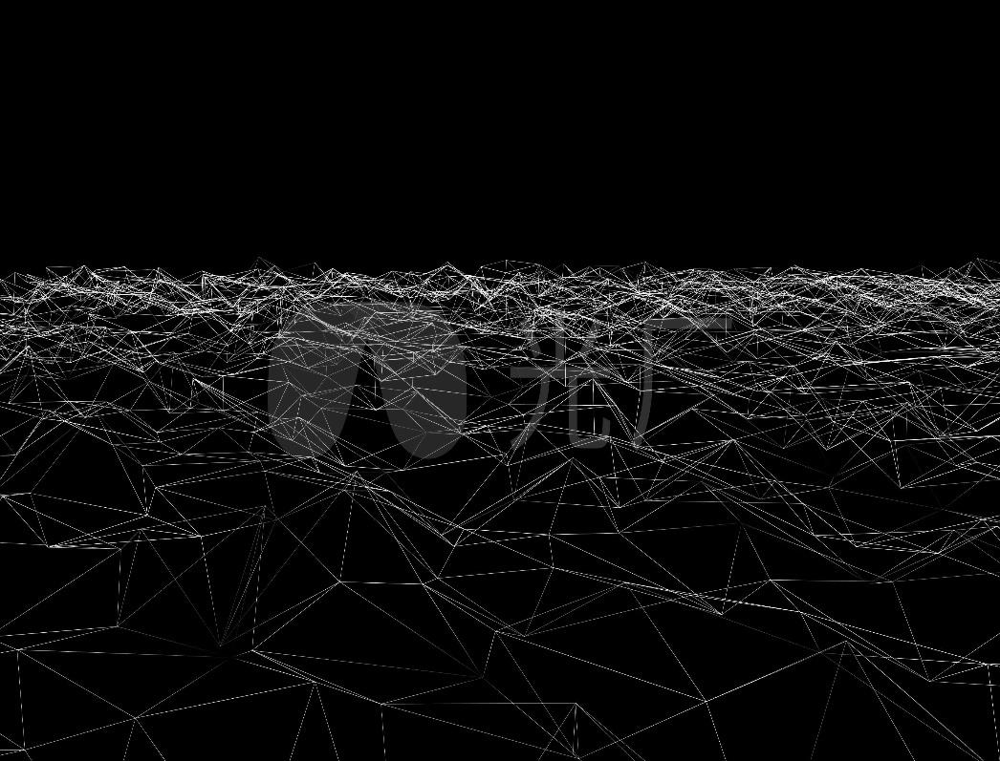

<!-- page: 12 -->

消隐算法分类－按输出形式

隐藏线/面消除Hidden line/surface

面消隐：输出着色图

线消隐：输出线框图

12

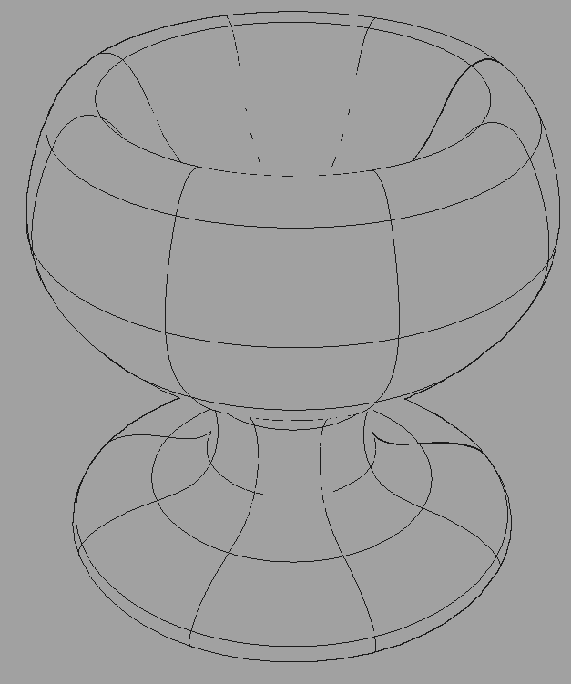

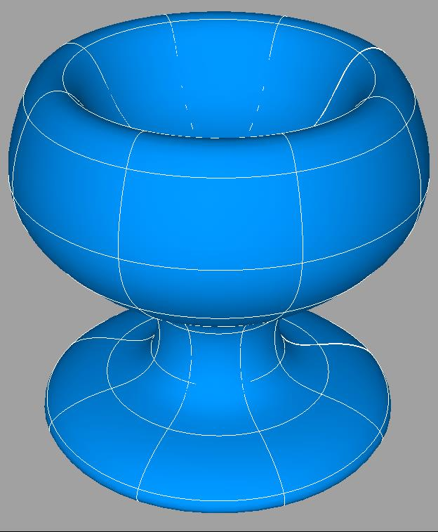

<!-- page: 13 -->

消隐算法分类－按消隐空间

图像空间消隐(Hidden surface removal in image space)

为显示窗口中的每个像素找到场景中对应的可见点

景物空间消隐/对象空间消隐(Hidden surface removal

in object space)

对场景中的多边形按由远到近排序

13

<!-- page: 14 -->

消隐算法(HSR, Textbook: chap 8.11)

基本概念

图像空间消隐

Z-buffer algorithm (深度缓存)

对象空间消隐

背向面剔除

表优先级算法(list priority methods)

深度排序算法/画家算法/

二叉划分树算法

14

<!-- page: 15 -->

2 图像空间消隐----算法框架(HSR in image space)

1. for(图像中的每个像素p) {

2.
连接视点与像素射线r

3.
求出r与场景的最近交点s

4.
计算交点s(像素p)颜色
5  }

15

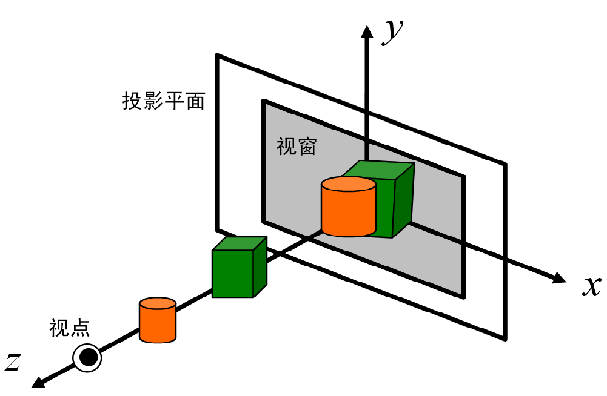

<!-- page: 16 -->

图像空间算法特点

受分辨率限制

生成新的图像需重新消隐

复杂度(Complexity): 𝑂(𝑛𝑁)

每个象素都需对物体排序(Objects should be

sorted for each pixel)

n: 多边形个数(the number of polygons)

N: 像素数(the number of pixels)

算法举例

Z缓存(Z-buffer), A缓存(A-buffer), 扫描线算法

(scan line algorithms)

16

<!-- page: 17 -->

Z-buffer消隐算法

Z-buffer

3D scene

𝑋

𝑌

𝑧2 < 𝑧1
𝑍

Color buffer

17

<!-- page: 18 -->

Z-buffer消隐算法

帧缓存(Frame-buffer)

y
投影方向

存储空间与显示窗口像素数相同

z

存像素颜色,也叫颜色缓存

Z缓存(Z-buffer)

x

存储空间与帧缓存类似

存像平面到像素对应场景的距离，称为z值

Z值越大离视点越远

18

<!-- page: 19 -->

例: 一个简单场景的z-buffer

第1
个三
角形
深度
缓存

背
景
深
度
缓
存

1
1
1
1
1
1
1
1

.5
.5
.5
.5
.5
.5
.5

.5
.5
.5
.5
.5
.5

1
1
1
1
1
1
1
1

.5
.5
.5
.5
.5

1
1
1
1
1
1
1
1

.5
.5
.5
.5

1
1
1
1
1
1
1
1

.5
.5
.5

1
1
1
1
1
1
1
1

.5
.5

1
1
1
1
1
1
1
1

.5

1
1
1
1
1
1
1
1

Z
值
越
大
离
视
点
越
远

1
1
1
1
1
1
1
1

.5
.5
.5
.5
.5
.5
.5
1

.5
.5
.5
.5
.5
.5
.5
1

.7

.5
.5
.5
.5
.5
.5
1
1

.5
.5
.5
.5
.5
.5
1
1

.6
.7

.5
.5
.5
.5
.5
1
1
1

.5
.5
.5
.5
.5
1
1
1

.5
.6
.7

.5
.5
.5
.5
1
1
1
1

.5
.5
.5
.5
1
1
1
1

.4
.5
.6
.7

.5
.5
.5
1
1
1
1
1

.4
.5
.5
.7
1
1
1
1

.3
.4
.5
.6
.7

.5
.5
1
1
1
1
1
1

.2
.3
.4
.5
.6
.7

.3
.4
.5
.6
.7
1
1
1

第2个三角
形深度缓存

.5
1
1
1
1
1
1
1

.2
.3
.4
.5
.6
.7
1
1

1
1
1
1
1
1
1
1

1
1
1
1
1
1
1
1

19

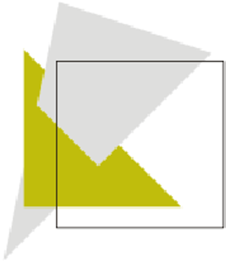

<!-- page: 20 -->

z-buffer算法流程

(1) 初始化颜色缓存𝑓𝑏𝑢𝑓𝑓𝑒𝑟

背景色

(2) 初始化深度缓存𝑧𝑏𝑢𝑓𝑓𝑒𝑟

视点最远的z值

(3)  以任意顺序遍历并扫描转换所有多边形

a) 𝑧(𝑥, 𝑦) ←ComputeDepth(𝑥, 𝑦)

b)如果𝑧(𝑥, 𝑦) < 𝑧𝑏𝑢𝑓𝑓𝑒𝑟(𝑥, 𝑦)，那么

𝑓𝑏𝑢𝑓𝑓𝑒𝑟←ComputeColor(𝑥, 𝑦)

𝑧𝑏𝑢𝑓𝑓𝑒𝑟(𝑥, 𝑦) ←𝑧(𝑥, 𝑦)

20

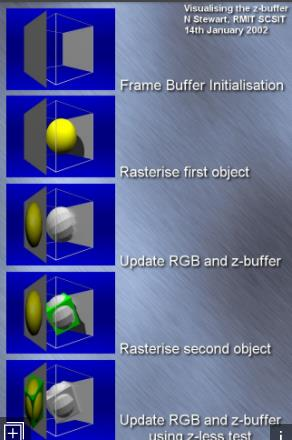

<!-- page: 21 -->

Z-buffer伪代码

ZBuffer(fBuffer, zBuffer){

for y = 0 to ymax
// 初始化
for x = 0 to xmax{    //

fBuffer(x,y) = BACKGROUND_VALUE; // write color
zBuffer(x,y) = 1;     // write BG depth to z-buffer
}
for each polygon do    // 遍历多边形

How to

do this

for each pixel in polygon’s projection do{

pz = polygon’s z-value at pixel coords(x,y);
if (pz < readZ(x,y) {

How to

do this

zBuffer(x,y) = pz;
fBuffer(x,y) = polygon’s color;
}
}
}

21

<!-- page: 22 -->

颜色与深度缓冲示意

深度缓冲

颜色缓冲

22

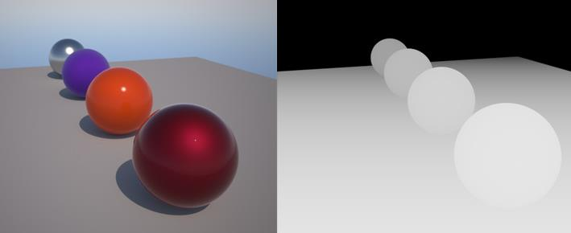

<!-- page: 23 -->

OpenGL中的消隐函数

1   为窗口选择深度缓存
glutInitDisplayMode (GLUT_DEPTH | .... );
2   激活深度测试
glEnable(GL_DEPTH_TEST);
3   设置深度/颜色缓存初始值
glClearDepth(1.0)/glClearColor(0,0,0,1);
4   执行清除
glClear(GL_COLOR_BUFFER_BIT |  //

GL_DEPTH_BUFFER_BIT);
////////////////////////////////////////////////////////////////////////////////////

draw_3d_object_A();    draw_3d_object_B();

23

<!-- page: 24 -->

优缺点(Pros and cons)

优点

缺点：

不需要排序(Determine

复杂度高: (𝑂(𝑛𝑁))

Maximum / minimum)

消耗显存

可处理任意几何形状

便于硬件加速

24

<!-- page: 25 -->

Z-buffer算法的优缺点

占大量显存Z-buffer/F-buffer

深度值范围从0到106, 则每像素24 bits

颜色缓存分辨率1280×1024，则z-buffer需4MB现存

走样(Aliasing due to depth sampling)

难以处理透明物体

颜色混合

25

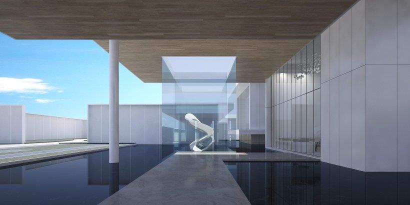

<!-- page: 26 -->

Z-buffer reference

E. E. Catmull. A

Subdivision Algorithm for
Computer Display of
Curved Surfaces.
Dissertation, University
of Utah, 1974.

26

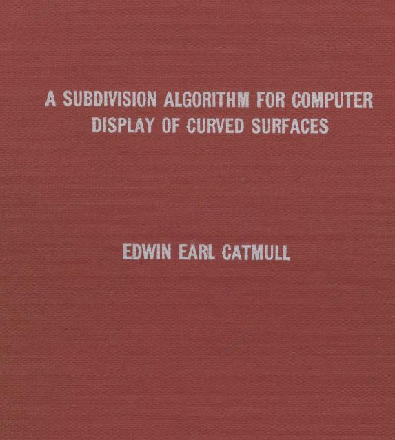

<!-- page: 27 -->

Agenda

消隐

基本概念

图像空间消隐

Z-buffer算法

对象空间消隐

后向相面剔除

表优先级算法

27

<!-- page: 28 -->

3 对象空间消隐--算法框架
(HSR in object space)

1.   for(场景中的每个物体(多边形))  {
2.       确定其未被其他物体遮挡的部分；
3.       进行扫描转换求出其投影包含的像素;
4.       计算像素的颜色;
5.   }

28

<!-- page: 29 -->

对象空间算法特点

适合于精密的CAD工程领域

与渲染图像的分辨率无关

复杂度

𝑂(𝑛2) ，𝑛: 多边形个数

后向面剔除
(Back surface culling)

29

<!-- page: 30 -->

消隐假设

场景由多边形面构成

离视点越远，z值越大

在规范化立方体中消隐

(-1,1,1)

(1,1,1)

top

zFar

(-1,-1,1)

(-1,1,-1)

left

(1,-1,1)

zNear

(1,1,-1)

(-1,-1,-1)

right

(1,-1,-1)

bottom

30

<!-- page: 31 -->

3. 1 后向面剔除(Back face culling)

测试场景中的每个多边形

V是从多边形任一点到视点的方向;

N是被测试多边形外法向

NV<0:  不可见
NV0:   可见

视点

31

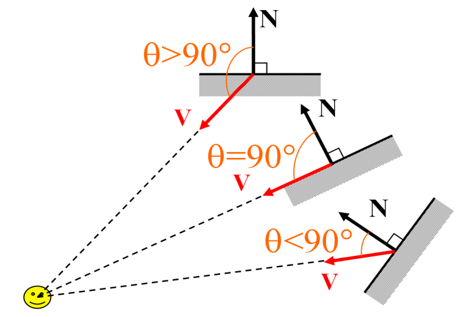

<!-- page: 32 -->

后向面剔除的局限性

不能处理遮挡问题

对凸多面体场景才能完全消隐

图中蓝色与绿色的面，简单的背面剔除不能实现完全消隐

32

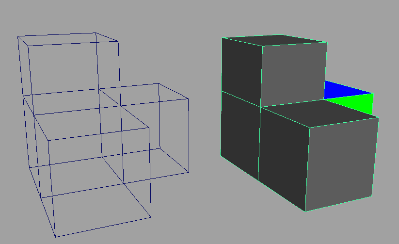

<!-- page: 33 -->

后向面剔除的局限性

不能处理遮挡

可以当作图像/对象两种消隐的预处理

被裁剪的物体

被遮档物体

背面

视域四棱锥

33

<!-- page: 34 -->

Agenda

隐藏面消除(HSR)

基本概念(Terminologies)

图像空间算法(Image space)

Z-buffer算法(深度缓存)

对象空间算法(Object space)

后向面剔除(back surface culling)

表优先级算法(list priority methods)

深度排序算法/画家算法/

二叉划分树算法

34

<!-- page: 35 -->

3.2 深度排序/表优先级/画家算法

原理

离视点远的不会遮挡离视点近的

在景物空间中确定物体间的可见性顺序

由远及近地绘制不会破坏遮挡关系—油画家算法

条件

场景中物体在z方向上没有相互重叠

35

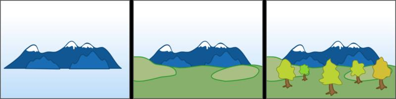

<!-- page: 36 -->

深度排序算法的任务

确定场景中的多边形之间的相互遮挡关系

36

<!-- page: 37 -->

深度排序算法—z坐标不重叠多边形比较

𝑃, 𝑦1

𝑃, 𝑧1

𝑃, … , 𝑥𝑚
𝑃, 𝑦𝑚𝑃, 𝑧𝑚
𝑃}

记𝑚边形𝑃= { 𝑥1

𝑃
= m𝑖𝑛{𝑧1

𝑃, … , 𝑧𝑚
𝑃}, 𝑧𝑚𝑖𝑛

𝑃, … , 𝑧𝑚
𝑃}

𝑧𝑚𝑎𝑥
𝑃
= max{𝑧1

𝑃, … , 𝑥𝑚
𝑃}, 𝑥𝑚𝑖𝑛

𝑃
= m𝑖𝑛{𝑥1

𝑃, … , 𝑥𝑚
𝑃}

𝑥𝑚𝑎𝑥
𝑃
= max{𝑥𝑖

z
x

Y

𝑃, … , 𝑦𝑚𝑃}, 𝑦𝑚𝑖𝑛

𝑃
= m𝑖𝑛{𝑦1

𝑃, … , 𝑦𝑚𝑃}

𝑦𝑚𝑎𝑥
𝑃
= max{𝑦𝑖

𝑧𝑚𝑎𝑥
𝑃

1. 多边形𝑃和𝑄的z坐标不重叠：
𝑧𝑚𝑎𝑥

𝑄
≤𝑧𝑚𝑖𝑛

𝑃

𝑃

𝑄
𝑧𝑚in

𝑃排在𝑄的前面，先绘制𝑃后绘制𝑄

𝑧𝑚𝑎𝑥

Q

𝑄

𝑧𝑚in

Newell, M. E.; Newell, R. G.; Sancha, T. L. (1972), "A new approach to the

37

shaded picture problem", Proc. ACM National Conference, pp. 443–450 .

<!-- page: 38 -->

深度排序算法—x, y坐标不重叠

2. z值范围重叠时,检查𝑃和𝑄的𝑥, 𝑦坐标区间是否重叠

𝑄

(1) P和Q的𝑥坐标范围不重叠: 𝑥𝑚𝑎𝑥
𝑃
≤𝑥𝑚𝑖𝑛

𝑄

(2) P和Q的𝑦坐标范围不重叠: 𝑦𝑚𝑎𝑥
𝑃
≤𝑦𝑚𝑖𝑛

两种情形都互不遮挡，将𝑃排在𝑄的前面，先绘制𝑃后𝑄

x

x
P

P
Q

Q

y

z

Newell, M. E.; Newell, R. G.; Sancha, T. L. (1972), "A new approach to the

38

shaded picture problem", Proc. ACM National Conference, pp. 443–450 .

<!-- page: 39 -->

深度排序算法—是否与视点同侧

3. 如果1,2都无法确定𝑃, 𝑄顺序，检查它们与视点关系

(1) 从视点看去，P是否完全位于Q的背面

(2) 否则,从视点看去，Q是否完全位于P的同一侧

上面有一种情况成立，P排在前，Q在后，先渲染P,后渲染Q

x
P

x

P

Q

Q

z

z

Newell, M. E.; Newell, R. G.; Sancha, T. L. (1972), "A new approach to the

39

shaded picture problem", Proc. ACM National Conference, pp. 443–450 .

<!-- page: 40 -->

深度排序算法—XOY投影是否与重叠

4. 𝑃和𝑄在平面上的投影不重叠（如何判断？）

x

P

Q

y

Newell, M. E.; Newell, R. G.; Sancha, T. L. (1972), "A new approach to the

40

shaded picture problem", Proc. ACM National Conference, pp. 443–450 .

<!-- page: 41 -->

深度排序算法—交换P,Q顺序

x
Q


前面4种情况有一种成立


说明多边形𝑃不会遮挡𝑄


即多边形P的绘制优先级
高于𝑄, 应先绘制

P

z


4种情况都不成立


𝑃有可能遮挡𝑄

x


互换P和Q,然后重新判断
条件1，3；即反过来考虑
𝑄不会遮挡𝑃的测试

Q

P

z

41

<!-- page: 42 -->

深度排序算法—求交

5. 𝑃, 𝑄交换顺序后，仍不能判断遮挡顺序


将其中一个多边形沿另一个物体剖分


避免循环判断：P做标记


多边形剖分：将P沿Q剖分

42

<!-- page: 43 -->

深度排序算法—求交的退化情形

相互遮挡时，将其中
一个多边形沿另一个

𝑃< 𝑄, 𝑅< 𝑃, 𝑄< 𝑅

循环遮挡，选中一个
多边形进行裁剪。

多边形进行剖分

y

y

Q

Q
P

R
P

x

x

43

<!-- page: 44 -->

深度排序算法—小结

深度排序适合固定视点消隐

通过多边形剖分，总可以实现

多边形物体在三维空间中的深
度排序

深度排序算法可以有效地实现

透明效果

对视点变化的场合(如飞行模

拟)，深度排序难以满足实时
性要求

算法复杂度𝑂(𝑛𝑙𝑜𝑔𝑛)

44

<!-- page: 45 -->

Painter algorithm-- Newell, Newell, Sancha

M. E. Newell, R. G. Newell, T. L. Sancha. A new approach to the

shaded picture problem. Proceedings of the ACM, 1973.
图形小史——那盏嘚瑟的茶壶- 知乎(zhihu.com)

45

<!-- page: 46 -->

内容

消隐的基本概念

图像空间消隐：z缓冲器(z-buffer)算法

物体空间消隐

背面剔除算法

表优先级算法

三维物体的深度排序算法

二叉空间剖分树算法

46

<!-- page: 47 -->

3.3 二叉空间剖分树
(Binary Space Partitioning，BSP)

二叉空间剖分树消隐算法

将场景中的多边形组织成一棵二叉树

对象空间算法，观察变换之前创建

适用于视点变化场景不变的绘制;

算法流程

随机选场景中多边形P(也可选跟坐标系

平行的平面，此时叫KD树)

将其它多边形按视点位置分成两部分

位于P外侧(朝向模型外部)的多边形集合

位于P内侧(朝向模型内部)的多边形集合

递归地建立两个子集合的子树

47

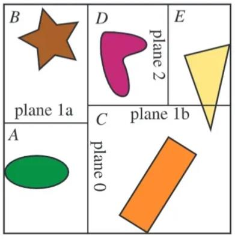

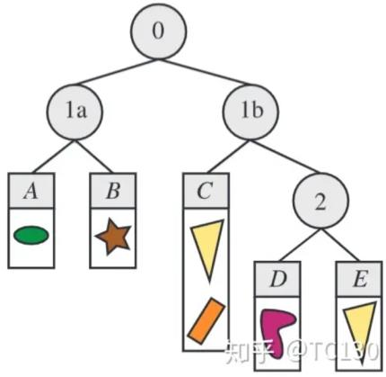

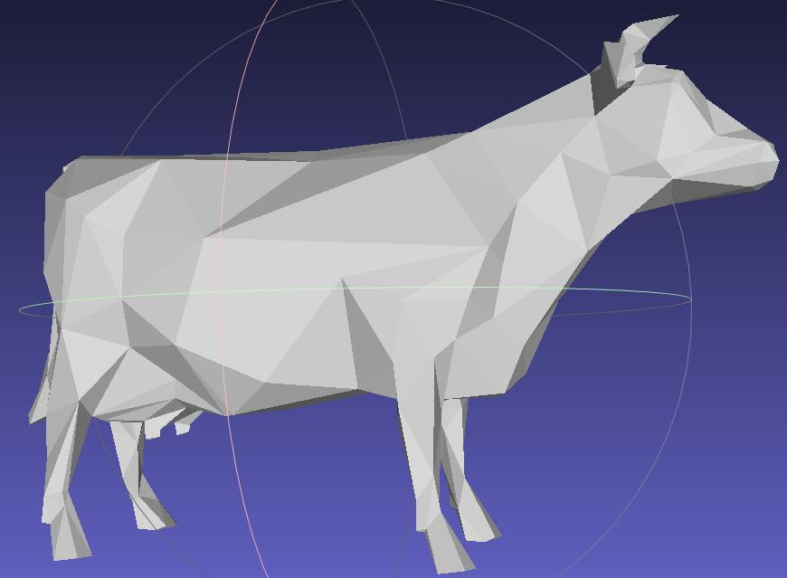

<!-- page: 48 -->

二叉空间剖分树--两种类型的分割面

Y
Y
KD树分割
BSP树分割

x

x

z

z

H. Fuchs, Z. M. Kedem and B. F. Naylor. “On Visible Surface Generation by A Priori
Tree Structures.” ACM Computer Graphics, pp 124–133. July 1980.

48

<!-- page: 49 -->

二叉空间剖分树—树的生成

箭头表示多边形的正侧。左图：首先选1作为分割平面，2位于1的正
侧，3和5位于1的负侧；4被1分割为4a和4b，其中4a位于1的正侧，4b
位于1的负侧。右图：二叉树。

49

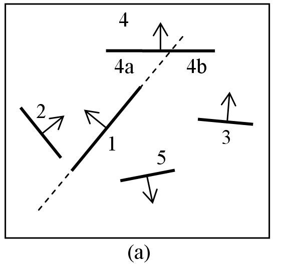

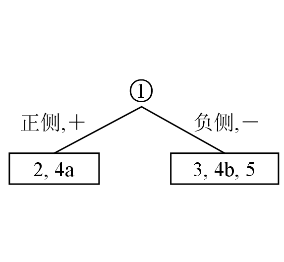

<!-- page: 50 -->

二叉空间剖分树—树的生成

对左右两棵子树的进一步分割：
•
左子树：取2所在平面为分割平面，4a位于2的正侧；
•
右子树：取3所在平面为分割平面，4b位于3的正侧，5位于3的负侧
至此建立了对所给场景的BSP树，树的每个叶节点也是一个多边形。

50

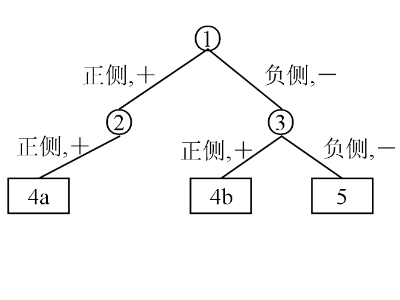

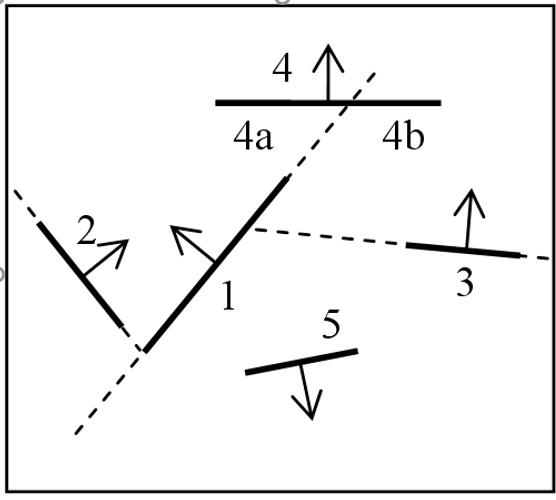

<!-- page: 51 -->

二叉空间剖分树—多边形分割

设P为选定多边形，其三维空间平面方程

𝑓𝑥, 𝑦, 𝑧= 𝑎𝑥+ 𝑏𝑦+ 𝑐𝑧+ 𝑑= 0,
且满足：𝑥, 𝑦, 𝑧位于外侧，则p 𝑥, 𝑦, 𝑧> 0

𝑄, 𝑦1

𝑄, 𝑧1

𝑄, … , 𝑥𝑛

𝑄, 𝑦𝑛

𝑄, 𝑧𝑛

𝑄}是𝑛边形

𝑄= { 𝑥1

𝑄, 𝑦𝑖

𝑄, 𝑧𝑖

𝑄≥0, 𝑖= 1, … , 𝑛, 外侧

𝑓𝑥𝑖

𝑄, 𝑦𝑖

𝑄, 𝑧𝑖

𝑄≤0, 𝑖= 1, … , 𝑛, 内侧

𝑓𝑥𝑖

上两个条件都不满足

用平面𝑓𝑥, 𝑦, 𝑧对𝑄进行多边形裁剪

51

<!-- page: 52 -->

二叉空间剖分树—唯一性问题

场景的BSP树不唯一

“最佳”BSP树的两个标准

BSP树尽可能平衡

尽可能减少多边形的剖分

52

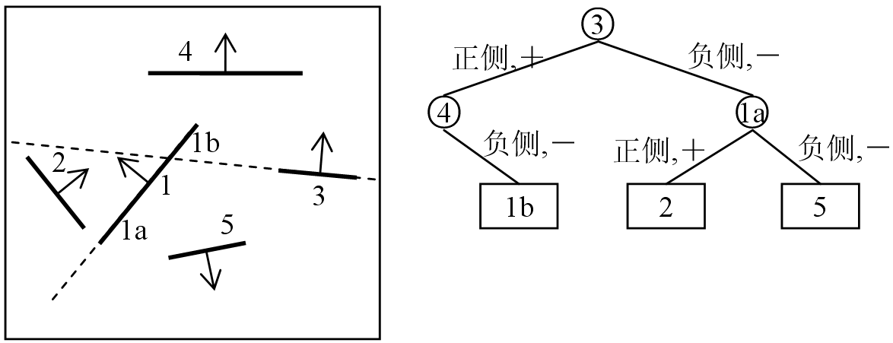

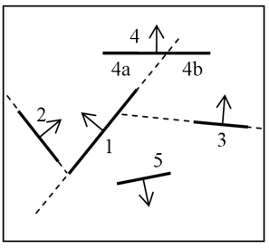

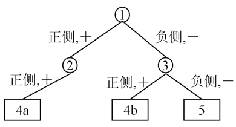

<!-- page: 53 -->

二叉空间剖分树生成—伪代码

BSP_Tree BSP_MakeTree(PolygonList)
if PolygonList == NULL then  BSPTree=NULL;
else {

PartitionPolygon = SelectAndRemove(PolygonList);
PositiveBranch = NegativeBranch = NULL;
for ( each polygon P in PolygonList)  {

if( P in the positive side of PartitionPolygon)

AddPolygonToBSP(P, PositiveBranch);
else if (P in the negative side of PartitionPolygon )

AddPolygonToBSP(P, NegativeBranch);
else {

SubdividePolygon(P, PartitionPolygon, PosiP, NegaP);
AddPolygonToBSP(PosiP, PositveBranch);
AddPolygonToBSP(NegaP, NegativeBranch);
}
}
CombineBSPTree(PositiveBranch, PartitionPolygon, NegativeBranch);
}

53

<!-- page: 54 -->

二叉空间剖分树--遍历(场景渲染)

前序遍历(已绘制象素不再绘制)

后序遍历(由远到近渲染)

视点位于分割平面的正侧，遍历顺序：
负侧分支→根多边形→正侧分支

视点位于分割平面的负侧，遍历顺序：

正侧分支→根多边形→
负侧分支

54

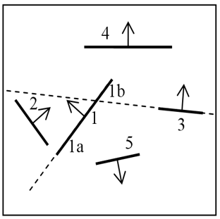

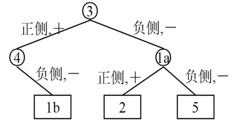

<!-- page: 55 -->

二叉空间剖分树的遍历--伪代码

void showBSP(v: Viewer, T: BSPtree) {

if (T is empty) return;
P = root of T;
if (viewer is in front of P) {

showBSP(back subtree of T);
draw P;
showBSP(front subtree of T);
} else {

showBSP(front subtree of T);
draw P;
showBSP(back subtree of T);
}
}

55

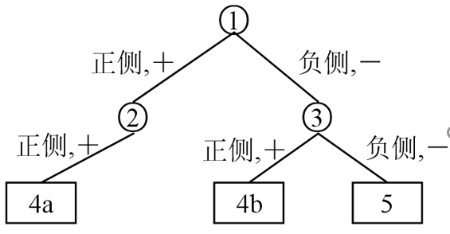

<!-- page: 56 -->

Henry Fuchs


Federico Gil Professor of Computer Science, at the
University of North Carolina at Chapel Hill.


He has been active in computer graphics
since the early 1970s, with rendering algorithms
(BSP Trees), hardware (Pixel-Planes and

PixelFlow), virtual environments, tele-immersion systems
and medical applications.


He received a Ph.D. in 1975 from the University of Utah. He is a
member of the National Academy of Engineering, a fellow of the American

Academy of Arts and Sciences; the recipient of the 1992 ACM
SIGGRAPH Achievement Award, and the 1992
Academic Award of the National Computer Graphics Association.

56

<!-- page: 57 -->

小结

消隐的基本概念

图像空间消隐：z缓冲器(z-buffer)算法

物体空间消隐

背面剔除算法

表优先级算法

三维物体的深度排序算法

二叉空间剖分树算法

57
