# 7- Geometric representations （Chap 11-13）

<!-- page: 1 -->

计算机图形学与虚拟现实

冼楚华
Email: chhxian@scut.edu.cn
华南理工大学计算机科学与工程学院

<!-- page: 2 -->

课程信息

• 授课老师姓名：冼楚华
• Email: chhxian@scut.edu.cn
• 个人主页：https://chuhuaxian.github.io/
• QQ：89071086 （比较少用，非急事请不要私聊）
• 办公室：B3-202-2
• 课程QQ群（见二维码）

<!-- page: 3 -->

内容

网格曲面(Meshes)

数据获取(Data acquisition)

数据结构(Data structure for proximity

retrieving)

法向量计算(Normal computation)

3

<!-- page: 4 -->

Example: Polyhedral wigeon

(b) Flat shading

(a) Wireframe

(c) Smooth shading

线框图

6656 faces(面)，3474 vertices(顶点)

4

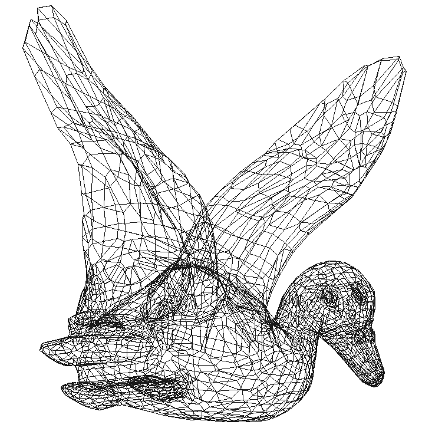

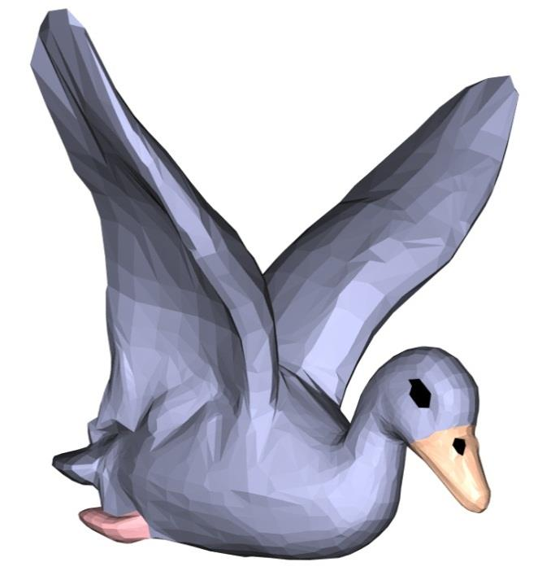

<!-- page: 5 -->

网格模型分类(classification of meshes)

网格是曲面的逐片线性逼近(linear approximation)

网格模型分类—按多边形

三角网格(Triangular mesh)

四边形网格(Quadrilateral mesh)

多边形网格(Polygonal mesh)

5

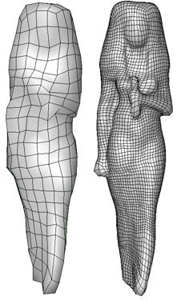

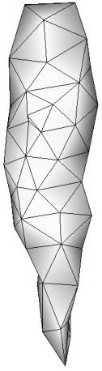

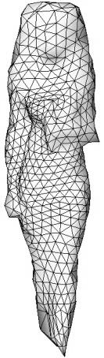

<!-- page: 6 -->

6

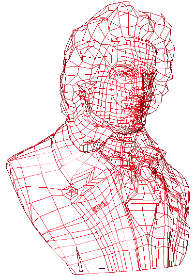

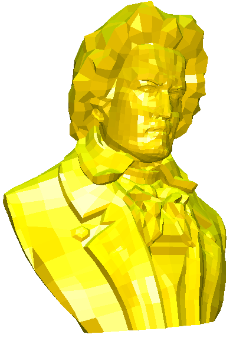

<!-- page: 7 -->

内容

世界坐标系和景物(局部)坐标系

网格模型(Meshes)

多边形网格模型的数据来源

多边形网格的数据结构

多边形网格的优势与不足

7

<!-- page: 8 -->

三维数据获取(Data source)

三维扫描仪(3D scanner)

点云(Point cloud)

三角网格重建

(Mesh reconstruction)

断层扫描(CT, MRI)

等值面提取

(Marching cube)

照相机立体视觉

双目视觉

8

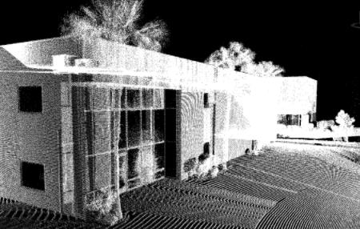

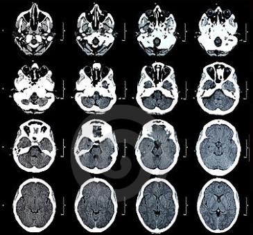

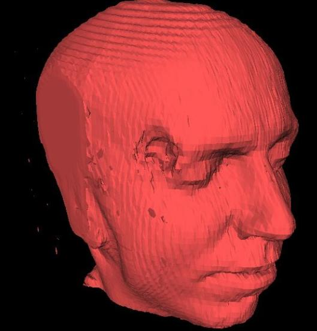

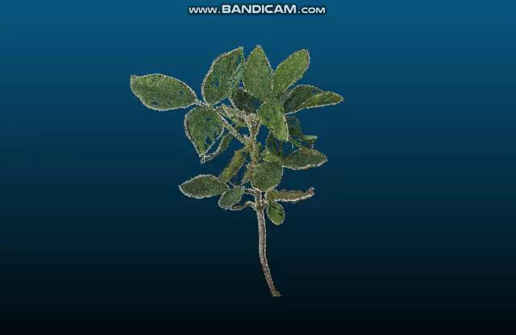

<!-- page: 9 -->

3D扫描仪

9

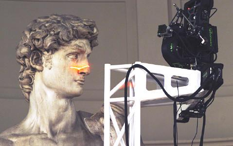

<!-- page: 10 -->

Kinect

10

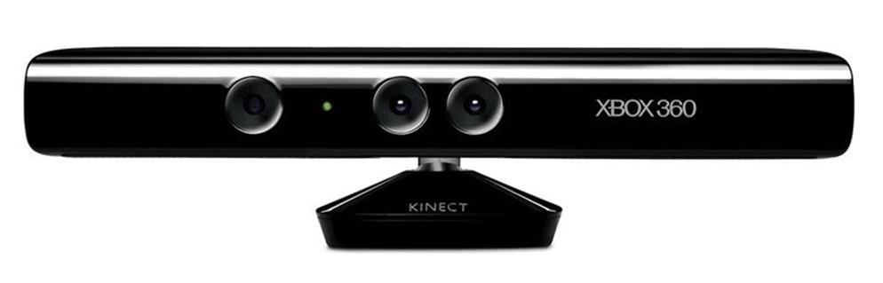

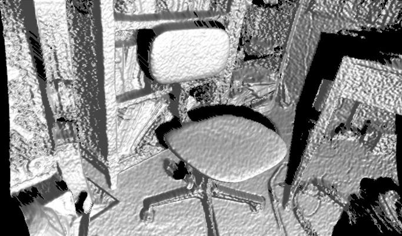

<!-- page: 11 -->

3D Scanners

11

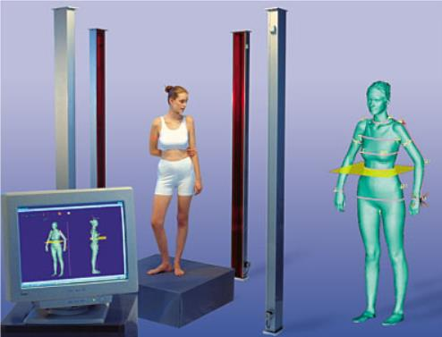

<!-- page: 12 -->

X线断层摄影术(Computed Tomography)

12

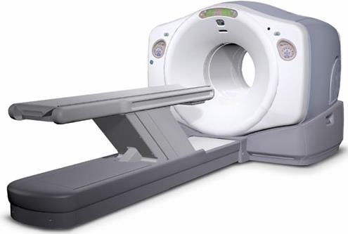

<!-- page: 13 -->

计算机视觉(Camera)

13

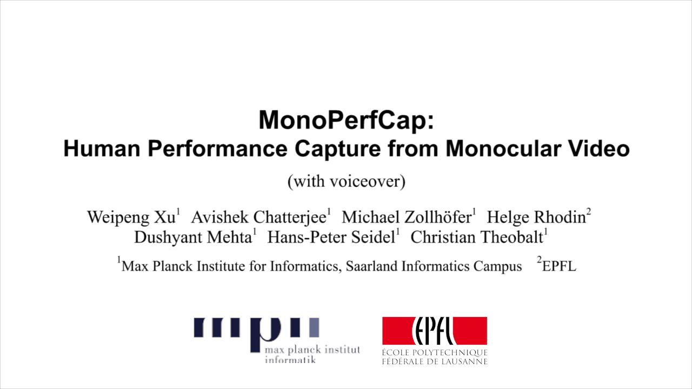

<!-- page: 14 -->

造型系统生成

网格曲面

细分曲面

参数曲面

隐式曲面

Parametric surfaces

Subdivision surfaces

Implicit surfaces

14

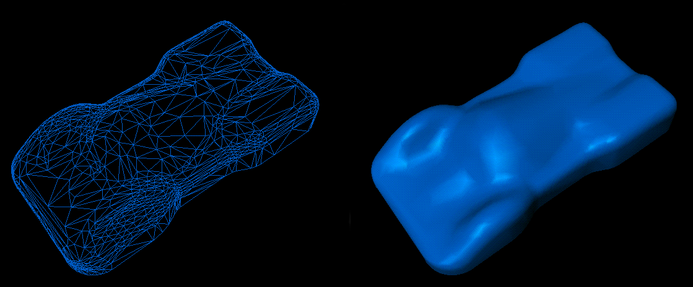

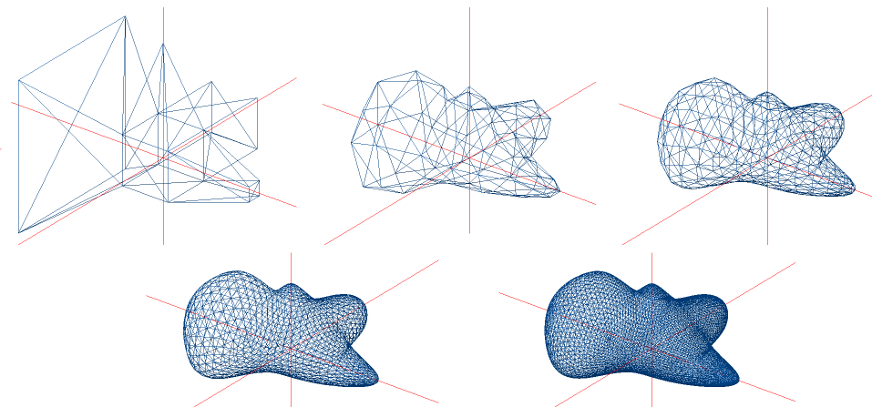

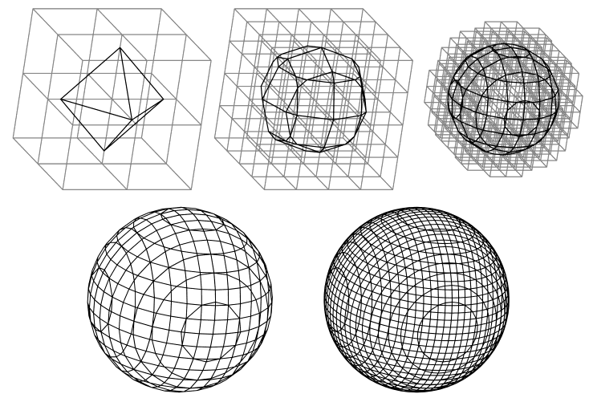

<!-- page: 15 -->

内容

世界坐标系和景物(局部)坐标系

网格(meshes)

多边形表示物体的主要来源

数据结构

法向量计算

参数曲面表示

15

<!-- page: 16 -->

OFF文件格式

三维网格模型存储格式

OFF, VRML, WRL, PLY, OBJ,

3DS,…

OFF格式

顶点数，面数，边数

顶点坐标列表(𝑥, 𝑦, 𝑧)

面索引列表(Facet list)

(顶点数顶点索引1 顶点索引2…)

16

<!-- page: 17 -->

OBJ文件格式

3474 vertices

Obj格式

顶点坐标列表(𝑥, 𝑦, 𝑧)

纹理坐标列表(𝑢, 𝑣)

法向量列表(𝑛𝑥, 𝑛𝑦, 𝑛𝑧)

Face normals

Vertex normals

三角面列表(Facet list)

17

<!-- page: 18 -->

主要信息

顶点坐标表
𝑣𝑖= (𝑥𝑖, 𝑦𝑖, 𝑧𝑖) 𝑖= 1,2, … ,顶点数

纹理坐标表
𝑣𝑡𝑝= 𝑢𝑝, 𝑣𝑝, 𝑝= 1, … , 纹理坐标数

法向表
𝑣𝑛𝑎= (𝑛𝑥𝑎, 𝑛𝑦𝑎, 𝑛𝑧𝑎), 𝑎= 1,…,法向数

面表
𝑓𝑠= (𝑣𝑖/𝑣𝑡𝑝/𝑣𝑛𝑎, 𝑣𝑗/𝑣𝑡𝑞/𝑣𝑛𝑏, 𝑣𝑘/𝑣𝑡𝑟/𝑣𝑛𝑐, … ),

s = 1,…,面片数

Reference for details：

https://en.wikipedia.org/wiki/Wavefront_.obj_file
http://ozviz.wasp.uwa.edu.au/~pbourke/dataformats/obj/

18

<!-- page: 19 -->

Obj文件例子

# List of geometric vertices, …

v 0.123 0.234 0.345 1.0

v ... ...

# List of texture coordinates, in (u, v [,w]) coordinates...

vt 0.500 1 [0]

vt ... ...

# List of vertex normals in (x,y,z) form...

vn 0.707 0.000 0.707

vn ... ...

# Parameter space vertices in ( u [,v] [,w] ) form;

vp 0.310000 3.210000 2.100000

vp ... ...

# Polygonal face element (see below)

f 1 2 3

f 3/1 4/2 5/3

f 6/4/1 3/5/3 7/6/5

f 7//1 8//2 9//3 f ... ...

19

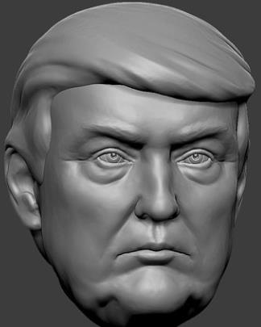

<!-- page: 20 -->

三角网格模型顶点的法向估计

记网格模型为M = 𝑉, 𝐸, 𝐹

顶点集合𝑉= {v𝑖∈𝑅3, 𝑖= 1,2, … , 𝑁}

边集合𝐸⊂1,2, … , 𝑁× 1,2, … , 𝑁

= [1,2, … , 𝑁]2

面集合𝐹⊂[1,2, … , 𝑁]3

v𝑘

三角形(𝑖, 𝑗, 𝑘) ∈F的法向

n

v𝑖= (𝑥𝑖, 𝑦𝑖, 𝑧𝑖)

(v𝑗−v𝑖)×(v𝑘−v𝑖)

v𝑖

n =

v𝑗

(v𝑗−v𝑖)×(v𝑘−v𝑖)

20

<!-- page: 21 -->

三角网格模型顶点的法向近似计算

记网格模型为M = 𝑉, 𝐸, 𝐹

顶点集合𝑉= {v𝑖∈𝑅3, 𝑖= 1,2, … , 𝑁}，v𝑖= (𝑥𝑖, 𝑦𝑖, 𝑧𝑖)

边集合𝐸⊂[1,2, … , 𝑁]2；面集合𝐹⊂[1,2, … , 𝑁]3

顶点法向估计(很多方法)

vi
𝐧

Laplace算子法
𝛅𝑖= 𝐴σ𝑘=1

…
vi1

v𝑖

𝑛
𝑤𝑘(v𝑖𝑘−v𝑖).

𝛽𝑘

1
𝑛(𝑛为v𝑖的邻接顶点个数);

𝑤𝑘=

𝛼𝑘

vi𝑘

或𝑤𝑘= (𝑐𝑜𝑡𝛼𝑘+ 𝑐𝑜𝑡𝛽𝑘)

…

vi𝑘−1

𝛅𝑖
𝛅𝑖.

∴𝐧=

21

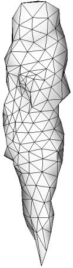

<!-- page: 22 -->

2 数据结构(Data structure)

支持局部信息存取

绘制(Rendering)

形状编辑(Mesh editing)

拓扑编辑(Topology editing)

邻接关系查询(Proximity query)
(顶点的邻边、邻面？边的顶点、邻面？面的顶点、边、邻面)

22

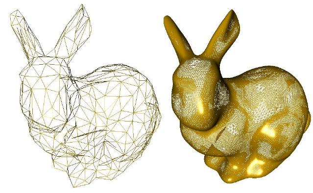

<!-- page: 23 -->

半边结构(Half-Edge  Structure)

可定向的二维流形(Orientable 2D manifolds)

又名Doubly connected edge list (DCEL)

指向顶点
指向半边
指向相邻半边
指向面

23

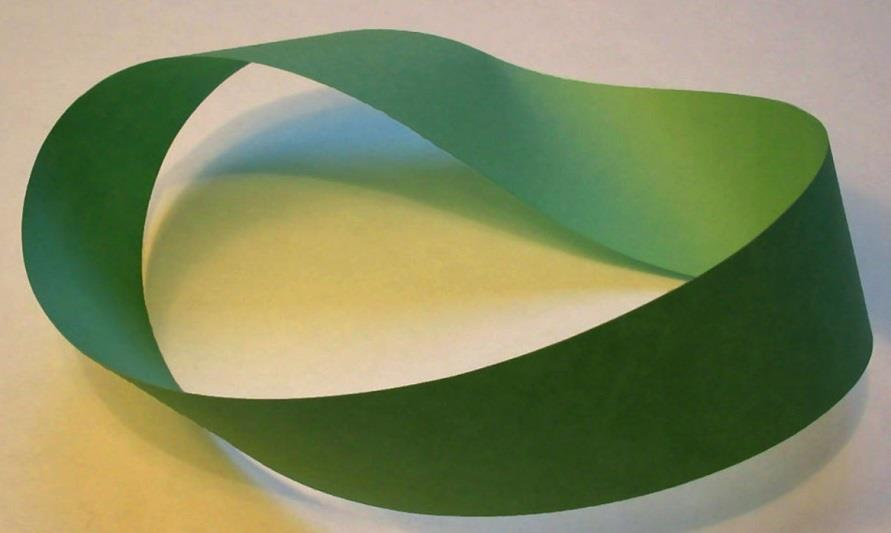

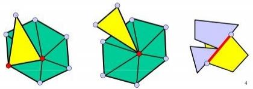

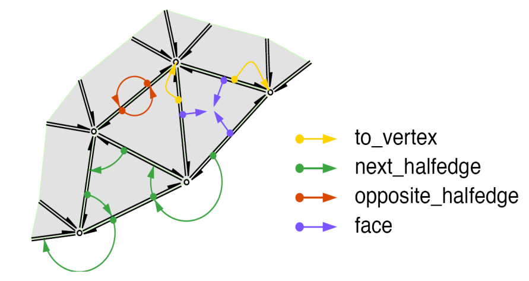

<!-- page: 24 -->

半边结构----半边信息

每条半边存储如下信息

指向其末端顶点

指向其另一半

指向所在的面

指向所在面的下一半边

struct HE_edge {

HE_vert* vert;  //末端点
HE_edge* pair; //同一边的另一半
HE_face* face; //邻接面
HE_edge* next;//下一半边
};

24

<!-- page: 25 -->

半边结构----面信息

每个面存储信息

指向该面的一条半边

struct HE_face {

HE_edge* edge;

// one of the half-edges
// bordering the face
};

25

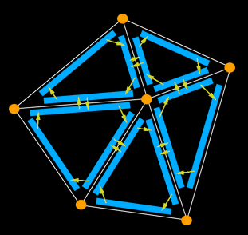

<!-- page: 26 -->

半边结构----顶点信息

每个顶点存储如下信息

3D 坐标(coordinates)

指向以其为顶点的半边

struct HE_vert {

float x; float y; float z;
HE_edge* edge; // one of the half-edges

// emanating from the vertex
};

How to create?
Reference for details：books in computational geometry

26

<!-- page: 27 -->

例子(continued)

𝒗𝟓

𝒗𝟐

𝒆𝟓, 𝟏

𝒆𝟒, 𝟏

𝒇𝟐

𝒆𝟑, 𝟏𝒆𝟑, 𝟐

𝒆𝟕, 𝟏

𝒇𝟑
𝒆𝟏, 𝟏

𝒇𝟏

𝒆𝟒, 𝟐

𝒗𝟒

𝒆𝟔, 𝟏

𝒗𝟑

𝒆𝟐, 𝟏

𝒗𝟏

半边
起点
相邻半边
面
下条半边前条半边
𝑒3,1
𝑣3
𝑒3,2
𝑓1
𝑒1,1
𝑒2,1
𝑒3,2
𝑣2
𝑒3,1
𝑓2
𝑒4,1
𝑒5,1
𝑒4,1
𝑣3
𝑒4,2
𝑓2
𝑒5,1
𝑒3,2
𝑒4,2
𝑣5
𝑒4,1
𝑓3
𝑒6,1
𝑒7,1

27

<!-- page: 28 -->

例子: half-edge structure

𝒗𝟓

𝒗𝟐

𝒆𝟓, 𝟏

𝒆𝟒, 𝟏

𝒇𝟐

𝒆𝟑, 𝟏𝒆𝟑, 𝟐

𝒆𝟕, 𝟏

𝒇𝟑
𝒆𝟏, 𝟏

𝒇𝟏

𝒆𝟒, 𝟐

𝒗𝟒

𝒆𝟔, 𝟏

𝒗𝟑

𝒆𝟐, 𝟏

𝒗𝟏

顶点
坐标
以此为起点的半边
𝑣1
(𝑥1, 𝑦1, 𝑧1)
𝑒2,1
𝑣2
(𝑥2, 𝑦2, 𝑧2)
𝑒1,1
𝑣3
(𝑥3, 𝑦3, 𝑧3)
𝑒4,1
𝑣4
(𝑥4, 𝑦4, 𝑧4)
𝑒7,1
𝑣5
(𝑥5, 𝑦5, 𝑧5)
𝑒5,1

面
半边
𝑓1
𝑒1,1
𝑓2
𝑒3,2
𝑓3
𝑒4,2

28

<!-- page: 29 -->

创建半边结构伪代码

map< pair<unsigned int, unsigned int>, HalfEdge* > Edges;
1.遍历网格模型的所有面F{
2.      遍历F的每条边(u,v){
//创建节点
3.            Edges[pair(u,v)] = new HalfEdge();
4.            Edges[pair(u,v)]→face = F;
5.            Edges[pair(u,v)]→vert = v;
6.       }

v5

v2

e3,1 e3,2
e4,1
e5,1

f2
f3
e1,1

e7,1

f1

e4,2

v4

e6,1

v3

e2,1

v1

7.
遍历F的每条边(u,v) {
//完善节点信息
8.            Edges[pair(u,v)] →nextHalfEdge = next half-edge in F;
9.            if ( Edges.find(pair(v,u))!= Edges.end() ) {
10.               Edges[pair(u,v)] →oppoHalfEdge = Edges[pair(v,u)];
11.               Edges[pair(v,u)] →oppoHalfEdge = Edges[pair(u,v)];
12            }
13.     }
14. }

29

<!-- page: 30 -->

半边结构支持网格的基本操作


Mark mesh boundary(标记边界点)


Create edge adjacency(创建邻接边)


Add vertex(增加顶点)


Add edge(增加边)


Add polygonal face(增加面)


Delete polygonal face(删除面)


Delete edge(删除边)


Delete vertex(删除顶点)

…

30

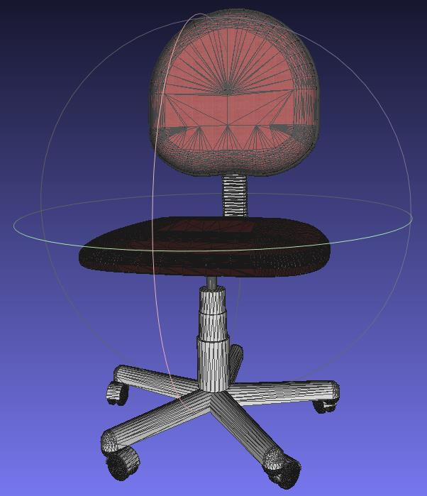

<!-- page: 31 -->

简单讨论

优缺点

Adv.：查询时间𝑂(1)，操作时间𝑂(1)

Disadv.：数据有冗余、只适用于2D流形表面

更多信息

CGAL：the Computational Geometry

Algorithms Library，http://www.cgal.org

OpenMesh：http://www.openmesh.org

Meshlab: http://www.meshlab.net/

31

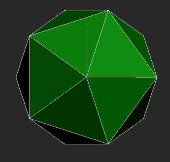

<!-- page: 32 -->

顶点法向量另一种计算

𝑣𝑖与三角形𝑡1, 𝑡2, … , 𝑡𝑘相邻,

其法向n𝑖用下式计算

𝑘
𝐴𝑡𝑗n𝑡𝑗,

n𝑖= σ𝑗=1

𝐴𝑡𝑗是𝑡𝑗的面积

32

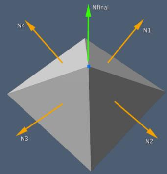

<!-- page: 33 -->

内容

世界坐标系和景物(局部)坐标系

多边形表示

多边形表示物体的主要来源

多边形表示的数据结构

多边形表示的优势与不足

33

<!-- page: 34 -->

多边形表示的优势

简单

任意拓扑

丰富细节

图形硬件支持多

边形物体的加速
绘制

34

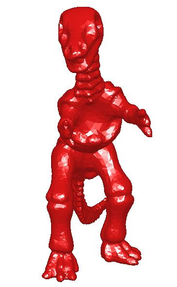

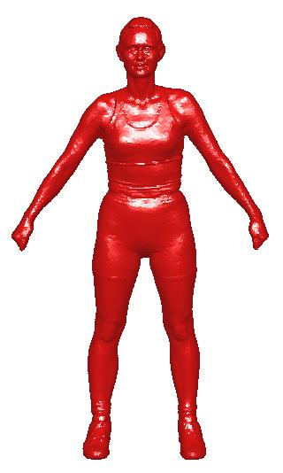

<!-- page: 35 -->

多边形表示的不足

是一种逼近表示，难以满足交互时放大要求

难以用传统方法修改(编辑)物体外形

缺乏解析表达式，几何属性计算困难

在表示复杂拓扑和具有丰富细节的物体时，数

据量庞大，建模、编辑、绘制、存储的负担重

35

<!-- page: 36 -->

网格曲面的数字几何处理(1)

网格曲面的来源

输入数据的预处理

三维扫描

几何误差的消除

CAD输出

拓扑误差的消除

断层扫描

36

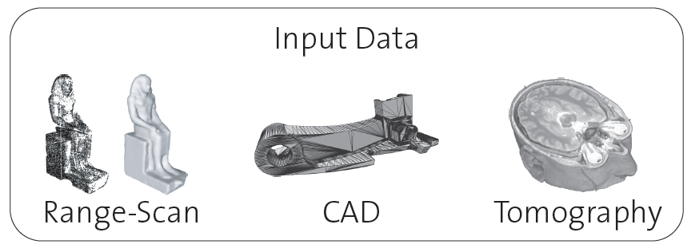

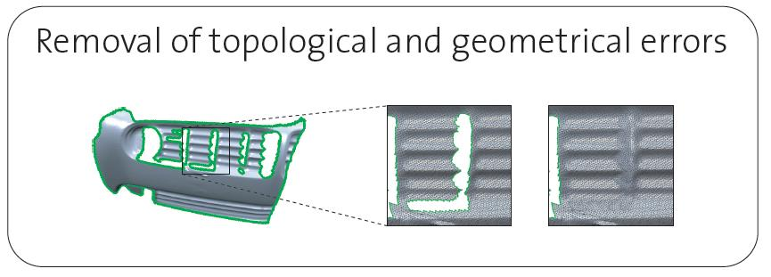

<!-- page: 37 -->

网格曲面的数字几何处理(2)

网格曲面的质量检测

网格去噪与光顺

曲率图

几何特征、细节与噪音

曲率线图

保持几何特征与细节的

前提下去噪音

37

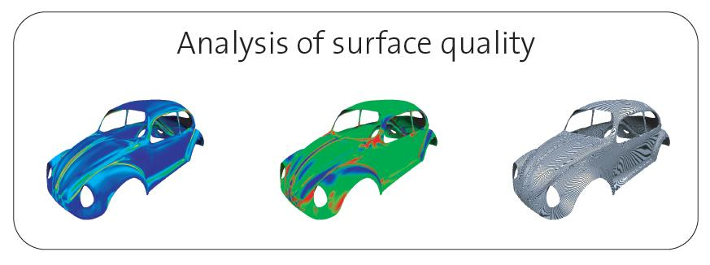

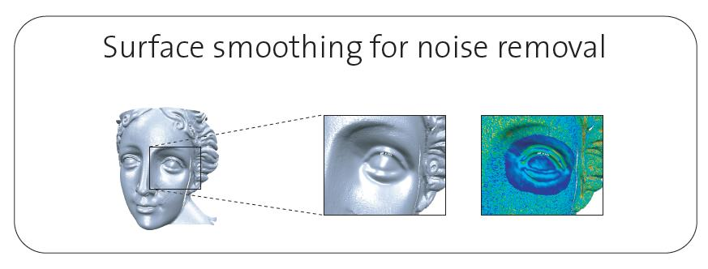

<!-- page: 38 -->

网格曲面的数字几何处理(3)

网格曲面的参数化

网格曲面的简化

重新网格化

降低几何复杂性

形状编辑

提高处理、显式效

率

纹理映射

……

38

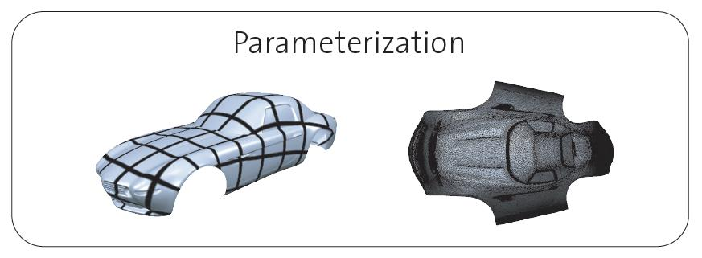

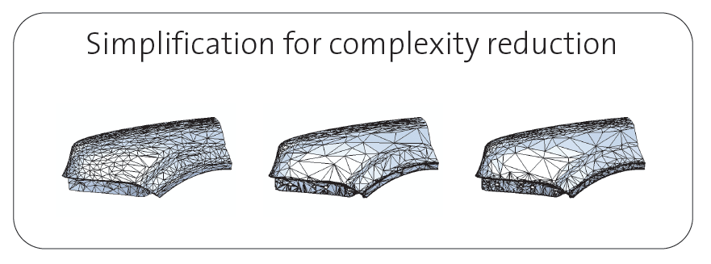

<!-- page: 39 -->

网格曲面的数字几何处理(4)

重新网格化以提高网

网格曲面编辑

格曲面的质量

多分辨率编辑

面片简化

自由编辑

逼近与拟合

39

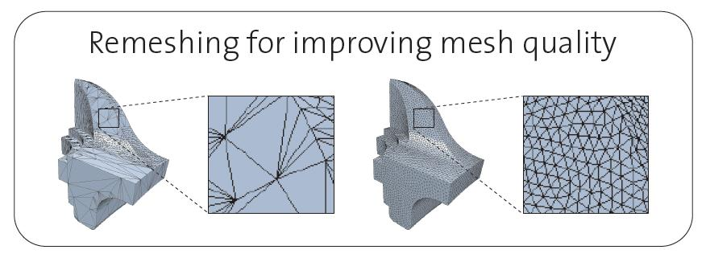

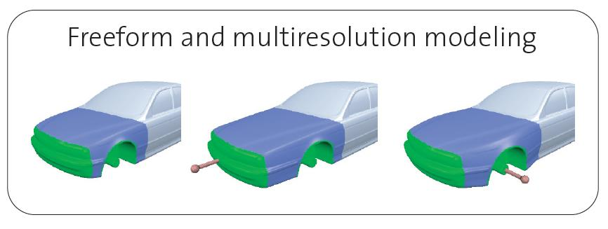

<!-- page: 40 -->

多边形表示的大规模场景：草地

16.7×106个多边形

40

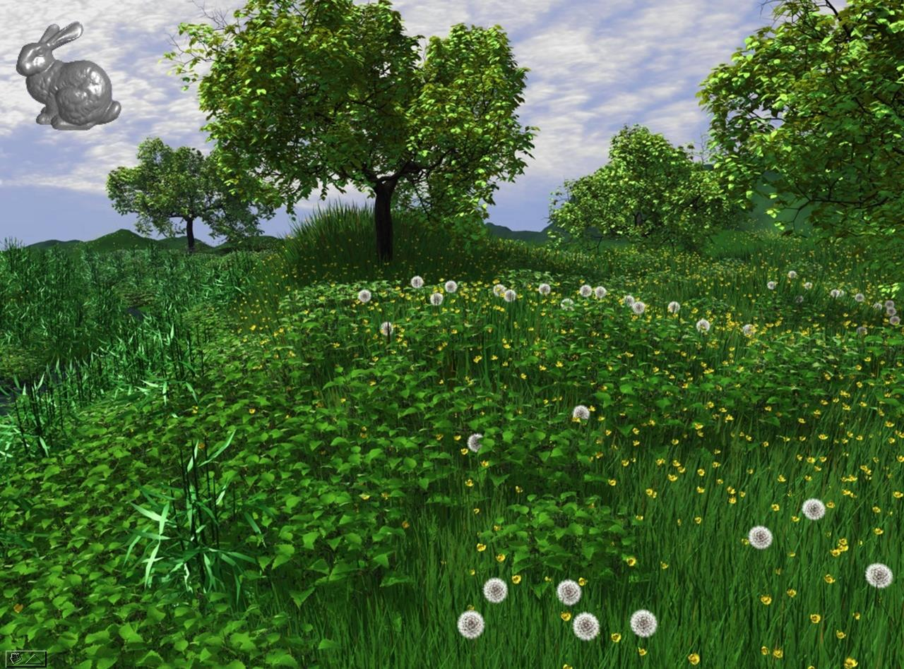

<!-- page: 41 -->

多边形表示的复杂物体：油轮

41

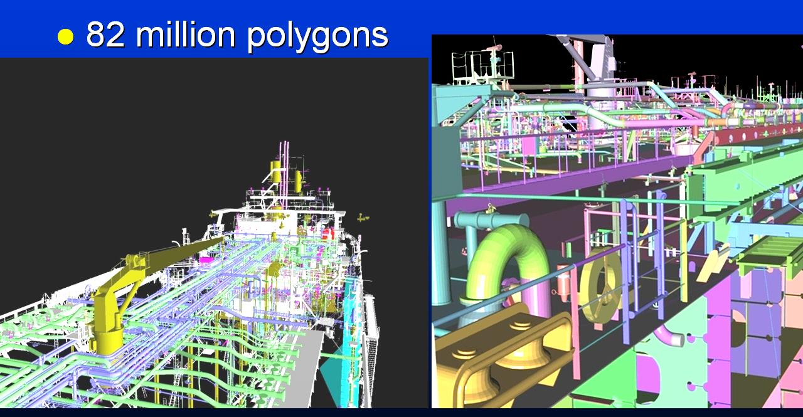

<!-- page: 42 -->

大规模网格模型：雕塑

42

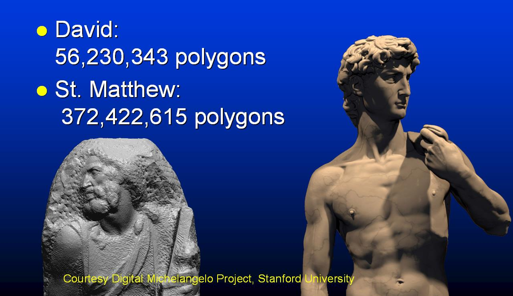

<!-- page: 43 -->

Michelangelo，1475年3月6日－1564年2月18日

43

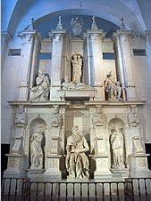

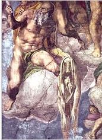

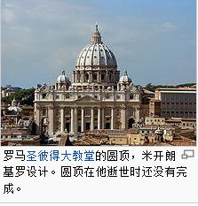

<!-- page: 44 -->

小结

多边形网格表示的相关概念

多边形网格表示的半边结构

法向量计算

网格渲染

44
