# 8- Half edge data structure and Euler Operation

<!-- page: 1 -->

计算机图形学与虚拟现实

冼楚华
Email: chhxian@scut.edu.cn
华南理工大学计算机科学与工程学院

<!-- page: 2 -->

课程信息

• 授课老师姓名：冼楚华
• Email: chhxian@scut.edu.cn
• 个人主页：https://chuhuaxian.github.io/
• QQ：89071086 （比较少用，非急事请不要私聊）
• 办公室：B3-202-2
• 课程QQ群（见二维码）

<!-- page: 3 -->

内容

边界表示(B-rep)半边数据结构

实体造型欧拉操作

3

<!-- page: 4 -->

二维流型的概念（2D Manifold）

在数学中，一个二维流形是一种拓扑空间，其中每一点附近都类似于

二维欧几里得空间。更准确地说，二维流形上的每个点都有一个邻域
，该邻域与二维欧几里得空间同胚。

例子：非边界点邻域与圆同胚

4

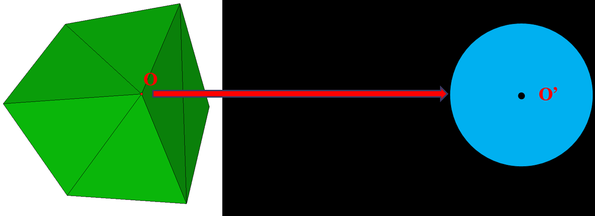

<!-- page: 5 -->

二维流型的概念（2D Manifold）

在数学中，一个二维流形是一种拓扑空间，其中每一点附近都类似于

二维欧几里得空间。更准确地说，二维流形上的每个点都有一个邻域
，该邻域与二维欧几里得空间同胚。

例子：边界点的邻域与半圆同胚

5

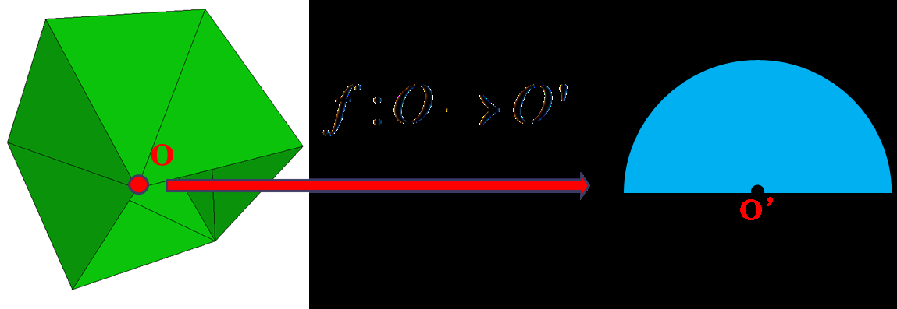

<!-- page: 6 -->

非流型(Non-manifold)

碟状相邻

非流型点

非流型边

6

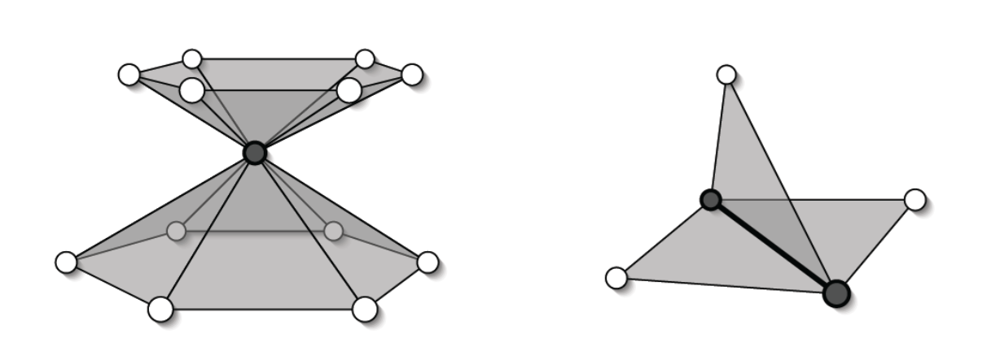

<!-- page: 7 -->

非流型(Non-manifold)

非流型点

非流型边

7

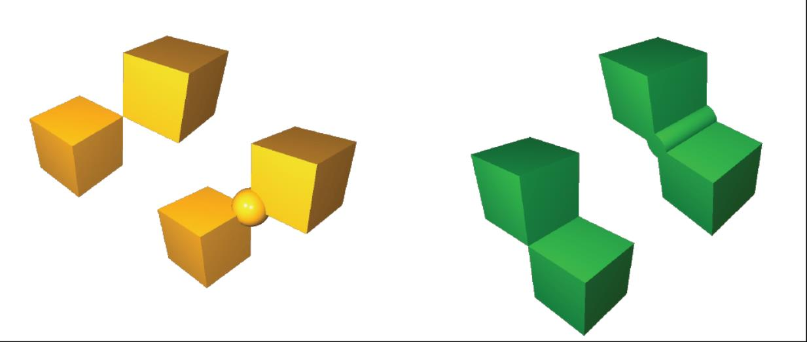

<!-- page: 8 -->

实体模型半边数据结构


体Body

体
Body


first face


面Face


first Loop


next

previous
next

面
Face


previous


环Loop


first half edge

previous
next

环
Loop


半边Halfedge


next


previous


opposite

previous
next

半边
HalfEdge


start vertex


to vertex


edge

边
Edge


顶点Vertex

顶点

Vertex


half edge

8

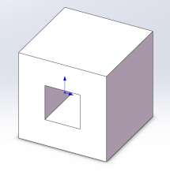

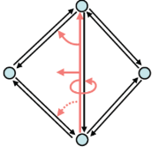

<!-- page: 9 -->

实体模型半边数据结构

start_vertex

to_vertex

next_halfedge

opposite_halfedge

loop

9

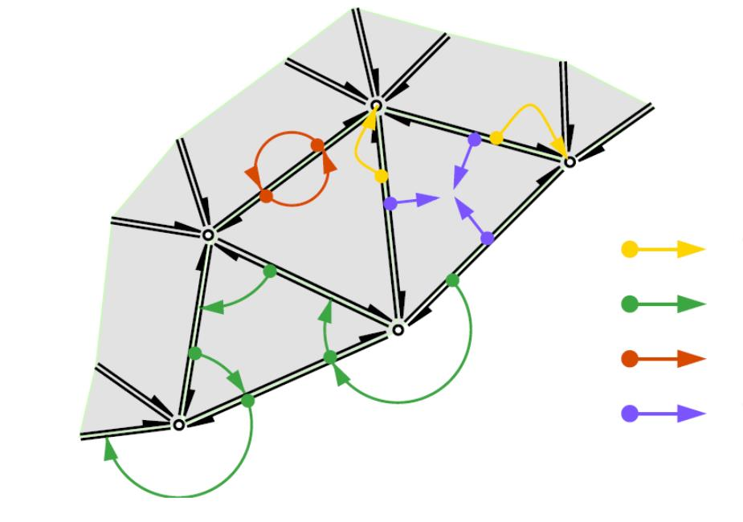

<!-- page: 10 -->

半边数据结构的一邻域访问

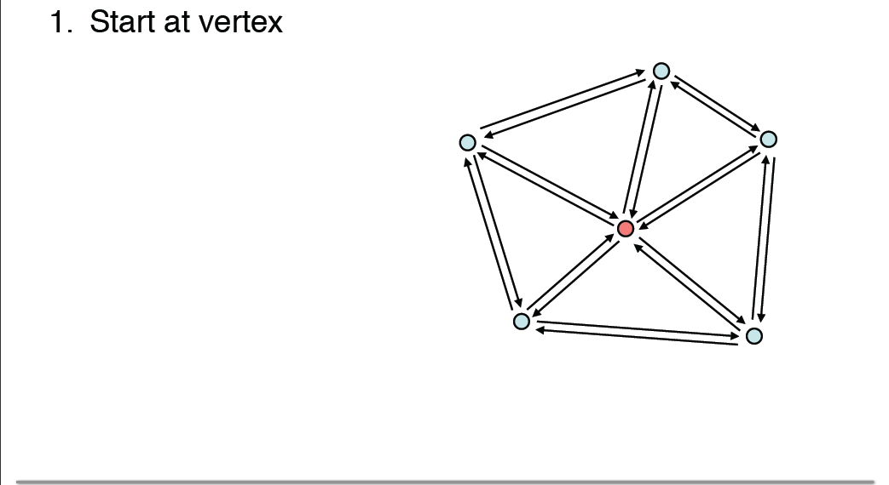

<!-- page: 11 -->

半边数据结构的一邻域访问

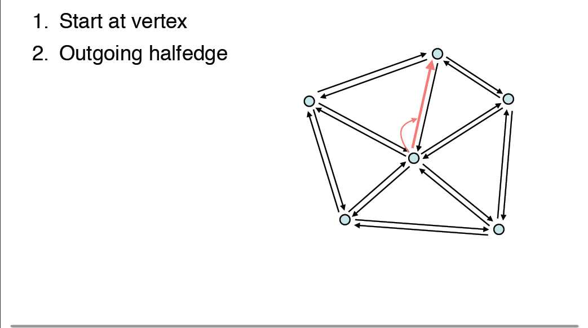

<!-- page: 12 -->

半边数据结构的一邻域访问

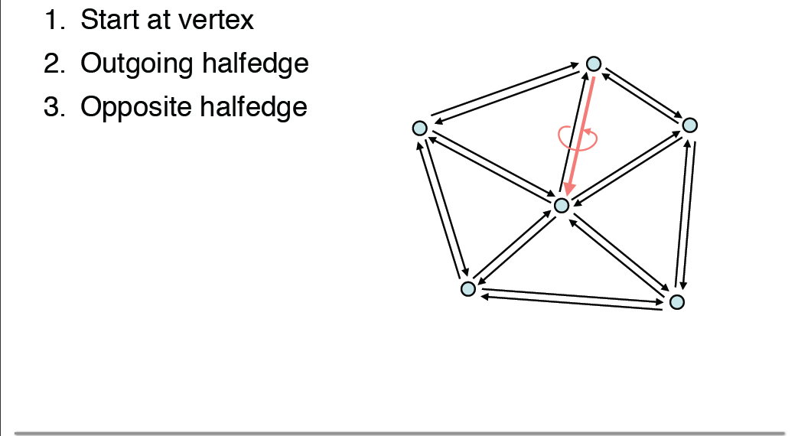

<!-- page: 13 -->

半边数据结构的访问

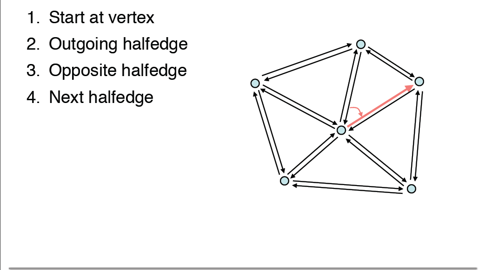

<!-- page: 14 -->

半边数据结构的一邻域访问

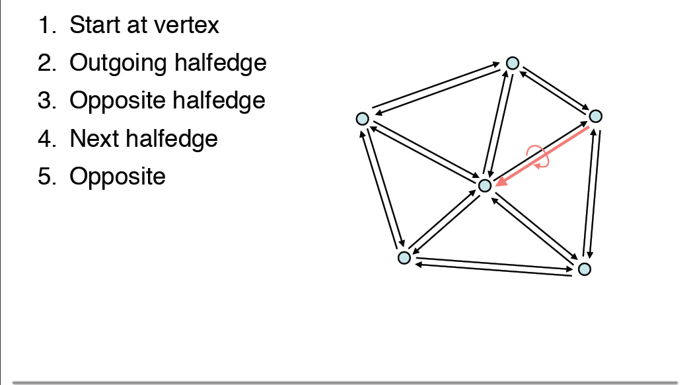

<!-- page: 15 -->

半边数据结构的一邻域访问

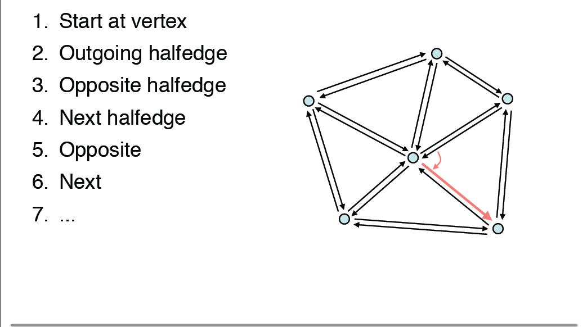

<!-- page: 16 -->

实体模型欧拉操作

欧拉操作旨在有效的构建B-rep

r

中的拓扑结构(通用、有效)

欧拉公式：V+F-E=2

扩展（欧拉–庞加莱公式）：

V+F-E=2(s-h)+r，其中s是

h

体的个数，h(hole or
handle) 是柄（亏格）的个
数，r（ring）是“内环面边
界”的数量

16

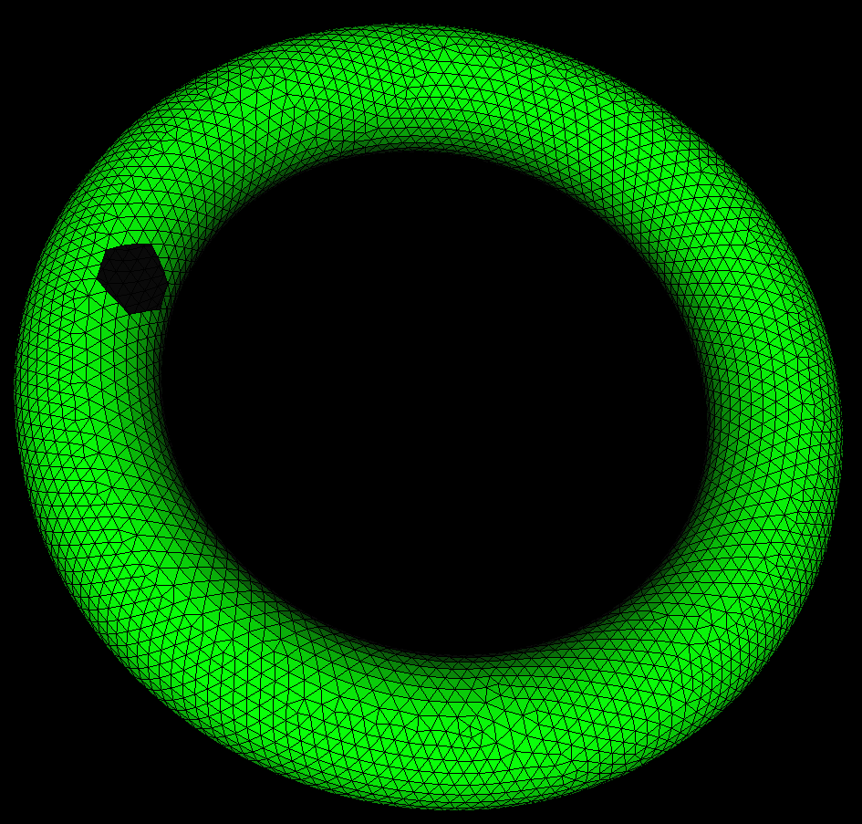

<!-- page: 17 -->

实体模型欧拉操作

欧拉的选择(6维空间的5维超平面)

e
v
f
h
r
s
操作

1
1
0
0
0
0
mev

0
1
1
0
0
0
mef

1
0
1
0
0
1
mvfs

0
-1
0
0
1
0
kemr

0
0
-1
1
1
0
kfmrh

17

<!-- page: 18 -->

实体模型欧拉操作

相关缩写

h : hole (or handle)

s : solid

m : make

r : ring

f : face

k : kill

e : edge

s : split

v : vertex

j : join

18

<!-- page: 19 -->

欧拉操作-具体功能

mvfs: 定义一个体、一个面、一个外环、

一个点

反操作为kvfs

f

v

19

<!-- page: 20 -->

欧拉操作-具体功能

mvfs的实现：

f

v

20

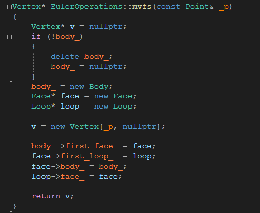

<!-- page: 21 -->

欧拉操作-具体功能

mev:定义一个新点，同时定义一条连接

新点与另一给定点的边

反操作为kev

v0
v1

v0
v1

v0

v1

v0
v1

v0
v1

v0

v1

21

<!-- page: 22 -->

欧拉操作-具体功能

mev的实现：主要分两种情况(实现见源

代码)

v1

he1

he0

v0

22

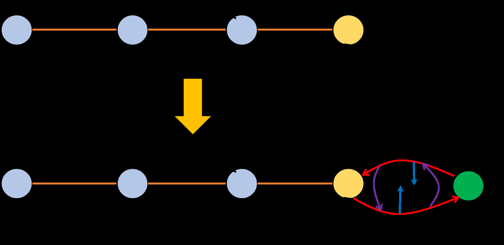

<!-- page: 23 -->

欧拉操作-具体功能

mef: 以两给定点为端点定义一条新的边

，同时定义一个新的面(含一个新的环)

反操作为kef

v0
v1

v1

v0

v0
v1

v1

v0

<!-- page: 24 -->

欧拉操作-具体功能

kemr: 消去环中的一条边，定义一个内环

反操作为mekr

<!-- page: 25 -->

欧拉操作-具体功能

kfmrh:删除一个面，并将其定义为另一个

面的内环，进而在体中生成一个通孔或将
两物体合并成一个物体。

反操作为mfkrh

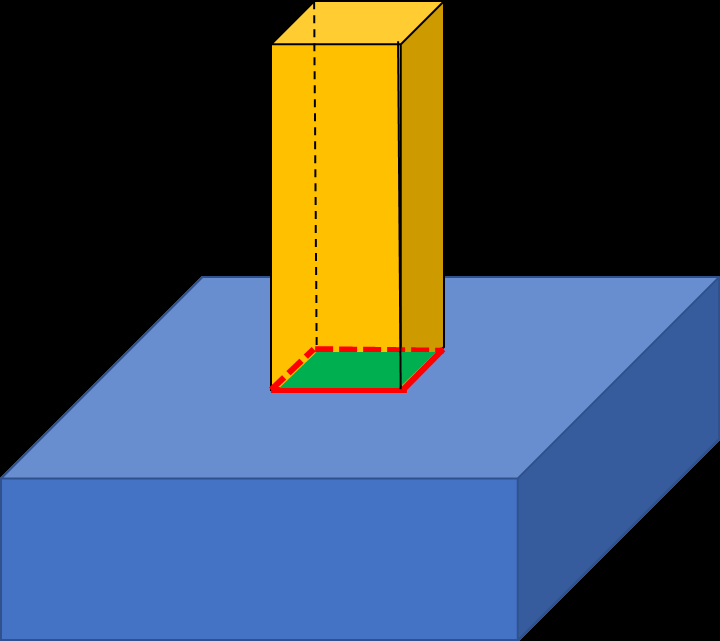

<!-- page: 26 -->

欧拉操作-具体功能

两个辅助操作：

semv(e0, v, e1): 将e0分割成两段，生成一个新的点v和一条新

的边e1

jemv(e0, e1): 合并两条相邻的边e0、e1，删除它们的公共端点v

e0

e0
e1

v

e0
e1

v

e0

<!-- page: 27 -->

欧拉操作-一个具体例子

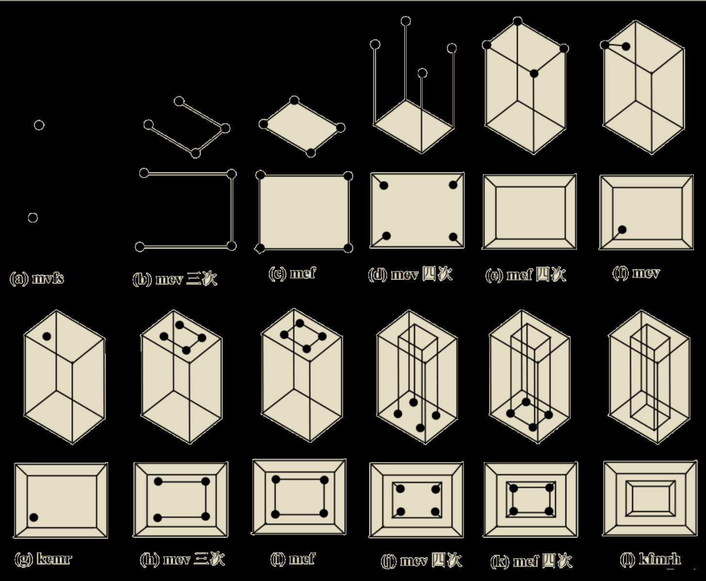

<!-- page: 28 -->

欧拉操作的结论

欧拉操作是有效的；用欧拉操作对形体操作结果在物理

上是可实现的，欧拉操作是完备的，任何形体可在有限
步的欧拉操作中构造出来。

所有流型体的边界表示都可由欧拉操作构造出来；

由欧拉操作构造出的边界表示在拓扑结构上一定是有效

的;

将其正确嵌入三维空间结果一定是流型体。

这些操作都给CAD模型中流形体的构建提供了理论的

依据，所以底层的大厦由此慢慢开始建立，就像数学的
光辉殿堂一样，理论的强有力的证明为它带来了严谨而
且让人信服的意义。

28

<!-- page: 29 -->

小结

半边数据结构

实体造型欧拉操作

29
