# 9 Geometric representations

<!-- page: 1 -->

计算机图形学与虚拟现实

冼楚华
Email: chhxian@scut.edu.cn
华南理工大学计算机科学与工程学院

<!-- page: 2 -->

课程信息

授课老师姓名：冼楚华

Email: chhxian@scut.edu.cn

个人主页：https://chuhuaxian.github.io/

QQ：89071086 （比较少用，非急事请不要私聊

）

办公室：B3-202-2

课程QQ群（见二维码）

<!-- page: 3 -->

3D 模型

3

<!-- page: 4 -->

Agenda

Meshes (网格表示)

Subdivision curves and

surfaces (细分曲面)

L-System (L系统)

Particle system(粒子系统)

Parametric curves and

surfaces (参数曲线曲面)

4

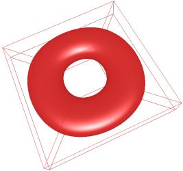

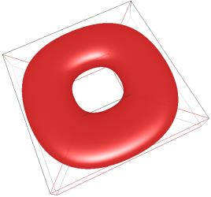

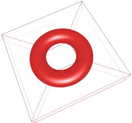

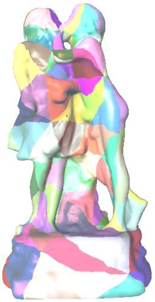

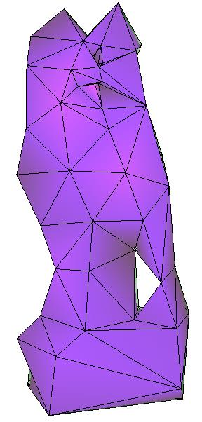

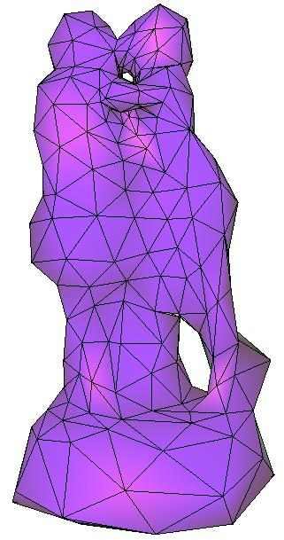

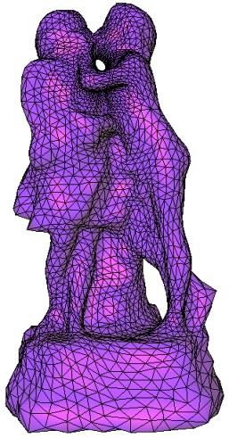

<!-- page: 5 -->

Agenda

Parametric curves and surfaces

(参数曲线曲面）

Simple parametric curves and surfaces

Parametric curves in CAGD

Parametric surfaces in CAGD

5

<!-- page: 6 -->

Agenda

Parametric representation of curves and

surfaces

What is a parametric representation

Bezier curves and surfaces

B-spline curves and surfaces

6

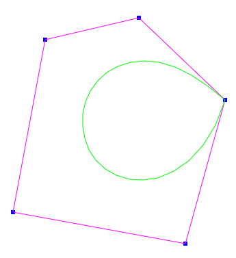

<!-- page: 7 -->

直线段

Line segment: P0(x0, y0, z0)→P1(x1, y1, z1)

Parametric representation (参数表示)

( )
(
)
0
1
1
t
t
t
=
−
+
R
P
P
0
1
t


Coordinate components (分量表示)

( )
(
)
( )
(
)
( )
(
)

=
−
+


=
−
+


=
−
+


x t
t x
tx
y t
t y
ty
z t
t z
tz

1
1
1

0
1

0
1
t


0
1

0
1

0
1
t


Parametric domain(参数域)[0,1]：

7

<!-- page: 8 -->

几何意义(Geometric meaning)

Mapping from domain

to line segment (映射)

Endpoints correspond.

（端点对应）

0
(0) =
R
P
1
(1) =
R
P

8

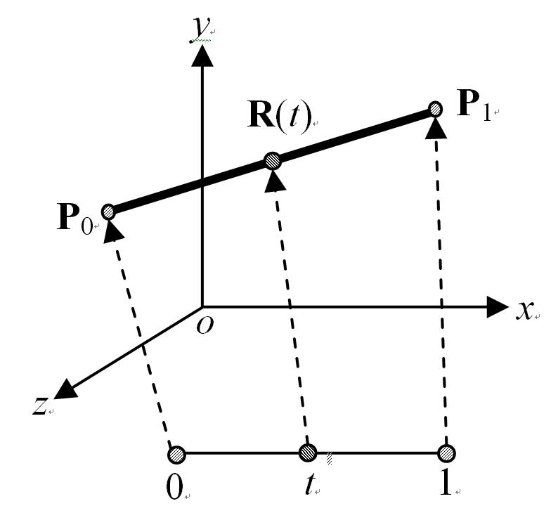

<!-- page: 9 -->

一般参数曲线

一般形式

( )
( )
( )
( )
(
)
,
, z
t
x t
y t
t
=
R

Mapping: t 
R(t)(参数域
曲线上点)

参数域有限区间(a finite interval ) parametric

curve segment (参数曲线段)

x(t), y(t), z(t)是分段有理多项式(piecewise rational

polynomials )

9

<!-- page: 10 -->

Bilinear quadrilateral patches
(双线性四边形曲面片)

Parametric expression(表达式)

(
)
(
) (
)
(
)
0
1
3
2
,
1
1
1
u v
v
u
u
v
u
u
=
−
−
+
+
−
+








R
P
P
P
P

(u,v)∈[0,1]×[0,1]

Four points P0、P1、P2  and P3

p3

four corners of the surface:

p0

p2

p1

R(0,0)、R(1,0)、R(1,0) and R(0,1)

10

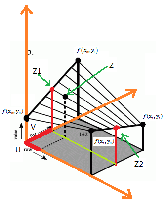

<!-- page: 11 -->

Geometric meaning(几何意义)

Bilinear quadrilateral patch(双线性四边形曲面片)

11

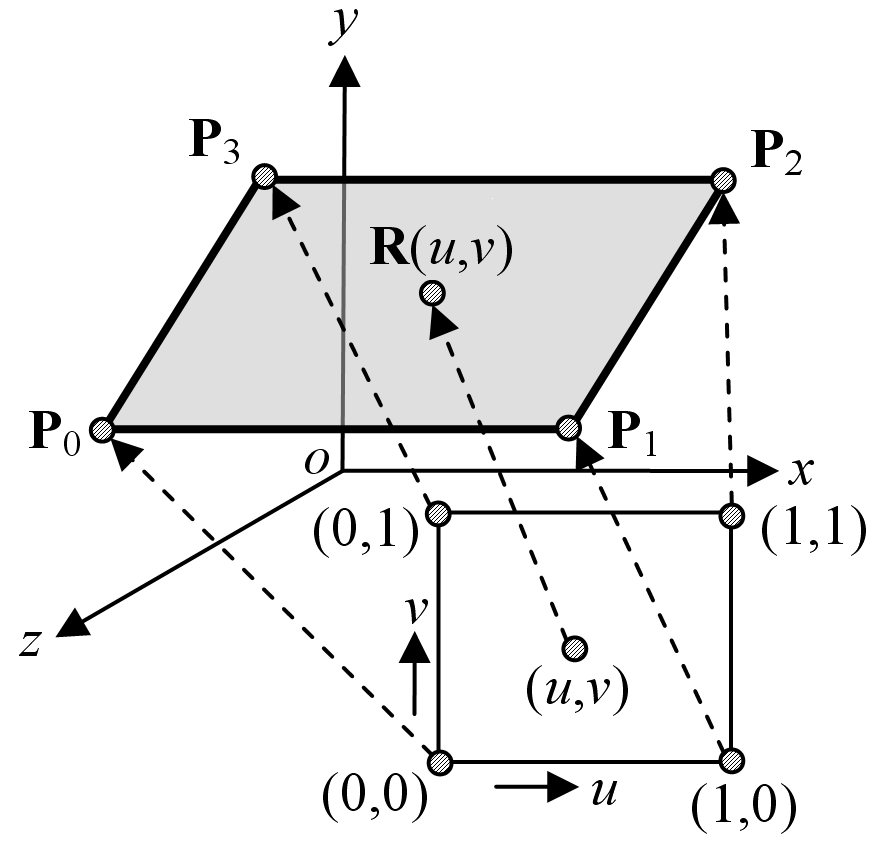

<!-- page: 12 -->

What are parametric surfaces：
general surfaces (参数曲面一般形式)

General form (参数曲面的

一般形式)

(
)
(
)
(
)
(
)
(
)
,
,
,
,
,
,
u v
x u v
y u v
z u v
=
R

One-to-one mapping: (u,

v)
R(u,v) (一一映射)

有限的参数域(A finite

parametric domain, e.g. a
rectangle)

多项式或有理多项式[(rational)

polynomials]

12

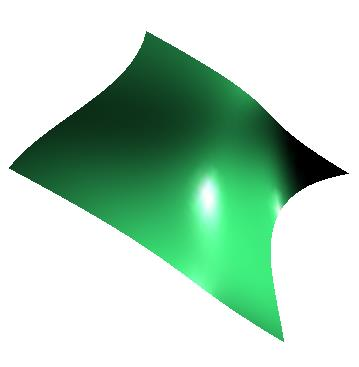

<!-- page: 13 -->

参数表示的优点

参数表示是显式的

易于计算曲面上点的几何属性

易于网格化

13

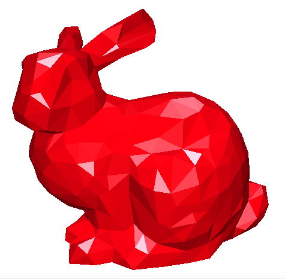

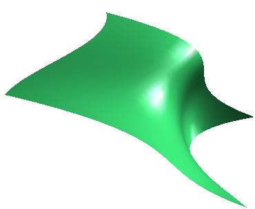

<!-- page: 14 -->

参数表示的优点

易于计算：法向、曲率、测地线、曲率线等

)
(a
)
(b
)
(c
)
(d

Pseudo-color visualization of mean curvature

(平均曲率伪彩绘制)

14

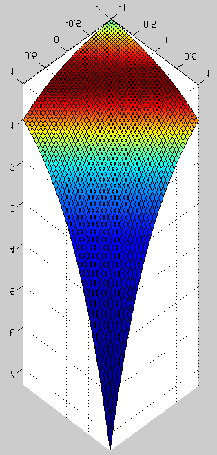

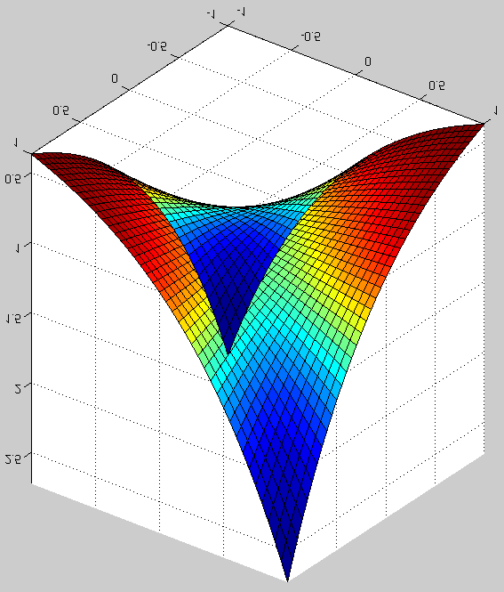

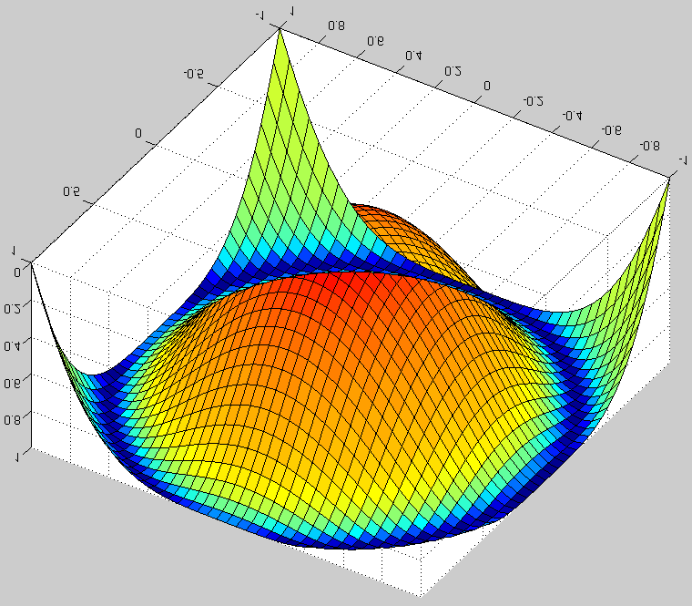

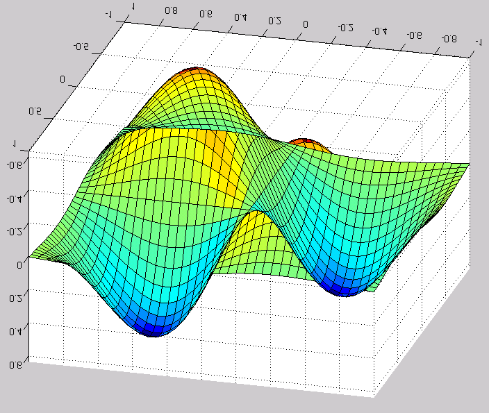

<!-- page: 15 -->

参数表示的优点

易于控制曲面形状

Bézier、B-样条、NURBS (Non-Uniform Rational B-

Spline, 非均匀有理B-样条)曲线/曲面

Mesh shape editing needs to solve large scale optimization

15

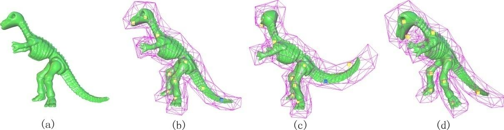

<!-- page: 16 -->

Applications

Fonts
Path planning
Shape design

16

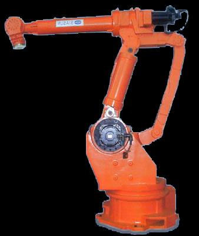

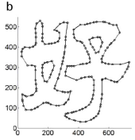

<!-- page: 17 -->

Bézier曲线

Bézier曲线
给定四个点

Bézier曲线上得点由控制定点混合得到。

17

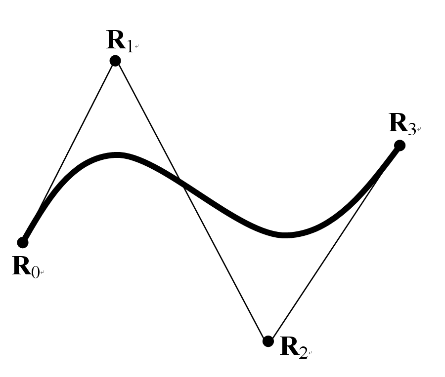

<!-- page: 18 -->

目标：曲线要光滑；形状控制要直观

18

<!-- page: 19 -->

Bézier曲线

Pierre Bézier (1910-

1999)  in Renault

19

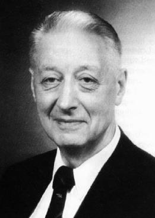

<!-- page: 20 -->

N次Bézier曲线定义

控制多边形：R0R1 … R𝑛(R𝑘= (𝑥𝑘, 𝑦𝑘, 𝑧𝑘))

Bézier曲线公式

𝑛

R 𝑡= 𝑥𝑡, 𝑦𝑡, 𝑧𝑡
= ෍

R𝑘𝐵𝑘,𝑛𝑡, 0 ≤𝑡≤1

𝑘=0

𝐵𝑘,𝑛𝑡= 𝑛

𝑘(1 −𝑡)𝑛−𝑘𝑡𝑘为Bernstein基/混合函数,满足:

𝑛
𝐵𝑘,𝑛(𝑡) = (1 −𝑡+ 𝑡)𝑛= 1

σ𝑘=0

R2

Rn−1

Rn

R1

R0

20

<!-- page: 21 -->

Bézier曲线性质

插值端点(Interpolating two endpoints)

𝐑(0) = 𝐑0 𝐑(1) = 𝐑n

三次Bézier曲线
切向量计算(Tangent vectors)

𝐑(0) = n(𝐑1 −𝐑0)

𝐑(1) = n(𝐑n −𝐑n −1)

)
对称性(Symmetry)

σ𝑖𝑹𝑛−i𝐵𝑖, 𝑛(𝑡) = σ𝑖𝑹𝑖𝐵𝑖, 𝑛(𝑡)
(曲线关于控制多边形顶点的枚举方向无关）

21

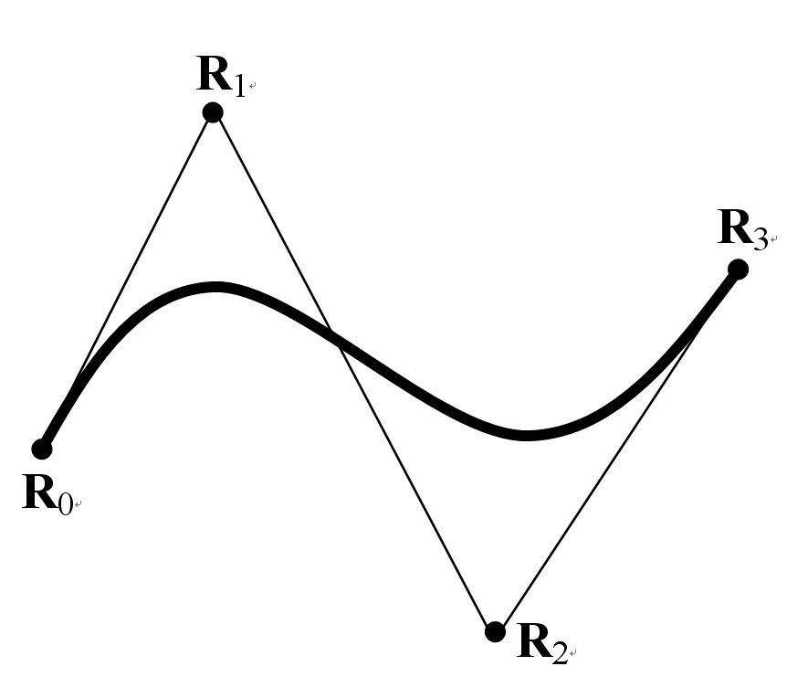

<!-- page: 22 -->

三次Bezier曲线(Cubic Bezier Curve)

基函数的几何形状

表示

R 𝑡= (1 −𝑡)3R0 +

3𝑡(1 −𝑡)2R1 +
3𝑡2(1 −𝑡) R2 +
𝑡3R3

基函数取值如右图

22

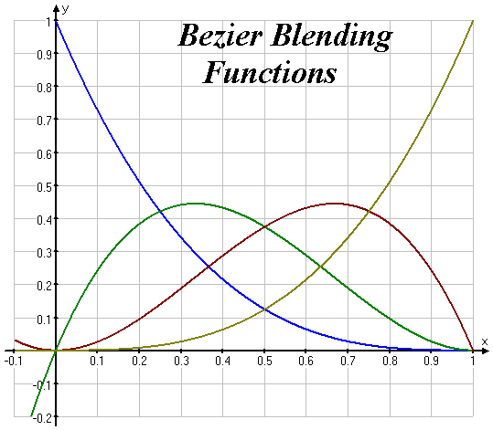

<!-- page: 23 -->

Bézier曲线的矩阵表示(Bézier Matrix)

三次Bezier曲线为例

R 𝑡= (1 −𝑡)3R0 + 3𝑡(1 −𝑡)2R1 + 3𝑡2(1 −𝑡)R2 + 𝑡3R3

R0
R1
R2
R3

−1
3
−3
1
3
−6
3
0
−3

R 𝑡= 𝑡3
𝑡2
𝑡1
1

1
3
0
0
0
0
0

n次Bézier曲线的矩阵表示

𝑄𝑡= 𝐭𝑇𝑀𝐵𝐑

𝐭= (𝑡𝑛
⋯
𝑡
1); 𝑀𝐵:  Bézier matrix;  R = R0, R1, … , R𝑛𝑇

<!-- page: 24 -->

Bézier曲线性质(设计性质)

凸性(Convexity)：Bézier curve is

enveloped by the convex hull of
its control polygon

Bézier曲线的凸包性
几何不变性或仿射不变性

(Geometric invariant or affine
invariant )

P1
P2

3

P3


=

0
3,
1
)
(

i
t
B

=

i

P0

24

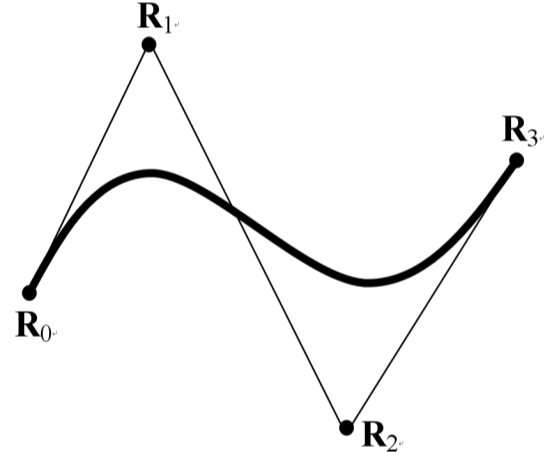

<!-- page: 25 -->

Some examples (例子)

25

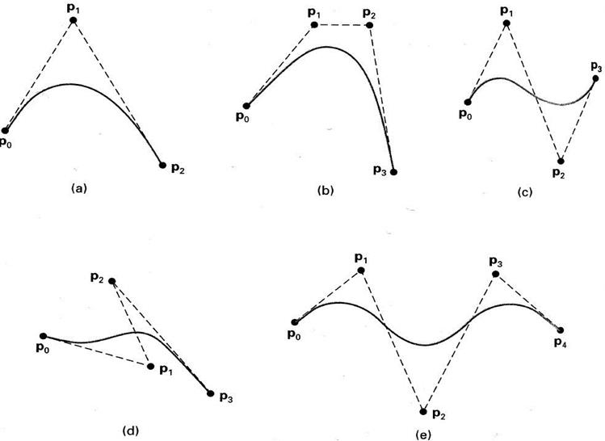

<!-- page: 26 -->

Bézier曲线细分性质

SubdivideBezierCurve(t0, R)
{

for(i=0; i≤n; i++)

(0)=Ri;
for(s=1; s ≤n; s++)
for(i=0; i ≤n-s; i++)

Ri

Ri(s)=(1- t0) Ri

(s-1);
return R(t0);
}
Illustration of Cubic
Bézier curve subdivision

(s-1)+ t0Ri+1

Subdivision algorithm of Bézier curve
of degree 𝑛(Bézier曲线细分算法)

Reference：http://en.wikipedia.org/wiki/B%C3%A9zier_curve

26

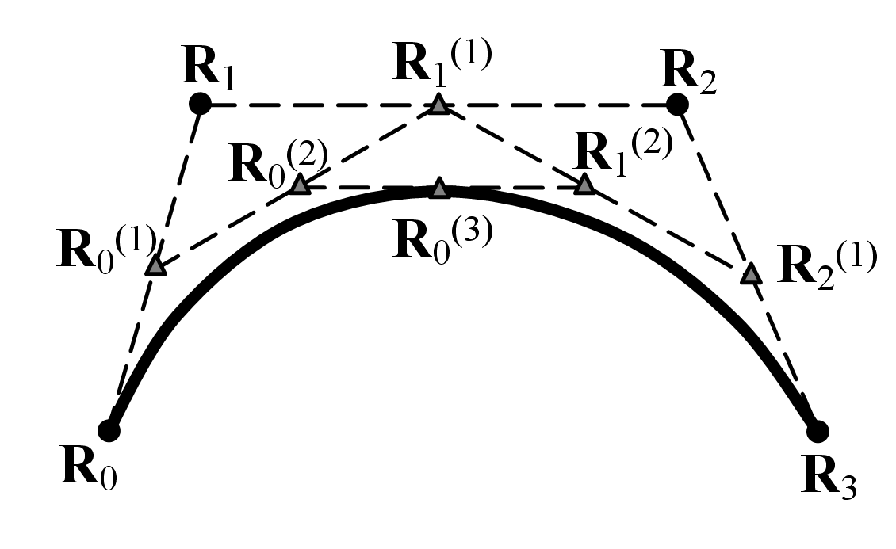

<!-- page: 27 -->

Bézier曲线的细分性质

一段分为两段(The curve is split into two):


=



=



n



( )

( )
( )

s
left

R
R

t
B
t
t

0
1

，

s n
s

0
,
0

=

n



( )

(
)
( )

−

n s
right

R
R

t
B
t
t

,0
1

s
s n
s

,
0

=

控制多边形越来越逼近曲线本身(The control

polygon approximates the curve with the
increasing of subdivision depth)

可用于绘制多边形(used to render the curve)

27

<!-- page: 28 -->

Bézier曲线缺点

全局性：Moving a control point

changes the whole shape

复杂形状需拼接(stitch multiple Bezier

curves)

位置连续(Position continuity)：𝐶0(或𝐺0)

光滑(Smoothness): 𝑛次导数𝐶𝑛(或几何𝐺𝑛)

28

<!-- page: 29 -->

Agenda

参数曲线和曲面

参数表示的数学原理

参数曲线

Bézier曲线

B-spline (B样条曲线)

NURBS曲线

参数曲面

29

<!-- page: 30 -->

历史

A Duck (weight)
Ducks trace out curve

30

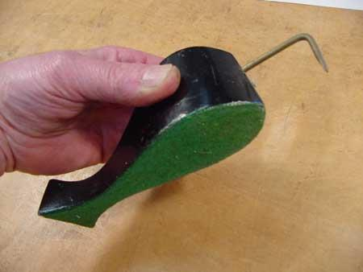

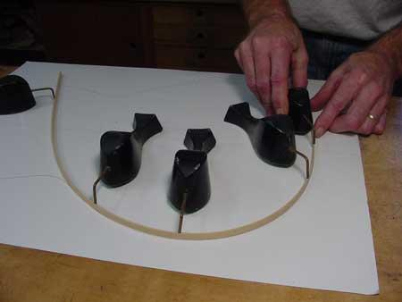

<!-- page: 31 -->

B-spline: example(样条曲线实列)

R2

R1

R7

R3

R0

R4

R6

R5

B-spline of degree 3(order 4) (三次(四阶)B样条曲线)

31

<!-- page: 32 -->

核心思想是定义分段连续多项式函数

1

1

i+2

i
i+1

i
i+1

32

<!-- page: 33 -->

B样条曲线定义（B: basis）

节点向量(knot vector)

u={u0, u1, …, ui, …, un+k+1 }
𝑛+ 1个控制顶点, k次(order k+1) B样条

n

=
=
R
R

( )
( )
,
0

i
i k
i
u
N
u

𝑢𝑘−1 ≤𝑢≤𝑢𝑛+1

分段多项式
𝑘次或𝑘+ 1阶B样条

33

<!-- page: 34 -->

B-splines基的递归定义

Ri: 控制顶点，{Ri}i=0,1,…,n: 控制多边形

Ni, k(u) 是B样条的基(basis)：





= 


u
u
u
N

1

当

+

i
i
i

1
,0

0

其它




−
−

=
+

−
−



u
u
u
u
N
u
N
u
N
u
u
u
u
u

( )
( )
( )

+ +
−
+
−
+
+ +
+

i
i k
i k
i k
i
k
i k
i
i k
i

1
,
,
1
1,
1
1
1

0
0
0

=



规定

34

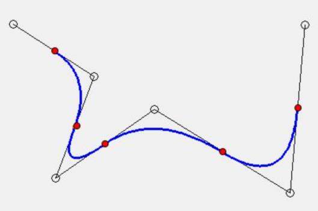

<!-- page: 35 -->

递归关系

𝑘= 1
𝑘= 2
𝑘= 3
𝑘= 4

35

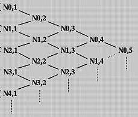

<!-- page: 36 -->

B样条基是规范化的(normalization)

规范化

u
N0,3
N1,3
N2,3

N3,3

所有基的和为1

n=3  (4个控制顶点)

k=3  三次(四阶)曲线

u=[0 0 0 1 2 2 2 2]

在u = 0.6 处，基函数的和为：

N0,3+N1,3+N2,3+N3,3 =0.16+0.66+0.18+0.0= 1.0

36

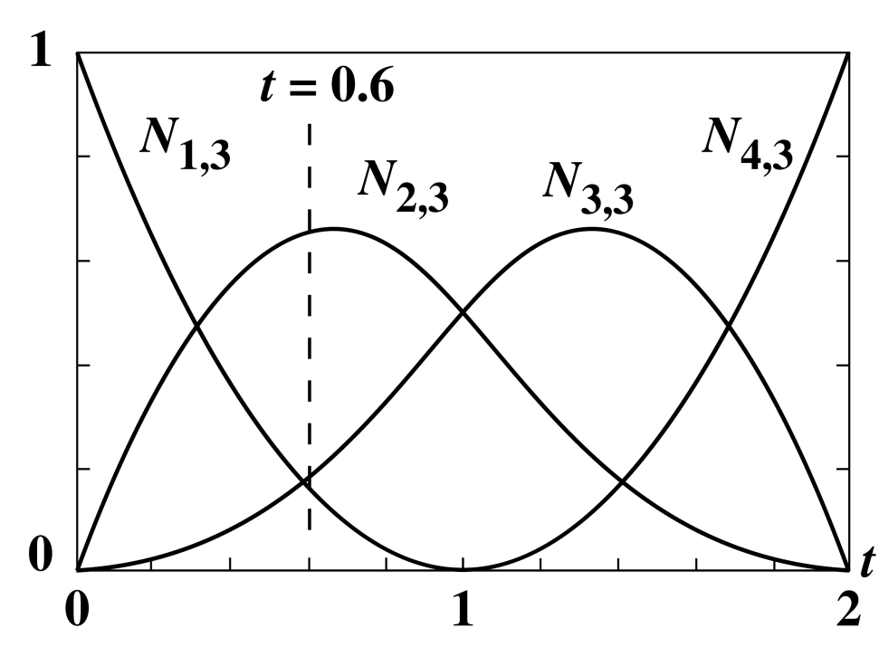

<!-- page: 37 -->

周期均匀B样条(Periodic uniform knot )

周期性均匀节点向量

𝑈𝑖= 𝑖(0 ≤𝑖≤𝑛+ 𝑘+ 1)

例子

周期均匀三次B样条

(𝑘= 3, 𝑛= 3) 
节点数𝑛+ 𝑘+ 2 = 8

(0, 1, 2, 3, 4, 5, 6, 7)

The basis splines over the full domain of u

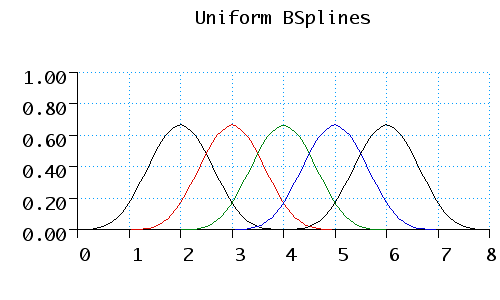

<!-- page: 38 -->





= 


u
u
u
N

1
0

当
其它

+

i
i
i

1
,0




−
−

=
+

−
−



B-样条基的推导

u
u
u
u
N
u
N
u
N
u
u
u
u
u

( )
( )
( )

+ +
−
+
−
+
+ +
+

i
i k
i k
i k
i
k
i k
i
i k
i

1
,
,
1
1,
1
1
1

0
0
0

=



定义

k=0

1

i
u
i
N
i

+

=
=



1
1
0,1,...,6
0
i

当
，
其它

,0

i
i+1

k=1,

+1
+1
=
=1
i k
i
i k
i
u
u
u
u
+
+
−
−

,1
,0
1,0
(
)
( )
(
2
)
( )
i
i
i
N
u
i N
u
i
u N
u
+
=
−
+
+
−

1

1
u
i
i
u
i
−

+
，

2+ -
1
2
i u
i
u
i
+ 
+
，
= {

i+2

i
i+1

𝑖= 0,1,2, … , 5

38

<!-- page: 39 -->

B-样条基的推导k=2

,1
,0
1,0
(
)
( )
(
2
)
( )
i
i
i
N
u
i N
u
i
u N
u
+
=
−
+
+
−


k=1

1
u
i
i
u
i
−

+
，

2+ -
1
2
i u
i
u
i
+ 
+
，
= {

1

1

i+2i+3
𝑖= 0,1,2, … , 5

i i+1

i+2

i i+1

,2
,1
1,1
3
( )
( )
2
2
i
i
i
u
i
i
u
N
N
u
N
u
+
−
+
−
=
+

k=2 递推式：

分三段表示：

1
,
1
2
i
N
u
i
i
u
i
=
−

+

(
)

2
,2

1
1
2
(
3
)( -
1),
2
2
       = +1
2

(
)(
)
,2

=
−
+
−
+
+
−
−

i
N
u
i
i
u
i
u u i


+

i
u
i

1 (
3
)(3+
),   +2
3
2
i
N
i
u
i
u
i
u
i
=
+
−
−

+

,2

39

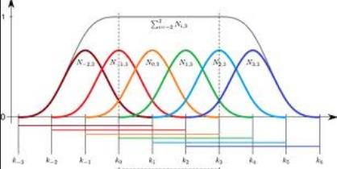

<!-- page: 40 -->

B-样条基的推导k=3?

,3
,2
1,2
4
( )
( )
3
3
i
i
i
u
i
i
u
N
N
u
N
u
+
−
+
−
=
+

k=3？

40

<!-- page: 41 -->

三次周期性均匀B样条：一段

Normalize u (0≤ u ≤ 1,规范化参数域)

N0,3(u) = 1/6 (1-u)3

N1,3(u) = 1/6 (3u3 – 6u2 +4)

N2,3(u) = 1/6 (-3u3 + 3u2 + 3u +1)

N3,3(u) = 1/6 u3

对应的参数曲线

R(u) = N0,4(u)R0 + N1,4(u)R1 + N2,4(u)R2  + N3,4(u)R3

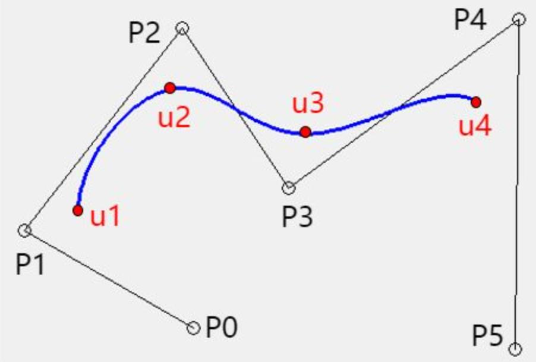

<!-- page: 42 -->

Periodic uniform cubic spline: Matrix

In matrix form (矩阵表示)





R
R

0














1

=

1
2
3
1
)
(

M
u
u
u
u
R
n

R
R

2





3

−
−





0
3
0
3
0
3
6
3
1
3
3
1











−

6
1

=

n
M

−

0
1
4
1





<!-- page: 43 -->

Periodic uniform knot

P0

<!-- page: 44 -->

Closed periodic

P2

P2

Example: 𝑘= 3, 𝑛= 7;

𝑢= {0,1, 𝟐, 𝟑, 𝟒, 𝟓, 𝟔, 𝟕, 𝟖, 9, 10}

P2

P2

P3

P1

P1

P2

P3

P1

P1

P3

P1

P3

P3

P0

P0

P4

P4

P0

P4

P0

P4

P4

P0

P5

P5

P5

P5

P5

<!-- page: 45 -->

Properties of B-splines (性质)

凸包性(Convex hull)

More strict than Bezier curves

几何不变性(Geometric invariant properties)

closure

Quadratic B-spline (二次B样条)

45

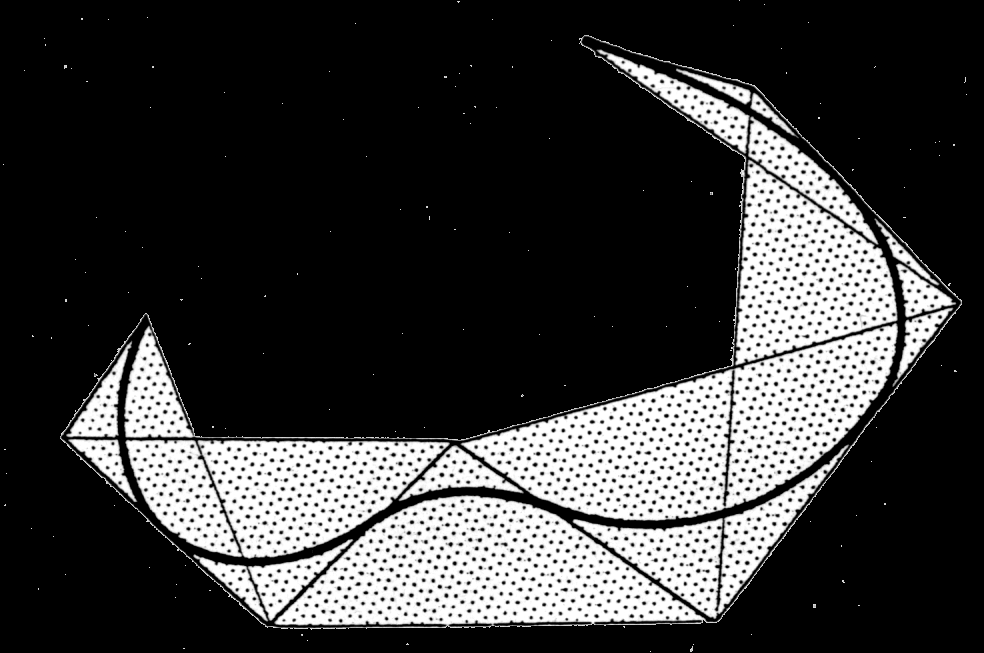

<!-- page: 46 -->

Open B-splines(非周期均匀B样条)

节点向量在端点处重复k+1次

B样条曲线会插值端点

端点处切向量与边一致

For n=k+1，the B-spline

degenerates to a Bézier curve

46

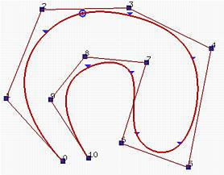

<!-- page: 47 -->

(Continued)

局部性(Local property)

移动一个控制顶点，只影响曲线的局部区域

Local property of B-spline of degree 3

47

<!-- page: 48 -->

Agenda (omitted)

参数曲面表示

参数表示的数学原理

参数曲线

Bézier曲线

B-样条曲线

NURBS曲线

参数曲面

48

<!-- page: 49 -->

引入NURBS曲线的原因

B-样条情形不能精确表示二次曲面与平面

的交线，如圆锥曲线(平面与圆锥的交线)

抛物线
椭圆(上)与圆(下)
双曲线

49

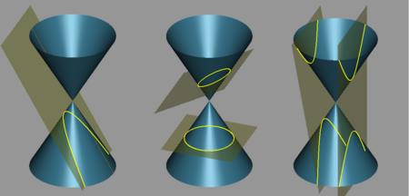

<!-- page: 50 -->

NURBS曲线

NURBS (Non-Uniform Rational B-Spline)：

非均匀有理B-样条的简称

n

= 

( )



R
R

N
u
u

i
i
i k
i

,
0

定义：
( )

=

n



( )



N
u

i
i k
i

,
0

=

50

<!-- page: 51 -->

NURBS曲线

{Ni,k(u)}为单位化的B-样条基函数

{Ri}为控制顶点

NURBS曲线新增加的曲线控制手段是权

因子{ωi }，

首末两个权因子ω0>0、ωn>0

其余的权因子满足ωi≥0

51

<!-- page: 52 -->

NURBS曲线的权因子

每一个权因子对应于一个控制顶点

调整权因子的大小可以调整曲线的形状。

当所有的权因子ωi=1时，就是B-样条曲线；

当某个权因子ωi=0时，对应的控制顶点对曲

线的形状没有影响

当ωi→∞时，曲线R(u) →Ri ，即曲线过点Ri

52

<!-- page: 53 -->

NURBS曲线的例子

NURBS曲线权因子对曲线形状的影响

53

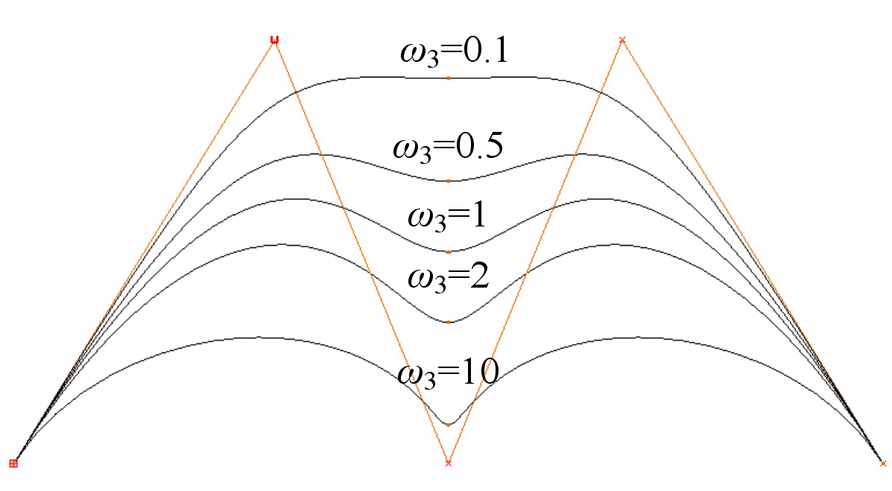

<!-- page: 54 -->

NURBS曲线表示圆

R3

用三个120°圆弧表示圆：

R4

R2

u=[0 0 0 1 1 2 2 3 3 3]

k = 3

[ωi] = [1, ½, 1 , ½, 1,  ½, 1]

R0
R6
R1

R5

控制顶点分布如右图所示
NURBS曲线表示圆

54

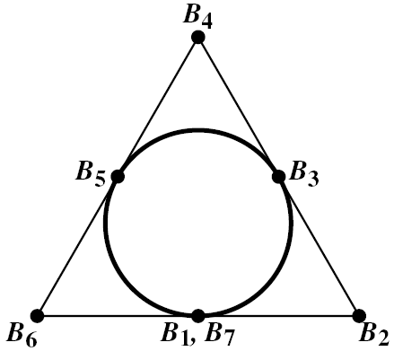

<!-- page: 55 -->

Agenda

Parametric curves and surfaces

参数表示的数学原理

参数曲线

Parametric surfaces

Bézier surfaces

B-样条曲面

NURBS曲面

55

<!-- page: 56 -->

56

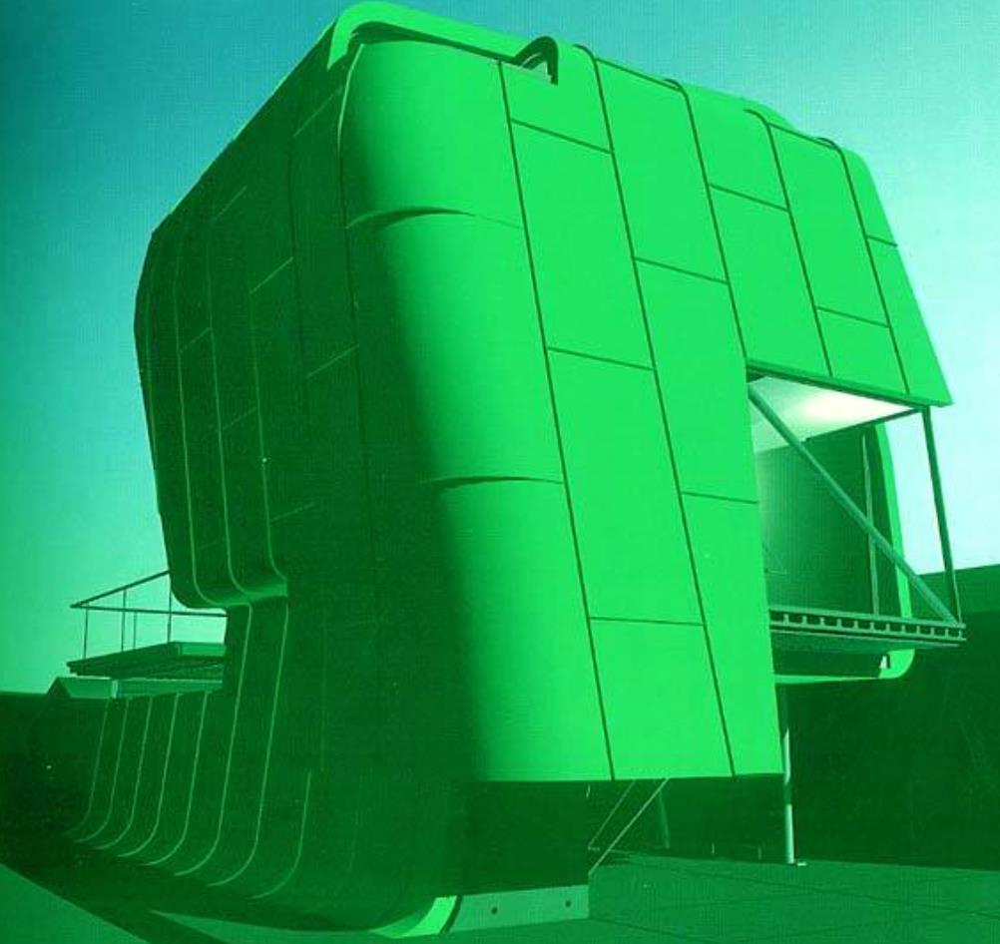

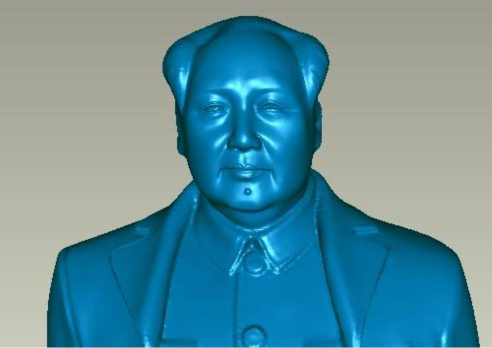

<!-- page: 57 -->

双三次Bézier曲面(Bicubic Bézier surfaces)

控制网格

R𝑖𝑗= 𝑥𝑖𝑗, 𝑦𝑖𝑗, 𝑧𝑖𝑗, 0 ≤𝑖, 𝑗≤3

曲面表示

3
σ𝑗=0

3
R𝑖𝑗𝐵𝑖3(𝑢)𝐵𝑗3(𝑣) , 𝑢, 𝑣∈[0,1]

R 𝑢, 𝑣= σ𝑖=0

R30

R23

R13

R30
R03

R20

R02
R01

R10

双三次Bézier曲面实例

R00

57

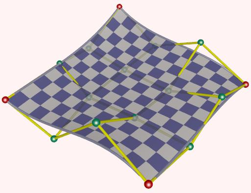

<!-- page: 58 -->

Bézier曲面

m×n次Bézier曲面：

m
n

=
=
= 
R
R

(
)
( )
( )
,
,
0
0
,

ij
i m
j n
i
j
u v
B
u B
v

Bi,m(u)  & Bj,n(v)：Bernstein基(bases)

{Rij} 规则连接形成控制网(Control mesh)

v



|
|
|
|
|
|





n row
























−
−
−
−
−
−
−
−
−
−
−
−
−
−
−
−
−
−
−

m col.

u

58

<!-- page: 59 -->

Bézier surfaces性质

The control mesh constrains the coarse

shape of Bézier surfaces

59

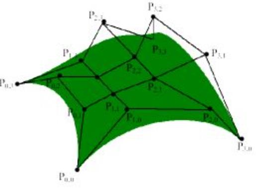

<!-- page: 60 -->

Continued

插值角点(Interpolate four corner vertices)

=
=

R
R
R
R

(0,0)
     (1,0)

00
0

m

=
=

R
R
R
R

(0,1)
     (1,1)

0

n
mn

60

<!-- page: 61 -->

Continued

角点处切向量计算(Tangents at four

corner vertices)

=
−

R
R
R

(0,0)
(
)

m

u

10
00

=
−

R
R
R

(0,0)
(
)

n

v

01
00

Bézier曲面细分(Subdivision of Bézier

surfaces)

用加密的控制网格来逼近Bézier曲面

61

<!-- page: 62 -->

曲面绘制(Rendering of Bézier surfaces)

Vector3D P[][]={{},…,{}}; // Control mesh
MyBezSurfDisplay()
{  …;float step = 0.01;

glBegin(GL_QUADS);
for (u = 0; u <1; u+=step)

for (v = 0; v<1; v+= step){

ver0 = Bezier(u,v); ver1 = Bezier(u+step, v);
ver2 = Bezier(u+step,v+step); ver1 = Bezier(u,v+step);
计算上述4个点的法向n0,n1,n2,n3;
glNormal3fv(n0); glVertex3fv(v0); glNormal3fv(n1); glVertex3fv(v1);
glNormal3fv(n2); glVertex3fv(v2); glNormal3fv(n3); glVertex3fv(v3);
}
glEnd(); …;
}

62

<!-- page: 63 -->

Bézier surfaces的缺点

全局性(Global property)

改变一个控制顶点位置影响整个曲面形状

光滑拼接困难(smoothly merge multiple Bezier

patches)

63

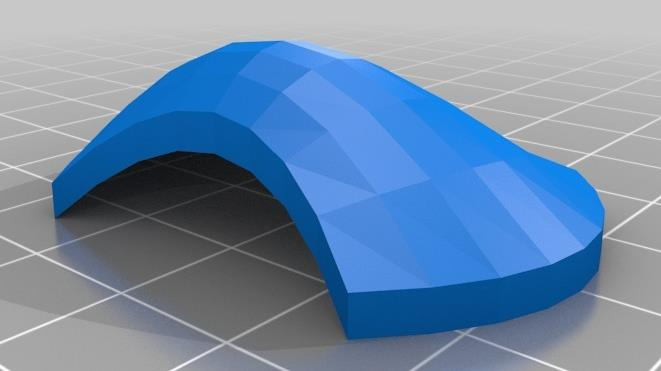

<!-- page: 64 -->

内容

参数曲面表示

参数表示的数学原理

参数曲线

参数曲面

Bézier曲面

B-样条曲面

NURBS曲面

64

<!-- page: 65 -->

B样条曲面(B-spline surfaces)

定义

次数：ku + kv

控制顶点数：(nu+1) × (nv+1)

节点向量(Knot vectors)



0
1
1
,
,
,
,
,

u
u
i
n
k
u u
u
u
+
+
=
u



0
1
1
,
,
,
,
,

v
v
j
n
k
v v
v
v
+
+
=
v

65

<!-- page: 66 -->

B-spline surfaces (B样条曲面)

The surface (定义成张量积)

n
n

u
v

=
=
=
R
R

(
)
( )
( )
,
,
0
0
,

ij
i k
j k
i
j
u v
N
u N
v

u
v

{Rij}: 控制网格(control net)

Ni,ku(u) 和Ni,kv(v):B-spline 基

66

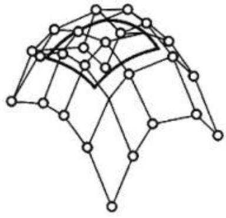

<!-- page: 67 -->

性质

局部性

控制顶点数

次数确定，控制顶点数可任意

(Bézier曲面的次数确定后，控制顶点数目就定了)

其性质与曲线类似

67

<!-- page: 68 -->

B-spline surfaces: examples

R4,4

R5,5
R0,5

R5,5
R0,5

R5,5

R0,5

R5,0

R5,0

R5,0

R0,0

R0,0

R0,0

(a) Uniform knots
(b) 端点重节点
(c)Local property of B-spline

surface

具有6×6个控制顶点双三次B-样条曲面：

(a) 均匀节点向量u= v =[-4, -3, -2, -1, 0, 1, 2, 3, 4, 5]，所构造曲面不插值角点

(b) 具有端点处4阶重节点的节点向量u= v =[0, 0, 0, 0, 1, 2, 3, 3, 3, 3]，曲面插值角点

(c) 采用了与图(b)相同的节点向量，扰动顶点R4,4的位置后，其形状变化的红色区域局限

于变动顶点的邻域中．

68

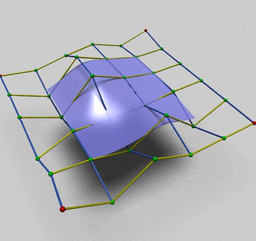

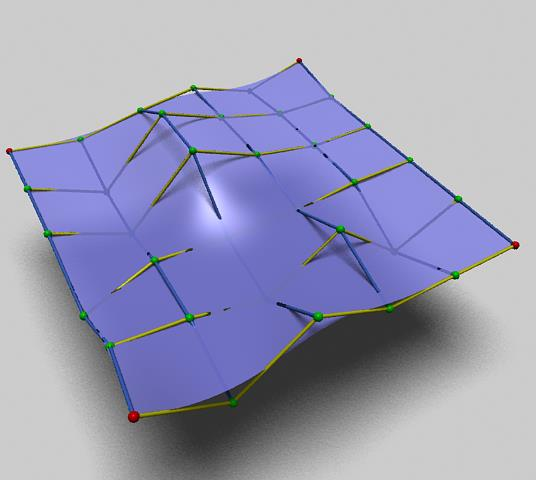

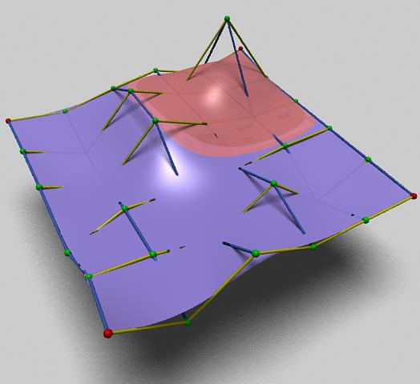

<!-- page: 69 -->

Reconstruction(重构，Eck & Hoppe)

69

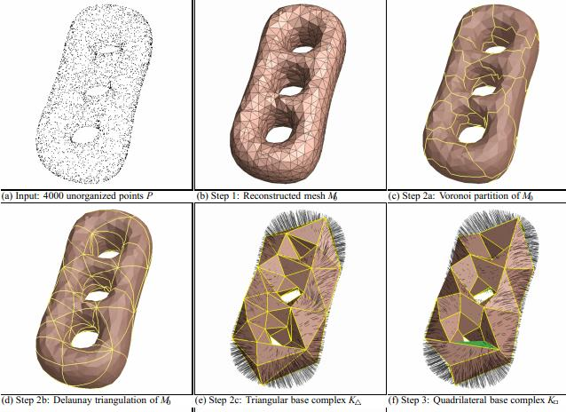

<!-- page: 70 -->

70

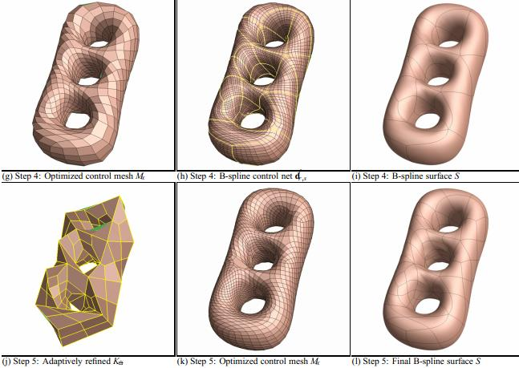

<!-- page: 71 -->

Drawbacks of B-spline surfaces

It can not exactly

represent conic
surfaces
(不能精确表示二次
曲面：球面、圆柱面、
圆锥面等)

71

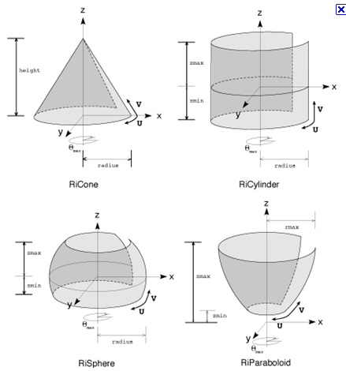

<!-- page: 72 -->

Drawbacks of B-spline surfaces

Smooth stitching is also difficult(光滑拼接r

仍然困难)

72

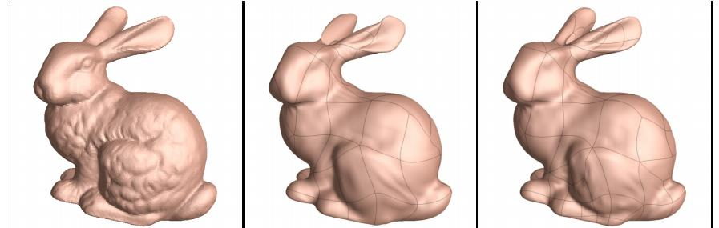

<!-- page: 73 -->

It is more difficult for complicated objects

73

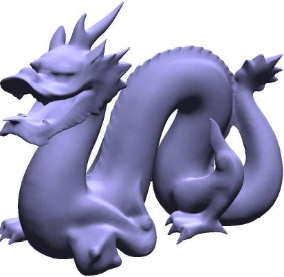

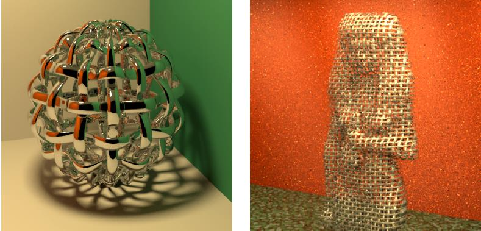

<!-- page: 74 -->

内容

参数曲面表示

参数表示的数学原理

参数曲线

参数曲面

Bézier曲面

B-样条曲面

NURBS曲面

74

<!-- page: 75 -->

NURBS曲面(omitted)

NURBS曲面

增加了权因子作为形状控制手段

包含B-样条曲面和Bézier曲面

可以精确表示机械零件中常用的二次曲面

工业产品几何定义的STEP标准(1991年):

自由曲线曲面唯一地采用NURBS表示

75

<!-- page: 76 -->

NURBS曲面表示球面

NURBS精确表示的球面及其控制顶点

76

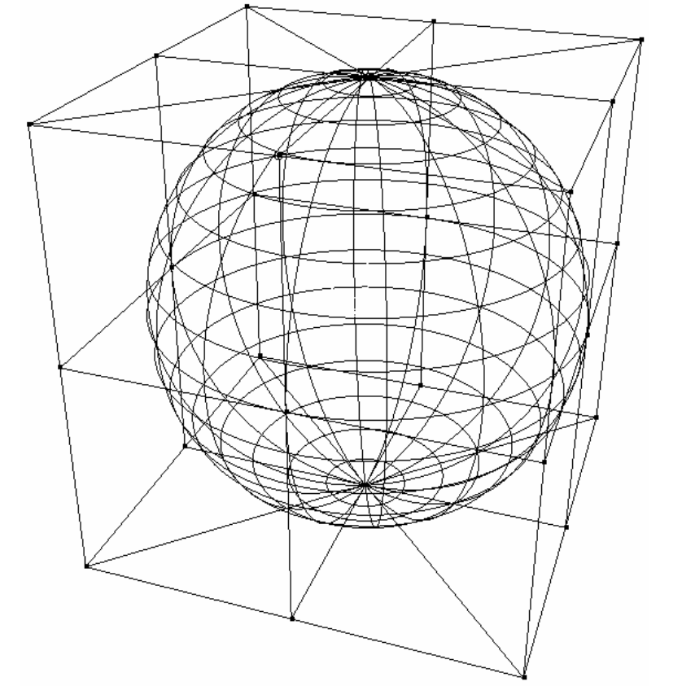

<!-- page: 77 -->

小结

物体的参数曲面表示

参数表示的数学原理：曲线、曲面

参数曲线：Bézier、B-样条和NURBS曲线

参数曲面：Bézier、B-样条和NURBS曲面

参数曲线与曲面的绘制

77
