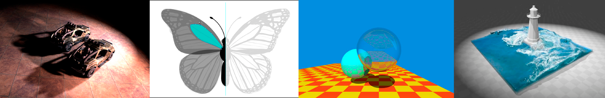
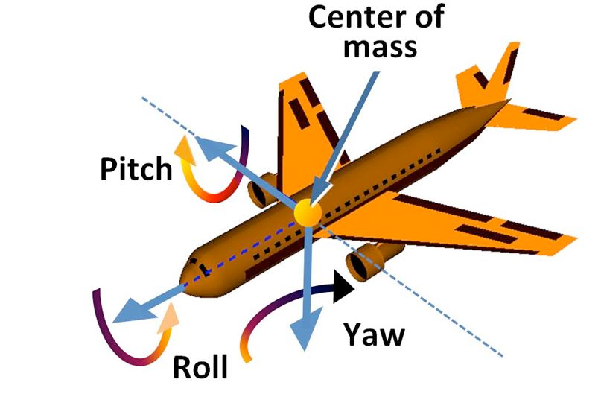
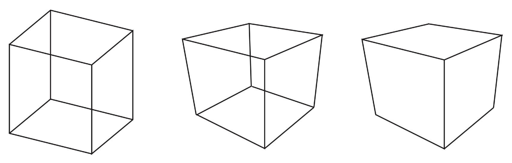
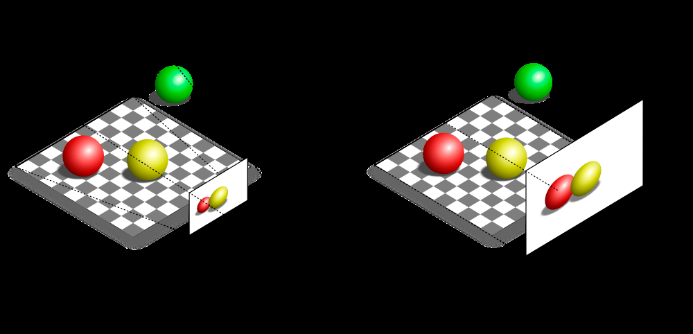
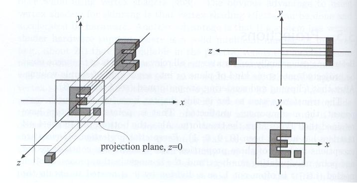
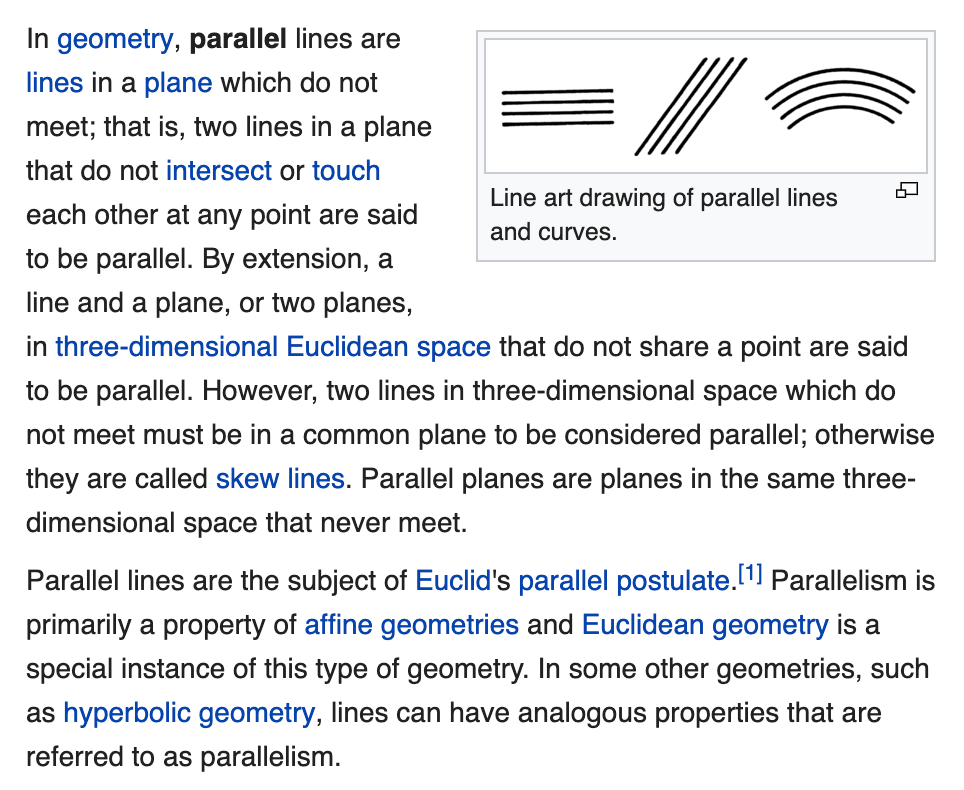
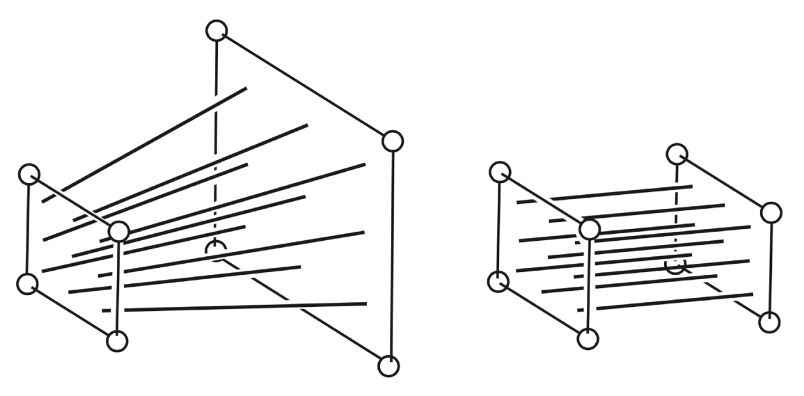

# GAMES101_Lecture

<!-- page: 1 -->

Introduction to Computer Graphics

GAMES101, Lingqi Yan, UC Santa Barbara

Lecture 4:

Transformation Cont.

http://www.cs.ucsb.edu/~lingqi/teaching/games101.html

<!-- page: 2 -->

Announcement

• Homework 0 will be released TODAY

• This lecture will be difficult :)

 2

GAMES101
Lingqi Yan, UC Santa Barbara

<!-- page: 3 -->

Last Lecture

• Transformation
- Why study transformation
- 2D transformations: rotation, scale, shear
- Homogeneous coordinates
- Composite transform
- 3D transformations

 3

GAMES101
Lingqi Yan, UC Santa Barbara

<!-- page: 4 -->

Today

• 3D transformations

• Viewing (观测) transformation

- View (视图) / Camera transformation

- Projection (投影) transformation

- Orthographic (正交) projection

- Perspective (透视) projection

 4

GAMES101
Lingqi Yan, UC Santa Barbara

<!-- page: 5 -->

3D Transformations

Use homogeneous coordinates again:

• 3D point   = (x, y, z, 1)T

• 3D vector = (x, y, z, 0)T

In general, (x, y, z, w) (w != 0) is the 3D point:

(x/w, y/w, z/w)

GAMES101
Lingqi Yan, UC Santa Barbara
 5

<!-- page: 6 -->

3D Transformations

Use 4×4 matrices for affine transformations



⇥



⇥



⇥

x′

a
b
c
tx
d
e
f
ty
g
h
i
tz
0
0
0
1

x

⇧
⇧
⇤

⌃
⌃
⌅=

⇧
⇧
⇤

⌃
⌃
⌅·

⇧
⇧
⇤

⌃
⌃
⌅

y′

y
z
1

z′

1

What’s the order?
Linear Transform first or Translation first?

GAMES101
Lingqi Yan, UC Santa Barbara
 6

<!-- page: 7 -->

3D Transformations



⇥

sx
0
0
0
0
sy
0
0
0
0
sz
0
0
0
0
1

Scale

⇧
⇧
⇤

⌃
⌃
⌅

S(sx, sy, sz) =

Translation



⇥

1
0
0
tx
0
1
0
ty
0
0
1
tz
0
0
0
1

⇧
⇧
⇤

⌃
⌃
⌅

T(tx, ty, tz) =

GAMES101
Lingqi Yan, UC Santa Barbara
 7

<!-- page: 8 -->

3D Transformations

Rotation around x-, y-, or z-axis

y

Rotation
around
x-axis



⇥

1
0
0
0
0
cos α
−sin α
0
0
sin α
cos α
0
0
0
0
1

⇧
⇧
⇤

⌃
⌃
⌅

Rx(α) =

x



⇥

cos α
0
sin α
0
0
1
0
0
−sin α
0
cos α
0
0
0
0
1

z

⇧
⇧
⇤

⌃
⌃
⌅

Ry(α) =



⇥

Anything strange about Ry?

cos α
−sin α
0
0
sin α
cos α
0
0
0
0
1
0
0
0
0
1

⇧
⇧
⇤

⌃
⌃
⌅

Rz(α) =

GAMES101
Lingqi Yan, UC Santa Barbara
 8

<!-- page: 9 -->

3D Rotations

Compose any 3D rotation from Rx, Ry, Rz?

Rxyz(α, ⇥, ⇤) = Rx(α) Ry(⇥) Rz(⇤)

• So-called Euler angles
• Often used in flight simulators: roll, pitch, yaw

GAMES101
Lingqi Yan, UC Santa Barbara
 9

<!-- page: 10 -->

Rodrigues’ Rotation Formula

Rotation by angle α around axis n

0

1

0
−nz
ny
nz
0
−nx
−ny
nx
0

R(n, ↵) = cos(↵) I + (1 −cos(↵)) nnT + sin(↵)

@

A

|
{z
}
N

How to prove this magic formula?

Check out the supplementary material on the course website!

GAMES101
Lingqi Yan, UC Santa Barbara
 10

<!-- page: 11 -->

Today

• 3D transformations

• Viewing transformation
- View / Camera transformation
- Projection transformation

- Orthographic projection
- Perspective projection

 11

GAMES101
Lingqi Yan, UC Santa Barbara

<!-- page: 12 -->

View / Camera Transformation

• What is view transformation?

• Think about how to take a photo
- Find a good place and arrange people (model transformation)
- Find a good “angle” to put the camera (view transformation)
- Cheese! (projection transformation)

 12

GAMES101
Lingqi Yan, UC Santa Barbara

<!-- page: 13 -->

View / Camera Transformation

• How to perform view transformation?

• Define the camera first
- Position
- Look-at / gaze direction
- Up direction

Up direction

~e

ˆg
ˆt

Position

(assuming perp. to look-at)

Look-at direction

 13

GAMES101
Lingqi Yan, UC Santa Barbara

<!-- page: 14 -->

View / Camera Transformation

• Key observation
- If the camera and all objects move together,

the “photo” will be the same

Y

==

-Z
(0, 0, 0)

X

• How about that we always transform the camera to
- The origin, up at Y, look at -Z
- And transform the objects along with the camera

 14

GAMES101
Lingqi Yan, UC Santa Barbara

<!-- page: 15 -->

View / Camera Transformation

• Transform the camera by
- So it’s located at the origin, up at Y, look at -Z

Mview

ˆt

• Mview in math?
- Translates e to origin
- Rotates g to -Z
- Rotates t to Y
- Rotates (g x t) To X
- Difficult to write!

~e

ˆg

Y

-Z

X

 15

GAMES101
Lingqi Yan, UC Santa Barbara

<!-- page: 16 -->

View / Camera Transformation

•            in math?
- Let’s write
- Translate e to origin

Mview

Mview = RviewTview

2

3

1
0
0
−xe
0
1
0
−ye
0
0
1
−ze
0
0
0
1

664

775

Tview =

- Rotate g to -Z, t to Y, (g x t) To X
- Consider its inverse rotation: X to (g x t), Y to t, Z to -g

2

3

2

3

WHY?

xˆg⇥ˆt
yˆg⇥ˆt
zˆg⇥ˆt
0
xt
yt
zt
0
x−g
y−g
z−g
0
0
0
0
1

xˆg⇥ˆt
xt
x−g
0
yˆg⇥ˆt
yt
y−g
0
zˆg⇥ˆt
zt
z−g
0
0
0
0
1

664

775

664

775
Rview =

R−1

view =

 16

GAMES101
Lingqi Yan, UC Santa Barbara

<!-- page: 17 -->

View / Camera Transformation

• Summary
- Transform objects together with the camera
- Until camera’s at the origin, up at Y, look at -Z

• Also known as ModelView Transformation

• But why do we need this?
- For projection transformation!

 17

GAMES101
Lingqi Yan, UC Santa Barbara

<!-- page: 18 -->

Today

• 3D transformations

• Viewing transformation
- View / Camera transformation
- Projection transformation

- Orthographic projection
- Perspective projection

 18

GAMES101
Lingqi Yan, UC Santa Barbara

<!-- page: 19 -->

Projection Transformation

• Projection in Computer Graphics
- 3D to 2D
- Orthographic projection
- Perspective projection

Orthographic

Perspective

projection

projection

Fig. 7.1 from Fundamentals of Computer Graphics, 4th Edition

 19

GAMES101
Lingqi Yan, UC Santa Barbara

<!-- page: 20 -->

Projection Transformation

• Perspective projection vs. orthographic projection

https://stackoverflow.com/questions/36573283/from-perspective-picture-to-orthographic-picture

 20

GAMES101
Lingqi Yan, UC Santa Barbara

<!-- page: 21 -->

Orthographic Projection

• A simple way of understanding
- Camera located at origin, looking at -Z, up at Y (looks familiar?)
- Drop Z coordinate
- Translate and scale the resulting rectangle to [-1, 1]2

 21

GAMES101
Lingqi Yan, UC Santa Barbara

<!-- page: 22 -->

Orthographic Projection

• In general
- We want to map a cuboid [l, r] x [b, t] x [f, n] to

the “canonical (正则、规范、标准)” cube [-1, 1]3

t

f

y

y

y

b
n

Translate

Scale

x

x

l
r

x

z

z

z

 22

GAMES101
Lingqi Yan, UC Santa Barbara

<!-- page: 23 -->

Orthographic Projection

• Slightly different orders (to the “simple way”)
- Center cuboid by translating
- Scale into “canonical” cube

t

f

y

y

y

b
n

Translate

Scale

x

x

l
r

x

z

z

z

 23

GAMES101
Lingqi Yan, UC Santa Barbara

<!-- page: 24 -->

Orthographic Projection

• Transformation matrix?
- Translate (center to origin) first, then scale (length/width/height to 2)

2

3

2

3

2
r−l
0
0
0
0
2
t−b
0
0
0
0
2
n−f
0
0
0
0
1

1
0
0
−r+l

2
0
1
0
−t+b

664

775

664

775

2
0
0
1
−n+f

Mortho =

2
0
0
0
1

t

f

y

y

y

b
n

Translate

Scale

x

x

l
r

x

z

z

z

 24

GAMES101
Lingqi Yan, UC Santa Barbara

<!-- page: 25 -->

Orthographic Projection

• Caveat
- Looking at / along -Z is making near and far not intuitive (n > f)
- FYI: that’s why OpenGL (a Graphics API) uses left hand coords.

t

f

y

y

y

b
n

Translate

Scale

x

x

l
r

x

z

z

z

 25

GAMES101
Lingqi Yan, UC Santa Barbara

<!-- page: 26 -->

Perspective Projection

• Most common in Computer Graphics, art, visual system

• Further objects are smaller

• Parallel lines not parallel; converge to single point

A

Image Plane, or
Plane of Projection

A’

B

B’

Center of projection
(camera/eye location)

 26

GAMES101
Lingqi Yan, UC Santa Barbara

<!-- page: 27 -->

Perspective Projection

• Euclid was wrong??!!

https://en.wikipedia.org/wiki/Parallel_(geometry)

 27

GAMES101
Lingqi Yan, UC Santa Barbara

<!-- page: 28 -->

Perspective Projection

• Before we move on

• Recall: property of homogeneous coordinates
- (x, y, z, 1), (kx, ky, kz, k != 0), (xz, yz, z2, z != 0) all represent

the same point (x, y, z) in 3D
- e.g. (1, 0, 0, 1) and (2, 0, 0, 2) both represent (1, 0, 0)

• Simple, but useful

 28

GAMES101
Lingqi Yan, UC Santa Barbara

<!-- page: 29 -->

Perspective Projection

• How to do perspective projection
- First “squish” the frustum into a cuboid (n -> n, f -> f) (Mpersp->ortho)
- Do orthographic projection (Mortho, already known!)

Frustum
Cuboid

n
f
n
f

Fig. 7.13 from Fundamentals of Computer Graphics, 4th Edition

 29

GAMES101
Lingqi Yan, UC Santa Barbara

<!-- page: 30 -->

Perspective Projection

• In order to find a transformation
- Recall the key idea: Find the relationship between transformed

points (x’, y’, z’) and the original points (x, y, z)

Y

(x, y, z)

(x’, y’, z’)

similar
triangle

y0 = n

z y

Z

n

z

 30

GAMES101
Lingqi Yan, UC Santa Barbara

<!-- page: 31 -->

Perspective Projection

• In order to find a transformation
- Find the relationship between transformed points (x’, y’, z’)

and the original points (x, y, z)

y0 = n

z y
x0 = n

z x (similar to y’)

• In homogeneous coordinates,
0

1

0

1

0

1

mult.

x

nx/z

nx

by z

B
B
@

C
C
A )

B
B
@

C
C
A ==

B
B
@

C
C
A

y
z
1

ny/z
unknown

ny
still unknown

1

z

 31

GAMES101
Lingqi Yan, UC Santa Barbara

<!-- page: 32 -->

Perspective Projection

• So the “squish” (persp to ortho) projection does this

0

1

0

1

x

nx

B
B
@

C
C
A =

B
B
@

C
C
A

y
z
1

ny
unknown

M (4⇥4)

persp!ortho

z

• Already good enough to figure out part of Mpersp->ortho

0

1

n
0
0
0
0
n
0
0
?
?
?
?
0
0
1
0

B
B
@

C
C
A
WHY?

Mpersp!ortho =

 32

GAMES101
Lingqi Yan, UC Santa Barbara

<!-- page: 33 -->

Perspective Projection

• How to figure out the third row of Mpersp->ortho
- Any information that we can use?

0

1

n
0
0
0
0
n
0
0
?
?
?
?
0
0
1
0

B
B
@

C
C
A

Mpersp!ortho =

• Observation: the third row is responsible for z’
- Any point on the near plane will not change
- Any point’s z on the far plane will not change

 33

GAMES101
Lingqi Yan, UC Santa Barbara

<!-- page: 34 -->

Perspective Projection

• Any point on the near plane will not change
0

1

0

1

0

1

0

1

0

1

x

x

nx

x

nx

replace
z with n

B
B
@

C
C
A )

B
B
@

C
C
A ==

B
B
@

C
C
A

B
B
@

C
C
A =

B
B
@

C
C
A

y
n

y
n

ny

y
z
1

ny
unknown

M (4⇥4)

n2

persp!ortho

1

1

n

z

• So the third row must be of the form (0 0 A B)

0

1

x

B
B
@

C
C
A = n2

!0
0
A
B"

y
n

n2  has nothing
to do with x and y

1

 34

GAMES101
Lingqi Yan, UC Santa Barbara

<!-- page: 35 -->

Perspective Projection

• What do we have now?

0

1

x

B
B
@

C
C
A = n2

!0
0
A
B"

y
n

An + B = n2

1

• Any point’s z on the far plane will not change
0

1

0

1

0

1

0
0
f

0
0
f

0
0
f 2

B
B
@

C
C
A )

B
B
@

C
C
A ==

B
B
@

C
C
A
Af + B = f 2

1

1

f

 35

GAMES101
Lingqi Yan, UC Santa Barbara

<!-- page: 36 -->

Perspective Projection

• Solve for A and B

An + B = n2

A = n + f
B = −nf

Af + B = f 2

• Finally, every entry in Mpersp->ortho is known!

• What’s next?
- Do orthographic projection (Mortho) to finish
- Mpersp = MorthoMpersp!ortho

 36

GAMES101
Lingqi Yan, UC Santa Barbara

<!-- page: 37 -->

Thank you!
