# GAMES101_Lecture

<!-- page: 1 -->

Introduction to Computer Graphics

GAMES101, Lingqi Yan, UC Santa Barbara

Lecture 6:

Rasterization 2
(Antialiasing and Z-Buffering)

http://www.cs.ucsb.edu/~lingqi/teaching/games101.html

<!-- page: 2 -->

Announcements

• Homework 1
- Already 49 submissions so far!
- In general, start early

• Today’s topics are not easy
- Having knowledge on Signal Processing is appreciated
- But no worries if you don’t

 2

GAMES101
Lingqi Yan, UC Santa Barbara

<!-- page: 3 -->

Last Lectures

• Viewing
- View + Projection + Viewport

• Rasterizing triangles
- Point-in-triangle test
- Aliasing

 3

GAMES101
Lingqi Yan, UC Santa Barbara

<!-- page: 4 -->

Today

• Antialiasing
- Sampling theory
- Antialiasing in practice

• Visibility / occlusion
- Z-buffering

 4

GAMES101
Lingqi Yan, UC Santa Barbara

<!-- page: 5 -->

Recap: Testing in/out △ at pixels’ centers

 5

GAMES101
Lingqi Yan, UC Santa Barbara

<!-- page: 6 -->

Pixels are uniformly-colored squares

 6

GAMES101
Lingqi Yan, UC Santa Barbara

<!-- page: 7 -->

Compare: The Continuous Triangle Function

 7

GAMES101
Lingqi Yan, UC Santa Barbara

<!-- page: 8 -->

What’s Wrong With This Picture?

Jaggies!

 8

GAMES101
Lingqi Yan, UC Santa Barbara

<!-- page: 9 -->

Aliasing

Is this the best we can do?

Slide courtesy of Prof. Ren Ng, UC Berkeley

 9

CS180, Winter 2020
Lingqi Yan, UC Santa Barbara

<!-- page: 10 -->

Sampling is Ubiquitous in

Computer Graphics

<!-- page: 11 -->

Rasterization = Sample 2D Positions

 11

GAMES101
Lingqi Yan, UC Santa Barbara

<!-- page: 12 -->

Photograph = Sample Image Sensor Plane

 12

GAMES101
Lingqi Yan, UC Santa Barbara

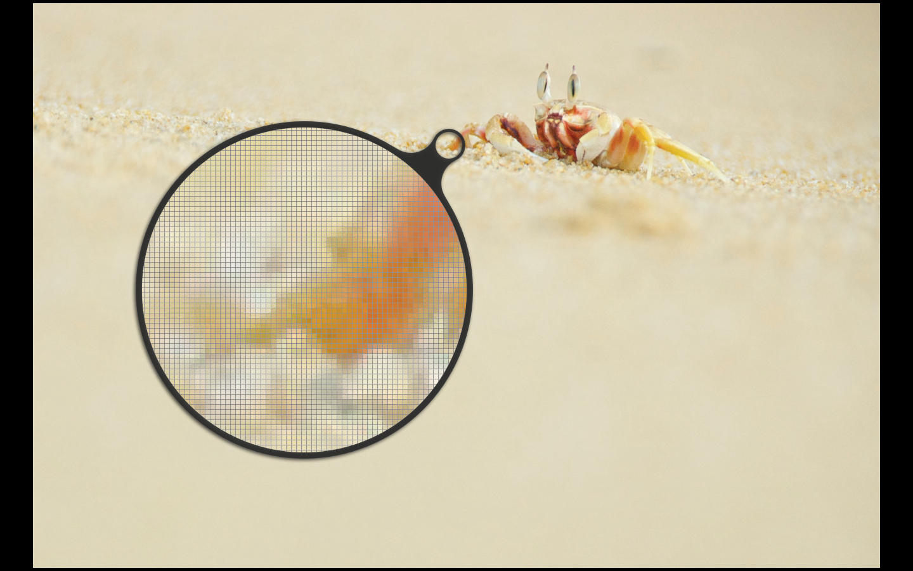

<!-- page: 13 -->

Video = Sample Time

Harold Edgerton Archive, MIT

 13

GAMES101
Lingqi Yan, UC Santa Barbara

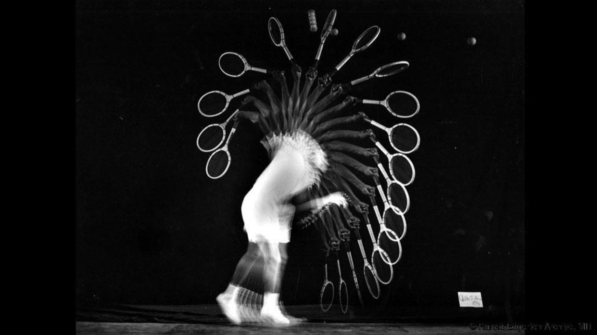

<!-- page: 14 -->

Sampling Artifacts
(Errors / Mistakes / Inaccuracies) in

Computer Graphics

<!-- page: 15 -->

Jaggies (Staircase Pattern)

This is also an example of “aliasing” – a sampling error

 15

GAMES101
Lingqi Yan, UC Santa Barbara

<!-- page: 16 -->

Moiré Patterns in Imaging

[mwɑ:]

lystit.com

Skip odd rows and columns

 16

GAMES101
Lingqi Yan, UC Santa Barbara

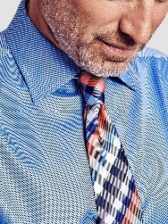

<!-- page: 17 -->

Wagon Wheel Illusion (False Motion)

 17

GAMES101
Lingqi Yan, UC Santa Barbara

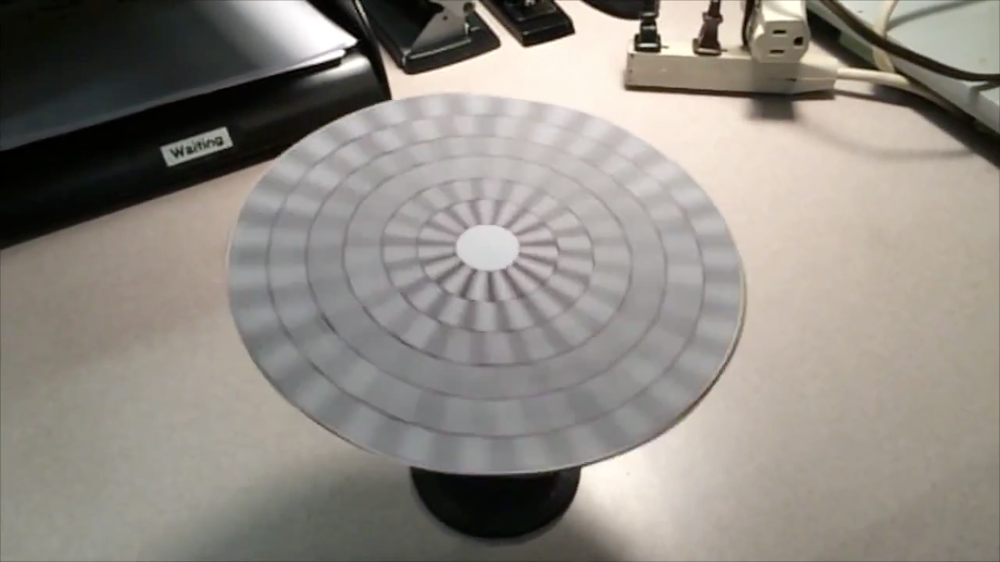

<!-- page: 18 -->

Sampling Artifacts in Computer Graphics

Artifacts due to sampling - “Aliasing”

• Jaggies – sampling in space
• Moire – undersampling images
• Wagon wheel effect – sampling in time
• [Many more] …

Behind the Aliasing Artifacts

• Signals are changing too fast (high frequency),
but sampled too slowly

 18

GAMES101
Lingqi Yan, UC Santa Barbara

<!-- page: 19 -->

Antialiasing Idea:
Blurring (Pre-Filtering) Before

Sampling

<!-- page: 20 -->

Rasterization: Point Sampling in Space

Sample

Note jaggies in rasterized triangle
where pixel values are pure red or white

 20

GAMES101
Lingqi Yan, UC Santa Barbara

<!-- page: 21 -->

Rasterization: Antialiased Sampling

Pre-Filter

Sample

(remove frequencies above Nyquist) (?)

Note antialiased edges in rasterized triangle

where pixel values take intermediate values

 21

GAMES101
Lingqi Yan, UC Santa Barbara

<!-- page: 22 -->

Point Sampling

 22

GAMES101
Lingqi Yan, UC Santa Barbara

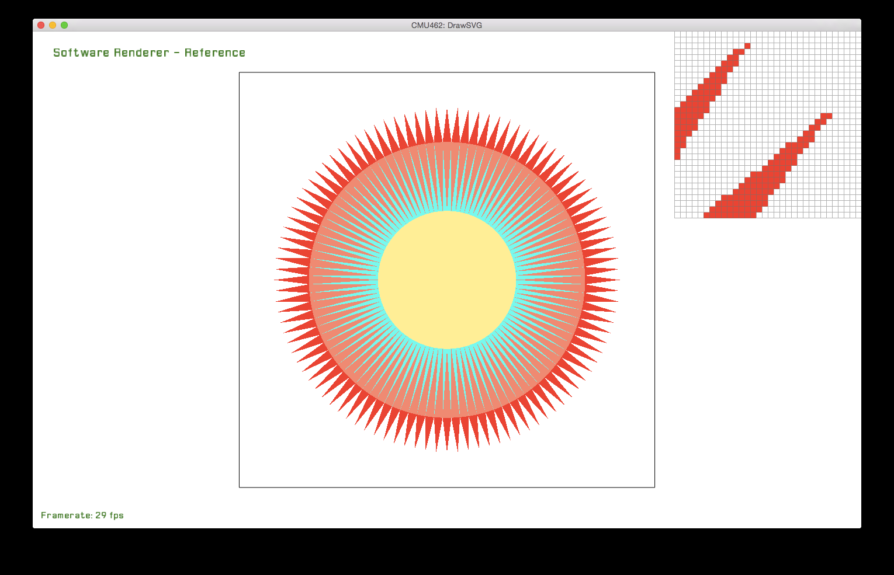

<!-- page: 23 -->

Antialiasing

 23

GAMES101
Lingqi Yan, UC Santa Barbara

<!-- page: 24 -->

Point Sampling vs Antialiasing

 24

GAMES101
Lingqi Yan, UC Santa Barbara

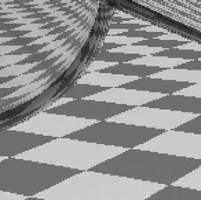

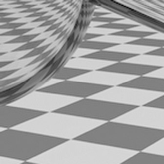

<!-- page: 25 -->

Antialiasing vs Blurred Aliasing

(Sample then filter, WRONG!)
(Filter then sample)

 25

GAMES101
Lingqi Yan, UC Santa Barbara

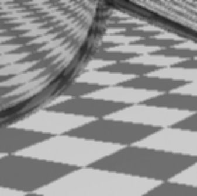

<!-- page: 26 -->

But why?

1. Why undersampling introduces aliasing?

2. Why pre-filtering then sampling can do antialiasing?

Let’s dig into fundamental reasons

And look at how to implement antialiased rasterization

 26

GAMES101
Lingqi Yan, UC Santa Barbara

<!-- page: 27 -->

Frequency Domain

<!-- page: 28 -->

Sines and Cosines

cos 2⇡x

sin 2⇡x

 28

GAMES101
Lingqi Yan, UC Santa Barbara

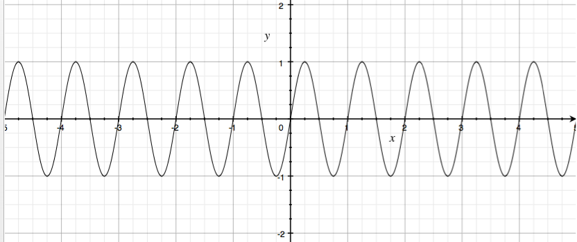

<!-- page: 29 -->

Frequencies

cos 2⇡fx

f = 1

f = 1

T

cos 2⇡x

f = 2

cos 4⇡x

 29

GAMES101
Lingqi Yan, UC Santa Barbara

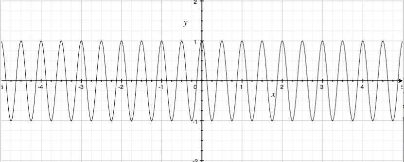

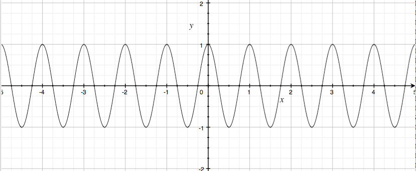

<!-- page: 30 -->

Fourier Transform

Represent a function as a
weighted sum of sines and
cosines

Joseph Fourier 1768 - 1830

2 + 2A cos(t⇥)
π
−2A cos(3t⇥)

3π
+ 2A cos(5t⇥)

5π
−2A cos(7t⇥)

f(x) = A

7π
+ · · ·

 30

GAMES101
Lingqi Yan, UC Santa Barbara

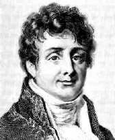

<!-- page: 31 -->

Fourier Transform Decomposes A Signal Into Frequencies

Z 1

f(x)
F(ω)

f(x)e−2⇡i!xdx

F(!) =

−1

Fourier transform

spatial
domain

frequency

domain

Inverse transform

Z 1

F(!)e2⇡i!xd!

f(x) =

−1

eix = cos x + i sin x
Recall

 31

GAMES101
Lingqi Yan, UC Santa Barbara

<!-- page: 32 -->

Higher Frequencies Need Faster Sampling

Periodic sampling locations

Low-frequency signal:
sampled adequately
for reasonable
reconstruction

f1(x)

f1(x)

f2(x)

f2(x)

f3(x)

f3(x)

f4(x)

f4(x)

High-frequency signal
is insufficiently
sampled:
reconstruction
incorrectly appears to
be from a low
frequency signal

f5(x)

f5(x)

x

 32

GAMES101
Lingqi Yan, UC Santa Barbara

<!-- page: 33 -->

Undersampling Creates Frequency Aliases

High-frequency signal is insufficiently sampled: samples
erroneously appear to be from a low-frequency signal

Two frequencies that are indistinguishable at a given sampling
rate are called “aliases”

 33

GAMES101
Lingqi Yan, UC Santa Barbara

<!-- page: 34 -->

Filtering = Getting rid of
certain frequency contents

<!-- page: 35 -->

Visualizing Image Frequency Content

 35

GAMES101
Lingqi Yan, UC Santa Barbara

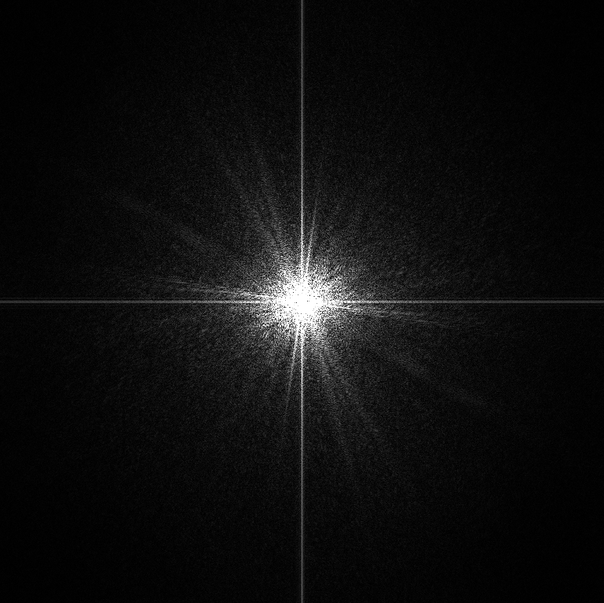

<!-- page: 36 -->

Filter Out Low Frequencies Only (Edges)

High-pass filter

 36

GAMES101
Lingqi Yan, UC Santa Barbara

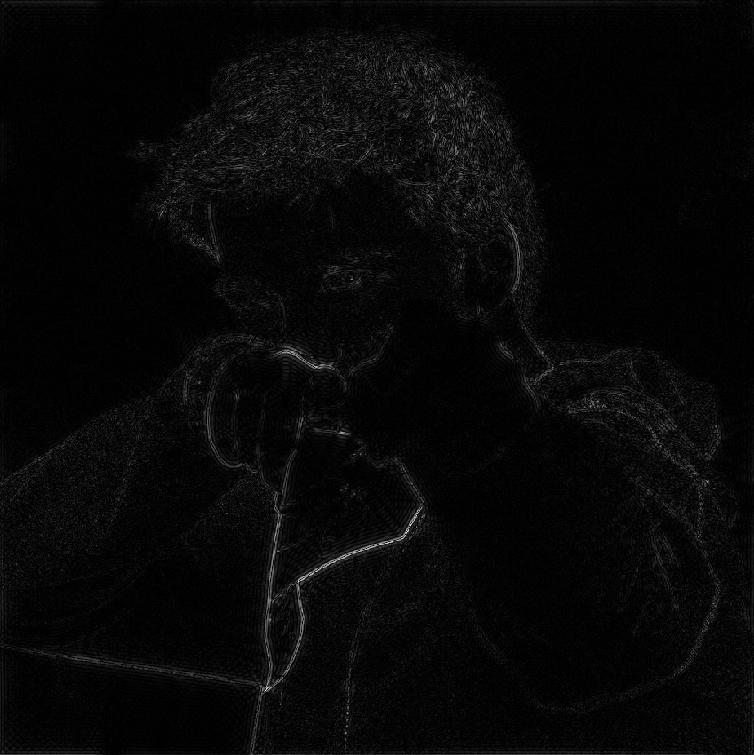

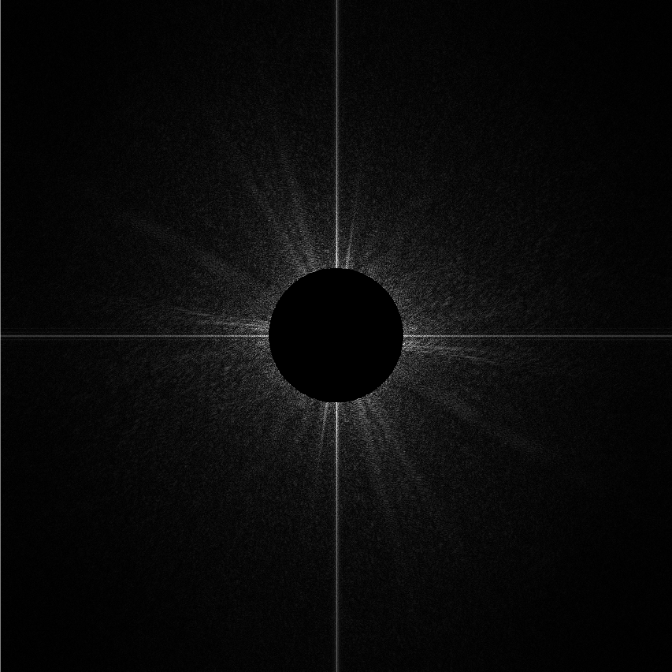

<!-- page: 37 -->

Filter Out High Frequencies (Blur)

Low-pass filter

 37

GAMES101
Lingqi Yan, UC Santa Barbara

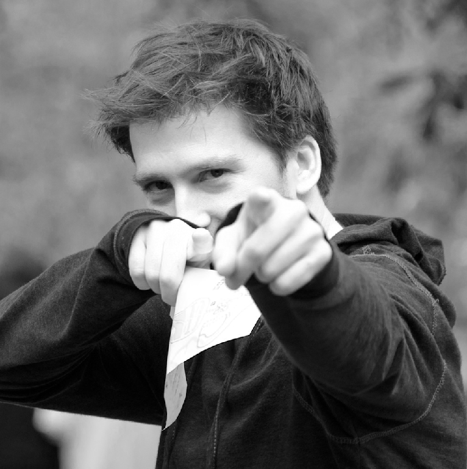

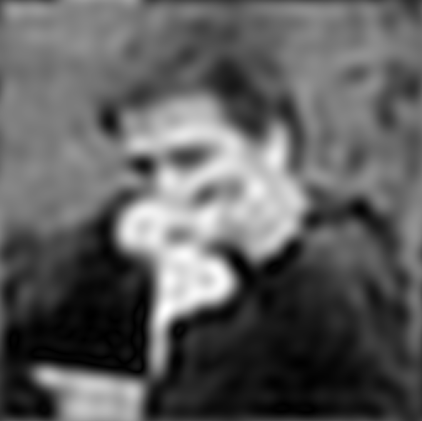

<!-- page: 38 -->

Filter Out Low and High Frequencies

 38

GAMES101
Lingqi Yan, UC Santa Barbara

<!-- page: 39 -->

Filter Out Low and High Frequencies

 39

GAMES101
Lingqi Yan, UC Santa Barbara

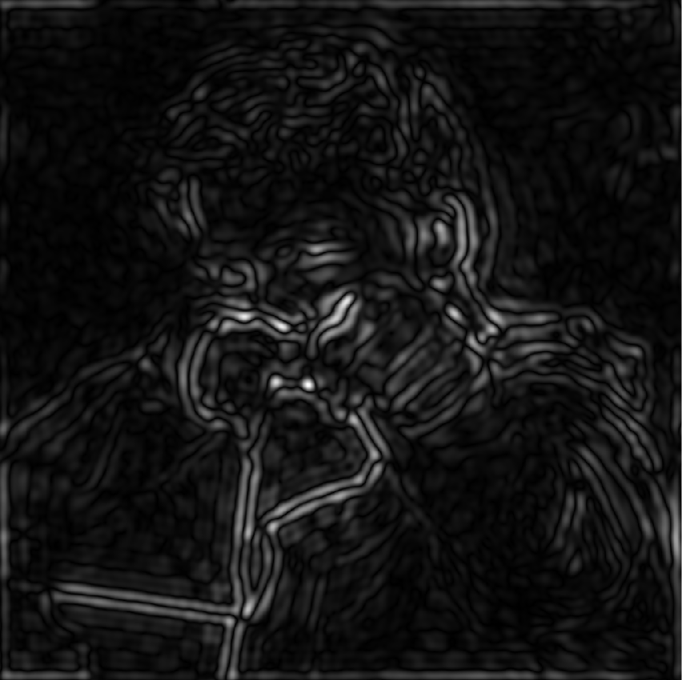

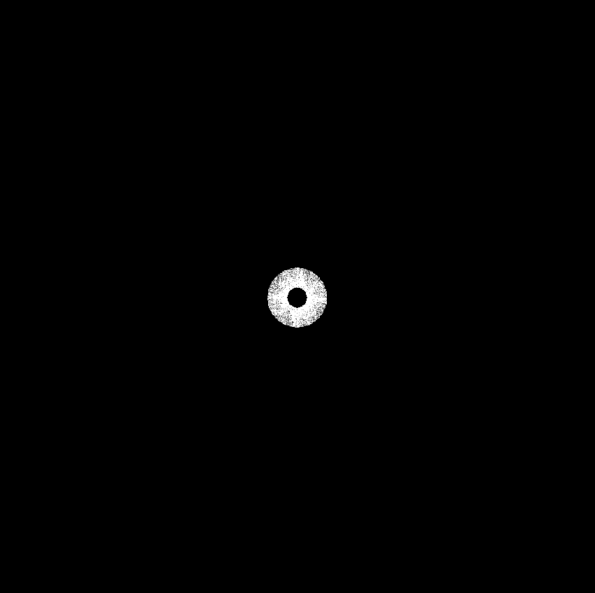

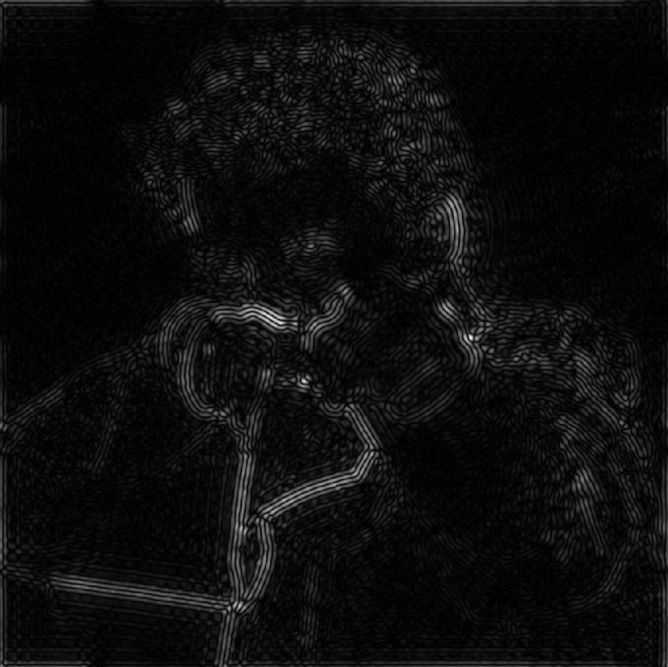

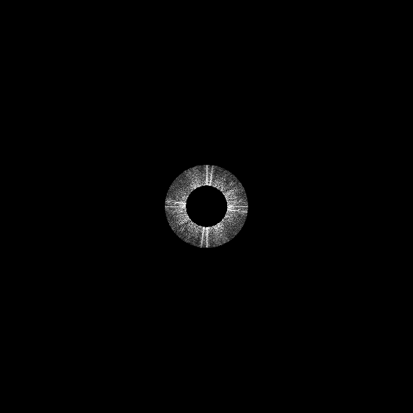

<!-- page: 40 -->

Filtering = Convolution

(= Averaging)

<!-- page: 41 -->

Convolution

1
3
5
3
7
1
3
8
6
4

Signal

Filter

1/4
1/2
1/4

Point-wise local averaging in a “sliding window”

 41

GAMES101
Lingqi Yan, UC Santa Barbara

<!-- page: 42 -->

Convolution

1
3
5
3
7
1
3
8
6
4

Signal

Filter

1/4
1/2
1/4

1 x (1/4) + 3 x (1/2) + 5 x (1/4) = 3

Result

3

 42

GAMES101
Lingqi Yan, UC Santa Barbara

<!-- page: 43 -->

Convolution

1
3
5
3
7
1
3
8
6
4

Signal

Filter

1/4
1/2
1/4

3 x (1/4) + 5 x (1/2) + 3 x (1/4) = 4

Result

3
4

 43

GAMES101
Lingqi Yan, UC Santa Barbara

<!-- page: 44 -->

Convolution Theorem

Convolution in the spatial domain is equal to multiplication
in the frequency domain, and vice versa

Option 1:

• Filter by convolution in the spatial domain

Option 2:

• Transform to frequency domain (Fourier transform)
• Multiply by Fourier transform of convolution kernel
• Transform back to spatial domain (inverse Fourier)

 44

GAMES101
Lingqi Yan, UC Santa Barbara

<!-- page: 45 -->

Convolution Theorem

1
1
1

Spatial
Domain

1

*
=

1
1
1

9

1
1
1

Inv. Fourier

Fourier
Transform

Transform

x
=

Frequency
Domain

 45

GAMES101
Lingqi Yan, UC Santa Barbara

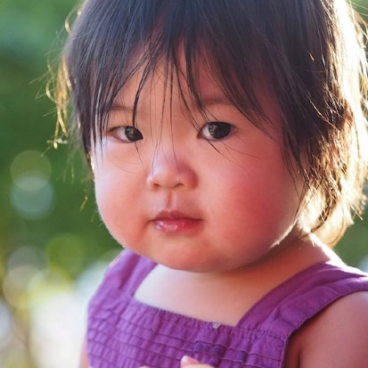

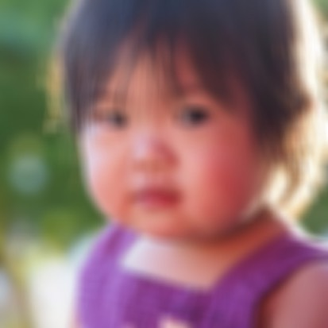

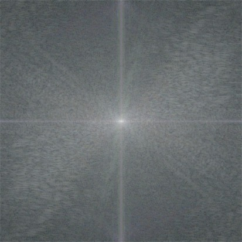

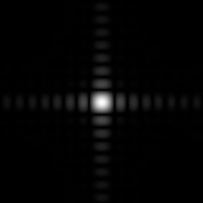

<!-- page: 46 -->

Box Filter

1
1
1

1

1
1
1

9

1
1
1

Example: 3x3 box filter

 46

GAMES101
Lingqi Yan, UC Santa Barbara

<!-- page: 47 -->

Box Function = “Low Pass” Filter

 47

GAMES101
Lingqi Yan, UC Santa Barbara

<!-- page: 48 -->

Wider Filter Kernel = Lower Frequencies

 48

GAMES101
Lingqi Yan, UC Santa Barbara

<!-- page: 49 -->

Sampling = Repeating

Frequency Contents

<!-- page: 50 -->

Sampling = Repeating Frequency Contents

https://www.researchgate.net/figure/The-evolution-of-sampling-theorem-a-The-time-domain-of-the-band-limited-signal-and-b_fig5_301556095

 50

GAMES101
Lingqi Yan, UC Santa Barbara

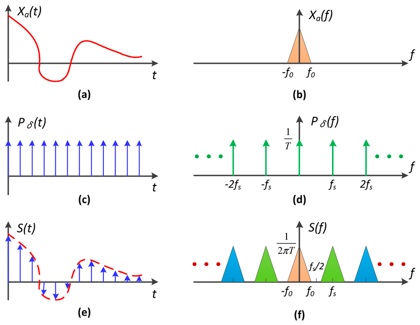

<!-- page: 51 -->

Aliasing = Mixed Frequency Contents

Dense sampling:

Sparse sampling:

 51

GAMES101
Lingqi Yan, UC Santa Barbara

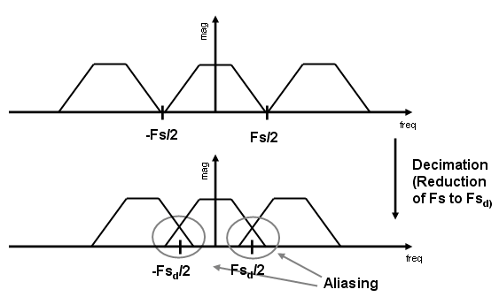

<!-- page: 52 -->

Antialiasing

<!-- page: 53 -->

How Can We Reduce Aliasing Error?

Option 1: Increase sampling rate

• Essentially increasing the distance between replicas in the
Fourier domain
• Higher resolution displays, sensors, framebuffers…
• But: costly & may need very high resolution

Option 2: Antialiasing

• Making Fourier contents “narrower” before repeating
• i.e. Filtering out high frequencies before sampling

 53

GAMES101
Lingqi Yan, UC Santa Barbara

<!-- page: 54 -->

Antialiasing = Limiting, then repeating

Filtering

Then sparse sampling

 54

GAMES101
Lingqi Yan, UC Santa Barbara

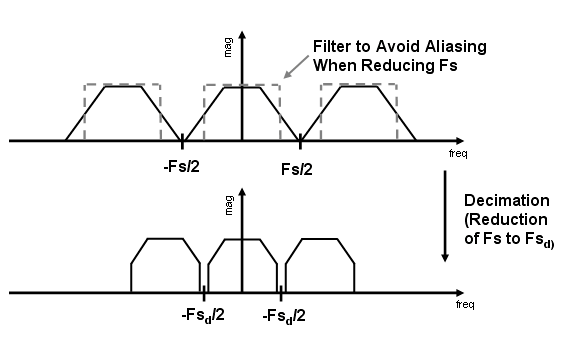

<!-- page: 55 -->

Regular Sampling

Sample

Note jaggies in rasterized triangle
where pixel values are pure red or white

 55

GAMES101
Lingqi Yan, UC Santa Barbara

<!-- page: 56 -->

Antialiased Sampling

Pre-Filter

Sample

(remove frequencies above Nyquist)

Note antialiased edges in rasterized triangle

where pixel values take intermediate values

 56

GAMES101
Lingqi Yan, UC Santa Barbara

<!-- page: 57 -->

A Practical Pre-Filter

A 1 pixel-width box filter (low pass, blurring)

Spatial Domain
Frequency Domain

 57

GAMES101
Lingqi Yan, UC Santa Barbara

<!-- page: 58 -->

Antialiasing By Averaging Values in Pixel Area

Solution:

• Convolve f(x,y) by a 1-pixel box-blur
- Recall: convolving = filtering = averaging
• Then sample at every pixel’s center

 58

GAMES101
Lingqi Yan, UC Santa Barbara

<!-- page: 59 -->

Antialiasing by Computing Average Pixel Value

In rasterizing one triangle, the average value inside a pixel
area of f(x,y) = inside(triangle,x,y) is equal to the area of the
pixel covered by the triangle.

Original

Filtered

1 pixel width

 59

GAMES101
Lingqi Yan, UC Santa Barbara

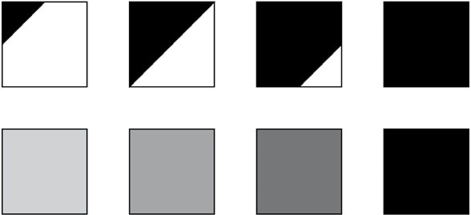

<!-- page: 60 -->

Antialiasing By Supersampling

(MSAA)

<!-- page: 61 -->

Supersampling

Approximate the effect of the 1-pixel box filter by sampling
multiple locations within a pixel and averaging their values:

4x4 supersampling

 61

GAMES101
Lingqi Yan, UC Santa Barbara

<!-- page: 62 -->

Point Sampling: One Sample Per Pixel

 62

GAMES101
Lingqi Yan, UC Santa Barbara

<!-- page: 63 -->

Supersampling: Step 1

Take NxN samples in each pixel.

2x2 supersampling

 63

GAMES101
Lingqi Yan, UC Santa Barbara

<!-- page: 64 -->

Supersampling: Step 2

Average the NxN samples “inside” each pixel.

Averaging down

 64

GAMES101
Lingqi Yan, UC Santa Barbara

<!-- page: 65 -->

Supersampling: Step 2

Average the NxN samples “inside” each pixel.

Averaging down

 65

GAMES101
Lingqi Yan, UC Santa Barbara

<!-- page: 66 -->

Supersampling: Step 2

Average the NxN samples “inside” each pixel.

 66

GAMES101
Lingqi Yan, UC Santa Barbara

<!-- page: 67 -->

Supersampling: Result

This is the corresponding signal emitted by the display

75%

100%
100%
50%

50%
50%
50%
25%

 67

GAMES101
Lingqi Yan, UC Santa Barbara

<!-- page: 68 -->

Point Sampling

 68

GAMES101
Lingqi Yan, UC Santa Barbara

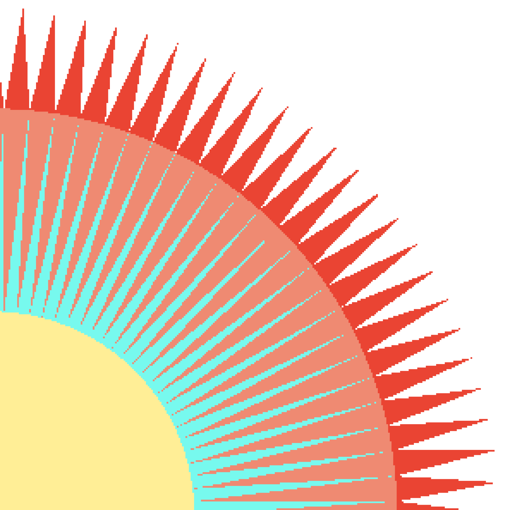

<!-- page: 69 -->

4x4 Supersampling

 69

GAMES101
Lingqi Yan, UC Santa Barbara

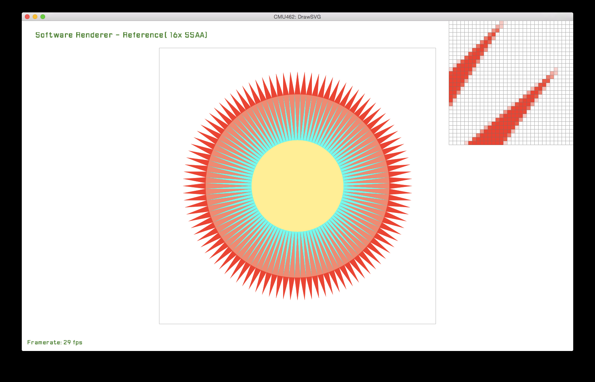

<!-- page: 70 -->

Antialiasing Today

No free lunch!

• What’s the cost of MSAA?

Milestones (personal idea)

• FXAA (Fast Approximate AA)
• TAA (Temporal AA)

Super resolution / super sampling

• From low resolution to high resolution
• Essentially still “not enough samples” problem
• DLSS (Deep Learning Super Sampling)

 70

GAMES101
Lingqi Yan, UC Santa Barbara

<!-- page: 71 -->

Thank you!
