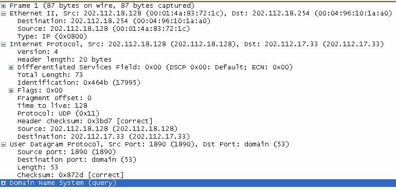

# 教学资源_参考答案

<!-- page: 1 -->

样题3 的参考答案

一、
填空(15 分，每空1 分)

1．非屏蔽双绞线UTP

2．在两个网络设备之间提供透明的比特流传输

3．文件传输、远程登录

4．201:4aff:fe83:721c

5．扩展头

6．接收方

7．101001001111

8．服务器的监听端口不同；或邮件的备份地方不同（答案不唯一）

9．生成树协议

10．10

二、
判断对错（10 分，每题1 分，对的画 √，错的画×）

No.
1
2
3
4
5
6
7
8
9
10
Answer
√
×
×
×
×
×
√
√
×
√

1．电子邮件系统通常由用户代理和消息传输代理两大部分组成。

2．PPP 的两种认证方式中，PAP 比CHAP 更加安全。

3．BGP 是一种链路状态路由选择协议，所以没有路由自环的问题。

4．虚拟通信是指这次通信实际上是不存在的。

5．纯ALOHA 协议比分隙ALOHA 协议的信道利用率高一倍。

6．使用超5 类UTP 传输线缆，数据传输最远可以到达185 米。

7．域名系统中，如果一次解析返回的是权威记录，则这条记录是绝对正确的。

8．在距离适量路由选择协议中，水平分割是用来避免路由自环的手段之一。

9．TCP 比UDP 更加可靠和简单，所以，通常应用层都选择使用TCP。

10．IPv6 分组中的跳数限制域的功能IPv4 分组中的TTL 域的功能是一样的。

三、
单选题(26 分，每空2 分)
No.
1
2
3
4
5
6
7
8
9
10
Answer
A
C
B
C
A
C
A
B
C
D
No.
11
12
13
Answer
E
D
D

<!-- page: 2 -->

四、
简答题（29 分，每题6 分）

1.某时刻，一台PC 开始抓取报文，其中的一个报文展开如下图所示，试根据图中所示，回答

问题：①这个报文传输层采用了什么协议？②传输层的两个端点分别是什么？③ 这个报文最

多经过多少个路由器就会被丢弃？④该报文的IP 头部是否有选项域？为什么？（本题5 分）

解答要点：①UDP（1 分）

②（202.112.18.128,1890）,（202.112.17.33,53）（2 分）

③128（1 分）

④没有，因为IP 分组头部只有20 个字节（1 分）

2．TCP 数据段的最大载荷值是65495 字节，为什么？

解答要点：

①TCP 数据段必须封装进IP 分组的载荷域中，而IP 分组的载荷域最大为65,515 字节

②TCP 数据段的最小（基本）段头长度是20 字节，所以TCP 数据段的载荷域最多为：65515-20，

只有65,495 字节

③TCP 中净载荷为：65535-20-20

3．一个调制解调器采用如下的信号星座进行正交振幅调制，其信号点分别为：（1，0），（1，
1），（0，1），（-1，1），（-1，0），（-1，-1），（0，-1），和（1，-1），问：①如果波特率为1200
baud，该调制器的传输速率可达到多少bps？②如果星座图上的信号点只有（0，1）和（0，2）
两点，那么对应的调制方法是调频还是调幅？为什么？

<!-- page: 3 -->

解答要点：

① 每个波特有8 个合法值，所以每波特可以传输3 比特，所以对应1200 波特的速率是

3600b/s。（4 分）
② ②由于相位总是0，但是有两个振幅，所以是幅度调制。（2 分）
4．在一个CDMA 系统中，有4 个站点A、B、C 和 D，它们的时间序列分别是（00011011）、
（00101110）、（01011100） 和（01000010），请完成：①写出4 个站点对应的双极性表示；
②当收到一个复用信号 (-1 +1 -3 +1 -1 -3 +1 +1)，这4 个站点分别发送了什么值？
答案要点：
①双极表示分别为：（2分）
（-1-1-1+1+1-1+1+1），（-1-1+1-1+1+1+1-1），（-1+1-1+1+1+1-1-1），（-1+1-1-1-1-1+1-1）
②解复用：（4 分）

S.A=（1-1+3+1-1+3+1+1）/8=1
S.B=（1-1-3-1-1-3+1-1）/8=－1
S.C=（1+1+3+1-1-3-1-1）/8=0
S.D=（1+1+3-1+1+3-1+1）/8=1，
所以， A 和 D 发送了1， B 发送了0 ，C 没有发送任何值
5.试在下图中绘制二进制10100011 的二进制编码、曼侧斯特编码和差分曼侧斯特编码
答:

<!-- page: 4 -->

五、
分析题（20 分）

一个公司有两个部门，研发部和市场部，研发部有28 台PC，市场部有15 台PC，现在，公
司申请了一个C 类地址222.201.190.0,规划的网络拓扑如下图所示，试解答如下4 个问题。

1. 请作合理的子网规划，说明理由；并根据你的规划，在下面的表格中的空白处填写(7 分)

答：可以借3 位,答案不唯一

子网掩码
子网的网络地址
范围

子网的广播地址
子网的网络地址 是否可

子网编
号

用？
No.1
255.255.255.224
/
/
222.201.190.0
No
No.2
255.255.255.224
222.201.190.33-
222.201.190.62
222.201.190.63
222.201.190.32
Yes

No.3
255.255.255.224
222.201.190.65-
222.201.190.94
222.201.190.95
222.201.190.64
Yes

No.4
255.255.255.224
222.201.190.97-
222.201.190.126
222.201.190.127
222.201.190.96
Yes

No.5
255.255.255.224
222.201.190.129-
222.201.190.158
222.201.190.159
222.201.190.128
Yes

…………

2. 根据第一题的规划，请为两个部门各分配一个子网络地址，并为两个路由器的接口和各台
PC 分配IP 地址(答案不唯一，5 分)

<!-- page: 5 -->

答：

研发部的子网络地址是：   222.201.190.32

市场部的子网络地址是：   222.201.190.64
R1-E0： 222.201.190.33          R2-E0：   222.201.190.65
R1-S0： 222.201.190.97          R2-S0：   222.201.190.98
A1：    222.201.190.34          B1：      222.201.190.66
……                              ……
A28：   222.201.190.62          B15：     222.201.190.81
3.如果路由器R1 和R2 都采用了RIP (Routing Information Protocol)作为路由选择协议，当稳定
运行之后，R1 的路由表应该是怎样？请填写下表 (4 分)
答：
目的网络地址
接口
网关(下一跳)
度量(代价)
222.201.190.96
S0
222.201.190.97
0
222.201.190.32
E0
222.201.190.33
0
222.201.190.64
S0
222.201.190.98
1
4. 当R1 的接口E0 断掉了，经过一次信息交互之后，R1 的路由表发生了怎样的变化？请填
写下表 (4 分)
答：

目的网络地址
接口
网关(下一跳)
度量(代价)
222.201.190.96
S0
222.201.190.97
0
222.201.190.32
E0
222.201.190.33
2
222.201.190.64
S0
222.201.190.98
1
