# 20230308_第1章(1)_引言_20230619170049

<!-- page: 1 -->

第1章（1） 引言

袁华：hyuan@scut.edu.cn

华南理工大学计算机科学与工程学院

广东省计算机网络重点实验室

<!-- page: 2 -->

主要内容

 中国互联网发展怎么样？（第51次CNNIC互联网发展统计报告）

 什么是计算机网络、互联网？

 网络发展史

 国外

 国内

 计算机网络相关的重要概念

2

<!-- page: 3 -->

中国网民规模和普及率

 截至2022年6月，中国网民人数已达10.51亿，仍居世界第一，

普及率75.6%。

3

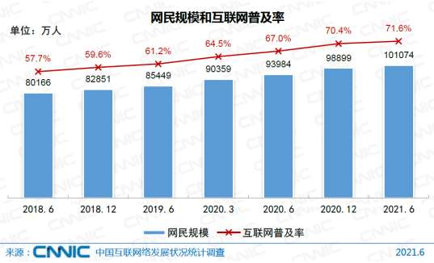

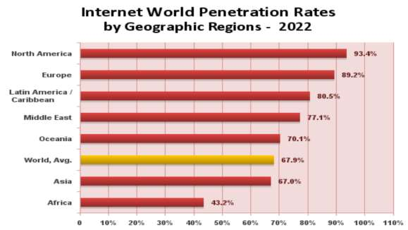

<!-- page: 4 -->

首次成为网民规模世界第一：2008

 第22次中国互联网络发展统计报告中

2008年6月底，中国网民数量达到2.53亿，网民规模跃居世界第一位。

但是普及率只有19.1%

同期，世界互联网普及率21.1%，当时最高普及率是85.4%（冰

岛），日韩分别是68.4%和71.2%，俄罗斯是20.8%。

4

<!-- page: 5 -->

手机网民规模（10.47亿）

网民中的绝对多数

老人群体陆续触

网，构成了多元

庞大的数字社会。

5

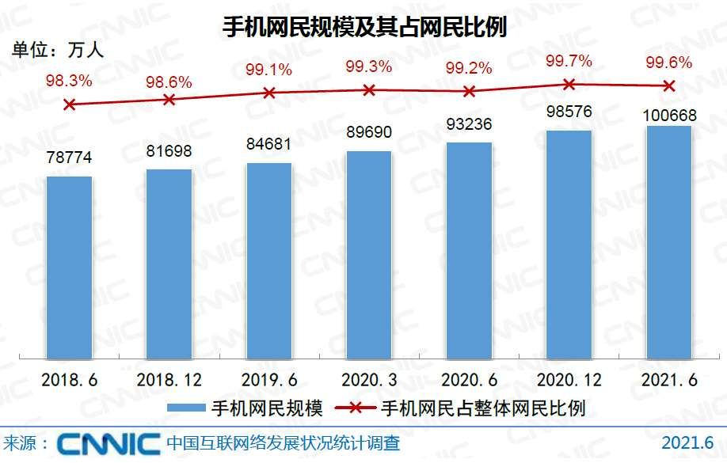

<!-- page: 6 -->

网民每天平均上网接近4小时！

6

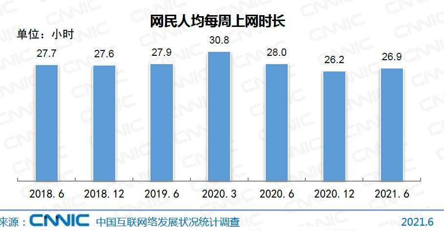

<!-- page: 7 -->

好事？坏事？

7
完全在你！认知、态度和行动！

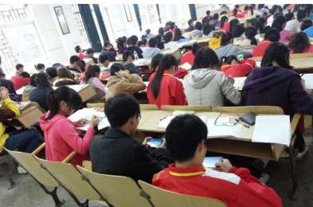

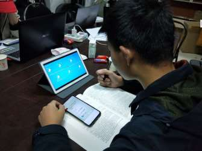

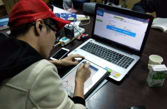

<!-- page: 8 -->

背后的支撑资源之一：出口带宽

 截至到2020年12月底，中国出口带宽总量为11,511,397M

8

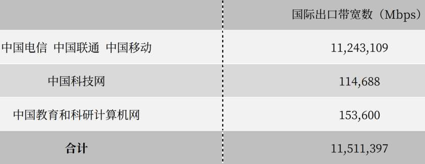

<!-- page: 9 -->

出口带宽的年增长情况

94年的出口带宽是多少？

回到94年
64k

9

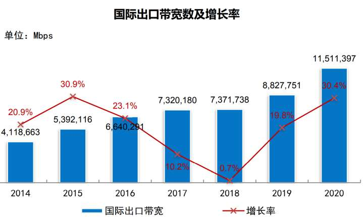

<!-- page: 10 -->

支撑资源之二：IPv4地址资源

截至2022年12月，中国IPv4地址数仍维持在约3. 9亿。

10

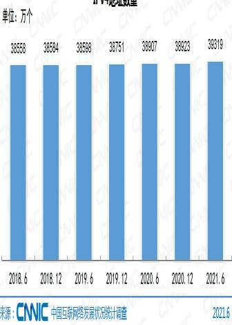

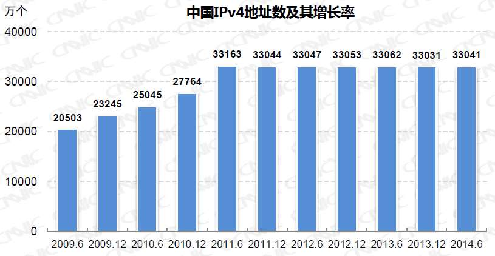

<!-- page: 11 -->

IPv6地址资源

截至2021年6月，中国IPv6 /32地址块数已达62023个。

11

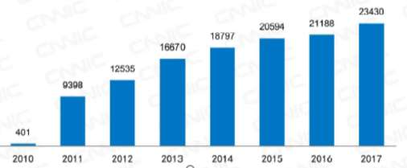

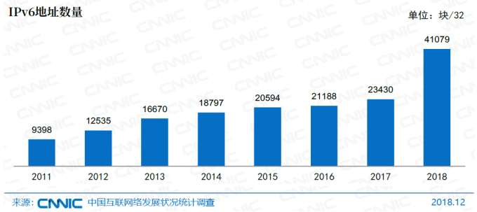

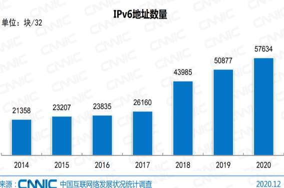

<!-- page: 12 -->

中国教育科研网（CERNET）

2
0
1
3

哈尔滨

乌鲁木齐

长春

沈阳

呼和浩特

北京

唐山

天津

银川

石家庄

10G
100G
？

大连
太原
济南
烟台

兰州

西宁

青岛

郑州

西安

徐州

汉中

2.5G

南京

成都

无锡

上海

武汉
合肥

重庆
黄梅

宜昌

拉萨

155M

杭州

九江

长沙

南昌

福州

贵阳

台北

桂林

柳州
百色
厦门
主干网

昆明

广州

地区网

汕头

惠州

GigaPop

深圳

南宁

深圳

湛江

珠海

Pop

徐闻

海口

12

亚

<!-- page: 13 -->

中国新基建

2018年，中央经济工作会议重新定

义了基础设施建设

2019年，“加强新一代信息基础设

施建设”被列入政府工作报告

新基建：5G基站建设、特高压、城

际高速铁路和城市轨道交通、新能源
汽车充电桩、大数据中心、人工智能、
工业互联网七大领域

13

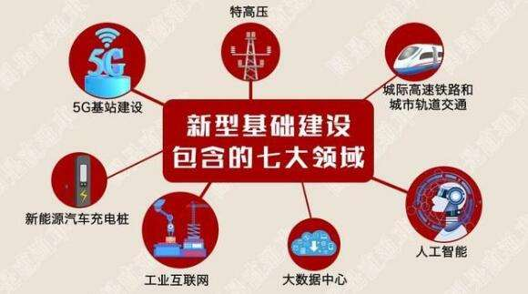

<!-- page: 14 -->

中国新冠vs非典 跟互联网的相互作用

2003年，网民6800万，普及率5.3%

2019年底，网民9亿，普及率64%

 互联网对抗击新冠的作用

信息公开透明，制止谣言

追踪病例行踪，精准布防

后勤保障，网上支付

 。。。。。。。

 抗击疫情促进互联网相关技术的发展

14

<!-- page: 15 -->

主要内容

中国互联网发展怎么样？（CNNIC互联网发展统计报告）

什么是计算机网络、互联网？

网络发展史

国外

国内

计算机网络相关的重要概念

15

<!-- page: 16 -->

什么是计算机网络? P1

一组相互连接的、自治的计算设备的集合。

相互连接：可以交换信息

局域网LAN－1

公用交换电话网

PSTN

PC

PC

便携机

可小可大

便携机

调制解调器

调制解调器

电话机

交换机

PC

网关

互联网（Internet）

电话机

服务器
PC

因特网

计算机网络的网络

本地网－1

路由器

服务器

路由器
路由器

计算机网络的特例

交换机
集线器

交换机

PC
PC

移动终端
无线接入

PC

PC

覆盖全球、异构

PC

便携机

PC

局域网LAN－2

16

<!-- page: 17 -->

万维网：World Wide Web，WWW

运行在互联网络之上

信息资源的网络：由资源、资源标识和传输协议三部分构成。

资源：文本、图像、音频、视频……

资源标识：URL

协议传输：HTTP、HTTP是、RTPS……

互联网和万维网的关系？

17

<!-- page: 18 -->

除了计算机网络，还有很多其它的网络

 有线电视网

 交通网络

 电话网络

 电力网络

 社交网络

 自来水管网

。。。。。。

18

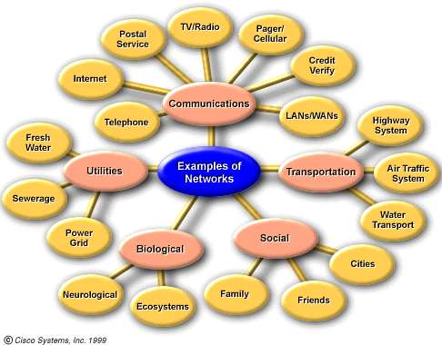

<!-- page: 19 -->

还听过哪些网络相关术语呢？

弹幕、投稿

19

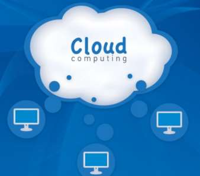

<!-- page: 20 -->

计算机网络发展的历史

国外网络的发展史（1.5.1 P42）

 http://www.nethistory.info/

https://www.internetsociety.org/internet/history-internet/brief-

history-internet

国内网络的发展史

 http://www.cnnic.net.cn

网络的未来

20

<!-- page: 21 -->

国外网络的发展史

奇特的起源----ARPA及ARPANET的诞生（1955 ~ 1970s初期）P21

1969年，第一个实验网络ARPANET正式诞生

 ARPANET向Internet的转变（1970s初期 ~ 1982）

1981年，美国国家科学基金（NSF）成立计算机科学网络（CSnet），

并在 Vinton Cerf 的建议下，两网互连，互联网正式诞生。

DNS同步发展，解决了IP地址的问题

Internet和WWW（1982 ~ 1991 ）

WWW走向公众化

1993年4月，Mosaic 浏览器诞生

Tim Berners Lee（HTML、HTTP）

21
Open
Open

<!-- page: 22 -->

1969，ARPANET  P45

斯坦福研究院SRI

特征

加州大学
圣巴巴拉分校UCSB

分组交换（Packet Switching）

犹他大学UTAH

完全不同于 电路交换

加州大学
洛杉矶分校UCLA

消息被分隔成小的分组（packet）后，传送

 到达的报文首先被存储 (stored)，然后，路

由器决定应该从哪里转发报文

 从选定的输出线路转发这报文

 不同的分组可能走不同的路线

强 抗毁性

22

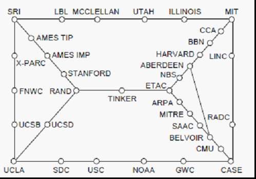

<!-- page: 23 -->

初识互联网：结构

Tier One ISP

核心网络

主干 ISP
主干 ISP

层次性 → 扁平化P29

IXP

地区 ISP
地区 ISP
地区 ISP
地区 ISP

高速交换

本地 ISP
本地 ISP
本地 ISP
本地 ISP
本地 ISP
本地 ISP
本地 ISP
大公司

边缘网络

校园网
校园网
公司

接入

方式多样

融合生长

23

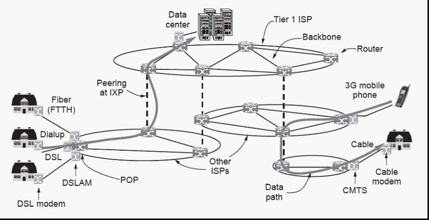

<!-- page: 24 -->

投票
最多可选1项

你家里用的网络接入  采用了那种接入方式？

光纤到户（FTTH）

A

小区局域网（LAN）

B

中国电信流量（4G/5G）

C

中国移动流量（4G/5G）

D

有线电视

E

其它

F

提交

24

<!-- page: 25 -->

国内互联网的发展简史

1987年9月20日，中国人使用Internet的起点

“Across the Great Wall we can reach every corner in the world”（越

过长城，走向世界）。

1994年4月20日，中国克服重重障碍，实现了与Internet的全功能连接

中国科学院院网（CASNet，1992），即后来的中国科技网（CSTNet，

1995）

中国教育与科研计算机网（CERNet，1995）

中国公用计算机互联网（CHINANet，1996）

中国金桥信息网（CHINAGBN，1996）

25

<!-- page: 26 -->

国内互联网的发展简史（续）

中国公众多媒体通信网（169）全面启动，视聆通、天府热线、上海

热线

1997，中国四大网络互联互通

1997年，国务院授权中科院创立和管理中国互联网络信息中心CNNIC。

2006年，建成世界上最大的纯IPv6网络CNGI

2012年，出现了 互联网+ 的概念，“互联网+”就是“互联网+各个

传统行业”

RFC1922（1996年）、RFC3743（2004年）。。。。。。

26

<!-- page: 27 -->

能否看到互联网的未来？

 齐特林（美）:《互联网的未来》，2011

 光荣：自我繁殖

 毁灭：禁锢繁殖

 救赎：自我繁殖

27

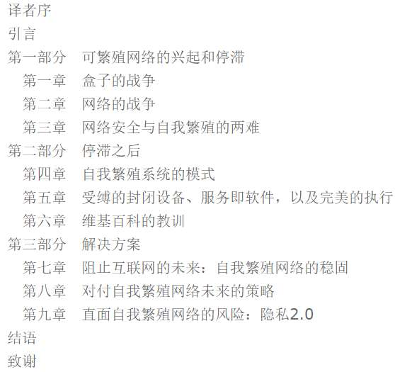

<!-- page: 28 -->

能否看到互联网的未来？

 维多利亚女王：1819-1837-1901

 曾经的辉煌传奇：电报系统（1837，惠

+库/摩尔斯）

Vinton.Cerf 为其作序

 当当上可免费阅读

28

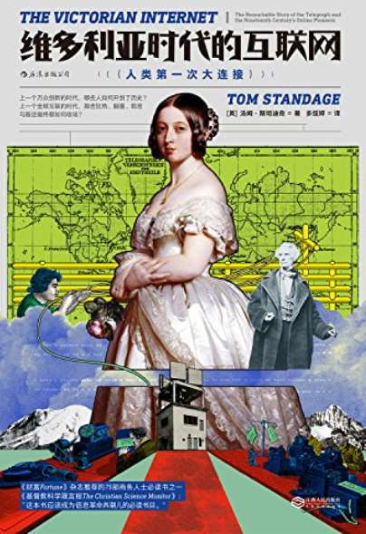

<!-- page: 29 -->

主要内容

中国互联网发展怎么样？（CNNIC互联网发展统计报告）

什么是计算机网络、互联网？

网络发展史

国外

国内

计算机网络相关的重要概念

29

<!-- page: 30 -->

网络的基本概念（一）

拓扑：信道的分布方式。常见的拓扑结构：总线型、星型、

环型、树型和网状

30

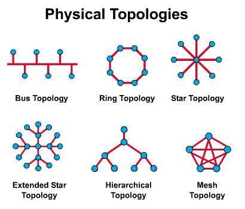

<!-- page: 31 -->

单选题
2分

你知道寝室的网络采用了下面哪种物理拓扑？

总线

A

环

B

星型、扩展星型

C

无规则

D

提交
31

<!-- page: 32 -->

网络的基本概念（二）

协议：通信双方就如何进行通信所作的一种约定。P39

如：TCP/IP

数字带宽：指在单位时间内流经的信息总量。

32

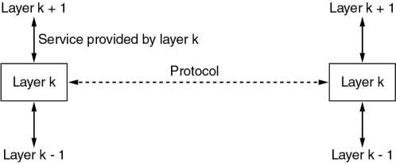

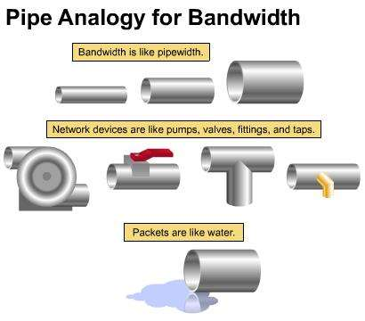

<!-- page: 33 -->

数字带宽的单位

最小的基本单位：bps

33

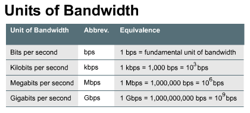

<!-- page: 34 -->

数字带宽的单位 P63

进率：103

34

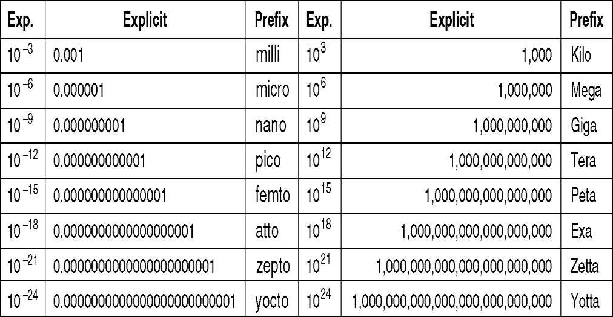

<!-- page: 35 -->

吞吐量（Throughput）

指实际的、可测到的带宽。

   1）网络设备

    2）传输的数据类型

    3）网络拓扑

    4）用户数量

    5）用户计算机

    6）服务器

       ……

35

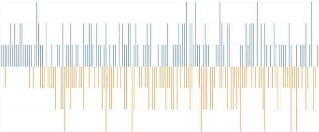

<!-- page: 36 -->

S
T =

P
S
T =

传输时间计算公式：

BW

例：如果ISDN的带宽为 128kbps，OC-48的带宽为 2.488 Gbps，如果用ISDN传
输一张装满数据的1.44M软盘，用OC-48传输装满10G的硬盘数据，问哪一种传
输所用的时间更少？

S
T =

解：按照理想的传输状况来计算，即根据：

BW

=


=
=

90
128
8
10
44
.1
128
44
.1
3

M
T

s
kbps

有：

fd

=

=

s
Gbps
G
T

8
10

152
.
32
488
.2

hd

答：传输10G的硬盘数据所化的时间更少。

36

<!-- page: 37 -->

单选题
5分

(13年考研题）主机甲通过1个路由器（存储转发方式）与主机乙互联，两

段链路的数据传输速率均为10Mbps，主机甲分别采用报文交换和分组大

小为10kb的分组交换向主机乙发送1个大小为8Mb（1M=106）的报文。

若忽略链路传播延迟、分组头开销和分组拆装时间，则两种交换方式完成

该报文传输所需的总时间分别为：

800ms、1600ms

A

801ms、1600ms

B

1600ms、801ms

C

1600ms、800ms

D

提交
37

<!-- page: 38 -->

1ms

参考答案：D

800

解析：

报文交换，不进行分组，路由器接收完成再发送，发送一个报文的时延

是8Mb/10Mbps =800ms，在接收端接收此报文件的时延也是800ms

，共计1600ms。

进行分组后，发送一个分组的时延是10kb/10Mbps=1ms，接收一个分

组的时延也是1ms，但是在发送第二个分组时，第一个报文已经开始接

收。共计有800个分组，总时间为801ms。

关键点：发送时延就是传输时延，等于信息

的量除以带宽；接收时延也是传输时延。

38

<!-- page: 39 -->

信息单位和带宽单位的比较

存储容量的基本单位：字节Byte

KB、MB、GB和TB分别代表210、220、230和240字节；

带宽的基本单位：比特每秒bps

kbps、Mbps、Gbps和Tbps分别代表103、106、109和1012 比特/秒

39

<!-- page: 40 -->

网络的基本概念（三）

点到点：信源机和信宿机之间的通

Point  to Point

信由一段一段的直接相连的机器间

PC1
PC2

的通信组成，机器间的直接连接叫

TCP/IP

做点到点连接。

Router

Router

端到端：信源机和信宿机之间直接

Switch

Switch

通信，好象拥有一条直接的线路。

End to End

PC1
PC2

40

<!-- page: 41 -->

补充：端到端延迟（delay）

传输延迟（transmission）

Point  to Point

发方：从网卡传输到传输介质上的时间

PC1
PC2

收方：从传输介质接收到网卡上的时间

传输时间=传输的信息量/传输速率

传播延迟（propagation）：从传输介质的一端传播到另外一端

传播延迟=传输介质的长度/传播速度

传播速度：光速的65%，约每微妙200米

端到端延迟=所有的传输时间+所有的传播延迟

41

<!-- page: 42 -->

网络的基本概念（四）

单工（simplex）：信息传输只能够单方向

进行，有明确的发方和收方。

半双工（hal-duplex）：信息传输的方向

可以交替进行，但是，在特定时间，只能单

向传输，即不能同时双向传输。

全双工（full-duplex）：信息可以同时双

向传输。

42

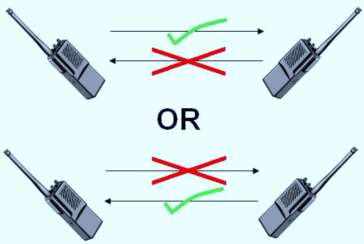

<!-- page: 43 -->

网络技术（1.3节）P12

按规模划分 P14

按传输介质分

有线网

个域网 PAN

无线网

局域网 LAN

按拓扑结构分

城域网 MAN

总线

广域网 WAN

环型

互联网 Internet

网状

按传输技术分

星型

广播式网络  P13

点到点网络

43

<!-- page: 44 -->

局域网（Local Area Network）

 覆盖范围小P15

 传输技术，广播方式为主

 总线型：如IEEE802.3（以太网）CSMA/CD

 环型：如IEEE802.5（IBM令牌环）拓扑结构

 拓扑结构

44

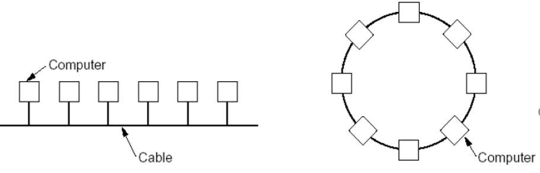

<!-- page: 45 -->

城域网（Metropolitan Area Network）

 大型的LAN ，IEEE802.16，P16

 基于CableTV的城域网

45

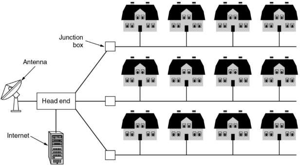

<!-- page: 46 -->

广域网（WAN，1/2）

 主机（host）、LAN和通信子网的关系P17

交换单元
传输线

46

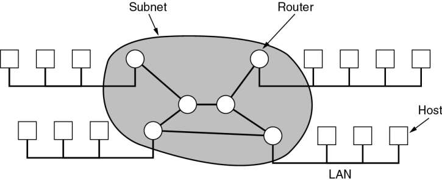

<!-- page: 47 -->

广域网（WAN，2/2）

 从发送方到接受方的分组流

ISP网络服务提供商

47

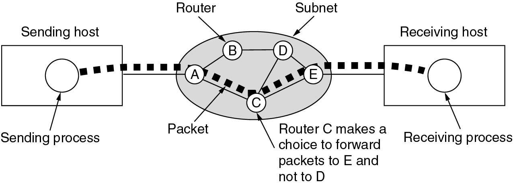

<!-- page: 48 -->

通信子网（Subnet）P17

分组（packet）交换

 消息被分隔成小的报文（packet）后，传送

 到达的报文首先被存储 (stored)，然后，路由器决定应该从哪里转发报

文；

 从选定的输出线路转发这报文。

 不同的分组走不同的路线，也可能走相同的路线。

48

<!-- page: 49 -->

网络互连P20

网关（Gateways）

连接异构网络

提供必要的转换（软件或硬件）

互联网络（internetwork ，internet)

网络的集合

主要的形式：被WAN连接起来的LAN集合

子网、网络、互联网

子网完成基础转发

子网和主机组成网络

当异构的网络连在一起形成互联网

49

<!-- page: 50 -->

小结

计算机网络的定义

计算机网络的历史

计算机网络相关的概念

拓扑、带宽、吞吐量、协议、点到点、端到端

网络技术

PAN、LAN、MAN、WAN、Internet

50

<!-- page: 51 -->

有问题吗？

51

