# 20230310_第1章(2)_引言_20230619170111

<!-- page: 1 -->

第1章（2）

袁华：hyuan@scut.edu.cn

广东省计算机网络重点实验室

华南理工大学计算机科学与工程学院

1

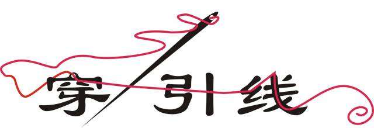

<!-- page: 2 -->

预习完成情况

网工：59/73=80.8.5%

请注意：预习雨课件每页都必须

计科1：80/84=94.4%

停留3秒以上！包括首页、末页！

2

<!-- page: 3 -->

从总体理解通信这件事情

通信三要素：发方、收方和通道

3
通信（现代汉语大词典）：信息通过介质从一点传到另外一点。

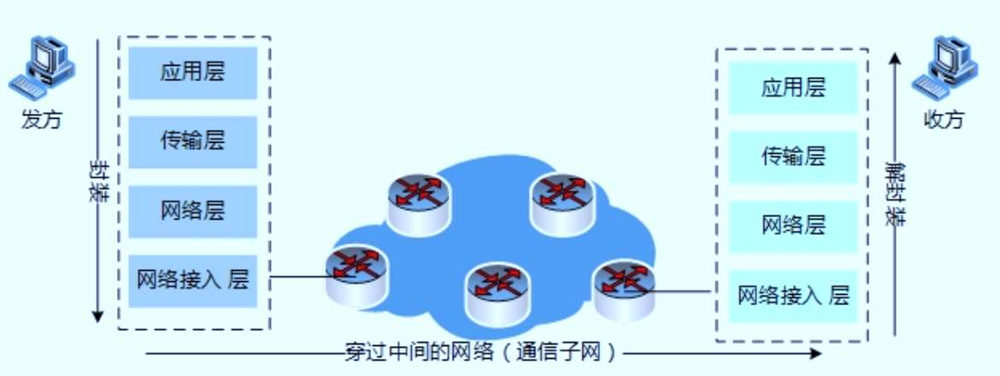

<!-- page: 4 -->

为什么要分层？

计算机网络的复杂与异构

开发个游戏直播软件，是否需要针对3G/

介质：光纤、铜缆、空气...

4G/5G还是WiFi单独开发？

接入：有线、WLAN、移动数

据网络、蓝牙...

明晰简化，便于分析学习

应用：无人驾驶、万物互联、

分层结构
统一标准
模块独立

各层独立，加速技术演进

短视频、邮件...

统一接口，确保技术互通

高速更新迭代

（interoperable）

大哥大1G（模拟）、2G(数字)、

3G、4G、5G

WiFi发展为新版本WiFi6，那么WiFi6是

IEEE802.3，10M/100M/1G…..

否要对已有直播、微信或支付宝做适配？

IEEE802.11b/g/n/ac……

4

<!-- page: 5 -->

分层的原则和参考模型

分层原则：信宿机第n层收到的对象应与信源机第n层发出的对象

完全一致。

应用层

应用层

表示层

典型分层模型：

会话层

OSI七层模型

传输层

传输层

TCP/IP（DoD）四层模型

互联网层

网络层

数据链路层

网络接口层

物理层

OSI 7层模型
TCP/IP 4层模型

5

<!-- page: 6 -->

列举生活中的类似参考模型

快递、邮政、美团外卖、行政级别。。。

很有料的一个：以前的程序设计作业

很有趣的一个：青年男女相亲

女方

男方

女方父母

男方父母

媒婆

媒婆

6

<!-- page: 7 -->

参考模型上的一些概念

每一层的功能：为它的上一层服务（调用下一层的服务）

实体Entity：每层中活动的元素

对等实体（peer）

第n层是服务提供者，则第n+1层是服务对象，即服务的消费者

其他概念：协议数据单元（PDU：protocol data unit）

7

<!-- page: 8 -->

接口、服务和协议的关系 P31

每一层都利用它的下一层，为它的上一层提供服务

8

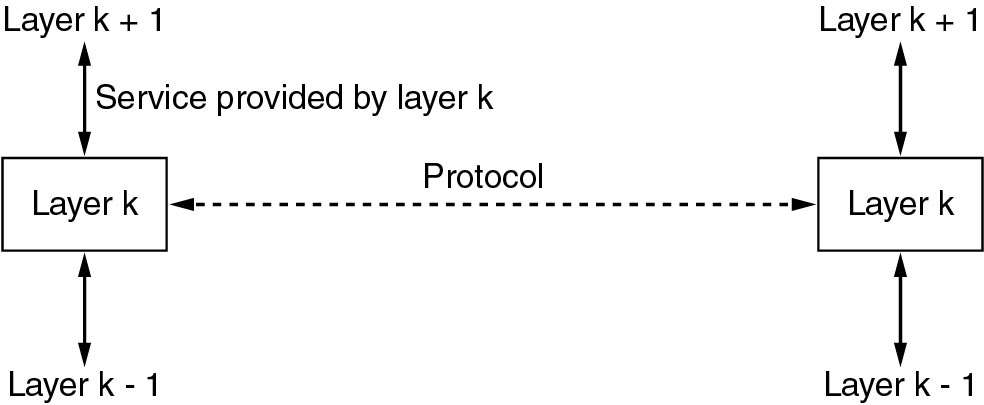

<!-- page: 9 -->

两个著名的参考模型

ISO OSI参考模型

TCP/IP参考模型（DoD）

OSI参考模型和TCP/IP参考模型的比较

OSI参考模型和协议的缺点

TCP/IP参考模型和协议的缺点

9

<!-- page: 10 -->

ISO-OSI模型

“International Standards Organization Open Systems

Interconnection Reference Model”. (1983 ISO, 1995 修订)

协议很少再使用，但模型却很流行。

每层都定义了标准

本身不是网络架构，因为它本身并没有规定每层确切的服务和协

议。

10

<!-- page: 11 -->

讨论：各层主要功能（弹幕）

物理层之4特性

①机械特性：指明接口所用接线器的

形状和尺寸、引脚数目和排列、固定和

锁定装置等。

②电气特性：指明在接口电缆的各条

线上出现的电压范围。

③功能特性：指明某条线上出现某一

电平的电压意义。

④过程特性：指明对于不同功能的各

种可能事件的出现顺序。

11

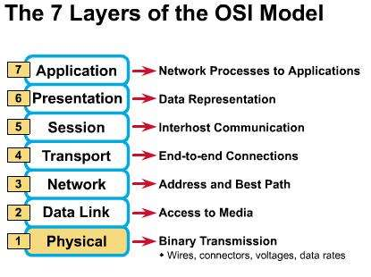

<!-- page: 12 -->

No.2 正确率

网工：89%

计科1：82%

12

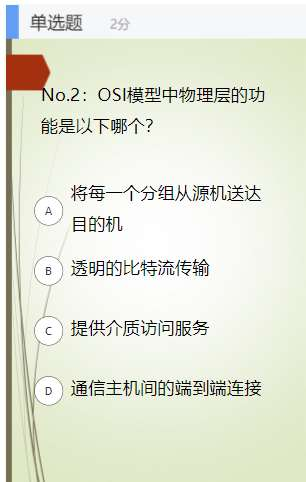

<!-- page: 13 -->

封装和解封装，为什么？怎么做？

封装（打包）

发方，一次通信的开始

从上而下，逐层添加开销（头部/尾）

解封装（解包、拆包）

收方，一次通信的结束

从下而上，逐层拆除开销（头部/尾）

13

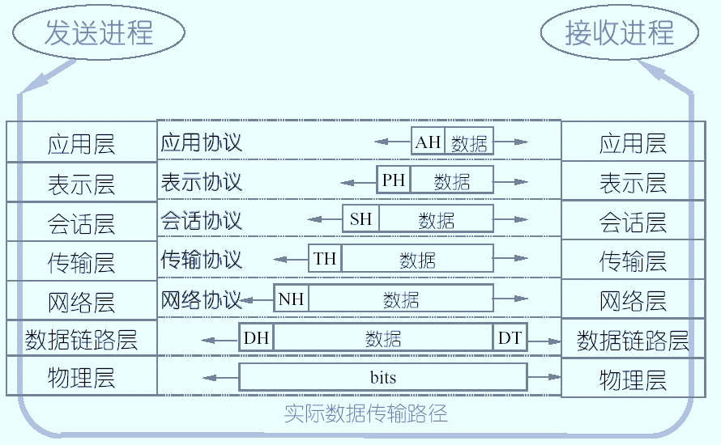

<!-- page: 14 -->

PDU及对应的名字P32~35

应用层：信息（information）

表示层：数据（data stream）

表示层：SPDU

传输层：段（segment）

网络层：分组（packet）

数据链路层：帧（frame）

物理层：比特流（bits）

14

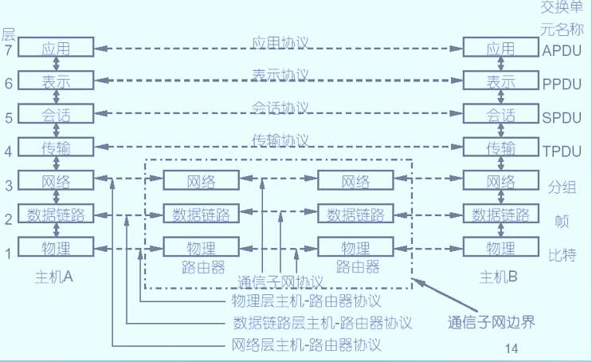

<!-- page: 15 -->

No.3 正确率

网工：35%

计科1：48%

15

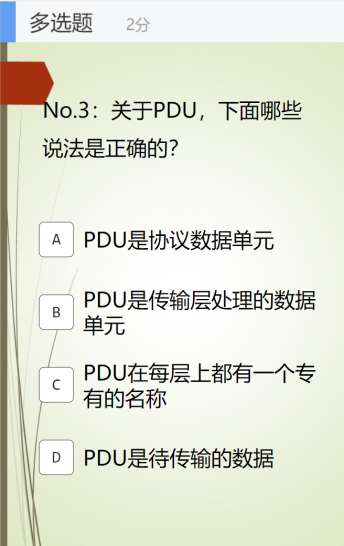

<!-- page: 16 -->

对等通信（虚拟通信）

发方某层发出的PDU，通过通道到达收方的对应层

收方对应层收到的PDU，和发方对应层发出的一模一样

真实的数据流：U

16

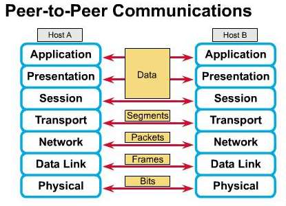

<!-- page: 17 -->

更深入一点的“U”型流

发送：hello

接收：hello

解封装

封装

消息message

应用层

应用层

hello

hello

De-encapsulation

Encapsulation

段segment

Ht hello

Ht hello

传输层

传输层

数据报
packet

Hn Ht
hello

Hn Ht
hello

网络层

网络层

网络层

帧
frame

链路层

链路层

链路层

链路层

链路层

Hl Hn Ht
hello

Hl Hn Ht
hello

101101010000...

101101010000...

物理层

物理层

物理层

物理层

物理层

主机A
交换机
交换机
主机B
路由器

端到端通信实例：主机A上的QQ，发送消息；主机B上的QQ，接收消息

发送端层层封装，接收端层层解封装

不同层对应协议数据单元（PDU Protocol Data Unit）
17

<!-- page: 18 -->

TCP/IP参考模型

链路层（Link Layer）

满足无连接的互联网络层需求，链路必须具备的功能（Ethernet）

应用层

互联网层（Internet Layer）

允许主机将数据包注入网络，让这些数据包独立的传输至目的机，

传输层

并定义了数据包格式和协议（IPv4协议和IPv6协议）

互联网层

传输层（Transport Layer）

允许源主机与目标主机上的对等实体，进行端到端的数据传输：

链路层

TCP，UDP

应用层（Application Layer）

传输层之上的所有高层协议：DNS、HTTP、DHCP、FTP、

18

SMTP ...

<!-- page: 19 -->

TCP/IP模型及协议簇 P47

摒弃电话系统中“笨终端&聪明网络”的设

计思路

采用聪明终端&简单网络，由端系统TCP负

TCP/IP

责丢失恢复等，简单的网络大大提升了可扩

展性

实现了建立在简单的、不可靠部件上的可靠

系统

TCP/IP的沙漏模型

19

<!-- page: 20 -->

OSI模型与TCP/IP模型比较

7层模型与4层模型

应用层

两个模型的核心两层大致对应（网络层和传输层）

应用层

表示层

TCP/IP模型的应用层包含了OSI模型的表示层与会话层

会话层

基本设计思想：通用性与实用性

传输层

传输层

OSI：先有模型后设计协议，明确了服务、协议、接口

网络层

互联网层

等概念，更具通用性

数据链路层

TCP/IP模型：仅仅是对已有协议的描述

链路层

物理层

无连接与面向连接

OSI 7层模型
TCP/IP 4层模型

OSI模型网络层能够支持无连接和面向连接通信

TCP/IP模型的网络层仅支持无连接通信（IP）

20

<!-- page: 21 -->

OSI模型与TCP/IP模型比较（续）

OSI模型的不足

TCP/IP模型的不足

核心概念未能体现

从未真正被实现

• 未明确区分服务、接口和协议等核心概念
不具备通用性

TCP/IP已成为事实标准，OSI缺少厂家支持

技术实现糟糕

• 不适于描述TCP/IP之外的其它协议栈
混用接口与分层的设计

OSI分层欠缺技术考虑：会话层、表示层薄

弱；数据链路层、网络层内容繁杂。

• 链路层和物理层一起被定义为链路层，而
非真正意思上的分层
模型欠缺完整性

分层间功能重复

非技术因素

TCP/IP实现为UNIX一部分，免费

• 未包含物理层与数据链路层
• 物理层与数据链路层是至关重要的部分

OSI被认为是政府和机构的强加标准

OSI的失败：糟糕的时机、技术、实现、政策

21

<!-- page: 22 -->

本教程内容的分层组织

应用层

突出核心概念

应用层

应用层

表示层

区分接口与分层

会话层

传输层

传输层

传输层

体现完整性

互联网层

网络层

网络层

体现通用性

数据链路层

数据链路层

网络接口层

简化分层，易于教学

物理层

物理层

OSI 7层模型
TCP/IP 4层模型

本教程的分层组织

22

<!-- page: 23 -->

国际标准组织

国际标准化组织（ISO）

• ISO (International Organization for Standardization)是一个国
际化组织，它包括了许多国家的标准团体
•
国际标准ISO 7498：OSI 七层参考模型
国际电信联盟（ITU）

• ITU (International Telecommunicatons Union)前身是国际电报
电话咨询委员会（CCITT）
• ITU是一家联合国机构，共分为三个部门：ITU-R负责无线电通信，
ITU-D是发展部门，ITU-T负责电信
• ITU制定了许多网络和电话通信方面的标准
• ITU常采用政府代表团形式参会，工信部组织我国代表团参加
• H.264、G.711

23

<!-- page: 24 -->

国际标准组织

国际电气和电子工程师协会（IEEE）

• IEEE (Institute of Electrical and Electronic

Engineers) 是世界上最大的专业技术团体

• IEEE在通信领域最著名的研究成果之一是802

局域网标准，如IEEE 802.3、IEEE802.11

WIFI联盟

• WiFi联盟 (WiFi Alliance，简称WFA)，

是一个商业联盟，拥有 WiFi的商标

• 成立于1999年，主要推行WiFi产品的兼容认

证，发展IEEE802.11标准的无线局域网技术

24

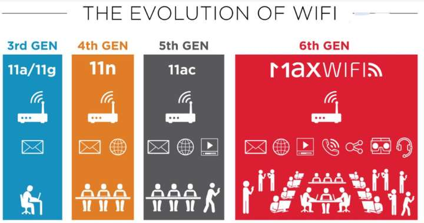

<!-- page: 25 -->

Internet标准组织

IETF: 互联网工程任务组

• IETF (Internet Engineering Task Force) 是国际民间机构
• IETF是制定互联网标准的核心组织，如TCP、IP、HTTP等
均由IETF制定
• IETF分为互联网、路由、传输、安全、应用、运行管理等领域（Area），具体
由其超过100个工作组WG（WorkingGroup）承担

RFC 793 - Transmission Control Protocol（TCP）
RFC 791 - Internet Protocol （IP）

IRTF: Internet研究任务组

• IRTF (Internet Research Task Force) 下设多个专门任务组，针对特定协议、应
用、体系结构等进行研究
• IRTF 一般只出研究报告，但不制定协议标准

25

<!-- page: 26 -->

Internet标准组织

如何进入/参加“互联网的殿堂”——IETF

不自称为标准的

• Internet标准以RFC（Request For Comments，请求评注）
文档的形式公开，任何人都可免费获得这些RFC文档，例如
RFC2068为HTTP协议
• IETF的各种规章制度（乃至RFC产生规则），全部以RFC发布
• 每年3次会，但所有决策须在邮件列表确认，因此可仅远程参与
• IETF由愿为互联网发展做出贡献的专家自发参与和管理(无薪)
• 没有会员制，每个人都可以是IETFer，在邮件列表参与即可

事实标准RFC

IETF名言 (David Clark)
我们拒绝国王、总统和投票，简单多数和可运行的代码就是我们信仰

We reject: kings, presidents, and voting.
We believe in: rough consensus and running code

David Clark @ MIT

26

<!-- page: 27 -->

Internet标准组织

RFC产生过程

某工作组

从个人提交个人文稿，到接

接受
工作组

个人
文稿

工作组

受为工作组文稿，再通过各层
Last Call等审核，最终才能成
为RFC
上述过程往往至少要2~3年
各国RFC贡献情况

文稿

认可

邮件列表讨论或参会

工作组
Last Call
IESG
审核通过

全球有约9000个RFC
美国给6600个RFC做过贡献
英、德、加、法、芬等强国
我国贡献数上升到第7位，给

RFC

工作组讨论
（会场唇枪舌战

IETF Last Call
（邮件列表）

）

近500个RFC做了贡献
美国近3000人有RFC署名，

互联网大国而非强国

IETF的核心权利机构

我国参与RFC的人数少，

互联网工程指导小组IESG

我国仅有不到200人有RFC

主导的RFC数量有限

由IETF各领域主席构成

27

<!-- page: 28 -->

Internet标准组织

互联网协会ISOC

互联网协会 ISOC

Internet Society，简称ISOC

由国际互联网协会为IETF等提供法

互联网体系结构

律支撑
互联网体系结构委员会IAB

研究委员会IAB

IRTF
互联网研究任务组

IETF
互联网工程任务组

• IAB: Internet Architecture Board

• IAB是国际互联网标准化组织IETF
的顶层架构委员会，由13个个人成
员组成

互联网工程
指导小组IESG

互联网研究
指导小组IRSG

…

领域
领域

负责TCP/IP协议簇开发研究方向的

RG
WG
…
…
RG
…

WG
WG
WG

指导

成立于1983年

28
https://www.iab.org

<!-- page: 29 -->

中国的相关标准组织与联盟

中国通信标准化协会CCSA

• CCSA (China Communications Standards
Association)

• 2002年12月18日成立

• 10余个技术委员会TC，根据技术需求成立和解散

TC1：互联网与应用
TC8：网络与信息安全

TC3：网络与业务能力
TC9：电磁环境与安全防护

TC4：通信电源与通信局站工作环境
TC10：物联网

TC5：无线通信
TC11：移动互联网应用和终端

TC6：传送网与接入网
TC12：航天通信技术

TC7：网络管理与运营支撑

29

<!-- page: 30 -->

标准组织的标准一览和教材对应

ITU

ISO

IEEE P56

IAB P58

IRTF

IETF

W3C  P59

30

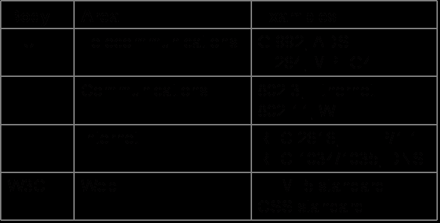

<!-- page: 31 -->

IEEE 802 标准

31

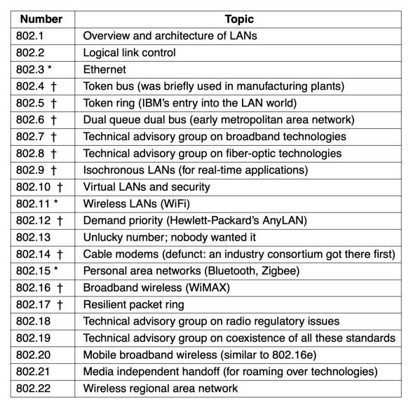

<!-- page: 32 -->

RFC文档  P64

最早的RFC文档
Robert E. Kahn /Bob Kahn

https://en.wikipedia.org/wiki/Bob_Kahn

32

<!-- page: 33 -->

第1章 结束了？

内容很多

是否理清楚了知识脉络？是否能够串起来？

构建自己的知识框架

是否有不懂的点？是什么？

论坛

QQ群

邮件：hyuan@scut.edu.cn

33

<!-- page: 34 -->

填空题
8分

每一次通信，总是以 [填空1] 的 [填空2] 开始，以 [填空3] 的 [填空4]

结束。

正常使用填空题需3.0以上版本雨课堂

作答

34

<!-- page: 35 -->

单选题
5分

（17年考研33题）假设OSI参考模型的应用层欲发送400B的数据(无拆分)，

除物理层和应用层之外，其他各层在封装PDU时均引入20B的额外开销，

则应用层数据传输效率约为______。

91%

A

87%

B

83%

C

80%

D

提交
35

<!-- page: 36 -->

单选题
5分

在发送端有一个自上到下的协议栈，使用SPDY协议，TCP，IPv6和ADSL发送消息。

在网络的 “线”上，消息是怎样封装起来的？

假如使用每一个协议的第一个字母来代表它的头，例如，字母S表示为SPDY协议为

数据封装加的头部，M表示最上层的消息。这些头部以它们被发送的顺序来排列，

最左边是最先发出的部分。

M

AITSM

A

SPDY

TCP

MAITS

B

IPv6

AM

ADSL

C

MSTIA

D

提交

36

<!-- page: 37 -->

单选题
5分

一个主机通过两个路由器发送一个传输单元。用于发送用户消息的协议

栈从顶部到底部依次是TCP、IP、以太网。第一个路由器在IP层转发消

息到WiFi 链路层。第二个路由器在IP层转发消息到ADSL 链路层。下面

哪个选项是在第二个路由器之后的“线上”网络中看到的传输单元的最

佳描述？

MTIE

A

TCP

TCP

TCP

IP

IP

IP

AWEITM

B

以太网

WIFI

ADSL

AITM

C

WIFI
ADSL
以太网

MTIA

D

提交

37

<!-- page: 38 -->

参考答案：D

路由器

收包、拆包、处理

转发，跟转出的网络相适配

TCP

TCP

TCP

IP

IP

IP

以太网

WIFI

ADSL

WIFI
ADSL
以太网

PDU：？
PDU：？
PDU：？

38

<!-- page: 39 -->

谢谢！

39

<!-- page: 40 -->

本章小结

计算机网络及相关概念

两种参考模型及其比较

封装（打包）和解封装（解包）

对等通信

了解各种网络实例

最有影响的网络标准组织：IETF、IEEE、ITU、ISO

40

<!-- page: 41 -->

建议重点阅读内容

网络分类

1.3

参考模型

1.6

网络实例

1.4.1

网络标准化

1.7

41

<!-- page: 42 -->

本章中重要的中英文对照

Internet：因特网

Reference model：参考模型

PDU（Protocol Data Unit）：协议数据单元

Bits：比特流

Frame：帧

Packet：分组

Segment：数据段

RFC（Request for comments）：请求注释文档

Encapsulation：封装

Peer To Peer Communication（virtual communication）：

对等通信（虚拟通信）
42

