# 20230315_第2章_物理层（1）_20230619170128

<!-- page: 1 -->

第二章   物理层（1）

传输介质

袁华：hyuan@scut.edu.cn

广东省计算机网络重点实验室

华南理工大学计算机科学与工程学院

<!-- page: 2 -->

第1章回顾

中国互联网发展现状

发方：封装

互联网发展史

计算机网络相关概念

通
信
子
网

参考模型及相关概念

弹幕：记得哪些？

互联网标准  （RFC文档）

接收方：解封装

2
2023/6/19

<!-- page: 3 -->

物理层 最重要的一句话：

物理层提供了透明的比特流传输！

01001110
10110001
01010010
01001110
10110001
01010010

01001110
10110001
01010010
01001110
10110001
01010010

<!-- page: 4 -->

第2章导学（请增、修）

4
2023/6/19

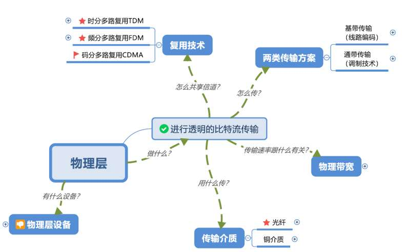

<!-- page: 5 -->

本节主要内容

传输介质

引导性传输介质

铜介质（粗缆、细缆、双绞线）

光纤

非引导性传输介质

电磁波谱

无线电

微波

红外、激光等

5
2023/6/19

<!-- page: 6 -->

传输信号的介质长什么样？

6
2023/6/19

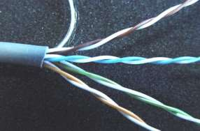

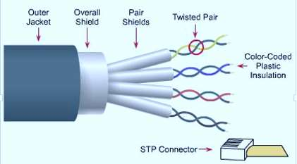

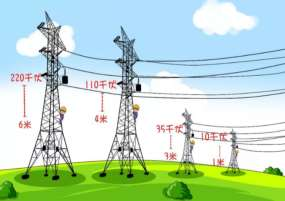

<!-- page: 7 -->

引导性传输介质

磁介质

铜介质

同轴电缆

双绞线

光纤

7
2023/6/19

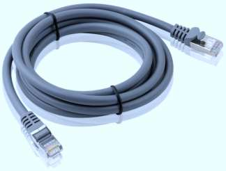

<!-- page: 8 -->

永久存储设备（2.1.1   P70）

千万别低估一辆满载磁带的高速飞驰的货车！

如果一个标准Ultrium磁带携带800GB的数据

一个60 x 60 x 60 cm的盒子可以携带1000个这样的磁带，数据量达

800TB，或 6400Tb.

联邦快递可在24小时内，将盒子送达全美各地，传输速率可达70Gbps；

如果送达到1小时的目标，速率可达1700Gbps

运送成本：约0.5美分1GB。

所以，为什么我们不选择磁带呢？

8
2023/6/19

<!-- page: 9 -->

双绞线 P71-72

4对直径约1mm的铜线绞在一起，降低辐射干扰。

两类

双绞导线

非屏蔽双绞线UTP

3类：电话线

5类、超五类、6类：10/100/1000M以太网，100米

十字骨架

外保护套

屏蔽双绞线STP

双绞导线

7类：万兆以太网，比光纤便宜

8类：25G/40G，30米

线对屏蔽

外屏蔽

外保护套

2023/6/19
9

<!-- page: 10 -->

UTP及UTP的使用

用于将PC接入（PC VS 交换机）

水平线缆、直通线

连接两个同类设备

交叉线

特点

优点：成本低、操作简单

缺点：易受MRI、RFI干扰

使用：广泛用于接入局域网

10
2023/6/19

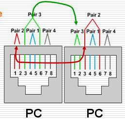

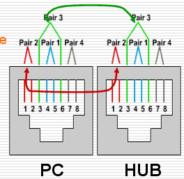

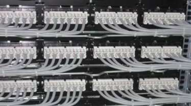

<!-- page: 11 -->

UTP的类别

UTP虽然易受干扰，但使用广泛，有赖它本身的不断进步

传输距离：100米

2023/6/19
11

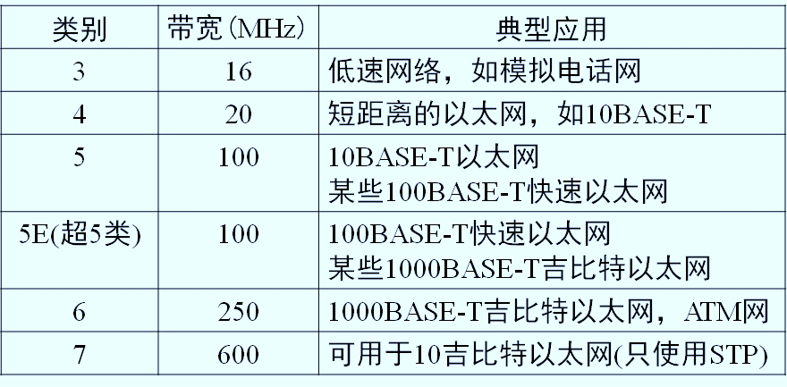

<!-- page: 12 -->

实验：直通线 VS. 交叉线

当用作直通线（比如，连接交换机

和PC）时，线两头的线序一致，不

一致时，则用作交叉线（比如，连

接两台路由器）。

EIA/TIA568A

现在直通线和交叉线不再重要，可

以自适应

12
2023/6/19
电子工业协会：Electronic Industries Alliance
电信工业协会（Telecommunications Industry Association）

EIA/TIA568B

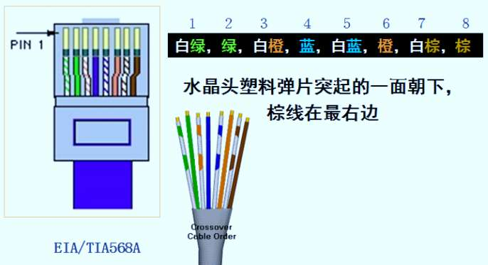

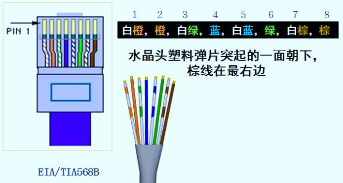

<!-- page: 13 -->

除了双绞线，还有同轴电缆 P73

按照直径分

粗缆：经典以太网总线500米

细缆：经典以太网总线185米

按照特性阻抗分

50 Ω：数字信号传输

75 Ω：模拟信号传输、有线电视

特点：物理带宽大、抗干扰

广泛用于有线电视 接入

2023/6/19
13

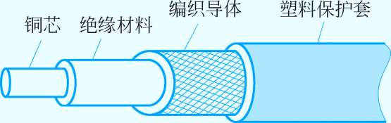

<!-- page: 14 -->

还有电力线P72

极其便利

2023/6/19
14

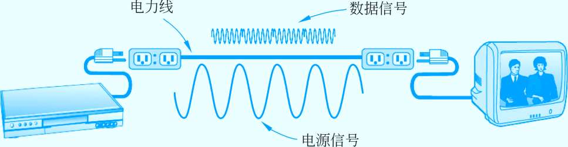

<!-- page: 15 -->

干线用什么传输介质？

光纤

垂直电缆

骨干/干线电缆

15
2023/6/19

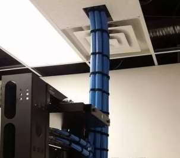

<!-- page: 16 -->

Father of fiber optic comm.

高锟，1933-2018，江苏金山人

1957，任职于ITT，1960年，ITT的标准电信实

验有限公司，开始通信研究。

1964年，提出以光代电

1981年，第一个光纤系统问世

2003年初，高锟证实罹患早期老人痴呆症

2009年10月6日，瑞典皇家科学院向高锟颁授

诺贝尔物理学奖，成为第八位获得诺贝尔科学奖

的华裔科学家。

16
2023/6/19

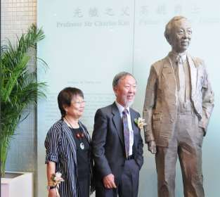

<!-- page: 17 -->

光传输原理P75

全反射

三个波段：850、1300、1550（nm）

分类

多模光纤(橙色)

短距离（几公里）

纤芯：62.5微米

单模光纤（黄色）

长距离（可超过100公里）

纤芯：8-10微米

2023/6/19
17

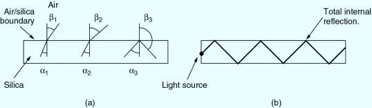

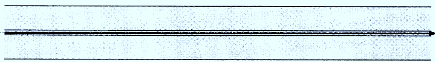

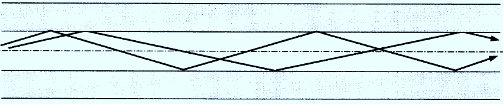

<!-- page: 18 -->

两种不同的光源

半导体激光

LED

2023/6/19
18

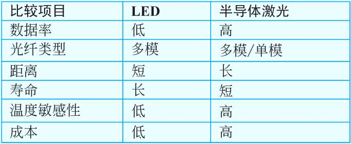

<!-- page: 19 -->

光纤、光缆和光传输系统

光纤

光缆（普通/铠装）

2、4、24、48、144

光传输系统

光源（光发送机）

光纤

探测器（光接收机）

2023/6/19
19

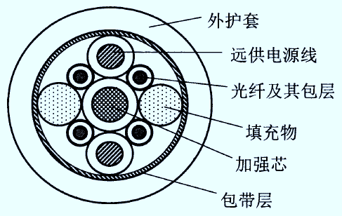

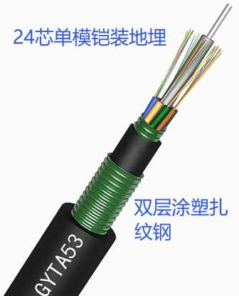

<!-- page: 20 -->

光纤可以弯吗？

优点：损耗小、传输距离远、带宽大、不受MRI/RFI干扰

缺点：易断、价格高

使用：干线

G.657（耐弯光纤），弯曲半径7.5mm

普通多模光纤G.651弯曲半径：15mm

单模光纤G.652弯曲半径：30mm

20
2023/6/19

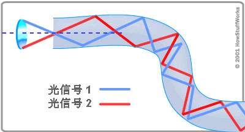

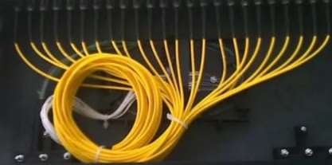

<!-- page: 21 -->

塑料光纤

损耗大

短距离

全光网络

空心光纤、复合材料光纤

21
2023/6/19

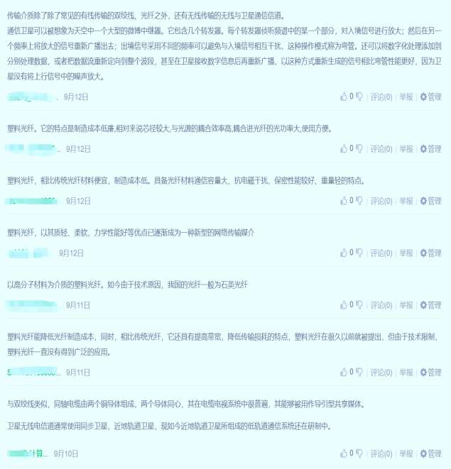

<!-- page: 22 -->

光纤断了怎么办？P77

光纤怎么会断的？

野蛮挖断、人为破坏

地震、鲨鱼撕咬

光纤连接

光纤连接器（光损失10%~20%）

机械拼接，特殊的套管夹紧（光损失10%）

熔合（几乎无损失）

22
2023/6/19

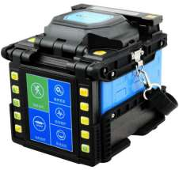

<!-- page: 23 -->

全光放大器：掺铒放大器 P76

光放大器是光纤通信系统中能对光信号进行放大的一种子系统，在光域上直接提升信号功率

……

……

λ1 λ2
λ120
……

λ1 λ2
λ120
……

光放大器

•
1985年南安普顿大学的Daivd Payne教授发布了EDFA论文，开启了光纤放大器的诞生与发展，被誉为“光放之父”

•
从O/E/O中继到光中继

23
Huawei Proprietary – Restricted Distribution (Course-related teachers and students
only)

<!-- page: 24 -->

未来长途传输技术：空分复用光纤原理

多芯光纤

少模光纤
单模光纤

•
光纤波导的结构特
性决定了光信号在
光纤中传播时能量
的空间分布。

包层
芯1

芯2

芯N

•
不同大小的光纤波
导截面造成不同的
光信号能量分布，
称为不同的模式。
每个模式都有独特
的电磁场分布。

…

空间维度：模式/纤芯

复用维度

少模/多芯传输系统：用少模/多芯光纤替换单模光纤信道，利用少模光纤中的不同光场模式，或多芯光纤中不同纤芯作
为全新的信息复用维度，每个模式/纤芯都能够传输密集波分复用信号，最终实现单纤容量十倍至百倍提升。

<!-- page: 25 -->

小结：传输介质

铜 （为什么电力线恐怖？）

同轴电缆（粗缆、细缆）

双绞线（UTP、STP）

用作水平线

光纤（单模、多模）

规格：8.3/125 微米（单）、62.5/125微米（多）

用于干线、用作垂直电缆

25
2023/6/19

<!-- page: 26 -->

课前热身

什么是传输介质（media）？

铜介质构成了哪些线缆？

同轴电缆的特点和分类？

双绞线的分类？

双绞线的特点和主要指标？

光纤的传输原理？

光纤的特点是什么？

2023/6/19
26

<!-- page: 27 -->

预习第2题完成情况

网工：57%

计科1：70%

2023/6/19
27

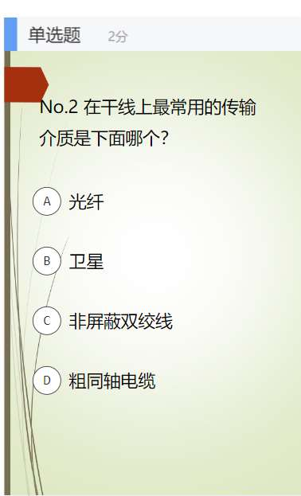

<!-- page: 28 -->

单选题
2分

单模光纤的纤芯内径是多大？

8~10um

A

50um

B

62.5um

C

125um

D

提交
28
2023/6/19

<!-- page: 29 -->

本节主要内容

传输介质

引导性传输介质

铜介质（粗缆、细缆、双绞线）

光纤

非引导性传输介质

电磁波谱

无线电

微波

红外、激光等

29
2023/6/19

<!-- page: 30 -->

无线传输介质P79

空气

电磁波谱

ISM

2023/6/19
30

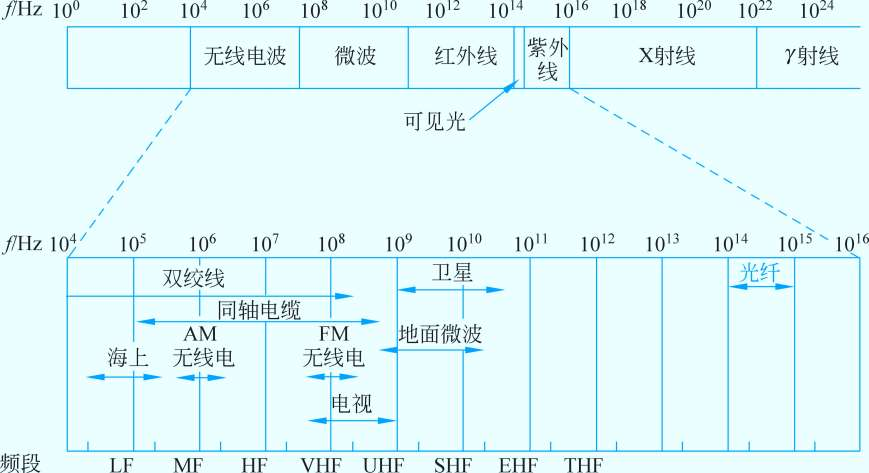

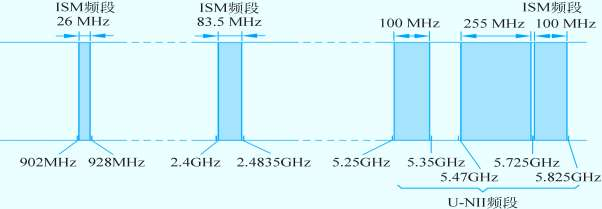

<!-- page: 31 -->

跳频扩频和直列扩频（P80：2.2.2-3）

调频扩频：

FHSS，Frequency Hopping Spread Spectrum , FHSS，是指用伪随机

码序列进行频移键控（FSK），使载波频率不断跳变而扩展频谱的一种方

法，它利用整个带宽（频谱）并将其分割为更小的子通道。发送方和接收

方在每个通道上工作一段时间，然后转移到另一个通道。

直列扩频：

DSSS：direct-sequence spread spectrum，DSSS，也是一种调制技术

，直接用具有高码率的扩频码序列在发送端去扩展信号的频谱。

2023/6/19
31

<!-- page: 32 -->

无线电传输

直线传播

遇到障碍物反弹

适用长距离传输：广播电视、雷达、导航、

2023/6/19
32

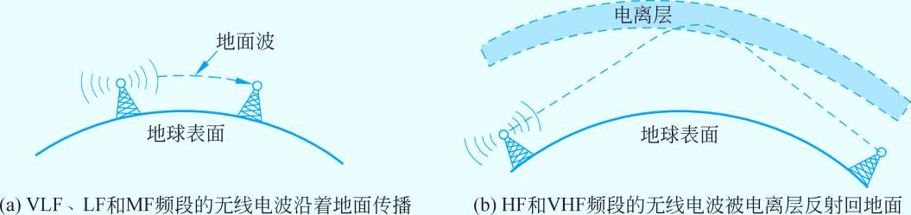

<!-- page: 33 -->

微波通信

定向、直线传输

地球是圆的，需要中继

中继站

卫星中继

多径衰落

波束发散，分散的子波束经过了不同的路径达到接收方，先后到达的信

信号可能应为不同项而互相抵消，造成信号的衰减。

甚高频

2023/6/19
33

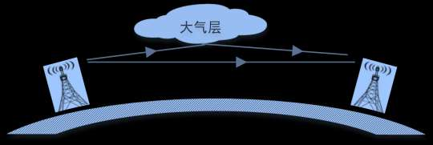

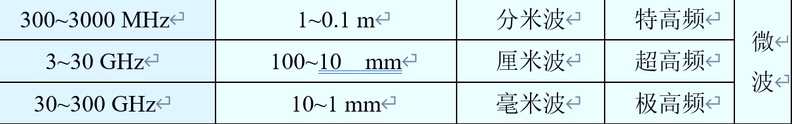

<!-- page: 34 -->

红外传输

定向直线传播、用于短距离传输

不能穿透固体物体

防窃听、安全性好

2023/6/19
34

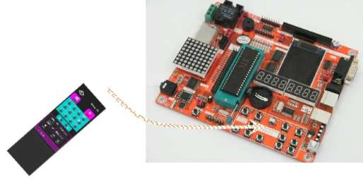

<!-- page: 35 -->

小结

铜线

同轴电缆：物理带宽大、抗干扰

双绞线：成本低、操作维护方便

电力线：部署极其便利

光纤：损耗小、数字带宽大、传输距离远、抗MRI/RFI干扰

单模、多模

无线传输介质

传输介质

无线电

局域主流：双绞线（UTP）

微波

干线主流：光纤

红外、激光等

35
2023/6/19

<!-- page: 36 -->

欣赏一下

2023/6/19
36

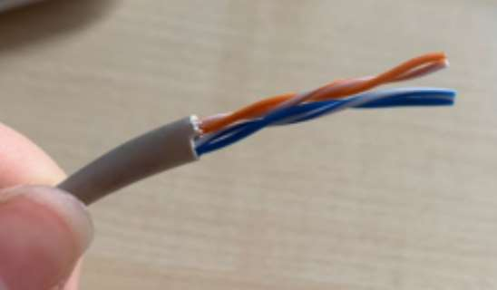

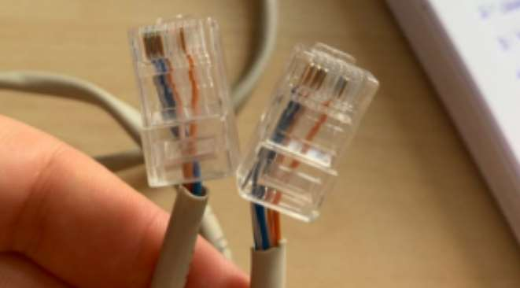

<!-- page: 37 -->

欣赏一下

2023/6/19
37

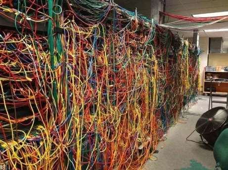

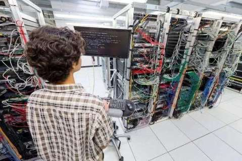

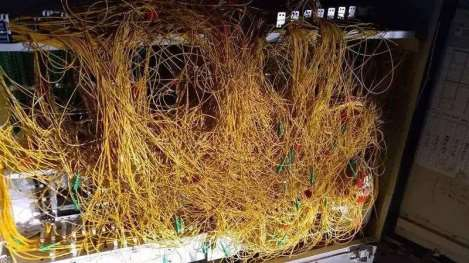

<!-- page: 38 -->

这才是布线的艺术

2023/6/19
38

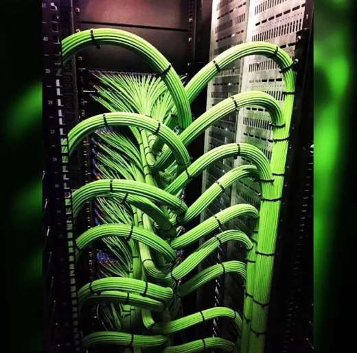

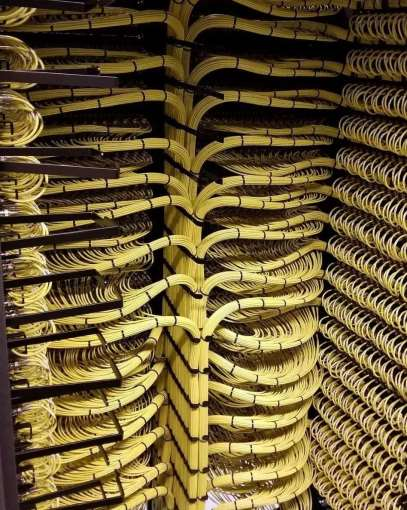

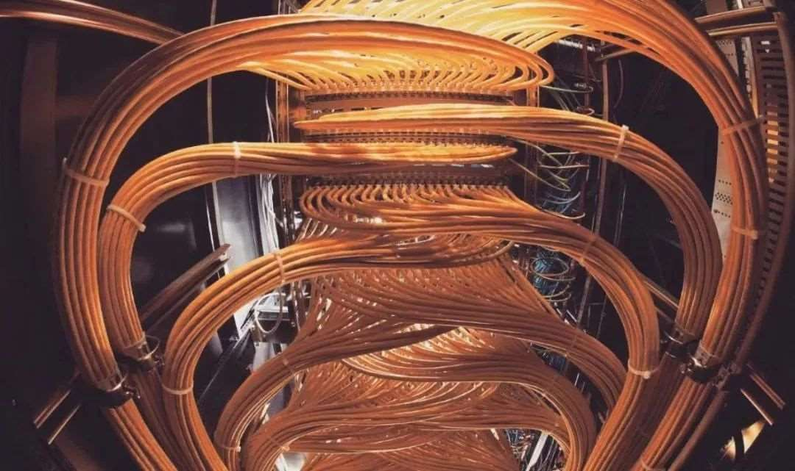

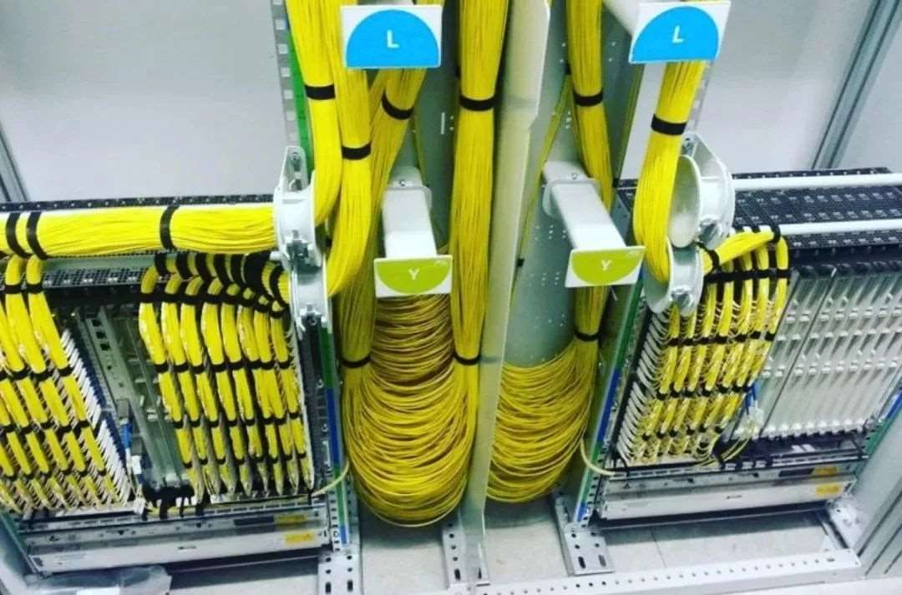

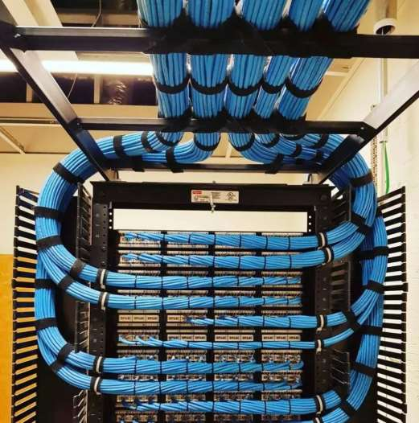

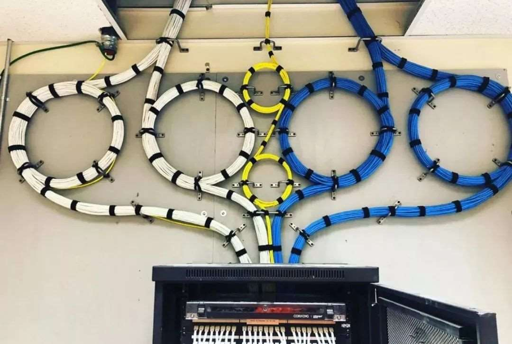

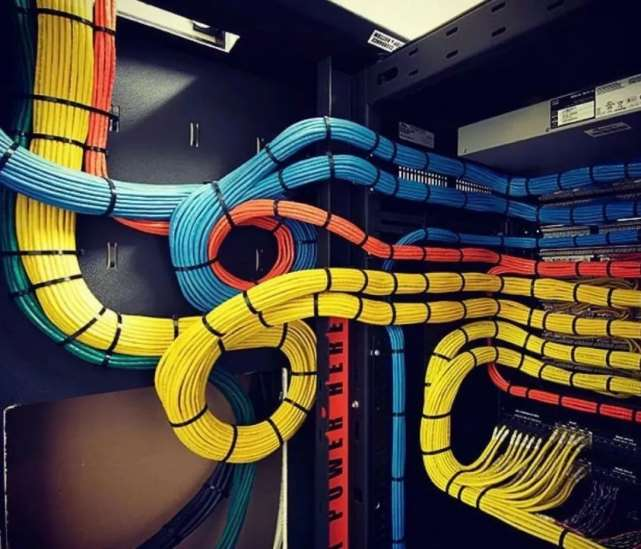

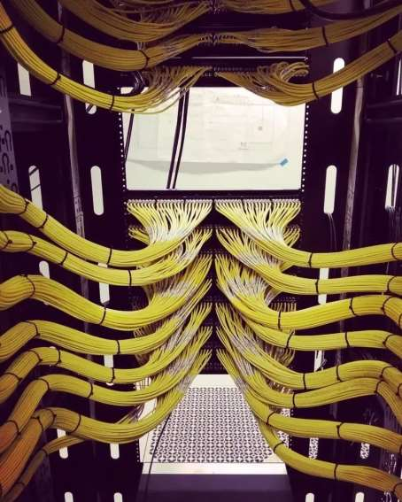

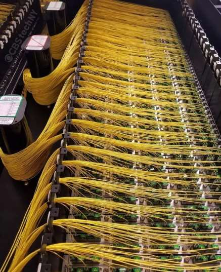

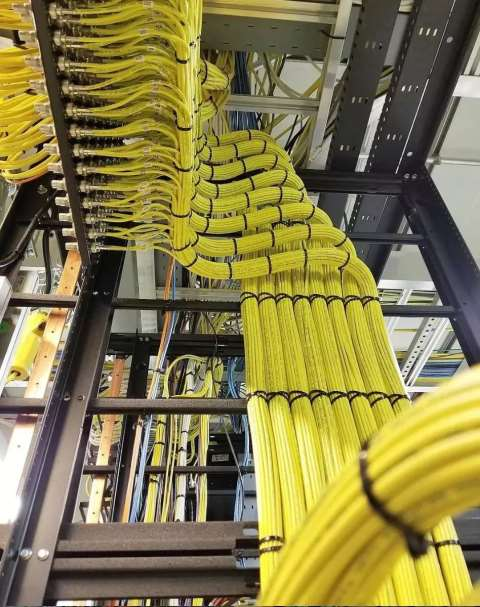

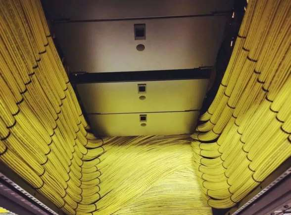

<!-- page: 39 -->

有问题吗？

39
2023/6/19

