# 20230331_第3章_数据链路层（1）_20230619170216

<!-- page: 1 -->

第3章 数据链路层(1)

袁华，hyuan@scut.edu.cn

华南理工大学计算机科学与工程学院

广东省计算机网络重点实验室

<!-- page: 2 -->

回顾第二章：物理层）（弹幕）

干线通常用什么线缆？

共享信道

干线使用复用技术，记得哪些？

DWDM的第一个D是什么意思？

OFDM需要保护带吗？

你知道哪些接入网络？

PSTN的接入方式有哪些？

蜂窝移动网络从4G开始使用MIMO技术，它是什么？

物理层设备（电中继器和集线器）为什么逐渐消失？

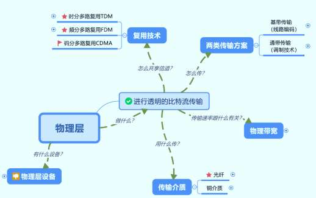

<!-- page: 3 -->

通信卫星网

中继，地面通信的补充；卫星骨干

地球同步卫星GEO

中轨道卫星MEO

GPS

低轨道卫星LEO

天通1号GEO终端

90分钟绕一圈

3

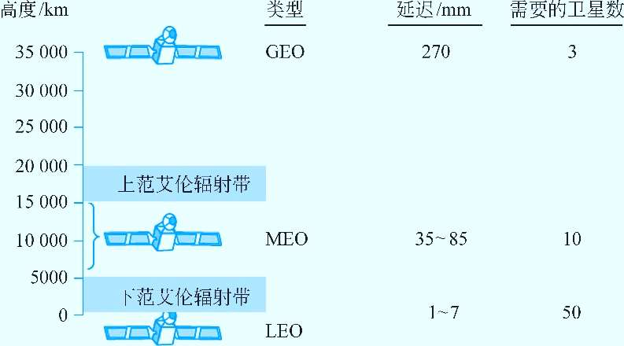

<!-- page: 4 -->

物理设备

无源部件

中继器（repeater）

再生信号：去噪、放大

集线器（hub）

一层的设备：傻瓜设备，增大了冲突域，降低网络性能

大 冲突域

4

<!-- page: 5 -->

全光中继器正当时

传统光纤中继：光→电→光

全光中继：掺铒放大器

1985年南安普顿大学的Daivd Payne教授

……

……

λ1 λ2
λ120
……

λ1 λ2
λ120
……

光放大器

5

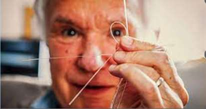

<!-- page: 6 -->

预习第5题完成情况

网工：57%

计科1：70%

2023/6/19
6

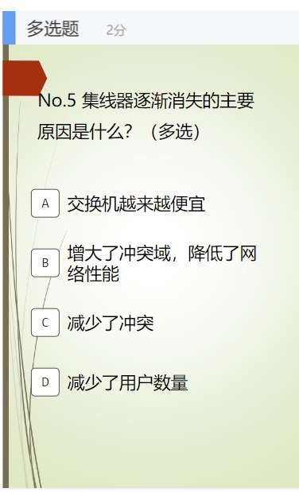

<!-- page: 7 -->

第三章预习情况

网工：75/77=97%

计科1：87/91=96%

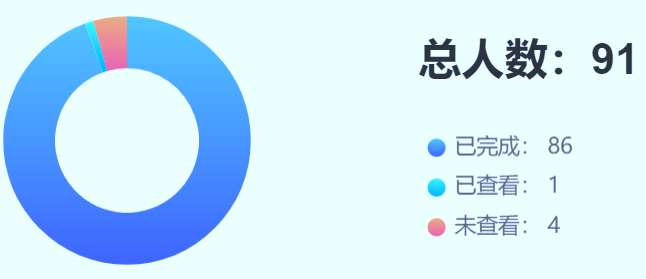

<!-- page: 8 -->

第1题：<71%

实现可靠的帧传输，为上层提供服务

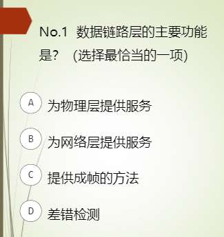

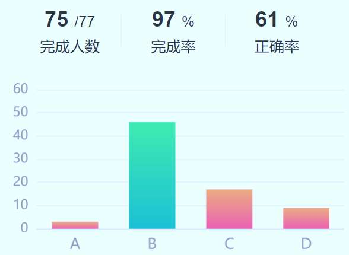

<!-- page: 9 -->

链路层通信模型P172

网卡（网络接口卡）

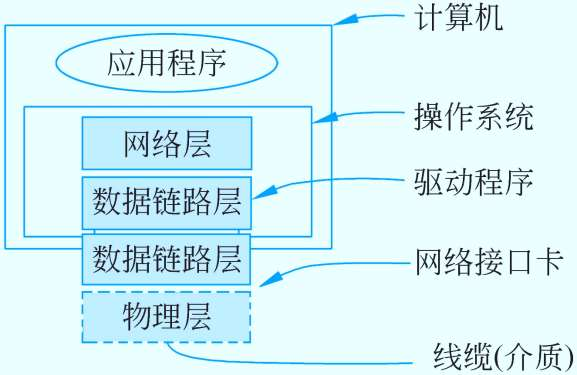

<!-- page: 10 -->

主要内容

成帧方法 (3.1.2)

错误处理(3.2)

纠错码

检错码

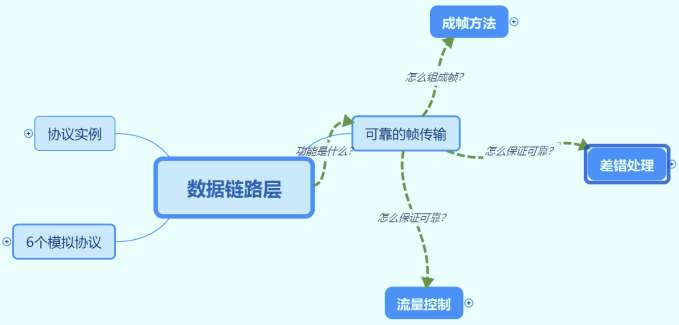

<!-- page: 11 -->

1.成帧方法

字节计数法（      。。。。      。。     。。。）

字节填充的标志字节法

比特填充的标志比特法（01111110）

别名：零比特填充法（5个1后面加1）

物理层编码违例法

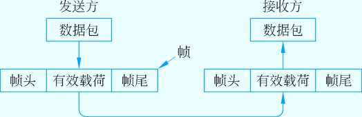

<!-- page: 12 -->

物理层编码违例法

关键是：选择的定界符不会在数据部分出现
4B/5B编码方案

−4比特数据映射成5比特编码，剩余的一半码字（16个码字）未使用，可

以用做帧定界符
−例如：00110组合不包含在4B/5B编码中，可做帧定界符
前导码

−存在很长的 前导码（preamble），可以用作定界符
−例如：传统以太网、802.11
曼切斯特编码 / 差分曼切斯特编码

−正常的信号在周期中间有跳变，持续的高电平（或低电平）为违例码，

可以用作定界符
−例如：802.5令牌环网

<!-- page: 13 -->

单选题
2分

（13年考研37题）HDLC协议对0111 1100 0111 1110 组帧后对应的

比特串为____（13年考研第37题）

01111100 01111101 0

A

01111100 01111101 01111110

B

01111100 00111110 10

C

01111100 01111110 01111101

D

提交

<!-- page: 14 -->

2.传输错 在所难免，怎么办？ P163-168-172

纠错码 ——前向纠错技术( FEC) P163-168

   因其需要太多的冗余位，纠错开销太大，在有线网络中极少使用，主

要用于无线网络(Why?)中。

种类P164：海明码、二进制卷积码、里德所罗门码、低密度奇偶校验码

检错码 (不能恢复，可重传)

仅仅判断是否出错，往往结合重传

种类P169：奇偶校验码、循环冗余码(CRC)、互联网校验和。

两种不同的处理方法适用于不同的环境

<!-- page: 15 -->

预习No.2

网工班

11110001
10110111

计科1班

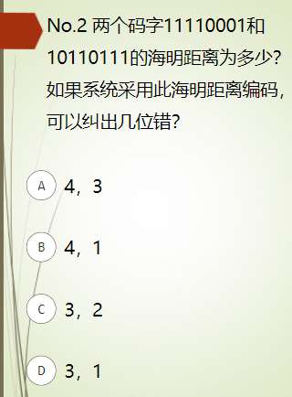

<!-- page: 16 -->

海明距离与检错和纠错的关系(P164)

合法码字1

合法码字1

d

d+1

2d+1

d+1

合法码字2

合法码字2

合法码字2n-1

合法码字2n-1

d+1

2d+1

合法码字2n

合法码字2n

合法码字：传输某个比特值的码字！

什么是编码系统的海明距离？

n位码字=m位数据位+r位冗余位

<!-- page: 17 -->

海明距离与检错和纠错的关系 ( P164)

海明距离为d+1的编码能检测出d位差错。

因为在距离为d+1的检验码中，只改变d位的值，

不可能产生另一个合法码。如奇偶校验码，海明

距离为2，能查出单个错。

 海明距离为2d+1的编码，能纠正d位差错。

因为此时，如果一个码字有d位发生差错，它仍

然跟原来的码字距离最近，可以直接恢复为该码。

<!-- page: 18 -->

纠错跟海明距离关系的一个例子

一个系统有4个合法码字：

0000000000, 0000011111, 1111100000 和1111111111

海明距离是 5=2*2+1，所以可纠正2位错误

例子

发送： 0000000000

发送： 0000011111

接收： 0000000111

接收： 0000000111

收方纠正后： 0000011111

收方纠正后: 0000011111

<!-- page: 19 -->

2.1 纠1位错的海明码之发送方

1950年提出，纠1位错的海明码，至今仍在使用

发送方：码字从左到右编号

m

数据位，直接填入3、5、6。。。。。

n

校验位：1、2、4、。。。。。r

r

根据校验集合奇/偶校验，填入0或1

Richard Hamming(理查德海明)

<!-- page: 20 -->

怎么知道要多少冗余位？P165

待传输的数据位数：m

冗余位：r

公式怎么来的？

总位数：n=m+r


+

n
m

2
2
)1
(

n

+
=

r
m
n




+
+

r

2
)1
(

r
m

<!-- page: 21 -->

码字构成：怎样记忆 对应的校验位（集合）？

B1
B2
B3
B4
B5
B6
B7
B8
B9 B10
B11

P1
P2 D1 P3 D2 D3 D4 P4 D5
D6
D7

1=20 √
√
√
√
√
√

2=21
√
√
√
√
√
√

4=22
√
√
√
√

8=23
√
√
√
√

<!-- page: 22 -->

单选题
2分

有一个系统采用纠1位错的海明码，偶校验。待传输的码字是：

1100001，问冗余位至少是几位？编码后的码字是什么？

4，10111001001

A

4，01101000001

B

4，10101001001

C

5，101110010001

D

提交

<!-- page: 23 -->

习题解析

根据公式：

将m=7代入，解得：r ≥ 4

B1
B2 B3 B4 B5 B6 B7 B8 B9
B10 B11

P1
P2 D1 P3 D2 D3 D4 P4 D5
D6
D7

信息码
-
-
1
-
1
0
0
-
0
0
1

检验位
？
？
-
？
-
-
-
？
-
-
-

海明码
？
？
1
？
1
0
0
？
0
0
1

<!-- page: 24 -->

参考答案

B1
B2
B3
B4
B5
B6
B7
B8
B9 B10 B11

P1
P2 D1 P3 D2 D3 D4 P4 D5
D6
D7

信息码
-
-
1
-
1
0
0
-
0
0
1

检验位
1
0
-
1
-
-
-
1
-
-
-

海明码
1
0
1
1
1
0
0
1
0
0
1

<!-- page: 25 -->

2.1 纠1位错的海明码之接收方

接收方

初始化计算器，逐位检查校验位（？），如不正确，就

将该检验位的编号加到差错计数器中。

counter=0，无差错

counter ≠0，出错，该值指明出错的位

<!-- page: 26 -->

单选题
2分

有一个系统采用纠1位错的海明码，数据位是8位；偶校验。接收方

收到的码字为：1 0 0 1 1 0 0 0 1 1 0 0 ，这个码字是对还是错？如果

是错的，是哪位出错？

正确

A

错；1

B

错；3

C

错；11

D

无法判断
E

提交

<!-- page: 27 -->

解析

将计数器置零，并检查每个校验位的校验集合是否正确：

  P1=B1⊕B3⊕B5⊕B7⊕B9⊕B11 =∑(1,0,1,0,1,0)=1

P2=B2⊕B3⊕B6⊕B7⊕B10⊕B11=∑(0,0,0,0,1,0)=1

P3=B4⊕B5⊕B6⊕B7 ⊕B12 =∑(1,1,0,0,0)=0

P4=B8⊕B9⊕B10⊕B11⊕B12 =∑(0,1,1,0,0)=0

所以，计数器Counter=1+2=3，数据位第三位出错，正确的应该是码字和原始码

字（数据位）分别是：1 0 1 1 1 0 0 0 1 1 0 0  和 11001100

<!-- page: 28 -->

主观题
5分

弹幕讨论

纠1位错的海明码中，假如只有一个校验位发生了错误，收方收

到这个码字，会做出什么样的判断？这个时候需要纠错吗？

正常使用主观题需2.0以上版本雨课堂

作答

<!-- page: 29 -->

利用海明码纠正突发错误P163

将连续的k个码字按行排列成矩阵

发送数据时，按列发送，每列k位

如果一个突发性错误长度是k位，则在k个码字中，至多只有一位

受到影响，正好可用海明码纠错改位后恢复

<!-- page: 30 -->

利用海明码纠正突发错误图示

m+r列

P1,P2,A1,P3,A2,A3,A4…… Am,Pr

P1,P2,B1,P3,B2,B3,B4…… Bm,Pr

P1,P2,C1,P3,A2,C3,C4…… Cm,Pr

K行

……

P1,P2,K1,P3,K2,K3,K4…… Km,Pr

<!-- page: 31 -->

注意

随着海明距离的增加，纠错的能力也增加；即海明距离越大，纠

错能力越强。

海明距离为3，可以纠正1个错误；而海明距离为5，可以纠正2

个错误。

当一个系统中的海明距离增加的时候，合法码字就减少了；即传

输效率降低

矛盾!
检错：d+1
纠错：2d+1

<!-- page: 32 -->

还有没有其它的纠错码？ P164

Binary convolutional codes （二进制卷积码）

NASA卷积码，使用纠正单个错，用于IEEE802.11

Reed-Solomon（里德所罗门码） P167

（544，514）RS码，用于高速以太网中，纠正15位错

https://zhuanlan.zhihu.com/p/103888948?utm_source=wechat_ses

sion

广为使用（255，233），有线电视、无线通信、光通信等

Low-Density Parity Check codes（低密度奇偶校验码）

广为使用，如IEEE802.11

<!-- page: 33 -->

课前热身弹幕

数据链路层（DLL）的主要功能是什么？

记得成帧（Framing）的4种方法吗？

海明距离是9的系统可以检测出几位错误？

海明距离是9的系统可以纠正出几位错误？

码字位数m为5和11时，纠正1位错所需要的冗余位分别是多少位？

纠1位错的海明码的关键是校验位设置，还记得每个校验位的集合吗？

除了海明码，你还知道哪些纠错码的名字？

如果要用纠1位错的海明码纠正突发错误，可以怎么做到？

<!-- page: 34 -->

2.2 检错码之循环冗余校验码

循环冗余校验码（P169-171）

注意：CRC的计

发送方

算采用模2运算

冗余位数等于生成多项式的阶数

，即没有借位

码字：移位后的码字减去余数

和进位，模2加

减类似异或。

接收方

收到的码字除以生成多项式，整除即无错

<!-- page: 35 -->

单选题
2分

如果生成多项式是G(x)= x3 + x2 + 1，待传送的原始码字是1111 ，

那么，采用CRC编码后的码字是多少？

1111 001

A

1111 011

B

1111 110

C

1111 111

D

提交

<!-- page: 36 -->

单选题
2分

如果生成多项式是G(x)= x3 + x2 + 1，收方收到的码字是：1100 100，

这个码字是对的还是错的？

对的

A

错的

B

无法判断

C

提交

<!-- page: 37 -->

生成多项式从哪里来的？

四个国际标准生成多项式

CRC-12 = x12+x11+x3+x2+x+1

CRC-16 = x16+x15+x2+1

CRC-CCITT = x16+x12+x5+1

CRC-32 = x32+x26+x23+x22+x16+x12+x11+x10+x8+x7+x5+x4+x2+x+1

上面有一个生成多项式被IEEE 802用在以太网中，猜猜是哪一个？

弹幕：冗余位r是多少位呢？

冗余位r生成多项式的阶数！

<!-- page: 38 -->

2.3 互联网校验和 P168

校验和基础是对消息中的数据位进行求和计算。校验和通

常放置在消息的末尾。

校验和的一个例子是16位的Internet校验和

发方：16位排列，补码求和（此时校验和按0计）

收方：同样运算，结果为1，表明无错（收到的校验和参与计算）

如：用在IPv4头部、TCP/UDP头部

<!-- page: 39 -->

一个简单的16位例子（用于TCP/IP头部 校验）

发送方：进行 16 位二进

接收方：进行 16 位二进制补

制补码求和运算，计算结

码求和运算（包含校验和），

果取反，随数据一同发送

结果非全1，则检测到错误

1 1 1 0 0 1 1 0 0 1 1 0 0 1 1 0
1 1 0 1 0 1 0 1 0 1 0 1 0 1 0 1

数据
1 1 1 0 0 1 1 0 0 1 1 0 0 1 1 0
1 1 0 1 0 1 0 1 0 1 0 1 0 1 0 1
1 0 1 0 0 0 1 0 0 0 1 0 0 0 0 1 1

数据

校验和

1  1 0 1 1 1 0 1 1 1 0 1 1 1 0 1 1

1  1 1 1 1 1 1 1 1 1 1 1 1 1 1 1 0

1 1 1 1 1 1 1 1 1 1 1 1 1 1 1 1

1 0 1 1 1 0 1 1 1 0 1 1 1 1 0 0
0 1 0 0 0 1 0 0 0 1 0 0 0 0 1 1
校验和

<!-- page: 40 -->

注意P170

相对于奇偶校验，互联网校验和可以检出它检不出的部分情

况。比如检出双个的位变化，也能检出位的增加和删除

Internet校验和，它有效而简单；但在某些情况下提供的保

护很弱。

它检测不出0数据的增加或删除

也检测不出消息中被调换的那部分

<!-- page: 41 -->

小结

数据链路层的主要功能：为网络层提供服务

成帧的方法

差错处理

纠错：纠1位错的海明码（r位的计算）

检错：CRC、互联网校验和

<!-- page: 42 -->

有问题吗？

