# 20230407_第3章_数据链路层（2）_20230619170232

<!-- page: 1 -->

第3章_数据链路层(2)

袁华，hyuan@scut.edu.cn

华南理工大学计算机科学与工程学院

广东省计算机网络重点实验室

<!-- page: 2 -->

六个模拟协议

单工协议

“乌托邦”协议

停、等（流量控制）

肯定确认重传

双工协议

滑动窗口

回退n帧

选择性重传

2

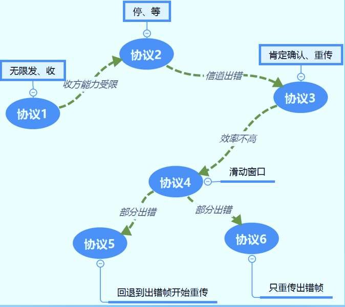

<!-- page: 3 -->

肯定确认重传P179

肯定确认重传

ARQ:automatic repeat request

PAR:positive acknowl

-edgement with retransmission

发方：发送帧的同时启动重传计时器

   收到肯定确认，拆除定时器，继续发送

如果计时器超期，引发重传

收方：肯定确认

3

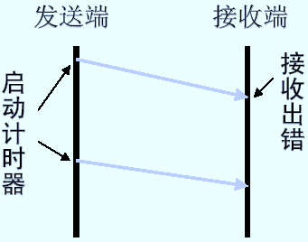

<!-- page: 4 -->

主观题
10分

弹幕讨论

问1：信道出错，引出肯定确认重传技术ARQ/PAR

肯定确认重传为什么需要一个重传定时器？

为什么需要一个序号来标识帧？

问2：发送、确认，再发送，数据传输的效率很低，怎么办？

全双工、捎带确认、批发数据

正常使用主观题需2.0以上版本雨课堂

作答

4

<!-- page: 5 -->

预习第4题：55% vs. 64%

5

<!-- page: 6 -->

引入滑动窗口：发送窗口、接收窗口以及怎么滑动

序
号
用
三
位
，
窗
口
为
一

初始时          发送了第一帧      接收了第一帧     收到第一个确认帧

6

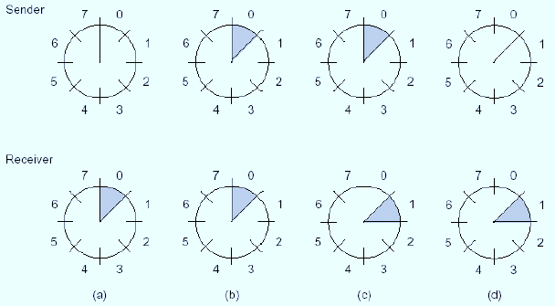

<!-- page: 7 -->

更普遍的滑动：W>1  P182

发送窗口：对应已发送还未被确认的帧（的序列号）。

滑动条件：收到的确认号指向窗口内的帧序号

ack ∈ SWnd

接收窗口：对应期望接收的帧（的序列号）。

滑动条件：收到的帧的序列号落在接收窗口内

seq∈RWnd

7

<!-- page: 8 -->

主要内容

采用了滑动窗口技术的信道的利用率

怎么理解和计算？

重要术语：带宽延迟积（信道的容量）

数据链路层协议实例：PPP

8

<!-- page: 9 -->

1 采用了窗口技术的信道的利用率

方法1：信道利用率=W*帧传输时间/(帧传输时间+R)

方法2：信道传输率=W*k/(k+B*R)

方法3：利用率<=W/(1+2BD)，(带宽延迟积：信道的容量)

区分（Transmission、Propagation）

传输时间：帧从主机发到信道上，跟带宽和信息量有关。

传播时间：从信道的一端传送到另一端，跟传输距离和传播速度相关

D：单边延迟/时间；R：来回延迟/时间

9

<!-- page: 10 -->

单选题
2分

一个信道带宽为 4 kb/s。采用停止等待协议。传播时延为20 ms。确认

帧长度和处理时间均可忽略。问帧长为多少才能使信道利用率达到至少

50％？

80b

A

160b

B

240b

C

320b

D

提交
10

<!-- page: 11 -->

使用方法1  （w=1，1帧包含k比特）



11

<!-- page: 12 -->

使用方法2

信道利用率=w*k/(k+bR)

代入得：50%=k/(k+4kbps*40ms)

解得：k=160b

12

<!-- page: 13 -->

使用方法3

2BD=160b

4kbps*40ms=160b

要使信道利用率为50%，则要满足50%=w/（2BD/k+1）

w=1，所以：k=2BD=160b

13

<!-- page: 14 -->

另一种解析方法

当发送一帧的时间等于信道的传播延迟的2倍时，信道利用率是

50%（Why?）即当发送一帧的时间等于来回路程的传播延迟时，

效率是50%，即

P186：停-等式协

20ms*2=40ms

议的w=1，如果延

40ms*4kbps=160b

迟传播甚至只有一

帧时间，协议效率

都将低于50％。

14

<!-- page: 15 -->

为了提高效率，增加窗口值W

发送窗口P182

对应于允许它发送的帧

滑动条件：收到确认（下边界，发出帧移动上边界）

接收窗口P182

对应于一组允许它接收的帧

滑动条件：收到盼望的帧（下边界，发出确认帧移动上边界）

15

<!-- page: 16 -->

2.协议5、6的基本原理

协议5：回退n帧（简称GBN）

收方丢弃出错帧及所有后续帧（其实就是接收窗口w=1）

发方缓存所有已经发出还未被确认的帧，超时，重传出错帧后的所有后续

的帧

协议6：选择性重传（简称SR）

收方丢弃出错帧，接收所有后续正确帧

发方只重传出错帧 （NAK加快重传）

16

<!-- page: 17 -->

协议5(GBN)正常工作的动画演示

17

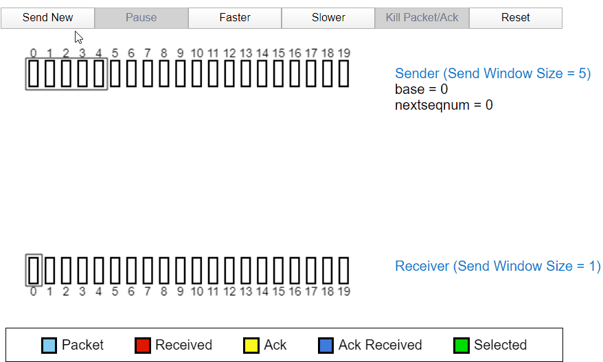

<!-- page: 18 -->

协议5(GBN)应对数据帧丢失的动画演示

注意：收方没

有收到期望的

2号帧时，确

认帧ack=1！

18

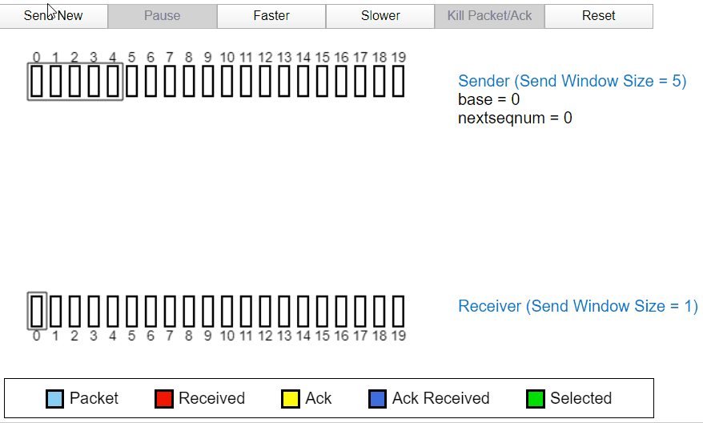

<!-- page: 19 -->

协议5(GBN)应对确认帧丢失的动画演示

注意：发方收

到后续确认

ack=4，累计

确认，并不重

发2号帧！

19

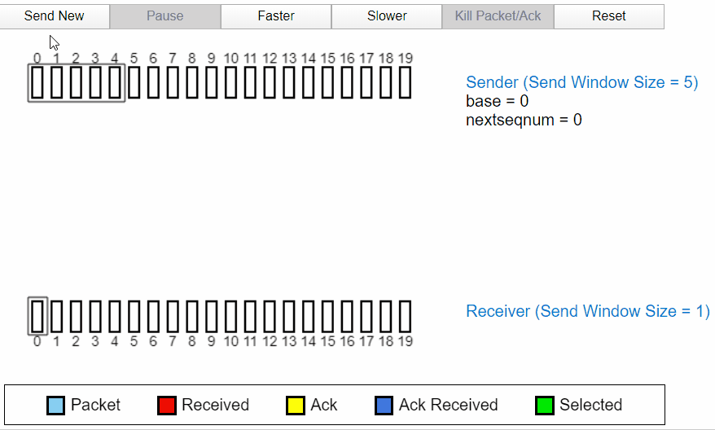

<!-- page: 20 -->

第5题：77% vs. 89%

20

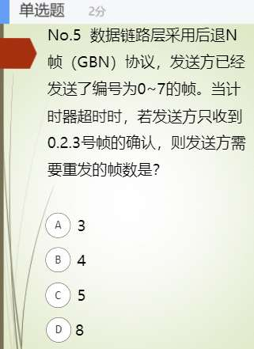

<!-- page: 21 -->

协议6（SR）的正常工作的动画演示

21

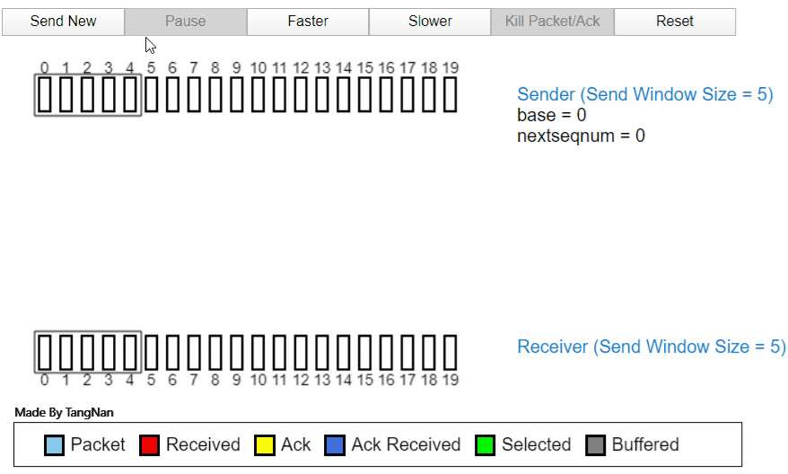

<!-- page: 22 -->

协议6（SR）应对数据帧丢失的动画演示

注意：GBN不

同，收方没有收

到2号帧，后续

确认照发！

发方只需超时重

发2号帧。NAK

可以加速重传！

22

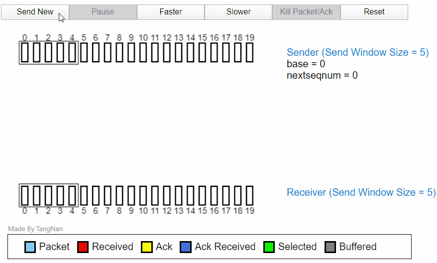

<!-- page: 23 -->

协议6（SR）应对确认帧丢失的动画演示

注意：ack2丢

失，导致的重传

，收方不需收此

帧，但须重发

ack2！

23

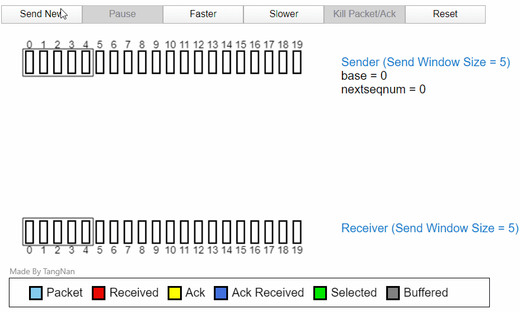

<!-- page: 24 -->

多选题
2分

在什么条件下，选择重传协议和回退n帧协议在效果上完全一致？（多选）

传输无错时

A

接收窗口跟发送窗口相等时

B

选择性重传的接收窗口为1时

C

上述都不可能

D

提交
24

<!-- page: 25 -->

单选题
2分

两台主机之间的数据链路层采用了回退n帧协议（GBN）传输数据，数

据传输速率为16kbps，单向传播延迟是270ms，数据帧长度为

128B~512B，接收方总是以数据帧等长的帧进行确认，为使得信道利

用率达到最高，帧序号的比特数至少为多少位？（2012考研真题）

2

A

3

B

4

C

5

D

提交

25

<!-- page: 26 -->

解析1：数学推导

26

<!-- page: 27 -->

解析2

根据教材的解释，使信道利用率最大的窗口数应该这样计算：

w=2BD+2

所以，当帧长为128B时，w=2*270ms*16kbps/（128B*8）

+2=10.4

当帧长为512B时，w=2*270ms*16kbps/（512B*8）+2=4.1

27

<!-- page: 28 -->

解析3

发送128B长度的帧，传输时间是128*8/16=64ms, 传输应答确

认帧的时间也是64ms，那么从发送一帧到接收到确认帧所需要的

总时间是64+270+64+270=668ms,，于是为使信道利用率最高，

=W*64/668=100%, so W=10.4. (W 是窗口数)

同样地，传输512B帧长帧时，W=4.1。

窗口数跟所需序列号有关，是为了区分不同的帧，W=10.4 需要

4bit来表达，而W=4.1 ，仅需3bit来表示。所以，答案应该是最

坏的情形4bit。

28

<!-- page: 29 -->

2分

单选题

主机甲和主机乙之间使用后退N帧协议（GBN）传输数据，甲的发送窗口

尺寸为1000，数据帧长为1000字节，信道为100Mbps，乙每收到一个

数据帧立即利用一个短帧（忽略其传输延迟）进行确认。若甲乙之间的单

向传播延迟是50ms，则甲可以达到的最大平均传输速率约为多少？

(2014考研真题)

10Mbps

A

20Mbps

B

80Mbps

C

100Mbps

D

提交

29

<!-- page: 30 -->

解析

方法1：设可达到的最大传输率为 x，于是

1000f*1000Bpf*8=xbps*2*50ms/1000ms

x=1000f*1000Bpf*8 / 2*50ms/1000ms

=80Mbps

方法2：w=1251，现在只有 1000，于是

X=100M*（1000/1251）=80M

30

<!-- page: 31 -->

滑动窗口长度w的选择

协议5（回退n帧）

MAX_SEQ = 7（ Seq=0～ MAX_SEQ ）

W = 7

发送窗口：W = MAX_SEQ

协议6（选择重传）

教材举例

MAX_SEQ =7（ Seq=0～ MAX_SEQ ）

W = 4

接收窗口：W= (MAX_SEQ + 1) / 2 ；发送窗口小于接收窗口

<!-- page: 32 -->

协议5：W = 8，异常情况P189

发送方有可能不立即确认接收帧，捎带
确认ack=n，意味着n-1, n-2也被确认。

Seq = 0
0
Seq = 1
1
Seq = 2
2
Seq = 3
3
Ack = 7
Seq = 4
4
0
Ack = 0
Seq = 5
5
1
Ack = 1
Seq = 6
6
2
Ack = 2
Seq = 7
7
3
Ack = 3
Seq = 0
8
4
Ack = 4
Seq = 1
9
5
Ack = 5
Seq = 2
10
6
Ack = 6
Seq = 3
11
7
Ack = 7
Seq = 4
12
Seq = 5
13
Seq = 6
14
Seq = 7
15

收到ack=7，本是帧7的确认，被判定
为帧15的确认，误认为第二窗口发送
成功，开始发送后续帧。
第二个窗口发送的数
据帧全部出错丢弃。

<!-- page: 33 -->

协议5：W = 7，异常情况

Seq = 0
0
Seq = 1
1
Seq = 2
2
Seq = 3
3
Ack = 7
Seq = 4
4
0
Ack = 0
Seq = 5
5
1
Ack = 1
Seq = 6
6
2
Ack = 2
Seq = 7
7
3
Ack = 3
Seq = 0
8
4
Ack = 4
Seq = 1
9
5
Ack = 5
Seq = 2
10
6
Ack = 6
Seq = 3
11
Seq = 4
12
Seq = 5
13
14

连续发送帧0~6

连续发送帧7~13

收到ack=6，从seq=7开始重传
第二窗口的数据帧，不会误认
为第二窗口发送成功。

第二个窗口发送的
数据帧全部重发。

<!-- page: 34 -->

协议6：W=7，初始缓冲区空

接收方缓冲区

0
1
2
3
4
5
6

接收方
发送方 0
1
2
3
4
5
6
7
8
9
10 11
12 13 14 15 16 17 18 19

发送方缓冲区

0
1
2
3
4
5
6

<!-- page: 35 -->

协议6：帧0~6发送成功、正确接收

接收方缓冲区

7
0
1
2
3
4
5

帧0~6上交网络层，回送
确认，接收窗口滑动。

接收方
0
1
2
3
4
5
6
发送方 0
1
2
3
4
5
6

帧0~6的确认丢失！
发送方缓冲区

0
D0
1
D1
2
D2
3
D3
4
D4
5
D6
6
D6

发送帧0~6等待确认。

<!-- page: 36 -->

协议6：帧0超时重传并被正确接收

接收方缓冲区

7
0
D0
1
2
3
4
5

重传帧0正确到达，seq=0在可接收范围，
被接收在缓冲区内，回送ack=6。

接收方
0
1
2
3
4
5
6
0
发送方 0
1
2
3
4
5
6
0

发送方缓冲区

0
D0
1
D1
2
D2
3
D3
4
D4
5
D6
6
D6

帧0超时，被重传。

<!-- page: 37 -->

协议6：帧0被重复提交

接收方缓冲区

7
D7
0
D0
1
2
3
4
5

第7帧正确提交，重传帧0被认为是正确帧
提交，出现重复提交错误。

接收方
0
1
2
3
4
5
6
0
7
8
9
10 11
12 13
发送方 0
1
2
3
4
5
6
0
7
8
9
10 11
12 13

发送方缓冲区

7
D7
0
D8
1
D9
2
D10
3
D11
4
D12
5
D13

<!-- page: 38 -->

解决办法：保证新老窗口不重叠

P188

MAX_SEQ=7

W = 7
W = 4

新老窗口重叠
新老窗口不重叠

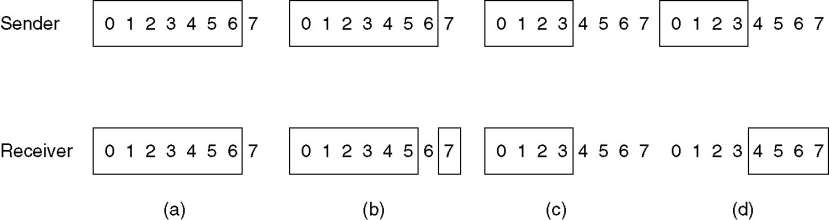

<!-- page: 39 -->

协议6：W=(MAX_SEQ+1)/2

帧0～3的重传帧落在接
收窗口外，被拒绝，不会
出现重复提交错误。

接收方缓冲区

4
5
6
7

帧0~3上交网络层，回送
确认，接收窗口滑动。

接收方
0
1
2
3
发送方 0
1
2
3

帧0~3的确认丢失！

发送方缓冲区

0
D0
1
D1
2
D2
3
D3

发送帧0~3等待确认。

<!-- page: 40 -->

3个协议的窗口大小

One-Bit sliding window（协议4):


0 < size of Sending window<=1

size of receiving window=1
Go-back-N (GBN，协议5)：

    0 <size of Sending window<=MAX_SEQ

size of receiving window=1
Selective Repeat (SR，协议6)：

    0 < size of Sending window<= (MAX_SEQ+1)/2

size of receiving window= (MAX_SEQ+1)/2

40

<!-- page: 41 -->

六个协议引入的技术小结

肯定确认重传（PAR/ARQ）

捎带确认（前提：全双工）

累计确认（GBN中使用）

否定确认（NAK）

管道技术

滑动窗口技术

41

<!-- page: 42 -->

前情回顾（弹幕）

ARQ/PAR对应的中文术语叫什么？

弹幕：其中涉及到哪些关键词？

要提高停、等协议的效率，可以怎么做？

信道的利用率是否可以提高到100%？

滑动窗口技术

发送窗口的概念和滑动的条件

接收窗口的概念和滑动的条件

还记得回退n帧中有哪些关键点？

还记得选择性重传有哪些关键点？
42

<!-- page: 43 -->

补充：PPP  （P194，3.5节）

Point to Point Protocol，点到点协议。由SLIP发展而来。

大多数广域网的基础设施以点到点链接为基础的。

43

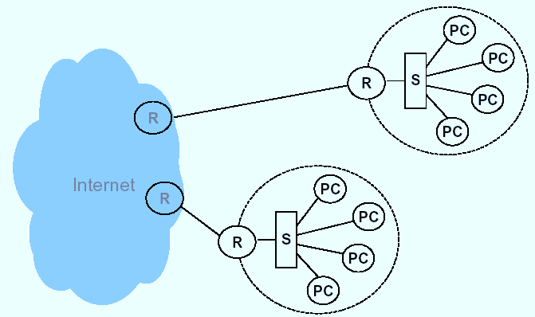

<!-- page: 44 -->

面向位的数据链路协议

早期典型协议：HDLC (High-level Data Link Control)

最早由IBM SNA提出SDLC（synchronous data link control）

ISO根据SDLC，提出了HDLC（high level data link control）

特性：

面向比特、同步传输（bit-synchronous）

工作原理：数据帧的可靠传输

面向连接（建立/释放逻辑连接）

流控制（滑动窗口seq/ack ）

差错控制（go back n / select repeat）

44

<!-- page: 45 -->

SONET帧上的数据包P195

使用PPP

45

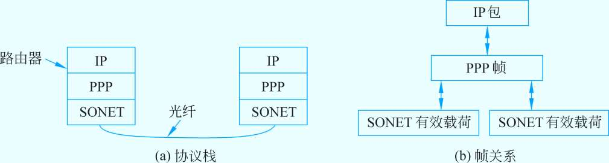

<!-- page: 46 -->

点到点协议PPPP190

PPP 是一种在链路上传输分组的常用方法

采用字节填充的标记字节法 (0x7E)

“无序号幁” (无确认无连接) 用于承载IP分组

采用校验和检错

46

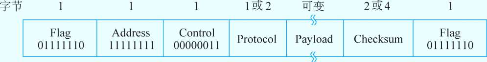

<!-- page: 47 -->

点到点协议PPPP195

IP
IPX
其他

最初在 RFC 1661 定义

网络层

PPP有3个主要特征:  P195

网络控制协议NCP

一种成帧的方法

PPP

一个链路控制协议

数据链路层

链路控制协议LCP

LCP (Link Control Protocol).

一种协商网络层选项的方式

 NCP (Network Control Protocol)

同步、异步传输

物理层

47

<!-- page: 48 -->

PPP LCP 配置选择

特点
工作描述
Protocol

认证
PAP
CHAP
需要一个password
执行询问握手

Stacker or
Predictor

压缩
在源端压缩数据;

在目的端再生数据

Quality
Magic Number

错误检测
监视链路上丢失的数据
避免 frame looping

多链路
在多链路间进行负载均衡
Multilink
Protocol (MP)

<!-- page: 49 -->

PPP 认证概述

Dialup or
Circuit-Switched

Network

PPP 会话建立

1
链路建立阶段

2
可选的认证阶段 Authentication

3
网络层协议阶段

PPP两种认证协议：PAP and CHAP

<!-- page: 50 -->

选择一种 PPP 认证协议-PAP

PAP
2-Way Handshake

Remote Router

Central-Site Router

(SantaCruz)

(HQ)

“santacruz, boardwalk”

Accept/Reject

username santacruz
password boardwalk

Hostname: santacruz
Password: boardwalk

Passwords 以明文的形式传送

远端节点控制重试频率和次数

<!-- page: 51 -->

选择一种 PPP 认证协议-CHAP

CHAP
3-Way Handshake

Remote Router

Central-Site Router

(SantaCruz)

(HQ)

Challenge

Response

Accept/Reject

username santacruz
password boardwalk

Hostname: santacruz
Password: boardwalk

使用 “secret” ，只有认证者和远端节点知道

<!-- page: 52 -->

PAP的特点

PAP是一种简单的明文验证方式。

NAS（Network Access Server）要求用户提供用户

名和口令，

这种验证方式的安全性较差，第三方可以很容易获取

被传送的用户名和口令。

所以，一旦用户密码被第三方窃取，PAP无法提供避

免受到第三方攻击的保障措施。

<!-- page: 53 -->

CHAP的特点

CHAP是一种加密的验证方式，能够避免建立连接时传送用户的真实密码

NAS向远程用户发送一个挑战口令（challenge），其中包括会话ID和一个任意生

成的挑战字串（arbitrary challengestring）。远程客户必须使用MD5单向哈希算

法返回用户名和加密的挑战口令。

因为服务器端存有客户的明文口令，所以服务器可以重复客户端进行的操作，并将

结果与用户返回的口令进行对照。

CHAP为每一次验证任意生成一个挑战字串来防止受到再现攻击。

在整个连接过程中，CHAP将不定时的向客户端重复发送挑战口令，从而避免第3

方冒充远程客户（remote client impersonation）进行攻击。

<!-- page: 54 -->

点到点协议PPP的功能

PPP是Internet标准

（RFC1661 1662 1663）

处理错误监测

支持多种协议（IP、IPX、DECnet等）

 连接时允许协商IP地址

 允许身份认证

54

<!-- page: 55 -->

PPP的帧格式 P191

PPP的帧格式类似于HDLC，但是面向字符的协议（以字节为单位）

55

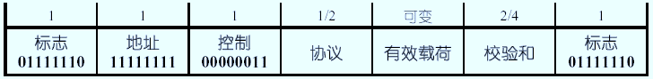

<!-- page: 56 -->

PPP Frame Format(cont’d)

总是以一个特殊的字符开始01111110 (跟HDLC相同)P195

在同步链路中，该过程是通过一种称作比特填充（bitstuffing）的硬件技

术来完成的

异步链路时：若封装在PPP帧中的数据出现0x7E字节，则用2字节序列

0x7D、0x5E取代；若出现0x7D字节，则用2字节序列0x7D、0x5D取代；

56

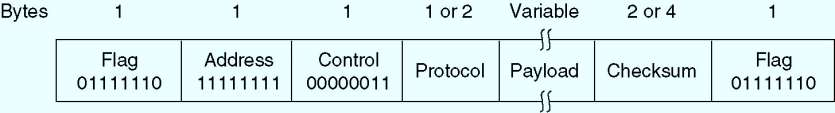

<!-- page: 57 -->

P195的填充注释

如果待传输的数据是0x7E（01111110）

发方：先使用0x7D填充；再将0x7E XOR 0x20=0x5E；即0x7D、0x5E

取代0x7E

收方：扫描到0x7D，删掉它；再将其后的一个字节与0x20异或，即

0x5E XOR 0x20=0x7E，恢复出待传输的数据。

发方
收方

7E
20
5E

5E

7E

57

<!-- page: 58 -->

双方协商认同

PPP的帧格式(续)

后，可省略

地址域：固定为11111111 ，可省略

控制域：缺省为00000011，即无序号帧（即毋需确

认），可省略

协议域：不同的协议不同的代码 P191

载荷域：可变长，缺省1500字节

校验和：缺省为2字节，也可定义为4字节

58

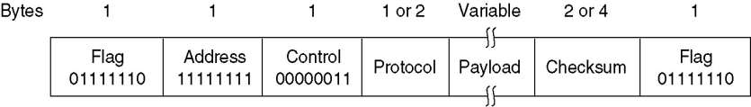

<!-- page: 59 -->

单选题
2分

一个收到的PPP的帧数据是：7D 5E FE 27 7D 5D 7D 5D 65 7D 5E

5E FE 27 5D 7D 65 5E

A

7E FE 27 7D 7D 65 7E

B

7E FE 27 7D 7D 65 5E

C

7E FE 27 5D 5D 65 5E

D

提交
59

<!-- page: 60 -->

PPP的链路控制协议 LCP

LCP （Link Control Protocol）提供了建立、配置、维护和终止

点对点链接的方法

LCP的过程按以下四个阶段进行：

 链路的建立和配置协调

 链路质量检测

 网络层协议配置阶段

 关闭链路

60

<!-- page: 61 -->

PPP的工作过程

发送端PPP首先发送LCP帧，以配置和测试数据链路

在LCP建立好数据链路并协调好所选设备之后，发送端PPP发送

NCP帧，以选择和配置一个或多个网络协议

当所选的网络层协议配置好后，便可将各网络层协议的分组发

送到数据链路上

配置好的链路将一直保持通信状态，直到LCP帧或NCP帧明确

提示关闭链路，或有其它的外部事件发生（如用户干预等）

61

<!-- page: 62 -->

一次使用PPP协议的过程

1.初始状态

2.建立连接：建立成功到3)，否则到1)

3.选项协商：协商成功到4)，否则到7)

4.身份认证：认证成功到5)，否则到7)

5.配置网络：网络配置完后到6)

6.数据传输：数据传输完后到7)

7.释放链路：回到1)

62

<!-- page: 63 -->

PPP工作状态图P203

63

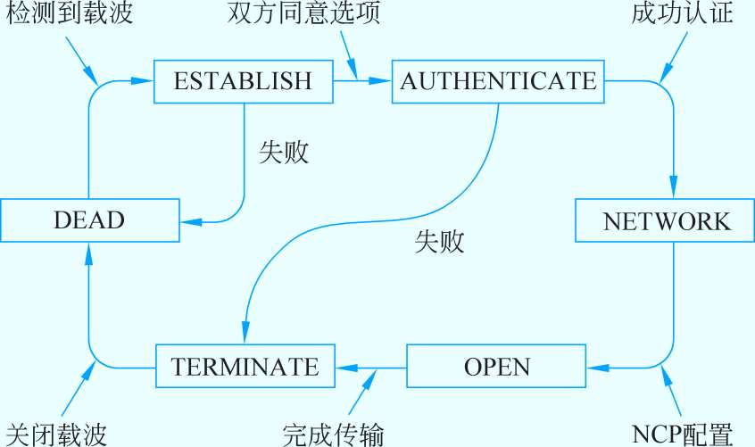

<!-- page: 64 -->

ADSLP192

广泛用于通过本地回路宽带接入

ADSL 在 modem (客户) 到 DSLAM (ISP)间

IP 分组通过 PPP 和 AAL5/ATM 承载

64

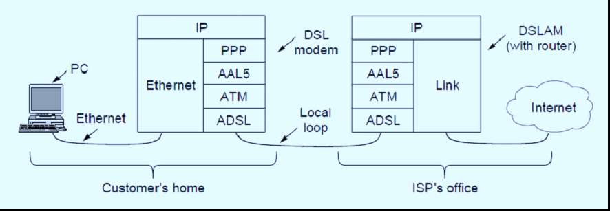

<!-- page: 65 -->

PPPoA

PPP 数据通过 ATM 信元封装:

ATM 使用短且定长的信元 cells (53 字节); 每个信元有虚连接标号

AAL5 是通过ATM传输分组的格式

PPP 帧转化为 AAL5幁 (PPPoA)

65

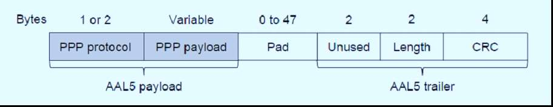

<!-- page: 66 -->

PPPoE使用方式1

设备之间建立 PPP 会话，所有

主机通过同一个 PPP 会话传送

数据，主机上不用安装 PPPoE

客户端拨号软件，一般是一个机

构共用一个账号

PPPoE Client 位于机构内

PPPoE Server 是运营商的设备

66
3.5 数据链路协议实例

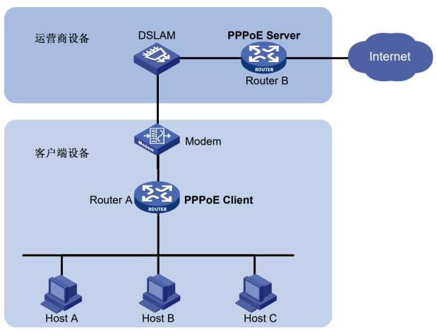

<!-- page: 67 -->

PPPoE使用方式2

PPP 会话建立在 主机和运营商的路

由器之间，为每一个主机建立一个

PPP 会话，每个主机都是 PPPoE

Client，每个主机有一个帐号，方便

运营商对用户进行计费和控制

主机上需要安装PPPoE 客户端软件

67
3.5 数据链路协议实例

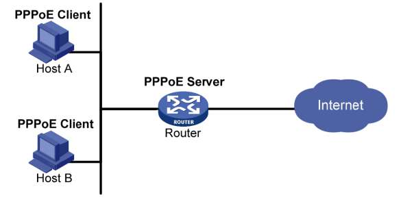

<!-- page: 68 -->

关于链路层实例协议的小结

实例协议PPP、DOCSIS  （P194）

PPP的主要内容

了解使用场景：点到点

了解使用方式：over SONET、ADSL、DOCSIS

掌握帧格式

了解PPP的工作状态图 （P197）

68

<!-- page: 69 -->

谢 谢！

69

