# 20230505&06_第4章_介质访问控制子层（2）_20230619170254

<!-- page: 1 -->

第四章 介质访问控制子层（2）

袁华，hyuan@scut.edu.cn

华南理工大学计算机科学与工程学院

广东省计算机网络重点实验室

<!-- page: 2 -->

主要内容

以太网的前世今生

以太网的技术特征

IEEE802.2

LLC子层

物理结构

数据链路层

以
太
网

链路层帧

MAC子层

IEEE802.11

IEEE802.5

IEEE802.4

IEEE802.3

FDDI

编码方式、访问控制方式等

物理层

二层交换基本原理

二层交换设备：交换机

为什么叫以太网？

<!-- page: 3 -->

以太网的前世今生

Metcalfe和David Boggs发表了

Bob Metcalfe设计的在同轴

Metcalfe离开施乐公司，创办

题为《以太网：本地计算机网络

3Com。

电缆上实现3Mbps以太网连接

的分布式包交换方式》的论文

方案的备忘录

3

4.3 以太网
https://www.slideshare.net/citizenearth/bridge-to-tera-bit-ethernet
图片来源

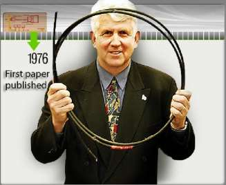

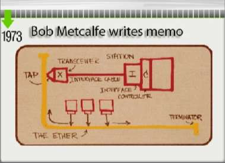

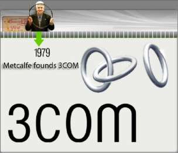

<!-- page: 4 -->

以太网的前世今生

September 30, 1980 ，
"The Ethernet, A Local
Area Network. Data Link
Layer and Physical Layer

Specifications"

IEEE发表了10Base5以太网

IEEE成为以太网的官方标准

1980，Metcalfe说服Digital

标准，也称粗以太网

化组织。开放的标准帮助以

Equipment (DEC), Intel, and

太网成了占绝对支配地位的

Xerox 一起颁布DIX以太网标准

LAN技术

4

4.3 以太网
https://www.slideshare.net/citizenearth/bridge-to-tera-bit-ethernet
图片来源

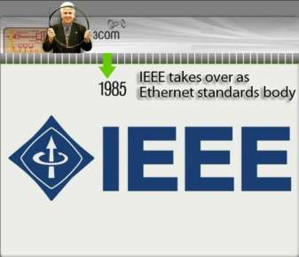

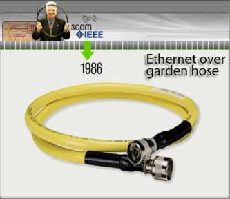

<!-- page: 5 -->

以太网的前世今生

Kalpana推出了第一台以太网

IEEE批准了Cat-5双绞线

IEEE批准10BaseF标准，

交换机，最终取代了网桥和

10Base-T以太网，很快成为

即数据中心所用的光纤以

集线器

LAN部署的标准配置

太网标准

5

https://www.slideshare.net/citizenearth/bridge-to-tera-bit-ethernet
图片来源
4.3 以太网

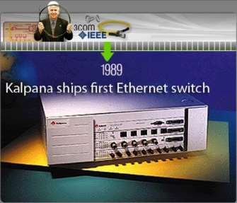

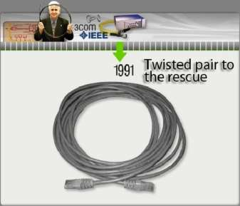

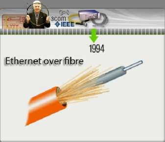

<!-- page: 6 -->

以太网的前世今生

IEEE批准了100Mbps以太网

千兆以太网标准1000Base-T

2001年，万兆以太网的标准

标准。后被称为快速以太网

获得通过

前产品开始问世，正式标准

（Fast Ethernet）

在2002年获得通过

6

4.3 以太网
https://www.slideshare.net/citizenearth/bridge-to-tera-bit-ethernet
图片来源

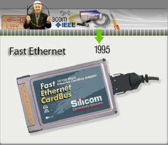

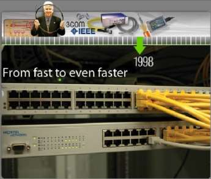

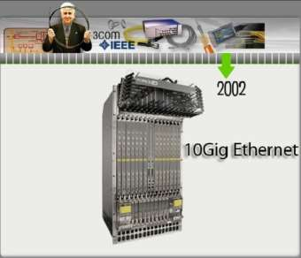

<!-- page: 7 -->

以太网的前世今生

40G/100G 以太网标准在2010

年中制定完成，当前使用附加标

准IEEE 802.3ba用以说明

2014年，成立200 Gb/s和400

Gb/s以太网标准工作组IEEE

P802.3bs

7

4.3 以太网
https://ethernetalliance.org/technology/2020-roadmap/
图片来源

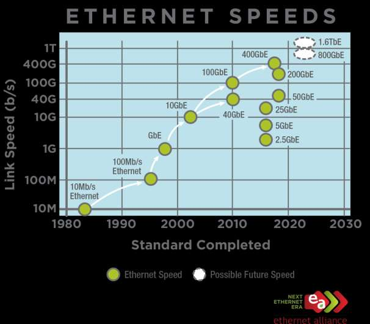

<!-- page: 8 -->

以太网的物理层变化

总线 （放大器）

星型（集线器）

经典以太网：共享式

8

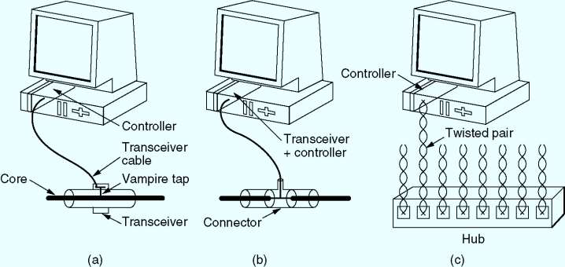

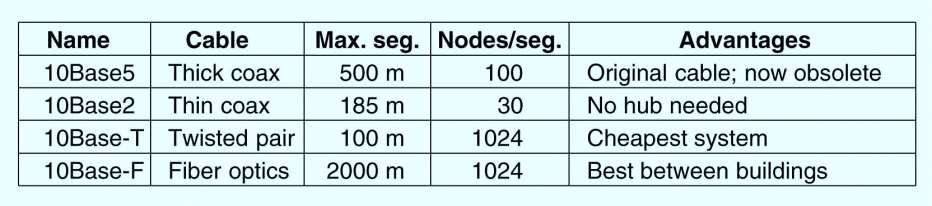

<!-- page: 9 -->

预习题No.3

正确率77%、80%

物理拓扑：星型/扩展星型

逻辑拓扑：总线拓扑

Internet

Router
Router

Switch
Switch

PC4

PC1

PC5

PC3

PC2

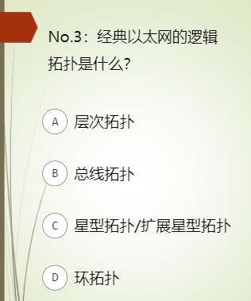

<!-- page: 10 -->

单选题
2分

一个经典Ethernet局域网中有A、B、C、D 4台主机，如果A给B发信息，

下面哪个说法是正确的？

只有B收到信息

A

B、C、D 3台主机收到信息

B

4台主机都收到信息

C

4台主机都收不到信息

D

提交

<!-- page: 11 -->

IEEE 802.3和以太网帧的比较P224

不同

前导码（8B）

帧起始分界符/帧首

定界符（SOF）（1B）

类型/长度（弹幕：

可能有什么问题？）

怎么判定是哪种帧？

1536（0x600）

11
帧开始定界
符（SOF）

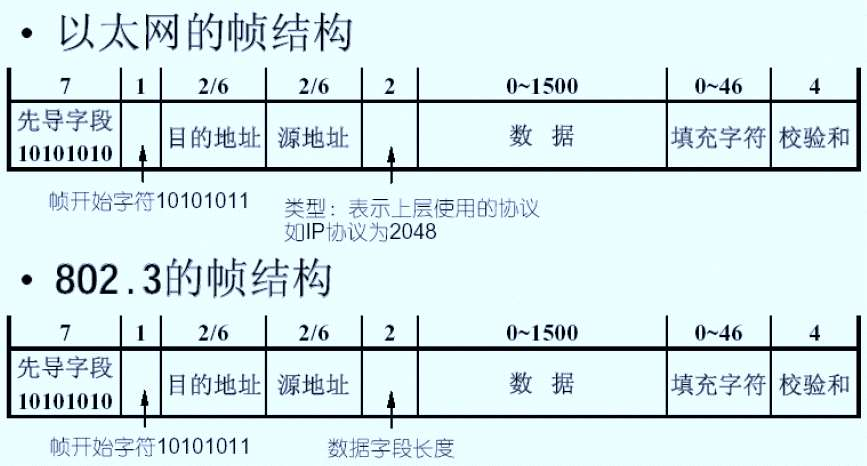

<!-- page: 12 -->

单选题
2分

以太网帧的哪一部分通知接收方准备接收新帧?

帧首定界符

A

前导码

B

数据字段

C

校验序列

D

提交

<!-- page: 13 -->

为什么有效帧长度 64 Byte? P226

CSMA/CD的要求（边发边听）

最短帧的发送时间  争用时隙2

以太网（802.3）规定，在10Mbps局域网中

时隙：2=  51.2 微秒   （最远2500米，4个集线器）

最短帧长度：10Mbps× 2/8 = 64 Byte

或者：（51200/100ns）/8=64Byte

13

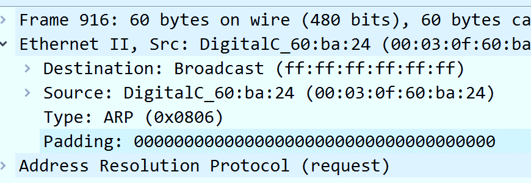

<!-- page: 14 -->

速率提高带来的冲突检测问题

10M以太网的要求

时隙宽度：2= 最短帧长度 / 信道传输速率（10M）

最短帧长度：64Byte（512bit）

最大传输距离：2500米（802.3规范）

1000M以太网面临的问题（半双工才有P227）

若保持最短帧长64字节，则意味最大传输距离缩短到25米

14

<!-- page: 15 -->

解决办法 P233

载波扩充（carrier extension）

方法：在发送方硬件加入/接收方硬件删除，将帧长扩展到

512Byte(8倍)
目的

保证网络半径为合理长度（200米=25*8）
保证兼容10M/100M的最短帧64字节特性
缺点：线路利用率低下
帧串/帧突发（frame bursting）

方法：连续发送多个帧，只有当帧串小于512Byte时填充
目的：提高信道利用率

15

<!-- page: 16 -->

单选题
2分

已知Ethernet局域网的总线电缆长为1000米，数据传输速率是

100Mbps，电磁波信号在电缆中的传播速度是200米每微秒，

试计算该局域网允许的帧的最小长度是多少？

500b

A

800b

B

1000b

C

1600

D

提交

<!-- page: 17 -->

采用CSMA/CD的站冲突后，随机等待的时间P226

Retry Random Time Range

Retry Random Time Range

1
21-1 = 0,1 x 51.2sec

9
29-1 = 0...511 x 51.2 sec

2
22-1 = 0,1,2,3 x 51.2 sec

10
210-1 = 0....1023 x 51.2 sec

3
23-1 = 0....7 x 51.2 sec

11
211-1 = 0....1023 x 51.2 sec

4
24-1 = 0....15 x 51.2 sec

12
212-1 = 0....1023 x 51.2 sec

5
25-1 = 0....31 x 51.2 sec

13
213-1 = 0....1023 x 51.2 sec

6
26-1 = 0....63 x 51.2 sec

14
214-1 = 0....1023 x 51.2 sec

7
27 -1= 0....127 x 51.2 sec

15
215-1 = 0....1023 x 51.2 sec

8
28 -1= 0...255 x 51.2 sec

16
216-1 = 0....1023 x 51.2 sec

17

<!-- page: 18 -->

注意

i次冲突后时间片为：

0 < i ≦10 时，取( 0～2i－1) ×2τ

10 < i < 16 时，取（0~1023） ×2τ

i > 16 时，放弃发送

以太网最多重传15次

18

<!-- page: 19 -->

弹幕讨论

二进制指数回退算法用来做什么？

如果没有了CSMA/CD，是不是没有二进制指数回退算法了？

<!-- page: 20 -->

帧的最大长度是多少呢？

1500字节？（Maximum Transmission Unit）

《TCP /IP Protocol Suite》定义MTU：数据链路层的帧格式中，数据字

段的最大尺寸。

MTU

1518字节？

帧头
数据字段
帧尾

1522字节？

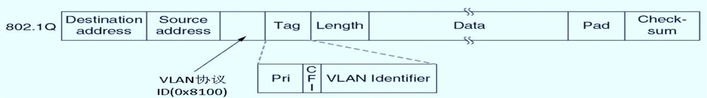

<!-- page: 21 -->

为什么最大帧长1500字节？

最长帧长：1500字节（不含帧头帧尾，MTU）

含帧头帧尾：1518字节

含VlanID：1522字节（802.1Q）

含前导码：1526字节

P225：并不是技术的内在要求，一定的随意性，内存价格高

（RAM，1970s）

情况已经发生了巨变：成本、带宽

实验：9000字节（jumbo）

<!-- page: 22 -->

帧中的两个地址字段P224，注意1

硬件地址又称为物理地址，或 MAC 地址，48位/6字节

工作站的源地址有个有趣的特性，那就是它的全球唯一性

（globally unique）, 由IEEE分配，保证世界上没有两个工作

站具有的MAC地址是相同的（只能是单播地址）

当一台计算机启动时，MAC地址从ROM拷贝到RAM

单播（unicast）：
5C-26-0A-7E-4E-4C

什么叫随机MAC地址？

广播（broadcast）：FF-FF-FF-FF-FF-FF

组播（multicast）： 01-00-5E-00-00-00

22

<!-- page: 23 -->

注意2

所有的工作站都收到数据帧（广播信道，共享信道）

目的：收到并接收

其它：收到不理睬

23

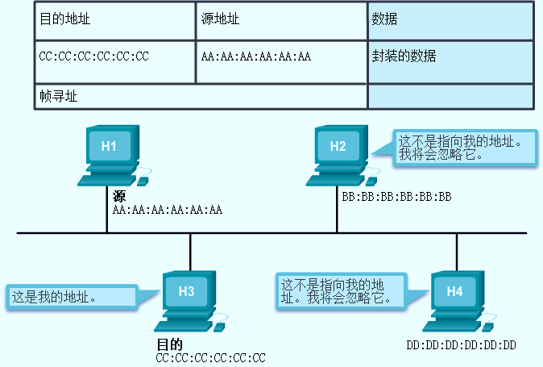

<!-- page: 24 -->

注意3

MAC地址的3种表示

IEEE 要求厂商遵守两条简单的规定：

• 必须使用该供应商分配的OUI作为前3个字节

• OUI相同的所有MAC地址的最后3个字节必须分配唯一的值

24

<!-- page: 25 -->

弹幕讨论：MAC地址会用完吗？

2^48=281,474,976,710,656（280万亿，固定2位，余约70万

亿）

<!-- page: 26 -->

以太网性能（Metcalfe和Boggs，1976）

使用二进制指数后退算法的CSMA/CD方法，以太网的性能？

P=F/B，F为帧长，B为带宽；
L为电缆长度，c为信号传播速度；

信道效率=
P
P + 2𝜏/A
信道效率=
1
1 + 2BLe/cF

假设每帧e个竞争时间槽

传送一帧平均需要P秒，

在给定帧长的情况下，

某个站获得信道的概

增加带宽或距离会降

率为A，2𝜏为时间槽。

低网络效率。

电缆越长，τ越大，任

然而网络发展的目标

何两个站之间的最大

总是在长距离上拥有

电缆距离会影响性能。

高带宽！

26
具有512bit时间槽的10Mbps以太网效率

Andrew S.Tanenbaum, 潘爱民. 计算机网络[M]. 清华大学出版社, 2012.
图片来源
4.3 以太网

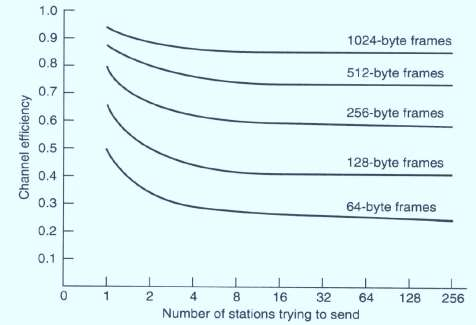

<!-- page: 27 -->

经典（共享）以太网的局限

使用集线器（HUB）组建以太网

Hub所有端口内部都是连通的

使用同一根总线

和Repeater一样，也是物理层设备

使用Hub扩展以太网

集线器不能增加容量

用集线器组成更大的局域网都在一个冲突域中

Hub级连：限制了网络的可扩展性

Switched Ethernet

to the rescue!

27

4.3 以太网

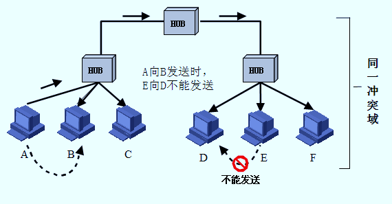

<!-- page: 28 -->

交换式以太网

交换式以太网的核心是交换机（Switch）

工作在数据链路层，检查MAC 帧的目的地址对收到的帧进行转发

交换机通过高速背板把帧传送到目标端口

混杂模式（promiscuous mode）

Hacker

网络分析

28

4.3 以太网

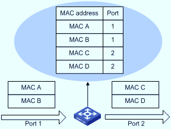

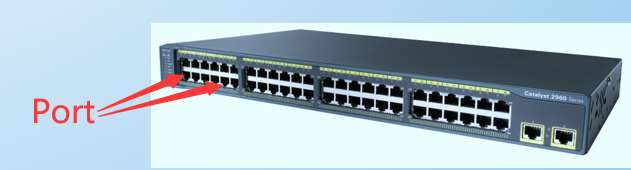

<!-- page: 29 -->

交换机跟集线器本质的不同

Hub
vs   Switch

内部连接所有线缆，逻辑上等同于单根总线

内部通过高速背板连接所有端口
每个端口都有独立的冲突域，在全双工模式下

的经典以太网
所有站都位于同一个冲突域，必须使用

端口可以同时收发，则不需要CSMA/CD
可以实现并行传输

CSMA/CD协议

29

4.3 以太网
Andrew S.Tanenbaum, 潘爱民. 计算机网络[M]. 清华大学出版社, 2012.
图片来源

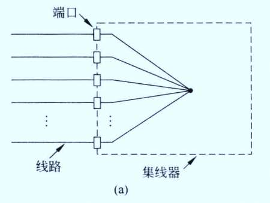

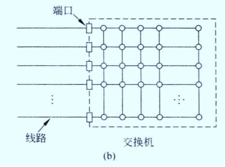

<!-- page: 30 -->

快速以太网

注意：与10Mbps的

以太网相比，10倍的

fast Ethernet( IEEE 802.3u, 1995 )

速度非常快。所以百

带宽 10Mbps 100Mbps

兆以太网被称为“快

比特时间 100ns 10ns（电缆的最大长度降低到十分之一）

速以太网”，尽管后

保留原来的工作方式（帧格式、接口、过程规则）

来有了千兆、万兆、

 自动协商（auto negotiation）

40G、100G。。。。

 线缆类型

名称
线缆
最大长度
编码方式
优点

100Base-T4
双绞线
100米
8B6T
可用3类UTP

100Base-TX
双绞线
100米
4b/5b
全双工速率100Mbps(5类UTP)

100Base-FX
光纤
2000米
4b/5b
全双工速率100Mbps，距离长

30

4.3 以太网

<!-- page: 31 -->

千兆以太网（吉比特以太网）P234

为保证CSMA/CD继续工作，电
缆的最大长度再降低到快速以太

gigabit Ethernet( IEEE 802.3ab, 1998 )

100Mbps 1000Mbps( 1Gbps )

网的十分之一？

保留原来的工作方式（帧格式、接口、过程规则）

 全双工和半双工两种方式工作。

在半双工方式下使用 CSMA/CD （为了向后兼容），增加载波扩充和帧突发

全双工方式不需要使用CSMA/CD（缺省方式）

巨型帧（Jumbo frame）

名称
线缆
最大长度
编码方式
优点

线缆类型

1000Base-SX
光纤
550米
8b/10b
多模光纤（50、62.5微米）

1000Base-LX
光纤
5000米
8b/10b
单模光纤（10微米）
或多模光纤（50、62.5微米）

1000Base-CX
2对STP
25米
8b/10b
屏蔽双绞线

1000Base-T
4对UTP
100米
4D-PAM5
标准5类UTP
4.3 以太网

31

<!-- page: 32 -->

万兆以太网

10-Gigabit Ethernet( IEEE 802.3ae,

2002 )

常记为10GE, 10GbE 或10 GigE

10GBASE-SR SFP +收发器

只支持全双工，不再使用CSMA/CD

保持兼容性

名称
线缆
最大长度
编码方式
优点

10GBase-SR
光纤
最多300米
64b/66b
多模光纤（0.85微米）

重点是超高速的物理层

10GBase-LR
光纤
10千米
64b/66b
单模光纤（1.3微米）

10GBase-ER
光纤
40千米
64b/66b
单模光纤（1.5微米）

10GBase-CX4
4对双轴
15米
8b/10b
双轴铜缆

10GBase-T
4对UTP
100米
64b/65b
6a类UTP

32

4.3 以太网
https://en.wikipedia.org/wiki/10_Gigabit_Ethernet
图片来源

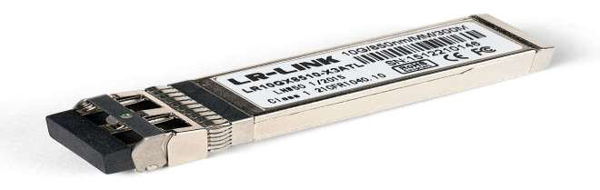

<!-- page: 33 -->

40G-100G以太网

40 Gigabit Ethernet (40GbE) and 100 Gigabit Ethernet (100GbE), 2010

只支持全双工

保留以太网帧格式和MAC方法

保留当前802.3标准的最小帧和最大帧大小

联网设备可以通过可插拔模块支持不同的物理层类型

33
4 x 10G lanes
10 x 10G lanes
https://fmad.io/blog-100g-ethernet.html
https://packetpushers.net/buy-40g-ethernet-obsolete/
https://www.optcore.net/understanding-100g-ethernet

图片来源

4.3 以太网

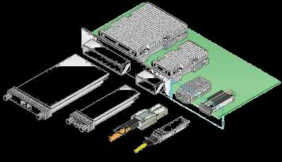

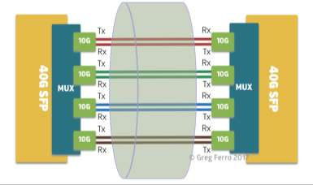

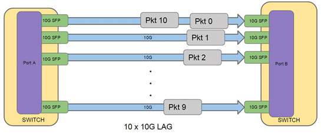

<!-- page: 34 -->

40G-100G以太网

名称
最大长度
40G以太网
100G以太网


40 Gigabit Ethernet (40GbE) 与

改进的背板
1米
40GBASE-KR4
100GBASE-KR4
100GBASE-KR2

100 Gigabit Ethernet (100GbE)

双芯铜缆
7米
40GBASE-CR4
100GBASE-CR10
100GBASE-CR4
100GBASE-CR2

40/100 GbE提供物多种物理

层规范（PHY），定义了许多

8类双绞线
30米
40GBASE-T
-

端口类型，具有不同的光学和

多模光纤
100米/OM3，
125米/OM4
40GBASE-SR4
100GBASE-SR10
100GBASE-SR4
100GBASE-SR2

电气接口，以便在单模光纤、

多模光纤、双芯铜缆、双绞线

单模光纤
500米
-
100GBASE-DR

单模光纤
2千米
40GBASE-FR
100GBASE-FR1

和网络设备背板上运行。

单模光纤
10千米
40GBASE-LR4
100GBASE-LR4
100GBASE-LR1

单模光纤
40千米
40GBASE-ER4
100GBASE-ER4

单模光纤
80千米
-
100GBASE-ZR
4.3 以太网

34

<!-- page: 35 -->

以太网的未来

25/50G和第二代100G以太网

25G以太网标准（IEEE 802.3by）是由IEEE和IEEE-SA于2014年发布，该

标准弥补了10G以太网的低带宽和40G以太网的高成本缺陷。25G以太网

采用了25Gb/s单通道物理层技术，可基于4个25Gbps光纤通道实现100G

传输。

35

4.3 以太网
https://blogs.arubanetworks.com/solutions/accelerate-network-performance-and-lower-costs-with-hpe-25-100gbe/
图片来源

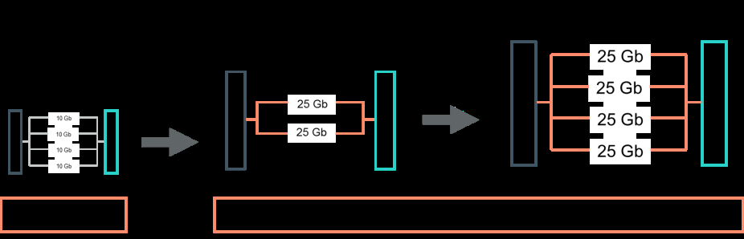

<!-- page: 36 -->

以太网的未来

2017年，由IEEE P802.3bs工作组使用与100GbE大致相似的技

术开发的400GbE和200GbE标准获得批准。

保留以太网帧格式

保留以太网最小帧长和最大帧长

2020年，以太网技术联盟（Ethernet Technology Consortium）

宣布开发800G以太网规范，以满足数据中心网络不断增长的性能
需求。

36
4.3 以太网

<!-- page: 37 -->

以太网的未来

以太网联盟的2020技术路线图预计2020年-2030年之间，

800Gbps和1.6Tbps的速度将成为IEEE标准。

4.3 以太网
https://www.slideshare.net/citizenearth/bridge-to-tera-bit-ethernet
https://ethernetalliance.org/technology/2020-roadmap/
图片来源

37

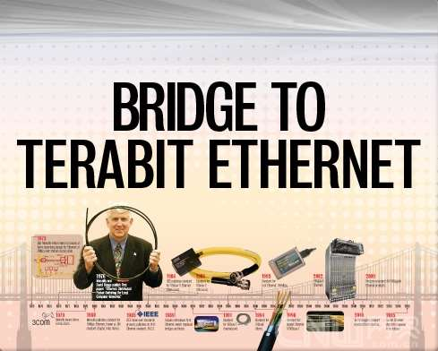

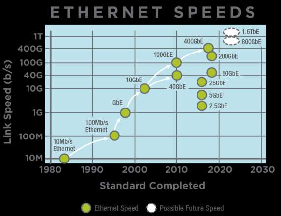

<!-- page: 38 -->

课前热身（弹幕）

无冲突的确定性MAC有哪些？

以太网之父的技术传奇，你知道哪些？

以太网和IEEE802.3以太网基本兼容，有哪些差别？

物理地址是全球唯一的吗？

物理地址有哪些类型？能够付给一个网卡的物理地址是哪种？

以太帧的最短长度和最长长度是多长？

经典以太网的特点是什么？

交换式以太网的典型物理拓扑是什么？

<!-- page: 39 -->

以太网回顾P236

不灭的小强！

强大的生命力，生态系统

简单性和灵活性

易于维护

支持TCP/IP，互联容易

善于借鉴：4B/5B，8B/10B。。。

KISS：Keep It Simple，Stupid（大智若愚）

乔布斯：stay hungry，stay foolish

39

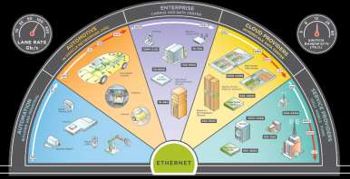

<!-- page: 40 -->

以太网的发展（备查）

40

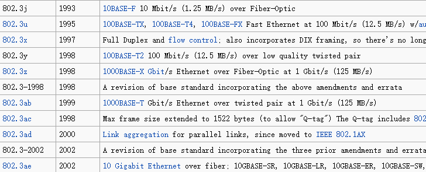

<!-- page: 41 -->

单选题
2分

下列网络标准中，网络中各结点争用共享通信信道不会出现“冲突”

现象的是哪一个？

IEEE 802.5

A

IEEE 802.3

B

IEEE 802.3z

C

IEEE 802.3u

D

提交

<!-- page: 42 -->

主要内容

以太网的前世今生

以太网的技术特征

IEEE802.2

LLC子层

物理结构

数据链路层

以
太
网

链路层帧

MAC子层

IEEE802.11

IEEE802.5

IEEE802.4

IEEE802.3

FDDI

编码方式、访问控制方式等

物理层

二层交换基本原理

二层交换设备：交换机

<!-- page: 43 -->

二层交换的原理 P259-260

flooding --当目的地址未知或为广播地址时，桥发送帧到除源端

口之外的每个端口

三
选
一

forwarding --对于已学到的目的地址，将直接发送帧到对应的

目的设备所在端口

filtering --如果目的地址和源地址在同一端口，桥将丢掉帧

（discarding）

learning --通过读取每个帧的源地址和对应源端口来学习连在网

段上的每个设备的地址

<!-- page: 44 -->

二层交换机（网桥的现代名称）

二层交换机

执行二层交换

即插即用，透明

PoE（Power Over Ethernet）

常接：网络摄像机、AP、IP电话等

主要优点：无需电源（受电端）、无需专门布线

弹幕：为什么PoE交换机并不常见？

<!-- page: 45 -->

交换模式 P265

存储转发：最慢，出错少

直通交换（贯穿）：最快，出错多

无分片交换：二者的折衷

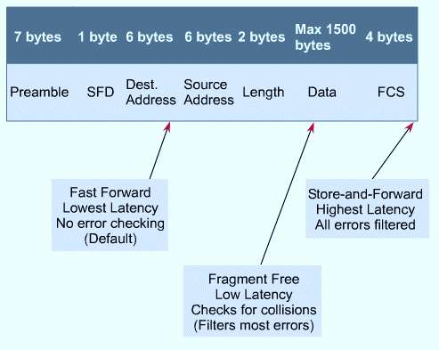

<!-- page: 46 -->

交换模式1：存储转发

特点：转发前必须接收整个帧、执行CRC校验

缺点：延迟大

优点：不转发出错帧、支持非对称交换

7字节
1字节
6字节
6字节
2字节
46~1500字节
4字节

Preamble
SFD
Destination
Source
Length/

Type
Data and Pad
FCS

存储转发模式

高延迟
 过滤所有错误帧

4.4 数据链路层交换
46

<!-- page: 47 -->

交换模式2：直通交换

特点：一旦接收到帧的目的地址，就开始转发

缺点：可能转发错误帧、不支持非对称交换

优点：延迟非常小，可以边入边出（虫孔）

7字节
1字节
6字节
6字节
2字节
46~1500字节
4字节

Preamble
SFD
Destination
Source
Length/

Type
Data and Pad
FCS

直通模式
低延迟、无错误检查

4.4 数据链路层交换
47

<!-- page: 48 -->

交换模式3：无碎片交换

特点：接收到帧的前64字节，即开始转发

Runt frame：<64B

缺点：仍可能转发错误帧，不支持非对称交换

优点：过滤了冲突碎片，延迟和转发错帧介于存储转发和直通交

换之间

7字节
1字节
6字节
6字节
2字节
46~1500字节
4字节

Preamble
SFD
Destination
Source
Length/

Type
Data and Pad
FCS

帧的前64字节

无碎片模式

较低延迟
过滤冲突导致的碎片帧

4.4 数据链路层交换

48

<!-- page: 49 -->

多选题
2分

交换机启动后，D向A发送了一个帧，随后，交换机B2收到1个E向D发送的帧，

此时B2所做的动作应该是什么？（多选）

丢弃

A

广播

B

向D转发

C

逆向地址学习

D

提交

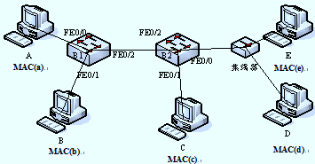

<!-- page: 50 -->

单选题
2分

（考研题变动）某以太网拓扑及交换机当前转发表如下图所示，主机00-

e1-d5-00-23-b1向主机00-e1-d5-00-23-c1发送1个数据帧，主机00-

e1-d5-00-23-c1收到该帧后，向主机00-e1-d5-00-23-b1发送一个确认

帧，交换机对这两个帧的转发端口分别是:

{1,3}和{2}

A

{2,3}和{1}

B

{2,3}和{1,2}

C

{1,3}和{1,2}

D

提交

<!-- page: 51 -->

虚拟局域网P265

广播域（Broadcasting Domain）

广播域是广播帧能够到达的范围；

缺省情况下，交换机所有端口同属于一个广播域，无法隔离广播域；

广播帧在广播域中传播，占用资源，降低性能，且具有安全隐患。

图中某个站点，发
送了一个广播帧，
能够收到该广播帧
的设备，同处于一
个广播域。

广播域

4.4 数据链路层交换
51

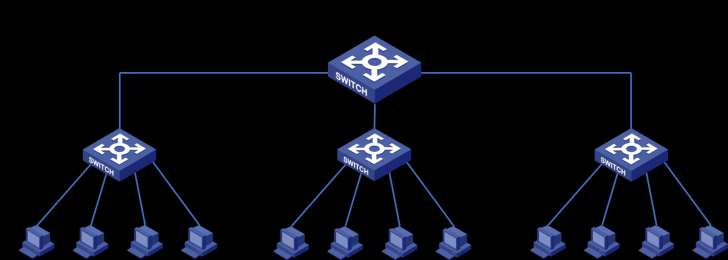

<!-- page: 52 -->

虚拟局域网（Virtual LAN）

路由器是广播域的边界

网络层设备

广播域等同于一个物理LAN

二层交换机可以分隔广播域吗？

可以！支持VLAN的交换机；

一个VLAN是一个独立的广播域；

交换机通过划分VLAN，来分隔广播

域。

4.4 数据链路层交换
52

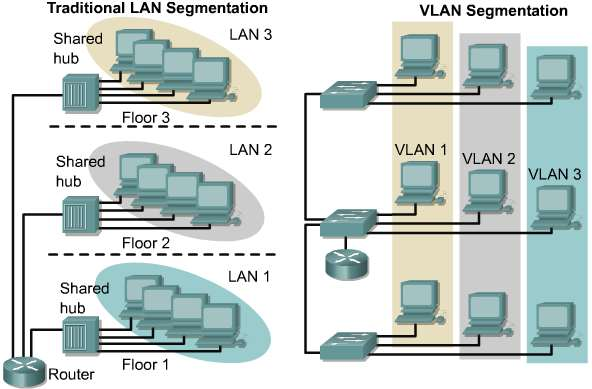

<!-- page: 53 -->

VLAN之间二层不通达！

VLAN是一个在物理网络上根据用途，工作组、应用等来逻辑划分的局域网

络，与用户的物理位置没有关系。

开发部
市场部

VLAN10
VLAN20

不同VLAN的
成员不能直
接进行二层
通信！

A

B

C

D

广播域
广播域

4.4 数据链路层交换
53

<!-- page: 54 -->

VLAN之间的路由

通过路由器或三层交换机进行VLAN间路由，实现VLAN间通信。

开发部
市场部

VLAN10
VLAN20

不同VLAN的
成员通信需
要通过三层
设备

A

B

C

D

广播域
广播域

4.4 数据链路层交换
54

<!-- page: 55 -->

VLAN的类型/实施

基于端口的VLAN（最常见）

基于MAC地址的VLAN

如何划分

VLAN?

基于协议的VLAN

基于子网的VLAN

4.4 数据链路层交换
55

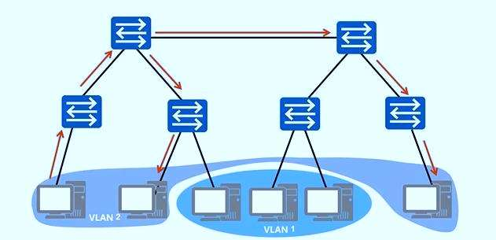

<!-- page: 56 -->

基于端口的VLAN：最常用的方式

创建VLAN

指定成员端口

VLAN Table

VLAN ID
Port

10
F0/1

10
F0/2

20
F0/3

20
F0/4

C

A

F0/1

F0/3

F0/2

F0/4

D

B

VLAN 10
VLAN 20

4.4 数据链路层交换
56

<!-- page: 57 -->

如何区分不同VLAN的数据帧？

在数据帧中携带VLAN标记；

VLAN 标记由交换机添加/剥除，对终端站点透明。

4.4 数据链路层交换
57

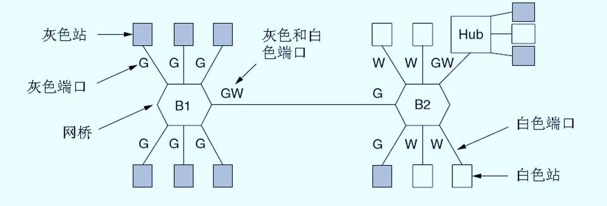

<!-- page: 58 -->

帧标记标准：IEEE802.1Q

带VLAN标记的帧称为标记帧（Tagged Frame）

不携带VLAN标记的普通以太网帧称为无标记帧（Untagged

Frame）

插入 4 字节的 VLAN 标记

4

字节
6
6
2
46 ~ 1500
4

MAC 帧
目地地址
源地址
类型
数      据
FCS

IEEE802.1Q帧格式

标记协议标识符                  标记控制信息

最长帧长：
1522 Byte

 1 0 0 0 0 0 0 1  0 0 0 0 0 0 0 0                          VLAN ID

2 字节
12bit

优先级CFI

4.4 数据链路层交换
58
2Byte
2Byte

（3bit)   （1bit）

<!-- page: 59 -->

帧标记示范

Trunk链路类型端口与Trunk链路

无标记帧

Trunk端口一般用于交换机之间连接；

标记帧

干道链路允许多个VLAN的流量通过。

Access端口

Access端口

PVID:10

PVID:10

Trunk端口

PVID:1

S2 VLAN Table

S1 VLAN Table

C

A

S1
S2
F0/2

VLAN ID
Port

Tag=10

VLAN ID
Port

F0/2

10
F0/2

10
F0/2

F0/1

F0/1

20
F0/3

20
F0/3

F0/3

F0/3

Tag=20

Trunk端口

D

B

PVID:1
Access端口

Access端口

PVID:20

PVID:20

4.4 数据链路层交换
59

<!-- page: 60 -->

虚拟局域网的优点小结

有效控制广播域范围

广播流量被限制在一个VLAN内；

增强网络的安全性

VLAN间相互隔离,无法进行二层通信,不同VLAN需通过三层设

备通信；

灵活构建虚拟工作组

同一工作组的用户不必局限于同一物理范围；

提高网络的可管理性

将不同的业务规划到不同VLAN便于管理。

4.4 数据链路层交换
60

<!-- page: 61 -->

生成树协议：STP

为了可靠，采用冗余结构，比如。。。。。

但是冗余结构将导致环结构，引发三大问题

多帧传送

MAC地址库不稳定

广播风暴

所以，Perlman发明了生成树

<!-- page: 62 -->

多帧传送

物理环路引发的问题1：重复帧

X发送到环路的单播帧，造成目的设备Y收到重复的帧。

Server/PC X
Router Y

Router Y收到多

个重复的副本

单播帧

网段1

单
播
帧

假设所有交换机的
MAC地址表中均没有

Switch A
Switch B

路由器Y的MAC地址

网段2

4.4 数据链路层交换
62

<!-- page: 63 -->

生成树协议

物理环路引发的问题2：MAC地址表不稳定

当一个帧的多个副本到达不同端口时，交换机会不断修改同一MAC地址

对应的端口。

Server/PC X
Router Y

…
MAC_X    端口1
…

…
MAC_X    端口1
…

网段1

单
播
帧

端口1
端口1

Switch A
Switch B

端口2
端口2

…
MAC_X    端口2
…

…
MAC_X    端口2
…

网段2

4.4 数据链路层交换
63

<!-- page: 64 -->

广播风暴

物理环路引发的问题3：广播风暴

交换机（网桥）在物理环路上无休止地泛洪广播流量，无限循环，迅速消

耗网络资源。

Server/PC X
Router Y

广播帧

网段1

广
播
帧

Switch A
Switch B

网段2

4.4 数据链路层交换
64

<!-- page: 65 -->

生成树协议（STP：Spanning Tree Protocol）

发明人 Radia Perlman

I think that I shall never see

A graph more lovely than a tree.

A Protocol for Distributed

A tree whose crucial property

Computation of a Spanning
Tree in an Extended LAN, Ninth
D a t a
C o m m u n i c a t i o n s
Symposium, Vancouver, 1985

Is loop-free connectivity.

A tree which must be sure to span.

So packets can reach every LAN.

First the Root must be selected

By ID it is elected.

1983年，发明生成树协议

Least cost paths from Root are traced

（STP）：打破了物理环，维护一
个逻辑无环树

In the tree these paths are placed.

A mesh  is made by folks like me

Then bridges find a spanning tree.

4.4 数据链路层交换
65

<!-- page: 66 -->

STP的运作（802.3D、802.3W）

每个网络一个根网桥

每个网桥一个根端口

每网段一个指定端口

非指定端口不被使用

通过：BPTU的穿梭，自动

没有免费午餐：维护代价、

选举维护。

可能不是最短路径！

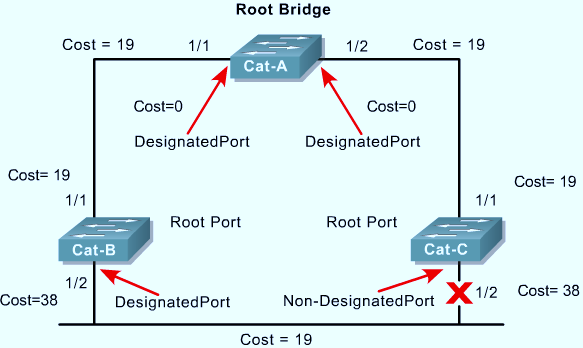

<!-- page: 67 -->

补充：交换机相关的安全问题

交换机的
堆叠、级联

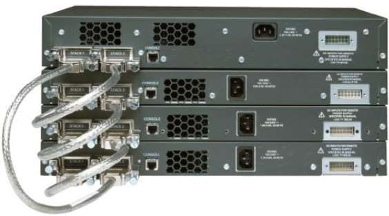

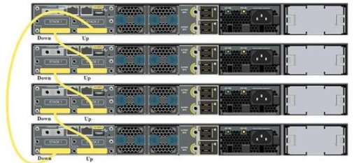

<!-- page: 68 -->

常见局域网内的安全攻击

MAC地址泛洪攻击（ARP攻击）

伪造源地址

伪造目的地址

DHCP欺骗攻击

伪装成DHCP服务器应答

伪造源地址，向DHCP服务器请求

Telnet攻击

暴力密码破解

使Telnet服务不可用

<!-- page: 69 -->

应对安全策略

使用各种安全工具

SSL、服务识别、报文截获

配置端口安全性

配置端口安全的策略：如数量、MAC地址，限制源头

违规（违反策略）后的行动

保护：丢弃违规包，或移除超出MAC地址

限制：超出规定源MAC数量后，丢包，直到回到安全范围之类，并发出

SNMP陷阱、计入日志、违规计数器

关闭：立刻关闭端口，LED灯灭，同时发送。。。。

<!-- page: 70 -->

配置命令P72

基本命令跟路由器的类似

配置策略，以2950为例

  Switch(config-if)#switchport port-security ?

mac-address  Secure mac address

maximum      Max secure addresses

violation    Security violation mode

注意：该命令须在开起了access和trunk模式方可用，在

dynamic模式下不可用

<!-- page: 71 -->

两种链路

Trunk

干线：不局限于传输单个VLAN的帧

交换机和交换机

交换机和路由器

交换机和服务器

Access

Access：只传输某个VLAN的帧

交换机和PC

<!-- page: 72 -->

配置命令（继续）

配置违规后采取的动作：三种之一

Switch(config-if)#switchport port-Security violation ?

protect
Security violation protect mode

restrict Security violation restrict mode

shutdown Security violation shutdown mode

<!-- page: 73 -->

补充结束

（1）安装并学习使用PacketTracer操作交换机

（2）如需要，观看PT使用录像、交换端口安全操作视频

（3）安装WireShark，抓包，理解帧格式

<!-- page: 74 -->

有问题吗？

