# 20230505_第4章_介质访问控制子层（1）_20230619170317

<!-- page: 1 -->

第四章 介质访问控制子层（1）

袁华，hyuan@scut.edu.cn

华南理工大学计算机科学与工程学院

广东省计算机网络重点实验室

<!-- page: 2 -->

第四章预习情况

计科1：84人完成，完成率约92%

网工班：71人完成，完成率约92%

2

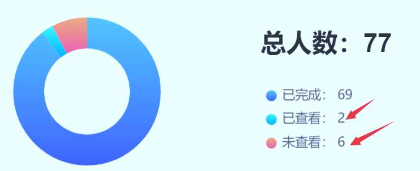

<!-- page: 3 -->

OSI参考模型下两层

MAC子层在哪里？

数据链路层分为两个子层：

MAC子层：介质访问

LLC子层：承上启下（弱层）

以太网和IEEE802.3

覆盖的层数不同（1.5层vs 2层）

帧的结构有细微不同

以太网：事实上的标准，而802.3系列让接入有了无限的延展性

局域网：以太网、无线局域网……

3

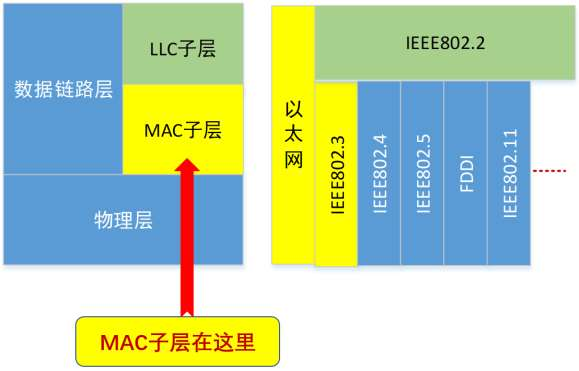

<!-- page: 4 -->

第4章的主要内容

多路访问协议（4.1~4.2）

一个多路访问网络(LAN): Ethernet （4.3）

IEEE802.3

数据链路层交换 （4.7）

网桥

交换机（网桥的现代名称）

4

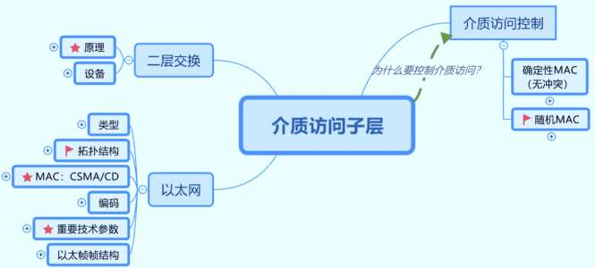

<!-- page: 5 -->

多选题
2分

MAC子层的功能是什么？（选取3项）

控制对介质的访问

A

检查接收位中的错误

B

使用CSMA/CD或CSMA/CA来进行介质访问控制

C

在上层的软件和下层的设备硬件之间进行通信

D

允许多个第3层协议来使用相同的网络接口和介质
E

提交

5

<!-- page: 6 -->

常见的局域网拓扑

总线拓扑、星型拓扑、环型拓扑

共同点：共享一根信道（别称：广播信道、多路访问信道、随机访问信道）

计算机A

计算机A
计算机B

计算机A

计算机B

计算机D

集线器
计算机B

计算机C
计算机D

计算机C
计算机D

计算机C

6

4.1.1 局域网信道

<!-- page: 7 -->

典型的接入LAN情形

Internet

Router
Router

Switch

Switch

PC3

PC1

PC4

PC2

PC5

7

<!-- page: 8 -->

为什么需要介质访问控制？

局域网采用的通信
方式，共享传输介
质以降低费用。

数据通信方式

单播（unicast）：One - to - One

广播（broadcast)： One - to - Everyone of the whole

组播（multicast）： One - to - A part of the whole

广播网络面临的问题

可能两个（或更多）站点同时请求占用信道

解决办法：介质的多路访问控制

在多路访问信道上确定下一个使用者

8

<!-- page: 9 -->

多路访问协议 P202

随机访问协议（Random Access）

特点：站点争用信道，可能出现站点之间的冲突

典型的随机访问协议

ALOHA协议

纯ALOHA；分隙（分槽）ALOHA

CSMA协议

CSMA/CD协议（以太网采用此协议）

受控访问协议（Controlled Access）

特点：站点被分配占用信道，无冲突

9

<!-- page: 10 -->

ALOHA协议

夏威夷大学Norman Abramson及他的同事设计ALOHANet：

连接檀香山和其它岛屿

纯ALOHA协议（想发就发）

分槽ALOHA协议（只在时槽开始处发）

为什么要分时槽？

10

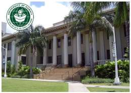

<!-- page: 11 -->

ALOHA协议的性能

ALOHA

冲突危险期：2t

生成帧均值：2G

不遭冲突概率：P0 = e-2G

吞吐量：S = G P0 = G e-2G

36.8

时隙（Slotted，分隙）ALOHA（P214）

18.4

以帧时t为离散间隔

冲突危险期减半：t

吞吐量：S = G P0 = G e-G

11

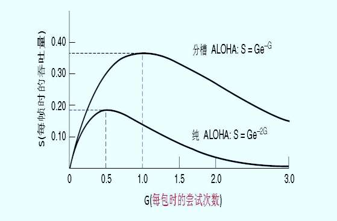

<!-- page: 12 -->

载波侦听多路访问协议

CSMA：Carrier Sense Multiple Access

特点：“先听后发”

不再任性！

改进ALOHA的侦听/发送策略分类

变得礼貌了！

4.2.1 随机访问协议
12

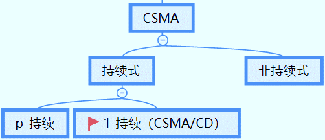

<!-- page: 13 -->

主观题
10分

弹幕讨论

这么礼貌了（别的站不发，我才发），还会发生冲突，那么，有

些什么情形会导致冲突？

正常使用主观题需2.0以上版本雨课堂

作答

13

<!-- page: 14 -->

情形1

>2同时侦听

14

<!-- page: 15 -->

情形2：传播延迟对载波侦听的影响

信号传输速度：0.65C（每微秒200米）

t0时刻：甲侦听后发送，到达乙约需5微妙

t1时刻：乙侦听后发送

t2时刻：冲突

t3时刻：乙检测到冲突

t4时刻：甲检测到冲突

4.2.1 随机访问协议
15

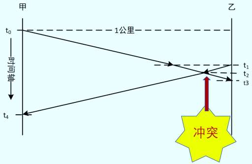

<!-- page: 16 -->

冲突窗口

即发送站发出帧后能检测到冲突（碰撞）的最长时间。

是一个时间区间

可能侦听到发出的帧遭到冲突（碰撞）

数值上：等于最远两站传播时间的两倍，即2D（D是单边延

迟）

2D相当于1个来回传播延迟（RTT：Round Trip Time）

4.2.1 随机访问协议
16

<!-- page: 17 -->

预习No.2

网工：65%

计科1：76%

17

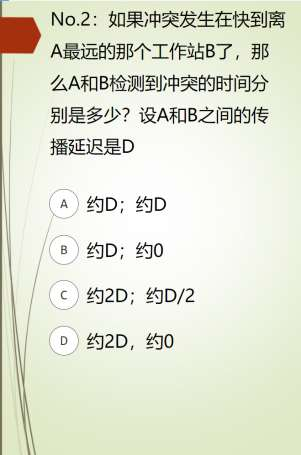

<!-- page: 18 -->

单选题

2分

冲突窗口是能够检测到冲突的上限，如果最远两站A和B之间的单向

传播延迟是D。现在，A发送了一个帧，过了D长的时间，A检测到

冲突，问A所发的帧在哪里发生了冲突？

刚发出，靠近A的地方

A

A和B之间正中

B

快到B的地方

C

上述答案都不对

D

提交

18

<!-- page: 19 -->

CSMA/CD  （1-持续）

CSMA with Collision Detection

原理：“先听后发、边发边听”

过程

①经侦听，如介质空闲，则发送。

②如介质忙，持续侦听，一旦空闲立即发送。

③如果发生冲突，等待一个随机分布的时间再重复步骤①

4.2.1 随机访问协议
19

<!-- page: 20 -->

CSMA/CD（续）

边发边听：是否发生了冲突？

甲
乙

1公里

t0

一旦冲突，发送Jam（强化）

时间轴

t1

信号

t2

t3

t4时刻：甲检测到冲突，发送

t4

Jam信号

t3时刻：乙检测到冲突，是否发

送Jam信号？

4.2.1 随机访问协议

20

<!-- page: 21 -->

同学问：冲突是怎么检测的？

Tx：发出信号，分叉

Rx：收到两路信号

比较，不同则有冲突

所以，自然要求

发送帧的时间不能太短

至少一个冲突窗口的时间：2D

21

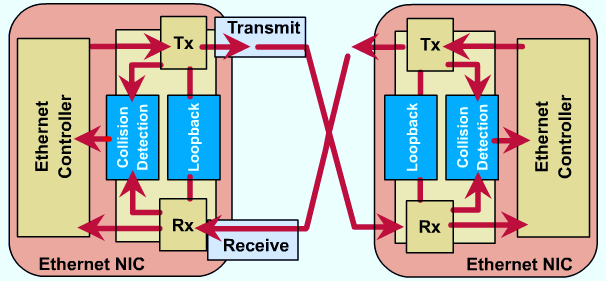

<!-- page: 22 -->

有冲突，效率不高！

CSMA/CD：1-持续CSMA

以太网采用了CSMA/CD

吞吐量：比ALOHA高，比P-持续式CSMA低

冲突：比ALOHA少，比P-持续式高

P-持续式付出了高延迟的代价

CSMA/CD

22

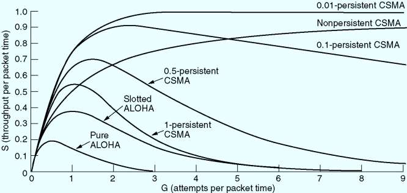

<!-- page: 23 -->

课前热身（弹幕）

多路访问（随机访问）协议要解决什么问题？

纯ALOHA协议的工作特点是怎样的？

相比于纯ALOHA协议，分槽ALOHA协议有什么优势？

CSMA系列多路访问协议的主要访问机制是？

CSMA/CD(1-持续)的基本工作机制归纳为一句话 是？

CSMA比ALOHA礼貌多了，是否消灭了冲突？为什么？

冲突危险期指的是什么？

23

<!-- page: 24 -->

有没有完全消灭了冲突的MAC呢？

有！

确定性的MAC

受控协议

位图协议

二进制倒计数

令牌

24

<!-- page: 25 -->

位图协议（预留协议）P209

竞争期：在自己的时槽内发送竞争比特

举手示意

资源预留

传输期：按序发送

明确的使用权，避免了冲突

25

<!-- page: 26 -->

位图协议的效率分析

假设

有N个用户，需N个时隙，每帧d比特

信道利用率

在低负荷条件下：d/(d+N)     （N越大，站点越多，利用率越低）

在高负荷条件下：d/(d+1)，接近100%

缺点

位图协议无法考虑优先级

26

<!-- page: 27 -->

令牌传递

弹幕：有什么缺点呢？

令牌：发送权限

令牌的运行：发送工作站去抓取，

获得发送权

除了环，令牌也可以运行在其它拓扑上，

如令牌总线

发送的帧需要目的站或发送站将其

从共享信道上去除；防止无限循环

缺点：令牌的维护代价

27

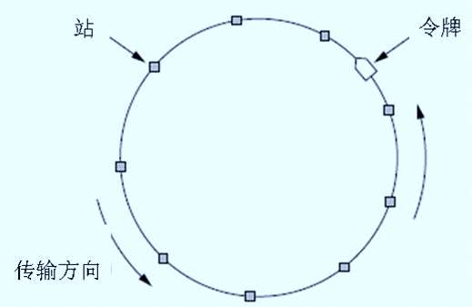

<!-- page: 28 -->

二进制倒计数协议P210

需要一个仲裁机构决定哪个站点发送

弹幕：有什么缺点呢？

基本思想

把站号按相同长度的二进制数编号，需要发送的站逐个按高位到低位在争

用周期开始时发送，凡低序号的站点发现有高序号站点也希望发送，则退

出竞争，即：高序号站点优先

28

<!-- page: 29 -->

信道效率分析P211

N个站的二进制编码所需位数是log2N位

信道的效率为：d/(d+log2N)

如果规定每个帧的帧头为发送地址，即竞争的同时也在发送。则

效率为100%

29

<!-- page: 30 -->

主观题
10分

弹幕：

消灭了冲突的协议为什么没有大行其道？

正常使用主观题需2.0以上版本雨课堂

作答

30

<!-- page: 31 -->

有限竞争协议 P211

有限竞争协议（Limited Contention Protocol）

在低负荷时使用竞争法，以减少延迟时间。

在高负荷时，使用无冲突法，以获得高的信道效率。

(避免内卷)

31

<!-- page: 32 -->

自适应树搜索协议（Adaptive Tree Walk Protocol）

比喻：二战时美军士兵的病毒检测

32

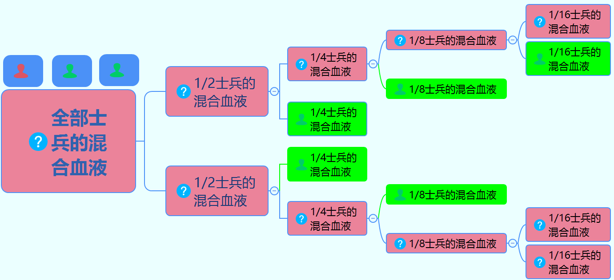

<!-- page: 33 -->

自适应树搜索协议（Adaptive Tree Walk Protocol）

在一次成功传输后的第一个竞争

时隙和某一特

时隙，所有站点同时竞争。

定节点关联

如果只有一个站点申请，则获得

信道。

否则在下一竞争时隙，有一半站

点参与竞争（递归），下一时隙由

另一半站点参与竞争

 即所有站点构成一棵完全二叉树。

33

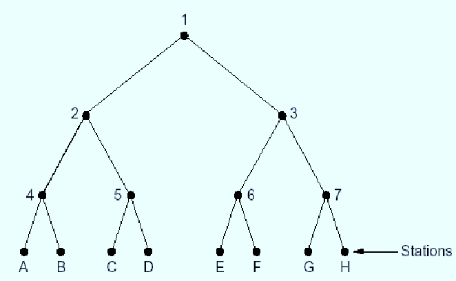

<!-- page: 34 -->

单选题
2分

决定局域网特性的主要技术要素有：传输介质、网络拓扑结构和

介质访问控制方法，其中最重要的是哪个？

传输介质

A

介质访问控制方法

B

网络拓扑结构

C

以上都不是

D

提交
34

<!-- page: 35 -->

无线局域网协议 P214

无线局域网是越来越常见的一种组网。

无线局域网共享信道

蜂窝拓扑

分布式系统（DS）

AP
AP

BSS1
BSS2

STA

STA1
STA2
STA3
STA4

IBSS

ESS

35

<!-- page: 36 -->

无线局域网协议（续P220）

也需要MAC协议

但是，不能直接使用有线局域网的MAC协议

无法检测出冲突  （P220、P242）

无法给所有局域网内其它工作站发送帧，也无法接收所有其它站的帧

（P220）

传输范围有限

36

<!-- page: 37 -->

如果只是使用简单的CSMA会怎样？

 无线传输特性：冲突发生在接收方  （P220）

 可能遭遇两类问题

隐藏终端问题


A侦听后，发数据给B


C侦听后，发数据给B


在B处冲突

37

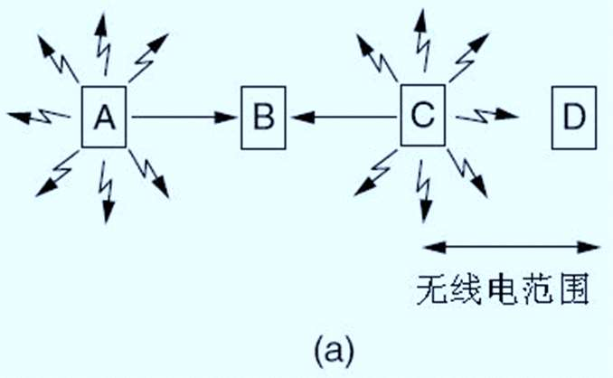

<!-- page: 38 -->

如果使用CSMA会怎样？（续）

暴露终端问题


B发数据给A


同时，C想发数据给D


但是C侦听，发现信道忙


C：不发送


事实上，C可以发送给D

问题根源在于：侦听只能检查发方附近有无无线电活动，但冲突

发生在接收方！

38

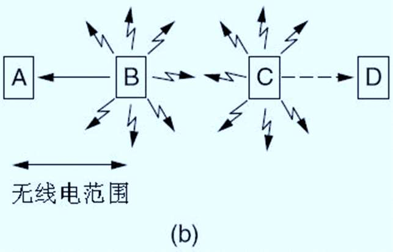

<!-- page: 39 -->

早期解决方案：MACA（P215）

冲突避免多路访问：Multiple Access with Collision

Avoidance

工作原理（鸣锣开道）

发方通过一个短帧刺激收方RTS（Request to Send）

收方回发短帧CTS（Clear to Send）

一来一回，警示附近其它站点让道

39

<!-- page: 40 -->

A向B发RTS，包含待传数据长度

C看到这个RTS，于是，C可自由发送

B收到RTS，回发CTS，也包含待传数据长度

D看到CTS，于是，D保持沉默。

E呢？

暴露终端

40

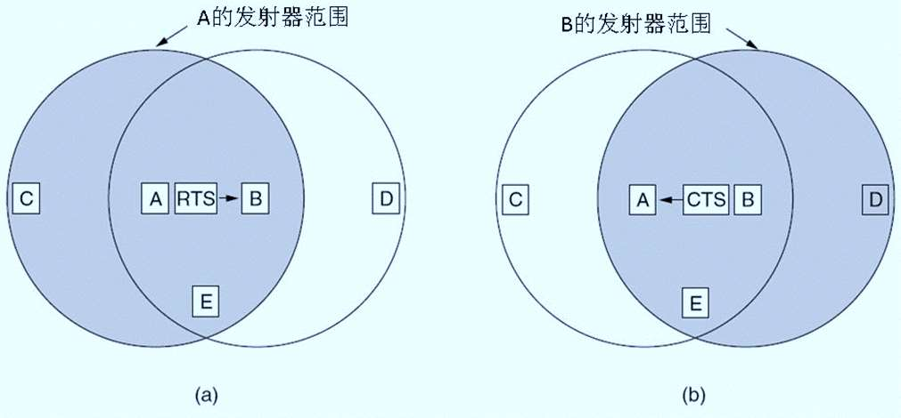

<!-- page: 41 -->

思考：

如果B和C同时给A发送RTS，会怎么样？

冲突，RTS丢失

导致发方收不到CTS

可延迟再发RTS

更多关于802.11无线MAC，参看4.4.3 （P241）

41

<!-- page: 42 -->

单选题
2分

【15年考研题】下列关于CSMA/CD协议的叙述中，错误的是______。

适用于无线网络，以实现无线链路共享

A

需要根据网络跨距和数据传输速率限定最小帧长

B

边发送数据帧，边检查是否发生冲突

C

当信号传播延迟趋近0时，信道利用率趋近100%

D

提交
42

<!-- page: 43 -->

有问题吗？

43

