# 20230509_ch4_介质访问子层(3)_无线局域网_20230619170343

<!-- page: 1 -->

计算机网络
众筹· 网络· 分享

第四章 介质访问子层

无线网络

袁 华

华南理工大学

计算机网络

教案社区

<!-- page: 2 -->

我的学校
第四章

MAC寻址定位发生在局域网，为什

么MAC地址要全球唯一呢？

2

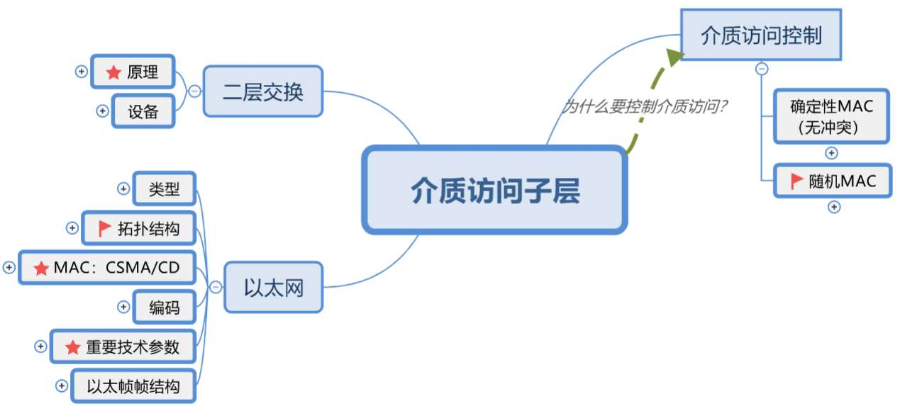

<!-- page: 3 -->

我的学校
课前热身（弹幕）

二层交换的的原理，三选一决策指的是什么？
交换机逆向地址学习，主要学习什么信息？
交换机的三种交换模式中，最快的一种叫什么？它还有别的称呼

吗？它有什么缺点？
为了两点间的可靠连接，通常采用什么手段？
二层环可能带来什么问题？
怎么解决二层环问题？
什么是广播域，交换机可以分隔广播域吗？
VLAN帧怎么跨越干线？

3

<!-- page: 4 -->

华南理工大学
主要内容（4.4小节）

无线局域网概述

WLAN的体系结构

IEEE 802.11的介质访问控制

IEEE 802.11帧格式

IEEE 802.11无线局域网的构建和管理

了解WiFi 6的特征

4

<!-- page: 5 -->

华南理工大学
无线局域网概述

无线局域网（Wireless Local Area Network，WLAN)：指以无线信道作为

传输介质的计算机局域网

设计目标

• 针对小的覆盖范围（受限的发射功率）

• 使用无需授权的频谱（ISM频段)

• 面向高速率应用

• 能够支持实时和非实时应用

两个重要组织：IEEE 802.11工作组、Wi-Fi联盟（Wi-Fi Alliance，WFA）

4.5 无线局域网

5

<!-- page: 6 -->

华南理工大学
无线局域网概述

IEEE 802.11无线局域网发展历程

6
4.5 无线局域网

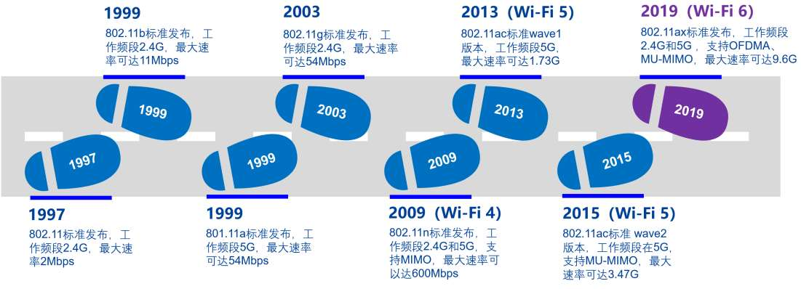

<!-- page: 7 -->

华南理工大学
无线局域网组网模式

基础架构模式

分布式系统（DS）

•
分布式系统（DS）

AP
AP

•
访问点（AP）

BSS1
BSS2

•
站点（STA）

•
基本服务集（BSS）

STA1
STA2
STA3
STA4

•
扩展服务集（ESS）

ESS

•
站点之间通信通过AP转发

AP

4.5 无线局域网

7

<!-- page: 8 -->

华南理工大学
无线局域网组网模式

自组织模式（Ad hoc）

• 站点（STA）

• 独立基本服务集（IBSS）

• 站点之间直接通信

STA

• 共享同一无线信道

IBSS

4.5 无线局域网

8

<!-- page: 9 -->

华南理工大学
无线局域网体系结构

物理介质相关子层（PMD层）

• 调制解调、编码/解码

 物理层汇聚协议（PLCP层）

• 向上提供独立于传输技术的物理层访问点

 介质访问控制层（MAC层）

• 可靠数据传输

• 介质访问控制

• 安全机制

• ……

9
4.5 无线局域网

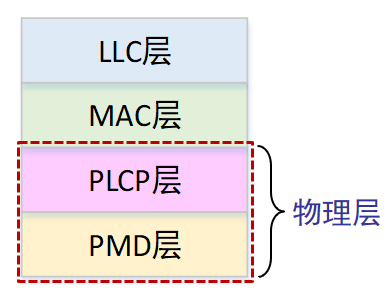

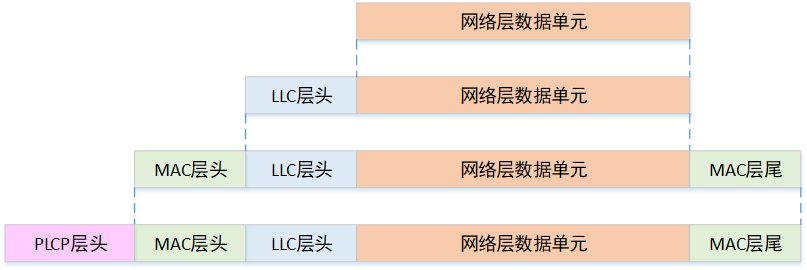

<!-- page: 10 -->

华南理工大学
无线局域网体系结构

无线局域网需要解决的问题

•
有限的无线频谱带宽资源

•
通道划分、空间重用

•
提高传输速率，解决传输问题

•
提高抗干扰能力和保密性

•
 共享的无线信道

•
介质访问控制方法（CSMA/CA）

•
可靠性传输、安全性

•
 组网模式管理

•
BSS构建、认证、关联

•
移动性支持（漫游）

•
睡眠管理（节能模式）

10
4.5 无线局域网

<!-- page: 11 -->

华南理工大学
IEEE 802.11物理层

物理层技术概览

•
频段：2.4GHz、5GHz（ISM频段，无需授权；限制发送功率，例如：≤1瓦）

•
调制技术：DPSK → QPSK → CCK → 64-QAM → 256-QAM → 1024-QAM

•
直接序列扩频（DSSS）→ 正交频分多路复用（OFDM）→正交频分多址（OFDMA）

•
单天线 → 单用户多入多出（SU-MIMO）→ 多用户多入多出（MU-MIMO）

•
目标：提升传输速率、增强可靠性、支持高密度接入

11
4.5 无线局域网

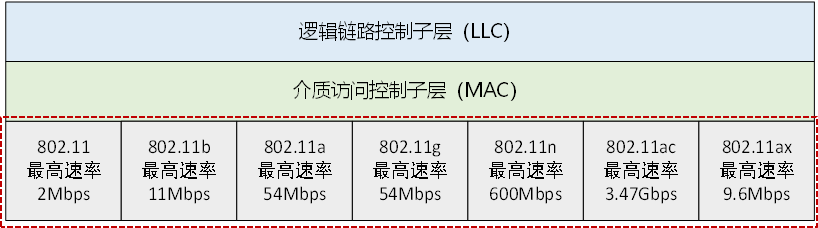

<!-- page: 12 -->

华南理工大学
IEEE 802.11介质访问控制

直接将CSMA/CD用于无线局域网？

•
冲突检测困难

•
在接收端，发送功率和接收功率相差太大

•
站点在发送时关闭接收功能，无法在发送时同时检测冲突

•
在同一BSS中，不是所有站点都能互相感知到对方发送的信号

•
载波侦听失败，但在接收站点处发生冲突

•
被称为隐藏终端问题

•
暴露终端问题，降低网络的吞吐量

•
信号衰落随时间发生变化，使问题变得更加复杂

12
4.5 无线局域网

<!-- page: 13 -->

华南理工大学
IEEE 802.11介质访问控制

无线传输相关的“范围”

•
传输范围(TX-Range)：成功接收帧的通信范围，取决于发送功率和无线电波传输特性

•
物理层侦听范围（PCS-Range ）：检测到该传输的范围，取决于接收器的灵敏度和无
线电波传输特性

•
干扰范围（IF-Range ）：在此范围内的节点如果发送不相关的帧，将干扰接收端的接
收并导致丢帧

干扰范围

传输范围

传输模式
接收模式

侦听范围

4.5 无线局域网

13

<!-- page: 14 -->

华南理工大学
IEEE 802.11介质访问控制

隐藏终端问题

•
由于距离太远（或障碍物）导致站点无法检测到竞争对手的存在

•
隐藏站点不能侦听到发送端但能干扰接收端

•
假设：A正在向B传输数据，C也要向B发送数据

A 的作用范围
C 的作用范围

目的端

（小于干扰范围）

（小于传输范围）

< IF-range

< TX-range

D
B
A
C
发送端
隐藏
站点

（大于侦听范围）

> PCS-range

4.5 无线局域网

14

<!-- page: 15 -->

华南理工大学
IEEE 802.11介质访问控制

暴露终端问题

•
由于侦听到其他站点的发送而误以为信道忙导致不能发送

•
暴露站点能侦听到发送端但不会干扰接收端

•
假设：B正在向A传输数据，C要向D发送数据

B 的作用范围
C 的作用范围

发送端

（小于侦听范围）

（小于传输范围）

< PCS-range

< TX-range

？

A
D

B
C

目的端
暴露
站点

（大于干扰范围）

> IF-range

4.5 无线局域网
15

<!-- page: 16 -->

华南理工大学
IEEE 802.11介质访问控制P242

图4-25利用CSMA/CA机制发送帧的时间序列示例

•
随机后退：0-15个时隙中选择

•
如果未收到肯定确认：后退时槽数翻倍

4.5 无线局域网
16

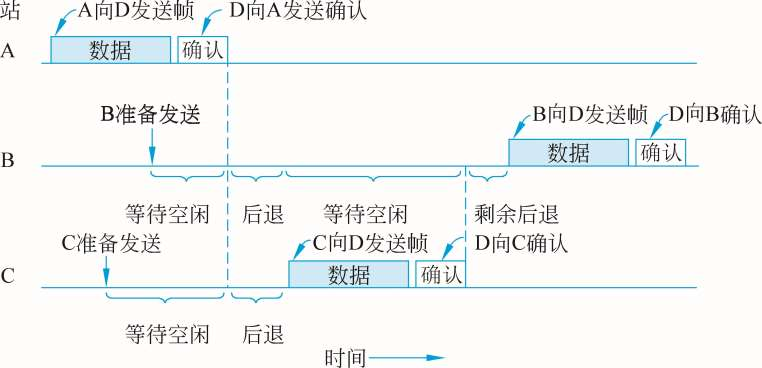

<!-- page: 17 -->

华南理工大学
IEEE 802.11介质访问控制P243-244

RTS-CTS机制（可选机制）

CTS

A

•
目的：通过信道预约，避免长帧冲突

B
C

•
发送端发送RTS（request to send）

D
RTS

•
接收端回送CTS（clear to send）

•
RTS和CTS中的持续时间（Duration）中指明传输所需时间（数据+控制）

•
其他相关站点能够收到RTS或（和）CTS，维护NAV

•
虚拟载波侦听（Virtual Carrier Sense）

•
RTS和CTS帧很短，即使产生冲突，信道浪费较少

4.5 无线局域网
NAV（Network Allocation Vector ）

17

<!-- page: 18 -->

华南理工大学
IEEE 802.11帧格式P247

802.11帧格式一般结构

2
2
6
6
6
6
2
4
0~2312
4

字节

QoS
控制
地址4
数据
CRC
校验

持续
时间
地址1
地址2
地址3
顺序
控制

帧
控制

共长2346字节

头尾共28字节

协议
版本

更多

电源
管理

更多
数据

安全
保护

帧
类型

子
类型

来自

去往

重传

顺序

DS

DS

段

比特
2

2

4

1

1

1

1

1

1

1

1

 00：管理帧
 01：控制帧
 10：数据帧
 11：保留

4.5 无线局域网
18

<!-- page: 19 -->

华南理工大学
IEEE 802.11帧格式

主要域段解释

•
帧控制：具有多种用途

•
持续时间：发送数据帧和确认帧可能持续的时间（NAV）或关联ID（AID）

•
地址1~地址4：每个地址的含义基于“去往DS”和“来自DS”域段确定

•
顺序控制：过滤掉重复帧，或用于分片组合(4位标识了段，12位标识了帧)

•
QoS控制域段：存放数据流的QoS信息（802.11e中扩展）

•
数据：包含任意长度的数据（0-2312字节）

•
CRC校验：802.11采用4个字节的校验码

4.5 无线局域网
19

<!-- page: 20 -->

华南理工大学
IEEE 802.11帧格式

帧控制域（11个子字段）

• 协议版本：通常为0

• 类型和子类型：如果子类型的最后一位设置为1，表示是QoS数据帧

• 更多段：用于长帧被分段的情况，1表示不是最后一段

• 重传：表明当前帧是以前帧的重传

• 电源管理：1表示节能模式；0表示活跃状态

• 更多数据：指明有更多的数据要发送（缓存）

• 安全保护：1表明采用802.11标准的安全机制，对数据进行保护

• 顺序：1指示接收者必须严格按照顺序处理

4.5 无线局域网
20

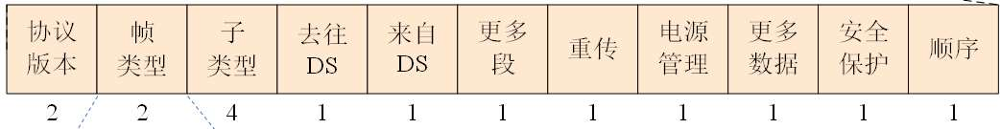

<!-- page: 21 -->

华南理工大学
IEEE 802.11帧格式

地址域段的使用
BSSID：基本服务集标识符，为AP的MAC地址

IBSSID
DA
SA
SA
DA

BSSID

说明
去往DS
来自DS
地址1
（物理接收者）

地址2
（物理发送者）

地址3
（逻辑发送者）

地址4
（逻辑接收者）

自组织模式
0
0
DA
SA
IBSSID
—

接收自AP
0
1
DA
BSSID
SA
—

发送到AP
1
0
BSSID
SA
DA
—

AP到AP
1
1
接收AP
发送AP
SA
DA

4.5 无线局域网
21

<!-- page: 22 -->

华南理工大学
IEEE 802.11帧格式

主要管理帧

持续
时间
地址1
地址2
BSSID
顺序
控制
数据
CRC
校验

帧
控制

类型
子类型
名称

00
0000
关联请求（Association Request）
00
0001
关联响应（Association Response）
00
0010
重新关联请求（Reassociation Request）
00
0011
重新关联响应（Reassociation Response）
00
0100
探测请求（Probe Request）
00
0101
探测响应（Probe Response）
00
1000
信标帧（Beacon）
00
1001
通知传输指示消息（ATIM）
00
1010
解除关联（Disassociation）
00
1011
认证（Authentication）
00
1100
解除认证（Deauthentication）

由AP周期发送

宣告自己存在

4.5 无线局域网
22

<!-- page: 23 -->

华南理工大学
IEEE 802.11帧格式

可以使用
Wireshark捕获
802.11帧，分析帧
结构和包含的内容。
例如Beacon帧的结
构，包含的BSSID、
SSID等

4.5 无线局域网

23

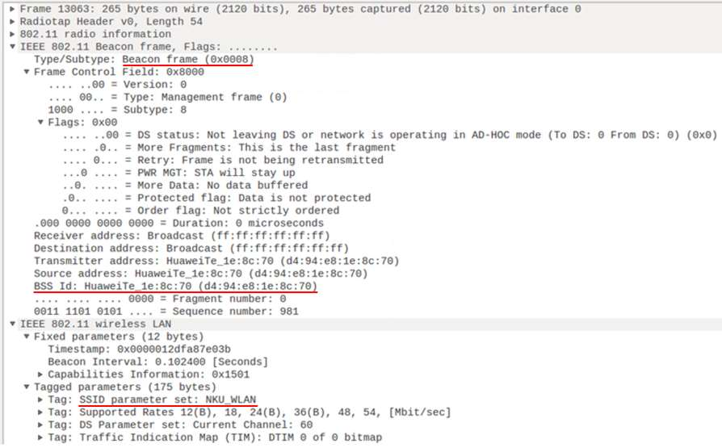

<!-- page: 24 -->

华南理工大学
IEEE 802.11帧格式

主要控制帧
RTS

持续
时间
地址1
地址2
CRC
校验

帧
控制

持续
时间
地址1
CRC
校验

帧
控制

CTS

持续
时间
地址1
CRC
校验

帧
控制

ACK

类型
子类型
名称

01
1010
PS-Poll

01
1011
RTS

01
1100
CTS

01
1101
确认帧（ACK）

01
1000
块确认请求帧（Block ACK Request）

01
1001
块确认帧（Block ACK）
4.5 无线局域网
24

<!-- page: 25 -->

华南理工大学
IEEE 802.11帧格式

主要数据帧

类型
子类型
名称

10
0000
数据帧（Data）

10
0100
无数据帧（Null）

10
1000
QoS数据帧（QoS-Data）

10
1100
QoS无数据帧（QoS Null）

4.5 无线局域网
25

<!-- page: 26 -->

填空题
3分

【出自2022考研408-47题】若H4向H5发送一个IP分组P，则H5收到的

封装P的802.11帧的地址1 [填空1] 、地址2 [填空2] 和地址3 [填空3] 分

别是什么？

正常使用填空题需3.0以上版本雨课堂

作答

1.1 模板使用说明
引自：XXXXX（如果需要）
26

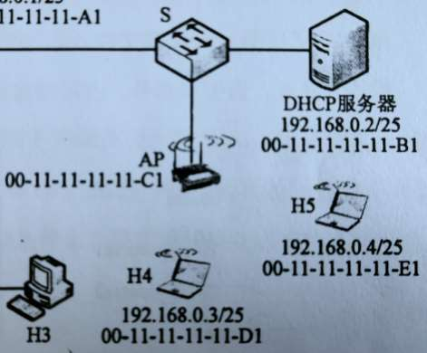

<!-- page: 27 -->

华南理工大学
无线局域网的构建与管理

基础架构模式

AP

BSS

• 通过AP接入有线网络（互联网络）

• 关键：如何关联到AP？

STA1
STA2

• BSSID：AP的MAC地址，标识AP管理的基本服务集

• SSID：32字节网名，标识一个扩展服务集（ESS），包含一个或多个基本服务集

• 关联到AP的三个阶段

• 扫描（Scan）、认证（Authentication）、关联（Association）

BSSID: Basic Service Set Identifier

胖AP: Fat AP，功能全面

SSID: Service Set Identifier

瘦AP: Fit AP，配合无线交换机组网

4.5 无线局域网
27

<!-- page: 28 -->

华南理工大学
无线局域网的构建与管理

被动扫描

• AP周期性发送Beacon帧，站点在每个可用的通道上扫描Beacon帧

• Beacon帧提供的AP相关信息包括：

•
Timestamp, Beacon Interval (eg.100ms), Capabilities, SSID, Supported Rates,

parameters

•
Traffic Indication Map（TIM）

4.5 无线局域网
28

<!-- page: 29 -->

华南理工大学
无线局域网的构建与管理

主动扫描

•
站点依次在每个可用的通道上发出包含SSID的Probe Request 帧，具有

被请求SSID的AP返回Probe Response帧

•
Probe Response帧包含AP相关信息：

•
Timestamp, Beacon Interval, Capabilities, SSID, Supported Rates,

parameters

4.5 无线局域网
29

<!-- page: 30 -->

华南理工大学
无线局域网的构建与管理

认证过程

•
当站点找到与其有相同 SSID 的 AP，在 SSID 匹配的 AP 中，根据收到

的 AP 信号强度，选择一个信号最强的 AP，然后进入认证阶段

•
主要认证方式包括：

•
开放系统身份认证 (open-system authentication)

•
共享密钥认证 (shared-key authentication）

•
WPA PSK认证（pre-shared key）

•
802.1X EAP认证

4.5 无线局域网
30

<!-- page: 31 -->

华南理工大学
无线局域网的构建与管理

关联过程

•
身份认证获得通过后， 进入关联阶段

•
站点向 AP 发送关联请求（Association Request）

•
包含：Capability, Listen Interval, SSID, Supported Rates

•
AP 向站点返回关联响应（Association Response）

•
包含：Capability, Status Code, Station ID, Supported Rates

•
AP维护站点关联表，并记录站点的能力（如能够支持的速率等）

4.5 无线局域网
31

<!-- page: 32 -->

华南理工大学
无线局域网的构建与管理

自组织模式

•
站点先寻找具有指定SSID的IBSS是否已存在。如果存在，

则加入；若不存在，则自己创建一个IBSS，发出Beacon，

等其他站来加入

STA

•
IBSS中的所有站点参与Beacon发送（保证健壮性），每个

站点在Beacon窗口竞争Beacon的产生。对于每个站点：

IBSS

•
确定一个随机数k

•
等待k个时间槽

•
如果没有其他站点发送Beacon，则开始发送Beacon

4.5 无线局域网
32

<!-- page: 33 -->

华南理工大学
无线局域网的构建与管理

站点漫游

• 当前的AP的通道质量下降时，站点漫游到不同的AP

• 通过扫描功能发现通道质量更好的AP

•
被动扫描

•
主动扫描

• 站点向新的AP发送重关联请求（Reassociation Request）

• 如果AP接受重关联请求

•
AP 向站点返回重关联响应（Reassociation Response）

•
如果重关联成功，则站点漫游到新的AP

•
新的AP通过分布系统通知之前的AP

4.5 无线局域网
33

<!-- page: 34 -->

华南理工大学
无线局域网的构建与管理

站点漫游示例

(1) 关联请求

分布式系统（DS）

(2) 关联响应

(3) 探测请求

(4) 探测响应

AP1
AP2

(5) 重关联请求

(2)
(6)
(3)
(3)

(1)

(4) (5)

(6) 重关联响应

4.5 无线局域网

34

<!-- page: 35 -->

华南理工大学
无线局域网的构建与管理

 站点睡眠管理

• 目的：延长电池的续航时间

• 基本思想：

• 无线网卡的空闲接收状态占电量消耗的主要部分，关闭无线网卡可以减少电量的消耗

• 关联的AP允许空闲站睡眠，AP跟踪睡眠的站点，并为之缓存数据，保证数据不丢失，

保证会话的持续性

• Beacons 中的TIM（Traffic Indication Map）通知睡眠站点有需要接收的数据

• 睡眠站点定期唤醒接收数据：如果有数据要接收，发送PS-Poll帧，请求AP发送数据帧

4.5 无线局域网
35

<!-- page: 36 -->

华南理工大学
无线局域网的构建与管理

 站点睡眠管理（续）

• 关联ID (Association Identifier，AID)：AP中保留AID表，每个AID与对应的站
点MAC地址进行绑定。

• AID的范围为0~2007，每个AP最多可以关联2007个节点。

• AID=0的位置为保留字段，不分配给节点，用以代表所有的组播和广播

• AID的分配：当一个站点向AP发起关联请求后，AP会反馈关联响应帧，AID在这
个过程中被分配，并告知站点。

4.5 无线局域网
36

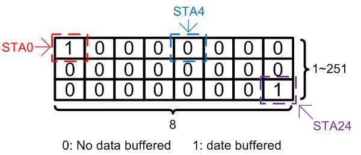

<!-- page: 37 -->

华南理工大学
Wi-Fi 6 核心技术概览

Wi-Fi 6 (802.11ax) 核心目标：解决网络容量和传输效率问题、降低传输时

延，相对于Wi-Fi 5，在高密部署场景中将用户平均吞吐量提升4倍以上，并

发用户数提升3倍以上

人均带宽(Mbps)

4.5 无线局域网

37

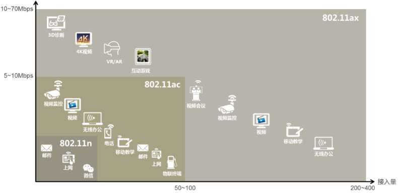

<!-- page: 38 -->

华南理工大学
Wi-Fi 6 核心技术概览

Wi-Fi 6核心技术：相对于Wi-Fi 5，Wi-Fi 6采用了如下新技术

• OFDMA频分复用技术：实现多站点并行传输，提升效率、降低时延

• DL/UL MU-MIMO技术：增加系统容量，提升用户的平均吞吐量

• 高阶调制技术 (1024-QAM)：提高单条空间流的传输速率，相对256-QAM提

升25%

• BSS 着色机制：信道合理划分和利用，提升高密部署环境无线网络的总体容量

• 扩展覆盖范围：采用Long OFDM symbol发送机制，降低终端丢包率，扩大覆

盖范围

4.5 无线局域网
38

<!-- page: 39 -->

华南理工大学
Wi-Fi 6 核心技术概览

OFDMA: Orthogonal Frequency Division Multiple Access

OFDMA 频分复用技术

• OFDM：每个时间片，一个用户占据整个信道的所有子载波，并且发送一个完整的数据包

• OFDMA：整个信道资源被分成固定大小的时频资源块（Resource Unit, RU)，每个RU至

少包含26个子载波，用户的数据承载在RU上。每个时间片上，可以有多个用户同时发送

数据

频率

频率
Wi-Fi帧

优势：
• 更细的信道资源分配
• 提供更好的QoS
• 更多的用户并发
• 更高的用户带宽

资
源
单
元

信
道
带
宽

时间

时间

OFDMA

OFDM

4.5 无线局域网

39

<!-- page: 40 -->

华南理工大学
Wi-Fi 6 核心技术概览

DL/UL MU-MIMO技术

• 理解什么是MIMO

多入单出（MISO）

单入单出（SISO）

单入多出（SIMO）

多入多出（MIMO）

多输入多输出（MIMO）：Multi Input Multi Output

4.5 无线局域网

40

<!-- page: 41 -->

华南理工大学
Wi-Fi 6 核心技术概览

DL/UL MU-MIMO技术

• MIMO可分为SU-MIMO与MU-MIMO，即单用户MIMO和

多用户MIMO

• 受限于尺寸，终端通常只有1个或2个空间流 (天线)，比AP的

空间流 (天线) 少，在AP 中引入MU-MIMO技术，同一时刻可

以实现AP与多个终端之间同时传输数据，增加系统容量，提

升用户的平均吞吐量

• Wi-Fi 5 (802.11ac) 支持下行 (DL) 4 x 4 MU-MIMO

• Wi-Fi 6 (802.11ax) 支持下行 (DL) 和上行 (UL) 8 x 8 MU-

MIMO

4.5 无线局域网
41

<!-- page: 42 -->

华南理工大学
Wi-Fi 6 核心技术概览

SU-MIMO与MU-MIMO（吞吐量对比）

注：MU-MIMO与OFDMA技术结合，可同时进行MU-MIMO传输和分配不同RU进行

多用户多址传输，可以增加系统并发接入量，提升多用户并发场景效率，降低应用时延

4.5 无线局域网

42

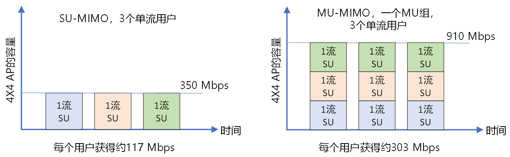

<!-- page: 43 -->

华南理工大学
Wi-Fi 6 核心技术概览

高阶调制技术 (1024-QAM)

• 802.11ac采用的256-QAM正交幅度调制，每个符号传输 8 比特数据（28 =256），

• 802.11ax 采用 1024-QAM正交幅度调制，每个符号位传输10 比特数据（210

=1024)，相对于802.11ac，802.11ax 的单条空间流数据吞吐量提高了25%

星座图

4.5 无线局域网

43

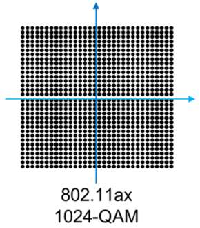

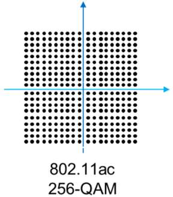

<!-- page: 44 -->

华南理工大学
Wi-Fi 6 核心技术概览

CCA：Clear Channel Assessment

BSS着色机制与动态CCA机制

• 802.11ac 及之前的标准，通过识别同频干扰强度，动态调整CCA阈值，

忽略同频弱干扰信号，实现同频并发传输

• 802.11ax中引入了一种新的同频传输识别机制，即 BSS着色 (Coloring)

机制

−每个BSS分配一种“颜色”，用前导码中增加6比特标识

−每个 STA 在关联时学习自己所属 BSS

−具有相同 BSS 颜色的信号使用较低的 CCA 阈值，减少了相同BSS中的冲突

−具有不同 BSS 颜色的信号使用较高的 CCA 阈值，允许更多同时传输

4.5 无线局域网

44

<!-- page: 45 -->

华南理工大学
Wi-Fi 6 核心技术概览

BSS着色机制与动态CCA机制：示例

• BSS1和BSS2使用同频信道，STA1关联到AP1，属于BSS1

• STA1针对BBS1的信号设定低CCA阈值，针对BSS2的信号设定高CCA阈值

低CCA阈值

高CCA阈值
注：对统一管理的高密部署
环境，该技术会有较好的效
果；对于非统一管理的环境，
可能会影响传输性能

BSS1
BSS2

AP1
AP1
STA1

4.5 无线局域网

45

<!-- page: 46 -->

华南理工大学
Wi-Fi 6 核心技术概览

优化站点睡眠管理

• Wi-Fi 6引入了目标唤醒时间 TWT，允许设备协商什么时候被唤醒和多久

会被唤醒，增加了设备的睡眠时间

• AP可以将站点分组到不同的TWT周期，以减少唤醒后同时竞争无线介质设

备的数量

TWT：Target Wakeup Time

4.5 无线局域网

46

<!-- page: 47 -->

华南理工大学
小结

WLAN的体系结构和构成

• AP和站点
• BSS
• ESS
介质访问方式：CSMA/CA

• 信道预约（虚拟侦听）：NAV
802.11帧格式
了解WiFi 6

• MIMO

1.1 模板使用说明
引自：XXXXX（如果需要）
47

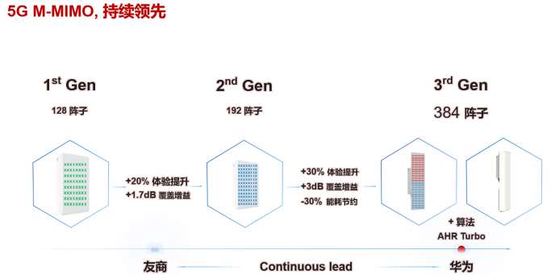

<!-- page: 48 -->

华南理工大学
特别鸣谢

本课程课件中的部分素材来自于：

• （1）库罗斯.罗斯、Tanenbaum & Wetherall、谢希仁、吴功宜、徐敬东等出版的

《计算机网络》教材

• （2）思科网络技术学院教程

• （3）H3C网络学院系列教程

• （4）网络上搜到的其他资料

在此，对清华大学出版社、思科网络技术学院、H3C网络学院、电子工业

出版社、机械出版社以及其它提供本课程引用资料的个人表示 衷心的感谢！

对于本课程引用的素材，仅用于教学，如有任何问题，请与我们联系！

48
