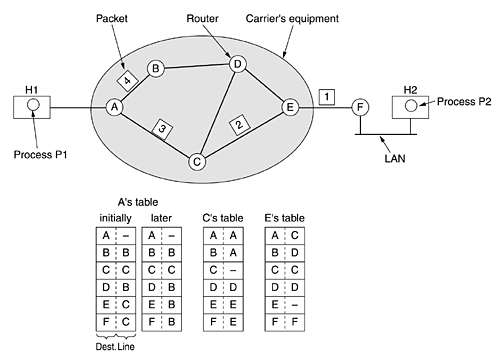
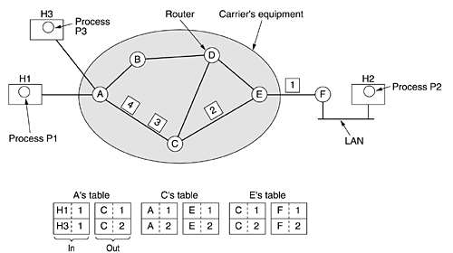
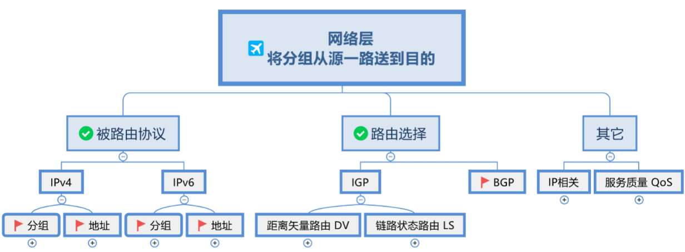
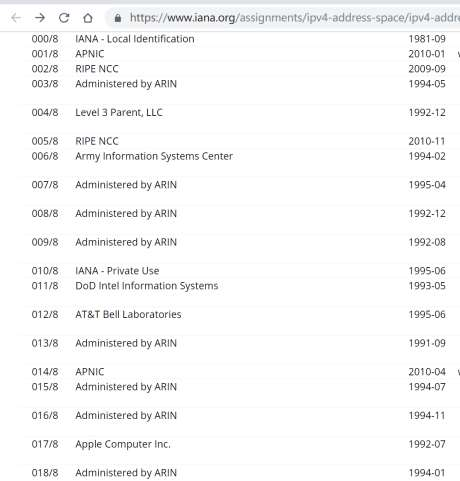
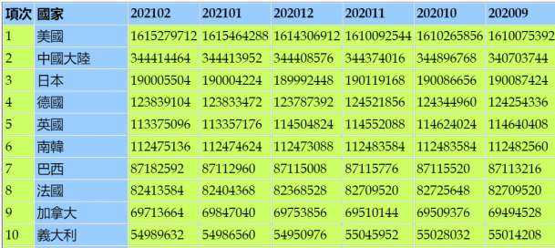
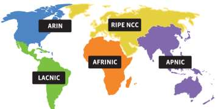
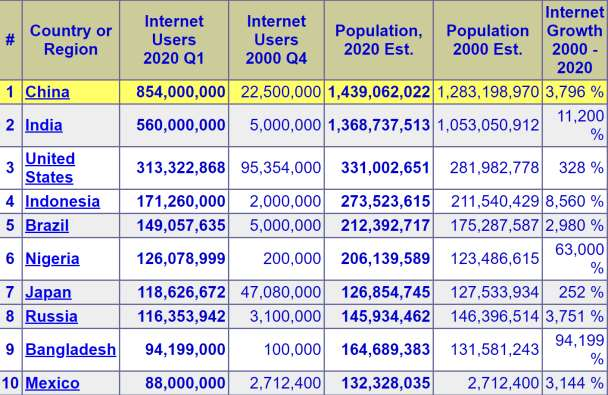
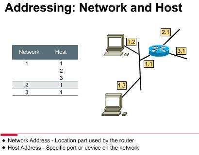

# 20230509_第5章 导学_20230619170405

<!-- page: 1 -->

1

第5章 网络层（导学）

袁华，hyuan@scut.edu.cn

华南理工大学计算机科学与工程学院

广东省计算机网络重点实验室

<!-- page: 2 -->

网络层的位置和功能

主要功能：如何将源机数据包一路送到目目

机器。

2

<!-- page: 3 -->

源 和 目的 之间

通信网络

3

<!-- page: 4 -->

对应的通信网络的结构P278~280

虚电路网络（Virtual-circuit subnet）

在连接建立的时候选路（Select a path）

每个分组携带一个连接号（connection-number）

当通信完成后，连接拆除

数据报网络（Datagram subnet）

每个数据报携带目的地址

每个报文独立寻径、乱序到达

4

<!-- page: 5 -->

无连接的服务—数据报网络

jam

5

<!-- page: 6 -->

面向连接的服务-虚电路网络P270~280

Lable Switch

6

Lable Switch

<!-- page: 7 -->

两种通信网络的比较


虚电路网络


 通过路径选择后建立连接


 到终点后毋需重新排序


 每个分组不需带目的地址，但带虚电路号（较短）


 主机工作量少，差错检查、流量控制对用户透明。


数据报网络


 网络工作简单，通信费用低。


 每个分组分别选择最佳路径，健壮性较好


 到终点后需重新排序


 差错控制和排序工作由协议高层（主机）完成


 每个分组必须带目的地址，路径选择灵活。

7

<!-- page: 8 -->

比较表P280

比较项目
数据报网络（无连接服务）
虚电路网络（面向连接服务）

建立电路
不需要
要求

地址信息
每个分组含完整的SA和DA
每个VC包含一个很短的VC号
码

每个VC都要求路由器建立表项

状态信息
路由器不保留任何连接状态信
息

路由
每个分组独立选择路由
每个分组沿建立VC时确定的路
由

所有经过失效R的VC都终止

路由器失效影响
没有，只有系统崩溃时丢失分
组

服务质量

总资源（带宽、缓存）足够的
情况下，采用提前给每个VC分
配资源的方法，很容易实现
拥塞控制

很难实现

8

<!-- page: 9 -->

问题

虚电路网络是否不需要进行路径选择？

（path-select 、routing algorithm)?

9

<!-- page: 10 -->

主要内容

10

<!-- page: 11 -->

被路由协议

IPv4

第一代互联网的核心协议之一

IPv6

第二代互联网的核心协议之一

任何一台设备，必须具有IP地址，怎么查看

IP地址呢？

11

<!-- page: 12 -->

IP地址的本质属性

IP地址的表示：32位，点分十进制，天生2层

结构

网络号！

网络前缀！

IP地址定义了一台设备的网络位置，而不仅仅

是一个名字！

全网唯一
网络位置改变了，IP地址必须相应改变！（搬家了）
一台设备可以有多个IP地址（Multihomed）

12

<!-- page: 13 -->

IP分类地址

你的IP地址是哪类？

A、B、C三类地址

网络类型
最高字节取值
网络数量
网络容量
网络规模

A
D：0~127
B：0*******
128-2
1600万
大

B
D：128-191
B：10******
1.6万
6.5万
中

C
D：192-223
B：110*****
200万
254
小

有类地址的问题：极大的浪费！

13

<!-- page: 14 -->

各类IP地址的占比

American Registry
for Internet Numbe

A类网络地址数最少

（128个），但总

数最多，126 ⅹ

（224-2）

施乐

DEC
HP

MIT

14

<!-- page: 15 -->

IPv4地址数排名：第二

人均约0.2个，而美国4、5个人拥有一个IP

15

<!-- page: 16 -->

可是，中国网民人数第一！

2022年6月，中国网民人数10.5亿！

地址缺口巨大！

16

<!-- page: 17 -->

特殊的IP地址

32位全为0：0.0.0.0  （P349）


这个主机、这个网络，短暂用作源

路由器指定的默认路由
32位全为1：255.255.255.255  Flood Broadcast


限制广播地址、本地广播
主机部分全为0，如172.16.0.0  网络地址
主机部分全为1，如172.16.255.255  Direct

Broadcast

路由器用于直接广播
127.*.*.*  环回地址 Lookback
169.254.*.*，非正常地址

17

<!-- page: 18 -->

寻址（Addressing）

IP寻址

MAC寻址

18

<!-- page: 19 -->

两种寻址方式的比较

适用的网络范围不同，MAC寻址只适合于小型网络；

所依赖的地址结构不同，MAC是平面地址，IP是结构

化、层次化地址，其本身携带了位置信息；

所处的OSI模型层数不同；

地址数目的限制，IP地址正在耗尽，而MAC地址暂无

耗尽的危险；

两种地址的格式不一样。

19

<!-- page: 20 -->

Any Question？

20

