# 20230517_第5章IPv4（part1)（1）_20230619170421

<!-- page: 1 -->

第五章_IPv4协议_地址（1）

袁华：hyuan@scut.edu.cn

华南理工大学计算机科学与工程学院

广东省计算机网络重点实验室

<!-- page: 2 -->

课前热身（弹幕）

IEEE802.11标准的主要推手是？

IEEE802.11的基本服务集BSS包含哪些设备？

扩展服务集ESS由什么构成？

如果要连到互联网，ESS/BSS需要连接到哪里？

802.11采用什么来进行访问控制？

802.11帧（2346B）中的地址1和地址2分别是什么？

802.11的演进中，数字带宽是主要的目标，有哪些新技术去促成

指标的达成？

<!-- page: 3 -->

预习完成情况（约83%）

总人数76人

56+7人完成

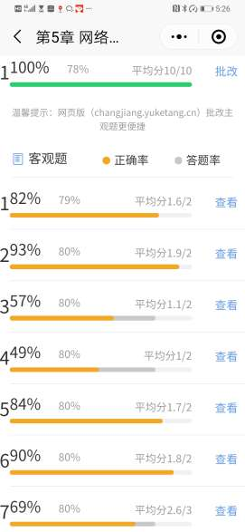

<!-- page: 4 -->

网络层的重要地位

核心层之一，极其重要

重要 == 简单（某种程度）

尽力将分组从源送达目的！

源机           目的机

host           host

<!-- page: 5 -->

IP在哪里？

围绕网络层功能展开：路由、被路由、其它

IP分组/IP编址

信封

从源送
达目的

其它
路由
RIP/OSPF/BGP

NAT/CIDR/ICMP/ARP。。。

<!-- page: 6 -->

为什么需要IP？IP的胶水/黏合作用 P339

异构网络遍布全球

胶水：IP

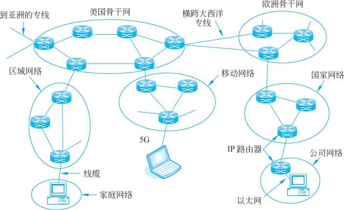

<!-- page: 7 -->

IP是什么？

互联网协议：Internet Protocol

IP为路由提供路由所需要的信息，比如IP地址、数据、数据尺寸

等，并把这些信息封装在分组/报包（Packet）中。

主要包括两方面的内容

IP地址编址

IP分组格式

<!-- page: 8 -->

为什么需要IP地址？

网卡

为了将分组送达，必须知道分组要去哪里！

IP地址

IP分组中的第11、12个字段（源、目的）

谁需要IP地址？

Internet

主机、路由器、其它设备

确切地说：是接口！

网卡

<!-- page: 9 -->

IP地址的本质属性

IP地址的表示：32位，点分十进制，天生2层结构

网络号！

网络前缀！

IP地址定义了一台设备的网络位置，而不仅仅是一个名字！

全网唯一

网络位置改变了，IP地址必须相应改变！（搬家了）

一台设备可以有多个IP地址（Multihomed）

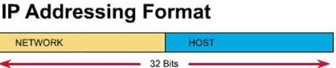

<!-- page: 10 -->

回顾：IP分类地址

你的IP地址是哪类？

A、B、C三类地址

网络类型最高字节取值
网络数量
网络容量
网络规模

A
D：0~127
B：0*******
128-2
1600万
大

B
D：128-191
B：10******
1.6万
6.5万
中

C
D：192-223
B：110*****
200万
254
小

有类地址的问题：极大的浪费！

<!-- page: 11 -->

各类IP地址的占比

American Registry
for Internet Numbers

A类网络地址数最少（128个），

但总数最多，126 ⅹ（224-2）

施乐

DEC
HP

MIT

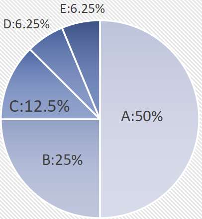

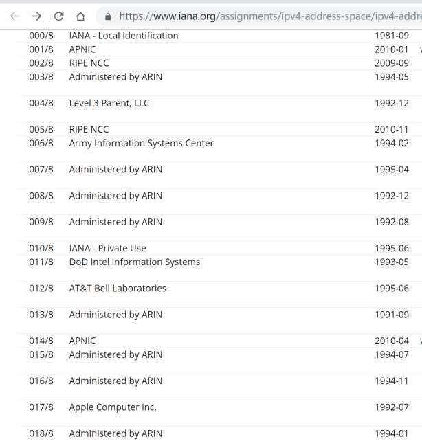

<!-- page: 12 -->

IPv4地址数排名：第二

人均约0.2个，而美国4、5个人拥有一个IP

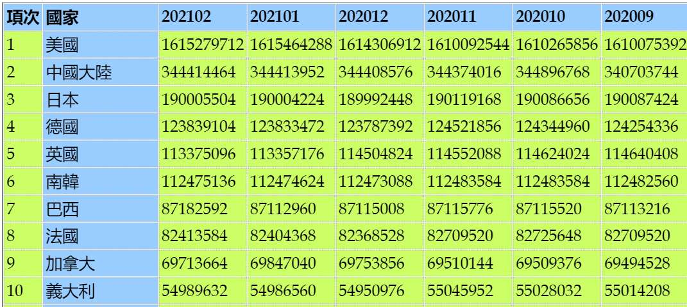

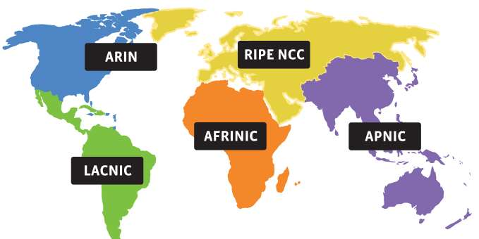

<!-- page: 13 -->

可是，中国网民人数第一！2023年6月，中国网民人数10.5亿！

地址缺口巨大！

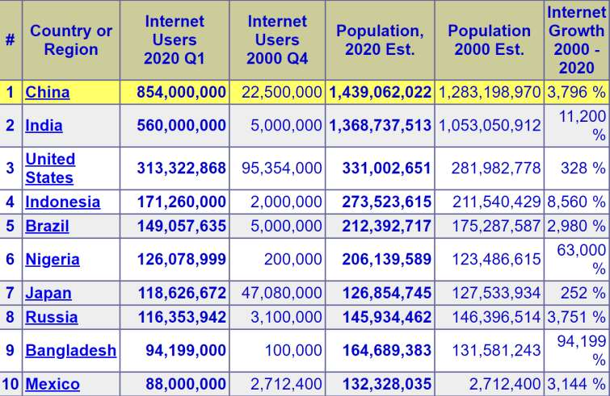

<!-- page: 14 -->

特殊的IP地址

32位全为0：0.0.0.0  （P349）

这个主机、这个网络，短暂用作源

路由器指定的默认路由

32位全为1：255.255.255.255  Flood Broadcast

限制广播地址、本地广播

你电脑所在的网络地址

主机部分全为0，如172.16.0.0  网络地址

和广播地址是多少？

主机部分全为1，如172.16.255.255  Direct Broadcast

路由器用于直接广播

127.*.*.*  环回地址 Lookback

169.254.*.*，非正常地址

<!-- page: 15 -->

还有哪些特殊地址？

D类（组播地址）、E类地址

私人地址

不具备全球唯一性

但须 内网唯一

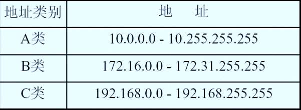

<!-- page: 16 -->

单选题
2分

下面的哪一个是合法（可分配给主机）的 IP 主机地址？

1.254.255.255

A

127.2.3.5

B

225.23.200.9

C

192.240.150.255

D

提交

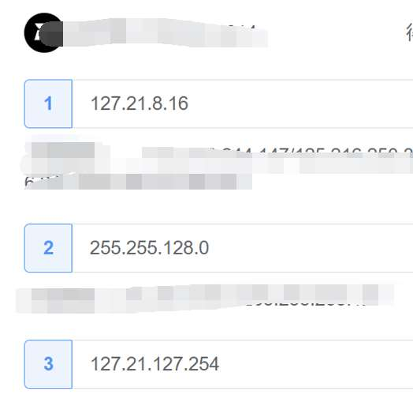

<!-- page: 17 -->

单选题
2分

找出下述地址中能分配给主机的IP地址是哪个？

128.10.0.0

A

231.202.0.15

B

101.26.3.83

C

192.168.22.255

D

202.256.14.52
E

提交

<!-- page: 18 -->

单选题
2分

用于本地广播(对本地网络上的所有主机进行广播)的目的IP地址是：

127.255.255.255

A

127.0.0.0

B

164.0.0.0

C

255.255.255.255

D

提交

<!-- page: 19 -->

单选题
2分

一台多宿主主机挂接到了两个不同的网络中（双网卡），所以它有两个

IP地址，其中一个是212.123.4.219，另外一个IP地址可能是哪个？

212.123.4.255

A

一个网络就是一个子网，一

个LAN，一个广播域！

212.123.4.0

B

具有相同的网络号！

212.123.4.254

C

212.1.5.6

D

提交

<!-- page: 20 -->

重点：子网规划

规划子网时需要考虑两个因素：

所需的子网数量

所需主机地址的数量

确定可用主机数量的公式2n-2 （n是主机位）

2n (其中n为剩余的主机位的数量) 用于计算主机数量

-2 在每个子网中不能使用子网ID和广播地址

借位规则：

从主机域的高位开始借位，用作子网位；

主机域至少保留 2 位。

<!-- page: 21 -->

注意

子网掩码：用以确定一个地址所在的网络。两种表示方式：点分

十进制和前缀表示法 （区分出一个地址中的网络位和主机位）

A、B、C三类地址对应的缺省子网掩码分别如下

A：255.0.0.0   ==  /8

B：255.255.0.0    ==  /16

C：255.255.255.0   ==   /24

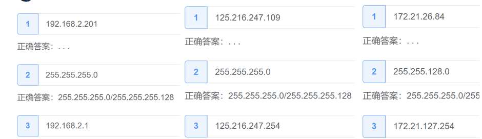

<!-- page: 22 -->

No.3 正确率57%

借位原则

可借1位

至少保留2位

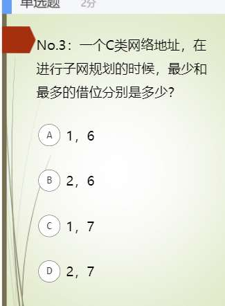

<!-- page: 23 -->

子网规划实例（1/2）

例：设某单位分到了一个C类网络号193.71.56.0。按照东、西、南、北、中区

将单位网分成五个子网，每个子网需要连接20台主机，问如何规划子网地址？

     答：1）确定需要向最后一个8位组（主机位）借的位数：如果借2位，可以创

建4个子网，不够，借3位，可创建可用子网8个，8大于5，可满足子网数量的

要求；剩下的5位可用IP地址有（25-2）=30个，30大于20，满足每个子网20

台主机的需求；

2）子网掩码：11111111. 11111111. 11111111.11100000，

转化为 255.255.255.224 ，还可表示为 “/27”

3）制定表格表示各个子网可用IP范围、网络地址、广播地址等

<!-- page: 24 -->

子网规划实例 （2/2）
发现了什么规律?

网络地址/

可用的

子网
序号

子网网络地址
广播地址

子网掩码

地址范围

1

193.71.56.0
193.71.56.31
193.71.56.1~30

2
193.71.56.32
193.71.56.63
193.71.56.33~62

3
193.71.56.64
193.71.56.95
193.71.56.65~94

193.71.56.0/

4
193.71.56.96
193.71.56.127
193.71.56.97~126

255.255.255.
224

5
193.71.56.128
193.71.56.159
193.71.56.129~158

6
193.71.56.160
193.71.56.191
193.71.56.161~190

7
193.71.56.192
193.71.56.223
193.71.56.193~222

8
193.71.56.224
193.71.56.255
193.71.56.225~254

<!-- page: 25 -->

子网规划技巧

例：一个主机的IP地址是202.112.14.37，掩码是255.255.255.240，

要求计算这个主机所在网络的网络地址和广播地址。

解答：

1）从掩码推算子网可容纳的IP地址数量：容纳的IP地址有256－240＝16个（包括

网络地址和广播地址）；

2）子网网络地址是可容纳IP数量的整数倍，如202.112.14.16；

3）网络地址＜子网IP地址＜广播地址，而广播地址是下一个网络地址减1，如32 ＜

37 ＜47（48-1），所以202.112.14.37所在的网络地址和广播地址分别是

202.112.14.14.32和202.112.14.47。

<!-- page: 26 -->

单选题
2分

一个主机的IP地址是202.112.14.137，掩码是255.255.255.224，计算

这个主机所在网络的网络地址和广播地址。

202.112.14.128、202.112.14.159

A

202.112.14.129、202.112.14.159

B

202.112.14.127、202.112.14.159

C

202.112.14.128、202.112.14.160

D

提交

<!-- page: 27 -->

课前热身（弹幕）

你理解的IP是什么？

IP地址不仅仅是一个名字，其本质特征有哪些？

IPv4地址是怎么表示的？

IPv4地址为什么要分类？好处和坏处分别有哪些？

一台主机的IPv4地址和默认网关有什么关系？

子网掩码有什么用？最小子网的子网掩码是什么？

子网规划中，借位原则是什么？

<!-- page: 28 -->

子网规划技巧

例：一个C类地址，需要具有10台主机的子网，请进行子网地址的

规划和计算子网掩码。

解答：

1）计算子网需要的IP地址数量，如10+1+1=12；

2）找到满足大于所需IP数量的最小2n，如12<16=24；

3）n就是主机位数，确定借位，如4位主机位，借位8-4=4；

4）写出子网掩码，如255.255.255.240，其中240=256-16；或

8*3+4=28，“/28”

<!-- page: 29 -->

单选题
2分

某单位分配到一个C类地址202.38.197.0，每个子网需要40台主机，

请选择所需借位和子网掩码。

2，255.255.255.192

A

3，255.255.255.224

B

5，255.255.255.240

C

4，255.255.255.240

D

提交

<!-- page: 30 -->

传统子网划分浪费地址

传统子网划分——为每个子网分配

相同数量的地址。

需要较少地址的子网中存在未使用

（浪费）的地址。例如，链路只需要

2个地址。

可变长子网掩码（VLSM）或细分子

网可以提供更有效的地址使用。

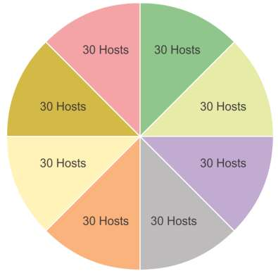

<!-- page: 31 -->

可变长子网掩码(VLSM)

VLSM允许将网络空间分为大小不等

的部分。

子网掩码将依据为特定子网所借用的

位数而变化。

先对网络划分子网，然后再将子网进

一步划分子网。

根据需要重复此过程，以创建不同大

小的子网。

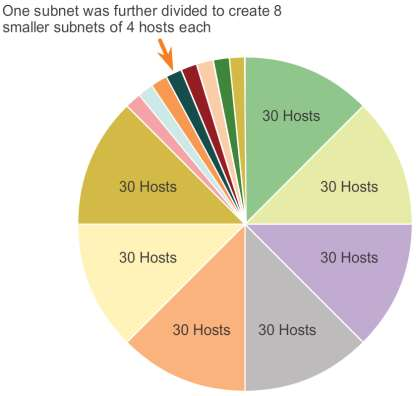

<!-- page: 32 -->

基本VLSM

细分子网

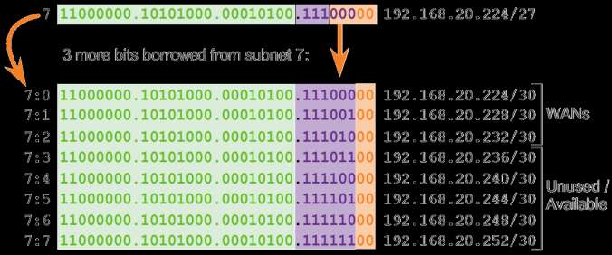

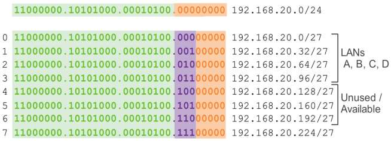

<!-- page: 33 -->

VLSM的实际运用   （默认网关）

Internet

Router
Router

Switch
Switch

PC4

PC1

PC5

PC3

PC2

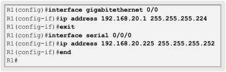

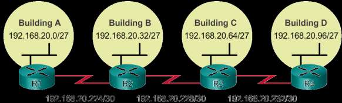

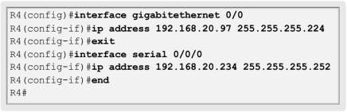

<!-- page: 34 -->

一个示例：

只有一个地址：192.168.15.0/24

需求分析

主机数

子网数

如果使用定长的子网划分，会怎样？

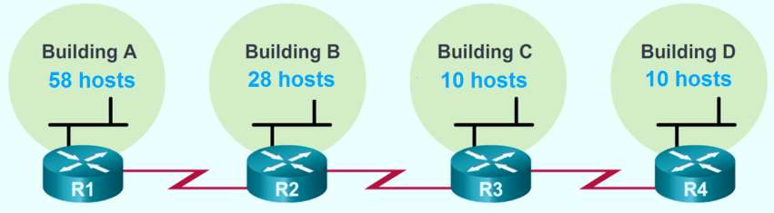

<!-- page: 35 -->

192.168.15.0/24

.XX000000
192.168.15.0/26
192.168.15.64/26 192.168.15.128/26
192.168.15.192/26

192.168.15.64/27
.XXX00000

192.168.15.96/27

.XXXX0000
192.168.15.96/28
192.168.15.112/28

子网A 58

子网B
28 台主机

子网C
10 台主机
子网D
10 台主机

台主机

<!-- page: 36 -->

（续）

192.168.15.0/26
192.168.15.64/26 192.168.15.128/26
192.168.15.192/26

.XXXXXX00
192.168.15.128/30 192.168.15.132/30
192.168.15.136/30

R1-R2
2个接口

R2-R3
2个接口
R3-R4
2个接口

<!-- page: 37 -->

单选题
2分

如果网络125. 6 . 0 . 0的子网掩码是2 5 5 . 2 5 5 . 2 2 4 . 0，下

面的哪一个是合法的主机地址？

125.6.63.255

A

125.6.61.255

B

125.6.32.0

C

125.6.224.0

D

提交

<!-- page: 38 -->

单选题
2分

一个 IP地址是1 6  . 3 . 3 4 . 6 5，其子网掩码是2 5 5 . 2 5 5 . 2 5 5 .

2 2 4，试问该IP地址所在的子网络的合法IP地址的范围是多少？

16.3.34.64 - 16.3.34.96

A

16.3.34.64 - 16.3.34.95

B

16.3.34.65 - 16.3.34.94

C

16.3.34.65 - 16.3.34.95

D

提交

<!-- page: 39 -->

综合分析：根据这个拓扑图，分析D和E为什么不能通信？怎

样改正？（子网掩码都是255.255.255.0，即/24）

131.130.11.0
子网3

131.130.12.0
子网4

路由器

131.130.11.1
131.130.12.1

A
B

131.130.19.1

C

131.130.19.2

E

131.130.19.0
子网1

131.130.20.1

D

131.130.20.0
子网2

131.130.19.3

<!-- page: 40 -->

填空题
10分

C要发一个分组，D和E及所在的子网能收到，但A和B收不到，目的

IP地址应该是什么？ [填空1]

A要发一个分组，C、D、E都收不到，但B及所在的子网可以收到，

目的IP地址应该是什么？ [填空2]

131.130.11.0
子网3

131.130.12.0
子网4

路由器

131.130.11.1
131.130.12.1

A
B

131.130.19.1

C

131.130.19.0
子网1

131.130.19.2

E

D

131.130.19.4

131.130.19.3

正常使用填空题需3.0以上版本雨课堂

作答

<!-- page: 41 -->

主观预习题

查并写本机的 IP地址、子网掩码和默认网关 三个信息

注意：

子网掩码确定了子

网的大小

IP地址和默认网关

在同一子网

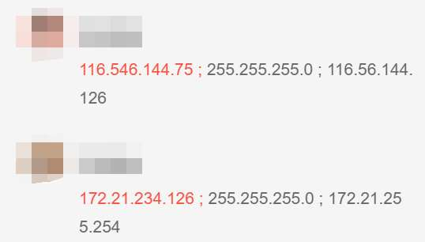

<!-- page: 42 -->

一位同学的真实案例（弹幕讨论）

Internet

Router
Router

Switch
Switch

能正常上网吗？

PC4

PC1

PC5

PC3

PC2

注意：

子网内的通信

子网外的通信

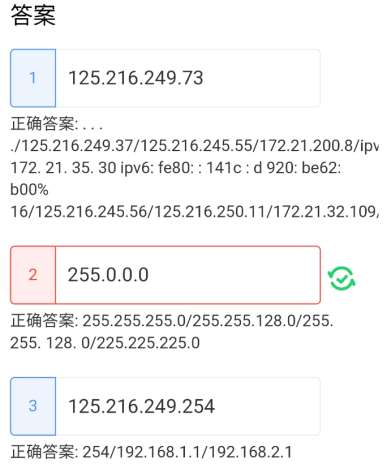

<!-- page: 43 -->

小结

IP地址

属性：唯一性、位置

表示：点分十进制

分类及特殊地址

子网规划：借位

定长子网掩码

可变长子网掩码VLSM

<!-- page: 44 -->

有问题吗？

