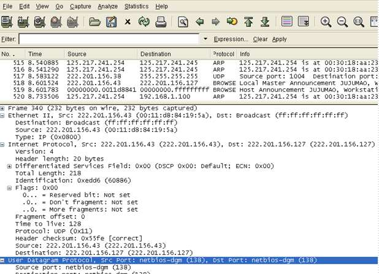
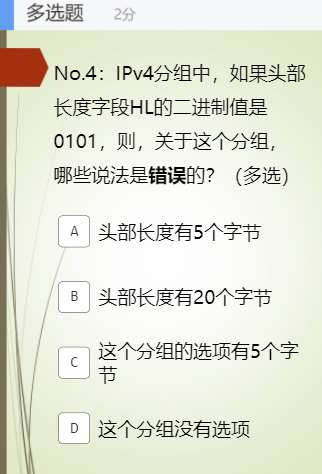

# 20230519_第5章IPv4（part1）(2）_20230619170440

<!-- page: 1 -->

第五章_IPv4协议_分组（2）

袁华：hyuan@scut.edu.cn

华南理工大学计算机科学与工程学院

广东省计算机网络重点实验室

<!-- page: 2 -->

IP是什么？

互联网协议：Internet Protocol

IP为路由提供路由所需要的信息，比如IP地址、数据、数据尺寸

等，并把这些信息封装在分组/报 （Packet）中

主要包括两方面的内容

IP分组格式

IP地址编址

<!-- page: 3 -->

IP数据报/分组长什么样？（弹幕）

0                        8                      16                                         31

1st
2nd
4th

3rd

6th

2
0
B
报
头

5th
7th

8th
10th

9th

11th

12th

4
0
数据段

13th
14th

数据域

3

<!-- page: 4 -->

0        4          8                    16                                     31
P340

服务
类型

数据报总长度

协议
版本

头部
长度

数据报标识号
标志
分片偏移

2
0
B

分
组
/
包
头

生存时间
用户协议
报头检验和

源站点IP地址

目的站点IP地址

数据报选项
填充
4
0

数据

<!-- page: 5 -->

真实的IP分组长什么样？

<!-- page: 6 -->

No.4得分率 49%

<!-- page: 7 -->

单选题
2分

4位头部长度的二进制取值范围是下面哪一个？

0000-1111

A

0000-0101

B

0101-1010

C

0101-1111

D

提交

<!-- page: 8 -->

单选题
2分

一个IP分组头部的第一个字节是01001100，且长度字段的十进制值

是40000，问，该IP分组的 数据字段 有多长？

39988字节

A

有选项吗？

选项是多少字节？

40012字节

B

40048字节

C

39952 字节

D

提交

<!-- page: 9 -->

分组中关于分片/分段的字段！

Fragment！

<!-- page: 10 -->

0        4          8                    16                                     31

服务
类型

数据报总长度

协议
版本

报头
长度

数据报标识号
标志
分片偏移

2
0
字
节
报
头

生存时间
用户协议
报头检验和

源站点IP地址

目的站点IP地址

3比特和13比特P341
• 分组是否分片
• 帮助收方重组

数据报选项
填充
4
0

数据

<!-- page: 11 -->

分片/分段相关的三个字段341

16位数据包标识（idenfication）

唯一地标识了这个数据报，绑定一个计数器

3个标记位：

保留
DF
MF

1位：保留

DF位：DF=1表明不允许分段（don’t fragment）

MF位：MF=0表明是最后一个分段（more fragment）

13位分段偏移量：表明分段在数据包中的位置

2**13=8192，以8字节为单位

<!-- page: 12 -->

为什么要分片/分段？

数据包（分组）长度的限制

硬件限制

物理网络对帧的最大字节数限制，由硬件决定，称为最大传

输单元（MTU）。

MTU


软件限制： IPv4的最大值216-1

帧头
数据字段
帧尾

MTU: Maximum Transfer Unit

《TCP /IP Protocol Suite》定义：数据链路层的帧格

式中，数据字段的最大尺寸。

<!-- page: 13 -->

为什么要分片/分段？（续）

不同的网络的MTU有差别！

而IP包（分组）穿越的网络路径是不确定的，即可能要穿越不同

MTU的网络！

网络类型
MTU（字节）

Token Ring（4M）
4464

FDDI
4352

Ethernet
1500

X.25
576

802.11
2272

<!-- page: 14 -->

适应不同MTU的解决方案

数据包（分组）长度的定义原则

以不超过IP版本规定的数据报总长度为前提

取源机所在物理网络的MTU为数据报长度

分片条件和方法

条件1：转出网络的MTU不能承载目前的报文

条件2：且DF=0，允许分片

分成若干较小的分片传输，每部分为“分片/分段”，

除了最后一个分片，其余分片均为最大。

<!-- page: 15 -->

在何处实行分片？

主机A
主机B

网络1

网络3

MTU=1500

MTU=1500

从小到大

从大到小

R1
R2

网络2

实行分片
无须分片

MTU=620

<!-- page: 16 -->

在哪里进行分片的重组？

重组只在信宿机完成

减轻网关（gateway）负担，简化路由协议

简单、高效，体现“尽力传递”设计思想

在接收端设置重组计时器

接收到数据报的第一片时立即启动计时；

如果在规定时间内未收到全部分片，则放弃整个数据包，向信源机发送出

错信息。

<!-- page: 17 -->

注意：P338

3个标记位

第1位：未使用

第2位：DF（Don't Fragment）

第3位：MF（More Fragment）

标记是否是最后一个分片
分片偏移量（13位）

指明分片在数据 分组/包 中的位置

单位是：8Byte

2^13=8192片

<!-- page: 18 -->

举个例子

有一个数据包/分组长4000字节，分组头部的标记位DF=0。现

在该分组要穿越一个MTU=1500字节的网络，必须分片。假如IP

分组头部长20字节。问：需要几个分片？每个分片的偏移量是多

少？（假设没有选项）

4000B
1500B
1500B
1500B

<!-- page: 19 -->

解答

因为分组头部长20字节，所以，每个分片承载的数据最长为：1480

字节

每个分片最多能够承载的数据是：[1480/8]下取整*8=185*8=1480B

共需要的分片数为：[（4000-20）/ 1480 ]上取整=3（2.57）

第一个分片：0~184,1480B  （F1：DF=0，MF=1，0）

第二个分片：185~369,1480B（F2：DF=0，MF=1，185）

第三个分片：370~500,1020B（F3：？）

<!-- page: 20 -->

单选题
2分

刚才这个题目中，第三个分片中的标记位DF、MF和分片偏移的

值分别是多少？

0，0，185

A

1，0，370

B

0，0，370

C

0，1，370

D

提交

<!-- page: 21 -->

更一般化：

设分组长度L，待转出网络的MTU为M

只要L>M，且DF=0，则需要分片

除了最后一个分片，其它分片均为最大允许的载重，表示为：

（下取整）

8
8
20
-
M
d





=





=
d

20
-
L
n

所需总的分片数是：                     （上取整）

<!-- page: 22 -->

更一般化：（续）

每个分片的片偏移量字段值为：

n
i
1
1
-i
8
d
Fi



=
）
（

每个分片的总长度字段为：



+
=
n
i
d
L





1
20
Li

n
i
d

=

−
−

)1
n
(

每个分片的标记位为：

1
1
MF
0
i
n
i
n


= 
=


i

<!-- page: 23 -->

主观题
5分

为什么片偏移量的单位要设置为8字节？（弹幕讨论）

正常使用主观题需2.0以上版本雨课堂

作答

<!-- page: 24 -->

分片带来的问题

增加了中间路由器、目的机的开销

可能的安全隐患(如TearDrop，ping of death…….)

怎么办？

不分片！（DF=1）

PMTU（Path MTU）（类型3代码4 ICMP消息）

<!-- page: 25 -->

弹幕讨论：IPv4学习完了，你认为

IPv4有什么缺点？

<!-- page: 26 -->

小结

IPv4分组：头部+数据

头部长度

分片

生存时间（跳数）

上层协议（6、17）

校验和

源IP、地址目的IP地址

分片偏移量的计算

<!-- page: 27 -->

有问题吗？

