# 20230524_第5章IPv6（part1）(3）_20230619170454

<!-- page: 1 -->

第五章 网络层（Part1）_IPv6（3）

袁华：hyuan@scut.edu.cn

华南理工大学计算机科学与工程学院

广东省计算机网络重点实验室

<!-- page: 2 -->

IPv4回顾（弹幕）

为什么要规划子网地址？

子网划分后的IP地址成了几层结构？

划分子网节约还是浪费了IP地址？

IP分组由哪些部分构成？

IPv4分组为什么要有选项？

网络层分片会带来什么问题吗？

你认为IPv4有什么缺点？

<!-- page: 3 -->

IPv6的主要内容

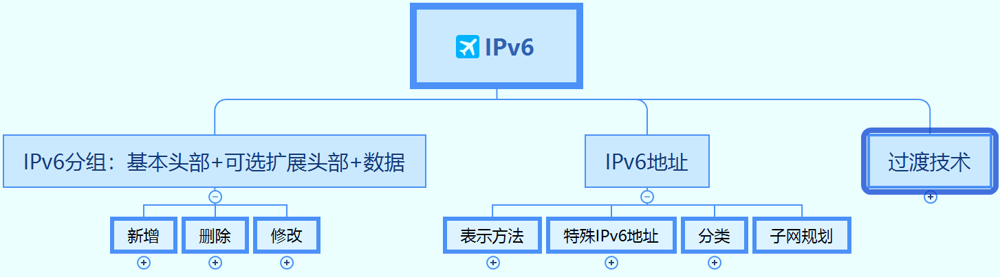

<!-- page: 4 -->

IPv6的主要改进P354

地址

升位

头部

……

简化

改进

安全
服务

质量

<!-- page: 5 -->

IPv6基本术语

邻节点
邻节点

主机
主机
主机
主机

交换机
内部子网路由器

局域网段

路由器

链路

子网

其它子网

网络

<!-- page: 6 -->

IPv6地址

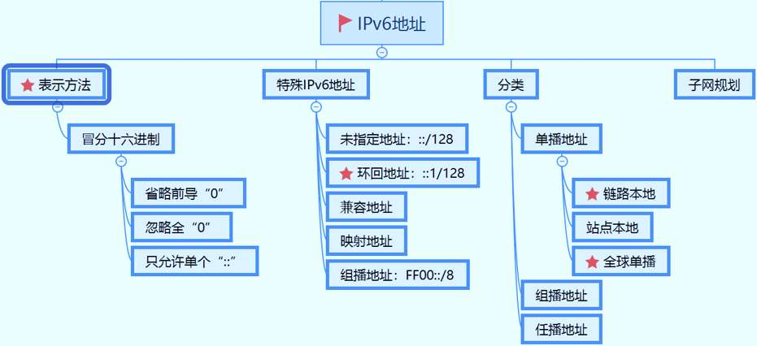

<!-- page: 7 -->

IPv6的最显著变化—地址空间

IPv4：232=4×109（约43亿）

弹幕：有必要这么多地址吗？

IPv6地址空间：

2128=3.4×1038=340涧（1涧=10**36）

340,282,366,920,938,463,463,374,607,431,768,211,456

连线到离地球最近的银河系仙女恒星（250万光年），每纳米140万个

全球人均每人5×1028个

每平方厘米6.7×1019个地址

可以说，世界上每一粒沙子都可以分到一个IP地址

<!-- page: 8 -->

IPv6地址首选格式：冒分十六进制

如何书写一个128位的地址？

0010000000000001000001000001000000000000000000000000000000000001

0000000000000000000000000000000000000000000000000100010111111111

8

<!-- page: 9 -->

IPv6地址表示（1/3）

0010000000000001000001000001000000000000000000000000000000000001
0000000000000000000000000000000000000000000000000100010111111111

0010000000000001  0000010000010000  0000000000000000  0000000000000001
0000000000000000  0000000000000000  0000000000000000  0100010111111111

2001:0410:0000:0001:0000:0000:0000:45ff

规则1：省略前导0

2001:410:0:1:0:0:0:45ff

规则2：忽略全0

2001:410:0:1::45ff

<!-- page: 10 -->

单选题
2分

IPv6地址“2340:0000:0000:0000:0000:119A:A001:0000”，可以简写

为以下哪个？

2340::119A:A1::0

A

2340::119A:A001:0000

B

2340::119A:A001::

C

2340::119A:A001:0

D

提交

<!-- page: 11 -->

IPv6地址的分类

单播地址（Unicast Address）

链路本地地址

站点本地地址

全球单播地址

组播地址（Multicast Address）

任播地址（Anycast Address）

<!-- page: 12 -->

什么是链路本地地址？

只能在同一本地链路节点之间使用，

如何生成链路本地地址？FE80::/64

前64位：FE80:0:0:0

注意：这是MAC地址变的呵！

后64位：EUI-64地址

24

40

ccccccug cccccccc cccccccc

11111111 11111110 xxxxxxxx xxxxxxxx xxxxxxxx

10
64
54

1111111010
0
Interface ID

<!-- page: 13 -->

怎么做到即插即用的？

启动时，生成链路本地地址

该地址可和网关通信，获得全球IPv6地址前缀；

有了前缀，后缀呢？

手工

EUI-64地址

随机生成

也可利用DHCP获得上网所需的IP地址、网关、DNS服务器等

<!-- page: 14 -->

特殊的IPv6地址分类

地址类型
二进制前缀
IPv6标识

未指定
00...0  (128 bits)
::/128

环回地址
00...1  (128 bits)
::1/128

组播
11111111
FF00::/8

链路本地地址1111111010
FE80::/10

网点本地地址1111111011
FEC0::/10

<!-- page: 15 -->

全球单播地址

由格式前缀 (FP) 001 标识 ，设计目标是聚合或汇总该地址以便

产生有效的路由基础结构

ISP商分配的前缀：/48

Site拓扑：由组织机构划分子网

接口ID：64

3
13
8
24
16
64

001
TLA
RES
NLA
SLA
Interface ID

提供商分配的前缀
接口ID
Site

<!-- page: 16 -->

组播地址

Flags

用来表示permanent或transient组播组

Scope

Scope:
0：预留
1：节点本地范围
2：链路本地范围
5：站点本地范围

表示组播组的范围

Group ID

组播组ID

<!-- page: 17 -->

IPv6地址新类型 — 任播（Anycast）

用于标识一组网络接口

目标地址为任播地址的数据报将发送给最近的一个接口

适合于One to One-of-Many的通讯场合

<!-- page: 18 -->

注意：各类地址的应用范围

18

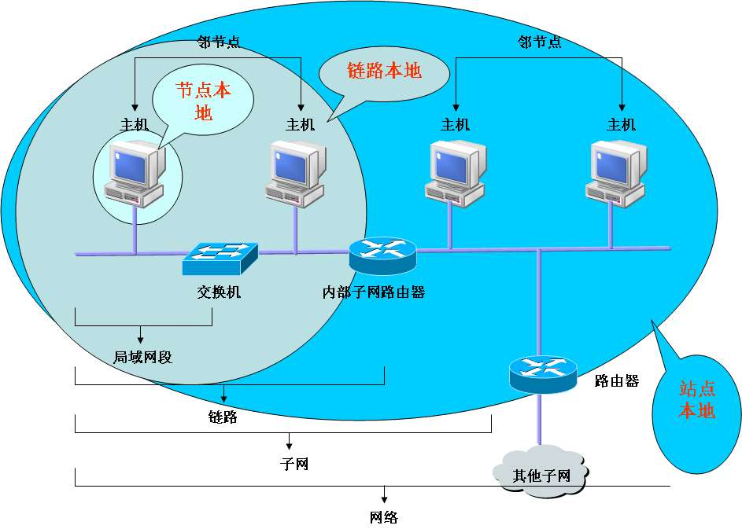

<!-- page: 19 -->

IPv6地址子网规划

IPv4 子网划分是管理地址稀缺性……

IPv6 子网划分是根据路由器的数量及它们所支持的网络来构建

寻址分层结构。

19

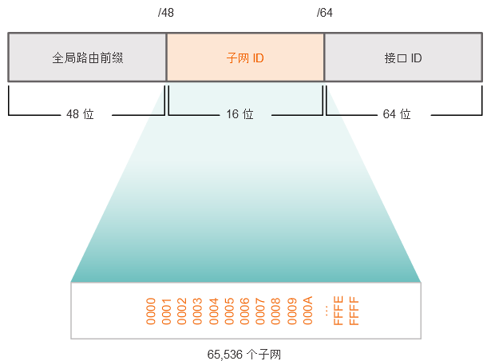

<!-- page: 20 -->

如果真的需要，在半字节边界划分

无需借位规划

20

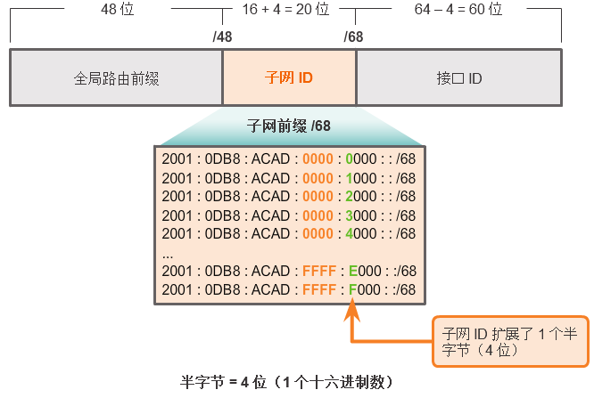

<!-- page: 21 -->

单选题
2分

下面哪个地址是本地链路地址？

0::1/128

A

FEC0::24A2

B

FE80:12/64

C

FF02::0/8

D

提交

<!-- page: 22 -->

IPv6地址的分配情况（截止到2023年4月）

截至2023年4月，中国IPv6地址数量为64325块 /32，世界排名

第二。

https://www.china-ipv6.cn/#/

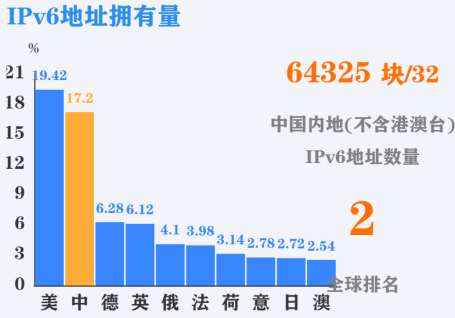

<!-- page: 23 -->

投票
最多可选1项

看看你的手机，是否获得了IPv6地址？是什么样的IPv6地址？

有，FE80::开头的链路本地地址

A

有，2****开头的全球单播地址

B

有，3****开头的全球单播地址

C

无
D

状态
信息

提交
设置
系统
关于
手机

<!-- page: 24 -->

IPv6分组(packet)

三部分构成或二部分构成

二部分：基本头部+数据

三部分：基本头部+扩展头+数据

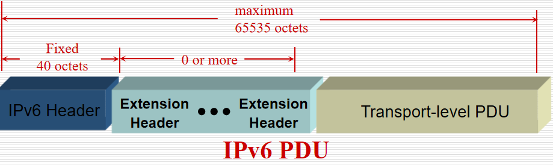

<!-- page: 25 -->

IPv6基本头（固定头） P355

基本头部构成

8个字段，共40字节

弹幕：为什么取消

IPv4的选项字段？

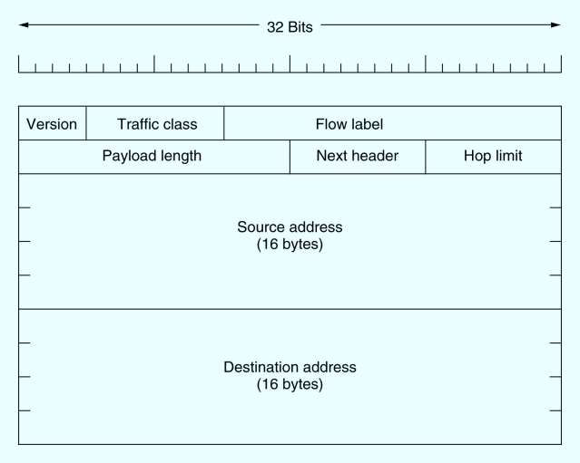

<!-- page: 26 -->

IPv6分组格式

IPv6 的分组头在起始64比特之后是128比特的源地址和目的地址，

全长为40字节。

以太帧类型值
协议名

0x0800
IPv4
0x08DD
IPv6
0x0806
ARP

0x8100
802.1Q

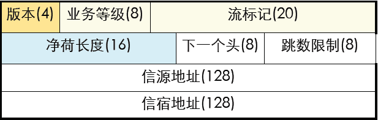

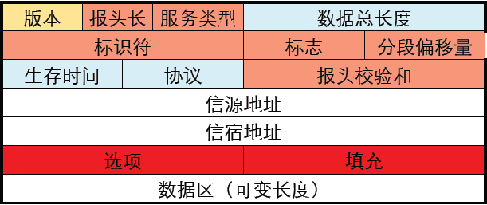

<!-- page: 27 -->

报头变化小结 P352

修改的

Addresses increased 32 bits -> 128 bits

Time to Live -> Hop Limit（跳数限制）

Protocol -> Next Header

Type of Service -> Traffic Class（流量类别）

删掉的

Fragmentation fields moved out of base header(主头部)

IP options moved out of base header

Header Checksum eliminated

Header Length field eliminated

Length field excludes IPv6 header

增加的：Flow Label field added

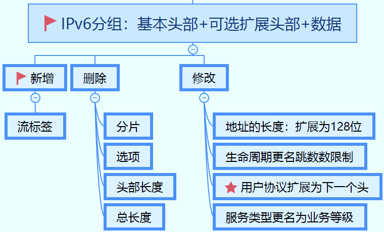

<!-- page: 28 -->

IPv6 扩展头 P354

目前，已经定义了6种扩展头

扩展头是可选的，可以有0~6个扩展头，但须按顺序排列

扩展头有固定的格式

其他扩展头包含可变数目的可变长度域

每个可变项都被编码成 (Type, Length, Value) 三元组

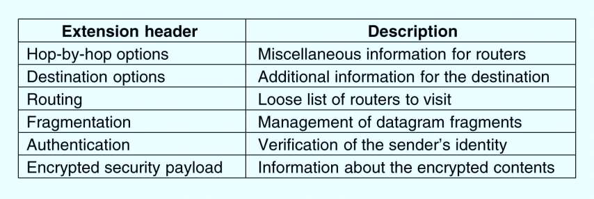

<!-- page: 29 -->

基本报头、扩展报头和上层协议的关系

每一种扩展报头其实也有自己特定的协议号，例如：路由报头为43，AH报

头为51

每一个基本报头和扩展报头的protocol字段标识后面紧接的内容

IPv6报头
Next Header=6
TCP段

IPv6报头
Next Header=43

路由报头
Next Header=6

TCP段

IPv6报头
Next Header=43

AH报头
Next Header=6

路由报头
Next Header=51

TCP段

<!-- page: 30 -->

来个真的！

IPv6分组

ICMP消息

<!-- page: 31 -->

单选题
2分

下面哪些是IPv6分组中的必须项？

基本头部

A

扩展头部

B

选项

C

A和B

D

提交

<!-- page: 32 -->

单选题
2分

IPv6基本头部中的哪个字段规定了这个分组的生命周期？

跳数限制

A

优先级

B

下一个头

C

生存时间

D

提交

<!-- page: 33 -->

IPv4-IPv6过渡技术

双栈技术

所有的设备都支持双栈，优选IPv6

隧道技术

各式各样的隧道，自动隧道、手动隧道

翻译转换技术

IPv4-IPv6网关

<!-- page: 34 -->

最多可选1项
投票

你是否使用过IPv6访问网络资源？

是的，经常使用

A

是的，用过几次

B

从来没有用过

C

提交

34

<!-- page: 35 -->

怎样开始我的IPv6实践？

目前主流操作系统、浏览器都支持IPv6！

只要你所处的网络支持IPv6，即可访问IPv6资源！

ipconfig

ping6

http://www.kame.net

http://ipv6.ustb.edu.cn/

<!-- page: 36 -->

测试细节

http://test-ipv6.com/

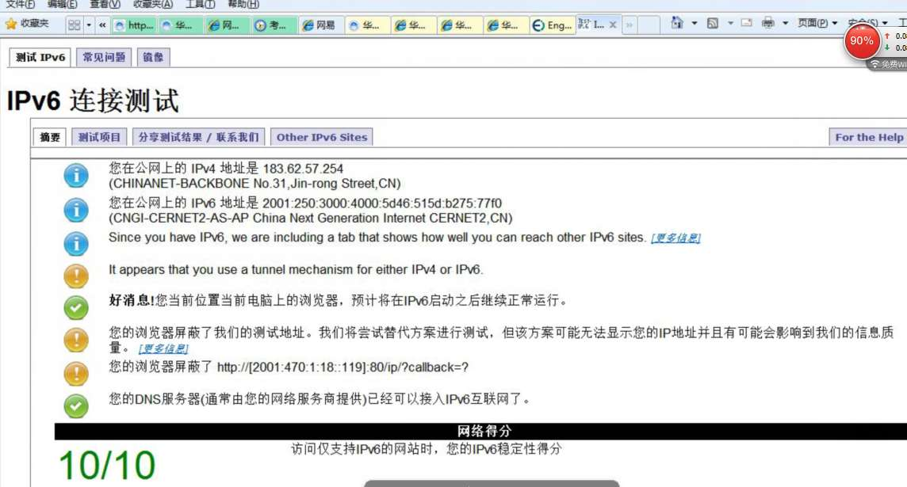

<!-- page: 37 -->

中国的IPv6部署正在加速！

2017年11月26日，国务院办公厅：

《推进互联网协议第六版（IPv6）规模部署行动计划》

2018年4月，加快《。。计划》  的通知

2019年4月1日，工业和信息化部关于开展2019年IPv6网络就绪专项行动

的通知

获得IPv6地址的LTE终端比例达到90%，获得IPv6地址的固定宽带终端比例达到40%

LTE网络IPv6活跃连接数达到8亿

全部13个互联网骨干直联点IPv6改造

<!-- page: 38 -->

国家IPv6发展监测平台

中国信息通信研究院，2019年开始

运行：https://www.china-ipv6.cn

指导单位：中央网络安全和信息化

委员会办公室，工业和信息化部，推

进IPv6规模部署专家委员会

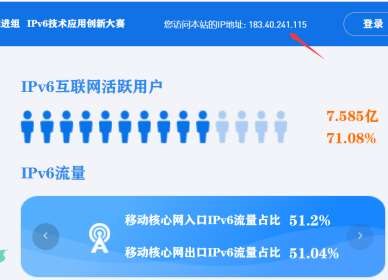

<!-- page: 39 -->

云服务就绪度100%

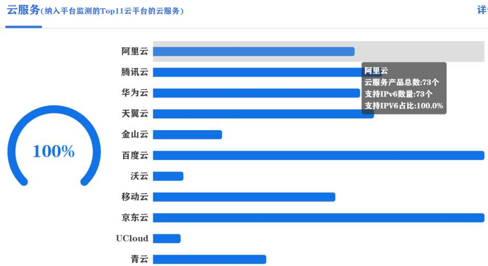

<!-- page: 40 -->

网络就绪100%

指国家IPv6发展监测平台实时监测到的我国网络基础设施IPv6支

持情况。包括：骨干网、承载网、城域网、LTE移动核心网、互联

网骨干直联点、国际出口等

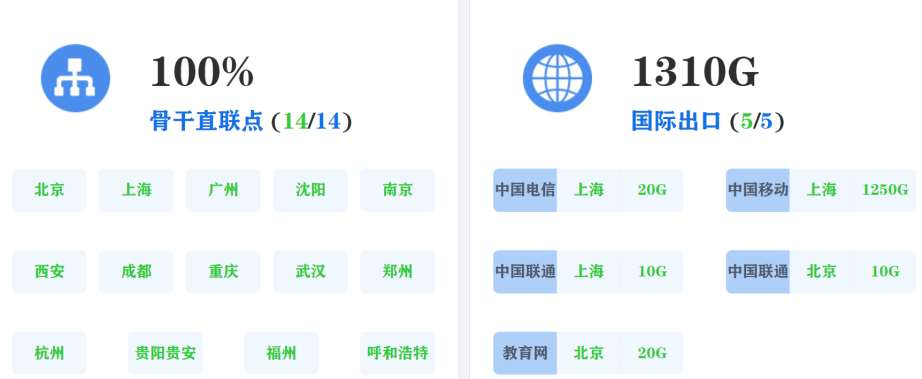

<!-- page: 41 -->

终端就绪

家用路由器

智能家庭网关100%

LTE移动终端

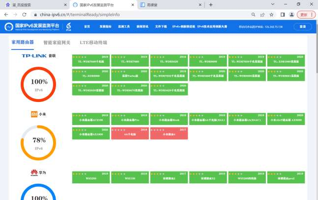

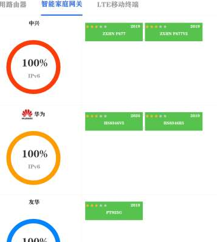

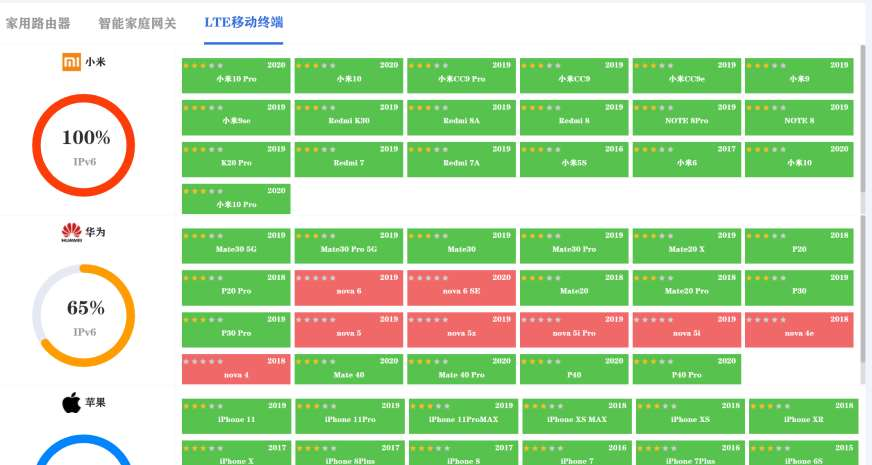

<!-- page: 42 -->

网站支持率

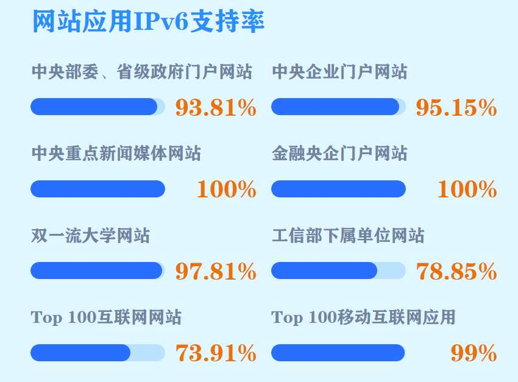

<!-- page: 43 -->

小结

IPv6势在必行，但进展缓慢（再弹幕一波）

IPv6协议

IPv6地址

IPv6分组

开始我的IPv6实践

我自己：电信接入的可以访问，办公室的可以；有线电视接入的不可以

<!-- page: 44 -->

Thanks！

