# 20230526_第5章_路由（Part2）_20230619170509

<!-- page: 1 -->

第五章 网络层（Part2）路由选择

袁华：hyuan@scut.edu.cn

华南理工大学计算机科学与工程学院

广东省计算机网络重点实验室

<!-- page: 2 -->

课前热身：IP（弹幕）

MAC地址、IPv4地址、IPv6地址分别是多少二进制位？

IPv6地址空间有多大？

IPv6地址采用冒分十六进制表示，双冒号表示几个0？

本地链路地址的64位前缀长什么样子？

包裹

目前，全球单播地址的最高4位二进制位是多少？

从源送
达目的

IPv6分组由几部分构成？

其它
路由

相比IPv4分组，IPv6分组中唯一增加的字段是？意欲何为？

2

<!-- page: 3 -->

预习情况

网工班：59/73=81%

计科1：81/91=89%

3

<!-- page: 4 -->

路由是什么？（找到一根最优的路）

网络层的主要功能：（？）将分组从源机 一路 送达目的机！

寻址

IP寻址（全局寻址）

MAC寻址 （局域寻址）

一路上会遇到什么？

交换机（MAC寻址的接力）

路由器！（IP寻址的接力）

4

<!-- page: 5 -->

寻址（Addressing）

IP寻址

MAC寻址

Internet

Router
Router

Switch
Switch

PC4

PC1

PC5

PC3

PC2

5

<!-- page: 6 -->

两种寻址方式的比较

适用的网络范围不同，MAC寻址只适合于小型网络；

所依赖的地址结构不同，MAC是平面地址，IP是结

构化、层次化地址，其本身携带了位置信息；

所处的OSI模型层数不同；

地址数目的限制，IP地址正在耗尽，而MAC地址暂

无耗尽的危险；

两种地址的格式不一样。

6

<!-- page: 7 -->

路由器的主要功能

路由器处理接到一个分组后：

重新封装的主要内容：

第一步：打开分组（de-encapsulation）

TTl-1

第二步：确定目标网络（“与”），查找路由表

Checksum

第三步：重新封装（？），转发

分片（可能）

主要功能

源MAC地址、目的

路由（Routing）

MAC地址

转发（Forward）

other

7

<!-- page: 8 -->

数据（Packet）如何流经路由器？

封装开始（源）

路由器（中间）

第1、2、3步

解封装（目的）

8

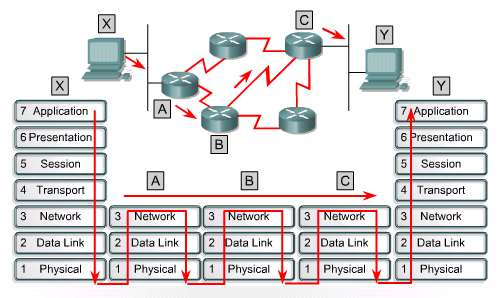

<!-- page: 9 -->

弹幕：那么路由表中的路由从何而来？

路由表的样子

目的网络

下一跳（本地接口）

代价

9

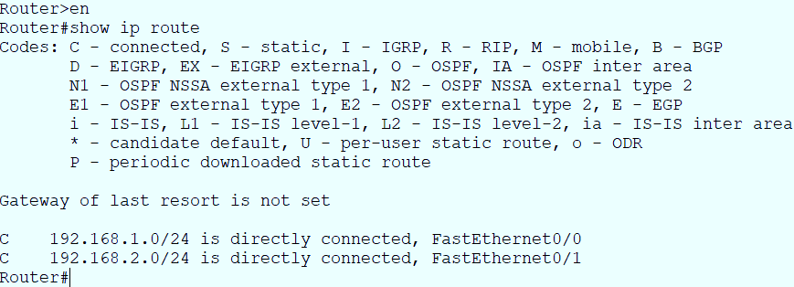

<!-- page: 10 -->

路由选择协议知多少？

以AS（Automatic System）为界，根据路由选择协议运行的位

置划分为两大类

10

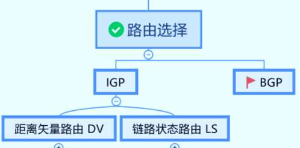

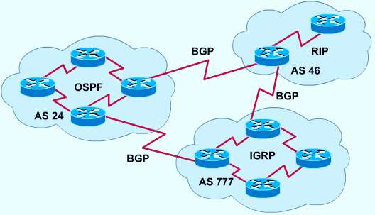

<!-- page: 11 -->

DV主要内容（XMind）

11

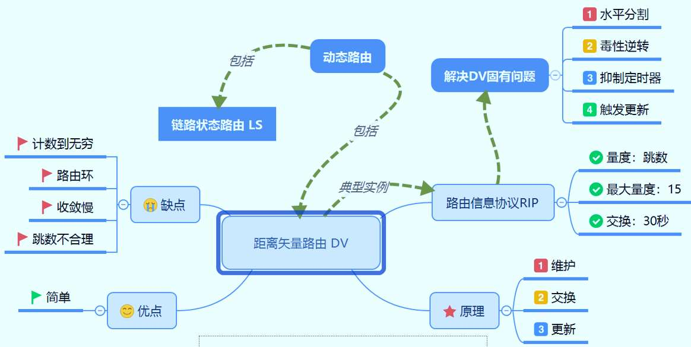

<!-- page: 12 -->

RIP的工作原理示例

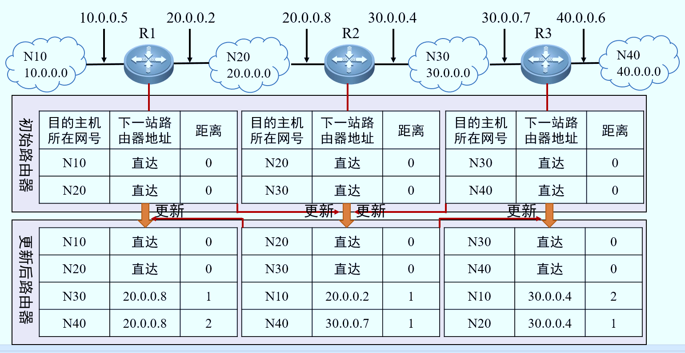

<!-- page: 13 -->

讨论（弹幕讨论）

超过15跳就不可达，意味着穿过的路由器个数不能超过15个，

这限制了RIP，它只能用于小型的网络，为什么要有这个15跳的

限制呢？（最大代价15跳）

13

<!-- page: 14 -->

DV路由可能遇到的问题

问题表现

路由环路（ routing loop）

计数到无穷问题（ Count to infinite）

收敛慢的问题（ slow Convergence ）

原因

相信错误的路由信息导致

14

<!-- page: 15 -->

好消息传得快，坏消息传得慢！

怎么办？

水平分割、毒性逆转、抑制定时器、触发更新

15

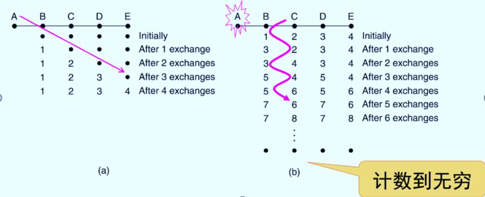

<!-- page: 16 -->

路由面临的复杂情况

途经线路、站点以及目的网络都是动态变化的，最佳路径也要跟随

发生变化，需要及时获取状态变化信息。

在站得不够高、跟得不够紧的情况下，只能直接获取近邻信息，远

处信息通过逐站信息传播而间接获取，有可能传播、学习到错误的、

过时的信息。

最坏情况，全网传播和学习过时的信息，永远无法达到稳定状态：

算法不收敛。

站得高才能看得远，确定全局最佳路径，但是站得高需要付出代价。

16

<!-- page: 17 -->

单选题
2分

某自治系统采用 RIP 协议，若该自治系统内的路由器 R1 收到其邻居路

由器 R2 的距离矢量中包含的信 息<net1，16>，则可能得出的结论是?

（2010考研真题）

R2 可以到达 net1，代价是 16

A

R1 可以通过R2到达 net1，代价是17

B

R1 不能通过R2到达net1

C

R2 可以通过R1到达net1 ,代价是17

D

提交

17

<!-- page: 18 -->

LS主要内容（Xmind）

基本原理：5步

典型实例：OSPF

18

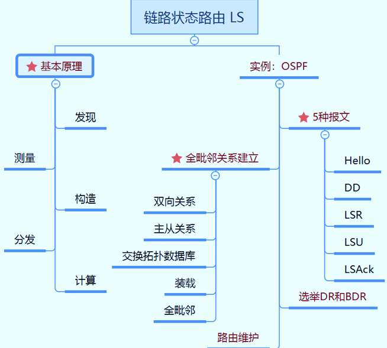

<!-- page: 19 -->

单选题
2分

关于链路状态路由选择协议的原理5步曲，正确的顺序应该是哪个？

设置、发现、分发、构造、计算

A

发现、设置、构造、分发、计算

B

发现、设置、分发、构造、计算

C

发现、构造、设置、分发、计算

D

提交

19

<!-- page: 20 -->

链路状态路由（Link State）  P288

在1979年前，ARPANET采用DV路由（RIP）协议，此后，采用了

LS，目前，链路状态路由算法得到了广泛的应用

链路状态路由的主要思想包括如下5个部分：

发现它的邻居节点们，了解它们的网络地址

设置到它的每个邻居的成本度量

构造一个分组，包含它所了解到的所有信息

发送这个分组给所有其他的路由器

计算到每个路由器的最短路径

20

<!-- page: 21 -->

单选题
2分

弹幕讨论：每个路由器根据LSP/LSA构造出来的图（Graph）是一样的

吗？

为什么Graph一样？

不是

A

是

B

计算出来的树一样吗？

不一定

C

提交

21

<!-- page: 22 -->

B有三个邻居，

它的保留区
为什么需要保留区？

基本算法：泛洪

收到LSA/LSP后

比较seq

新的才泛洪

E’s LSP arrive

again from C.

并不马上动作，

0 0 0 1 1 1

而是进入保留区

空闲时，按照保

留区指示动作

22

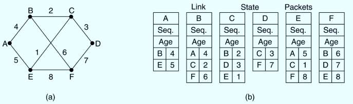

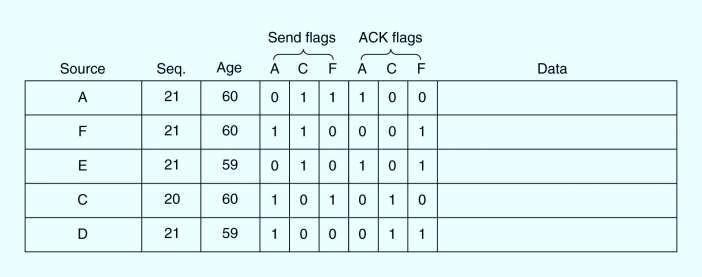

<!-- page: 23 -->

多选题
2分

分发的基本算法是泛洪，力图分发完全。为什么每个路由器要设

立一个保留区？（多选）

避免低效的转发

A

避免分发不完全

B

避免LSP/LSA丢失

C

避免频繁转发，浪费带宽

D

提交

23

<!-- page: 24 -->

LSA中的Age的作用

解决路由器崩溃

当年龄为零 ( zero )时，来自该路由器的信息被丢弃

通常地，每隔一段时间，如10秒钟，一个新分组就会到来，所以，只有

路由器down机才可能导致超时（ 或者，连续6个间隔因为丢失，没有收到

新的分组）

解决序列号损坏的方法

如果一个序列号被破坏了，比如发送方的序列号是4，但是由于产生了1

位错误，序列号被看作65540，那么，序列号为 5 – 65540的分组都被当

作过时分组而被拒绝
00000000000000001000000000000100
24

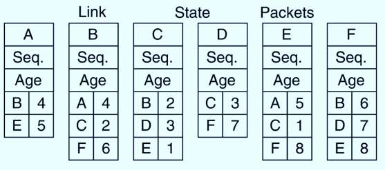

<!-- page: 25 -->

L-S路由协议的实例—OSPFP368（5.7.6）

开放的路径优先（Open Shortest Path First）

使用图（Graph）来表述真实的网络

每个路由器/Lan都是一个节点

测量代价/量度（metric）

计算最短路径

25

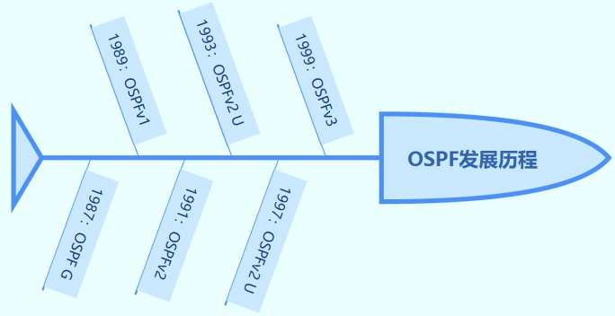

<!-- page: 26 -->

OSPF构建在IP之上，怎么保证可靠分发？

IGP中的主流

克服了路由环

User Protocol字段值：89

26

<!-- page: 27 -->

关键的一步：建立路由器毗邻关系

Hello

Full adjacency

DD

LSR

LSU

LSAck

27

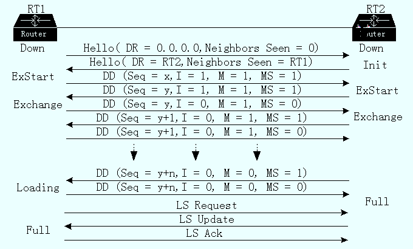

<!-- page: 28 -->

运行OSPF的路由器状态迁移图

白色：暂时状态

灰色：稳定状态

28

<!-- page: 29 -->

小结可靠保证手段

LSAck：任何时候收到LSU，必须确认

DD报文中采用序列号

准启动状态，确定主从关系，控制交互节奏

谁是Master，就采用谁的初始序列号

只有Master，才能递增序列号

Exchange交互过程，采用M、I等参数

hello报文：keep alive（保活，维持存活）

29

<!-- page: 30 -->

为什么要选举DR和BDR？

减少同步次数

降低资源使用

原则

选举制

终身制

世袭制

30

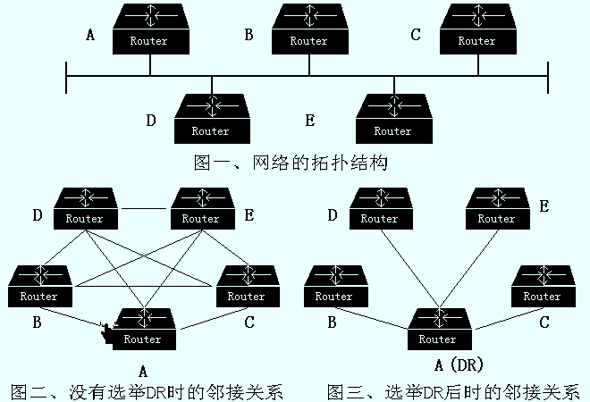

<!-- page: 31 -->

课前热身（弹幕）

内部网关协议中，使用最广性能最优的是哪个？

OSPF运行时状态发生迁移，有哪几个状态是稳定的？

包裹

OSPF不划分区域运行时，区域也存在，此时这个区域叫什么？

从源送
达目的

OSPF和IS-IS同属于哪类路由选择协议？

OSPF感知网络变化采用的基本机制是什么？

其它
路由

OSPF构建在IP之上，怎么保障报文的可靠传输？

总而言之，OSPF试图消灭路由环的措施有哪些？

31
31

<!-- page: 32 -->

DR可能带来的问题

非全连通网络（full mesh），如PTMP网络

由管理员配置成PTMP，不选举DR

32

<!-- page: 33 -->

多选题
2分

下面关于指定路由器DR的说法，哪些是正确的？

优先级从何而来？

0-255

指定路由器是管理员指定的

A

默认值：1

如果为0，不能

通常，指定路由器的出现减少了全毗邻关系

B

被选举

指定路由器是选举产生的

C

指定路由器的出现让路由器之间的关系更加复杂。

D

提交

33

<!-- page: 34 -->

单选题
2分

一台新接入的路由器，跟已经运行一段时间的DR交换了全部的DD

报文，接下来出现的一个报文，最有可能是以下哪种？

Hello

A

DD

B

LSR

C

LSU

D

LSAck
E

提交

34

<!-- page: 35 -->

№.4正确率58%&71%

35

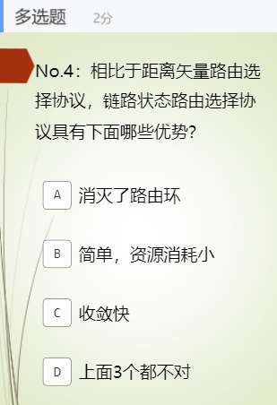

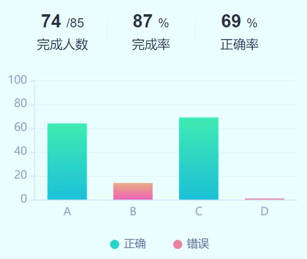

<!-- page: 36 -->

№.5正确率49%&59%   P371

数据包类型
描述

Type 1－Hello
与邻居建立和维护毗邻关系。

Type 2 －数据
库描述包（DD）

描述一个OSPF路由器的链路
状态（LSA）数据库内容。

Type 3 －链路
状态请求（LSR）

请求相邻路由器发送其链路
状态数据库中的具体条目

Type 4 －链路
状态更新（LSU）

向邻居路由器发送链路状态
通告（回应、触发更新）

Type 5 －链路
状态确认（LSA）

确认收到了邻居路由器的LSU

36

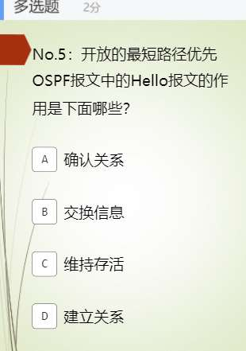

<!-- page: 37 -->

OSPF在大型网络中可能遇到的问题

LSDB非常庞大，占用大量存储空间

计算最小生成树耗时增加，CPU负担很重

一点变化都会引发从头重新计算

网络拓扑结构经常发生变化，网络经常处于“动荡”之中

接口up down

路由器的增加删除

好比湖水，一个小小的石子都会引发阵阵涟漪

37

<!-- page: 38 -->

OSPF在大型网络中可能遇到的问题（续）

38

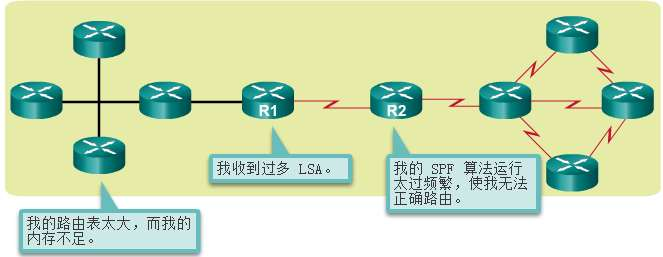

<!-- page: 39 -->

分而治之，解决之 P370

39

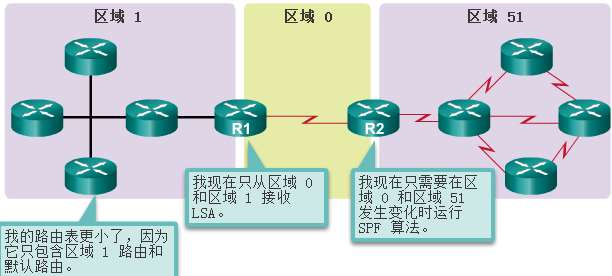

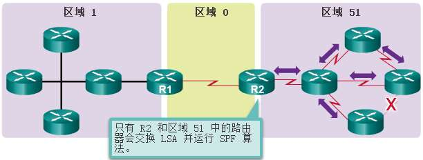

<!-- page: 40 -->

区域间的路由

ABR！

40

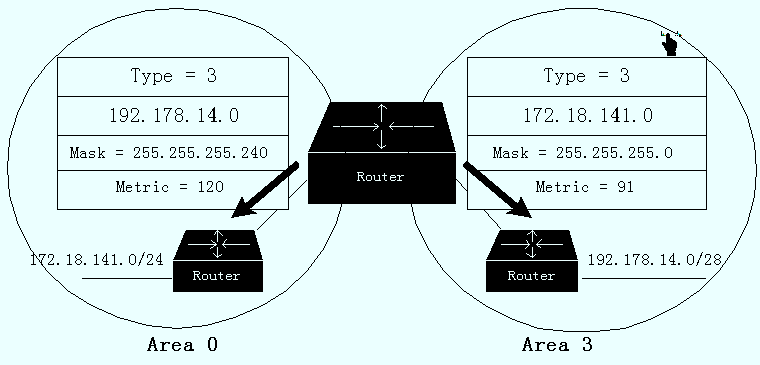

<!-- page: 41 -->

如何避免路由环路？

虚连接（TTL>1）

41

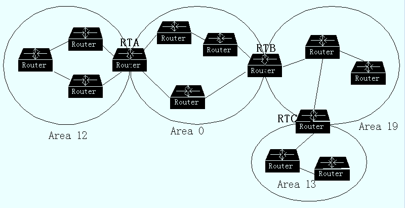

<!-- page: 42 -->

注意

所以，OSPF分区域运行

小范围运作OSPF，路由器的负担降低，最重要的是隔离了外区

域的更新

基本路由刷新手段：触发更新

如果不分区域，默认所有的OSPF路由器都在同一个区域：骨干

区域（area 0）

42

<!-- page: 43 -->

单选题
2分

本节视频叫单区域OSPF，为什么要分区域运行？（最恰当的一个）

按照惯例

A

便于管理

B

网络太大了，不分区域的话，OSPF运作负担太大

C

以上都不对

D

提交

43

<!-- page: 44 -->

弹幕讨论

OSPF是否完全克服了路由环？有哪些手段杜绝了路由环？

44

<!-- page: 45 -->

边界网关协议P372

运行在AS之间的协议

构建于TCP之上

45

<!-- page: 46 -->

BGP 的工作原理（1/2， P372 ）

外部网关路由器的典型路由策略涉及政治 political, 安全security,

或经济方面 economic 的考虑

根据BGP对于中转流量的兴趣，网络被分成三类：

stub 自治系统

多连接自治系统

穿越自治系统

46

<!-- page: 47 -->

BGP原理（2/2）P369

BGP 路由器对之间通过TCP连接来相互通信

从根本上来说，BGP 是一个DV路由协议，但是它又不同于一般的DV协议，

比如 RIP，它克服了路由环。

BGP 路由器记录下全路径信息，而不仅仅是路径代价（ keeps track of

the exact path）

47

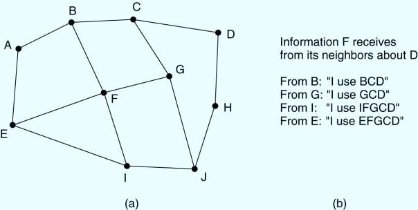

<!-- page: 48 -->

其它路由（5.2.6~5.2.9 P294~299）

分级/层次路由（Hierarchical routing）

广播路由（Broadcast routing）

组播路由（Multicast routing）

选播/任播路由（Anycast routing）



48

<!-- page: 49 -->

分级路由 P294

网络普及导致路由表膨胀

增加路由器内存

查找费时，端到端时延增长

分几级？

分级导致非最优

减少路由表规模!

49

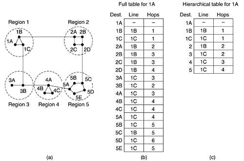

<!-- page: 50 -->

广播路由 P295

可能的应用：

天气预报发布、股票行情更新、现场直播节目等

广播路由实现的5种可能的方法：

给每个目标单播每一个分组

扩散法（Flooding）

使用多目标路由（ multi-destination routing）

使用汇集树/生成树（sink tree / spanning tree) 来引导分发分组

使用逆向路径转发来控制扩散（flood）

50

<!-- page: 51 -->

逆向路径转发  P294

基本思想：当一个广播分组到达某个路由器的时候，如果它是

从该路由器到广播源的通常线路上到达的，那么它被分发到所

有的出口（除了来的那个口），否则被丢弃。（RPF检查）

51

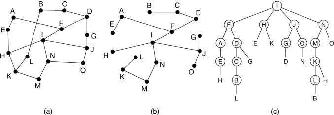

<!-- page: 52 -->

多播/组播路由（multicast）P297

IP支持组播，使用 D 类地址

每个 D 类地址标识了一组主机

可以有 28 地址用来表示组，所有 228个组(224~239)

IP组播的重要组成：

成员管理 (IGMP/MLD)

组播路由表 (DM/SM)

IP组播必须要有特别的组播路由器的参与才能实现

应用层组播（Application-layer multicast）
52

<!-- page: 53 -->

组播路由 P297

组播树

Multicast tree!

53

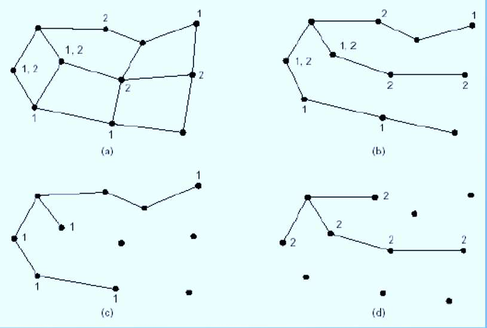

<!-- page: 54 -->

选播/任播路由P299

目的是一组节点，只需要发送到最近的那个。

典型应用：DNS

54

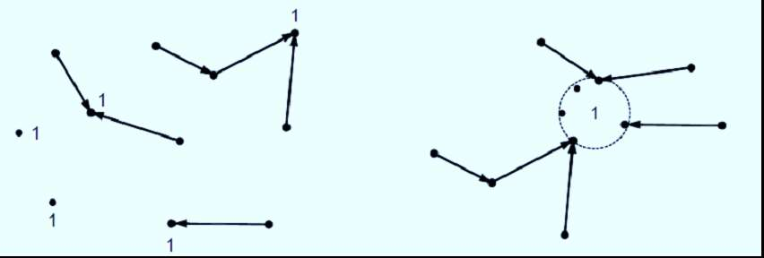

<!-- page: 55 -->

新增：软件定义网络SDN（P333）

SDN之前，路由决策和转发绑定在路由器（硬件）上

SDN

集中控制

决策和转发分离

由软件定义路由决策

55

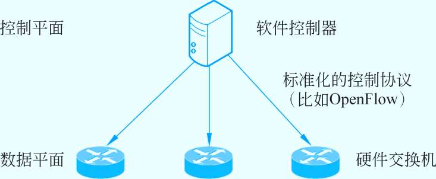

<!-- page: 56 -->

小结路由

链路状态算法

5步

问题和解决的办法

OSPF

5种消息类型

DR 选举

OSPF 运作(OSPF路由器的状态变化)

BGP

其它路由算法

56

<!-- page: 57 -->

57

