# 20230531&0602_第5章_其它（Part3）_20230619170527

<!-- page: 1 -->

第五章 网络层之其它（Part3）

袁华：hyuan@scut.edu.cn

华南理工大学计算机科学与工程学院

广东省计算机网络重点实验室

<!-- page: 2 -->

第五章 其它

2
‹#›

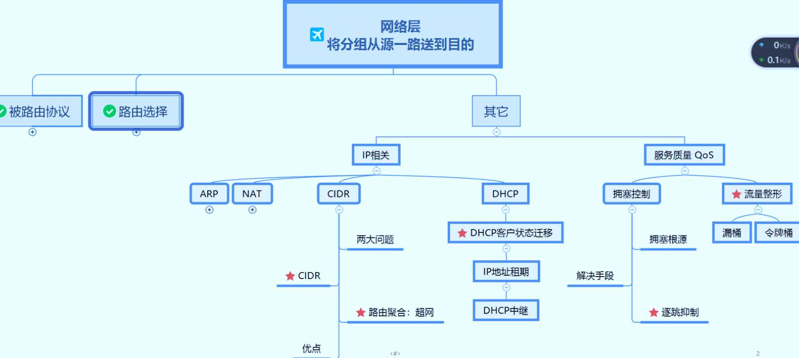

<!-- page: 3 -->

Part3预习情况（昨晚8点）

网工班：76%

计科1班：85%

3
‹#›

<!-- page: 4 -->

主要内容

服务质量：拥塞控制和流量整形（5.3、5.4）

理解CIDR的基本思想（P345）

NAT/PAT的基本原理（P360）

ICMP协议及其应用（5.7.4）

主要的地址解析协议（P362）

ARP

RARP

IP地址的分配方式(RARP\Bootp\DHCP)（P364）

4
‹#›

<!-- page: 5 -->

拥塞控制、服务质量（5.3、5.4）

IP分组传输：尽力而为（Best-Effort）

拥塞根源：资源<负载

措施

增加资源

资源
负载

降低负载

降质（单双号限行、黄金周）

丢弃、载荷脱落P302

随机

丢掉不太重要的

牛奶策略、葡萄酒策略

5
‹#›

<!-- page: 6 -->

单选题
2分

大家都在收看某个热门视频直播，造成路由器拥堵，不得不启用

载荷脱落来降低负载，应该选择哪种策略比较合适？

牛奶策略

A

葡萄酒策略

B

丢掉不太重要的非视频报文

C

随机

D

提交

6
‹#›

<!-- page: 7 -->

主要内容

服务质量：拥塞控制和流量整形（5.3、5.4）

理解CIDR的基本思想（P345）

NAT/PAT的基本原理（P360）

ICMP协议及其应用（5.7.4）

主要的地址解析协议（P362）

ARP

RARP

IP地址的分配方式(RARP\Bootp\DHCP)（P364）

7
‹#›

<!-- page: 8 -->

无类别域间路由--CIDR P345

Classless InterDomain Routing

打破了分配和路由中的A、B、C类别地址的限制

无类：现代互联网络的特性

两大功能+额外功能

分配：缓解了地址枯竭的趋势


按类分配             按需分配

路由：控制并缩减了路由表的规模

路由汇聚

额外收获：隔离了路由翻动（up-down）

8
‹#›

<!-- page: 9 -->

IP 地址的按需分配实例 P346

一块地址从194.24.0.0开始，可用地址数为8192（2^13），

即194.24.0.0/19（首地址/网络位）

剑桥申请2048个（2^11）地址：194.24.0.0~194.24.7.255

牛津申请4096个（2^12）地址：194.24.16.0~194.24.31.255

爱丁堡申请1024个（2^10）地址：194.24.8.0~194.24.11.255

主机位：2^n=主机地址需求；主机位+网络位=32

9

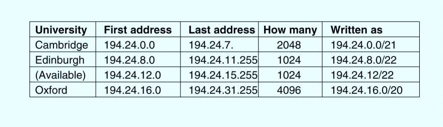

<!-- page: 10 -->

为什么牛津不从194.24.8.0开始？P346

P343：4096个地址必须位于4096字节的边界

a block of 4096 addresses must lie on a 4096-byte boundary

假如从194.24.8.0开始:

00001000.00000000   （第三个8位组）

主机位的特点：主机位应该能从 全零 变化到 全1

不连续，或者说无法表示： 194.24.8.0/20？

网络位和主机位的边界！

10
‹#›

<!-- page: 11 -->

课前热身（弹幕）

BGP报文用什么传输层协议传输？

BGP是克服了路由环的DV，怎样克服的路由环？

CIDR技术中的 C 指出了现代互联网络的特征是？

CIDR的主要功能是什么？

11
11

<!-- page: 12 -->

CIDR的路由

路由表必须扩展，增加一个 32-bit 的子网掩码

之前按照8位、16位、24位默认网络前缀进行路由

每个路由表至少有一个三元组 (IP address, subnet mask, outgoing

line)

当一个分组到来的时候

 分组中的目标IP地址（ Destination IP ）被检查

目标IP和子网掩码进行与操作，获得目标网络地址，以查找路由表.

如果路由表中有多个表项匹配 (这些表项有不同的子网掩码) ，使用子网掩码最

长的那个表项（为什么？最长前缀匹配）

12
‹#›

<!-- page: 13 -->

举个例子：最长地址前缀选择子网掩码长的匹配项P347

分组中的目标IP

•192.24.12.4: 11000000. 00011000. 00001100. 00000100

路由表中有两个表项匹配

192.24.12.0/22

11000000. 00011000. 00001100. 00000100
192.24.0.0/19

目的网络
接口
……

192.24.12.0/22
S0
……

11000000. 00011000. 000011 00. 00000100

192.24.0.0/19
S1
……

S0
S1

13
‹#›

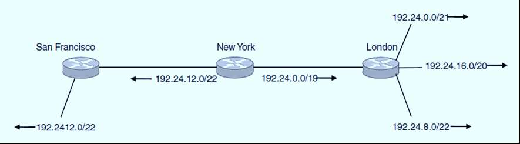

<!-- page: 14 -->

路由聚合：超网

缩减路由表规模

隔离了路由翻动（Up   Down）

200.199.48.0/22

200.199.48.0/20

14
‹#›

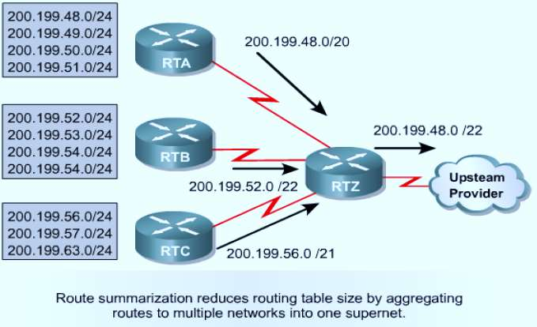

<!-- page: 15 -->

怎样聚合呢？

注意：

聚合后的超网表示：基地址/网络前缀

网络前缀：不变的位数、网络位

主机位：变化的位（从全0变化到全1）

主机位+网络位（前缀）=32

15
‹#›

<!-- page: 16 -->

单选题
2分

通常，一个超网（supernet）的子网掩码中，“1”的个数可能是下面哪

项？

等于24

A

大于24

B

小于24

C

不一定是多少

D

提交

16
‹#›

<!-- page: 17 -->

单选题
2分

一个IP地址125.134.112.66/19位于一个超级地址块中，它所在的这个地

址块的第一个地址和最后一个地址分别是什么？

125.134.112.0；125.134.112.255

A

125.134.64.0；125.134.96.255

B

125.134.96.0；125.134.127.255

C

125.134.96.1；125.134.127.254

D

提交

17
‹#›

<!-- page: 18 -->

主要内容

服务质量：拥塞控制和流量整形（5.3、5.4）

理解CIDR的基本思想（P345）

NAT/PAT的基本原理（P360）

ICMP协议及其应用（5.7.4）

主要的地址解析协议（P362）

ARP

RARP

IP地址的分配方式(RARP\Bootp\DHCP)（P364）

18
‹#›

<!-- page: 19 -->

NAT :IP地址耗尽的快速修补方案 P350

NAT：net address translate NAT

私有IP地址和公有IP地址之间的转换。

PAT：port address translate（超载）

将多个私有IP地址影射到同一个公有IP地址的不同端口

Private IP address：不可路由的地址、也可用于广域网链路上

19
‹#›

<!-- page: 20 -->

NAT转换器（NAT Box）的位置和功能

私人地址不具备全球唯一性

需要进行公、私转换

NAT转换器(NAT Box)

家用路由器

路由器

专用转换器

20
‹#›

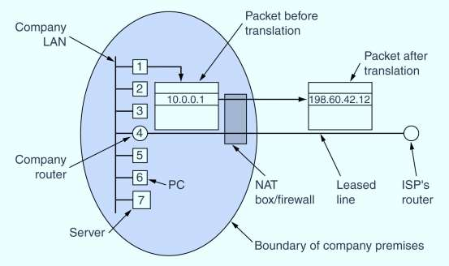

<!-- page: 21 -->

特别注意（从内部发起）

Natbox转换的主要过程

分组头部的源IP地址（私人地址）

目的IP不发生任何变化

源私人IP地址 转换为  公有IP地址

同学问：公有IP地址从哪里来？

这个公有IP地址成为它通信的全权代表

转换的信息记录在 转换表 中

返回的分组经过时，用目的IP地址查 转换表

逆向转换：目的公有IP地址转为私人地址

源地址不发生任何变化
21
‹#›

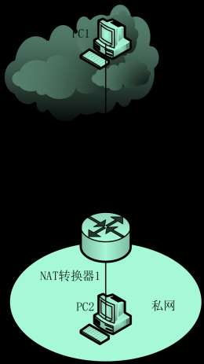

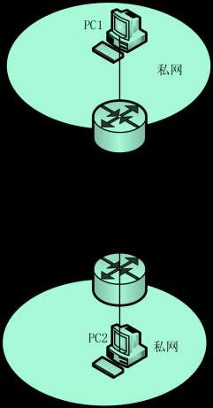

<!-- page: 22 -->

NAT 工作原理

NAT box

私转公

10.0.0.3
140.203.8.22

Web server
140.203.8.22

5503
80

Payload
(request)

host
10.0.0.3

10.0.0.3
140.203.8.22

140.203.14.66
140.203.8.22
NAT

140.203.14.66
140.203.8.22

5503
80

5001
80

5001
80

140.203.8.22
10.0.0.3
Payload
(request)

Payload
(request)

Payload
(request)

80
5503

Payload
(response)

NAT translation table

140.203.14.66

10.0.0.1

Orig Source Port Orig IP Address
Index

10.0.0.0

5503
10.0.0.3
5001
…
…
…

140.203.8.22
10.0.0.3

140.203.8.22
140.203.14.66
NAT

140.203.8.22
140.203.14.66

80
5503

80
5001

80
5001

Payload
(response)

Payload
(response)

Payload
(response)

host
10.0.0.4

公转私

Inside LAN
outside WAN

<!-- page: 23 -->

单选题
2分

一个NAT转换器内部的转换表如表所示，此时，转换器收到一个从外网到来的

分组，其目的IP地址和目的端口号分别是202.112.19.3和2000，下面哪个选项

内网
外网
IP地址
端口
IP地址
端口
192.168.1.1
6000
202.112.19.3
1999

是转换器应该做的？

192.168.1.10
5000
202.112.19.3
2000

将分组的目的IP地址和目的端口号改写为：192.168.1.1：6000

A

将分组的目的IP地址和目的端口号改写为：192.168.1.10：5000

B

将分组的源IP地址的源端口号改写为：192.168.1.10：5000

C

将分组的源IP地址的源端口号改写为：192.168.1.1：6000

D

提交

23
23

<!-- page: 24 -->

如果没有NAT转换器，会怎样呢？

阻断外网通信

额外的安全性

24
‹#›

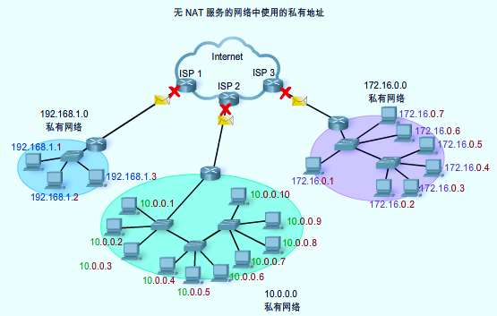

<!-- page: 25 -->

NAT 带来的问题P352

NAT违背了IP的结构模型 –每个IP地址唯一地标识了一台机器

私人地址失去了地理位置属性

NAT将互联网改变成了“面向连接”的网络，NAT转换器维护着

连接的状态，一旦它崩溃，连接也没有了

原本的IP分组传输是无连接的

NAT违背了最基本的协议分层原则

使用了端口号，传输层的元素

25
‹#›

<!-- page: 26 -->

NAT 带来的问题（续） P 352

如果传输层不是采用TCP或UDP，而是采用了其它的协议，NAT将不

再工作

TCP段或UDP段中的端口号

有些应用会在payload中插入IP地址，然后接收方会提取出该IP地址

并使用，但是NAT转换器对此一无所知，导致该类应用不再有效

只查看和改写分组头和段头

NAT让一个IP地址可以承载61,440 （65536-4096）个私人地址（超

载，PAT）

NAT超负荷运转
26
‹#›

<!-- page: 27 -->

NAT/PAT小结

优点

节省了公有IP地址，快速地弥补了IP地址缺口（有利有弊）

提供了内部网访问外网的灵活性；

有一定的保密性。

缺点

影响了部分协议和应用的通信；

增加了网络延时；

NAT转换设备的性能可能成为网络的瓶颈；

影响了路由追踪工具的使用（迷失）。

27
‹#›

<!-- page: 28 -->

多选题
2分

下面哪些地址是私人地址？（多选）

192.0.2.15

A

192.168.3.5

B

172.16.35.2

C

64.104.0.22

D

10.55.3.168
E

172.161.30.30
F

192.168.11.5
G

209.165.201.30
H

提交

28
‹#›

<!-- page: 29 -->

主要内容

服务质量：拥塞控制和流量整形（5.3、5.4）

理解CIDR的基本思想（P345）

NAT/PAT的基本原理（P360）

ICMP协议及其应用（5.7.4）

主要的地址解析协议（P362）

ARP

RARP

IP地址的分配方式(RARP\Bootp\DHCP)（P364）

29
‹#›

<!-- page: 30 -->

ICMP - Internet Control Message Protocol P357

用来报告意外的事件或测试互联网

More ICMP Types: http://www.iana.org/assignments/icmp-

parameters
分片未到齐！
或ttl=0，
Type=11

30
‹#›

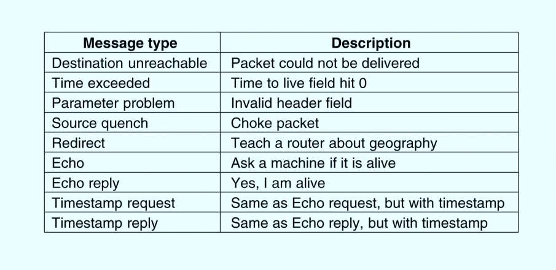

<!-- page: 31 -->

ICMP 消息格式

IPv6分组的携带的ICMP消息，其Next Header的值为0x3A=58

Protocol:0X01

‹#›
31

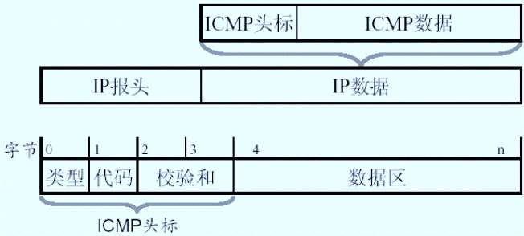

<!-- page: 32 -->

ICMP的三大应用

查故障神器1：ping（掌握工具）

回声请求、回声应答

查故障神器2：trace route（tracert）（掌握工具）

超时消息 （TTL-1=0）

探测源到目的途径的路由器

PMTU

需分段但禁止分段（DF=1）

Type=3，code=4的ICMP消息（目标不可达消息）

32
‹#›

<!-- page: 33 -->

type=3的不同子类（code值不同）

Destination Unreachable（目的不可达）

33
‹#›

<!-- page: 34 -->

注意

一般来说，ICMP 消息仅送给源机

谁发送？

ICMP数据传输方式和其他数据传

输方式一样，也可能遇到同样的错

误，规定：ICMP消息不生成自己的

差错报告

34
‹#›

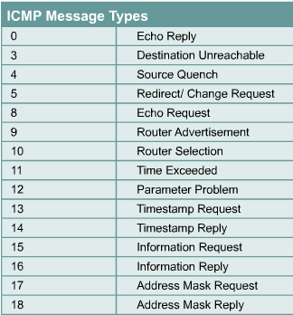

<!-- page: 35 -->

多选题
2分

一般来说，谁来发送ICMP差错报告消息？

源机

A

目的机

B

路由器

C

网关

D

提交

35
‹#›

<!-- page: 36 -->

弹幕讨论

如果ping对方，显示不通了（lost=100%），但是却抓到了回声

请求和回声应答包，可能是什么原因？

36
‹#›

<!-- page: 37 -->

主要内容

服务质量：拥塞控制和流量整形（5.3、5.4）

理解CIDR的基本思想（P345）

NAT/PAT的基本原理（P360）

ICMP协议及其应用（5.7.4）

主要的地址解析协议（P362）

ARP

RARP

IP地址的分配方式(RARP\Bootp\DHCP)（P364）

37
‹#›

<!-- page: 38 -->

ARP — Address Resolution Protocol P362

ARP 的任务是找到一个给定IP地址（Who？）所对应的MAC地址

ARP is defned in RFC 826。

问题：为什么需要地址解析?

38
‹#›

<!-- page: 39 -->

ARP工作原理

同一子网内

ARP请求广播

ARP单播应答

提高工作效率：ARP表

问题：怎么判断远程主机是否在同一子网?

目的机在远程子网中

请求默认网关

39
‹#›

<!-- page: 40 -->

主机里有一张路由表

route print 或netstat - r

远程

网络

本地

网络

40
‹#›

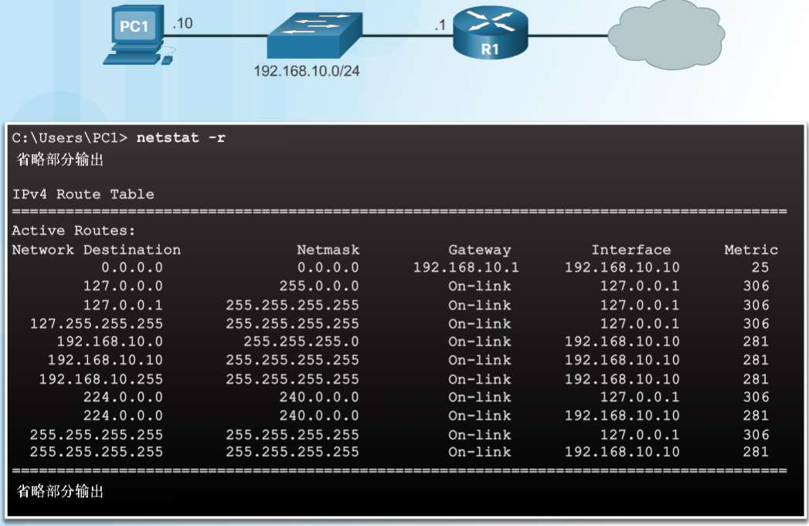

<!-- page: 41 -->

免费ARP（Gratuitous ARP P364）

免费ARP

当一台主机启动时，发送一个免费ARP请求，请求自己IP的MAC地址

（如果意外收到一个应答，即是IP地址发生了冲突）

当一个接口（interface）的配置发生了改变，会发送一个免费ARP

例子：一台主机(172.16.1.1,0002 4A87 0D92) 发送的免费ARP

41
‹#›

<!-- page: 42 -->

一个免费ARP帧的样例

A host (172.16.1.1,0002 4A87 0D92)

Source IP

Source IP

==
target IP

==
target IP

42
‹#›

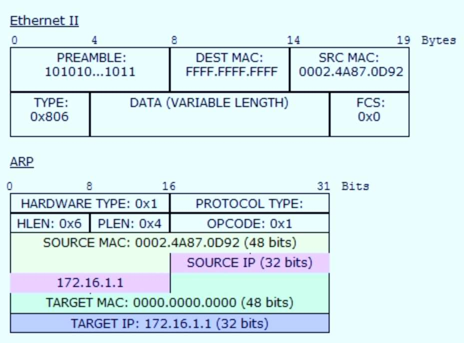

<!-- page: 43 -->

通信双方在 或不在 同一子网的场景样例

本地通信：H1发H2

ARP 请求: Target IP 是192.32.65.1(default gateway)

远程通信：

H1发信息给H4

Stop!

先发往路由器

路由器转发给H4

路由器的特殊身份

默认/缺省 网关

43
‹#›

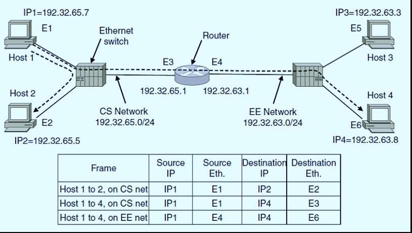

<!-- page: 44 -->

代理ARP：Proxy ARP P364

源机不知道目的机在外网，启用通常的ARP广播，此时路由器

作为代理ARP的存在，以自己的MAC地址作为应答。

路由器上运行代理ARP

一些特殊的用途

比如：子网内的主机移动到了外网

44
‹#›

<!-- page: 45 -->

ARP 欺骗、现象、根源和怎么办？

ARP 欺骗/病毒/毒化

假装自己是网关

假装自己是目的机

现象：时断时续

根源：缓存机制/ARP表、无法判别真假

解决方法：静态绑定

45
‹#›

<!-- page: 46 -->

单选题
2分

ARP请求帧中，目标（target）硬件地址填写的是下面哪项？

0X111111111111

A

0.0.0.0

B

0X000000000000

C

255.255.255.255

D

提交

46
‹#›

<!-- page: 47 -->

47
‹#›

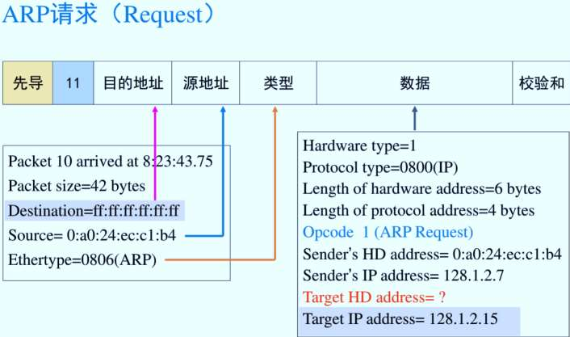

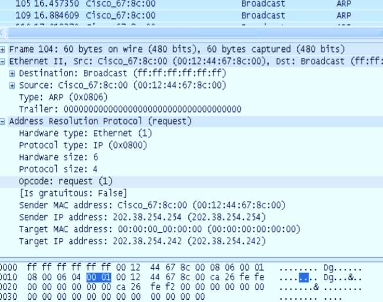

<!-- page: 48 -->

RARP协议的工作原理（无盘工作站）

request

我的MAC地址是0:a0:24:ec:c1:b4，
谁知道我的IP地址？

主机A
（无盘）

主机E
（服务器）

Ethernet

听见/不回答    听见/不回答     听见/不回答         听见/回答

主机0:a0:24:ec:c1:b4，你的
IP地址是128.1.2.7！
主机A获得自己的IP地址，
开始自己的开机过程。

reply

48
‹#›

<!-- page: 49 -->

主要内容

服务质量：拥塞控制和流量整形（5.3、5.4.2）

理解CIDR的基本思想（P342）

NAT/PAT的基本原理（P347）

ICMP协议及其应用（5.6.4）

主要的地址解析协议（P359）

ARP

RARP

IP地址的分配方式(RARP\Bootp\DHCP)（P361）

49
‹#›

<!-- page: 50 -->

IP地址的动态分配方式P361

静态分配

动态分配

给定一个MAC地址，如何得到对应的IP地址?

RARP (Reverse Address Resolution Protocol) 在 RFC 903描述，用来获取本机

MAC地址对应的IP地址

BOOTP 在RFC 951、 1048 和1084中描述，（缺点：需要手工配置）

DHCP (Dynamic Host Configuration Protocol)在 RFCs 2131 和 2132中描述

50
‹#›

<!-- page: 51 -->

DHCP：动态主机配置协议P364

Dynamic Host Configure Protocol

可以灵活分配IP地址，节约IP地址的使用

51
‹#›

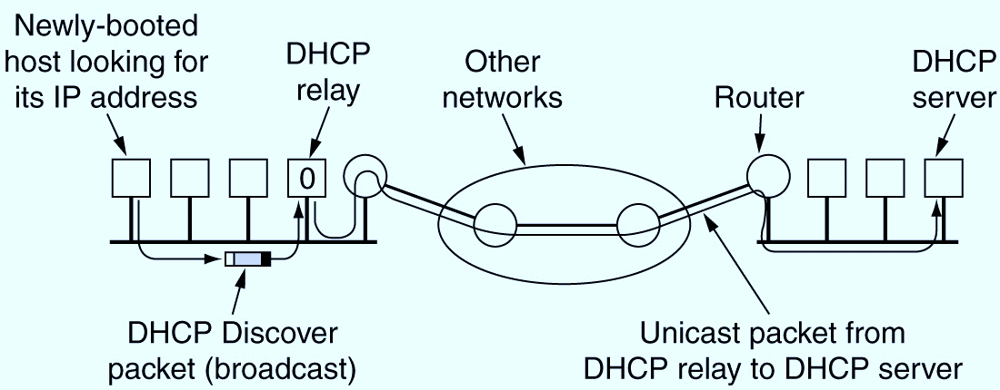

<!-- page: 52 -->

DHCP

使一台主机迅速并动态地获取一个IP地址

通过DHCP获取的 IP是租来的，可能会过期

DHCP过程

初始化状态

选择状态

DHCP Offers

请求状态

绑定状态

52
‹#›

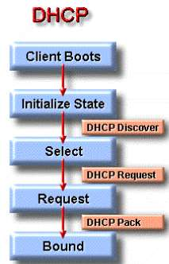

<!-- page: 53 -->

DHCP欺骗和耗竭攻击

DHCP欺骗：

伪装DHCP server

DHCP耗竭

因分配完IP地址而导致

正常客户无法获得地址

53
‹#›

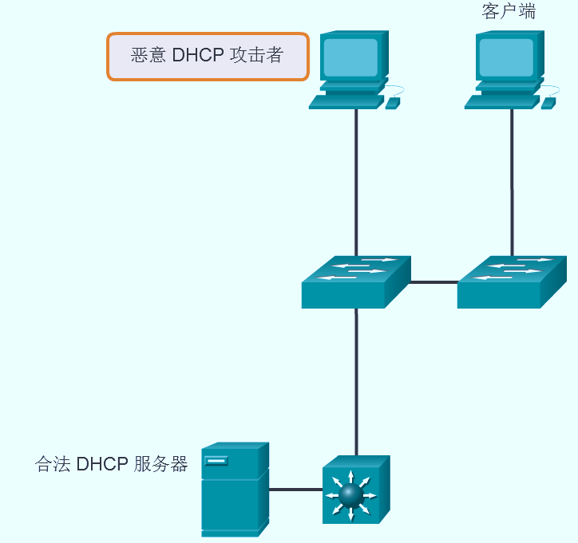

<!-- page: 54 -->

弹幕讨论：一个分组如何从源机到达目的机?（用到哪

些技术？）

54
‹#›

<!-- page: 55 -->

小结

服务质量保证非常困难

CIDR的基本思想

NAT/PAT的工作原理

ICMP 及其应用

地址解析协议

ARP

RARP

IP地址的分配方式 (RARP\Boot\pDHCP)
55
‹#›

<!-- page: 56 -->

Thank you！

56
‹#›

<!-- page: 57 -->

常用术语的中英文对照

Routing protocol：路由协议

Interior gateway protocol（IGP）：内部网关协议

Distance vector protocol（DV）：距离适量路由选择协议

Routing information protocol（RIP）：路由信息协议

Link state protocol （LS）：状态路由选择协议

Open Shortest Path First（OSPF）：开放最短路径优先

57
‹#›

<!-- page: 58 -->

常用术语的中英文对照（续）

Border Gateway Protocol（BGP）：边界网关协议

Hierarchical routing：分层路由

Broadcast routing：广播路由

reverse path forwarding （RPF）：逆向路径转发

Multicast routing：组播路由

Anycast routing：任播路由

Mobile routing：移动路由

58
‹#›

<!-- page: 59 -->

常用术语的中英文对照（续）

Congestion control：拥塞控制

Quality of service（QoS）：服务质量

traffic Shaping：流量整形

leaky Bucket：漏桶

token bucket：令牌桶

Router：路由器

Routing table：路由表

59
‹#›

<!-- page: 60 -->

常用术语的中英文对照（续）

Internet Protocol（IP）：互联网协议

IP packet format：IP分组格式

IP address ：IP地址

Reserved IPv4 address：保留的IP地址

Subnetting：子网规划

Subnet mask：子网掩码

Variable Length Subnet Mask（VLSM）：可变长的子网掩码

Dynamic Host Configure Protocol（DHCP）：动态主机配置协议

60
‹#›

<!-- page: 61 -->

常用术语的中英文对照（续）

Classless InterDomain Routing（CIDR）：无类域间路由

Network Address Translation（NAT）：网络地址翻译

Port Address Translate（PAT）：端口地址翻译（超载，overload）

Internet Control Message Protocol（ICMP）：互联网控

制协议

Address Resolution Protocol（ARP）：地址解析协议

61
‹#›

