# 20230609_第6章_传输层之1_20230619170546

<!-- page: 1 -->

第六章 传输层_1

袁华：hyuan@scut.edu.cn

华南理工大学计算机科学与工程学院

广东省计算机网络重点实验室

<!-- page: 2 -->

第5章回顾（弹幕）

网络层的核心功能是什么?

被路由协议指的是什么？

路由协议的作用是什么？

IGP

DV：RIP

LS：OSPF

BGP

其它：CIDR、NAT、ARP、ICMP、DHCP、QoS…….

<!-- page: 3 -->

预习情况

网工班：84%

计科1：91%

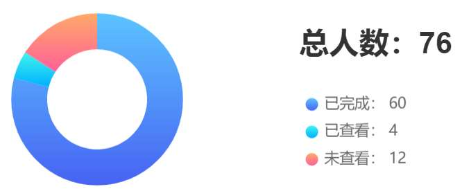

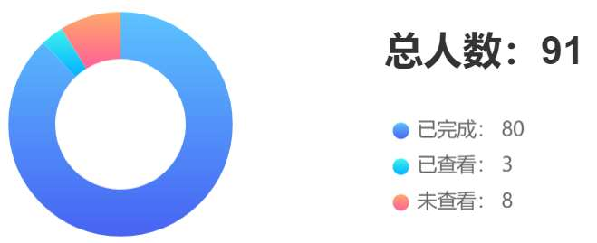

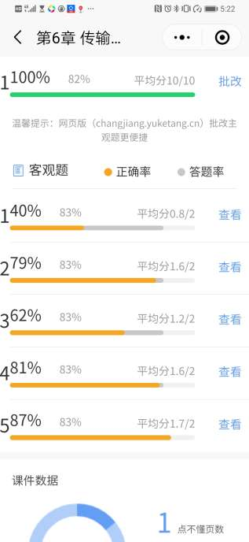

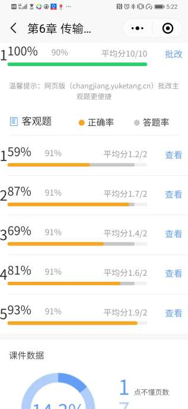

<!-- page: 4 -->

传输层概述P386

传输层是整个协议栈(TCP/IP)的核心之一

传输层的任务是提供可靠的、高效的数据传输

完成传输层工作的硬件或软件被称为传输实体（Entity）

传输实体可能位于：

操作系统内核
独立的用户进程中
绑定在网络应用中的链接库
网络接口卡
。。。。。。。

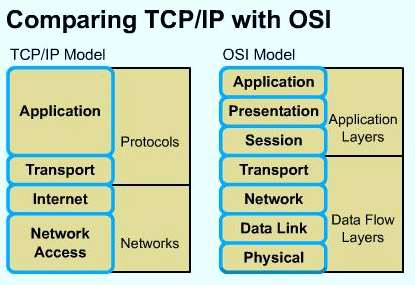

<!-- page: 5 -->

主要内容

端到端（end to end）

进程到进程（process to process）

应用到应用（application to application）

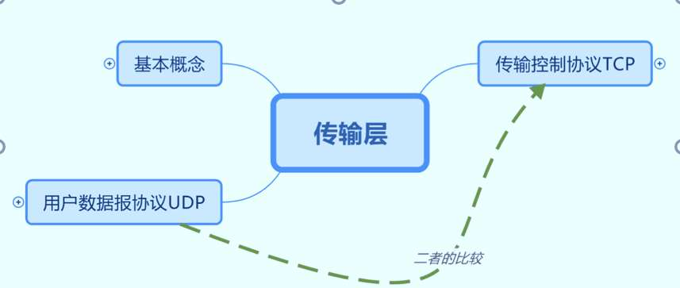

<!-- page: 6 -->

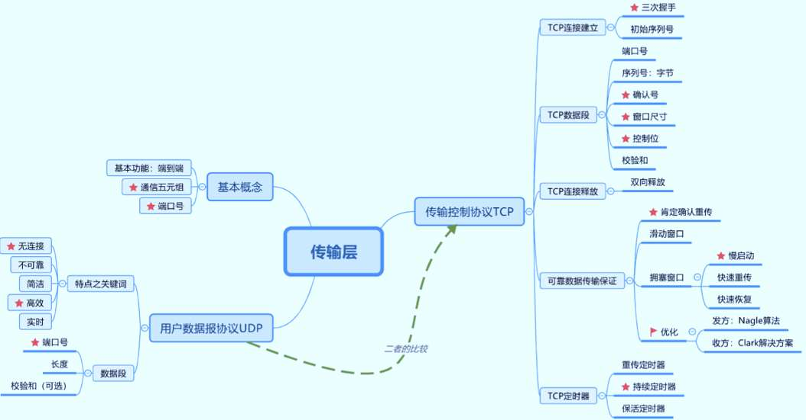

<!-- page: 7 -->

为什么需要传输层服务P386

服务使用者

服务提供者

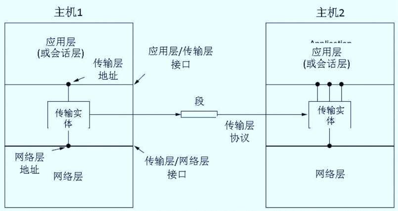

<!-- page: 8 -->

数据段（TPDU，传输层协议数据单元）

TPDU (Transport Protocol Data Unit) 是从传输实体发到对端传输实体

的信息（数据段，segment）P389

TPDUs 被封装在分组（packet）中，由网络层交换

分组被封装在帧（frames）中，由数据链路层交换

20B
20B

MSS：Maximum

1460B

Segment Size

1500B

MTU

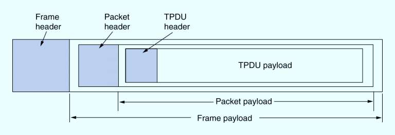

<!-- page: 9 -->

No.1 得分率 40% vs 59%

考察点：TCP实体的封装/解封装

发方：从应用层拿数据，加上头部，构

成段后传给网络层。

收方：从网络层拿到段，去掉段头后送

给应用层。

应用层

发方
收发方

传输层

网络层

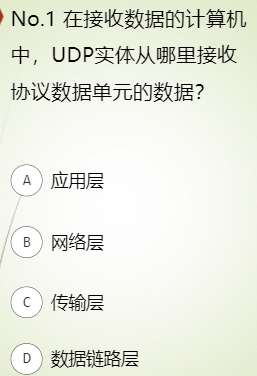

<!-- page: 10 -->

通信五元组（三元组）

Application

Source IP

Process

End Point

Source port

TCP/UDP

Destination IP

End Point

Destination port

<!-- page: 11 -->

端口（port）定义 P421

16 位，共有 216 个端口

端口范围：0~65535

<1023 : 用于公共应用（保留，全局分配，用于标准服务器），IANA分配；

1024~49151 :用户端口，注册端口；

>49152 : 动态端口，私人端口。

自由端口(Free port)

RFC 6335

本地分配

动态的随机端口

<!-- page: 12 -->

注意：此port非彼port！

设备上的port（端口），也叫接口（interface），是实实在在的

物理接口！

传输层的port是端口号，是逻辑地址，指明了主机上的应用进程

是哪个！

<!-- page: 13 -->

关于传输服务原语  P388

用来调用服务的接口

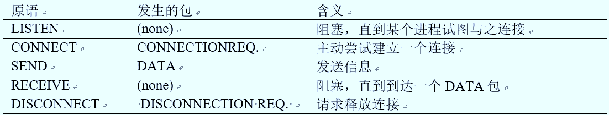

<!-- page: 14 -->

传输层协议

UDP(6.4.1)

User datagram protocol

TCP(6.5)

Transport control protocol

<!-- page: 15 -->

User Datagram Protocol (6.4.1)P421

UDP 是一个无连接的（connectionless）的传输层协议

简洁、高效的协议

采用UDP的应用很多：DNS、SNMP、RIP、TFTP、实时流媒体

应用。。。。。

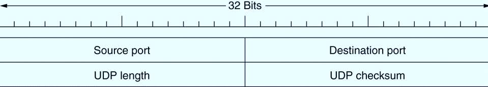

<!-- page: 16 -->

两个UDP数据段的例子

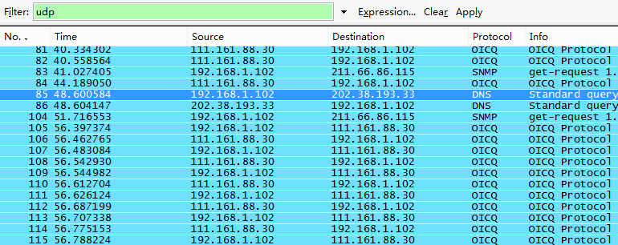

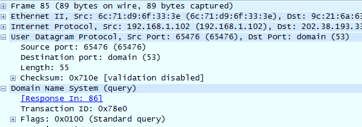

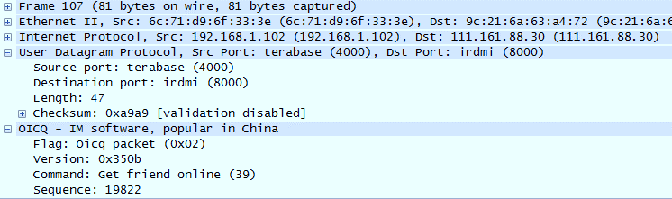

<!-- page: 17 -->

No.3 62 %vs 69%

考察点：UDP的特征

端到端（进程到进程）

无连接、不可靠

简洁、高效

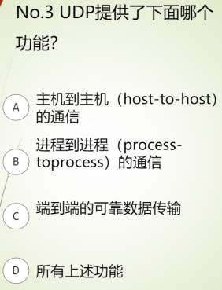

<!-- page: 18 -->

No.4 69% vs 81%

考察点：端口号的定义

<1023 : 用于公共应用

1024~49151 :用户端口，注册端口；

>49152 : 动态端口，私人端口。

例子：主机访问新浪（用nslookup查找IP地址）

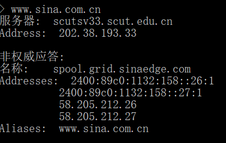

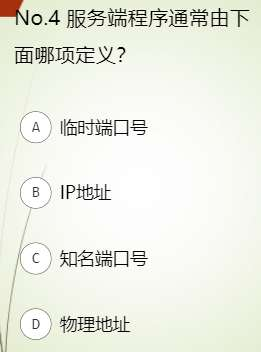

<!-- page: 19 -->

关于UDP段中的checksum

互联网校验和，第3章，P169(3.2.2)

发方：对头部、伪头部和数据进行计算（16位一行），结果填入

checksum字段

收方：一模一样的计算，结果为全零

注意：

P422，可选的校验和，可关闭，提升效率

IP伪头部，为什么需要？

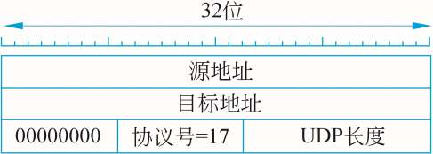

<!-- page: 20 -->

第3章：互联网校验和实例之发方

E3   4F： 1 1 1 0  0 0 1 1  0 1 0 0  1 1 1 1

23   96： 0 0 1 0  0 0 1 1  1 0 0 1  0 1 1 0

44   27： 0 1 0 0  0 1 0 0  0 0 1 0  0 1 1 1

99   F3： 1 0 0 1  1 0 0 1  1 1 1 1  0 0 1 1

补码和： 1 1 1 0  0 1 0 0  1 1 1 1  1 1 1 1   （E4 FF进1）

                                                               1

反码和：1 1 1 0  0 1 0 1  0 0 0 0  0 0 0 0     （E5 00）

取   反：0 0 0 1  1 0 1 0   1 1 1 1  1 1 1 1     （1A FF）

<!-- page: 21 -->

第3章：互联网校验和实例之收方

E3  4F： 1 1 1 0  0 0 1 1  0 1 0 0  1 1 1 1

23   96： 0 0 1 0  0 0 1 1  1 0 0 1  0 1 1 0

44   27： 0 1 0 0  0 1 0 0  0 0 1 0  0 1 1 1

99   F3： 1 0 0 1  1 0 0 1  1 1 1 1  0 0 1 1

1A  4F： 0 0 0 1  1 0 1 0  1 1 1 1  1 1 1 1    (加入校验和运算)

补码和：1 1 1 1  1 1 1 1 1 1 1  1 1 1 1 0

                                                               1

反码和：1 1 1 1  1 1 1 1 1 1 1  1 1 1 1 1

取   反：0 0 0 0  0 0 0 0
0 0 0 0 0 0 0 0

<!-- page: 22 -->

传输控制协议 （6.5 P429）

TCP (Transmission Control Protocol) 是专门为了在不可靠的

互联网络上提供可靠的端到端字节流而设计的

TCP必须动态地适应不同的拓扑、带宽、延迟、分组大小和其它

的参数，并且当有错误的时候，能够足够健壮

<!-- page: 23 -->

TCP 协议   6.5.3 P432

TCP连接上的每个字节都有它自己独有的32位序列号

收发双方的TCP实体以数据段的形式交换数据

一个数据段包括20字节的头部（不包可选）和数据域（0或更多字节）

TCP软件决定数据段的大小，有两个因素限制了数据段的长度：

TCP数据段必须适合IP的65515B（？）的载荷限制

每个TCP数据段必须适合于下层网络的 MTU （如, 1500 字节 – 以

太网载荷大小）

<!-- page: 24 -->

TCP 数据段（TPDU）格式 P434

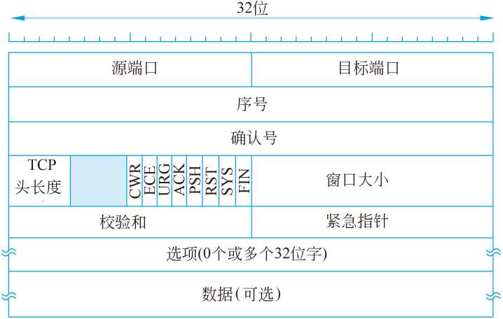

<!-- page: 25 -->

TCP 连接的建立（P436）

如果采用二次握手会怎样呢？

同步，交换初始序列号！

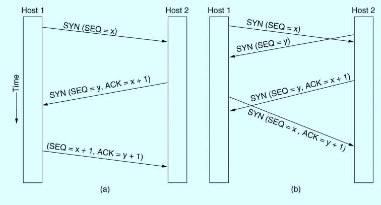

<!-- page: 26 -->

一个三次握手连接建立的实例

打开WireShark，开始抓包

浏览器中访问搜狐：www.sohu.com（111.230.159.21）

在WireShark中停止抓包

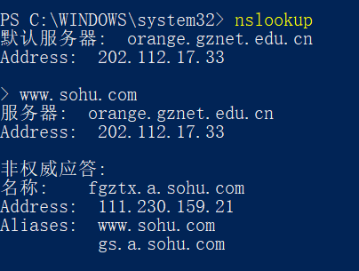

<!-- page: 27 -->

第一次握手信息：SYN=1 ACK=0

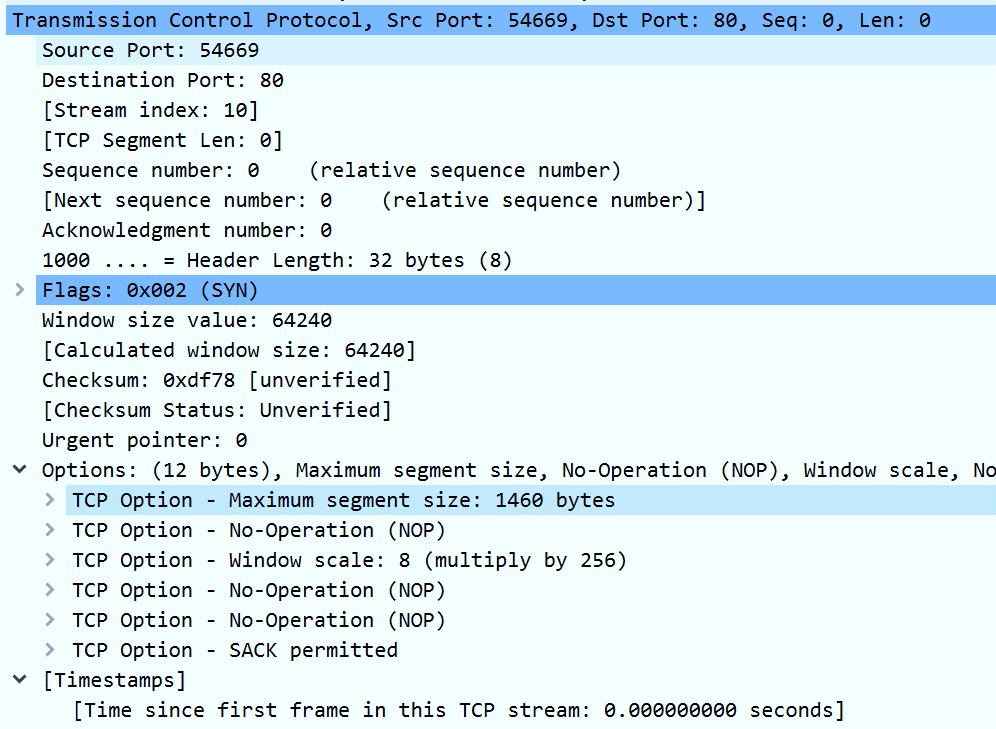

<!-- page: 28 -->

第二次握手信息：SYN=1，ACK=1

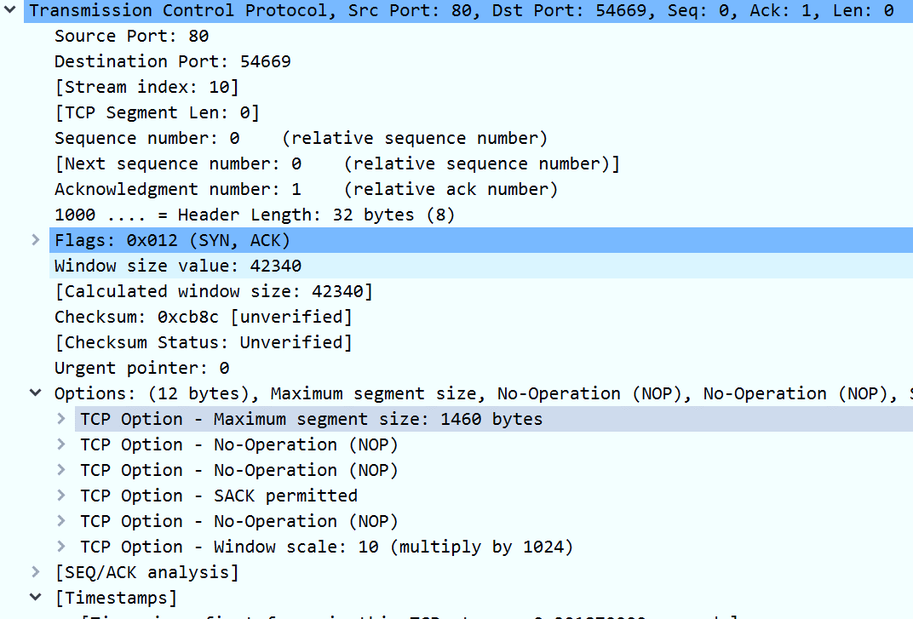

<!-- page: 29 -->

第三次握手信息：SYN=0，ACK=1

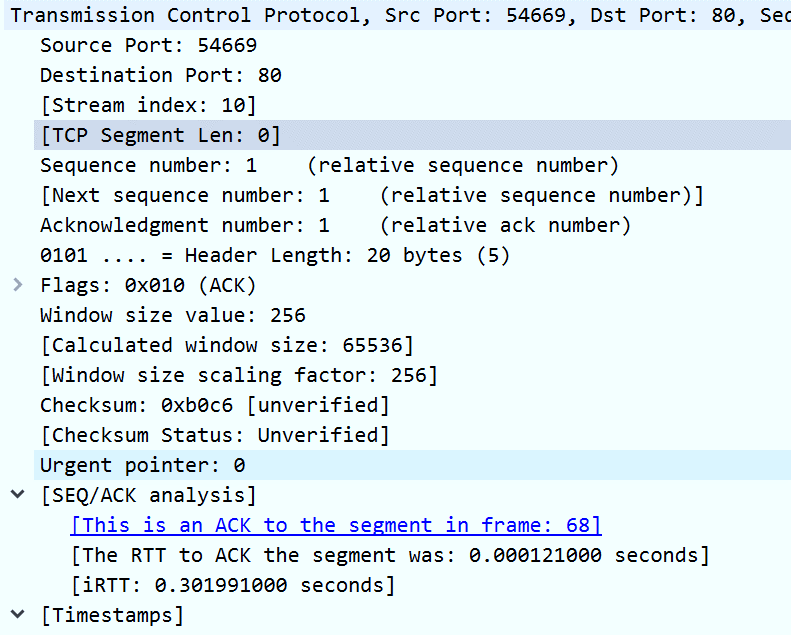

<!-- page: 30 -->

单选题
2分

A和B建立TCP连接，各自的初始序列号分别是200和500，当TCP连接建

立完成之后，它们开始发送数据，A和B各自发送的第一个字节的编号分

别是多少？

201，501

A

201，500

B

200，501

C

200，500

D

提交

<!-- page: 31 -->

Len=？

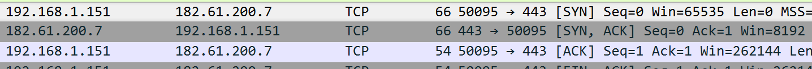

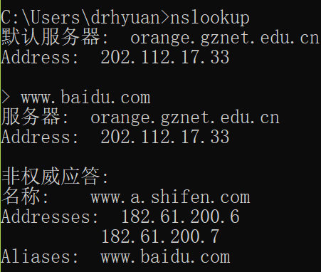

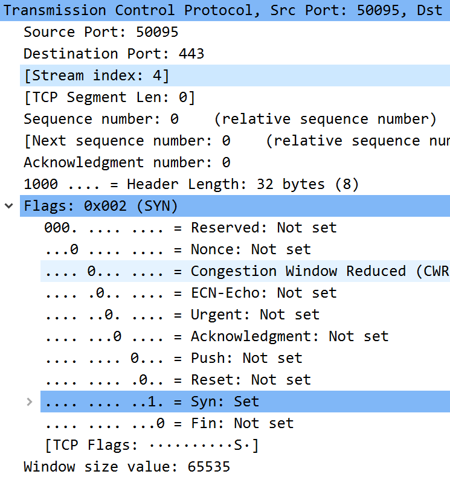

<!-- page: 32 -->

数据段头

主机A的ISN为1000，当A与B建立连接之后，依次发出长度为100、

200、300Byte的段给B时，各段头中的序号分别为多少？B回发的

确认号是多少？

A 发的数据段
B回发的段

段
长度
序号(SN)
1
100
？
2
200
？
3
300
？

ACK包段
ACK No
1
？
2
？
3
？

<!-- page: 33 -->

填空题
12分

主机A的ISN为1000，当A建立连接之后，依次发出长度为100、200、300Byte

的段给B时，各报的序号分别为多少？B回发的确认号是多少？A的第一段序号：

[填空1] ；第二段序号： [填空2]； 第三段序号： [填空3] 。

B的ACK段之确认号：第一次确认号： [填空4] ；第二次确认号： [填空5]； 第三

次确认号： [填空6]

ACK包段
ACK No
1
？[空4]
2
？[空5]
3
？[空6]

段
长度
序号(SN)
1
100
？[空1]

2
200
？[空2]

3
300
？[空3]

正常使用填空题需3.0以上版本雨课堂

作答

<!-- page: 34 -->

参考答案解析示意图

序号(SN)与包的对应关系是：

包头
包头
包头

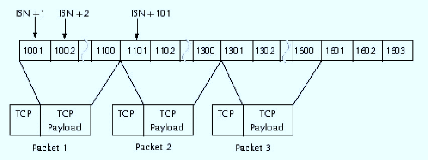

<!-- page: 35 -->

TCP 连接释放（P437）

释放连接

任何一方在没有数据要传送的时候，都可以发送一个FIN置位了的

TCP 数据段
当FIN被确认的时候，该方向的连接被关闭
当双向连接都关闭了的时候，连接释放

为了避免两军队（two-army）问题，使用定时器

如果一方发送了FIN数据段出去却在一个设定的时间没有收到应答，

释放连接
另一方最终会注意到连接的对方已经不在了，超时后连接释放

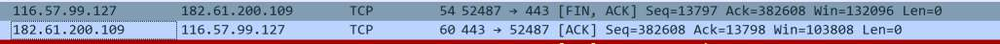

<!-- page: 36 -->

四次握手释放连接

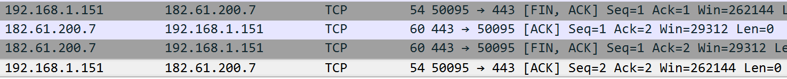

<!-- page: 37 -->

TCP连接管理

事件/动作

每次状态迁移由引发的事件以

及相应动作标记，事件和动作

用斜杠分割

粗线是客户端的正常路径

粗虚线是服务器端的正常路径

细线是不常发生的事件

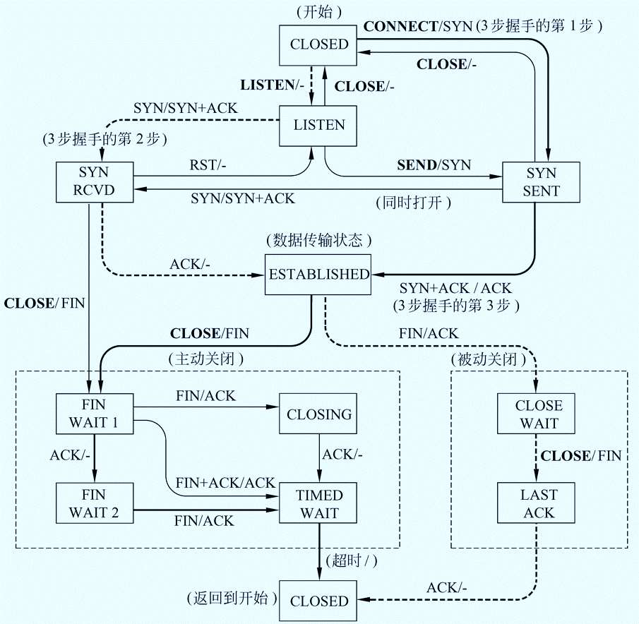

<!-- page: 38 -->

（P439）
(6.5.7)

事件/动作

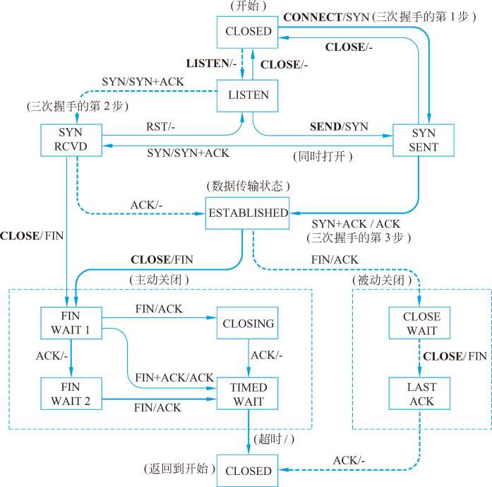

<!-- page: 39 -->

第六章的术语中英文对照

THANKS

<!-- page: 40 -->

重要的术语

Transport layer：传输层

Transport entity：传输实体

Socket：套接字

Port （number）：端口（号）

User datagram protocol（UDP）：用户数据报协议

UDP segment：UDP段

<!-- page: 41 -->

Important terms(update)

Transmission control protocol（TCP）：传输控制协议

TCP segment：TCP段

Three handshake：三次握手

Connection release：连接释放

Slow start：慢启动

Timer：定时器

<!-- page: 42 -->

THANKS

