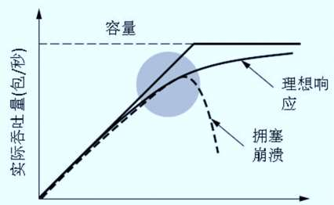
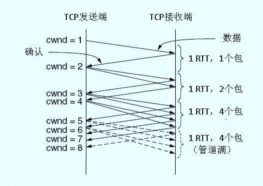
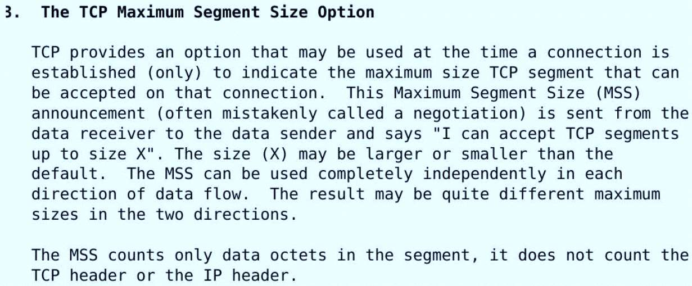
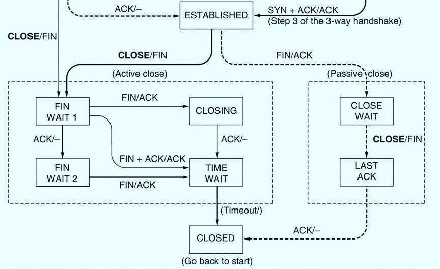
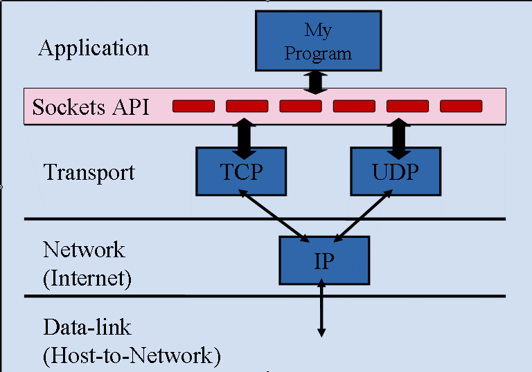
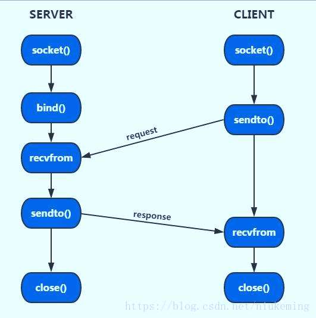

# 20230609_第6章_传输层之2_20230619170604

<!-- page: 1 -->

第六章 传输层（2）

袁华：hyuan@scut.edu.cn

华南理工大学计算机科学与工程学院

广东省计算机网络重点实验室

<!-- page: 2 -->

课前热身（弹幕）

通信五元组指的是哪五个元素？

端点=套接字=应用进程

端口号：0_1023_41952_65535

在以太网上传输的数据段的最大段长度(MSS)是多少？

UDP数据段传输的特点有哪些？

TCP段的段头中的ACK Number字段代表什么含义？

TCP数据段传输的特点有哪些？

TCP连接建立中的第一次握手信息怎么识别？

<!-- page: 3 -->

主要内容

TCP传输策略

发方、收方

拥塞控制


SWND=min{CWND,RWND}

TCP定时器

重传定时器、保活定时器、持续定时器

Socket编程及大作业

<!-- page: 4 -->

TCP传输策略：发送方和接收方

发送方（Nagle’s algorithm）（避免低效）

 尽量不发送数据含量小的数据段

 缓存应用层的数据，达到一定量再发送

接收方（Clark’s solution）（避免傻瓜窗口综合）

 不请求对方发送短数据段(window size)

 延迟窗口变更信息，使接收缓冲区足够大

<!-- page: 5 -->

TCP拥塞控制 P440

虽然网络层也试图管理拥塞，但是，大多数繁重的任务是由TCP来完

成的，因为针对拥塞的真正解决方案是减慢数据率

分组守恒：当有一个老的分组离开之后才允许新的分组注入网络

拥塞检测Congestion detection

所有的互联网TCP算法都假定超时是由拥塞引起的，并且通过监视

超时的情况来判断是否出现问题

<!-- page: 6 -->

TCP 拥塞控制 (P446)

互联网解决方案应该认识到两个潜在的问题：网络容量，

接收者容量，然后单独地处理这两个问题

为此，每个发送者维护两个窗口:

接收者窗口大小反映了接收者目前的容量 （容易获取）

拥塞窗口大小反映了网络目前的容量（难，慢启动）

发送者发送的数据字节数是两个窗口中小的那个窗口数

SWND=min{CWND,RWND}

<!-- page: 7 -->

慢启动：决定拥塞窗口的大小P447

MaxSegS=1024

超时

0
5
10
15
20
25
30
35
40
45

超时

线性增长

Threshold1=32K

线性增长

Threshold14=20K

常数？

指数增长

拥塞窗口

指数增长

序列号

0
2
4
6
8
10
12
14
16
18
20
22
24

关键参数（临界值，接收窗口，拥塞窗口）

<!-- page: 8 -->

看得更仔细一点：指数增长

<!-- page: 9 -->

乘法减小(multiplicative decrease)

“乘法减小“是指不论在慢开始阶段还是拥塞避免阶段，只要出

现一次超时（即出现一次网络拥塞），就把慢开始阈值 ssthresh

设置为当前的拥塞窗口值乘以 0.5。

当网络频繁出现拥塞时，ssthresh 值就下降得很快，以大大减少

注入到网络中的分组数。

<!-- page: 10 -->

加法增大(additive increase)

“加法增大”是指CWND超过阈值之后，在收到对所有报文段的

确认后（即经过一个往返时间），就把拥塞窗口 CWND增加一个

MSS 大小，使拥塞窗口缓慢增大，以防止网络过早出现拥塞。

拥塞避免

上述两种情况合起来叫  “乘减加增”（AIMD）

<!-- page: 11 -->

注意

“拥塞避免”是说在拥塞避免阶段把拥塞窗口控制为按线性规

律增长，使网络比较不容易出现拥塞。

“拥塞避免”并非指完全能够避免拥塞。利用以上的措施要完

全避免网络拥塞还是不可能的。

<!-- page: 12 -->

快重传和快恢复

快重传算法首先要求接收方每收到一个失序的报文段后就立即

发出重复确认。这样做可以让发送方及早知道有报文段没有到

达接收方。

发送方只要一连收到三个重复确认就应当立即重传对方尚未收

到的报文段。

不难看出，快重传并非取消重传计时器，而是在某些情况下可

更早地重传丢失的报文段。

<!-- page: 13 -->

快重传举例

发送方
接收方

发送 M1

发送 M2

确认 M1

确认 M2

发送 M3

丢失

？

发送 M4

重复确认 M2

发送 M5

收到三个连续的
对 M2 的重复确认

重复确认 M2

发送 M6

重复确认 M2

发送 M7

立即重传 M3

t

t

<!-- page: 14 -->

快恢复算法 P445

当发送端收到连续三个重复的确认时，就执行“乘法减小”算

法，把慢开始阈值 ssthresh 减半。但接下去不执行慢启动算法。

由于发送方现在认为网络很可能没有发生拥塞，因此现在不执行

慢启动算法，即拥塞窗口 cwnd 现在不设置为 1，而是设置为慢

开始阈值 ssthresh 减半后的数值，然后开始执行拥塞避免算法

（“加法增大”），使拥塞窗口缓慢地线性增大。

<!-- page: 15 -->

从连续收到三个重复的确认转入拥塞避免

拥塞窗口 cwnd
收到 3 个重复的确认

执行快重传算法

24

拥塞避免
“加法增大”

TCP Reno

拥塞避免
“加法增大”

20

版本

“乘法减小”

16

ssthresh 的初始值

12

新的 ssthresh 值

TCP Tahoe 版本

快恢复

8

(已废弃不用）

4

慢开始

慢开始

传输轮次

2
4
6
8
10
12
14
16
18
20
22
0
0

<!-- page: 16 -->

小结：拥塞控制算法

定义初始拥塞窗口阈值和拥塞窗口大小

Threshold0和cwnd0
指数增长到阈值后，线性增长（拥塞避免），直到超时

超时的时候

乘减：阈值=拥塞窗口减半，即Threshold1 = CWND / 2

重新开始新一次的慢启动

拥塞窗口：cwnd = cwnd0
注意：全程比较，确定发送窗口  swnd=min{cwnd，rwnd}

同学问：如果第一次发出段，就超时了，会怎样？

<!-- page: 17 -->

注意P446

如果收到一个ICMP抑制分组（ ICMP source quench）并被送

给TCP传输实体 ，则这个事件被当作超时对待

<!-- page: 18 -->

MSS和MTU的关系

MTU：最大传输单元

Maximum Transmission Unit

MSS：最大分段尺寸（TCP选项中）

MTU

Maximum Segment Size

帧头
分组头段头
数据
帧尾

MSS

<!-- page: 19 -->

RFC879      P431

<!-- page: 20 -->

单选题
2分

（14年考研题）主机甲和乙已建立了TCP连接，甲始终以MSS=1KB大

小的段发送数据，并一直有数据发送；乙每收到一个数据段都会发出

一个接收窗口为10KB的确认段。若甲在t时刻发生超时时拥塞窗口为

8KB，则从t时刻起，不再发生超时的情况下，经过10个RTT后，甲的

发送窗口是哪个？

9KB

A

10KB

B

12KB

C

14KB

D

提交

<!-- page: 21 -->

TCP可靠传输的保证

采用肯定确认重传和滑动窗口技术（L2）

采用了面向连接的数据传输服务

做了收发双方的优化

采用了拥塞控制技术

接收窗口

拥塞窗口  （慢启动，AIMD加增乘减）

发送窗口=min{接收窗口，拥塞窗口}

快速重传、快速恢复

<!-- page: 22 -->

讨论

TCP在进行窗口尝试的过程中，可能会出现问题吗？（弹幕）

<!-- page: 23 -->

TCP主要用到的4个计时器

重传计时器

Retransmission Timer

持续计时器

Persistance Timer

保活计时器

Keepalive Timer

时间等待计时器

Time-waited Timer

<!-- page: 24 -->

重传计时器

作用：决定是否重传

时间长短如何设定？ P443

过短：频频重传

过长：性能下降

使用算法动态调整

Jacobson算法：

SRTT =α SRTT + (1 −α) R

改进：Karn算法

<!-- page: 25 -->

为什么需要持续计时器？

死锁的发生
A
B

A等待窗

口更新
B等待A

的数据

窗口更新丢失
导致死锁！

<!-- page: 26 -->

持续计时器 上场  persistence timer

解决死锁
A
B

持续计时器

B等待A

的数据

超时，发送

Probe

<!-- page: 27 -->

持续计时器时间长短的设置

设置为 重传计时器的时间值

如果发出一个Probe，未收到窗口更新

再发一个Probe，时间值翻倍

再发，直到超出阈值60s

之后，每60s发一次（如果没有收到更新的情况下），直到窗口

打开

<!-- page: 28 -->

思考

持续计时器是否有必要？上例中B使用重传计时器不就可以了吗？

（弹幕）

<!-- page: 29 -->

为什么需要保活计时器？

设想：

一个客户端和服务器端建立TCP连接，传输了一些数据后，突然崩溃了

但是服务器全然不知

导致，永远开放的死连接

保活计时器 来拯救

<!-- page: 30 -->

使用保活计时器

服务器收到客户端请求，启动 保活计时器

每次收到该客户端的数据，都重置 计时器

时间值：2小时

服务器：未收到客户数据超时，发送Probe，75s再发一个，如

果连续发送10个Probe，未收到任何信息，则假设客户端down了，

释放TCP连接

<!-- page: 31 -->

时间等待计时器

确保最后的FIN数据段，到达对方被丢弃。

时间值：2倍最大数据段生存时间。

<!-- page: 32 -->

单选题
2分

用于阻止TCP连接的长时间空闲，以及用于处理零窗口公告问题的计

时器分别是什么？

保活、时间等待

A

重传、持续

B

保活、持续

C

时间等待、持续

D

提交

<!-- page: 33 -->

比较 TCP 和 UDP

性能
TCP
UDP

可靠性
✓


传输延迟
不确定
网络延迟

拥塞控制
✓


<!-- page: 34 -->

比较 TCP 和 UDP（续）

TCP

可靠传输方式

可让应用程序简单化，程序员可以不必进行错误检查、修正等工作

UDP

为了降低对计算机资源的需求，如DNS

应用程序本身已提供数据完整性的检查机制，勿须依赖传输层的协议来保证

应用程序传输的并非关键性的数据，如路由器周期性的路由信息交换

一对多方式，必须使用UDP（TCP限于一对一的传送），如视频传播

<!-- page: 35 -->

总结

UDP (数据段segment)

比较

TCP (数据段segment)

提高可靠传输的措施 (传输策略)

肯定确认重传

窗口技术 (滑窗技术)

nagle 算法 和 clark方案

拥塞控制 (慢启动)

各种定时器

<!-- page: 36 -->

补充：Socket编程简介

套接字简介

客户/服务器模式的主要接口

实验5

参考资料（推荐）

《UNIX网络编程》richard stevens

《TCP/IP网络互联技术 卷III （winsock版 ）》

《WINDOWS网络编程》微软

<!-- page: 37 -->

套接字简介

套接字接口（socket interface）

由加州大学伯克利分校UNIX小组开发，目前最为流行。

定义了网络上的各种操作（如生成套接字，发送/接收消息等）

常用的套接字接口

Linux/Unix：Berkeley Socket是最突出的一套接口。

Windows：Win Socket ，也称winsock，与BS很类似的接口

<!-- page: 38 -->

套接字介绍

一个IP与一端口（port）

联合在一起形成一个套接

字，它是网络上的一个传

输接口。

在网络的另外一端可有

一个对应的套接字与通信。

<!-- page: 39 -->

客户/服务器模式（C/S）

客户/服务器模式

 TCP/IP网络应用中，最常

用的通信模式是客户/服务

器模式(C/S)，即客户向服

务器发出服务请求，服务

器接收到请求后，提供相

应的服务。

<!-- page: 40 -->

客户/服务器模式（续）

客户端与服务器的连接方式主要有两种：

流式套接口（ TCP）

 流式套接口是可靠的双向通讯的数据流。

 int s=socket(PF_INET,SOCK_STREAM,IPPROTO_TCP);

数据报套接口（UDP）

 简洁、高效的通信。

 int s=socket(PF_INET,SOCK_DGRAM,IPPROTO_UDP);

<!-- page: 41 -->

客户/服务器模式-服务器端

1. 服务器先要端打开一个通信通道，并告知本地主机它

需要在某个端口上（如FTP为21）接收客户请求；

2. 等待客户请求到达该端口；

3. 接收到服务请求，处理该请求并应答。直至交互完成。

4. 返回第二步，等待另一客户请求。

5. 关闭服务器

<!-- page: 42 -->

客户/服务器模式-客户端

1. 打开一个通信通道，连接到服务器所在主机的特定端口（此

时，服务器端已经在这个Socket等待请求）

2. 向服务器发服务请求报文，等待并接收应答；

继续提出请求并等待应答......

3. 请求结束后关闭通信通道并终止

<!-- page: 43 -->

流式套接口的工作流程

Socket() 建立套接字

Bind() 将套接字
与本地地址相关联

Listen() 在指定的端口监听
Socket() 建立套接字

Accept() 接受客户端的请求
Connect() 连接服务器

Send() / Recv()
Read() / Write()
接收请求，作出应答

Send() / Recv()
Read() / Write()
接收请求，作出应答

Close()关闭套接字

服务结束

<!-- page: 44 -->

注意

客户与服务器进程的作用是非对称的，它们各自完成的功能

不同，因此编码也不同。

服务进程一般是先于客户请求而启动的，启动后即在相应的

Socket监听来自客户端的请求。只要系统运行，该服务进程

一直存在，直到正常或强迫终止（daemon）。

<!-- page: 45 -->

客户/服务器模式需用到的接口

服务器方面初始时需要执行的操作

int socket ()
建立一个Socket

int bind()
与某个端口绑定

int listen()
开始监听端口

int accept()
等待/接受客户端的连接请

客户端需要执行的操作

int socket ()
建立一个Socket

int connect()
连接到服务器

<!-- page: 46 -->

UDP套接字工作流程

https://blog.csdn.net/niukeming/article/details/82761676

无须建立连接

<!-- page: 47 -->

课程作业任务（实验5）

实现一个客户端与服务器的互通小程序

服务器端和客户端创建套结字

能够互相传文字（文件、键盘输入或就是固定文字传送）

建议附加功能：

有界面。

在获取文件之前能够先得到文件列表。

支持IPv6

须基于底层的Socket（具体见下页说明），不使用高层

封装的Socket（如Java类库，MFC等）

<!-- page: 48 -->

课程作业要求

平台要求：Linux和windows均可

语言要求：使用C或C++语言

环境要求：不限，Visual C++、TuboC、GCC

使用库要求：为了让同学们更好地理解Socket的运作


Linux平台下只能使用底层库的socket (socket.h)


Windows平台下只能使用Winsock (winsock.h)


请勿使用其它高层封装的Socket库（如Java类库，MFC等）

<!-- page: 49 -->

课程作业提交

提交时间：2023年7月6日

个人独立完成（如想作较大的项目，可自由组合，但不可

超过2个人，且需要预先发email给我确认）

提交内容：实验报告（包括程序流程，主要的接口调用关

系）， 源代码， 可执行程序，以上内容分成三个文件夹存

放（分别是Doc、Src、bin），再统一压缩打包提交到学习

中心，压缩包名字：学号_姓名。

请大家有问题多互相讨论、群内讨论

<!-- page: 50 -->

Thank you！

<!-- page: 51 -->

第六章的术语中英文对照

THANKS

<!-- page: 52 -->

Important terms

Transport layer：传输层

Transport entity：传输实体

Socket：套接字

Port （number）：端口（号）

User datagram protocol（UDP）：用户数据报协议

UDP segment

<!-- page: 53 -->

Important terms(update)

Transmission control protocol（TCP）：传输控制协议

TCP segment ：TCP段

Three handshake：三次握手

Connection release：连接释放

Slow start：慢启动

Timer：定时器

