# 20230613_第7章_应用层_20230619170620

<!-- page: 1 -->

第七章 应用层

袁华：hyuan@scut.edu.cn

华南理工大学计算机科学与工程学院

广东省计算机网络重点实验室

<!-- page: 2 -->

第六章回顾

数据段在哪里传输？

通信五元组包含哪些元素？

套接字指的是什么？

UDP提供什么样的数据段传输服务？

TCP提供什么样的数据段传输服务？

TCP怎么保证可靠？

TCP的发送窗口怎么确定？

TCP的持续定时器用来做什么？

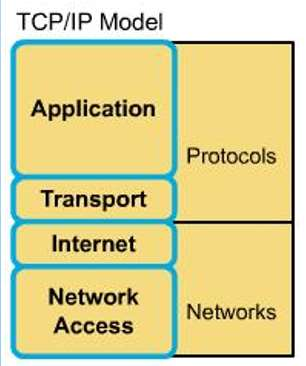

<!-- page: 3 -->

第七章预习

计科1班：81%

网工班：80%

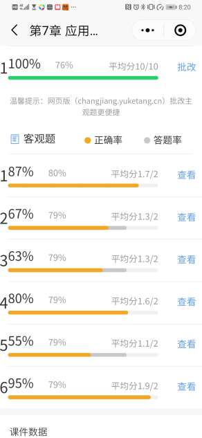

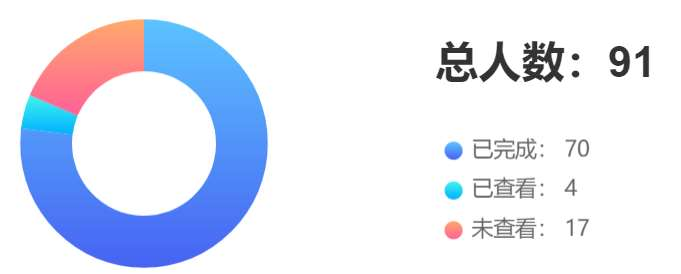

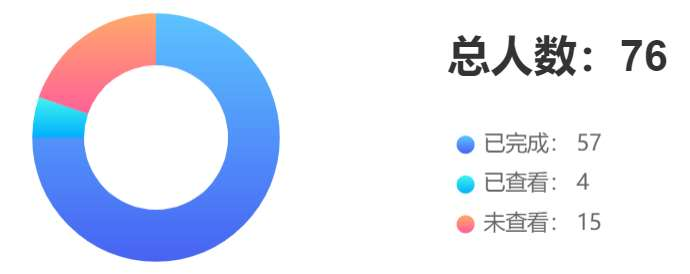

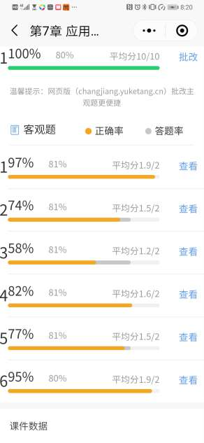

<!-- page: 4 -->

主要内容

域名解析系统（Domain Name System）

重要的应用

电子邮件E-mail

万维网World wide web

文件传输ftp

远程登陆telnet

多媒体Multimedia

Web2.0

……

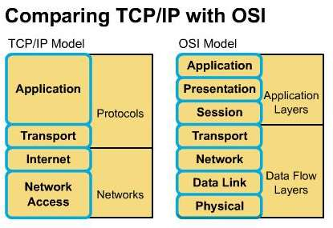

<!-- page: 5 -->

为什么需要域名?（弹幕）

为什么需要域名系统?（弹幕）

<!-- page: 6 -->

域名在域名树上（域名空间）

标签（Label）：域名树上的每个节点有个字符串，称为标签。最

大63个字符

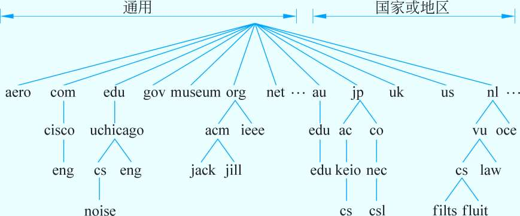

<!-- page: 7 -->

域名和标签有什么关系？

root

域名由标签构成，不超过255个

字符

cn

cn.

从左到右：低级到高级

edu

edu.cn.

两种域名

FQDN：Full Qualified Domain

scut.edu.cn.

scut

Name，完全合格域名，也叫绝对域名

PQDN：Patially Qualified Domain

cs

cs.scut.edu.cn.

Name，部分合格域名，也叫相对域名

<!-- page: 8 -->

域名和Zone

域名是域名空间的一棵子树。

Zone：域名服务器负责或拥有权威的那部分域名空间。

来自：Behrouz A.Forouzan/Sophia C. Fegan《TCP/IP Protocol Suite》

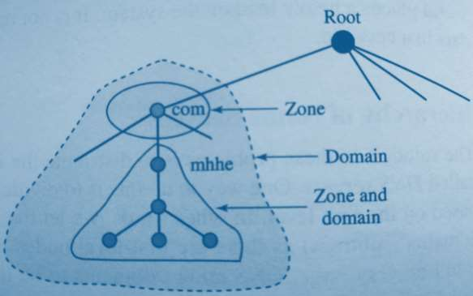

<!-- page: 9 -->

域名服务器

Zone中主服务器 （服务器安放在哪里？）

Zone中还必须有备份服务器

根域服务器：13台（a,b,c…...,m）

代表整个域名空间

域名服务器

权威记录

缓存记录：不权威（具有时效）

<!-- page: 10 -->

域名服务器的主要功能P481

提供域名解析服务：将域名映射为资源记录（A类型、

AAAA类型）

解析方法

递归解析（recursive）

迭代/反复（iterative）

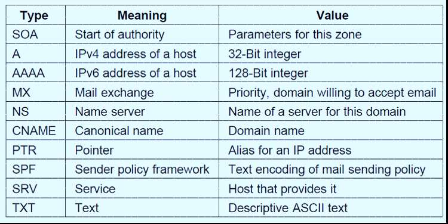

<!-- page: 11 -->

教材上的一个解析例子P484

递归查询 (递归解析、迭代/反复解析)

Flits.cs.vu.nl 想查询 noise.cs.uchicago.edu的IP地址

怎
优
化
？

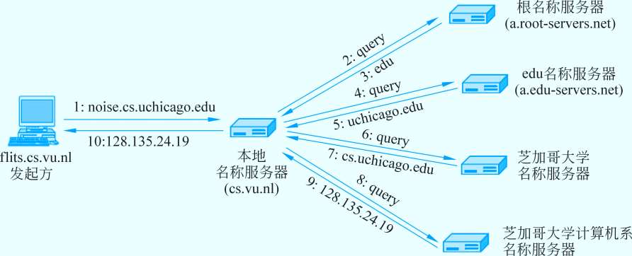

<!-- page: 12 -->

优化方法

高速缓存—减少查询环节，提高效率

上例中，本域中的另一台主机如果查询同一个域名，则马上可得到结果

上例中，本域中的另一台主机如果查询另一个域名，如

galah. cs.uchicago.edu ，则可直接发送到权威域名服务器得到权威记录

缺点：缓存中的内容不具有权威性

<!-- page: 13 -->

DNS消息传递

Port=53
Port=53

Resolver In Client
DNS Name Server

UDP
UDP
TCP
TCP

？

query

Reply(512Byte)

<!-- page: 14 -->

什么时候使用TCP?

UDP报文超过512Bytes

对首次请求响应，返回参数TC置位

再请求，建立TCP连接，将数据流分段发送

从(second)服务器的数据更新

主、从 服务器间建立TCP连接

进行批量数据流传输

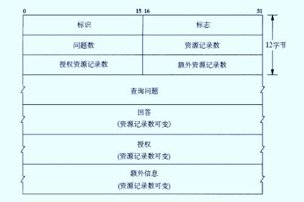

<!-- page: 15 -->

弹幕讨论：查询丢了怎么办？

<!-- page: 16 -->

弹幕讨论：一个大型网站，一个域名对应着一堆IP地址，

DNS解析哪个IP地址？

<!-- page: 17 -->

DNS是否存在不安全的因素？

ICANN诞生前，TLD主要由IANA的Prof. John Postel负责

10台在美国，2欧，1亚（1主在美）

不满商业化，开始“分裂”

Internet  society 信任Postel

Jon Postel 于1998年劫持了根域服务器

可能的攻击点：泛洪查询、伪造应答、缓存。。。。。

<!-- page: 18 -->

No.3习题58% 和 63%

标签的级别就是反应路径的信息

Web服务器在scut三级域名下

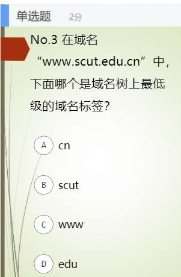

<!-- page: 19 -->

投票
最多可选3项

除了DNS，你每天用得最多的应用是什么？

微信/QQ

A

新闻网站

B

联机游戏

C

MOOC学习，提交作业等

D

抖音/快手/B站
E

电子邮件
F

搜索引擎
G

写博客，输出类
H

其它
I

提交

<!-- page: 20 -->

主要内容

域名解析系统（Domain Name System）

重要的应用

电子邮件E-mail

万维网World wide web

文件传输ftp

远程登陆telnet

多媒体Multimedia

Web2.0

……

<!-- page: 21 -->

电子邮件 （email 伊妹儿）P488

文本邮件 到 多媒体邮件P490

822
5322
MIME

两大构成

MTA

UA

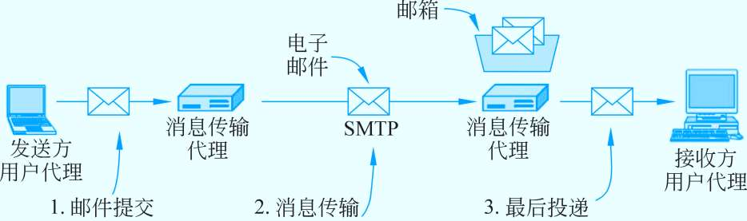

<!-- page: 22 -->

回顾：邮件的发、收

SMTP：运行于

MTA之间

POP3：运行于用户

和服务器之间

都构建在TCP之上

服务端口：25/110

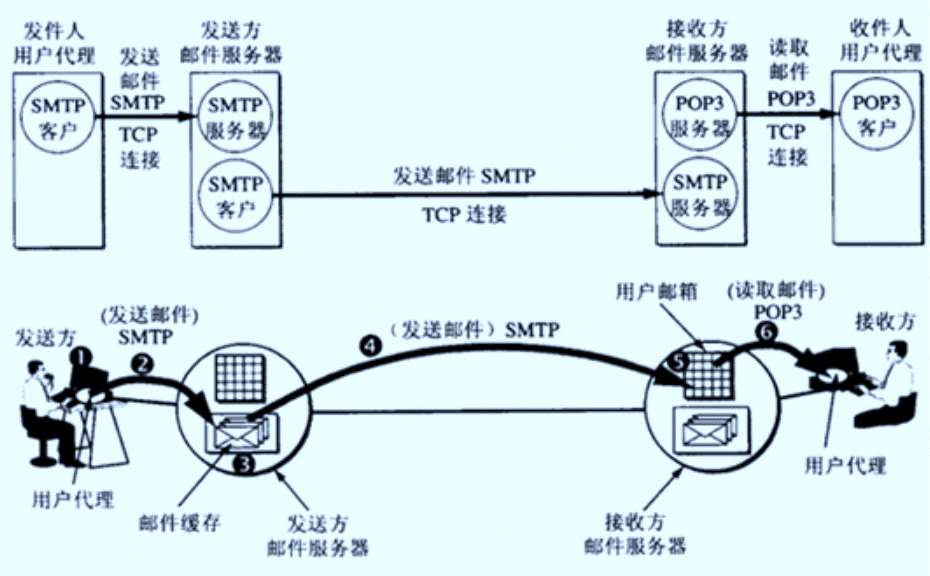

<!-- page: 23 -->

POP3 vs. IMAP

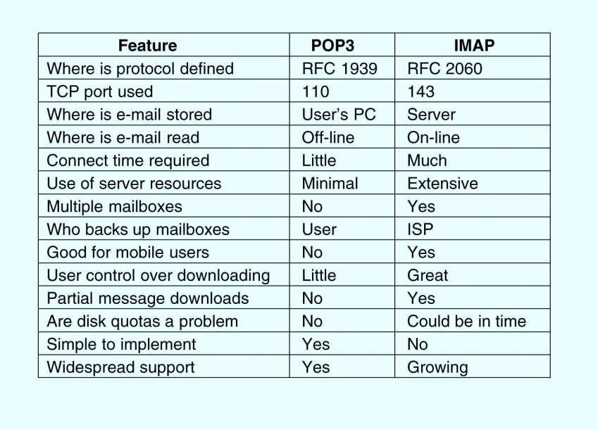

<!-- page: 24 -->

能上网即可用

Webmail  P499

无须配置，浏览器即可

容量有限

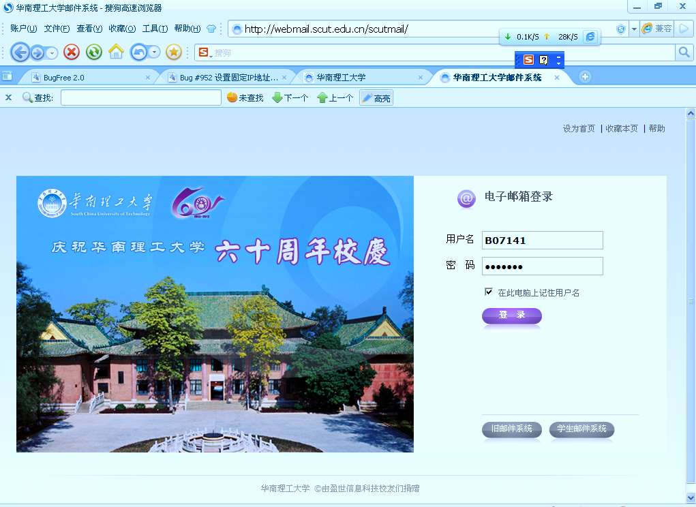

<!-- page: 25 -->

No.5的正确率：77% & 55%

考察点：IMAP的特点

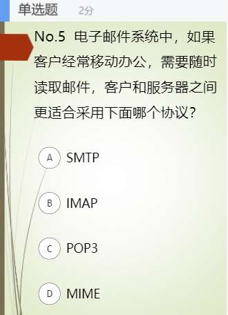

<!-- page: 26 -->

主要内容

域名解析系统（Domain Name System）

重要的应用

电子邮件E-mail

万维网World wide web

文件传输ftp

远程登陆telnet

多媒体Multimedia

Web2.0

……

<!-- page: 27 -->

WWW的组成部分

资源，Web页面，Resource (html)

统一资源定位器：URL

万维

网
区别？

通信协议HTTP（HTTPS）

因特

网
Internet

互联

HTTPs（443端口，TCP）

网
联系？
WWW

证书

协商加密

Hash防篡改

<!-- page: 28 -->

Web的体系结构 P504

超级链接

服务器

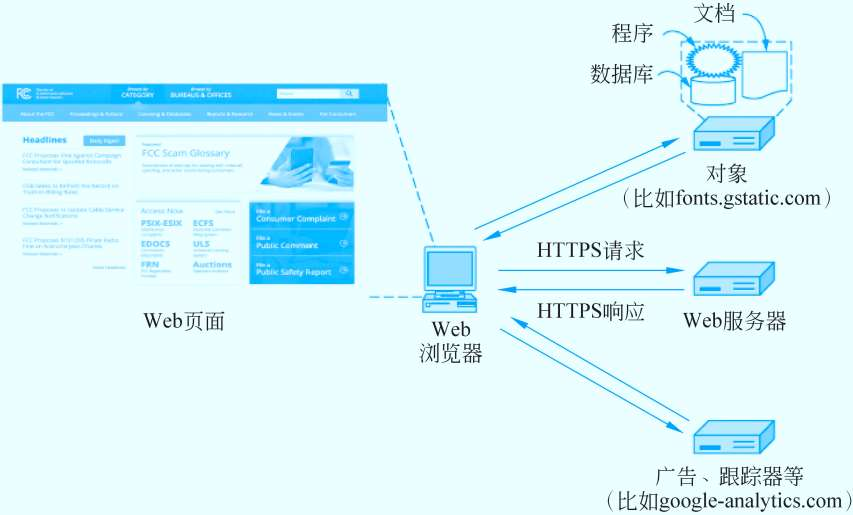

<!-- page: 29 -->

HTTP请求和应答

基于TCP连接

非持续式：一根TCP连接上，一个http请

求和响应（比如，1个页面，页面上10个图

形，需要11根tcp连接）

持续式：一个tcp连接上，可以多个http

请求和响应（只需要一根tcp连接）

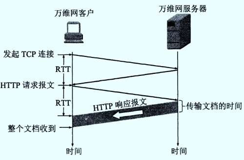

<!-- page: 30 -->

客户端：浏览器

最重要的工作：处理、解释和显示 收到的HTTP响应

插件（内嵌代码）

外挂程序（轻装，只需要调用）

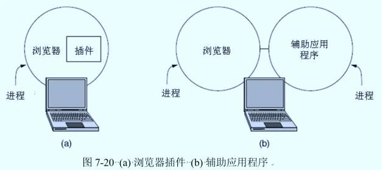

<!-- page: 31 -->

多线程Web服务器 P510

头端 承受 压力

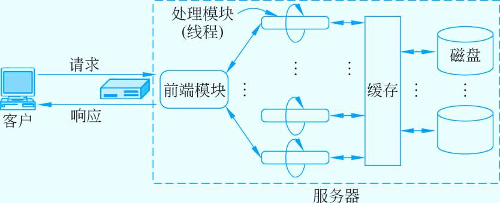

<!-- page: 32 -->

服务器端（续）

客户的TCP连接中止于前端，所以应答也必须经过前端 (a)

一种解决的方法是TCP移交，TCP端点被传递给处理节点 ，所以应

答可以直接向客户端发送 (b)

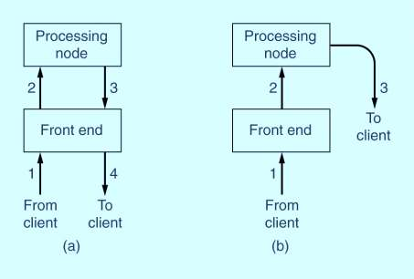

<!-- page: 33 -->

问题来了：P518

不同的用户登录同一个web服务器，想获得不同的资源：个性化

服务

一个电子商城，服务器如何跟踪购物车上的项目？

一个门户网站，如何向定制的用户推送不同的信息？

可能的答案：IP地址

不可行

<!-- page: 34 -->

Cookie P518

一个小于4kB的命名串

当客户请求时，web服务器除了应答外，附送一个cookie，存储

在客户机磁盘

客户再访问同一个web服务器时，同时发送cookie

服务器辨识出该用户，并得到它关心的一些信息

方便的同时，是否侵犯了用户的隐私？

同学问：cookie和session有什么区别？

<!-- page: 35 -->

关于web代理

No proxy server……

源点服务器

这条链路上
的时延很大

校园网

浏览器
R1
R2

2 Mb/s
因特网

所有万维网通信量

都经过这条链路

<!-- page: 36 -->

有了web代理之后

源点服务器

校园网

浏览器
R1
R2

2 Mb/s
因特网

校园网的高速缓存

（代理服务器）

同学问：web代理与CDN有什么不同？（小节7.5.3）

<!-- page: 37 -->

CDN（7.5.3）

内容分发网络（CDN，Content Delivery Network）

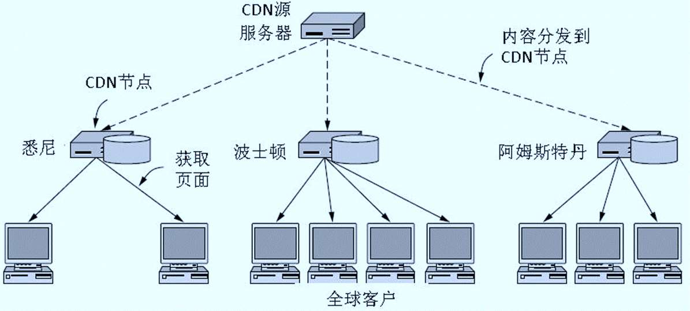

<!-- page: 38 -->

关于VPN…….

虚拟私网 Virtual Private Network

在公用网络上建立专用网络，进行加密通讯。在企业网络中有广

泛应用。

通过一个公用互联网络建立一个临时的、安全的连接，是一条穿

过混乱的公用网络的安全、稳定隧道。

翻墙又是…….

<!-- page: 39 -->

多媒体应用

网上直播

VOD：Video on demand

视频会议

电视转播

远程教育

协同工作

中国移动飞信

<!-- page: 40 -->

多媒体应用相关的协议

Source from Open MASH Multicast Workshop

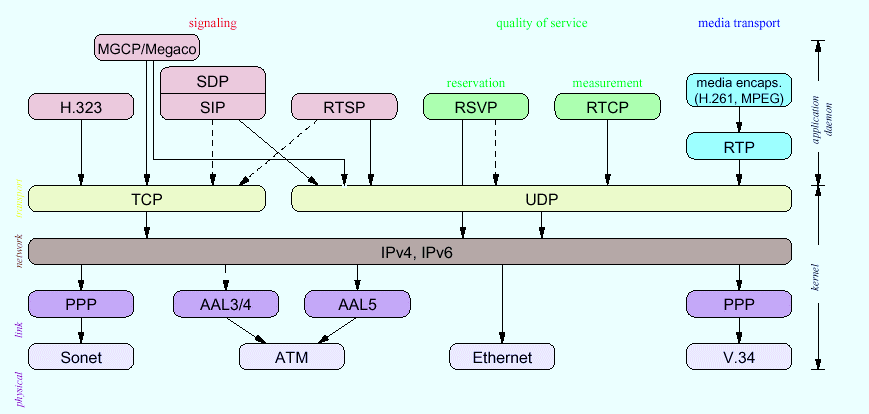

<!-- page: 41 -->

CiscoTele-Presence

<!-- page: 42 -->

华为智真

<!-- page: 43 -->

基于H.323标准的视频会议

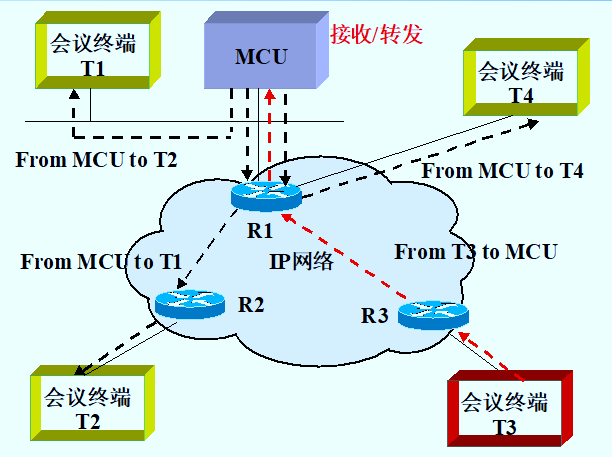

<!-- page: 44 -->

基于组播/MBone的视频会议

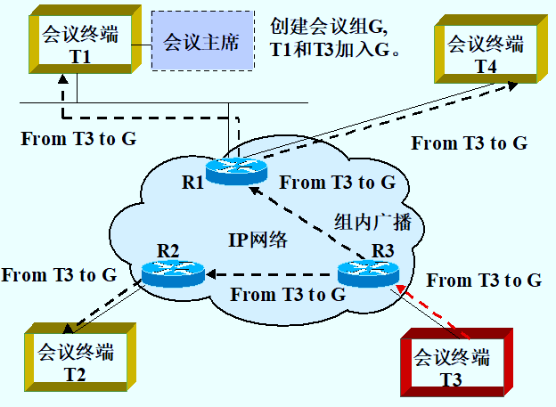

<!-- page: 45 -->

音频和视频应用

音频格式

Mp3/midi/WAV

视频格式

Mpeg1/mpeg2/mpeg4

H.261/H.263/H.264

Wmv

real

<!-- page: 46 -->

P2P应用  P554

完全不同于C/S或B/S的应用

Peer to Peer

Peer= client + server

Peer越多，Server越多，client感觉越爽

对等网络（P2P网络）

结构化

Chord

非结构化

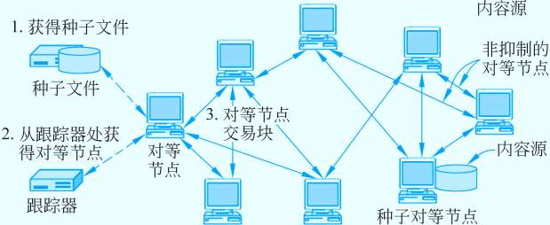

<!-- page: 47 -->

小结

应用层的最大应用：DNS？

普及应用：Web/WWW

经典应用

E-mail、远程登陆、文件传输

其它应用：

流媒体、双师课堂。。。。。。

新兴应用。。。。。。

P2P应用

<!-- page: 48 -->

Thanks！

